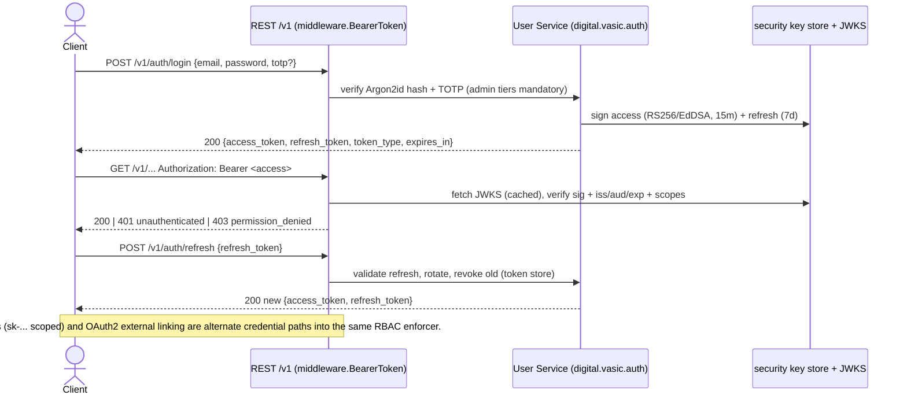
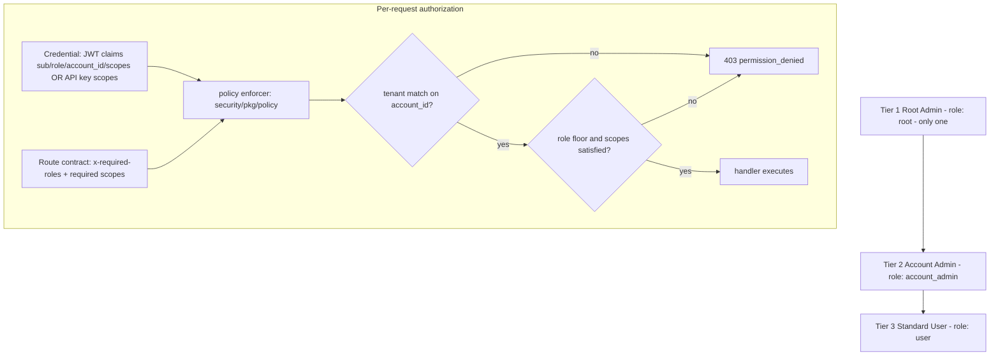

<!--
  Title           : Helix Thready — Authentication & Authorization
  Classification  : PUBLIC
  Location        : docs/public/research/mvp/api/authn-authz.md
  Status          : Draft — v0.1
  Revision        : 1 (2026-07-21)
  Author          : Helix Thready documentation swarm (API & SDKs)
  Related         : ./openapi.yaml, ./rest-endpoints.md, ./error-model.md,
                    ./event-bus-contract.md, ../architecture/index.md
-->

# Helix Thready — Authentication & Authorization

| Rev | Date | Author | Change |
|-----|------|--------|--------|
| 1 | 2026-07-21 | swarm (API & SDKs) | Initial draft grounded in `digital.vasic.auth` |
| 2 | 2026-07-21 | swarm (API & SDKs) | Documented the 4th credential path (HMAC `hmacAuth` for machine callbacks/webhooks); confirmed the 11-scope catalog is 1:1 with `openapi.yaml`; linked contract-tests.md |

## Table of Contents

1. [Scope & grounding](#1-scope--grounding)
2. [Credential types](#2-credential-types)
3. [JWT access + refresh](#3-jwt-access--refresh)
4. [API keys with scopes](#4-api-keys-with-scopes)
5. [OAuth2 external linking](#5-oauth2-external-linking)
6. [Three-tier RBAC](#6-three-tier-rbac)
7. [Scope catalog](#7-scope-catalog)
8. [MFA, sessions, passwords](#8-mfa-sessions-passwords)
9. [Middleware chain (edge enforcement)](#9-middleware-chain-edge-enforcement)
10. [Gaps addressed](#10-gaps-addressed)
11. [Open items](#11-open-items)

## 1. Scope & grounding

Authentication and authorization are provided by **`digital.vasic.auth`**
`[IN-HOUSE: auth]` `[VERIFIED]` (read at source: module `digital.vasic.auth`,
`go 1.25.0`), composed into a new **User Service** `[GAP: New#User Service]` together
with `security/pkg/policy` (enforcer) and the RBAC pattern proven in Catalogizer. This
resolves Q9/Q10 and gap-register items `#10 / 7.2`.

The `auth` module packages actually present at source `[VERIFIED]`:

| Package | Role in Thready |
|---------|-----------------|
| `pkg/jwt` | `Manager.Create/Validate/Refresh`, `Config.SigningMethod` — access+refresh tokens |
| `pkg/token` | `Token` interface, `Claims` map helpers, in-memory store with **TTL + revocation** |
| `pkg/apikey` | `APIKey{Scopes}`, `Generator.Generate(name, scopes, expiry)`, `Validate(store, key)`, `MaskKey`, `HasScope`/`HasAllScopes` |
| `pkg/oauth` + `pkg/oauth2provider` | OAuth2 credential management, refresh, caching, rate limiting |
| `pkg/middleware` | `BearerToken`, `APIKeyHeader`, `RequireScopes`, `Chain`, `ClaimsFromContext`, `ScopesFromContext` |
| `pkg/accesstoken` / `pkg/tokenmanager` | token lifecycle helpers |
| `pkg/i18n` | locale-aware error translation (NoopTranslator default; Thready injects HelixTranslate) |

## 2. Credential types

Three credential types authenticate against the **same** RBAC enforcer (Q10):

- **JWT (access + refresh)** — interactive clients (web, desktop, mobile, TUI login).
- **Scoped API keys (`sk-…`)** — SDK/CLI/automation (non-interactive).
- **OAuth2 authorization-code** — linking external services (Dropbox/GDrive/OneDrive),
  not primary user login.

In `openapi.yaml` these are the `bearerAuth`, `apiKeyAuth`, and `oauth2` security
schemes. The default `security` requirement is `bearerAuth` OR `apiKeyAuth`; a handful
of operations override it (`security: []` for `/auth/login`, `/auth/refresh`,
`/.well-known/jwks.json`, `/healthz`, `/readyz`).

A **fourth, machine-only credential path** exists for server-to-server traffic that is not a
user or an SDK: the `hmacAuth` scheme (`type: apiKey`, header `X-Thready-Signature`, an
**HMAC-SHA256** over the raw body). It authenticates the **inbound 3rd-party callback**
(`POST /v1/processing/callbacks/{provider}` — Boba/MeTube/Download Manager) and the
**outbound `eventDelivery` webhook**. The shared secret is provisioned per provider/sink out
of band and rotated via the secrets pack; a bad signature is `401 unauthenticated`. This
path carries **no RBAC role** (`x-required-roles: []`) — trust is the secret, and the effect
is scoped to the referenced `job_id`/sink. See
[event-bus-contract.md](./event-bus-contract.md) §9.

## 3. JWT access + refresh



> Rendered PNG/SVG exported via Docs Chain (§11.4.65). Source: [diagrams/auth-flow.mmd](./diagrams/auth-flow.mmd).

**Explanation (for readers/models that cannot see the diagram).** A client posts its
email, password and — for admin tiers — a TOTP code to `POST /v1/auth/login`. The User
Service verifies the Argon2id password hash and the TOTP, then asks the `security` key
store to mint two tokens: a short-lived access token (15 minutes) and a longer-lived
refresh token (7 days). Both are returned as a `TokenPair`. On every subsequent call the
client sends `Authorization: Bearer <access_token>`; the `middleware.BearerToken`
validator fetches the JWKS (cached), verifies the signature and the standard claims
(issuer, audience, expiry) plus the `scopes` claim, and either lets the request proceed
(200), rejects an invalid/expired credential (401 `unauthenticated`), or rejects a
credential lacking the required scope/role (403 `permission_denied`). When the access
token nears expiry the client calls `POST /v1/auth/refresh`; the service validates the
refresh token, issues a fresh pair, and **revokes the old refresh token** via the token
store, giving rotation. API keys and OAuth2 are alternate entry paths that resolve into
the very same claims/scopes model, so authorization logic is written once.

**Signing algorithm — the gap.** `[GAP: #10 / 7.2]` `[VERIFIED]` The `auth` module's
`jwt.DefaultConfig` sets `SigningMethod: gojwt.SigningMethodHS256` (symmetric HMAC). HS256
is adequate for a single service that both signs and verifies, but Thready is a
**multi-service** system (REST API, Event Bus service, Asset Service, callback ingress)
where every service must *verify* tokens without holding the *signing* secret. Thready
therefore configures **RS256 (or EdDSA)** asymmetric signing:

```go
// User Service token config — asymmetric signing for multi-service verification.
cfg := jwt.DefaultConfig("")                       // secret unused for asymmetric
cfg.SigningMethod = gojwt.SigningMethodRS256       // or EdDSA (Ed25519)
cfg.Issuer = "thready-user-service"
// private key: loaded runtime-only from gitignored secret (CONST §11.4.10)
manager := jwt.NewManager(cfg)
manager.SetKey(privateKey)                          // sign
// every other service verifies against the PUBLIC JWKS at /.well-known/jwks.json
```

The public keys are published at `GET /v1/.well-known/jwks.json` (unauthenticated) so
any service or SDK can verify tokens; **key rotation** publishes the new key with a fresh
`kid` before retiring the old, and access tokens carry the `kid` header so verifiers pick
the right key. Because `jwt.Manager.Validate` already checks
`t.Method.Alg() == m.config.SigningMethod.Alg()` `[VERIFIED]`, algorithm-confusion
downgrade attacks (`alg: none`, HS256-with-public-key) are rejected.

**Access-token claims** (`[DEFAULT — adjustable]`):

```json
{
  "iss": "thready-user-service",
  "sub": "b1e2…user-uuid",
  "aud": "thready-api",
  "exp": 1721560800, "iat": 1721559900, "kid": "2026-07",
  "role": "account_admin",
  "account_id": "a1c2…account-uuid",
  "scopes": ["posts:read", "posts:write", "assets:read", "accounts:admin"]
}
```

## 4. API keys with scopes

Non-interactive clients mint keys at `POST /v1/api-keys` with an explicit scope list.
Grounded on `pkg/apikey` `[VERIFIED]`:

```go
gen := apikey.NewGenerator(&apikey.GeneratorConfig{Prefix: "sk-", Length: 32})
key, _ := gen.Generate("ci-bot", []string{"posts:read", "search:read"}, expiry)
// key.Scopes == ["posts:read","search:read"]; store.Store(key)
// On each request: apikey.Validate(store, presented) → *APIKey, then key.HasAllScopes(required)
// Logs/UI only ever show apikey.MaskKey(key) → "sk-ab…yz"
```

Rules:

- The full secret is returned **once** at creation (`ApiKey.secret`), never again; only
  the masked form (`apikey.MaskKey`) is shown thereafter.
- Keys are presented as `Authorization: Bearer sk-…`; the `apiKeyAuth` scheme in
  `openapi.yaml`. Scope enforcement is identical to JWT scopes (`RequireScopes`).
- Keys carry an optional `expires_at`; expired/revoked keys fail `apikey.Validate`.
- A key's scopes are a **subset** of the minting principal's scopes — a `user` cannot
  mint a `root:admin` key (enforced server-side, returns 403).

## 5. OAuth2 external linking

OAuth2 (via `pkg/oauth` / `pkg/oauth2provider`) is used to **link external accounts**
(cloud storage presets that also appear in `Auth-KMP`), not for primary login. Flow:
`GET /v1/auth/oauth2/authorize?provider=dropbox&redirect_uri=…` → provider consent →
callback exchanges the code for provider tokens, which are stored **encrypted**
(AES-256-GCM via `security/pkg/securestorage`) against the user, and auto-refreshed with
caching + rate limiting by the module. Provider tokens never enter Thready JWTs.

## 6. Three-tier RBAC



> Rendered PNG/SVG exported via Docs Chain (§11.4.65). Source: [diagrams/rbac.mmd](./diagrams/rbac.mmd).

**Explanation (for readers/models that cannot see the diagram).** Thready has exactly
three roles matching the final request's §6.1 hierarchy. **Root Admin** (`role: root`,
only one exists) has full control of every account and every user. **Account Admin**
(`role: account_admin`) has full control of *their* account and its users. **Standard
User** (`role: user`) has consumer access to the accounts they are members of. A user can
belong to multiple accounts with a different role in each, captured by the `Membership`
list. On every request the enforcer (`security/pkg/policy`) receives two inputs: the
credential (JWT claims — `sub`, `role`, `account_id`, `scopes` — or the API key's scopes)
and the route contract (the operation's `x-required-roles` floor plus the required
scopes). It first checks tenancy: the target resource's `account_id` must match the
principal's account (or the principal must be `root`, which may cross tenants). If the
tenant check fails, the request is denied with 403 `permission_denied`. If it passes, the
enforcer checks that the principal's role meets the route's role floor **and** that the
required scopes are all present; only then does the handler run. This keeps authorization
declarative in the contract (`x-required-roles`) and enforced in one place in Go, never
in the OpenAPI document itself.

**Role floor semantics.** `x-required-roles: [user]` means "any authenticated principal
whose role is at least `user`" — `account_admin` and `root` inherit everything a `user`
can do within their scope; `[account_admin]` additionally requires admin of the target
account (or `root`); `[root]` is root-only; `[]` is unauthenticated.

## 7. Scope catalog

Scopes are fine-grained, orthogonal to roles (`[DEFAULT — adjustable]`; mirrors the
OAuth2 scopes in `openapi.yaml`):

| Scope | Grants |
|-------|--------|
| `posts:read` | read posts/threads/hashtags |
| `posts:write` | register channels, trigger (re)processing |
| `assets:read` | list/read/download assets |
| `assets:write` | manage assets, download jobs, re-download |
| `search:read` | run `/v1/search` |
| `skills:read` | read Skill-Graph |
| `skills:write` | register/update skills |
| `events:read` | subscribe to WS/SSE, read sticky snapshots |
| `accounts:admin` | administer an account + its users, branding, subscription |
| `billing:read` | read subscription/usage/invoices |
| `root:admin` | root-only system administration |

A route requires **both** its role floor and its scope set; e.g. `POST /v1/skills`
requires role `account_admin` **and** scope `skills:write`.

## 8. MFA, sessions, passwords

Resolves Q9 (`[DEFAULT — adjustable]`, tuned to the Aggressive posture):

- **MFA** — **TOTP mandatory for Root Admin and Account Admin**, optional for users.
  Enrolment via `/v1/auth/mfa/totp/enroll` → `/verify`.
- **Sessions** — access token **15 min**, refresh **7 d**, idle timeout **30 min** (web).
  Revocation through the `pkg/token` store (TTL + revocation, `[VERIFIED]`).
- **Passwords** — Argon2id (`security`), **min 12 chars**, breach-list checked.
- **Secrets** — signing keys and OAuth tokens are runtime-loaded from gitignored
  `.env`/`secrets` (`chmod 600/700`), never logged `[CONSTITUTION §11.4.10]`.

## 9. Middleware chain (edge enforcement)

Enforcement happens in the shared chain (`pkg/middleware`), composed with `Chain(...)`,
before any handler — so authz is uniform and un-bypassable:

```go
secured := middleware.Chain(
    reqid.Middleware(),                       // digital.vasic.middleware: request-id
    recovery.Middleware(),                    // panic → 500 internal + trace_id
    cors.Middleware(corsCfg),                 // CORS
    headers.Middleware(),                     // security/pkg/headers
    ratelimiter.Middleware(rlCfg),            // digital.vasic.ratelimiter → 429
    middleware.BearerToken(jwtValidator),     // OR ↓ (auth)
    middleware.APIKeyHeader(apiKeyValidator, store),
    middleware.RequireScopes("posts:read"),   // per-route
)(handler)
// handler reads middleware.ClaimsFromContext(ctx) / ScopesFromContext(ctx)
```

`BearerToken` and `APIKeyHeader` populate the request context with claims/scopes;
`RequireScopes` (and the policy enforcer for role/tenant) gate the route. Rate limiting
sits ahead of auth so anonymous floods are shed cheaply (`[GAP: #14]` DDoS/rate limiting).

## 10. Gaps addressed

- `[GAP: #10 / 7.2]` JWT default HMAC-SHA256 → **RS256/EdDSA + JWKS rotation**
  (multi-service verification) — §3. Verified at source that HS256 is the module default
  and that `Validate` pins the algorithm.
- `[GAP: 7.2]` **No built-in RBAC in `auth`** → a reusable RBAC layer
  (root/account_admin/user) folded into the new **User Service** on
  `security/pkg/policy` — §6. `[GAP: New#User Service]`.
- `[GAP: 7.2]` **TOTP MFA for admin tiers** — §8.
- `[GAP: 7.1 security]` "encrypted yet semantically searchable credentials" — the
  searchable-but-sealed representation is specified in the architecture/database packs;
  the API never returns raw secrets (masked keys, encrypted OAuth tokens) — §4, §5.
- `[GAP: 7.3/7.4 Security-KMP]` mobile secure storage is an **in-memory stub** — the
  API contract is unaffected, but SDK guidance (mobile) **must** block release until
  native Keychain/KeyStore lands; cross-referenced in
  [sdk-strategy.md](./sdk-strategy.md).
- **TDD** — the security negative controls for every claim here (algorithm-confusion
  `alg:none`/HS256-with-public-key rejection, cross-tenant `403`, API-key scope-subset
  enforcement, admin-tier TOTP mandatory, HMAC bad-signature `401`) are written RED-first in
  [contract-tests.md](./contract-tests.md) §security `[CONSTITUTION §11.4.27]`.

## 11. Open items

- `[OPEN: authz-1]` The exact `security/pkg/policy` rule DSL for tenant+role+scope
  composition is finalized with the User Service implementation; this doc fixes the
  *contract* (claims, scopes, role floors), not the enforcer's internal rule syntax.
- `[OPEN: authz-2]` JWKS rotation cadence and `kid` scheme (`[DEFAULT — adjustable]`
  monthly) pending the deployment/secrets pack.

---

*Made with love ♥ by Helix Development.*
