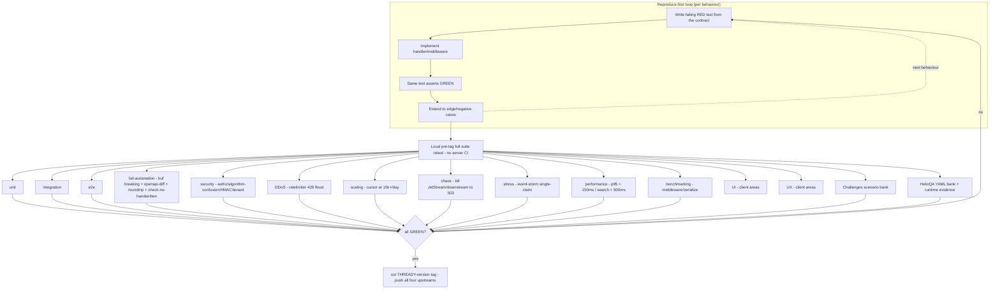

<!--
  Title           : Helix Thready — API Contract Tests (TDD reproduce-first)
  Classification  : PUBLIC
  Location        : docs/public/research/mvp/api/contract-tests.md
  Status          : Draft — v0.1
  Revision        : 1 (2026-07-21)
  Author          : Helix Thready documentation swarm (API & SDKs)
  Related         : ./openapi.yaml, ./rest-endpoints.md, ./authn-authz.md,
                    ./error-model.md, ./event-bus-contract.md, ./versioning.md,
                    ./sdk-strategy.md, ../testing/index.md
-->

# Helix Thready — API Contract Tests (TDD reproduce-first)

| Rev | Date | Author | Change |
|-----|------|--------|--------|
| 1 | 2026-07-21 | swarm (API & SDKs) | Initial draft: reproduce-first RED skeletons for the `/v1` contract, mapped to the 15 mandated test types |

The API area's docs fix a **contract**; this file fixes how that contract is **proven**.
Every behaviour asserted in [rest-endpoints.md](./rest-endpoints.md),
[authn-authz.md](./authn-authz.md), [error-model.md](./error-model.md),
[event-bus-contract.md](./event-bus-contract.md), [versioning.md](./versioning.md) and
[sdk-strategy.md](./sdk-strategy.md) has a **failing RED test written first**, per the
Constitution's reproduce-first TDD rule `[CONSTITUTION §11.4.43/146/115]` and the 15 mandated
test types `[CONSTITUTION §11.4.27]`. The skeletons below are deliberately RED (they reference
handlers/servers that do not exist yet) — that is the point: the test is authored before the
implementation and must fail for the right reason first.

## Table of Contents

1. [Principles](#1-principles)
2. [The gate pipeline](#2-the-gate-pipeline)
3. [15-type coverage map](#3-15-type-coverage-map)
4. [RED-first skeletons](#4-red-first-skeletons)
   - [unit](#unit) · [integration](#integration) · [e2e](#e2e) · [full-automation](#full-automation)
   - [security](#security) · [DDoS](#ddos) · [scaling](#scaling) · [chaos](#chaos)
   - [stress](#stress) · [performance](#performance) · [benchmarking](#benchmarking)
   - [UI](#ui) · [UX](#ux) · [Challenges](#challenges) · [HelixQA](#helixqa)
5. [Gaps addressed & open items](#5-gaps-addressed--open-items)

## 1. Principles

- **Reproduce-first (RED → GREEN → extend).** A behaviour is encoded as a failing test
  *before* the handler exists; the same test asserts GREEN once implemented; then it is
  extended to every edge/negative case. No test is written after the fact to rationalize a
  passing implementation.
- **Real system beyond unit `[CONSTITUTION §11.4.27]`.** Mocks/stubs/TODO are allowed **only
  in unit tests**. Integration, e2e, security, DDoS, scaling, chaos, stress, performance and
  benchmarking exercise the **real** router, middleware chain, Postgres/pgvector, NATS
  JetStream and the generated SDK — no fakes.
- **No server CI `[CONSTITUTION §11.4.156]`.** The suite runs from **local git-hooks** and a
  **pre-tag full-suite retest** `[CONSTITUTION §11.4.75/40]`; only a GREEN full suite lets a
  `THREADY-<version>` tag be cut and pushed to all four upstreams.
- **Anti-bluff.** `SCAFFOLD`/`BUILD-NEW`-backed operations (the `x-thready-maturity` set) get a
  **paired-mutation / negative-control** so a green test proves real behaviour, not a stub
  returning `200` (`[GAP: §12 anti-bluff sweep]`).

## 2. The gate pipeline



> Rendered PNG/SVG exported via Docs Chain (§11.4.65). Source: [diagrams/contract-test-gates.mmd](./diagrams/contract-test-gates.mmd).

**Explanation (for readers/models that cannot see the diagram).** The top subgraph is the
per-behaviour reproduce-first loop: a failing RED test is authored directly from the contract
(an OpenAPI operation, an error-code row, an event guarantee), the handler or middleware is
then implemented, the *same* test is re-run to prove GREEN, and finally the behaviour is
extended to its edge and negative cases before the loop moves to the next behaviour. The
dashed edge back to RED shows this is iterative, not one-shot.

Once behaviours are covered, they roll up into the local **pre-tag full-suite retest** — the
CI-equivalent gate, because server-side CI is forbidden. That gate fans out into the fifteen
mandated test types: the fast `unit`/`integration`/`e2e` core; `full-automation` (the
`buf breaking` + OpenAPI-diff + generated-client round-trip + `check-no-handwritten` drift
guard reused from the `helix_proto` Makefile); the `security` battery (authz, JWT
algorithm-confusion, HMAC callback verification, tenant isolation); `DDoS` (rate-limiter flood
shedding), `scaling` (cursor pagination at 10k+ posts/day), `chaos` (killing JetStream or a
downstream to force a `503` envelope), `stress` (the event-storm single-claim), `performance`
(the p95 SLOs), and `benchmarking` (middleware/serialization micro-benchmarks). `UI` and `UX`
are owned by the client-facing areas ([design/](../design/index.md),
[user-guides/](../user-guides/index.md)) and are cross-referenced rather than duplicated here.
Finally the `Challenges` scenario bank and the `HelixQA` YAML bank (with mandatory runtime
evidence) close the anti-bluff loop.

The decision diamond enforces the rule: unless **every** applicable type is GREEN, the loop
returns to RED; only an all-green suite allows a `THREADY-<version>` tag to be cut and
fanned out to GitHub/GitLab/GitFlic/GitVerse `[CONSTITUTION §11.4.151/§2.1]`. Coverage is
measured as **100% test-type coverage** (every applicable type present for every operation),
not a line percentage — matching §9.1 of the final request.

## 3. 15-type coverage map

Each mandated type maps to at least one concrete API-contract assertion:

| # | Test type | API-contract assertion (target) | Backing tool |
|---|-----------|----------------------------------|--------------|
| 1 | **unit** | Error envelope ↔ code table 1:1; idempotency same-key/diff-body → 409; unknown-enum tolerance | Go `testing`+`testify`, `go-mutesting` |
| 2 | **integration** | Real router + middleware: authn 401, RBAC 403, tenant filter, `202` async + event emit | Go `httptest` + real Postgres/NATS |
| 3 | **e2e** | register channel → `post.received` → process → `asset.ready` over the real stack | Go + Podman-composed services |
| 4 | **full-automation** | `buf breaking` rejects field removal; OpenAPI-diff rejects rename; TS round-trip; `check-no-handwritten` | `helix_proto` Makefile gates |
| 5 | **security** | `alg:none`/HS256-with-pubkey rejected; cross-tenant 403; API-key scope subset; HMAC bad-sig 401; no secret in body; every non-GA op has `x-thready-maturity` | Go + `security` fuzz, Snyk |
| 6 | **DDoS** | anonymous flood → 429 + `Retry-After` shed **before** auth | `vegeta`/`k6` + `ratelimiter` |
| 7 | **scaling** | cursor pagination at 10k+/day returns `total_estimate` (never exact); search SLO holds | `k6` + seeded dataset |
| 8 | **chaos** | kill JetStream/Asset/search → `503 unavailable` (retryable) envelope; reconnect replay | Podman kill + Toxiproxy |
| 9 | **stress** | N concurrent `process` on one post → exactly one `202`, rest `409` (single-claim) | Go `-race` + errgroup |
| 10 | **performance** | REST p95 < 150 ms; search p95 < 500 ms (Q14 Aggressive) | `k6` thresholds |
| 11 | **benchmarking** | middleware chain + envelope (de)serialization micro-benchmarks, tracked over tags | Go `testing.B` |
| 12 | **UI** | client screens consuming these endpoints/events | [design/](../design/index.md) (cross-ref) |
| 13 | **UX** | flows/latency perceived on Web+CLI-first | [user-guides/](../user-guides/index.md) (cross-ref) |
| 14 | **Challenges** | scenario bank: register→process→search→reconnect, asserted+reported | `vasic-digital/challenges` |
| 15 | **HelixQA** | YAML bank per endpoint with runtime evidence (logs/traces) | `HelixDevelopment/helix_qa` |

## 4. RED-first skeletons

All skeletons are **failing on purpose** (they call `newTestServer()` / a client that is not
built yet). They encode the contract; the implementation is written to turn them GREEN.

### unit

```go
// error_envelope_test.go — RED: the mapping table (error-model.md §3) before any handler.
func TestErrorEnvelope_CodeStatusMapping(t *testing.T) {
    cases := []struct{ code string; status int; retryable bool }{
        {"invalid_argument", 400, false}, {"unprocessable", 422, false},
        {"unauthenticated", 401, false}, {"permission_denied", 403, false},
        {"not_found", 404, false}, {"already_exists", 409, false},
        {"conflict", 409, true}, {"failed_precondition", 412, false},
        {"rate_limited", 429, true}, {"deadline_exceeded", 504, true},
        {"unavailable", 503, true}, {"internal", 500, true},
    }
    for _, c := range cases {
        env := apierr.New(c.code, "msg")            // does not exist yet → RED
        require.Equal(t, c.status, env.Error.Status, "status mirror for %s", c.code)
        require.Equal(t, c.retryable, apierr.Retryable(c.code))
        require.NotContains(t, env.Error.Message, "password") // no secret leakage
    }
}

// idempotency_test.go — RED: same key + different body must 409 (error-model.md §5 DDL).
func TestIdempotency_SameKeyDifferentBody_Conflicts(t *testing.T) {
    key := uuid.NewString()
    first := doPOST(t, "/v1/skills", key, `{"id":"s1","name":"a","kind":"atomic"}`)
    require.Equal(t, 201, first.Code)
    replaySame := doPOST(t, "/v1/skills", key, `{"id":"s1","name":"a","kind":"atomic"}`)
    require.Equal(t, first.Body, replaySame.Body)      // replay → original result
    replayDiff := doPOST(t, "/v1/skills", key, `{"id":"s1","name":"CHANGED","kind":"atomic"}`)
    require.Equal(t, 409, replayDiff.Code)             // same key, different body → conflict
}
```

### integration

```go
// authz_integration_test.go — RED: real router + middleware.Chain, real Postgres.
func TestListAccounts_RequiresAuth(t *testing.T) {
    srv := newTestServer(t)                             // wires the real middleware chain → RED
    res := srv.GET("/v1/accounts")                      // no Authorization header
    require.Equal(t, 401, res.Code)
    require.Equal(t, "unauthenticated", res.Envelope().Error.Code)
}

func TestUpdateAccount_UserFloorDenied(t *testing.T) {
    srv := newTestServer(t)
    tok := srv.Login(t, "user@t1", "user")             // role: user
    res := srv.PATCH("/v1/accounts/"+t1ID, tok, `{"name":"x"}`)
    require.Equal(t, 403, res.Code)                     // x-required-roles:[account_admin]
    require.Equal(t, "permission_denied", res.Envelope().Error.Code)
}
```

### e2e

```go
// ingest_to_asset_e2e_test.go — RED: the whole pipeline over Podman-composed real services.
func TestChannelRegister_To_AssetReady(t *testing.T) {
    stack := startRealStack(t)                          // Postgres+pgvector+NATS+services → RED
    defer stack.Stop()
    ch := stack.API.RegisterChannel(t, adminTok, telegramFixture) // Appendix A external_ref
    post := stack.WaitForEvent(t, "post.received", 30*time.Second)
    job := stack.API.Process(t, userTok, post.ID)       // 202 + ProcessingJob
    require.Equal(t, 202, job.Code)
    ready := stack.WaitForEvent(t, "asset.ready", 5*time.Minute)
    require.NotEmpty(t, ready.Payload["asset_id"])
}
```

### full-automation

```bash
# Makefile `all` target — reused verbatim from helix_proto (sdk-strategy.md §6, versioning.md §5).
# RED until the proto/openapi + generators exist.
make -C helix_thready_proto all
#   → lint → breaking → generate → check-no-handwritten → rust-build \
#     → openapi-lint → openapi-generate-ts → roundtrip-test

# breaking_gate_test.sh — RED: prove the gate REJECTS a removed field (not just "runs").
git stash; sed -i '/required: \[error\]/d' openapi.yaml    # simulate a breaking removal
if oasdiff breaking --fail-on ERR base.yaml openapi.yaml; then
  echo "FAIL: breaking change was NOT rejected"; exit 1     # must be non-zero → gate works
fi
git checkout openapi.yaml; git stash pop
```

```ts
// roundtrip.spec.ts — RED: drive the generated TS client against a real stub, inc. neg-control.
import { Configuration, PostsApi } from "@helix-thready/sdk"; // generated → RED until codegen
test("list posts round-trips and 401 is a typed error", async () => {
  const api = new PostsApi(new Configuration({ basePath: STUB, accessToken: TOKEN }));
  const page = await api.listPosts({ limit: 100 });
  expect(page.meta).toHaveProperty("next_cursor");
  await expect(
    new PostsApi(new Configuration({ basePath: STUB })).listPosts({}) // no token
  ).rejects.toMatchObject({ code: "unauthenticated" });               // negative control
});
```

### security

```go
// jwt_algorithm_confusion_test.go — RED: downgrade attacks must be rejected (authn-authz §3).
func TestJWT_RejectsAlgNoneAndHS256WithPublicKey(t *testing.T) {
    v := auth.NewValidator(rs256PublicJWKS)             // pins config.SigningMethod → RED
    require.Error(t, v.Validate(forgeToken(t, "none", nil)))          // alg:none
    require.Error(t, v.Validate(forgeToken(t, "HS256", rs256PubBytes))) // HS256 signed w/ pubkey
}

// hmac_callback_test.go — RED: a bad provider signature is 401 (event-bus §9, hmacAuth).
func TestCallback_BadHMAC_Is401(t *testing.T) {
    srv := newTestServer(t)
    body := `{"job_id":"j1","provider":"metube","state":"completed"}`
    res := srv.POSTRaw("/v1/processing/callbacks/metube", header("X-Thready-Signature","deadbeef"), body)
    require.Equal(t, 401, res.Code)
}

// tenant_isolation_test.go — RED: cross-tenant read never leaks (authn-authz §6).
func TestGetPost_CrossTenant_Is403(t *testing.T) {
    srv := newTestServer(t)
    tok := srv.Login(t, "admin@t1", "account_admin")
    require.Equal(t, 403, srv.GET("/v1/posts/"+t2PostID, tok).Code)
}

// maturity_annotation_test.go — RED/anti-bluff: every non-GA backing op MUST be annotated.
func TestOpenAPI_NonGAOperationsCarryMaturity(t *testing.T) {
    spec := loadOpenAPI(t, "openapi.yaml")
    nonGA := []string{"syncChannel","triggerProcessing","triggerReprocessing","search",
        "redownloadAsset","listDownloads","registerChannel","listSkills","registerSkill",
        "listEventDescriptors","getStickyEvent","ingestCallback","getSubscription",
        "setSubscription","getUsage"}
    for _, id := range nonGA {
        op := spec.OperationByID(id)
        require.Contains(t, []string{"foundation","build_new","design"}, op.Ext["x-thready-maturity"],
            "%s must declare non-GA maturity so it is not presented as GA", id)
    }
}
```

### DDoS

```js
// ddos_ratelimit.k6.js — RED: an anonymous flood is shed with 429 + Retry-After BEFORE auth.
import http from "k6/http"; import { check } from "k6";
export const options = { scenarios: { flood: { executor: "constant-arrival-rate",
  rate: 2000, timeUnit: "1s", duration: "30s", preAllocatedVUs: 200 } } };
export default function () {
  const r = http.get(`${__ENV.BASE}/v1/healthz`);            // unauthenticated edge
  check(r, { "sheds with 429": (x) => x.status === 200 || x.status === 429,
             "429 carries Retry-After": (x) => x.status !== 429 || !!x.headers["Retry-After"] });
}
```

### scaling

```go
// pagination_scale_test.go — RED: at 10k+/day exact totals are avoided (rest-endpoints §1).
func TestListPosts_LargeScale_UsesEstimate(t *testing.T) {
    srv := newTestServerSeeded(t, 250_000)              // seed Large-scale dataset → RED
    page := srv.GETJSON(t, "/v1/posts?limit=200", userTok)
    require.Nil(t, page.Meta.Total)                     // no exact count field
    require.NotNil(t, page.Meta.NextCursor)             // cursor, not offset
    require.LessOrEqual(t, len(page.Data), 200)
}
```

### chaos

```go
// chaos_downstream_test.go — RED: killing JetStream surfaces a retryable 503 envelope.
func TestSearch_EmbedderDown_Is503Retryable(t *testing.T) {
    stack := startRealStack(t)
    stack.Kill("embeddings")                            // fail the embedding provider
    res := stack.API.Search(t, userTok, `{"query":"x"}`)
    require.Equal(t, 503, res.Code)
    require.Equal(t, "unavailable", res.Envelope().Error.Code)
    require.True(t, apierr.Retryable(res.Envelope().Error.Code))
}

// chaos_hashembedder_test.go — RED/anti-bluff: the HashEmbedder stub must FAIL LOUD, not lie.
func TestSearch_HashEmbedder_FailsLoud(t *testing.T) {
    stack := startRealStack(t, withEnv("HELIX_EMBEDDING_PROVIDER", "hash")) // the #1 trap
    res := stack.API.Search(t, userTok, `{"query":"x"}`)
    require.Equal(t, 503, res.Code)                     // NEVER a 200 of garbage relevance
}
```

### stress

```go
// single_claim_stress_test.go — RED: an event storm processes a post exactly once (§3.3).
func TestProcess_EventStorm_ExactlyOneClaim(t *testing.T) {
    srv := newTestServer(t)
    var g errgroup.Group; var accepted, conflicts int64
    for i := 0; i < 128; i++ {                          // 128 concurrent claims on ONE post
        g.Go(func() error {
            res := srv.POST("/v1/posts/"+postID+"/process", userTok, "{}")
            if res.Code == 202 { atomic.AddInt64(&accepted, 1) }
            if res.Code == 409 { atomic.AddInt64(&conflicts, 1) }
            return nil
        })
    }
    _ = g.Wait()
    require.Equal(t, int64(1), accepted)               // exactly one wins
    require.Equal(t, int64(127), conflicts)            // the rest see 409 conflict
}
```

### performance

```js
// perf_slo.k6.js — RED: the Aggressive SLOs (Q14) are gate thresholds, not aspirations.
export const options = { thresholds: {
  "http_req_duration{op:rest}":   ["p(95)<150"],       // REST p95 < 150 ms
  "http_req_duration{op:search}": ["p(95)<500"],       // semantic search < 500 ms
}};
```

### benchmarking

```go
// middleware_bench_test.go — RED: track the chain + envelope (de)serialization cost per tag.
func BenchmarkMiddlewareChain(b *testing.B) {
    h := buildSecuredChain(b)                           // reqid→recovery→cors→headers→ratelimit→authn→scopes
    req := authedRequest(b, "GET", "/v1/posts")
    b.ResetTimer()
    for i := 0; i < b.N; i++ { h.ServeHTTP(discard, req) }
}
func BenchmarkErrorEnvelopeMarshal(b *testing.B) { /* … */ }
```

### UI

UI tests for the screens that consume this contract are owned by the
[design/](../design/index.md) and [user-guides/](../user-guides/index.md) areas (Angular
Jasmine/Karma + Cypress `cypress-axe`, plus Panoptic/`VisualRegression`/`ScreenDiff` per
§11.4.162). `[OPEN: ct-1]` This area supplies the OpenAPI + generated TS client the UI tests
target; the UI/UX assertions themselves live with the client docs — tracked, not duplicated.

### UX

UX flow/latency expectations (Web+CLI-first) are asserted in the
[user-guides/](../user-guides/index.md) area against the same endpoints; the perceived-latency
budget derives from the §performance SLOs above. `[OPEN: ct-1]`.

### Challenges

```yaml
# challenges/thready-api.yaml — vasic-digital/challenges scenario bank (register/run/assert/report).
scenario: thready-api-happy-path
steps:
  - register_channel: { messenger: telegram, external_ref: "${FIXTURE_A}" }
  - await_event:      { type: post.received, timeout: 30s }
  - process_post:     { expect_status: 202 }
  - await_event:      { type: processing.completed, timeout: 300s }
  - search:           { query: "the ingested topic", expect: { min_results: 1, embedder: "llama" } }
  - reconnect_sticky: { entity: post, expect: processing.completed }
assert: { all_steps_green: true, evidence: [logs, traces] }
```

### HelixQA

```yaml
# helix_qa/banks/thready_api.yaml — YAML bank with MANDATORY runtime evidence (anti-bluff).
- id: qa-auth-login-mfa
  request:  { method: POST, path: /v1/auth/login, body: { email: admin@t1, password: "…", totp: "000000" } }
  expect:   { status: 401, body.error.code: unauthenticated }   # bad TOTP for an admin tier
  evidence: [response_body, server_log, trace_id]               # no evidence ⇒ FAIL (bluff)
- id: qa-search-fail-loud
  request:  { method: POST, path: /v1/search, body: { query: "x" }, env: { HELIX_EMBEDDING_PROVIDER: hash } }
  expect:   { status: 503, body.error.code: unavailable }
  evidence: [response_body, server_log]
```

## 5. Gaps addressed & open items

- **CONVENTIONS §6 (Testing / TDD)** — the area now carries reproduce-first RED skeletons for
  all 15 mandated test types `[CONSTITUTION §11.4.27]`; previously the API area had none.
- `[GAP: §12 anti-bluff sweep]` — non-GA (`x-thready-maturity`) operations get paired
  negative-controls (search fail-loud on the HashEmbedder `[GAP: #1]`; maturity-annotation
  guard) so a green suite proves real behaviour, not a stub.
- `[GAP: #14 DDoS]` — the rate-limiter flood shedding is a gate (§DDoS), not a claim.
- `[GAP: #10/7.2 auth]` — algorithm-confusion + tenant-isolation negative controls (§security).
- `[OPEN: ct-1]` UI/UX assertions live with the client-facing areas; this file fixes the
  contract-level and server-side proof and the SDK round-trip. Tracked with those areas.
- `[OPEN: ct-2]` The concrete `k6` vs `vegeta` choice for the perf/DDoS harness is settled with
  the tooling pack; the **thresholds** (p95 < 150 ms / < 500 ms, 429-under-flood) are fixed here.

---

*Made with love ♥ by Helix Development.*
