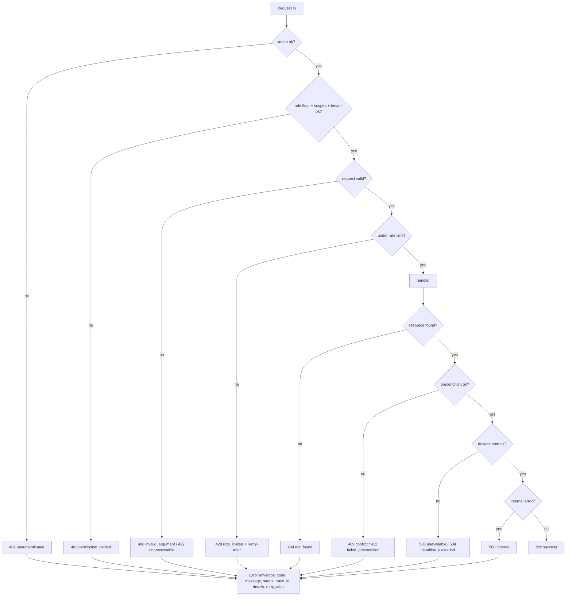

<!--
  Title           : Helix Thready — Canonical Error Model
  Classification  : PUBLIC
  Location        : docs/public/research/mvp/api/error-model.md
  Status          : Draft — v0.1
  Revision        : 1 (2026-07-21)
  Author          : Helix Thready documentation swarm (API & SDKs)
  Related         : ./openapi.yaml, ./rest-endpoints.md, ./authn-authz.md, ./sdk-strategy.md
-->

# Helix Thready — Canonical Error Model

| Rev | Date | Author | Change |
|-----|------|--------|--------|
| 1 | 2026-07-21 | swarm (API & SDKs) | Initial draft: envelope, code table, retry semantics |
| 2 | 2026-07-21 | swarm (API & SDKs) | Added the idempotency-key store DDL (API-owned); linked contract-tests.md; noted universal 401/429/500 |
| 3 | 2026-07-22 | swarm (API & SDKs) | Split the failure-map diagram explanation into true multi-paragraph form (CONVENTIONS §4); tied the retryable/non-retryable handler split to the SDK retry policy. |

## Table of Contents

1. [Principles](#1-principles)
2. [The error envelope](#2-the-error-envelope)
3. [Code table (REST ↔ Protobuf/Connect)](#3-code-table-rest--protobufconnect)
4. [Request-lifecycle failure map](#4-request-lifecycle-failure-map)
5. [Retry, idempotency & rate limiting](#5-retry-idempotency--rate-limiting)
6. [Validation details](#6-validation-details)
7. [Observability](#7-observability)
8. [Gaps addressed & open items](#8-gaps-addressed--open-items)

## 1. Principles

One envelope, everywhere. Because the SDKs are generated from **two** contracts
(OpenAPI 3.1 for REST, Protobuf/Connect for the event/DTO plane — see
[sdk-strategy.md](./sdk-strategy.md)), the error `code` values are chosen to map **1:1**
with the Connect/gRPC canonical codes. A Go/Rust SDK surfacing a Connect error and a
TypeScript SDK surfacing a REST error therefore expose the *same* stable code, so
application error handling is written once. This mirrors the `helix_proto` REST error
taxonomy (`svc-api.md §10`) that HelixVPN already ships `[RESEARCH: helix_proto]`.

- **Stable machine `code`** (string) is the contract; the HTTP status is a mirror.
- **Human `message`** is for developers, not end users; it is non-localized by default
  (localization is available via the `pkg/i18n` translator when a locale is negotiated).
- **`trace_id`** (OpenTelemetry) is always present so a report maps to logs/traces.
- Never leak internals: stack traces, SQL, secrets, or file paths never appear in
  `message`/`details` `[CONSTITUTION §11.4.10]`.

## 2. The error envelope

Every non-2xx response body is exactly (`components.schemas.Error` in `openapi.yaml`):

```json
{
  "error": {
    "code": "permission_denied",
    "message": "role 'user' cannot administer account",
    "status": 403,
    "trace_id": "3f9a1c7e-2b4d-4a10-9f2e-8c1b6d0a5e77",
    "retry_after": null,
    "details": [
      { "field": "account_id", "issue": "not a member", "reason": "tenant_mismatch" }
    ]
  }
}
```

| Field | Type | Notes |
|-------|------|-------|
| `code` | string enum | Stable; see §3. The one field application code should branch on. |
| `message` | string | Developer-facing; safe to log, never contains secrets. |
| `status` | integer | Mirrors the HTTP status line. |
| `trace_id` | string | OTel trace id; quote it in support tickets. |
| `retry_after` | integer \| null | Seconds to wait, when retryable (also a `Retry-After` header). |
| `details[]` | array | Field/structured detail: `{field, issue, reason}`. |

## 3. Code table (REST ↔ Protobuf/Connect)

| `code` | HTTP | Connect/gRPC code | Retryable | When |
|--------|------|-------------------|-----------|------|
| `invalid_argument` | 400 | INVALID_ARGUMENT | no | Malformed body/params. |
| `unprocessable` | 422 | INVALID_ARGUMENT | no | Well-formed but semantically invalid. |
| `unauthenticated` | 401 | UNAUTHENTICATED | no (re-auth) | Missing/invalid/expired credential. |
| `permission_denied` | 403 | PERMISSION_DENIED | no | Role/scope/tenant check failed. |
| `not_found` | 404 | NOT_FOUND | no | Absent or not visible to caller. |
| `already_exists` | 409 | ALREADY_EXISTS | no | Unique-constraint / duplicate create. |
| `conflict` | 409 | ABORTED | maybe | Idempotency mismatch / optimistic-lock conflict. |
| `failed_precondition` | 412 | FAILED_PRECONDITION | no | Precondition (`If-Match`, state) unmet. |
| `rate_limited` | 429 | RESOURCE_EXHAUSTED | yes (after `Retry-After`) | Quota exhausted. |
| `deadline_exceeded` | 504 | DEADLINE_EXCEEDED | yes | Upstream timed out. |
| `unavailable` | 503 | UNAVAILABLE | yes (back-off) | Downstream subsystem down/degraded. |
| `internal` | 500 | INTERNAL | maybe | Unexpected server fault (bug/panic). |

The enum in `openapi.yaml` (`Error.error.code`) is the authoritative list; adding a code
is an additive (non-breaking) change (see [versioning.md](./versioning.md)).

## 4. Request-lifecycle failure map



> Rendered PNG/SVG exported via Docs Chain (§11.4.65). Source: [diagrams/error-model.mmd](./diagrams/error-model.mmd).

**Explanation (for readers/models that cannot see the diagram).** A request is evaluated
by the middleware chain and handler in a fixed order, and the first failing gate
determines the error. Authentication is checked first: a missing or invalid credential
short-circuits to 401 `unauthenticated`. If authenticated, authorization is checked (role
floor, scopes, and tenant match); a failure yields 403 `permission_denied`. Next the
request is validated — a malformed body or bad parameter is 400 `invalid_argument`, while
a well-formed but semantically impossible request (e.g. an unknown enum value in a filter)
is 422 `unprocessable`. The rate limiter runs before the handler, so an over-quota caller
gets 429 `rate_limited` with a `Retry-After` header without touching business logic. These
four gates are the middleware chain: they run in the same order for every route, so an
attacker never learns from the error *which* deeper resource exists — a cross-tenant probe
is stopped at 403 before the 404/200 distinction is even computed.

Once inside the handler, a missing target is 404 `not_found`; an unmet precondition or an
idempotency/optimistic-lock clash is 409 `conflict` or 412 `failed_precondition`; a failed
or timed-out downstream subsystem (Herald, Asset Service, search, JetStream) surfaces as
503 `unavailable` or 504 `deadline_exceeded`, both retryable with back-off; and an
unexpected fault becomes 500 `internal`. The split between the retryable
(`unavailable`/`deadline_exceeded`) and non-retryable (`not_found`/`failed_precondition`)
handler outcomes is exactly what the SDK retry policy keys on (§5).

Every one of these terminal states is rendered through the single error envelope, so a
client parses errors uniformly regardless of which gate failed. Success paths (2xx) skip the
envelope entirely — the envelope is a pure failure channel, which is why a `code` value is
always safe for application code to branch on.

## 5. Retry, idempotency & rate limiting

- **Retryable codes** — `rate_limited`, `unavailable`, `deadline_exceeded` (and
  cautiously `internal`). SDKs retry these with exponential back-off + jitter, honoring
  `Retry-After`. Non-retryable codes (`invalid_argument`, `permission_denied`,
  `not_found`, `unprocessable`) must not be retried blindly.
- **Idempotency** — unsafe POSTs accept an `Idempotency-Key` header (UUID). A replay with
  the same key + body returns the original result; a same-key **different** body returns
  `409 conflict`. Keys are retained 24 h. This mirrors the processing engine's
  idempotent single-claim-per-post at the API edge.

The idempotency ledger is an **API-plane-owned** table (distinct from the domain schema in
the [database area](../database/index.md)); the edge writes it before the handler runs and a
sweeper prunes it after the 24 h window. Real PostgreSQL DDL (`[GAP: #14 edge]`):

```sql
-- API edge idempotency ledger. One row per (principal, key). The body_hash lets a
-- same-key/different-body replay be detected and rejected with 409 conflict.
CREATE TABLE api_idempotency_key (
    principal_id   uuid        NOT NULL,               -- JWT sub or API-key id
    idempotency_key uuid       NOT NULL,               -- client-supplied Idempotency-Key
    request_method text        NOT NULL,
    request_path   text        NOT NULL,
    body_hash      bytea       NOT NULL,               -- sha256 of the canonical request body
    response_status smallint   NOT NULL,
    response_body  jsonb       NOT NULL,               -- cached original result to replay
    trace_id       text        NOT NULL,
    created_at     timestamptz NOT NULL DEFAULT now(),
    expires_at     timestamptz NOT NULL DEFAULT now() + interval '24 hours',
    PRIMARY KEY (principal_id, idempotency_key)
);

-- Partial index drives the retention sweeper (DELETE ... WHERE expires_at < now()).
CREATE INDEX api_idempotency_key_expiry_idx
    ON api_idempotency_key (expires_at);

-- Forward migration:  0007_api_idempotency_key.up.sql   (the CREATE statements above)
-- Rollback migration: 0007_api_idempotency_key.down.sql: DROP TABLE api_idempotency_key;
-- Run via database/pkg/migration.Runner (Q30, expand→contract, tested rollback).
```

The replay/conflict/expiry behaviour above is asserted RED-first in
[contract-tests.md](./contract-tests.md) §stress (event-storm single-claim) and §unit
(same-key different-body → 409).
- **Rate limiting** — enforced by `digital.vasic.ratelimiter` ahead of auth. Responses
  carry `RateLimit-Limit`, `RateLimit-Remaining`, `RateLimit-Reset`; a 429 additionally
  carries `Retry-After`. Limits are per-principal (JWT `sub` / API-key id) and per-IP for
  anonymous endpoints (DDoS shedding, `[GAP: #14]`).

## 6. Validation details

`details[]` gives structured, machine-usable reasons. Example — a bad `SearchRequest`:

```json
{
  "error": {
    "code": "invalid_argument", "status": 400,
    "message": "invalid search request",
    "trace_id": "…",
    "details": [
      { "field": "top_k", "issue": "must be 1..100", "reason": "out_of_range" },
      { "field": "sources[1]", "issue": "unknown source 'videos'", "reason": "enum" }
    ]
  }
}
```

`reason` uses a small controlled vocabulary (`required`, `enum`, `out_of_range`,
`format`, `tenant_mismatch`, `conflict`, `unsupported`) so SDKs can localize or map to
form fields.

## 7. Observability

Every error is emitted with its `trace_id` into the OTel trace and the logrus/ClickHouse
log (`digital.vasic.observability`); 5xx rates and 429 rates feed Prometheus/Grafana SLO
alerts. The `internal` code always logs the underlying cause server-side (never to the
client). Correlation-id and request-id headers are attached by `digital.vasic.middleware`.

## 8. Gaps addressed & open items

- `[GAP: #14]` DDoS mitigation + rate limiting → §5 (edge `ratelimiter`, `Retry-After`,
  per-principal + per-IP).
- `[GAP: #10 error-handling]` uniform error categorization + SLO alerting → §3, §7.
- `[OPEN: err-1]` Per-plan rate-limit tiers are placeholders pending the billing pack —
  `[OPEN: api-2]` in the [area index](./index.md).
- `[OPEN: err-2]` The localized message catalog (en/ru/sr-Cyrl via HelixTranslate) is
  authored with the User Service; this doc fixes the envelope + codes, not the strings.

---

*Made with love ♥ by Helix Development.*
