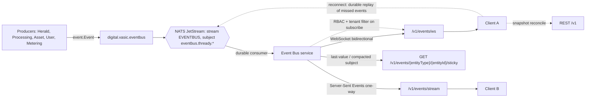

<!--
  Title           : Helix Thready — Event Bus & Real-Time Subscription Contract
  Classification  : PUBLIC
  Location        : docs/public/research/mvp/api/event-bus-contract.md
  Status          : Draft — v0.1
  Revision        : 1 (2026-07-21)
  Author          : Helix Thready documentation swarm (API & SDKs)
  Related         : ./openapi.yaml, ./asyncapi.yaml, ./rest-endpoints.md, ./authn-authz.md,
                    ./error-model.md, ./sdk-examples.md, ../architecture/index.md
-->

# Helix Thready — Event Bus & Real-Time Subscription Contract

| Rev | Date | Author | Change |
|-----|------|--------|--------|
| 1 | 2026-07-21 | swarm (API & SDKs) | Initial draft grounded in `digital.vasic.eventbus` |
| 2 | 2026-07-21 | swarm (API & SDKs) | Added the outbound event-sink DDL + HMAC scheme (`hmacAuth`/`X-Thready-Signature`); linked contract-tests.md |
| 4 | 2026-07-22 | swarm (API & SDKs) | Completeness-critic pass: added the missing `event_sink_delivery_due_idx` partial index (§9) that drives the outbound-webhook retry worker (`state='pending' AND next_retry_at <= now()`, `FOR UPDATE SKIP LOCKED`) — the ledger previously had no index for its retry poller. |
| 3 | 2026-07-22 | swarm (API & SDKs) | **Depth pass, re-verified at `pkg/nats`/`pkg/bus`.** Added §2a "What the module gives vs. what the Event Bus service must build" — the module's NATS subs are **ephemeral `DeliverNew`** (no native replay) on a **`LimitsPolicy` FileStorage** stream (no native last-value/sticky), and `Payload` is `interface{}` (generic-JSON on receive). Made the durable-replay, sticky and at-least-once claims honest against those facts. Added `/v1/event-sinks` CRUD (now in `openapi.yaml`, closes evt-2). Cross-linked the machine contract `asyncapi.yaml`. |

## Table of Contents

1. [Scope & grounding](#1-scope--grounding)
2. [Transport & topology](#2-transport--topology)
   - [2a. Module reality vs. Event Bus service work](#2a-module-reality-vs-event-bus-service-work)
3. [The event envelope](#3-the-event-envelope)
4. [Event catalog](#4-event-catalog)
5. [Subscription patterns (WebSocket / SSE)](#5-subscription-patterns-websocket--sse)
6. [Sticky events & invalidation](#6-sticky-events--invalidation)
7. [Disconnected clients: replay & reconcile](#7-disconnected-clients-replay--reconcile)
8. [Delivery guarantees & idempotency](#8-delivery-guarantees--idempotency)
9. [Outbound webhooks & 3rd-party callbacks](#9-outbound-webhooks--3rd-party-callbacks)
10. [AuthZ on subscriptions](#10-authz-on-subscriptions)
11. [Gaps addressed & open items](#11-gaps-addressed--open-items)

## 1. Scope & grounding

The real-time contract is a **client-facing wrapper** — the new **Event Bus service**
`[GAP: New#Event Bus service]` — over **`digital.vasic.eventbus`** `[IN-HOUSE: eventbus]`
`[VERIFIED: read at source]` and its **NATS JetStream** adapter. This resolves Q3, Q — the
events catalog, and gap-register item `#5`. Producers (Herald, the processing engine, the
Asset Service, the User Service, metering) publish `event.Event`s; the Event Bus service
fans them out to clients over WebSocket and SSE and serves sticky-event snapshots.

The module's shape used here is **verified at source**:

- `event.Event{ ID, Type, Source, Payload, Timestamp, TraceID, Metadata }`; `Type` is a
  dot-notation topic (e.g. `provider.registered`); `event.New(type, source, payload)`
  auto-assigns `ID` and `TraceID` (both UUIDv4) and `Timestamp`
  `[VERIFIED: pkg/event/event.go]`.
- NATS-backed `Bus` with `Publish(*event.Event) error` and
  `Subscribe(ctx, type) (<-chan *event.Event, func(), error)`; a JetStream stream (default
  name **`EVENTBUS`**, default subject prefix **`eventbus`**, `FileStorage`) capturing every
  subject under `<prefix>.>`; subjects are `<SubjectPrefix>.<sanitized event.Type>` (Thready
  sets the prefix to `eventbus.thready`) `[VERIFIED: pkg/nats/nats.go]`.
- Rich subscriber-side filtering: `filter.ByType/ByTypes/BySource/ByGlob/ByPrefix/ByMetadata/
  HasMetadata/And/Or` `[VERIFIED: pkg/filter]` — this is what backs the WS glob
  (`processing.*` → `ByGlob`) and the tenant filter (`metadata.account_id` → `ByMetadata`) in
  §5/§10.

The machine-readable channel/message contract for the whole event plane is
[asyncapi.yaml](./asyncapi.yaml) (AsyncAPI 3.0 — one message per event type, with per-type
payload schemas and `x-sticky`/`x-required-scope`/`x-sticky-key` annotations). This document
is the behavioural spec; `asyncapi.yaml` is the wire contract, as `openapi.yaml` is for REST.

## 2. Transport & topology



> Rendered PNG/SVG exported via Docs Chain (§11.4.65). Source: [diagrams/event-subscription.mmd](./diagrams/event-subscription.mmd).

**Explanation (for readers/models that cannot see the diagram).** System producers —
the Herald thread readers, the processing/Skill-dispatch engine, the Asset Service, the
User Service and the metering service — emit `event.Event` values into
`digital.vasic.eventbus`. The NATS JetStream adapter persists every event to the durable
stream `EVENTBUS` under subjects of the form `eventbus.thready.<type>` (the sanitized
event type appended to Thready's subject prefix, verified `<SubjectPrefix>.<sanitized
event.Type>`).

The Event Bus service attaches to that stream as a **durable consumer** — which, as §2a
records, the service must configure explicitly, because the bare `digital.vasic.eventbus`
module opens *ephemeral* `DeliverNew` subscriptions — and re-publishes to connected clients
through three surfaces: a bidirectional **WebSocket** at `/v1/events/ws` (for clients that
also send subscribe/ack frames), a one-way **Server-Sent Events** stream at
`/v1/events/stream` (for browsers and simple consumers), and a **sticky snapshot** endpoint
`GET /v1/events/{entityType}/{entityId}/sticky` that returns the last retained value of a
sticky event for one entity (served from the last-value store the service maintains, §2a).

When a client disconnects and reconnects, it can either replay missed events directly from
the durable JetStream consumer (by last-acked sequence) or reconcile against a REST snapshot;
both paths are shown as dashed edges. Crucially, the Event Bus service applies RBAC and
tenant filtering at subscribe time — grounded in the module's verified `filter.ByMetadata`
predicate on `metadata.account_id` — so a client only ever receives events for accounts it
may see.

### 2a. Module reality vs. Event Bus service work

The diagram above is the **target**. Read at source, `digital.vasic.eventbus` provides a
solid transport but **not** three of the guarantees this contract promises — so those
guarantees are explicitly the new **Event Bus service**'s job, not something to claim the
module already does. This is the anti-bluff record for the event plane
(`[GAP: §12 anti-bluff]`).

| Guarantee promised here | What the module does today `[VERIFIED: pkg/nats/nats.go]` | What the Event Bus service must add `[BUILD-NEW]` |
|-------------------------|-----------------------------------------------------------|--------------------------------------------------|
| **Durable replay on reconnect** (§7) | `Bus.Subscribe` opens an **ephemeral push** subscription with **`DeliverNew()`** (`nats.go:238,256`) — a reconnecting client only gets events published *after* it re-subscribes; missed events are **not** replayed. | Create a **named durable consumer** per subscriber (or per (account,client)) so JetStream redelivers from the last **acked** sequence. The stream retains history (below), so the data is there; the module just doesn't bind a durable consumer. |
| **Sticky / last-value snapshots** (§6) | The stream is created with **`Retention: LimitsPolicy`, `Storage: FileStorage`** and subjects `<prefix>.>` (`nats.go:131`) — a normal history stream, **no per-subject last-value / compaction**. There is no sticky read in the module. | Maintain last-value per entity via a **JetStream KV bucket** (or a second stream with `MaxMsgsPerSubject: 1`) keyed by `<type>.<entity_id>`, written on publish and **invalidated** on terminal events (§6). `GET …/sticky` reads that store. |
| **At-least-once delivery** (§8) | The **NATS** path uses `AckExplicit()` (`nats.go:257`) → at-least-once **once a durable consumer exists**. The **in-memory** `pkg/bus` path is at-**most**-once: it drops on a full buffer (`BufferSize 1000`, `PublishTimeout 10ms`, `EventsDropped` metric, `pkg/bus/bus.go:30,178`). | Use the **NATS/JetStream** backend (never the in-memory bus) for the client-facing plane, with durable consumers + explicit ack, so no non-sticky event is silently lost within the retention window. |
| **Typed payloads** | `Event.Payload` is `interface{}`; after JSON round-trip it arrives as generic JSON (`map[string]interface{}`, `float64`, …) — the module documents this limitation in `pkg/nats` and it cannot preserve Go types. | Carry the concrete payload schema per `type` (the `asyncapi.yaml` message schemas); SDKs **re-marshal** the received `payload` into the typed struct for that `type` (this is why the `sdk-examples.md` R5 recipe reads `ev.payload["post_id"]` from a generic map before typing it). |

None of these are blockers — the module gives durable JetStream storage, subject routing and
rich filtering for free — but the contract only holds because the Event Bus service adds the
durable-consumer binding, the last-value store and the JetStream-only delivery path on top.
The RED-first proofs (reconnect replays a missed event; a sticky read returns the last value;
back-pressure drops then reconnects) are in
[contract-tests.md](./contract-tests.md) §chaos/§integration, and they will **fail against
the bare module** — which is the point.

## 3. The event envelope

The wire form is the `digital.vasic.eventbus` `event.Event`, rendered identically on
WebSocket frames, SSE `data:` lines, sticky snapshots and outbound webhooks
(`components.schemas.EventEnvelope` in [openapi.yaml](./openapi.yaml)):

```json
{
  "id": "8f0e…-uuid",
  "type": "processing.completed",
  "source": "processing-engine",
  "payload": { "post_id": "…", "status": "succeeded", "skills_applied": ["video.download","research.deep"] },
  "timestamp": "2026-07-21T12:34:56Z",
  "trace_id": "…",
  "metadata": { "account_id": "…", "channel_id": "…" }
}
```

| Field | Source field | Notes |
|-------|--------------|-------|
| `id` | `Event.ID` | UUIDv4; use for idempotent client handling. |
| `type` | `Event.Type` | Dot-notation topic; the subscription selector. |
| `source` | `Event.Source` | Producing service. |
| `payload` | `Event.Payload` | Event-specific; schema per catalog entry (proto message). |
| `timestamp` | `Event.Timestamp` | RFC 3339 UTC. |
| `trace_id` | `Event.TraceID` | Correlates to REST `trace_id` and logs/traces. |
| `metadata` | `Event.Metadata` | String map; carries `account_id` for tenant routing. |

The `payload` shapes are defined once in Protobuf (`proto/helix/thready/v1/events.proto`)
and mirrored into the OpenAPI schemas so REST and event SDKs share the same DTOs (see
[sdk-strategy.md](./sdk-strategy.md), [versioning.md](./versioning.md)).

## 4. Event catalog

`GET /v1/events` returns the machine-readable catalog (`EventDescriptor[]`). Core types
(`[DEFAULT — adjustable]`; a dedicated events catalog documents each per §3.4):

| `type` | Sticky | Payload (summary) | Required scope | Fires when |
|--------|:------:|-------------------|----------------|-----------|
| `channel.registered` | no | channel | `events:read` | A channel is registered. |
| `channel.synced` | **yes** | channel + counts | `events:read` | Poll/backfill completes (last-value). |
| `post.received` | no | post | `posts:read` | A new post/thread is ingested by Herald. |
| `post.processing.claimed` | no | post_id, job_id | `posts:read` | A post is claimed for processing (single-claim). |
| `processing.progress` | **yes** | post_id, progress | `posts:read` | Progress update (last-value per post). |
| `processing.completed` | no | post_id, status, skills | `posts:read` | Processing finishes (success/partial/fail). |
| `asset.download.progress` | **yes** | job_id, progress | `assets:read` | Download progress (last-value per job). |
| `asset.ready` | no | asset_id | `assets:read` | An asset (incl. `…-web` rendition) is ready. |
| `search.index.updated` | no | source_id | `search:read` | New content embedded/indexed. |
| `subscription.updated` | **yes** | account_id, status | `billing:read` | Plan/usage state changes (last-value). |

Sticky types retain their last value keyed by the relevant entity id (§6). One-time types
fire and are consumed.

## 5. Subscription patterns (WebSocket / SSE)

Two live surfaces; both require `events:read` and carry the same envelope.

**WebSocket — `GET /v1/events/ws`** (bidirectional; upgrade with `Authorization: Bearer …`
or `?access_token=`):

```jsonc
// client → server: subscribe frame
{ "op": "subscribe", "types": ["processing.completed", "asset.ready"], "account_id": "…" }
// client → server: filtered subscribe (glob on type)
{ "op": "subscribe", "types": ["processing.*"] }
// server → client: each event
{ "op": "event", "event": { /* EventEnvelope */ } }
// client → server: ack (durable cursor advance)
{ "op": "ack", "id": "8f0e…" }
// client → server: unsubscribe
{ "op": "unsubscribe", "types": ["asset.ready"] }
```

Subscription selectors reuse the module's semantics `[VERIFIED]`: subscribe to specific
types (`Subscribe`/`SubscribeMultiple`), to a filtered set (`SubscribeWithFilter`), or to
everything (`SubscribeAll`) — the server maps `types: ["*"]` to `SubscribeAll`, subject to
RBAC (§10). Wildcards use JetStream subject tokens (`processing.*`).

**SSE — `GET /v1/events/stream?types=processing.completed,asset.ready`** (one-way; ideal
for browsers):

```
: subscribed types=processing.completed,asset.ready
id: 8f0e…-uuid
event: processing.completed
data: {"id":"8f0e…","type":"processing.completed","payload":{…},"trace_id":"…"}

```

SSE uses the standard `id:`/`event:`/`data:` framing; the `id:` is the event id, which the
client sends back as `Last-Event-ID` on reconnect to resume (§7).

> These two routes live under `/v1` but are **not** in `openapi.yaml` (OpenAPI cannot fully
> model a WS upgrade or an infinite SSE stream); they are specified here and mirrored as
> Connect **streaming** RPCs in the proto for Go/Rust SDKs (`[OPEN: sdk-1]`).

## 6. Sticky events & invalidation

Resolves §3.4 and `[GAP: #5 sticky]`. A **sticky** event retains its **last value** so a
newly-connected client immediately learns current state without waiting for the next change:

- **Storage** — implemented as a **compacted JetStream subject** (last-value retained per
  subject) / a last-value cache keyed by entity id — the module's JetStream backing makes
  this native.
- **Snapshot read** — `GET /v1/events/{entityType}/{entityId}/sticky` returns the retained
  `EventEnvelope` for one entity (e.g. the latest `processing.progress` for a post), or 404
  if none is retained.
- **On subscribe** — a WS/SSE subscriber optionally receives the current sticky value for
  each subscribed sticky type before the live stream begins (`replay_sticky: true`).
- **Invalidation** — the retained value is replaced on the next event for that entity, or
  **explicitly invalidated** on a terminal state change (e.g. `processing.completed`
  invalidates `processing.progress`) or a TTL. Invalidation emits a tombstone the client
  applies to drop stale last-values.

Example: a dashboard reconnects, reads `GET /v1/events/post/{id}/sticky` → last
`processing.progress` (0.6), then subscribes to `processing.*` and receives the terminal
`processing.completed`, which invalidates the sticky progress.

## 7. Disconnected clients: replay & reconcile

Two complementary mechanisms (both from §3.4):

1. **Durable replay** — the Event Bus service backs each client by a **durable JetStream
   consumer**; on reconnect the client resumes from its last **acked** id (WS `ack` /
   SSE `Last-Event-ID`), and JetStream replays every missed event **at least once**.
2. **Snapshot reconcile** — for long outages the client re-reads REST snapshots
   (`GET /v1/posts/{id}/processing`, `/v1/events/{entity}/{id}/sticky`) to converge without
   replaying a huge backlog, then resumes the live stream.

## 8. Delivery guarantees & idempotency

- **At-least-once** delivery (JetStream), so consumers **must be idempotent** — dedupe on
  `event.id`. This matches the processing engine's idempotent single-claim design.
- **Ordering** — per-subject (per event type) ordering is preserved by JetStream; no global
  order across types is promised.
- **Back-pressure** — a slow client that stops acking has its durable consumer buffer bounded;
  beyond the bound the server drops the socket with a `unavailable` close and the client
  reconnects + reconciles (§7). Non-sticky one-time events are never silently lost (they
  remain in the durable stream within the retention window).

## 9. Outbound webhooks & 3rd-party callbacks

Two distinct callback surfaces:

**(a) Outbound event webhooks (Thready → subscriber).** For server-to-server subscribers
that prefer HTTP push over a persistent socket, Thready POSTs the same `EventEnvelope` to a
registered sink. Declared as the `eventDelivery` **webhook** in `openapi.yaml` (OpenAPI 3.1
`webhooks`). Signed with the `X-Thready-Signature` **HMAC-SHA256** header (the `hmacAuth`
scheme in `openapi.yaml`, over the raw body — the receiver verifies it); any 2xx acks;
non-2xx triggers exponential-back-off retry from the durable stream.

Sink registration (`[OPEN: evt-2]`, the deferred `/v1/event-sinks` endpoints) is backed by an
**API-plane-owned** table. Real PostgreSQL DDL so the delivery/retry/secret contract is
concrete even before the endpoints ship:

```sql
-- Outbound webhook sinks. secret_enc is the per-sink HMAC secret, sealed at rest by
-- security/pkg/securestorage (AES-256-GCM) — never returned in plaintext after creation.
CREATE TABLE event_sink (
    id            uuid        PRIMARY KEY DEFAULT gen_random_uuid(),
    account_id    uuid        NOT NULL,                 -- tenant that owns the sink
    url           text        NOT NULL,
    event_types   text[]      NOT NULL,                 -- subscribed dot-notation types (glob allowed)
    secret_enc    bytea       NOT NULL,                 -- sealed HMAC secret (never logged)
    active        boolean     NOT NULL DEFAULT true,
    max_attempts  smallint    NOT NULL DEFAULT 8,       -- exponential back-off ceiling
    created_at    timestamptz NOT NULL DEFAULT now(),
    last_delivery_at timestamptz
);

-- Only tenant-scoped, active sinks matching an event's account_id are fanned out.
CREATE INDEX event_sink_account_active_idx
    ON event_sink (account_id) WHERE active;

-- Per-delivery ledger for at-least-once retry + idempotent replay on the subscriber side.
CREATE TABLE event_sink_delivery (
    id            uuid        PRIMARY KEY DEFAULT gen_random_uuid(),
    sink_id       uuid        NOT NULL REFERENCES event_sink(id) ON DELETE CASCADE,
    event_id      uuid        NOT NULL,                 -- EventEnvelope.id (dedupe key)
    attempt       smallint    NOT NULL DEFAULT 0,
    state         text        NOT NULL DEFAULT 'pending', -- pending|delivered|failed|dead
    next_retry_at timestamptz,
    created_at    timestamptz NOT NULL DEFAULT now(),
    UNIQUE (sink_id, event_id)                          -- one live delivery per (sink,event)
);

-- Drives the retry worker: it polls due, not-yet-terminal deliveries
-- (SELECT ... WHERE state='pending' AND next_retry_at <= now() ORDER BY next_retry_at
-- FOR UPDATE SKIP LOCKED). Partial index keeps it small — delivered/dead rows are excluded.
CREATE INDEX event_sink_delivery_due_idx
    ON event_sink_delivery (next_retry_at)
    WHERE state = 'pending';

-- Forward:  0011_event_sink.up.sql (statements above)
-- Rollback: 0011_event_sink.down.sql: DROP TABLE event_sink_delivery; DROP TABLE event_sink;
-- Run via database/pkg/migration.Runner (Q30).
```

**(b) Inbound 3rd-party completion callbacks (Boba / MeTube / Download Manager → Thready).**
Resolves `[GAP: 6.6 callback module]`, `[GAP: 6.5 MeTube webhook]`. A **standardized callback
schema** (`components.schemas.Callback`) is accepted at `POST /v1/processing/callbacks/{provider}`:

```json
{ "job_id": "…", "provider": "metube", "state": "completed",
  "progress": 1.0, "result_asset_ref": "asset:…", "error": null }
```

- One schema for all three providers: `{job_id, provider, state, progress,
  result_asset_ref, error}` — matching §8.1's "job id, state, progress, result/asset ref,
  error" contract.
- Authenticated by a **per-provider HMAC signature** header (not JWT — these are machine
  systems), idempotent on `job_id`.
- On receipt, Thready records the download result, links the asset to the post
  (`AssetLink`), and emits `asset.ready` / `processing.progress` onto the event bus.
- `[GAP: 6.5]` MeTube is **poll-only today** (no outbound webhook); until its webhook is
  built, an internal poller bridges MeTube's `GET /api/postprocess/status` into this same
  callback path, so the contract is stable regardless.

## 10. AuthZ on subscriptions

Subscriptions are RBAC- and tenant-scoped exactly like REST (see
[authn-authz.md](./authn-authz.md)): the WS upgrade / SSE request carries a JWT or API key;
the Event Bus service resolves the principal, and **filters the stream server-side** to
events whose `metadata.account_id` the principal may see (a `user`/`account_admin` sees only
their account; `root` may pass `account_id` to scope). Each catalog entry lists a
`required_scope`; a subscriber lacking it never receives that type. This prevents a
cross-tenant leak through the event plane.

## 11. Gaps addressed & open items

- `[GAP: New#Event Bus service]` client-facing JetStream subscription — the whole document.
- `[GAP: #5]` sticky events + invalidation, durable replay, at-least-once idempotent
  consumers — §6, §7, §8.
- `[GAP: 6.6 / 6.5]` standardized 3rd-party callback contract; MeTube bridge — §9.
- **TDD** — sticky reconnect-reconcile, at-least-once dedupe on `event.id`, HMAC callback
  bad-signature → 401, and back-pressure drop→reconnect are asserted RED-first in
  [contract-tests.md](./contract-tests.md) (§chaos, §security, §integration).
- `[OPEN: evt-1]` The exact sticky implementation is now scoped to **two verified options**
  (JetStream **KV bucket** keyed by `<type>.<entity_id>`, or a second stream with
  `MaxMsgsPerSubject: 1`) — see §2a; the choice is made with the Event Bus service build. The
  **contract** (snapshot endpoint, `replay_sticky`, invalidation semantics) is fixed here.
- `[OPEN: sdk-1]` Go/Rust SDKs may consume events via Connect streaming instead of WS/SSE;
  reconciled in [sdk-strategy.md](./sdk-strategy.md) and demonstrated in
  [sdk-examples.md](./sdk-examples.md) R5.
- `[RESOLVED: evt-2]` Outbound-webhook sink registration is now a **first-class REST group**
  — `GET/POST /v1/event-sinks`, `GET/PATCH/DELETE /v1/event-sinks/{sinkId}` in
  [openapi.yaml](./openapi.yaml) (`EventSink`/`EventSinkCreate`, HMAC secret returned once),
  backed by the `event_sink` DDL in §9 and modelled as the `eventDelivery` channel in
  [asyncapi.yaml](./asyncapi.yaml). The endpoints carry `x-thready-maturity: build_new`.

---

*Made with love ♥ by Helix Development.*
