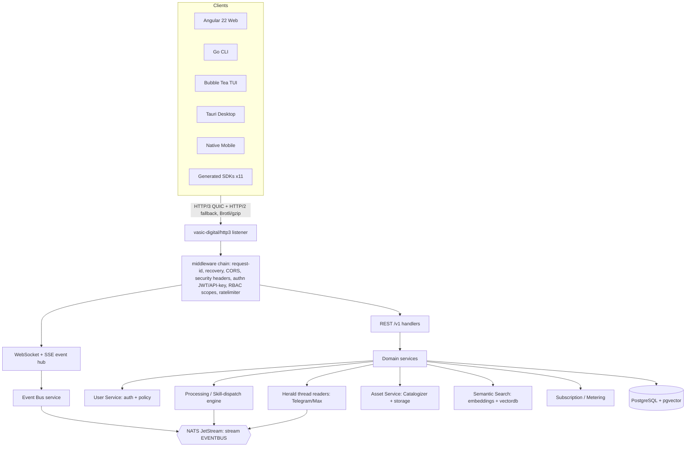

<!--
  Title           : Helix Thready — API & SDKs (Area Index)
  Classification  : PUBLIC
  Location        : docs/public/research/mvp/api/index.md
  Status          : Draft — v0.1
  Revision        : 1 (2026-07-21)
  Author          : Helix Thready documentation swarm (API & SDKs)
  Related         : ./openapi.yaml, ./asyncapi.yaml, ./rest-endpoints.md,
                    ./event-bus-contract.md, ./authn-authz.md, ./error-model.md,
                    ./versioning.md, ./sdk-strategy.md, ./sdk-examples.md,
                    ./contract-tests.md,
                    ../architecture/index.md, ../database/index.md, ../CONVENTIONS.md
-->

# Helix Thready — API & SDKs (Area Index)

| Rev | Date | Author | Change |
|-----|------|--------|--------|
| 1 | 2026-07-21 | swarm (API & SDKs) | Initial draft: OpenAPI 3.1 surface, event contract, authn/authz, error model, versioning, SDK strategy |
| 2 | 2026-07-21 | swarm (API & SDKs) | Second-pass review: added contract-tests.md (TDD, 15 test types); OpenAPI `x-thready-maturity` + `hmacAuth` + full oauth2 scopes + 422 + idempotency; p95 SLO; API-owned DDL (idempotency ledger, event sinks) |
| 4 | 2026-07-22 | swarm (API & SDKs) | **Completeness-critic pass.** Recorded the `#8` VectorDB (pgvector-only; Qdrant/Pinecone/Milvus swap-by-config, P1) gap in the coverage table and at `/search`; fixed a stale `[OPEN: evt-2]`/"deferred" note left inside `openapi.yaml`'s `eventDelivery` webhook (the `/v1/event-sinks` CRUD already ships in the same file); added the missing retry-poller partial index to the `event_sink_delivery` DDL. |
| 3 | 2026-07-22 | swarm (API & SDKs) | **Pass-3 depth (enterprise-complete).** Added **asyncapi.yaml** (AsyncAPI 3.0, one message per event type) and **sdk-examples.md** (7 recipes × 6 languages). Expanded `openapi.yaml` (Rev 3): `GET /version` (closes ver-2), `/v1/event-sinks` CRUD (closes evt-2), request/response examples, fail-loud/lost-race error examples — now 46 paths / 59 operations / 40 schemas. Re-verified auth+eventbus at source: corrected the RS256 story (`jwt.Config.Secret []byte` is HMAC-only; no `SetKey`), `APIKeyHeader(validator, headerName)`, oauth `AutoRefresher` defaults; documented that the NATS module gives ephemeral `DeliverNew` + `LimitsPolicy` (no native replay/sticky) so those are BUILD-NEW. Closed authz-2 (kid scheme). |

This area specifies the **externally-facing contract** of Helix Thready: the REST
`/v1` surface (OpenAPI 3.1), the real-time event subscription contract
(WebSocket/SSE + sticky events), authentication/authorization, the canonical error
model, URL-path versioning, and the multi-language SDK generation strategy. It is the
implementation-ready contract that clients, SDKs and integration tests build against.

All content obeys **[CONVENTIONS.md](../CONVENTIONS.md)** and never contradicts the
authoritative sources (the final answered request, the subsystem gap register). Facts
tagged `[VERIFIED]` were read at module source; proposals are tagged
`[DEFAULT — adjustable]`; every relevant gap-register item is addressed inline with a
`[GAP: id]` tag.

## Upstream / Downstream dependencies

**Upstream (this area consumes):**

- **[architecture/](../architecture/index.md)** — component boundaries, event-driven
  workflow (§2, §3 of the final request), concurrency/idempotency model. The API
  surface is a projection of those components.
- **[database/](../database/index.md)** — the relational schema (posts, threads,
  replies, hashtags, categories, assets, asset_links, processing_state, skills,
  accounts, users, roles, memberships, events, subscriptions, metering, audit) backs
  the response/request schemas here 1:1. The vector store (pgvector) backs `/v1/search`.
- **In-house modules** (decision matrix): `digital.vasic.auth` (authn/authz),
  `digital.vasic.eventbus` (event envelope + NATS JetStream), `digital.vasic.http3`
  (transport), `digital.vasic.middleware` / `ratelimiter` / `security` (edge chain),
  `vasic-digital/helix_proto` (the codegen pattern), `HelixDevelopment/helix_skills`,
  `vasic-digital/herald`, `Catalogizer`. Real interfaces were read at source.

**Downstream (this area feeds):**

- **[design/](../design/index.md)** and **[user-guides/](../user-guides/index.md)** —
  screens and CLI/TUI commands consume these endpoints and events.
- **[testing/](../testing/index.md)** — consumes the reproduce-first RED skeletons in
  [contract-tests.md](./contract-tests.md): the OpenAPI/Protobuf round-trip gate and the 15
  mandated test types target this surface.
- The 11 **generated SDKs** are produced from `openapi.yaml` + the Protobuf contract.

## Files in this area

| File | Purpose |
|------|---------|
| [openapi.yaml](./openapi.yaml) | **The** OpenAPI 3.1 contract for the REST `/v1` surface (46 paths, 59 operations, 40 schemas, webhooks, per-op examples). Schema-first single source of truth. |
| [asyncapi.yaml](./asyncapi.yaml) | **The** AsyncAPI 3.0 contract for the real-time plane: WS/SSE channels, outbound-webhook + inbound-callback channels, **one message per event type** with typed payload schemas. Sibling to `openapi.yaml`. |
| [rest-endpoints.md](./rest-endpoints.md) | Endpoint-by-endpoint behaviour: resource groups, pagination, idempotency, filtering, rate limits, and backing-service maturity per group. |
| [event-bus-contract.md](./event-bus-contract.md) | WebSocket/SSE subscription contract: event envelope, event catalog, subscription patterns, sticky events + invalidation, reconnect/replay, outbound webhooks, and the verified module-reality gap (§2a). |
| [authn-authz.md](./authn-authz.md) | JWT access+refresh (RS256/EdDSA + JWKS), scoped API keys, OAuth2 linking, three-tier RBAC — grounded in and re-verified against `digital.vasic.auth`. |
| [error-model.md](./error-model.md) | Canonical error envelope, the stable code table (1:1 with Protobuf/Connect codes), retry semantics, and the request-lifecycle failure map. |
| [versioning.md](./versioning.md) | URL-path `/v1` versioning, additive-vs-breaking policy, `buf` breaking gate, deprecation/Sunset, proto-package parity, `GET /version`. |
| [sdk-strategy.md](./sdk-strategy.md) | OpenAPI 3.1 + Protobuf codegen via the `helix_proto` pattern (`buf`→Go/Rust, `openapi-generator`→TS/Dart), the 11 target languages, and publishing. |
| [sdk-examples.md](./sdk-examples.md) | Per-language **usage** recipes (7 recipes × Go/TS/Python/Kotlin/Swift/Rust): auth, cursor iteration, idempotent async, search + embedder guard, event subscribe/reconnect, typed errors, transparent JWT refresh. |
| [contract-tests.md](./contract-tests.md) | TDD reproduce-first RED skeletons for the `/v1` contract, mapped to the **15 mandated test types** `[CONSTITUTION §11.4.27]` and the local (no-server-CI) pre-tag gate. |
| [diagrams/](./diagrams/) | Mermaid `.mmd` sources for every diagram in these docs. |

## Surface at a glance

> Rendered PNG/SVG exported via Docs Chain (§11.4.65). Source: [diagrams/api-surface.mmd](./diagrams/api-surface.mmd).

**Explanation (for readers/models that cannot see the diagram).** Every client — the
Angular web portal, the Go CLI, the Bubble Tea TUI, the Tauri desktop app, the native
mobile clients, and the eleven generated SDKs — reaches the system over a single edge
listener provided by `vasic-digital/http3`, which serves HTTP/3 (QUIC) with an HTTP/2
fallback and Brotli/gzip compression. Before any business logic runs, each request
passes through a shared middleware chain (`digital.vasic.middleware` for
request-id/recovery/CORS, `security/pkg/headers` for security headers,
`digital.vasic.auth` for JWT/API-key authentication and RBAC scope checks, and
`digital.vasic.ratelimiter` for quotas). Authenticated requests then split into two
planes: the synchronous REST `/v1` handlers and the real-time WebSocket/SSE event hub.

The REST handlers delegate to domain services — the User Service (built on
`digital.vasic.auth` + `security/pkg/policy`), the extended Herald thread readers for
Telegram and Max, the processing / Skill-dispatch engine, the Asset Service
(Catalogizer + `digital.vasic.storage`), the in-house semantic search
(`embeddings` + `vectordb`/pgvector), and the subscription/metering service. These
services persist to a single PostgreSQL instance that also hosts pgvector, keeping the
datastore count low. The event hub is fed by the Event Bus service, a thin client-facing
wrapper over `digital.vasic.eventbus` and its NATS JetStream stream `EVENTBUS`; the
Herald readers and the processing engine publish events (e.g. `post.received`,
`processing.completed`) onto that stream, which the hub fans out to subscribed clients.

## Gap-register items addressed in this area

| Gap | Where addressed |
|-----|-----------------|
| `#10 / 7.2` auth JWT default HMAC-SHA256 → asymmetric + JWKS + RBAC + MFA | [authn-authz.md](./authn-authz.md) |
| `#20 / New` User Service (three-tier multi-tenant RBAC) | [authn-authz.md](./authn-authz.md), [rest-endpoints.md](./rest-endpoints.md) |
| `#5 / New` Event Bus service (client-facing JetStream subscription) + sticky events | [event-bus-contract.md](./event-bus-contract.md) (incl. verified module-reality §2a), [asyncapi.yaml](./asyncapi.yaml) |
| `#11` SDK generation (OpenAPI 3.1 + Protobuf, helix_proto pattern) | [sdk-strategy.md](./sdk-strategy.md), [sdk-examples.md](./sdk-examples.md) |
| `#18` TS client libs / scaffolds (no CI, no deep audit) | [sdk-strategy.md](./sdk-strategy.md), [sdk-examples.md](./sdk-examples.md) |
| `#1` HelixLLM HashEmbedder trap (search must use real embedder) | [rest-endpoints.md](./rest-endpoints.md) `/search` |
| `#6 / 4.1` helix_skills has no execution engine (dispatch is BUILD-NEW) | [rest-endpoints.md](./rest-endpoints.md) processing |
| `#3 / 5.1` Herald Telegram reader trapped in QA harness; Max = stub | [rest-endpoints.md](./rest-endpoints.md) channels |
| `New` Semantic-search service (Lumen-style, in-house) | [rest-endpoints.md](./rest-endpoints.md) `/search` |
| `#8` VectorDB pgvector-only (Qdrant/Pinecone/Milvus swap-by-config, P1) | [rest-endpoints.md](./rest-endpoints.md) `/search` §2.8/§3 |
| `#6.6 / 6.5` standardized 3rd-party callback contract; MeTube webhook | [event-bus-contract.md](./event-bus-contract.md), [rest-endpoints.md](./rest-endpoints.md), [contract-tests.md](./contract-tests.md) |
| `#14` DDoS/rate limiting at the edge | [error-model.md](./error-model.md), [authn-authz.md](./authn-authz.md), [contract-tests.md](./contract-tests.md) |
| `§12` anti-bluff sweep (non-GA ops proven, not claimed) | [contract-tests.md](./contract-tests.md) (`x-thready-maturity` guard + fail-loud negative controls) |
| CONVENTIONS §6 (TDD reproduce-first, 15 test types) | [contract-tests.md](./contract-tests.md) |

## Open items (tracked)

See each file's "Open items" section. Summary of what **remains open** after the Pass-3
depth sweep:

- `[OPEN: api-1]` The Protobuf event/DTO contract (`proto/helix/thready/v1/*.proto`) is
  specified structurally here (and mirrored in [asyncapi.yaml](./asyncapi.yaml)) but the
  `.proto` files themselves are produced with the code, in the `helix_thready_proto` repo —
  tracked in [sdk-strategy.md](./sdk-strategy.md).
- `[OPEN: api-2]` Concrete rate-limit tiers per plan are placeholders pending the
  billing/metering pack — tracked in [error-model.md](./error-model.md).
- `[OPEN: api-3]` Zig has no first-class OpenAPI/Protobuf generator; SDK path is
  hand-written over the C ABI / REST — tracked in [sdk-strategy.md](./sdk-strategy.md).

**Closed / advanced in this pass:** `[RESOLVED: ver-2]` `GET /version` added to
`openapi.yaml`; `[RESOLVED: evt-2]` `/v1/event-sinks` CRUD added; `[RESOLVED: authz-2]`
`kid` scheme + rotation cadence fixed (authn-authz §11); `[RESOLVED: rest-1]` per-endpoint
examples now in `openapi.yaml` + [sdk-examples.md](./sdk-examples.md). New tracked build
items surfaced by source re-verification: `[BUILD-NEW: auth-rs256]` (extend `jwt.Config` for
asymmetric keys) and the Event Bus service's durable-consumer + last-value work
([event-bus-contract §2a](./event-bus-contract.md)).

---

*Made with love ♥ by Helix Development.*
