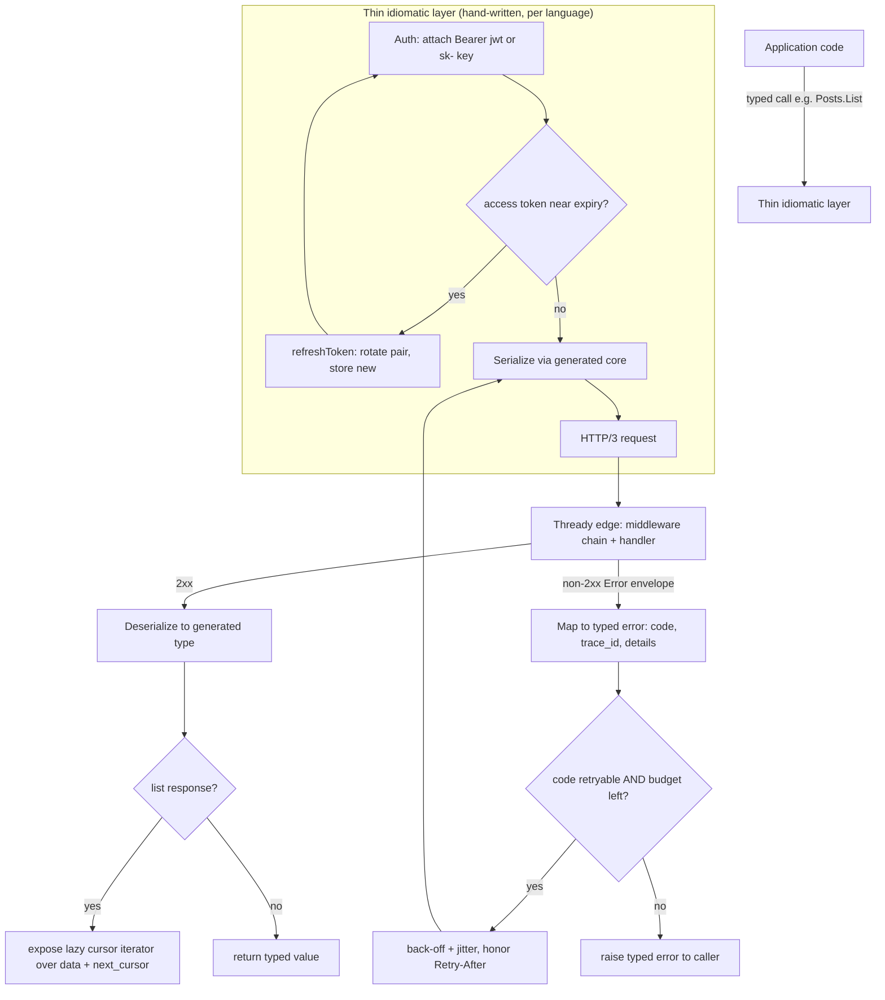

<!--
  Title           : Helix Thready — SDK Usage Examples (per language)
  Classification  : PUBLIC
  Location        : docs/public/research/mvp/api/sdk-examples.md
  Status          : Draft — v0.1
  Revision        : 1 (2026-07-22)
  Author          : Helix Thready documentation swarm (API & SDKs)
  Related         : ./sdk-strategy.md, ./openapi.yaml, ./asyncapi.yaml,
                    ./authn-authz.md, ./error-model.md, ./event-bus-contract.md,
                    ./rest-endpoints.md, ./versioning.md
-->

# Helix Thready — SDK Usage Examples (per language)

| Rev | Date | Author | Change |
|-----|------|--------|--------|
| 1 | 2026-07-22 | swarm (API & SDKs) | Initial: end-to-end usage recipes for Go (primary) + TypeScript, Python, Kotlin, Swift, Rust; grounded on the `openapi.yaml` operationIds, the thin-layer semantics in `sdk-strategy.md`, and the verified client-side token lifecycle in `digital.vasic.auth/pkg/tokenmanager`. |

The [SDK generation strategy](./sdk-strategy.md) fixes *how* the 11 SDKs are produced
(schema-first codegen + a thin idiomatic layer). This companion fixes *how a caller uses
them* — the same seven recipes in every language so a team switching stacks recognises the
shape immediately. Every snippet targets a real [openapi.yaml](./openapi.yaml) operation
(`operationId` in parentheses) and the [canonical error model](./error-model.md); the
event recipes target the [event contract](./event-bus-contract.md) /
[asyncapi.yaml](./asyncapi.yaml).

> `[DEFAULT — adjustable]` The exact package/type names below are the **proposed** public
> surface of the thin idiomatic layer (`sdk-strategy.md §5`); the generated core underneath
> is deterministic from the contract. Where a name is illustrative it is marked. The
> **behaviour** (auth, retry on retryable codes, cursor iteration, event reconnect) is fixed
> by the contract and identical across languages.

## Table of Contents

1. [The seven recipes](#1-the-seven-recipes)
2. [SDK request lifecycle](#2-sdk-request-lifecycle)
3. [Go (primary)](#3-go-primary)
4. [TypeScript / JavaScript](#4-typescript--javascript)
5. [Python](#5-python)
6. [Kotlin (JVM)](#6-kotlin-jvm)
7. [Swift](#7-swift)
8. [Rust](#8-rust)
9. [Cross-language parity matrix](#9-cross-language-parity-matrix)
10. [Open items](#10-open-items)

## 1. The seven recipes

Every language section demonstrates the same seven recipes, so behaviour is directly
comparable:

| # | Recipe | Contract surface |
|---|--------|------------------|
| R1 | **Construct + authenticate** a client (API key or JWT). | `bearerAuth` / `apiKeyAuth` (authn-authz §2) |
| R2 | **List with cursor pagination** (auto-iterate `data[]` + `meta.next_cursor`). | `listPosts` (rest-endpoints §1) |
| R3 | **Trigger async processing** with an idempotency key, then poll state. | `triggerProcessing` → `getProcessingState` |
| R4 | **Semantic search** and verify the active embedder (fail-loud). | `search` (`[GAP: #1 HelixLLM]`) |
| R5 | **Subscribe to events** (typed, auto-reconnect, sticky reconcile). | `/v1/events/ws` + `getStickyEvent` |
| R6 | **Typed error handling** with retry on retryable codes only. | `Error` envelope (error-model §3) |
| R7 | **Transparent JWT refresh** (rotate before expiry; revoke old). | `refreshToken` (authn-authz §3) |

## 2. SDK request lifecycle



> Rendered PNG/SVG exported via Docs Chain (§11.4.65). Source: [diagrams/sdk-request-lifecycle.mmd](./diagrams/sdk-request-lifecycle.mmd).

**Explanation (for readers/models that cannot see the diagram).** Application code never
speaks HTTP directly; it calls a typed method on the thin idiomatic layer (for example
`Posts.List`). That layer performs four jobs in a fixed order before, during and after the
generated core touches the wire. First it handles **authentication**: it attaches an
`Authorization: Bearer` header carrying either a JWT access token or a scoped `sk-…` API
key. When the credential is a JWT, the layer checks whether the access token is near expiry
using the locally-stored expiry (the `digital.vasic.auth/pkg/tokenmanager` shape —
`GetAccessToken`/`StoreTokenInfo`/`IsExpired` — verified at source); if so it calls
`refreshToken` to rotate the pair, stores the new tokens, and only then proceeds. This makes
refresh transparent to the caller (recipe R7).

Second, the generated core **serializes** the request and issues it over HTTP/3 (with the
HTTP/2 fallback negotiated by the transport). The request reaches Thready's edge, where the
shared middleware chain and the handler run. On a 2xx the core **deserializes** the body into
the generated type and returns it — unless the response is a list, in which case the thin
layer wraps it in a **lazy cursor iterator** that transparently follows `meta.next_cursor`
(recipe R2), so the caller writes an ordinary `for`/`async for` loop and never touches
cursors.

Third, on any non-2xx the layer parses the single [Error envelope](./error-model.md) and
**maps it to an idiomatic typed error** carrying the stable `code`, the `trace_id` and the
structured `details[]`. Fourth, it applies the **retry policy**: only the retryable codes
(`rate_limited`, `unavailable`, `deadline_exceeded`) are retried, with exponential back-off
plus jitter, honouring any `Retry-After`; every other code is raised immediately so a
`permission_denied` or `invalid_argument` is never silently retried. This four-part loop is
identical in every language — only the syntax changes — which is exactly why the recipes
below read the same across Go, TypeScript, Python, Kotlin, Swift and Rust.

## 3. Go (primary)

Go is the **critical-priority** SDK (`sdk-strategy.md §4`) and the server's own client. Its
core is `buf`-generated (protocolbuffers/go + connectrpc/go) with the REST surface from the
OpenAPI; the thin layer is hand-written.

```bash
go get github.com/helix-development/helix-thready-go@latest
```

**R1 — construct + authenticate.**

```go
import thready "github.com/helix-development/helix-thready-go"

// API-key client (non-interactive automation).
client := thready.New(thready.Config{
    BaseURL: "https://thready.hxd3v.com/v1",
    Auth:    thready.APIKey("sk-…"),          // Authorization: Bearer sk-…
    Retry:   thready.DefaultRetry,            // retries ONLY retryable codes
})

// …or an interactive JWT client with transparent refresh (recipe R7).
client := thready.New(thready.Config{
    BaseURL: "https://thready.hxd3v.com/v1",
    Auth:    thready.JWT(accessToken, refreshToken), // refreshes before expiry
})
```

**R2 — list with cursor pagination.** The iterator hides `meta.next_cursor`:

```go
it := client.Posts.List(ctx, thready.PostFilter{
    ChannelID: chID,
    Status:    "failed",          // enum: pending|running|succeeded|failed|skipped
    Limit:     100,               // 1..200
})
for it.Next() {
    p := it.Post()                // *thready.Post
    fmt.Println(p.ID, p.Hashtags, p.Categories)
}
if err := it.Err(); err != nil { log.Fatal(err) }
```

**R3 — trigger async processing (idempotent), then poll.**

```go
job, err := client.Posts.Process(ctx, postID, thready.ProcessRequest{},
    thready.WithIdempotencyKey(uuid.NewString())) // 24 h idempotency (error-model §5)
if err != nil { log.Fatal(err) }                  // 202 → ProcessingJob
fmt.Println("precedence:", job.Precedence)        // download>convert>analyze>research>reply

// Poll the projection (or prefer the event stream, recipe R5).
for {
    st, _ := client.Posts.ProcessingState(ctx, postID)
    if st.Status == "succeeded" || st.Status == "failed" { break }
    time.Sleep(2 * time.Second)
}
```

A **concurrent** second `Process` on the same post while one is in-flight returns
`409 conflict` (the single-claim guarantee, `rest-endpoints §2.6`), surfaced as
`thready.CodeConflict`.

**R4 — semantic search, verify the embedder.**

```go
res, err := client.Search.Query(ctx, thready.SearchRequest{
    Query:   "self-hosted vector database benchmarks",
    Mode:    thready.SearchHybrid,               // semantic|keyword|hybrid
    Sources: []string{"posts", "generated"},
    TopK:    20,
    Rerank:  true,
})
if err != nil {
    var te *thready.Error
    if errors.As(err, &te) && te.Code == thready.CodeUnavailable {
        // [GAP: #1] search fails LOUD (503) if the HashEmbedder stub is active.
        log.Fatal("search unavailable — real embedder not configured:", te.TraceID)
    }
    log.Fatal(err)
}
if res.Embedder == "hash" {                       // defensive: must be a real provider
    log.Fatal("refusing hash-embedder results")
}
for _, r := range res.Results {
    fmt.Printf("%s %.3f %s\n", r.SourceID, r.Score, r.Snippet)
}
```

**R5 — subscribe to events (typed, reconnecting, sticky reconcile).**

```go
sub, err := client.Events.Subscribe(ctx, thready.EventFilter{
    Types: []string{"processing.*", "asset.ready"}, // glob (filter.ByGlob, verified)
    ReplaySticky: true,                              // emit last sticky value on connect
})
if err != nil { log.Fatal(err) }
defer sub.Close()
for ev := range sub.C {                              // typed EventEnvelope
    switch ev.Type {
    case "processing.completed":
        fmt.Println("done:", ev.Payload["post_id"], ev.Payload["status"])
    case "asset.ready":
        fmt.Println("asset:", ev.Payload["asset_id"])
    }
    sub.Ack(ev.ID)                                   // advance the durable cursor
}
// On a dropped socket the layer reconnects from the last Ack'd id and, for long
// outages, reconciles via getStickyEvent (event-bus-contract §7).
```

**R6 — typed error handling.**

```go
_, err := client.Accounts.Update(ctx, accountID, patch)
var te *thready.Error
if errors.As(err, &te) {
    switch te.Code {
    case thready.CodePermissionDenied:               // 403 — do NOT retry
        log.Printf("denied (trace %s): %v", te.TraceID, te.Details)
    case thready.CodeRateLimited:                     // 429 — retried by the layer already;
        time.Sleep(time.Duration(te.RetryAfter) * time.Second) // manual back-off if exhausted
    default:
        log.Printf("%s: %s", te.Code, te.Message)
    }
}
```

**R7 — transparent JWT refresh.** With `thready.JWT(access, refresh)` the layer calls
`refreshToken` automatically when the access token is within its refresh threshold, stores
the rotated pair, and retries the original call once; the old refresh token is revoked
server-side (`pkg/token` store, verified). Applications never call refresh directly, but may
subscribe to a rotation hook to persist the new tokens:

```go
client.OnTokenRotated(func(pair thready.TokenPair) { saveToKeyring(pair) })
```

## 4. TypeScript / JavaScript

Generated with `openapi-generator typescript-fetch` (the same generator `helix_proto`
uses); the thin layer adds auth/retry/iteration/events.

```bash
npm i @helix-thready/sdk
```

```ts
import { ThreadyClient, ThreadyError, Code } from "@helix-thready/sdk";

// R1
const client = new ThreadyClient({
  baseUrl: "https://thready.hxd3v.com/v1",
  auth: { apiKey: "sk-…" },                 // or { accessToken, refreshToken }
});

// R2 — async iterator hides the cursor
for await (const post of client.posts.list({ channelId, status: "failed", limit: 100 })) {
  console.log(post.id, post.categories);
}

// R3 — idempotent async trigger, then poll
const job = await client.posts.process(postId, {}, { idempotencyKey: crypto.randomUUID() });
console.log("precedence", job.precedence);
let st = await client.posts.processingState(postId);
while (st.status !== "succeeded" && st.status !== "failed") {
  await new Promise(r => setTimeout(r, 2000));
  st = await client.posts.processingState(postId);
}

// R4 — search + fail-loud embedder check
const res = await client.search.query({ query: "…", mode: "hybrid", topK: 20 });
if (res.embedder === "hash") throw new Error("refusing hash-embedder results");

// R5 — events over SSE (browser) or WS (node); auto-reconnect + sticky reconcile
const sub = client.events.subscribe({ types: ["processing.*", "asset.ready"], replaySticky: true });
sub.on("processing.completed", ev => console.log("done", ev.payload.post_id));
sub.on("asset.ready", ev => console.log("asset", ev.payload.asset_id));

// R6 — typed errors
try {
  await client.accounts.update(accountId, patch);
} catch (e) {
  if (e instanceof ThreadyError) {
    if (e.code === Code.PermissionDenied) console.error("denied", e.traceId, e.details);
    else if (e.code === Code.RateLimited) await sleep(e.retryAfter! * 1000);
  }
}
```

R7 is automatic: pass `{ accessToken, refreshToken }` and the client rotates before expiry,
emitting `client.on("tokenRotated", pair => …)` so a caller can persist the new pair.

## 5. Python

Generated with `openapi-generator python`; ships **sync and async** clients.

```bash
pip install helix-thready
```

```python
from helix_thready import ThreadyClient, ThreadyError, Code   # sync
from helix_thready.aio import ThreadyClient as AsyncClient     # async

# R1
client = ThreadyClient(base_url="https://thready.hxd3v.com/v1", api_key="sk-…")
# or: ThreadyClient(base_url=..., access_token=..., refresh_token=...)

# R2 — generator hides the cursor
for post in client.posts.list(channel_id=chid, status="failed", limit=100):
    print(post.id, post.categories)

# R3 — idempotent trigger, poll
job = client.posts.process(post_id, idempotency_key=str(uuid.uuid4()))
print("precedence", job.precedence)              # 202 -> ProcessingJob
while (st := client.posts.processing_state(post_id)).status not in ("succeeded", "failed"):
    time.sleep(2)

# R4 — search + fail-loud embedder
res = client.search.query(query="…", mode="hybrid", top_k=20)
if res.embedder == "hash":
    raise RuntimeError("refusing hash-embedder results")

# R5 — events (async)
async def watch():
    async with AsyncClient(base_url=..., api_key="sk-…") as ac:
        async for ev in ac.events.subscribe(types=["processing.*", "asset.ready"], replay_sticky=True):
            if ev.type == "processing.completed":
                print("done", ev.payload["post_id"])

# R6 — typed errors + retryable classification
try:
    client.accounts.update(account_id, patch)
except ThreadyError as e:
    if e.code == Code.PERMISSION_DENIED:         # never retried
        print("denied", e.trace_id, e.details)
    elif e.code == Code.RATE_LIMITED:            # honor Retry-After
        time.sleep(e.retry_after or 1)
```

## 6. Kotlin (JVM)

One JVM artifact serves Java/Kotlin/Groovy/Scala (`[OPEN: sdk-2]`, Kotlin-first). Generated
with `openapi-generator kotlin`; coroutine-based thin layer.

```kotlin
// build.gradle.kts: implementation("com.helix.thready:sdk:1.0.0")
import com.helix.thready.*

// R1
val client = ThreadyClient(
    baseUrl = "https://thready.hxd3v.com/v1",
    auth = Auth.ApiKey("sk-…"),                       // or Auth.Jwt(access, refresh)
)

// R2 — Flow hides the cursor
client.posts.list(channelId = chId, status = "failed", limit = 100)
    .collect { post -> println("${post.id} ${post.categories}") }

// R3 — idempotent trigger, poll
val job = client.posts.process(postId, idempotencyKey = UUID.randomUUID().toString())
println("precedence ${job.precedence}")               // 202 -> ProcessingJob
var st = client.posts.processingState(postId)
while (st.status != "succeeded" && st.status != "failed") {
    delay(2000); st = client.posts.processingState(postId)
}

// R4 — search + fail-loud embedder
val res = client.search.query(SearchRequest(query = "…", mode = "hybrid", topK = 20))
require(res.embedder != "hash") { "refusing hash-embedder results" }

// R5 — events
client.events.subscribe(types = listOf("processing.*", "asset.ready"), replaySticky = true)
    .collect { ev ->
        when (ev.type) {
            "processing.completed" -> println("done ${ev.payload["post_id"]}")
            "asset.ready" -> println("asset ${ev.payload["asset_id"]}")
        }
    }

// R6 — typed errors
try {
    client.accounts.update(accountId, patch)
} catch (e: ThreadyException) {
    when (e.code) {
        Code.PERMISSION_DENIED -> println("denied ${e.traceId} ${e.details}")
        Code.RATE_LIMITED -> delay((e.retryAfter ?: 1L) * 1000)
        else -> println("${e.code}: ${e.message}")
    }
}
```

> `[GAP: 7.3/7.4 Security-KMP]` The **mobile** (Android) build MUST NOT ship until native
> KeyStore replaces the in-memory secure-storage stub — see [authn-authz §10](./authn-authz.md)
> and [sdk-strategy §8](./sdk-strategy.md). Server-side JVM use is unaffected.

## 7. Swift

Generated with `openapi-generator swift5`; `async/await` thin layer for iOS/macOS.

```swift
// Package.swift: .package(url: "https://github.com/helix-development/helix-thready-swift", from: "1.0.0")
import HelixThready

// R1
let client = ThreadyClient(
    baseURL: URL(string: "https://thready.hxd3v.com/v1")!,
    auth: .apiKey("sk-…")                              // or .jwt(access, refresh)
)

// R2 — AsyncSequence hides the cursor
for try await post in client.posts.list(channelID: chID, status: "failed", limit: 100) {
    print(post.id, post.categories)
}

// R3 — idempotent trigger, poll
let job = try await client.posts.process(postID, idempotencyKey: UUID().uuidString)
print("precedence", job.precedence)
var st = try await client.posts.processingState(postID)
while st.status != "succeeded" && st.status != "failed" {
    try await Task.sleep(for: .seconds(2)); st = try await client.posts.processingState(postID)
}

// R4 — search + fail-loud embedder
let res = try await client.search.query(.init(query: "…", mode: .hybrid, topK: 20))
guard res.embedder != "hash" else { fatalError("refusing hash-embedder results") }

// R5 — events
let sub = try await client.events.subscribe(types: ["processing.*", "asset.ready"], replaySticky: true)
for await ev in sub.stream {
    if ev.type == "processing.completed" { print("done", ev.payload["post_id"] ?? "") }
}

// R6 — typed errors
do {
    try await client.accounts.update(accountID, patch)
} catch let e as ThreadyError {
    switch e.code {
    case .permissionDenied: print("denied", e.traceID, e.details)
    case .rateLimited: try await Task.sleep(for: .seconds(Double(e.retryAfter ?? 1)))
    default: print(e.code, e.message)
    }
}
```

> The same Security-KMP mobile secure-storage caveat as Kotlin applies to the iOS build:
> block release until the native Keychain path replaces the in-memory stub.

## 8. Rust

Core is `buf`-generated (`protoc-gen-prost` + `protoc-gen-tonic`) for the event/DTO plane;
REST from the OpenAPI. `async` (tokio) thin layer.

```toml
# Cargo.toml
helix-thready = "1.0"
```

```rust
use helix_thready::{Client, Auth, Code, SearchRequest, Mode, EventFilter};

// R1
let client = Client::builder()
    .base_url("https://thready.hxd3v.com/v1")
    .auth(Auth::api_key("sk-…"))              // or Auth::jwt(access, refresh)
    .build()?;

// R2 — Stream hides the cursor
let mut posts = client.posts().list()
    .channel_id(ch_id).status("failed").limit(100).into_stream();
while let Some(post) = posts.try_next().await? {
    println!("{} {:?}", post.id, post.categories);
}

// R3 — idempotent trigger, poll
let job = client.posts().process(&post_id)
    .idempotency_key(Uuid::new_v4().to_string()).send().await?;     // 202 -> ProcessingJob
println!("precedence {:?}", job.precedence);
loop {
    let st = client.posts().processing_state(&post_id).await?;
    if matches!(st.status.as_str(), "succeeded" | "failed") { break; }
    tokio::time::sleep(Duration::from_secs(2)).await;
}

// R4 — search + fail-loud embedder
let res = client.search().query(SearchRequest { query: "…".into(), mode: Mode::Hybrid, top_k: 20, ..Default::default() }).await?;
if res.embedder == "hash" { anyhow::bail!("refusing hash-embedder results"); }

// R5 — events (tonic streaming or WS/SSE per sdk-1)
let mut sub = client.events().subscribe(EventFilter {
    types: vec!["processing.*".into(), "asset.ready".into()], replay_sticky: true,
}).await?;
while let Some(ev) = sub.next().await {
    if ev.r#type == "processing.completed" { println!("done {:?}", ev.payload["post_id"]); }
    sub.ack(&ev.id).await?;
}

// R6 — typed errors
match client.accounts().update(&account_id, patch).await {
    Ok(_) => {}
    Err(e) => match e.code() {
        Code::PermissionDenied => eprintln!("denied {} {:?}", e.trace_id(), e.details()),
        Code::RateLimited => tokio::time::sleep(Duration::from_secs(e.retry_after().unwrap_or(1))).await,
        _ => eprintln!("{}: {}", e.code(), e.message()),
    },
}
```

## 9. Cross-language parity matrix

Every SDK MUST implement all seven recipes with identical semantics (asserted by the
generated-client round-trip gate, [sdk-strategy §6](./sdk-strategy.md) /
[contract-tests §full-automation](./contract-tests.md)):

| Recipe | Go | TS | Python | Kotlin | Swift | Rust |
|--------|----|----|--------|--------|-------|------|
| R1 auth (key + JWT) | ✅ | ✅ | ✅ | ✅ | ✅ | ✅ |
| R2 cursor iterator | `it.Next()` | `for await` | `for` gen | `Flow` | `AsyncSequence` | `Stream` |
| R3 idempotent async + poll | ✅ | ✅ | ✅ | ✅ | ✅ | ✅ |
| R4 search + embedder guard | ✅ | ✅ | ✅ | ✅ | ✅ | ✅ |
| R5 events reconnect + sticky | ✅ | ✅ | ✅ | ✅ | ✅ | ✅ |
| R6 typed error + retry policy | ✅ | ✅ | ✅ | ✅ | ✅ | ✅ |
| R7 transparent JWT refresh | ✅ | ✅ | ✅ | ✅ | ✅ | ✅ |
| Event transport | Connect/WS | WS/SSE | WS/SSE | WS/SSE | WS/SSE | tonic/WS |

Zig (`[OPEN: api-3]`) is hand-written over the C ABI / REST and implements the same recipes
without a generated core; its event path is WS/SSE only. C++/C#/Ruby/PHP follow the REST
pattern of the Python/TS columns.

## 10. Open items

- `[OPEN: sdkx-1]` The illustrative package/type names (`thready.*`, `@helix-thready/sdk`,
  `helix_thready`, `com.helix.thready`, `HelixThready`, `helix_thready` crate) are
  `[DEFAULT — adjustable]` and finalised at first publish per registry
  ([sdk-strategy §7](./sdk-strategy.md)); the **recipe behaviour** is contract-fixed.
- `[OPEN: sdk-1]` Event transport per language (Connect streaming vs WS/SSE) is reconciled in
  [event-bus-contract §11](./event-bus-contract.md) — Go/Rust may use Connect streaming;
  REST-generated languages use WS/SSE.
- `[OPEN: sdkx-2]` Runnable quickstart repos (one per language, CI-gated) ship with the SDKs
  via Docs Chain once the servers exist; this doc fixes the API each quickstart demonstrates.

---

*Made with love ♥ by Helix Development.*
