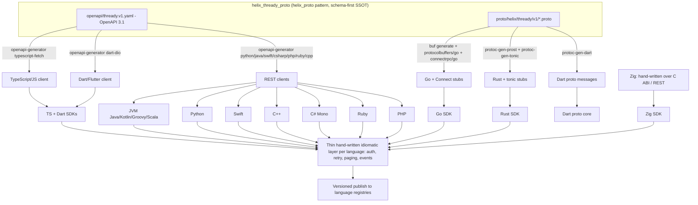

<!--
  Title           : Helix Thready — SDK Generation Strategy
  Classification  : PUBLIC
  Location        : docs/public/research/mvp/api/sdk-strategy.md
  Status          : Draft — v0.1
  Revision        : 1 (2026-07-21)
  Author          : Helix Thready documentation swarm (API & SDKs)
  Related         : ./openapi.yaml, ./versioning.md, ./event-bus-contract.md,
                    ./error-model.md, ./authn-authz.md
-->

# Helix Thready — SDK Generation Strategy

| Rev | Date | Author | Change |
|-----|------|--------|--------|
| 1 | 2026-07-21 | swarm (API & SDKs) | Initial draft: helix_proto pattern, 11 languages, publishing |
| 2 | 2026-07-21 | swarm (API & SDKs) | Linked the round-trip/anti-drift gates to their RED-first skeletons in contract-tests.md |

## Table of Contents

1. [Decision & grounding](#1-decision--grounding)
2. [The pipeline](#2-the-pipeline)
3. [The `helix_thready_proto` repo layout](#3-the-helix_thready_proto-repo-layout)
4. [Per-language generation matrix](#4-per-language-generation-matrix)
5. [The thin idiomatic layer](#5-the-thin-idiomatic-layer)
6. [Anti-drift & no-hand-written gates](#6-anti-drift--no-hand-written-gates)
7. [Publishing & versioning](#7-publishing--versioning)
8. [Gaps addressed](#8-gaps-addressed)
9. [Open items](#9-open-items)

## 1. Decision & grounding

Thready follows the **mature `helix_proto` pattern** already proven for HelixVPN
`[IN-HOUSE: helix_proto]` `[VERIFIED: read at source]` `[GAP: #11 SDK generation]`.
Two schema-first contracts are the single source of truth:

- **Protobuf** (`proto/helix/thready/v1/*.proto`) for the **event/DTO wire contract** and
  any streaming RPC — compiled with **`buf`** to **Go** (+ Connect) and **Rust** (+ tonic),
  and to **Dart** proto messages.
- **OpenAPI 3.1** (`openapi/thready.v1.yaml`, this area's [openapi.yaml](./openapi.yaml))
  for the **REST surface** — compiled with **`openapi-generator`** to **TypeScript** and
  **Dart**, and to the remaining REST languages.

This is exactly what `helix_proto` does: its README states "`proto/**/*.proto` + `buf
generate` → Go + Rust stubs; `openapi/helix.v1.yaml` + `openapi-generator` → TypeScript
client", with `buf.gen.yaml` wiring `buf.build/protocolbuffers/go`,
`buf.build/connectrpc/go`, and local `protoc-gen-prost` + `protoc-gen-tonic` for Rust
`[VERIFIED: helix_proto/buf.gen.yaml]`.

Over each generated core sits a **thin, hand-written idiomatic layer** per language
(auth, retry/back-off, pagination iterators, event-stream helpers). Each SDK is versioned
and published to its language registry, with full docs/guides (§13.1 of the final request).

## 2. The pipeline



> Rendered PNG/SVG exported via Docs Chain (§11.4.65). Source: [diagrams/sdk-pipeline.mmd](./diagrams/sdk-pipeline.mmd).

**Explanation (for readers/models that cannot see the diagram).** The contracts live in a
dedicated, decoupled repo `helix_thready_proto` holding two artifacts: the OpenAPI 3.1
document for the REST surface and the Protobuf definitions for the event/DTO plane. From
the Protobuf, `buf generate` produces Go stubs (message types plus Connect service stubs)
and, via the local `protoc-gen-prost`/`protoc-gen-tonic` plugins, Rust stubs with tonic;
a `protoc-gen-dart` stanza produces Dart proto messages (kept commented until a Dart
toolchain is present, exactly as helix_proto documents). From the OpenAPI, `openapi-generator`
produces the TypeScript client (`typescript-fetch`), the Dart client (`dart-dio`), and the
remaining REST clients (Python, JVM, Swift, C++, C#, Ruby, PHP). Go and Rust get their REST
concerns from the same OpenAPI where a Connect RPC is not used, but their primary core is
the buf-generated code. Zig has no first-class generator, so its SDK is hand-written over
the C ABI (or plain REST) — the one exception to codegen. Every generated core is then
wrapped by a thin, hand-written idiomatic layer that adds authentication, retry/back-off,
pagination iterators and event-stream helpers, and each wrapped SDK is versioned and
published to its language registry. Because both contracts are the single source of truth,
regenerating is deterministic and drift is caught by gates (§6).

## 3. The `helix_thready_proto` repo layout

Modelled 1:1 on `helix_proto` `[VERIFIED]`:

```
helix_thready_proto/
├── buf.yaml                 # modules: [proto]; lint STANDARD; breaking: use:[FILE]
├── buf.gen.yaml             # plugins: protocolbuffers/go, connectrpc/go, prost, tonic, (dart)
├── openapi/
│   └── thready.v1.yaml      # the REST contract (this area's openapi.yaml, canonicalized)
├── proto/helix/thready/v1/
│   ├── events.proto         # EventEnvelope + per-event payloads (post.received, …)
│   ├── posts.proto          # Post, Thread, ProcessingState DTOs
│   ├── assets.proto         # Asset, AssetLink, DownloadJob DTOs
│   └── search.proto         # SearchRequest/Result DTOs
├── gen/{go,rust,ts,dart}/   # generated; never hand-edited (check-no-handwritten)
├── scripts/
│   ├── buf_breaking_gate.sh          # buf breaking --against prev tag
│   ├── generate_ts_client.sh         # openapi-generator → gen/ts, then tsc --noEmit
│   └── run_roundtrip_test.sh         # drive gen/ts against a real stub server
├── Makefile                 # lint breaking generate check-no-handwritten rust-build \
│                            #   openapi-lint openapi-generate-ts roundtrip-test all
└── upstreams/               # push recipes → GitHub/GitLab/GitFlic/GitVerse
```

`buf.gen.yaml` (reused pattern, `[VERIFIED: helix_proto]`):

```yaml
version: v2
plugins:
  - remote: buf.build/protocolbuffers/go
    out: gen/go
    opt: paths=source_relative
  - remote: buf.build/connectrpc/go
    out: gen/go
    opt: paths=source_relative
  - local: protoc-gen-prost         # Rust
    out: gen/rust/src
    strategy: all                    # tonic needs the whole FileDescriptorSet
  - local: protoc-gen-tonic
    out: gen/rust/src
    strategy: all
  # - remote: buf.build/protocolbuffers/dart   # enable once protoc-gen-dart present
  #   out: gen/dart
```

## 4. Per-language generation matrix

The 11 target languages (final request §13.1) and how each is produced:

| # | Language | Priority | Core generator | Notes |
|---|----------|----------|----------------|-------|
| 1 | **Go** | Critical | `buf` (protocolbuffers/go + connectrpc/go) + OpenAPI where REST-only | Primary SDK; also the server's own client. |
| 2 | **Java/Kotlin/Groovy/Scala** (JVM) | High | `openapi-generator` (`kotlin`/`java`) | One JVM artifact usable from all four; Kotlin primary. |
| 3 | **Python** | High | `openapi-generator` (`python`) | async + sync clients. |
| 4 | **TypeScript/JavaScript** | High | `openapi-generator` (`typescript-fetch`) | Same generator helix_proto uses; `tsc --noEmit` gate. |
| 5 | **Swift** | Medium | `openapi-generator` (`swift5`) | iOS/macOS. |
| 6 | **C++** | Medium | `openapi-generator` (`cpp-restsdk`) + protobuf C++ for events | events via native protobuf. |
| 7 | **Rust** | Medium | `buf` (`protoc-gen-prost` + `protoc-gen-tonic`) + OpenAPI REST | tonic for streaming; `cargo build` gate. |
| 8 | **C# (Mono)** | Medium | `openapi-generator` (`csharp`) | Mono/.NET. |
| 9 | **Zig** | Low | **hand-written** over C ABI / REST | `[OPEN: api-3]` no first-class generator. |
| 10 | **Ruby** | Low | `openapi-generator` (`ruby`) | |
| 11 | **PHP** | Low | `openapi-generator` (`php`) | |

Dart/Flutter (for the mobile clients) is generated with `openapi-generator -g dart-dio`
for REST + `protoc-gen-dart` for events, exactly as helix_proto documents (kept behind a
"needs dart toolchain" note until the toolchain is provisioned).

## 5. The thin idiomatic layer

Codegen gives types + transport; it does **not** give ergonomics. Each SDK adds a small
hand-written layer (identical semantics across languages) providing:

- **Auth** — attach `Authorization: Bearer <jwt|sk-…>`; transparent access-token refresh
  using the refresh token (see [authn-authz.md](./authn-authz.md)); JWKS-based local
  verification helper.
- **Retry/back-off** — retry only the retryable error codes (`rate_limited`,
  `unavailable`, `deadline_exceeded`) honoring `Retry-After`; exponential back-off + jitter
  (see [error-model.md](./error-model.md)).
- **Pagination** — a lazy iterator over `data[] + meta.next_cursor` so callers write
  `for post in client.posts.list(...)` without cursor plumbing.
- **Events** — a typed subscription helper wrapping the WebSocket/SSE contract
  (auto-reconnect, durable replay, sticky-snapshot reconcile — see
  [event-bus-contract.md](./event-bus-contract.md)).
- **Errors** — map the wire envelope to an idiomatic typed error carrying `code`,
  `trace_id`, `details` (unknown codes → an `unknown` variant, per
  [versioning.md](./versioning.md)).
- **Unknown-tolerant enums** — generators are configured so unknown enum values
  round-trip as a pass-through variant, making added enum values non-breaking.

Example (Go, illustrative):

```go
client := thready.New(thready.Config{
    BaseURL: "https://thready.hxd3v.com/v1",
    Auth:    thready.APIKey("sk-…"),           // or thready.JWT(access, refresh)
    Retry:   thready.DefaultRetry,             // retryable codes only
})
it := client.Posts.List(ctx, thready.PostFilter{ChannelID: id, Status: "failed"})
for it.Next() { p := it.Post(); /* … */ }      // cursor handled by the iterator
if err := it.Err(); err != nil {
    var te *thready.Error
    if errors.As(err, &te) && te.Code == thready.CodeRateLimited {
        // back off using te.RetryAfter
    }
}
sub, _ := client.Events.Subscribe(ctx, thready.EventFilter{Types: []string{"processing.completed"}})
for ev := range sub.C { /* typed EventEnvelope */ }
```

## 6. Anti-drift & no-hand-written gates

Reusing helix_proto's Makefile gates verbatim `[VERIFIED]`, run by local git-hooks
(no server CI, `[CONSTITUTION §11.4.156]`):

- `buf lint` + `buf breaking` (proto), `openapi-lint` (OpenAPI) — contract hygiene + the
  breaking-change gate ([versioning.md](./versioning.md) §5).
- `generate` then **`check-no-handwritten`** — regenerate and assert the `gen/` cores were
  not hand-edited; hand edits belong only in the thin layer, never in generated files.
- `rust-build` (`cargo`), `tsc --noEmit` (TS), and a **round-trip test** that drives the
  generated TS client against a real stub server including a negative-control 401 —
  exactly helix_proto's `roundtrip-test`. The RED-first skeleton for this round-trip (and
  the `check-no-handwritten` drift guard) is in [contract-tests.md](./contract-tests.md)
  §full-automation.
- `[GAP: #18]` The existing TS client libs (6) + `UI-Components-KMP` are scaffolds with
  **no CI and no deep audit**; Thready's SDKs therefore **must** ship their own gate suite
  (the above) + the 15 mandated test types before any registry publish — no relying on the
  scaffolds' green.

## 7. Publishing & versioning

- Versioned to the contract's MAJOR.MINOR ([versioning.md](./versioning.md) §7); published
  per registry: Go module proxy (tag), npm (`@helix-thready/sdk`), PyPI, Maven Central,
  crates.io, CocoaPods/SwiftPM, NuGet, RubyGems, Packagist; C++/Zig via source + release
  archive.
- Each SDK carries full README + quickstart + reference (Docs Chain md→HTML/PDF).
- Publish happens on a `THREADY-<version>` tag after the full-suite retest is GREEN and is
  pushed to all four upstreams `[CONSTITUTION §11.4.151/§2.1]`.

## 8. Gaps addressed

- `[GAP: #11]` SDK generation via OpenAPI 3.1 + Protobuf (helix_proto pattern) — the whole
  document; grounded on the verified helix_proto `buf.gen.yaml`/`Makefile`.
- `[GAP: #18]` TS client scaffolds without CI/audit — §6 (Thready SDKs ship their own gate
  suite; scaffolds are not trusted).
- `[GAP: 7.3 Security-KMP]` mobile SDK secure-storage caveat — mobile SDK release is
  **blocked** until native Keychain/KeyStore replaces the in-memory stub; cross-referenced
  from [authn-authz.md](./authn-authz.md).

## 9. Open items

- `[OPEN: api-3]` **Zig** has no first-class OpenAPI/Protobuf generator; its SDK is
  hand-written over the C ABI / REST. Tracked as a workable item; lowest priority (Low).
- `[OPEN: sdk-1]` Whether to expose event streaming to SDKs over **Connect streaming**
  (proto) or the REST WS/SSE contract per language is `[DEFAULT — adjustable]`: Go/Rust use
  Connect streaming; REST-generated languages use WS/SSE. Reconciled in
  [event-bus-contract.md](./event-bus-contract.md).
- `[OPEN: sdk-2]` A single JVM artifact serving Java/Kotlin/Groovy/Scala vs per-language
  artifacts — proposed single Kotlin-first artifact; confirm with the client teams.

---

*Made with love ♥ by Helix Development.*
