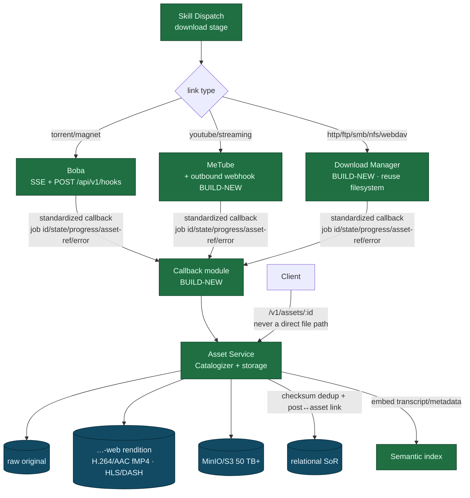

<!--
  Title           : Helix Thready — Asset Service & Download Subsystem
  Classification  : PUBLIC
  Location        : docs/public/research/mvp/architecture/asset-and-download.md
  Status          : Draft — v0.1
  Revision        : 1 (2026-07-21)
  Author          : Helix Thready documentation swarm (System Architecture)
  Related         : ./processing-pipeline.md, ./event-model.md, ./data-flow.md,
                    ./security-model.md, ./semantic-search.md, ./component-catalog.md
-->

# Helix Thready — Asset Service & Download Subsystem

| Rev | Date | Author | Change |
|-----|------|--------|--------|
| 1 | 2026-07-21 | swarm (System Architecture) | Initial draft — Asset Service, Download Manager, Boba/MeTube callbacks |
| 2 | 2026-07-21 | swarm (review pass) | Add OpenAPI 3.1 asset-serving contract (§8) per CONVENTIONS §6 |
| 3 | 2026-07-22 | swarm (Pass 3 depth) | Split the §6 asset/download-diagram explanation into true multi-paragraph form (single-callback fan-in intent → routing → standardized callback → Asset Service store/serve → never-a-direct-path payoff) per CONVENTIONS §4 |

## Table of Contents

1. [Two separate concerns: fetch vs store/serve](#1-two-separate-concerns-fetch-vs-storeserve)
2. [Asset Service (decouple Catalogizer)](#2-asset-service-decouple-catalogizer)
3. [Download Manager (BUILD-NEW)](#3-download-manager-build-new)
4. [Delegated systems: Boba & MeTube](#4-delegated-systems-boba--metube)
5. [Standardized callback/task contract (BUILD-NEW)](#5-standardized-callbacktask-contract-build-new)
6. [Asset & download diagram](#6-asset--download-diagram)
7. [Renditions, dedup, integrity, retention](#7-renditions-dedup-integrity-retention)
8. [Serving: never a direct file path](#8-serving-never-a-direct-file-path)
9. [Gap-register coverage](#9-gap-register-coverage)
10. [TDD reproduce-first skeletons](#10-tdd-reproduce-first-skeletons)
11. [Open items](#11-open-items)

---

## 1. Two separate concerns: fetch vs store/serve

Resolving progress-doc inconsistency #3 `[research_request_final §20.3]`: the **Download
Manager fetches bytes**, the **Asset Service stores, secures and serves them**. They are
separate submodules joined by the **standardized callback contract**. This separation is why the
download layer can be swapped or scaled independently of the asset store.

## 2. Asset Service (decouple Catalogizer)

The Asset Service is built on `vasic-digital/Catalogizer` `[IN-HOUSE: Catalogizer]` (VERIFIED
PRODUCTION), which already provides multi-protocol access, SQLCipher-at-rest, JWT+RBAC, and a
WebSocket surface.

> **`[GAP: 6.1]` Not decoupled; `Streaming` is a WS hub.** Catalogizer is not yet decoupled into
> a standalone Asset Service submodule, and its `Streaming` submodule is a **WebSocket hub, not
> media byte/transcode streaming** (media serving is a Gin API + a separate transcoder).
> **Plan `[BUILD-NEW]`:** decouple the Asset Service (multi-protocol access, SQLCipher-at-rest,
> JWT+RBAC, WebSocket, Range/`OpenSeekable`) into its own reusable submodule; add HLS/DASH +
> transcoder integration; content-hash dedup + integrity checksums; the `…-web` rendition
> convention; virtual-blob resolvers. Media byte-streaming is explicitly a new capability, not an
> existing one — not claimed to work today.

Responsibilities `[research_request_final §7.1]`:

- Physical **and** virtual (blob) assets; object tier on MinIO/S3 (`digital.vasic.storage`) for
  the 50 TB+ scale, local FS fallback.
- Encryption at rest (SQLCipher / encrypted-Postgres + AES-256-GCM asset dirs); the specially
  encrypted directory for credit cards / contracts / signed docs decrypts **only** through the
  Asset Service ([security-model.md](./security-model.md) §7).
- Multi-protocol access (SMB/FTP/NFS/WebDAV/local via `digital.vasic.filesystem`, with
  `OpenSeekable` for HTTP Range serving).
- Post↔asset relationships, checksums, `…-web` renditions, retention policy (per-account).

## 3. Download Manager (BUILD-NEW)

A generic multi-protocol download engine in Go — the confirmed gap `[GAP: 6.3]`
`[research_request_final §7.2]`.

> **`[GAP: 6.2]` filesystem has no HTTP source and no download-manager semantics.**
> `digital.vasic.filesystem` supports SMB/FTP/NFS/WebDAV/local (VERIFIED) but **no HTTP(S)
> source** and no queue/resume/segment/progress/callback. NFS errors on non-Linux yet is still
> listed in `SupportedProtocols`. **Plan:** the new Download Manager **reuses `filesystem`** for
> FTP/SMB/NFS/WebDAV and **adds** the HTTP(S) source (HTTP/2+3, QUIC, Brotli via
> `vasic-digital/http3`) plus job semantics; fix the NFS platform listing; expose `OpenSeekable`
> uniformly for Range.

Capabilities: HTTP/1.1/2/3+QUIC+Brotli, FTP, SMB, NFS, WebDAV; **queue, resumable + segmented
transfer, progress, retry/back-off, and a standardized completion callback**. Concurrency is its
own pool (does not consume the processing worker pool — long downloads must not hold a
processing slot, see [concurrency-and-idempotency.md](./concurrency-and-idempotency.md)).

```go
// Download Manager job API (BUILD-NEW; reuses filesystem for non-HTTP protocols).
type DownloadJob struct {
    ID          string
    Source      string            // http(s):// | ftp:// | smb:// | nfs:// | webdav://
    Dest        string            // Asset Service staging path
    Segments    int               // segmented transfer
    Resume      bool
    Callback    CallbackTarget    // standardized completion callback (§5)
}
type DownloadManager interface {
    Enqueue(ctx context.Context, job DownloadJob) (jobID string, err error)
    Status(ctx context.Context, jobID string) (JobStatus, error) // progress/state
    Cancel(ctx context.Context, jobID string) error
}
```

## 4. Delegated systems: Boba & MeTube

Long/specialized downloads are delegated to 3rd-party owned systems with callbacks, so they run
independently and don't hold a processing slot `[research_request_final §8.1]`:

- **Boba** (`milos85vasic/Boba-Base`) — torrent/magnet search + download. Already has SSE +
  `POST /api/v1/hooks` (VERIFIED). `[GAP: 6.4]` its callback contract is **bespoke**; **plan:**
  standardize it to the shared callback schema (§5) and integrate with the Asset Service.
- **MeTube** (`milos85vasic/YT-DLP`) — YouTube/streaming download. `[GAP: 6.5]` **no outbound
  completion webhook** — VERIFIED it has a postprocessor sidecar (SQLite jobs + watchdog) with
  **poll-only** endpoints (`GET /api/postprocess/status|jobs`); nothing pushes completion.
  **Plan `[BUILD-NEW: callback]`:** add an **outbound completion webhook** (shared callback
  schema) + Asset Service integration + conversion-profile config (`…-web` renditions). MeTube is
  **not** claimed to push callbacks today.

Routing: torrent/magnet → Boba; YouTube/streaming → MeTube; direct protocol URLs → Download
Manager. A channel/playlist expands to many jobs (grouped with ordering-number prefixes for
watch order) `[research_request_final §7.3]`.

## 5. Standardized callback/task contract (BUILD-NEW)

Every 3rd-party system accepts a task via API, processes async, provides status, calls back on
completion, handles errors, and supports retry `[research_request_final §8.1]`. Because the
mechanism must be standardized and decoupled, it is extracted into a **reusable callback/task
submodule** `[GAP: 6.6]` and applied uniformly to Boba, MeTube and the Download Manager.

```yaml
# Standardized callback schema (job id, state, progress, result-asset-ref, error).
# Applied uniformly across Boba / MeTube / Download Manager.
callback:
  job_id: "6f1c…"
  system: "metube" | "boba" | "download-manager"
  state: "queued" | "running" | "completed" | "failed"
  progress: 0.0 - 1.0
  result:
    asset_ref: "asset://acct/9c1e…/raw/video.mp4"   # Asset Service reference
    renditions: ["asset://…/video-web.mp4"]
    checksum: "sha256:…"
  error:
    code: "SOURCE_UNAVAILABLE"
    message: "…"
    retriable: true
  ts: "2026-07-21T21:00:00Z"
```

The callback is delivered to Thready's callback endpoint, which verifies it (HMAC-signed),
records job state, emits `asset.download.progress` / `asset.stored`
([event-model.md](./event-model.md)), and hands the artifact to the Asset Service. Retriable
failures re-enqueue the delegated job with back-off; exhausted failures surface `post.failed`.

## 6. Asset & download diagram



> Rendered PNG/SVG exported via Docs Chain (§11.4.65). Source: `diagrams/asset-download.mmd`.

**Explanation (for readers/models that cannot see the diagram).** The diagram's whole point is the
fan-in shape: three heterogeneous downloaders on the left collapse into a *single* callback edge in
the middle, and only past that edge does the Asset Service appear. That shape is the visual proof of
the fetch-vs-store separation of §1 — the system integrates three very different acquisition
backends exactly once, through one contract, instead of teaching the Asset Service three download
protocols.

The download stage of the Skill Dispatch engine routes by link type: torrent/magnet links go to
Boba (which already speaks SSE + `POST /api/v1/hooks`), YouTube/streaming links go to MeTube (which
needs the new outbound webhook, `[GAP: 6.5]`), and direct protocol URLs (HTTP/FTP/SMB/NFS/WebDAV) go
to the new Download Manager (which reuses `filesystem` for the non-HTTP protocols and adds the HTTP
source, `[GAP: 6.2/6.3]`). All three report completion through **one
standardized callback** — job id, state, progress, an asset reference, and an error block — to a
shared callback module, so the rest of the system does not care which downloader ran.

The callback module hands the artifact to the Asset Service, which keeps the raw original, generates
the `…-web` rendition (H.264/AAC fMP4, HLS/DASH), stores bytes in the MinIO/S3 tier, records the
checksum and the post↔asset link in the relational system of record (deduping by content hash),
and embeds any transcript/metadata into the semantic index.

Finally, clients fetch assets only
through `/v1/assets/:id` — **never** a direct file path — so auth/RBAC and virtual-blob
resolution always apply. The diagram's single-callback fan-in is the architectural payoff of the
standardized contract: three heterogeneous downloaders, one uniform integration.

## 7. Renditions, dedup, integrity, retention

`[research_request_final §7.1, §7.3, Q36, §19.3]`:

- **Raw preserved** + **web-optimized `…-web`** version (suffix before the extension). Video:
  H.264 High + AAC in fMP4 baseline, plus H.265/HEVC and AV1 for bandwidth; adaptive
  1080p/720p/480p via HLS + DASH. Audio: MP3 320k + Opus 128k + FLAC archival.
- **Content-hash dedup** — identical bytes stored once; integrity checksums (sha256) on every
  asset.
- **Structured directories** + numeric ordering prefixes for series/playlists (watch order).
- **Broken physical link → re-downloadable** via REST (`POST /v1/assets/{id}/redownload`).
- **Retention** — per-account policy (indefinite default, per-account overrides
  `[OPERATOR]`); cleanup governed by that policy; assets snapshot/dedup daily for DR
  (RPO ≈ 1 h) `[OPERATOR]`.

## 8. Serving: never a direct file path

Client links are **never** direct file paths — they resolve through the Asset Service, which maps
to real or virtual content and enforces auth/RBAC `[research_request_final §7.1]`. The service
serves via Range (`OpenSeekable`) for seekable media and HLS/DASH for adaptive streaming; the
specially encrypted directory (sensitive scans) decrypts only inside the Asset Service after an
RBAC check. Virtual assets (blobs from DBs or other sources) resolve through blob resolvers.

```
GET /v1/assets/{id}                 → 302/stream (RBAC-gated, Range-capable)
GET /v1/assets/{id}/manifest.m3u8   → HLS manifest (adaptive)
POST /v1/assets/{id}/redownload     → re-fetch broken physical link
```

The architecture-level serving contract as **OpenAPI 3.1** `[CONVENTIONS §6]` (the exhaustive
schema set lives in the [api/](../api/index.md) pack; this excerpt fixes the never-a-direct-path
boundary):

```yaml
openapi: 3.1.0
info: { title: Helix Thready — Asset serving (architecture excerpt), version: "1.0.0" }
paths:
  /v1/assets/{id}:
    get:
      operationId: getAsset
      summary: Stream an asset by id — RBAC-gated, Range-capable; never a direct file path.
      security: [ { bearerAuth: [] } ]
      parameters:
        - { name: id, in: path, required: true, schema: { type: string, format: uuid } }
        - { name: Range, in: header, required: false,
            description: Byte-range for seekable media (OpenSeekable),
            schema: { type: string, examples: ["bytes=0-1048575"] } }
      responses:
        "200": { description: Full body (small assets),
                 content: { application/octet-stream: { schema: { type: string, format: binary } } } }
        "206": { description: Partial content (Range satisfied),
                 headers: { Content-Range: { schema: { type: string } } },
                 content: { application/octet-stream: { schema: { type: string, format: binary } } } }
        "302": { description: Signed redirect to the object tier (still RBAC-gated),
                 headers: { Location: { schema: { type: string, format: uri } } } }
        "401": { description: Missing/invalid credentials }
        "403": { description: RBAC denies cross-account/asset access }
        "404": { description: Unknown asset id }
  /v1/assets/{id}/manifest.m3u8:
    get:
      operationId: getAssetHlsManifest
      summary: Adaptive HLS manifest for the asset's …-web renditions.
      security: [ { bearerAuth: [] } ]
      parameters:
        - { name: id, in: path, required: true, schema: { type: string, format: uuid } }
      responses:
        "200": { description: HLS manifest,
                 content: { application/vnd.apple.mpegurl: { schema: { type: string } } } }
        "403": { description: RBAC denied }
        "404": { description: No renditions for this asset }
  /v1/assets/{id}/redownload:
    post:
      operationId: redownloadAsset
      summary: Re-fetch a broken physical link; re-enqueues a delegated download job.
      security: [ { bearerAuth: [] } ]
      parameters:
        - { name: id, in: path, required: true, schema: { type: string, format: uuid } }
      responses:
        "202": { description: Accepted; a DownloadJob was enqueued,
                 content: { application/json: { schema: { $ref: "#/components/schemas/JobAccepted" } } } }
        "403": { description: RBAC denied }
        "404": { description: Unknown asset id }
components:
  securitySchemes:
    bearerAuth: { type: http, scheme: bearer, bearerFormat: JWT }
  schemas:
    JobAccepted:
      type: object
      required: [job_id, state]
      properties:
        job_id: { type: string }
        state:  { type: string, enum: [queued, running, completed, failed] }
```

## 9. Gap-register coverage

- `[GAP: 6.1]` Catalogizer not decoupled; Streaming=WS hub → decouple Asset Service + add
  HLS/DASH transcoder + dedup/checksums + `…-web` + virtual blobs (§2, §7).
- `[GAP: 6.2]` filesystem no HTTP source / no download semantics → Download Manager reuses
  filesystem + adds HTTP source + job semantics; fix NFS listing (§3).
- `[GAP: 6.3]` Download Manager does not exist → BUILD-NEW (§3).
- `[GAP: 6.4]` Boba callback bespoke → standardize to shared schema (§4–5).
- `[GAP: 6.5]` MeTube poll-only → add outbound completion webhook (§4–5).
- `[GAP: 6.6]` No standardized callback module → BUILD-NEW reusable submodule (§5).
- `[GAP: 3.2]` storage MinIO signed-URL parity → validate against self-hosted MinIO (Hetzner);
  tracked with the deployment pack.

## 10. TDD reproduce-first skeletons

```go
// RED: MeTube completion must push a callback (not require polling).
func TestMeTube_OutboundWebhook(t *testing.T) {
    got := captureCallback(t)
    triggerMeTubeComplete(t, jobID="j1")
    require.Eventually(t, func() bool { return got.Received("j1", "completed") }, 5*time.Second, 50*time.Millisecond)
    // FAILS today — MeTube is poll-only (GAP 6.5)
}

// RED: web rendition must be produced with the …-web suffix, raw preserved.
func TestAsset_WebRenditionAndRaw(t *testing.T) {
    a := store(t, "video.mp4")
    require.True(t, a.HasRaw())
    require.Contains(t, a.RenditionNames(), "video-web.mp4")
}

// RED: identical bytes must dedup by content hash.
func TestAsset_ContentHashDedup(t *testing.T) {
    a := store(t, bytesA); b := store(t, bytesA)
    require.Equal(t, a.StoragePath, b.StoragePath) // one physical copy
}

// RED: client cannot obtain a direct file path.
func TestAsset_NoDirectPath(t *testing.T) {
    ref := clientAssetRef(t, assetID)
    require.False(t, isFilesystemPath(ref)) // must be asset:// or /v1/assets/:id
}
```

## 11. Open items

- `[OPEN: ASSET-1]` The decoupling boundary of the Asset Service vs Catalogizer's existing Gin
  API + transcoder needs a concrete extraction plan (which packages move to the new submodule);
  tracked as a P1 workable item `[GAP: 6.1]`.
- `[OPEN: ASSET-2]` The transcoder engine (ffmpeg wrapper vs an existing `vasic-digital`
  component) for HLS/DASH + H.265/AV1 is unspecified; `[RESEARCH]` + decision tracked.
- `[OPEN: ASSET-3]` Callback authentication (HMAC signing scheme + replay protection) for the
  standardized callback module needs a concrete spec; tracked with the BUILD-NEW callback
  submodule `[GAP: 6.6]`.

---

*Made with love ♥ by Helix Development.*
