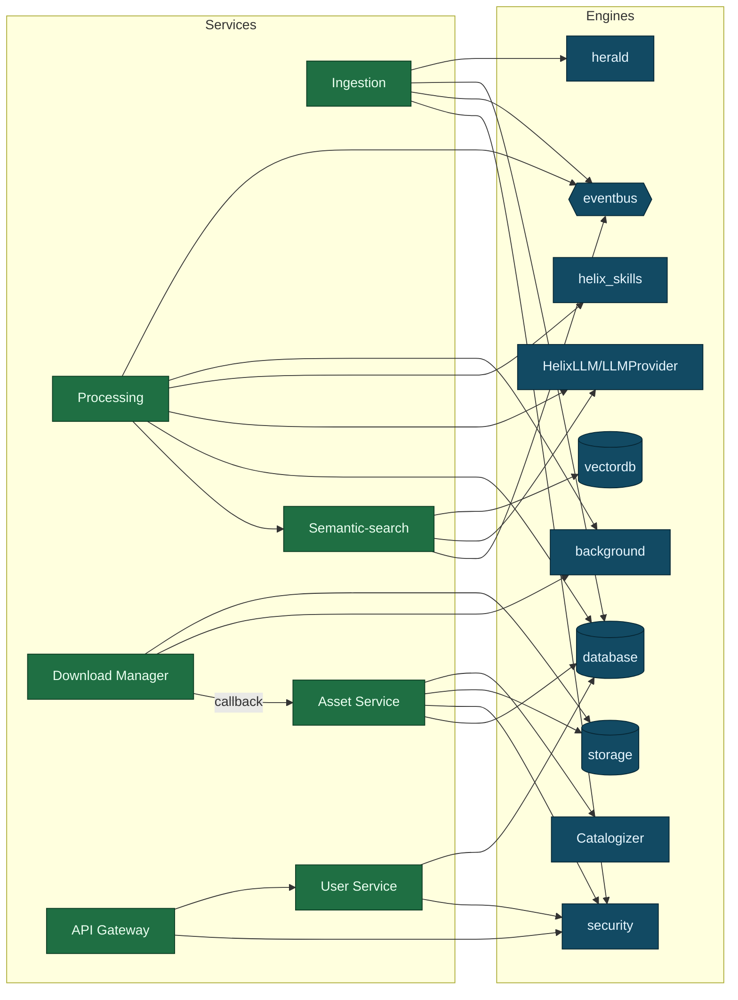

<!--
  Title           : Helix Thready — Component Catalog (services, modules, in-house mapping)
  Classification  : PUBLIC
  Location        : docs/public/research/mvp/architecture/component-catalog.md
  Status          : Draft — v0.1
  Revision        : 1 (2026-07-21)
  Author          : Helix Thready documentation swarm (System Architecture)
  Related         : ./system-overview.md, ./data-flow.md, ./messenger-ingestion.md,
                    ./processing-pipeline.md, ./semantic-search.md, ./asset-and-download.md,
                    ./security-model.md, ./service-discovery.md, ./event-model.md,
                    ./concurrency-and-idempotency.md
-->

# Helix Thready — Component Catalog

| Rev | Date | Author | Change |
|-----|------|--------|--------|
| 1 | 2026-07-21 | swarm (System Architecture) | Initial catalog — services, submodule mapping, maturity, gaps |

## Table of Contents

1. [How to read this catalog](#1-how-to-read-this-catalog)
2. [Thready services (the deployable units)](#2-thready-services-the-deployable-units)
3. [Reused in-house submodules (the engines)](#3-reused-in-house-submodules-the-engines)
4. [New submodules to build `[BUILD-NEW]`](#4-new-submodules-to-build-build-new)
5. [Service → submodule dependency matrix](#5-service--submodule-dependency-matrix)
6. [Component dependency diagram](#6-component-dependency-diagram)
7. [Maturity & gap register](#7-maturity--gap-register)
8. [Open items](#8-open-items)

---

## 1. How to read this catalog

Two kinds of components exist. **Services** are Thready's own deployable containers (they own
an API surface and/or an event-loop). **Submodules** are decoupled, project-not-aware Go (or
Python/Shell) libraries reused across Helix projects `[CONSTITUTION §11.4.28]`; Thready
*composes* them, never forks them. Every service names the exact submodule(s) it embeds.
Maturity is quoted verbatim from the gap register (`PRODUCTION` / `FOUNDATION` / `SCAFFOLD` /
`DESIGN-ONLY` / `BUILD-NEW`) and confidence (`VERIFIED` / `FLAGGED`); a maturity claim is never
upgraded here. Import paths use the confirmed `digital.vasic.*` module convention.

## 2. Thready services (the deployable units)

| Service | Responsibility | Embeds (submodules) | Detailed doc |
|---------|----------------|---------------------|--------------|
| **Ingestion Service** (extended Herald) | Connect to messengers, read threads, assemble root+organic reply, persist, emit `post.received` | `herald`, `gotd/td`, Max adapter `[BUILD-NEW]`, ThreadReader `[BUILD-NEW]`, `database`, `eventbus` | [messenger-ingestion.md](./messenger-ingestion.md) |
| **Processing Service** (Skill Dispatch Engine) | Classify by hashtag/type, order & run Skills, post status reply | `helix_skills`, `background`, `eventbus`, `HelixLLM`, `llmprovider`, `HelixAgent`, `visionengine`+OCR | [processing-pipeline.md](./processing-pipeline.md) |
| **Semantic-search Service** | Embed + index posts and generated materials; serve `/v1/search` | `embeddings`, `vectordb` (pgvector), `rag`, `HelixLLM` `/v1/embeddings`, `MCP_Module` | [semantic-search.md](./semantic-search.md) |
| **Asset Service** `[BUILD-NEW]` | Store/secure/serve physical & virtual assets; `…-web` renditions; Range/HLS/DASH | `Catalogizer`, `storage`, `filesystem`, `security`, `auth` | [asset-and-download.md](./asset-and-download.md) |
| **Download Manager** `[BUILD-NEW]` | Multi-protocol byte fetch (HTTP/2/3, FTP/SMB/NFS/WebDAV); queue/resume/segment/progress/callback | `filesystem`, `http3`, `background` | [asset-and-download.md](./asset-and-download.md) |
| **User Service** `[BUILD-NEW]` | Multi-tenant users/roles/permissions (three-tier), accounts, memberships, billing/metering | `auth`, `security/pkg/policy`, Catalogizer RBAC pattern, `database` | [security-model.md](./security-model.md) |
| **Event Bus Service** `[BUILD-NEW, thin]` | Client-facing subscription surface over JetStream; sticky/one-time; durable replay | `eventbus` (`pkg/nats`), `streaming` (WS hub) | [event-model.md](./event-model.md) |
| **API Gateway** | HTTP/3 edge; `/v1` REST + WebSocket/SSE; auth/ratelimit/headers/CORS | `http3`, `middleware`, `auth`, `ratelimiter`, `security/pkg/headers` | [system-overview.md](./system-overview.md) |
| **Accounts (messenger) Service** | Interactive & non-interactive sign-in to messengers; session storage | `auth`, `security/pkg/securestorage`, `herald` | [messenger-ingestion.md](./messenger-ingestion.md) |

## 3. Reused in-house submodules (the engines)

| Submodule (import path) | Repo | Role in Thready | Maturity (gap register) |
|-------------------------|------|-----------------|-------------------------|
| `digital.vasic.database` | `vasic-digital/database` | Relational SoR — SQLite dev / Postgres prod; `pkg/migration.Runner` | PRODUCTION / VERIFIED |
| `digital.vasic.vectordb` | `vasic-digital/VectorDB` | Semantic store — **pgvector** backend, cosine `<=>` | PRODUCTION (pgvector) / VERIFIED — others FLAGGED `[GAP: 3.1]` |
| `digital.vasic.embeddings` | `vasic-digital/Embeddings` | Embedding generation (OpenAI-compat → HelixLLM) | PRODUCTION / VERIFIED — no native llama.cpp backend `[GAP: 2.7]` |
| `digital.vasic.rag` | `vasic-digital/RAG` | Retrieval-augmented generation glue | PRODUCTION (per matrix) |
| `digital.vasic.eventbus` | `vasic-digital/EventBus` | In-proc bus (`pkg/bus`) + **NATS JetStream** (`pkg/nats`) | PRODUCTION / VERIFIED |
| `digital.vasic.background` | `vasic-digital/BackgroundTasks` | Postgres task queue, DLQ, retry/backoff, stuck-detect, Prometheus | PRODUCTION / VERIFIED |
| `digital.vasic.cache` | `vasic-digital/cache` | L1/L2 cache (in-mem + Redis + Postgres) | PRODUCTION / VERIFIED |
| `digital.vasic.storage` | `vasic-digital/Storage` | MinIO/S3 object tier + local FS + signed URLs | PRODUCTION / VERIFIED — MinIO signed-URL parity `[GAP: 3.2]` |
| `digital.vasic.filesystem` | `vasic-digital/Filesystem` | SMB/FTP/NFS/WebDAV/local; `OpenSeekable` for Range | PRODUCTION / VERIFIED — **no HTTP(S) source** `[GAP: 6.2]` |
| `vasic-digital/Catalogizer` | `vasic-digital/Catalogizer` | Asset store/serve base (RBAC, WS, SQLCipher-at-rest) | PRODUCTION / VERIFIED — not decoupled; `Streaming` = WS hub `[GAP: 6.1]` |
| `herald` | `vasic-digital/herald` | Messenger fan-in/out; `pkg/messenger.Messenger` | FOUNDATION / VERIFIED — MTProto in QA harness, Max stub `[GAP: 5.1]` |
| `HelixDevelopment/HelixLLM` | `HelixDevelopment/HelixLLM` | Local llama.cpp serving; `/v1/embeddings`, `/v1/chat/*` | PRODUCTION / VERIFIED — default embedder is `HashEmbedder` stub `[GAP: 2.1]` |
| `digital.vasic.llmprovider` | `vasic-digital/LLMProvider` | 40+ provider adapters; retry/circuit-breaker/health | PRODUCTION / FLAGGED (adapters not each audited) |
| `dev.helix.agent` (HelixAgent) | `HelixDevelopment/HelixAgent` | Ensemble/debate reasoning | FOUNDATION / FLAGGED — identity blur, residual stubs `[GAP: 2.2]` |
| `digital.vasic.llmsverifier` | `vasic-digital/LLMsVerifier` | Model scoring for fallback chain | PRODUCTION core / VERIFIED — port `:7061` vs `:8080` `[GAP: 2.5]` |
| `digital.vasic.visionengine` | `vasic-digital/visionengine` | LLM-vision adapters | FOUNDATION / VERIFIED — **no OCR engine** `[GAP: 2.6]` |
| `HelixDevelopment/helix_skills` | `HelixDevelopment/helix_skills` | Skill-Graph DAG (atomic→composite→umbrella) | FOUNDATION/MVP / VERIFIED — **no execution engine** `[GAP: 4.1]` |
| `digital.vasic.auth` | `vasic-digital/auth` | JWT + API-keys + OAuth2 | PRODUCTION / VERIFIED — JWT default HMAC-SHA256 `[GAP: 7.2]` |
| `digital.vasic.security` | `vasic-digital/security` | AES-256-GCM + Argon2id; `pkg/securestorage`, `pkg/pii`, `pkg/policy` | PRODUCTION / VERIFIED |
| `digital.vasic.observability` | `vasic-digital/observability` | OTel + Prometheus + logrus + ClickHouse; `pkg/health` | PRODUCTION / VERIFIED |
| `digital.vasic.discovery` | `vasic-digital/discovery` | Service discovery/scan; `pkg/report`, `pkg/scanner` | PRODUCTION / VERIFIED |
| `digital.vasic.mdns` | `vasic-digital/mdns` | mDNS advertisement/browse | PRODUCTION / VERIFIED |
| `port_prefix` | `vasic-digital/port_prefix` | Deterministic host-port bands (`Exposed(prefix,port,taken)`) | PRODUCTION / VERIFIED |
| `vasic-digital/http3` | `vasic-digital/http3` | quic-go/http3 transport wrapper | PRODUCTION / VERIFIED |
| `digital.vasic.ratelimiter` | `vasic-digital/ratelimiter` | Token-bucket / sliding-window limiting | PRODUCTION / VERIFIED |
| `digital.vasic.middleware` | `vasic-digital/middleware` | CORS / request-id / recovery | PRODUCTION / VERIFIED |
| `digital.vasic.streaming` | `vasic-digital/Streaming` | WebSocket hub (**not** media byte streaming) | PRODUCTION / VERIFIED `[GAP: 6.1 note]` |
| `digital.vasic.messaging` | `vasic-digital/messaging` | Kafka/RabbitMQ for firehose streams | PRODUCTION (per matrix) |
| `milos85vasic/Boba-Base` | `milos85vasic/Boba-Base` | Torrent search/download; SSE + `POST /api/v1/hooks` | FOUNDATION / VERIFIED — bespoke callback `[GAP: 6.4]` |
| `milos85vasic/YT-DLP` (MeTube) | `milos85vasic/YT-DLP` | Video/streaming download | FOUNDATION / VERIFIED — **poll-only, no webhook** `[GAP: 6.5]` |
| `vasic-digital/lets_encrypt` | `vasic-digital/lets_encrypt` | ACME certs (HTTP-01/DNS-01) | PRODUCTION / VERIFIED |
| `vasic-digital/containers` | `vasic-digital/containers` | Rootless Podman orchestration | PRODUCTION `[CONSTITUTION §11.4.76]` |

## 4. New submodules to build `[BUILD-NEW]`

Each new submodule is decoupled (own repo under `vasic-digital`/`HelixDevelopment`, own
`upstreams/` recipes, project-not-aware). Priority is from the gap register §11.

| # | Submodule | Built on | Priority | Why new |
|---|-----------|----------|----------|---------|
| 1 | Asset Service | Catalogizer + storage | P1 | Decouple Catalogizer into a reusable asset store/serve |
| 2 | Download Manager | filesystem + http3 | **P0** | No generic multi-protocol downloader exists `[GAP: 6.3]` |
| 3 | Max messenger adapter | herald `Messenger` seam | **P0** | Herald `max.go` is an empty stub `[GAP: 5.1.2]` |
| 4 | OCR adapter | visionengine seam | **P0** | VisionEngine has no OCR engine `[GAP: 2.6]` |
| 5 | User Service | auth + security/pkg/policy | **P0** | Three-tier multi-tenant RBAC service |
| 6 | MeTube completion webhook | MeTube sidecar | **P0** | Poll-only today `[GAP: 6.5]` |
| 7 | Standardized callback/task module | Boba/MeTube/DLM | P1 | Uniform 3rd-party async contract `[GAP: 6.6]` |
| 8 | Event Bus service (thin) | eventbus (JetStream) | P1 | Client-facing subscription surface |
| 9 | ThreadReader abstraction | herald channels | P1 | Root+organic-reply assembly across messengers `[GAP: 5.1.3]` |
| 10 | Semantic-search service | embeddings+vectordb+rag | **P0** | Lumen-style in-house search service |

## 5. Service → submodule dependency matrix

| Service ↓ / Engine → | database | vectordb | eventbus | background | storage | filesystem | auth | security | herald | HelixLLM | helix_skills | Catalogizer |
|----------------------|:--:|:--:|:--:|:--:|:--:|:--:|:--:|:--:|:--:|:--:|:--:|:--:|
| Ingestion | ● | | ● | | | | | ● | ● | | | |
| Processing | ● | ● | ● | ● | | | | ● | ● | ● | ● | |
| Semantic-search | ● | ● | ● | | | | | | | ● | | |
| Asset Service | ● | | ● | | ● | ● | ● | ● | | | | ● |
| Download Manager | | | ● | ● | ● | ● | | | | | | |
| User Service | ● | | ● | | | | ● | ● | | | | ● |
| API Gateway | | | | | | | ● | ● | | | | |

**Explanation.** The matrix shows which engine each service embeds. Note three structural
facts it encodes: (1) `security` is used by *every* data-touching service (encryption is not
optional); (2) only the Processing and Semantic-search services depend on the LLM stack, which
isolates the aggressive-SLO API path from slow model calls; (3) `eventbus` is nearly universal
because the system is event-driven end-to-end — even the Asset Service emits `asset.stored`.

## 6. Component dependency diagram

> Rendered PNG/SVG exported via Docs Chain (§11.4.65). Source: `diagrams/component-deps.mmd`.

**Explanation (for readers/models that cannot see the diagram).** Two columns: Thready
services on the left, reused engines on the right. Edges are "depends on / embeds". The
Ingestion service depends on herald (messenger I/O), database (persistence), eventbus (emits
`post.received`) and security (session encryption). The Processing service is the busiest — it
depends on eventbus and background (claim/queue), helix_skills (recipe knowledge), the LLM
stack (research/analysis), database (state), and calls the Semantic-search service to index
results. Semantic-search depends on vectordb (pgvector), the LLM stack (embeddings), and
eventbus (emits `index.updated`). The Asset Service depends on Catalogizer + storage + security
+ database. The Download Manager depends on storage + background and, crucially, calls *back*
into the Asset Service on completion (the dashed callback edge) — download and storage are
separate concerns joined by the callback contract. The User Service and API Gateway sit on auth
+ security. No engine depends on a service (dependencies point one way, services → engines),
which is what keeps the engines reusable in other Helix projects.

## 7. Maturity & gap register

Every component that the gap register flags as less-than-production is listed with its plan.
None of these is claimed to "work" today; each has a `[GAP: …]` and an owning design doc.

| Component | Status | Gap headline | Plan (where) |
|-----------|--------|--------------|--------------|
| HelixLLM embedder | PRODUCTION w/ trap | Default `HashEmbedder` is non-semantic | Enforce `HELIX_EMBEDDING_PROVIDER=llama`, fail loudly `[GAP: 2.1]` → [semantic-search.md](./semantic-search.md) |
| VisionEngine | FOUNDATION | No OCR engine | Add Tesseract/PaddleOCR adapter `[GAP: 2.6]` → [processing-pipeline.md](./processing-pipeline.md) |
| herald | FOUNDATION | MTProto in QA harness; Max empty | Promote MTProto reader; build Max adapter `[GAP: 5.1]` → [messenger-ingestion.md](./messenger-ingestion.md) |
| helix_skills | FOUNDATION | Knowledge units, no run engine | Build Skill Dispatch Engine `[GAP: 4.1]` → [processing-pipeline.md](./processing-pipeline.md) |
| filesystem + Download Mgr | PRODUCTION / BUILD-NEW | No HTTP source; no download semantics | New Download Manager `[GAP: 6.2/6.3]` → [asset-and-download.md](./asset-and-download.md) |
| MeTube | FOUNDATION | Poll-only, no webhook | Add outbound webhook `[GAP: 6.5]` → [asset-and-download.md](./asset-and-download.md) |
| Catalogizer | PRODUCTION | Not decoupled; Streaming=WS hub | Decouple Asset Service `[GAP: 6.1]` → [asset-and-download.md](./asset-and-download.md) |
| auth | PRODUCTION | JWT default HMAC-SHA256 | Add RS256/EdDSA + JWKS `[GAP: 7.2]` → [security-model.md](./security-model.md) |
| Security-KMP | SCAFFOLD (mobile) | In-memory secret stub | Native Keystore/Keychain `[GAP: 7.3]` → [security-model.md](./security-model.md) |
| vectordb (non-pgvector) | PRODUCTION (pgvector) | Qdrant/Pinecone/Milvus unverified | Harden Qdrant to parity `[GAP: 3.1]` → [semantic-search.md](./semantic-search.md) |
| session_orchestrator | DESIGN-ONLY | Claim registry unimplemented | Thready single-claim reuses concept `[GAP: 2.9]` → [concurrency-and-idempotency.md](./concurrency-and-idempotency.md) |
| database partitioning | PRODUCTION | No partition/shard helpers | Time-partition posts `[GAP: 3.2]` → [data-flow.md](./data-flow.md) |

## 8. Open items

- `[OPEN: CAT-1]` `digital.vasic.rag`, `messaging`, `cache` were taken from the decision matrix
  as PRODUCTION but were not re-read at source during this pass; re-verify exact package layout
  before wiring (gap register §13 re-verification backlog).
- `[OPEN: CAT-2]` `MCP_Module`, `SkillRegistry` import paths are FLAGGED (docs-only) in the gap
  register; the Semantic-search and Processing services reference them abstractly until
  source-confirmed.

---

*Made with love ♥ by Helix Development.*
