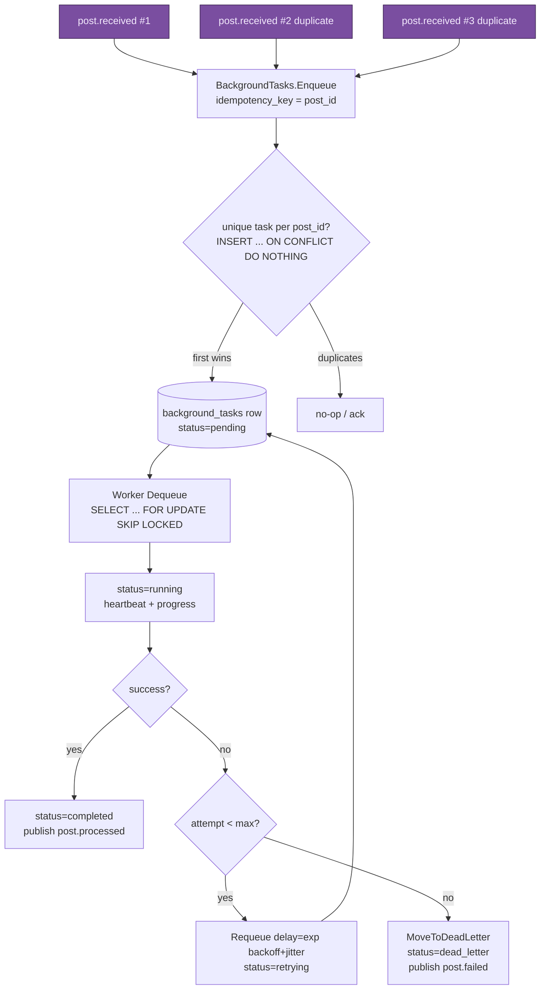

<!--
  Title           : Helix Thready — Concurrency, Idempotency, Retry & Circuit Breaking
  Classification  : PUBLIC
  Location        : docs/public/research/mvp/architecture/concurrency-and-idempotency.md
  Status          : Draft — v0.1
  Revision        : 1 (2026-07-21)
  Author          : Helix Thready documentation swarm (System Architecture)
  Related         : ./event-model.md, ./processing-pipeline.md, ./system-overview.md,
                    ./data-flow.md
-->

# Helix Thready — Concurrency, Idempotency, Retry & Circuit Breaking

| Rev | Date | Author | Change |
|-----|------|--------|--------|
| 1 | 2026-07-21 | swarm (System Architecture) | Initial draft — single-claim, backoff, breaker, precedence |

## Table of Contents

1. [The core invariant: process each post exactly once](#1-the-core-invariant-process-each-post-exactly-once)
2. [BackgroundTasks interfaces (verified)](#2-backgroundtasks-interfaces-verified)
3. [Single-claim per post](#3-single-claim-per-post)
4. [Single-claim diagram](#4-single-claim-diagram)
5. [Retry, back-off & dead-letter](#5-retry-back-off--dead-letter)
6. [Circuit breaker for external systems](#6-circuit-breaker-for-external-systems)
7. [Multi-hashtag concurrency & precedence](#7-multi-hashtag-concurrency--precedence)
8. [Concurrency caps & worker pool](#8-concurrency-caps--worker-pool)
9. [DDL: idempotent claim table](#9-ddl-idempotent-claim-table)
10. [Gap-register coverage](#10-gap-register-coverage)
11. [TDD reproduce-first skeletons](#11-tdd-reproduce-first-skeletons)
12. [Open items](#12-open-items)

---

## 1. The core invariant: process each post exactly once

The original request is emphatic: *"We MUST prevent race conditions or multiple same operations
performing in the same time on the exactly the same posts."* Because the event bus is
**at-least-once** ([event-model.md](./event-model.md)), the same `post.received` can be
delivered more than once, and a "new post" event storm can arrive while a scheduled poll also
picks the post up. The invariant is therefore enforced **at the work layer, not the event
layer**: a post has a stable id and a single processing-state row, and work is claimed with a
Postgres row lock so a given post is processed exactly once `[research_request_final §3.3]`.

This is the in-house analogue of an exactly-once claim registry `[CONSTITUTION §11.4.176]`. The
gap register notes `session_orchestrator` (the generic atomic claim registry) is DESIGN-ONLY
`[GAP: 2.9]`; Thready does **not** wait on it — it reuses the **VERIFIED** Postgres claim inside
`digital.vasic.background`.

## 2. BackgroundTasks interfaces (verified)

Read at source from `vasic-digital/BackgroundTasks/interfaces.go` — reproduced verbatim (the
surface Thready builds on):

```go
// digital.vasic.background
type TaskQueue interface {
    Enqueue(ctx context.Context, task *models.BackgroundTask) error
    Dequeue(ctx context.Context, workerID string, requirements ResourceRequirements) (*models.BackgroundTask, error)
    Peek(ctx context.Context, count int) ([]*models.BackgroundTask, error)
    Requeue(ctx context.Context, taskID string, delay time.Duration) error       // ← backoff
    MoveToDeadLetter(ctx context.Context, taskID string, reason string) error     // ← DLQ
    GetPendingCount(ctx context.Context) (int64, error)
    GetRunningCount(ctx context.Context) (int64, error)
    GetQueueDepth(ctx context.Context) (map[models.TaskPriority]int64, error)
}

type TaskRepository interface {
    Create(ctx context.Context, task *models.BackgroundTask) error
    UpdateStatus(ctx context.Context, id string, status models.TaskStatus) error
    UpdateHeartbeat(ctx context.Context, id string) error
    SaveCheckpoint(ctx context.Context, id string, checkpoint []byte) error
    GetStaleTasks(ctx context.Context, threshold time.Duration) ([]*models.BackgroundTask, error) // ← stuck recovery
    Dequeue(ctx context.Context, workerID string, maxCPUCores, maxMemoryMB int) (*models.BackgroundTask, error) // ← the claim
    MoveToDeadLetter(ctx context.Context, taskID, reason string) error
    // …LogEvent, GetTaskHistory, resource snapshots
}

type TaskExecutor interface {
    Execute(ctx context.Context, task *models.BackgroundTask, reporter ProgressReporter) error
    CanPause() bool
    Pause(ctx context.Context, task *models.BackgroundTask) ([]byte, error)   // checkpoint
    Resume(ctx context.Context, task *models.BackgroundTask, checkpoint []byte) error
    Cancel(ctx context.Context, task *models.BackgroundTask) error
    GetResourceRequirements() ResourceRequirements
}

type StuckDetector interface {
    IsStuck(ctx context.Context, task *models.BackgroundTask, snapshots []*models.ResourceSnapshot) (bool, string)
    GetStuckThreshold(taskType string) time.Duration
}
```

The `TaskStatus` enum is rich (VERIFIED): `pending, queued, running, retrying, backoff,
completed, failed, dead_letter, stuck, timeout, paused, reprocessing, refreshing, …`. Thready
maps its post lifecycle onto this enum rather than inventing a parallel one.

## 3. Single-claim per post

The Thready post-processing task uses `post_id` as the **idempotency key**. Two mechanisms
combine:

1. **Enqueue dedup** — the task is inserted with a `UNIQUE` constraint on
   `(post_id, task_kind)` and `INSERT … ON CONFLICT DO NOTHING`. Duplicate `post.received`
   deliveries collapse to a single row; the losers are acked without creating work.
2. **Claim dedup** — workers pull via `Dequeue`, which under the hood runs
   `SELECT … FOR UPDATE SKIP LOCKED` (Postgres) so exactly one worker transitions the row
   `pending → running`. Any concurrent worker skips the locked row. This is the same primitive
   the VERIFIED `TaskRepository.Dequeue(ctx, workerID, maxCPUCores, maxMemoryMB)` provides.

```go
// Thready processing enqueue — idempotent on post_id.
task := &models.BackgroundTask{
    ID:        uuid.NewString(),
    Type:      "thready.post.process",
    Priority:  models.PriorityNormal,
    Payload:   mustJSON(PostJob{PostID: p.ID, AccountID: p.AccountID}),
    DedupeKey: p.ID, // maps to UNIQUE(post_id, task_kind)
}
if err := queue.Enqueue(ctx, task); err != nil {
    if errors.Is(err, models.ErrDuplicateTask) { return nil } // storm-safe no-op
    return err
}
```

## 4. Single-claim diagram



> Rendered PNG/SVG exported via Docs Chain (§11.4.65). Source: `diagrams/single-claim.mmd`.

**Explanation (for readers/models that cannot see the diagram).** Three duplicate
`post.received` events (a redelivery storm plus a scheduled poll) all reach `Enqueue`, keyed by
the same `post_id`. The dedup gate (`INSERT … ON CONFLICT DO NOTHING` on a unique
`(post_id, task_kind)`) admits the first and turns the others into acknowledged no-ops, so only
one `background_tasks` row exists in `pending`. A worker then claims it with
`SELECT … FOR UPDATE SKIP LOCKED`, flipping it to `running`; concurrent workers skip the locked
row, so exactly one executes. On success the row goes `completed` and `post.processed` is
published. On failure the retry gate checks the attempt count: if attempts remain, the task is
`Requeue`d with an exponential-backoff-plus-jitter delay and returns to `pending` (as
`retrying`); if the ceiling is hit, it is moved to the dead-letter queue as `dead_letter` and
`post.failed` is published. Two independent dedup layers (enqueue-time and claim-time) mean the
exactly-once guarantee holds even if the unique constraint is somehow bypassed.

## 5. Retry, back-off & dead-letter

`[research_request_final §3.3]` `[DEFAULT — adjustable]`:

| Parameter | Default | Notes |
|-----------|---------|-------|
| Max retries (whole post) | 5 | then `MoveToDeadLetter` |
| Base delay | 2 s | exponential |
| Factor | 2.0 | 2s, 4s, 8s, 16s, 32s |
| Jitter | ±20% full-jitter | avoids thundering herd on a flapping dependency |
| Cap | 5 min | delay never exceeds |
| Per-step retry | independent | a failed *step* (e.g. download) retries without re-running succeeded steps |

Retries are **per step and per whole post**: because Skills run in an ordered pipeline
(download→convert→analyze→research→reply), a transient download failure retries only the
download step (checkpointed via `TaskExecutor.Pause/Resume`), not the whole post. Manual retry
(operator/user via REST) and full refresh (reprocess) reuse the same machinery — reprocess sets
status `reprocessing` and invalidates the sticky `post.state` (see [event-model.md](./event-model.md)).

```go
func nextBackoff(attempt int) time.Duration {
    base := 2 * time.Second
    d := time.Duration(float64(base) * math.Pow(2.0, float64(attempt)))
    if d > 5*time.Minute { d = 5 * time.Minute }
    jitter := time.Duration(rand.Int63n(int64(d) / 5)) // ±20%
    return d - (d / 10) + jitter
}
// on step failure:
_ = queue.Requeue(ctx, task.ID, nextBackoff(task.Attempt))
```

**Stuck recovery** — `StuckDetector` + `GetStaleTasks(threshold)` reclaim tasks whose worker
died mid-run (heartbeat stale): the row is returned to `pending`, honoring the same idempotency
(the dead worker's partial side-effects are safe because each Skill step is itself idempotent —
see [processing-pipeline.md](./processing-pipeline.md)).

## 6. Circuit breaker for external systems

Every flapping external dependency is wrapped in a circuit breaker. The pattern already exists
in `LLMProvider`, `filesystem`, and `lets_encrypt` `[research_request_final §3.3]`; Thready
reuses it and adds breakers around messenger APIs and the delegated download systems.

```go
// Illustrative breaker config per dependency (reusing the LLMProvider breaker pattern).
breaker := circuitbreaker.New(circuitbreaker.Config{
    FailureThreshold: 5,          // consecutive failures → open
    OpenDuration:     30 * time.Second, // stay open, fail fast
    HalfOpenProbes:   2,          // trial calls before closing
})
res, err := breaker.Do(ctx, func() (any, error) { return helixLLM.Research(ctx, q) })
if errors.Is(err, circuitbreaker.ErrOpen) {
    // fall back: LLMProvider cloud fallback, or requeue with backoff
}
```

| Dependency | Breaker opens on | Fallback |
|------------|------------------|----------|
| HelixLLM (local) | 5 consecutive 5xx/timeouts | `LLMProvider` cloud fallback chain (claude-sonnet-4, gemini-2.5-pro, deepseek-v3) |
| Telegram/Max API | rate-limit / auth errors | back off, honor FLOOD_WAIT, requeue |
| Boba / MeTube / Download Mgr | callback-timeout / 5xx | requeue delegated job with backoff; surface `post.failed` if exhausted |
| pgvector search | connection errors | serve from cache; degrade to relational filter |

## 7. Multi-hashtag concurrency & precedence

A post may match **multiple** categories simultaneously (e.g. `#Research #Video #TODO
#ToDownload`). Categories are **additive, not exclusive** — the post runs *every* matching
Skill `[research_request_final §3.3]`. Ordering is deterministic by a Skill `SortOrder`, and
conflicting instructions resolve through a fixed precedence:

> **download > convert > analyze > research > reply**

This ordering exists so later stages can consume earlier outputs: research can analyze
downloaded media, and the status reply is always last so it reports the full result. Within a
stage, independent Skills may run concurrently (bounded by per-Skill caps); across stages the
order is strict. Full recipe/dispatch detail is in
[processing-pipeline.md](./processing-pipeline.md).

## 8. Concurrency caps & worker pool

`[research_request_final Q4]` `[DEFAULT — adjustable]`:

- **Global worker pool** — 32 workers (BackgroundTasks worker pool), tuned to the Hetzner host.
- **Per-Skill concurrency caps** — e.g. LLM-research Skills capped low (GPU-bound: 4), download
  Skills delegated to external pools (Boba/MeTube/Download-Manager have their own concurrency).
- **Resource-aware dequeue** — `Dequeue(workerID, maxCPUCores, maxMemoryMB)` (VERIFIED) only
  hands a worker a task whose `ResourceRequirements` fit; a 70B-model research task will not be
  claimed by a resource-starved worker.

## 9. DDL: idempotent claim table

The Thready processing-state row that backs the invariant (PostgreSQL). Actual queue columns
are owned by `digital.vasic.background`; this is the Thready-side processing state that the
task references.

```sql
CREATE TABLE post_processing_state (
    post_id        UUID PRIMARY KEY REFERENCES posts(id) ON DELETE CASCADE,
    account_id     UUID NOT NULL REFERENCES accounts(id),
    task_kind      TEXT NOT NULL DEFAULT 'thready.post.process',
    status         TEXT NOT NULL DEFAULT 'pending',   -- mirrors models.TaskStatus
    claimed_by     TEXT,                              -- worker_id, NULL until claimed
    claimed_at     TIMESTAMPTZ,
    attempt        INT  NOT NULL DEFAULT 0,
    last_error     TEXT,
    checkpoint     BYTEA,                             -- TaskExecutor.Pause() blob
    updated_at     TIMESTAMPTZ NOT NULL DEFAULT now(),
    CONSTRAINT uq_post_task UNIQUE (post_id, task_kind)  -- ← enqueue dedup
);
-- Claim query (conceptual; background owns the queue table):
--   UPDATE post_processing_state SET status='running', claimed_by=$1, claimed_at=now()
--   WHERE post_id = (SELECT post_id FROM post_processing_state
--                    WHERE status='pending' ORDER BY updated_at
--                    FOR UPDATE SKIP LOCKED LIMIT 1)
--   RETURNING post_id;
CREATE INDEX idx_pps_status ON post_processing_state (status, updated_at)
    WHERE status IN ('pending','retrying');
```

Forward/rollback migration is delivered via `database/pkg/migration.Runner` (up/down); the DB
pack carries the full migration script `[research_request_final Q30]`.

## 10. Gap-register coverage

- `[GAP: 2.9]` `session_orchestrator` DESIGN-ONLY — **closed by design**: Thready's single-claim
  reuses the VERIFIED BackgroundTasks Postgres claim, not the unimplemented registry. If/when
  `session_orchestrator` lands, it can adopt the same `(post_id, task_kind)` unique + row-lock
  pattern documented here (the request explicitly notes "Thready's idempotent
  single-claim-per-post reuses the same concept").
- `[GAP: 3.2]` database has no partition helpers — the `post_processing_state` and `posts`
  tables are time-partitioned in [data-flow.md](./data-flow.md); the claim query is
  partition-pruning-friendly (filters on `status` + recent `updated_at`).

## 11. TDD reproduce-first skeletons

```go
// RED: event storm must yield exactly one claim.
func TestSingleClaim_UnderStorm(t *testing.T) {
    q := newPostgresQueue(t)
    var wg sync.WaitGroup
    for i := 0; i < 50; i++ { // 50 concurrent duplicate enqueues
        wg.Add(1); go func() { defer wg.Done(); _ = enqueuePost(q, "p1") }()
    }
    wg.Wait()
    require.Equal(t, int64(1), q.CountTasksFor("p1")) // FAILS w/o UNIQUE+ON CONFLICT
}

// RED: two workers must not both claim the same pending task.
func TestClaim_MutualExclusion(t *testing.T) {
    q := newPostgresQueue(t); enqueuePost(q, "p2")
    a, _ := q.Dequeue(ctx, "worker-a", anyResources)
    b, _ := q.Dequeue(ctx, "worker-b", anyResources)
    require.True(t, (a == nil) != (b == nil)) // exactly one non-nil
}

// RED: exhausted retries move to dead-letter and emit post.failed.
func TestRetryExhaustion_DeadLetters(t *testing.T) {
    task := failingTask(maxRetries=5)
    runToExhaustion(t, task)
    require.Equal(t, models.TaskStatusDeadLetter, task.Status)
    require.True(t, sawEvent(t, "post.failed"))
}
```

## 12. Open items

- `[OPEN: CONC-1]` Exact `models.BackgroundTask` field names (e.g. `DedupeKey`, `Attempt`) used
  in snippets are illustrative; the enqueue-dedup must be wired to whatever unique/dedup field
  `digital.vasic.background` exposes (its `models/background_task.go` was not read field-by-field
  this pass). Tracked as a workable item to source-confirm before implementation.
- `[OPEN: CONC-2]` The circuit-breaker package's exact import path (`LLMProvider`'s internal vs a
  shared `resilience` package) needs source confirmation; `discovery/pkg/resilience` exists and
  may be the shared home. Tracked for the re-verification backlog.

---

*Made with love ♥ by Helix Development.*
