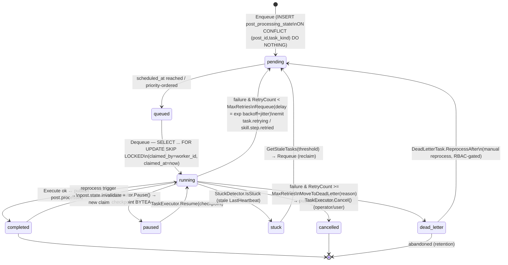

<!--
  Title           : Helix Thready — Concurrency, Idempotency, Retry & Circuit Breaking
  Classification  : PUBLIC
  Location        : docs/public/research/mvp/architecture/concurrency-and-idempotency.md
  Status          : Draft — v0.1
  Revision        : 1 (2026-07-21)
  Author          : Helix Thready documentation swarm (System Architecture)
  Related         : ./event-model.md, ./processing-pipeline.md, ./system-overview.md,
                    ./data-flow.md
-->

# Helix Thready — Concurrency, Idempotency, Retry & Circuit Breaking

| Rev | Date | Author | Change |
|-----|------|--------|--------|
| 1 | 2026-07-21 | swarm (System Architecture) | Initial draft — single-claim, backoff, breaker, precedence |
| 2 | 2026-07-22 | swarm (Pass 3 depth) | Close CONC-1 (real `models.BackgroundTask` — no `DedupeKey`; real 9-value `TaskStatus`) & CONC-2 (`discovery/pkg/resilience.Manager`+`ConnectionState`); add retry/back-off state machine (§5.1); deepen single-claim explanation |
| 3 | 2026-07-22 | swarm (Pass 3 consistency) | Fix residual `retrying`-as-status in the §4 single-claim diagram + `single-claim.mmd` sibling + §9 partial-index (retry returns to `pending`; `retrying` is the `task.retrying` event, not a status — aligns with §2/§5.1) |
| 4 | 2026-07-22 | swarm (Pass 3 consistency, cont.) | Fix residual `reprocessing`-as-status in §5 (reprocess re-enters as a fresh `pending → running` cycle; `reprocessing` is the sticky `post.state` *display* value, not a `TaskStatus` — aligns with §2/§5.1, data-flow §7, post-lifecycle §6) |

## Table of Contents

1. [The core invariant: process each post exactly once](#1-the-core-invariant-process-each-post-exactly-once)
2. [BackgroundTasks interfaces (verified)](#2-backgroundtasks-interfaces-verified)
3. [Single-claim per post](#3-single-claim-per-post)
4. [Single-claim diagram](#4-single-claim-diagram)
5. [Retry, back-off & dead-letter](#5-retry-back-off--dead-letter)
5.1. [Retry/back-off state machine](#51-retryback-off-state-machine)
6. [Circuit breaker for external systems](#6-circuit-breaker-for-external-systems)
7. [Multi-hashtag concurrency & precedence](#7-multi-hashtag-concurrency--precedence)
8. [Concurrency caps & worker pool](#8-concurrency-caps--worker-pool)
9. [DDL: idempotent claim table](#9-ddl-idempotent-claim-table)
10. [Gap-register coverage](#10-gap-register-coverage)
11. [TDD reproduce-first skeletons](#11-tdd-reproduce-first-skeletons)
12. [Open items](#12-open-items)

---

## 1. The core invariant: process each post exactly once

The original request is emphatic: *"We MUST prevent race conditions or multiple same operations
performing in the same time on the exactly the same posts."* Because the event bus is
**at-least-once** ([event-model.md](./event-model.md)), the same `post.received` can be
delivered more than once, and a "new post" event storm can arrive while a scheduled poll also
picks the post up. The invariant is therefore enforced **at the work layer, not the event
layer**: a post has a stable id and a single processing-state row, and work is claimed with a
Postgres row lock so a given post is processed exactly once `[research_request_final §3.3]`.

This is the in-house analogue of an exactly-once claim registry `[CONSTITUTION §11.4.176]`. The
gap register notes `session_orchestrator` (the generic atomic claim registry) is DESIGN-ONLY
`[GAP: 2.9]`; Thready does **not** wait on it — it reuses the **VERIFIED** Postgres claim inside
`digital.vasic.background`.

## 2. BackgroundTasks interfaces (verified)

Read at source from `vasic-digital/BackgroundTasks/interfaces.go` — reproduced verbatim (the
surface Thready builds on):

```go
// digital.vasic.background
type TaskQueue interface {
    Enqueue(ctx context.Context, task *models.BackgroundTask) error
    Dequeue(ctx context.Context, workerID string, requirements ResourceRequirements) (*models.BackgroundTask, error)
    Peek(ctx context.Context, count int) ([]*models.BackgroundTask, error)
    Requeue(ctx context.Context, taskID string, delay time.Duration) error       // ← backoff
    MoveToDeadLetter(ctx context.Context, taskID string, reason string) error     // ← DLQ
    GetPendingCount(ctx context.Context) (int64, error)
    GetRunningCount(ctx context.Context) (int64, error)
    GetQueueDepth(ctx context.Context) (map[models.TaskPriority]int64, error)
}

type TaskRepository interface {
    Create(ctx context.Context, task *models.BackgroundTask) error
    UpdateStatus(ctx context.Context, id string, status models.TaskStatus) error
    UpdateHeartbeat(ctx context.Context, id string) error
    SaveCheckpoint(ctx context.Context, id string, checkpoint []byte) error
    GetStaleTasks(ctx context.Context, threshold time.Duration) ([]*models.BackgroundTask, error) // ← stuck recovery
    Dequeue(ctx context.Context, workerID string, maxCPUCores, maxMemoryMB int) (*models.BackgroundTask, error) // ← the claim
    MoveToDeadLetter(ctx context.Context, taskID, reason string) error
    // …LogEvent, GetTaskHistory, resource snapshots
}

type TaskExecutor interface {
    Execute(ctx context.Context, task *models.BackgroundTask, reporter ProgressReporter) error
    CanPause() bool
    Pause(ctx context.Context, task *models.BackgroundTask) ([]byte, error)   // checkpoint
    Resume(ctx context.Context, task *models.BackgroundTask, checkpoint []byte) error
    Cancel(ctx context.Context, task *models.BackgroundTask) error
    GetResourceRequirements() ResourceRequirements
}

type StuckDetector interface {
    IsStuck(ctx context.Context, task *models.BackgroundTask, snapshots []*models.ResourceSnapshot) (bool, string)
    GetStuckThreshold(taskType string) time.Duration
}
```

The `TaskStatus` enum was **re-read field-by-field at source** this pass
(`models/background_task.go`, VERIFIED) and is **exactly nine** values —
`pending, queued, running, paused, completed, failed, stuck, cancelled, dead_letter` — with
`IsTerminal()` (completed/failed/cancelled/dead_letter) and `IsActive()` (queued/running)
helpers. **Anti-bluff correction:** an earlier draft listed `retrying / backoff / timeout /
reprocessing / refreshing` as statuses; those are **not** in the enum. Retry is *not* a status —
it is tracked by the `RetryCount` / `MaxRetries` / `RetryDelaySeconds` / `LastError` /
`ErrorHistory` fields plus the `task.retrying` execution-history **event** (`models.TaskEventRetrying`);
a retrying task physically returns to `pending`/`queued`. Thready therefore maps its post
lifecycle onto the real nine states and models "reprocessing" as a fresh `pending → running`
cycle (not a distinct status). The module default retry ceiling is `MaxRetries = 3`
(`NewBackgroundTask`); Thready overrides it to 5 as a `[DEFAULT — adjustable]` (see §5).

`models.BackgroundTask` itself (VERIFIED) carries no dedicated dedup column — its identity/link
fields are `ID`, `TaskType`, `TaskName`, `CorrelationID *string`, `ParentTaskID *string`, plus
free-form `Tags`/`Metadata` (`json.RawMessage`) and `Payload json.RawMessage`. This is the crux
of `[OPEN: CONC-1]`, now **closed**: there is **no `DedupeKey` field and no `ErrDuplicateTask`**
in the module — so enqueue-dedup cannot lean on the queue model and MUST be enforced Thready-side
(the `post_processing_state` UNIQUE + `ON CONFLICT` in §3/§9), carrying `post_id` in
`CorrelationID`.

## 3. Single-claim per post

The Thready post-processing task uses `post_id` as the **idempotency key**. Two mechanisms
combine:

1. **Enqueue dedup** — the task is inserted with a `UNIQUE` constraint on
   `(post_id, task_kind)` and `INSERT … ON CONFLICT DO NOTHING`. Duplicate `post.received`
   deliveries collapse to a single row; the losers are acked without creating work.
2. **Claim dedup** — workers pull via `Dequeue`, which under the hood runs
   `SELECT … FOR UPDATE SKIP LOCKED` (Postgres) so exactly one worker transitions the row
   `pending → running`. Any concurrent worker skips the locked row. This is the same primitive
   the VERIFIED `TaskRepository.Dequeue(ctx, workerID, maxCPUCores, maxMemoryMB)` provides.

```go
// Thready processing enqueue — idempotent on post_id.
// Uses ONLY real models.BackgroundTask fields (VERIFIED: models/background_task.go).
// There is no DedupeKey/ErrDuplicateTask in the module — the dedup gate is the
// Thready-owned post_processing_state UNIQUE(post_id, task_kind) + ON CONFLICT (§9),
// and post_id rides in CorrelationID (the module's natural correlation field).
corr := p.ID
task := models.NewBackgroundTask("thready.post.process", "post "+p.ID,
    mustJSON(PostJob{PostID: p.ID, AccountID: p.AccountID})) // sets sane defaults
task.CorrelationID = &corr                                   // = post_id (dedup + tracing key)
task.Priority = models.TaskPriorityNormal
task.MaxRetries = 5                                          // Thready override (module default 3)

// 1) Thready-side dedup FIRST: claim the single processing-state row for this post.
if firstWriter, err := claims.InsertIfAbsent(ctx, p.ID, "thready.post.process"); err != nil {
    return err
} else if !firstWriter {
    return nil // duplicate post.received storm → storm-safe no-op (row already exists)
}
// 2) Only the first writer enqueues the background task.
if err := queue.Enqueue(ctx, task); err != nil { return err }
```

## 4. Single-claim diagram

```mermaid
flowchart TB
  E1[post.received #1]:::ev
  E2[post.received #2 duplicate]:::ev
  E3[post.received #3 duplicate]:::ev
  E1 & E2 & E3 --> Q[BackgroundTasks.Enqueue\nidempotency_key = post_id]
  Q --> DEDUP{unique task per post_id?\nINSERT ... ON CONFLICT DO NOTHING}
  DEDUP -->|first wins| ROW[(background_tasks row\nstatus=pending)]
  DEDUP -->|duplicates| DROP[no-op / ack]
  ROW --> CLAIM[Worker Dequeue\nSELECT ... FOR UPDATE SKIP LOCKED]
  CLAIM --> RUN[status=running\nheartbeat + progress]
  RUN --> OK{success?}
  OK -->|yes| DONE[status=completed\npublish post.processed]
  OK -->|no| RETRY{attempt < max?}
  RETRY -->|yes| BACKOFF[Requeue delay=exp backoff+jitter\n→ status=pending (task.retrying event, not a status)]
  BACKOFF --> ROW
  RETRY -->|no| DLQ[MoveToDeadLetter\nstatus=dead_letter\npublish post.failed]
  classDef ev fill:#7a4ea0,stroke:#3c2352,color:#f3e9ff;
```

> Rendered PNG/SVG exported via Docs Chain (§11.4.65). Source: `diagrams/single-claim.mmd`.

**Explanation (for readers/models that cannot see the diagram).** The diagram traces one post
through two independent deduplication layers so that a redelivery storm can never fan out into
duplicate work. On the left, three copies of the same logical event — `post.received #1` and two
duplicates (`#2`, `#3`) — arrive together. In production this is exactly what happens: NATS
JetStream is at-least-once so a consumer restart redelivers the unacknowledged message, and a
scheduled channel poll can independently rediscover the same root post while the push-triggered
event is still in flight. All three carry the same `idempotency_key = post_id`, which is what
lets the system collapse them.

The **first** dedup layer is the enqueue gate. Every arrival attempts to create the single
`post_processing_state` row for its `post_id` via `INSERT … ON CONFLICT (post_id, task_kind) DO
NOTHING`. Postgres admits exactly one writer; the losers get zero affected rows and are turned
into acknowledged no-ops (they are *acked* to JetStream so they are not redelivered forever, but
they create no work). The outcome is a single `pending` row regardless of how many duplicates
raced. This layer is Thready-owned precisely because — as `[OPEN: CONC-1]` established at source —
the `models.BackgroundTask` queue model has no dedup column of its own.

The **second** dedup layer is the claim gate, and it defends against a different failure: two
*workers* polling the queue at the same instant. `Dequeue` runs `SELECT … FOR UPDATE SKIP
LOCKED` (VERIFIED in `background_tasks/docs/ARCHITECTURE.md` — "Atomic dequeue with `SELECT … FOR
UPDATE SKIP LOCKED`"), so the row is row-locked by whichever worker reaches it first and every
concurrent worker *skips* the locked row rather than blocking on it. Exactly one worker
transitions `pending → running`, stamping `claimed_by` and `claimed_at`. From there the happy
path flips the row to `completed` and publishes `post.processed`; the failure path consults the
attempt counter (§5). Having two orthogonal gates — enqueue-time and claim-time — means the
exactly-once invariant survives even if one gate is bypassed by a bug, a manual re-insert, or a
schema regression: the constraint and the row-lock are belt-and-braces for the single most
load-bearing correctness requirement in the system.

## 5. Retry, back-off & dead-letter

`[research_request_final §3.3]` `[DEFAULT — adjustable]`:

| Parameter | Default | Notes |
|-----------|---------|-------|
| Max retries (whole post) | 5 | then `MoveToDeadLetter` |
| Base delay | 2 s | exponential |
| Factor | 2.0 | 2s, 4s, 8s, 16s, 32s |
| Jitter | ±20% full-jitter | avoids thundering herd on a flapping dependency |
| Cap | 5 min | delay never exceeds |
| Per-step retry | independent | a failed *step* (e.g. download) retries without re-running succeeded steps |

Retries are **per step and per whole post**: because Skills run in an ordered pipeline
(download→convert→analyze→research→reply), a transient download failure retries only the
download step (checkpointed via `TaskExecutor.Pause/Resume`), not the whole post. Manual retry
(operator/user via REST) and full refresh (reprocess) reuse the same machinery — reprocess re-enters
the machine as a fresh `pending → running` cycle — there is **no** `reprocessing` task *status*
(§2/§5.1); the sticky `post.state` *display* value shows `reprocessing`, and the prior sticky value
is invalidated (see [event-model.md](./event-model.md)).

```go
func nextBackoff(attempt int) time.Duration {
    base := 2 * time.Second
    d := time.Duration(float64(base) * math.Pow(2.0, float64(attempt)))
    if d > 5*time.Minute { d = 5 * time.Minute }
    jitter := time.Duration(rand.Int63n(int64(d) / 5)) // ±20%
    return d - (d / 10) + jitter
}
// on step failure:
_ = queue.Requeue(ctx, task.ID, nextBackoff(task.Attempt))
```

**Stuck recovery** — `StuckDetector.IsStuck(...)` + `TaskRepository.GetStaleTasks(threshold)`
reclaim tasks whose worker died mid-run (stale `LastHeartbeat`, updated via
`UpdateHeartbeat`/`ReportHeartbeat` — VERIFIED). The row is returned to `pending`, honoring the
same idempotency (the dead worker's partial side-effects are safe because each Skill step is
itself idempotent — see [processing-pipeline.md](./processing-pipeline.md)). The stale threshold
is per task-type via `StuckDetector.GetStuckThreshold(taskType)`; the module default heartbeat
interval is 10 s and stuck threshold 300 s (`DefaultTaskConfig`, VERIFIED).

### 5.1 Retry/back-off state machine

The post-processing task walks a fixed state machine grounded in the **real nine-value**
`models.TaskStatus` enum (§2). Retry, stuck-recovery and reprocess are all expressed as
transitions *between those states* — there is no separate `retrying`/`backoff` status.



> Rendered PNG/SVG exported via Docs Chain (§11.4.65). Source: `diagrams/retry-state-machine.mmd`.

**Explanation (for readers/models that cannot see the diagram).** The machine begins when a
`post.received` is admitted by the enqueue dedup gate, creating the `post_processing_state` row in
`pending`. Once the row's `scheduled_at` is reached and it wins priority ordering, it becomes
`queued`; a worker's `Dequeue` (the `FOR UPDATE SKIP LOCKED` claim) is the only transition into
`running`, which is why exactly one worker ever executes a given post. `running` is the hub of the
machine — five distinct edges leave it, and understanding them is understanding the whole
resilience design.

The **success** edge (`running → completed`) publishes `post.processed` and the sticky
`post.state=done`, then terminates. The **pause/resume** pair (`running ⇄ paused`) exists so a
long, checkpointable Skill step can yield its worker without losing progress: `TaskExecutor.Pause`
returns a checkpoint blob that is persisted (`SaveCheckpoint`), and `Resume` restores it — this is
how a 30-minute research step survives a graceful worker drain. The **stuck** edge (`running →
stuck → pending`) is the crash-safety net: if a worker dies mid-run its heartbeat goes stale,
`StuckDetector` flags the task, and `GetStaleTasks` returns it to `pending` for another worker.

The two **failure** edges are the retry/back-off core. On a transient failure with attempts
remaining (`RetryCount < MaxRetries`), the task is `Requeue`d with an exponential-backoff-plus-
full-jitter delay (§5) and returns to `pending`; the retry is recorded as the `task.retrying`
execution-history event (and, per step, `skill.step.retried`) — crucially it is *not* a distinct
status, so the machine has no illegal states to reconcile. On a failure with the ceiling reached
(`RetryCount >= MaxRetries`), the task is moved to `dead_letter` via `MoveToDeadLetter(reason)`
and `post.failed` is published. Two edges re-enter the machine from terminal-ish states:
`dead_letter → pending` is an operator/user-driven manual reprocess (a `DeadLetterTask` carries
`ReprocessAfter`/`Reprocessed` fields, VERIFIED), and `completed → running` is the ordinary
reprocess trigger, which first invalidates the sticky `post.state`
([event-model.md](./event-model.md)) and then claims a fresh run. Every terminal state
(`completed`, `cancelled`, and eventually an abandoned `dead_letter`) is reachable exactly once
per claim, which keeps the post's audit trail linear and its sticky state coherent.

## 6. Circuit breaker for external systems

Every flapping external dependency is wrapped in a circuit breaker. The pattern already exists
in `LLMProvider`, `filesystem`, and `lets_encrypt` `[research_request_final §3.3]`; Thready
reuses it and adds breakers around messenger APIs and the delegated download systems.

**Verified shared home (`[OPEN: CONC-2]`, now narrowed).** A shared resilience package was
**read at source** this pass: `digital.vasic.discovery/pkg/resilience` exposes a `Manager`
(`NewManager(logger Logger, metrics MetricsReporter) *Manager`) driving a **four-state
connection state machine** — `Connected → Disconnected → Reconnecting → Offline` — with health
metrics (`Healthy = 1.0`, `Degraded = 0.5`, `OfflineHealth = 0.0`) surfaced via
`ConnectionState.HealthMetric()` and `Source`/`Event`/`EventType` types (VERIFIED). This is a
**connection-availability/failover** breaker keyed on a `Source` endpoint (ideal for wrapping a
messenger session, HelixLLM, or a download backend as a monitored source), *not* a generic
per-call `Do(fn)` wrapper. The remaining ambiguity is therefore narrower than before: a
**call-level** breaker (open after N consecutive failures on one function call) is provided
internally by `LLMProvider`; whether Thready adopts `discovery/pkg/resilience.Manager` for
source-level failover and `LLMProvider`'s internal breaker for call-level, or unifies them, is
the residual decision tracked in §12. The illustrative `circuitbreaker.New(...).Do(...)` below is
the *call-level* shape and is representative, not the `resilience.Manager` API.

```go
// Illustrative breaker config per dependency (reusing the LLMProvider breaker pattern).
breaker := circuitbreaker.New(circuitbreaker.Config{
    FailureThreshold: 5,          // consecutive failures → open
    OpenDuration:     30 * time.Second, // stay open, fail fast
    HalfOpenProbes:   2,          // trial calls before closing
})
res, err := breaker.Do(ctx, func() (any, error) { return helixLLM.Research(ctx, q) })
if errors.Is(err, circuitbreaker.ErrOpen) {
    // fall back: LLMProvider cloud fallback, or requeue with backoff
}
```

| Dependency | Breaker opens on | Fallback |
|------------|------------------|----------|
| HelixLLM (local) | 5 consecutive 5xx/timeouts | `LLMProvider` cloud fallback chain (claude-sonnet-4, gemini-2.5-pro, deepseek-v3) |
| Telegram/Max API | rate-limit / auth errors | back off, honor FLOOD_WAIT, requeue |
| Boba / MeTube / Download Mgr | callback-timeout / 5xx | requeue delegated job with backoff; surface `post.failed` if exhausted |
| pgvector search | connection errors | serve from cache; degrade to relational filter |

## 7. Multi-hashtag concurrency & precedence

A post may match **multiple** categories simultaneously (e.g. `#Research #Video #TODO
#ToDownload`). Categories are **additive, not exclusive** — the post runs *every* matching
Skill `[research_request_final §3.3]`. Ordering is deterministic by a Skill `SortOrder`, and
conflicting instructions resolve through a fixed precedence:

> **download > convert > analyze > research > reply**

This ordering exists so later stages can consume earlier outputs: research can analyze
downloaded media, and the status reply is always last so it reports the full result. Within a
stage, independent Skills may run concurrently (bounded by per-Skill caps); across stages the
order is strict. Full recipe/dispatch detail is in
[processing-pipeline.md](./processing-pipeline.md).

## 8. Concurrency caps & worker pool

`[research_request_final Q4]` `[DEFAULT — adjustable]`:

- **Global worker pool** — 32 workers (BackgroundTasks worker pool), tuned to the Hetzner host.
- **Per-Skill concurrency caps** — e.g. LLM-research Skills capped low (GPU-bound: 4), download
  Skills delegated to external pools (Boba/MeTube/Download-Manager have their own concurrency).
- **Resource-aware dequeue** — `Dequeue(workerID, maxCPUCores, maxMemoryMB)` (VERIFIED) only
  hands a worker a task whose `ResourceRequirements` fit; a 70B-model research task will not be
  claimed by a resource-starved worker.

## 9. DDL: idempotent claim table

The Thready processing-state row that backs the invariant (PostgreSQL). Actual queue columns
are owned by `digital.vasic.background`; this is the Thready-side processing state that the
task references.

```sql
CREATE TABLE post_processing_state (
    post_id        UUID PRIMARY KEY REFERENCES posts(id) ON DELETE CASCADE,
    account_id     UUID NOT NULL REFERENCES accounts(id),
    task_kind      TEXT NOT NULL DEFAULT 'thready.post.process',
    status         TEXT NOT NULL DEFAULT 'pending',   -- mirrors models.TaskStatus
    claimed_by     TEXT,                              -- worker_id, NULL until claimed
    claimed_at     TIMESTAMPTZ,
    attempt        INT  NOT NULL DEFAULT 0,
    last_error     TEXT,
    checkpoint     BYTEA,                             -- TaskExecutor.Pause() blob
    updated_at     TIMESTAMPTZ NOT NULL DEFAULT now(),
    CONSTRAINT uq_post_task UNIQUE (post_id, task_kind)  -- ← enqueue dedup
);
-- Claim query (conceptual; background owns the queue table):
--   UPDATE post_processing_state SET status='running', claimed_by=$1, claimed_at=now()
--   WHERE post_id = (SELECT post_id FROM post_processing_state
--                    WHERE status='pending' ORDER BY updated_at
--                    FOR UPDATE SKIP LOCKED LIMIT 1)
--   RETURNING post_id;
-- Partial claim index: a retried task returns to 'pending' (retrying is NOT a status — §2),
-- so the claim hot path filters on 'pending' only.
CREATE INDEX idx_pps_status ON post_processing_state (status, updated_at)
    WHERE status = 'pending';
```

Forward/rollback migration is delivered via `database/pkg/migration.Runner` (up/down); the DB
pack carries the full migration script `[research_request_final Q30]`.

## 10. Gap-register coverage

- `[GAP: 2.9]` `session_orchestrator` DESIGN-ONLY — **closed by design**: Thready's single-claim
  reuses the VERIFIED BackgroundTasks Postgres claim, not the unimplemented registry. If/when
  `session_orchestrator` lands, it can adopt the same `(post_id, task_kind)` unique + row-lock
  pattern documented here (the request explicitly notes "Thready's idempotent
  single-claim-per-post reuses the same concept").
- `[GAP: 3.2]` database has no partition helpers — the `post_processing_state` and `posts`
  tables are time-partitioned in [data-flow.md](./data-flow.md); the claim query is
  partition-pruning-friendly (filters on `status` + recent `updated_at`).

## 11. TDD reproduce-first skeletons

```go
// RED: event storm must yield exactly one claim.
func TestSingleClaim_UnderStorm(t *testing.T) {
    q := newPostgresQueue(t)
    var wg sync.WaitGroup
    for i := 0; i < 50; i++ { // 50 concurrent duplicate enqueues
        wg.Add(1); go func() { defer wg.Done(); _ = enqueuePost(q, "p1") }()
    }
    wg.Wait()
    require.Equal(t, int64(1), q.CountTasksFor("p1")) // FAILS w/o UNIQUE+ON CONFLICT
}

// RED: two workers must not both claim the same pending task.
func TestClaim_MutualExclusion(t *testing.T) {
    q := newPostgresQueue(t); enqueuePost(q, "p2")
    a, _ := q.Dequeue(ctx, "worker-a", anyResources)
    b, _ := q.Dequeue(ctx, "worker-b", anyResources)
    require.True(t, (a == nil) != (b == nil)) // exactly one non-nil
}

// RED: exhausted retries move to dead-letter and emit post.failed.
func TestRetryExhaustion_DeadLetters(t *testing.T) {
    task := failingTask(maxRetries=5)
    runToExhaustion(t, task)
    require.Equal(t, models.TaskStatusDeadLetter, task.Status)
    require.True(t, sawEvent(t, "post.failed"))
}
```

## 12. Open items

- `[CLOSED: CONC-1]` (was: exact `models.BackgroundTask` dedup field). **Source-verified this
  pass** (`models/background_task.go`): the model has **no `DedupeKey` and no `ErrDuplicateTask`**;
  its correlation field is `CorrelationID *string`, retry state is
  `RetryCount`/`MaxRetries`/`RetryDelaySeconds`/`LastError`/`ErrorHistory`, and `TaskStatus` is the
  nine-value enum in §2. Enqueue-dedup is therefore Thready-side via `post_processing_state`
  `UNIQUE(post_id, task_kind)` + `ON CONFLICT` (§3/§9), with `post_id` carried in `CorrelationID`.
  No residual verification needed.
- `[OPEN: CONC-2]` (narrowed). **Source-verified** that a shared resilience package exists:
  `discovery/pkg/resilience.Manager` + the `Connected/Disconnected/Reconnecting/Offline`
  `ConnectionState` machine (§6). Residual decision (not a verification gap): whether Thready
  standardizes source-level failover on `resilience.Manager` and keeps `LLMProvider`'s internal
  call-level breaker, or unifies both behind one seam. Tracked as a design workable item.

---

*Made with love ♥ by Helix Development.*
