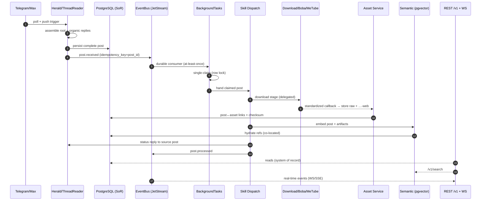
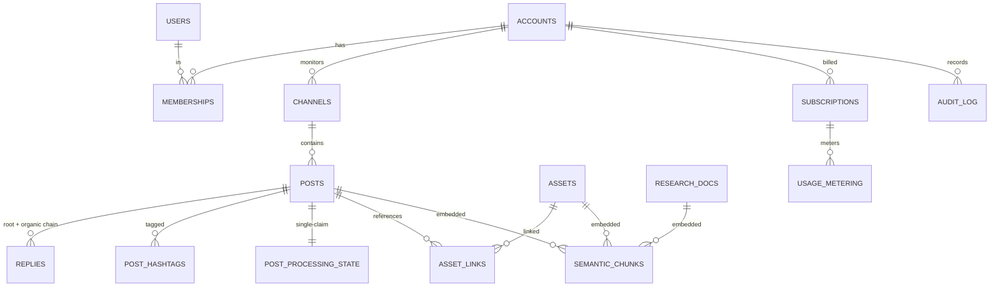

<!--
  Title           : Helix Thready — Data Flow & Data Model (architecture level)
  Classification  : PUBLIC
  Location        : docs/public/research/mvp/architecture/data-flow.md
  Status          : Draft — v0.1
  Revision        : 1 (2026-07-21)
  Author          : Helix Thready documentation swarm (System Architecture)
  Related         : ./system-overview.md, ./messenger-ingestion.md, ./processing-pipeline.md,
                    ./asset-and-download.md, ./semantic-search.md, ./event-model.md,
                    ./concurrency-and-idempotency.md, ./security-model.md
-->

# Helix Thready — Data Flow & Data Model

| Rev | Date | Author | Change |
|-----|------|--------|--------|
| 1 | 2026-07-21 | swarm (System Architecture) | Initial draft — end-to-end flow, data model, partitioning, sensitive flow |
| 2 | 2026-07-22 | swarm (Pass 3 depth) | Split both diagram explanations (end-to-end flow §2, ERD §3) into true multi-paragraph form per CONVENTIONS §4 — three-ordering-invariant + persist-before-publish + three read paths for the flow; tenancy-tree + post-composite + M2M assets/chunks for the ERD. Also fix §7 reprocess step to not set a `reprocessing` task *status* (nine-value enum — concurrency §2) |

## Table of Contents

1. [Scope](#1-scope)
2. [End-to-end data flow](#2-end-to-end-data-flow)
3. [Architecture-level data model (ERD)](#3-architecture-level-data-model-erd)
4. [System of record vs derived stores](#4-system-of-record-vs-derived-stores)
5. [Partitioning & scale (GAP 3.2)](#5-partitioning--scale-gap-32)
6. [Sensitive-content data flow](#6-sensitive-content-data-flow)
7. [Reprocessing / refresh flow](#7-reprocessing--refresh-flow)
8. [Gap-register coverage](#8-gap-register-coverage)
9. [TDD reproduce-first skeletons](#9-tdd-reproduce-first-skeletons)
10. [Open items](#10-open-items)

---

## 1. Scope

This document traces how data moves and where it lives — from a message arriving in a channel to
a client searching it — and gives the architecture-level data model. Full DDL for every entity
lives in the **database** area; this file establishes the flow, the system-of-record boundary,
and the partitioning strategy that the aggressive scale (10k+ posts/day, 50 TB+) demands.

## 2. End-to-end data flow



> Rendered PNG/SVG exported via Docs Chain (§11.4.65). Source: `diagrams/data-flow-e2e.mmd`.

**Explanation (for readers/models that cannot see the diagram).** This sequence is the data-plane
view of the same lifecycle the [post-lifecycle.md](./post-lifecycle.md) capstone walks at finer
grain; here the emphasis is deliberately on *where the authoritative bytes live at each step* and
*what ordering the arrows guarantee*. The single most important property to read out of it is that
three orderings are never violated: persistence precedes the event, the claim precedes any work,
and indexing happens for both the original post and every generated artifact.

The flow begins when Herald
(via the ThreadReader) polls a Telegram/Max channel and/or receives a push trigger, assembles the
complete post (root + organic reply chain), and persists it to PostgreSQL — the **system of
record**. Herald then emits `post.received` onto the JetStream EventBus keyed by `post_id` —
persisting *before* publishing is the load-bearing choice, because the event is a lightweight
pointer and any consumer can always re-read authoritative state from the SoR rather than trust a
payload the transport cannot type-preserve ([event-model.md](./event-model.md) §2).

A durable consumer in BackgroundTasks receives it (at-least-once, so possibly duplicated),
performs the single-claim row lock that deduplicates, and hands the claimed post to the Skill
Dispatch engine. Dispatch runs the download stage by delegating to the Download Manager / Boba /
MeTube, which report completion through the standardized callback to the Asset Service; the Asset
Service stores the raw plus the `…-web` rendition and writes the post↔asset links and checksum
back to PostgreSQL. Dispatch then embeds the post and its generated artifacts into the semantic
store (pgvector), which — being co-located in the same Postgres instance — hydrates references
with a local join. Dispatch posts a status reply to the source thread and emits `post.processed`.

On the read side, the REST `/v1` API reads authoritative data from PostgreSQL, serves semantic
queries from pgvector, and streams real-time events to clients over WebSocket/SSE. The three read
arrows are drawn separately on purpose: browse/state reads hit the relational SoR, meaning-based
reads hit the vector store, and live updates come off the bus — three physically different paths
for three different latency profiles, which is exactly how the aggressive read SLOs and the
30-minute processing budget coexist without ever contending for one another.

## 3. Architecture-level data model (ERD)



> Rendered PNG/SVG exported via Docs Chain (§11.4.65). Source: `diagrams/data-model.mmd`.

**Explanation (for readers/models that cannot see the diagram).** The model is anchored on
**ACCOUNTS** — the tenant — and the whole shape is best read as a tree hanging off that anchor,
because tenant isolation is a *physical property of the schema*, not a runtime check bolted on
afterwards. Every entity below ACCOUNTS carries `account_id`, and that column is the physical basis
of the row-level isolation the security model enforces ([security-model.md](./security-model.md));
reading the ERD is in large part reading where that one column propagates.

Users relate to accounts many-to-many through MEMBERSHIPS (a user can belong to several accounts,
and be an admin of one while a plain user of another) — which is the structural reason the RBAC
decision in [security-model.md](./security-model.md) must always be made against a *specific* target
account rather than a global role bit: the join row, not the user row, carries the tier. Each
account monitors CHANNELS, which contain POSTS.

A POST is the composite the whole system is organized around, and the ERD makes its dependents
explicit. It owns its REPLIES (the organic chain that, together
with the root, forms the complete post), its POST_HASHTAGS (the union of tags across the chain),
and exactly **one** POST_PROCESSING_STATE row. That one-to-one processing-state relationship is the
schema-level expression of the exactly-once invariant: because a post has a single processing-state
row protected by a UNIQUE constraint, a duplicate `post.received` cannot create a second unit of
work ([concurrency-and-idempotency.md](./concurrency-and-idempotency.md)).

POSTS reference ASSETS through ASSET_LINKS (a post can link many assets and an
asset can be referenced by many posts — content-hash dedup makes the many-to-many real).

The SEMANTIC_CHUNKS entity is the vector index, and the crucial detail the ERD encodes is that it is
embedded from POSTS, ASSETS **and** RESEARCH_DOCS: three source kinds feeding one index is exactly
what lets "search by meaning" span originals and generated materials uniformly
([semantic-search.md](./semantic-search.md)). Finally ACCOUNTS carry SUBSCRIPTIONS +
USAGE_METERING (subscription + metered billing from day one) and an append-only AUDIT_LOG, so
subscription state, metering and audit history are all tenant-scoped by the same `account_id` that
isolates the operational rows. Full per-column DDL,
indexes and migrations are delivered in the database area; the architecture-level entities listed
in `§19.12` of the final request are all represented here.

## 4. System of record vs derived stores

| Store | Role | Authority |
|-------|------|-----------|
| PostgreSQL (`database`) | posts, threads, replies, hashtags, accounts, users, assets metadata, processing state, billing, audit | **System of record** |
| pgvector (`vectordb`) | embeddings + `{source_id, kind, span}` | **Derived** — references SoR, rebuildable |
| MinIO/S3 (`storage`) | asset bytes (raw + `…-web`) | Authoritative for bytes; metadata in SoR |
| cache (`cache`) | hot reads, query-embeddings, sticky last-values | **Derived** — evictable |
| JetStream | event log / durable replay window | **Derived** — SoR reconciles via REST snapshots |

The rule (resolving inconsistency #1): the **relational store is authoritative**; every derived
store references it and can be rebuilt from it (re-embed from posts; re-download broken assets;
replay events). This is what makes the RPO ≈ 1 h / RTO ≈ 4 h target achievable — only the SoR and
the object tier need point-in-time recovery; pgvector and cache are reconstructable
`[research_request_final Q45]`.

## 5. Partitioning & scale (GAP 3.2)

> **`[GAP: 3.2]` No first-class partitioning/sharding helpers.** `digital.vasic.database` has no
> partition/shard helpers for the Large-scale post volume (10k+/day). **Plan:** add
> time-partitioning + retention/archive helpers to `database`; validate `storage` against a
> self-hosted MinIO (Hetzner) with signed URLs; document connection-pool + pgvector co-location
> tuning `[research_request_final §19.8]`.

`posts`, `replies`, `post_processing_state`, and `semantic_chunks` are **range-partitioned by
month** so the hot working set stays small and retention/archive is a partition drop:

```sql
-- Monthly range partitioning for the high-volume post stream (PostgreSQL 15+).
CREATE TABLE posts (
    id          UUID NOT NULL,
    account_id  UUID NOT NULL,
    channel_id  UUID NOT NULL,
    messenger   TEXT NOT NULL,
    root_msg_id BIGINT NOT NULL,
    created_at  TIMESTAMPTZ NOT NULL DEFAULT now(),
    -- …thread/attachment columns
    PRIMARY KEY (id, created_at)
) PARTITION BY RANGE (created_at);

CREATE TABLE posts_2026_07 PARTITION OF posts
    FOR VALUES FROM ('2026-07-01') TO ('2026-08-01');
CREATE INDEX ON posts_2026_07 (account_id, channel_id, created_at DESC);

-- Retention (per-account override; indefinite default) = detach + archive the old partition:
--   ALTER TABLE posts DETACH PARTITION posts_2025_01;   -- then archive to cold storage
```

Read replicas serve API/search reads; the primary takes ingestion writes. JetStream clusters
horizontally; the MinIO/S3 tier scales independently of Postgres `[research_request_final §19.8]`.
Connection-pool sizing and pgvector co-location tuning are documented in the deployment/database
packs.

## 6. Sensitive-content data flow

Sensitive content follows a distinct path so raw values never reach the vector store or logs (the
full design is in [security-model.md](./security-model.md) §7): detect (`security/pkg/pii`) →
seal raw (AES-256-GCM `securestorage` / encrypted asset dir) → embed a **redacted surrogate** →
serve reveal only through an RBAC-gated Asset/secret endpoint. In data-flow terms, the branch is:
the `content` column of `semantic_chunks` holds the **surrogate**, the sealed store holds the
**raw**, and `asset_links` for sensitive scans point at the specially encrypted directory that
only the Asset Service decrypts.

## 7. Reprocessing / refresh flow

Reprocessing is an explicit trigger `client → REST /v1/posts/{id}/reprocess → System`
`[research_request_final §21.4]`:

1. API triggers reprocess (RBAC-gated): the task row re-enters a fresh `pending → running` cycle —
   there is **no** `reprocessing` task *status* (the nine-value enum in
   [concurrency-and-idempotency.md](./concurrency-and-idempotency.md) §2); the sticky `post.state`
   *display* value becomes `reprocessing`.
2. Dispatch publishes `post.state.invalidate` (clears the sticky value —
   [event-model.md](./event-model.md)).
3. A new claim runs the pipeline; idempotent Skill steps re-run safely (dedup on `post_id`).
4. New artifacts re-embed (old chunks for the source are replaced, not duplicated).
5. A fresh status reply is posted; `post.processed` re-emits.

## 8. Gap-register coverage

- `[GAP: 3.2]` database partitioning + MinIO signed-URL parity → monthly range partitioning +
  retention-by-partition-drop + read replicas (§5); MinIO validation tracked with deployment.
- `[GAP: 2.1]` HashEmbedder → the embed step in the flow enforces the real llama provider
  (owned by [semantic-search.md](./semantic-search.md)).
- Sensitive flow ties to `[GAP: 7.1]` (searchable-but-sealed) — owned by
  [security-model.md](./security-model.md).

## 9. TDD reproduce-first skeletons

```sql
-- RED: retention must drop a whole partition, not row-by-row delete.
-- (verified by asserting the archive job detaches, not DELETEs, the old partition)
```

```go
// RED: derived stores must be rebuildable from the SoR.
func TestRebuild_VectorsFromSoR(t *testing.T) {
    seedPosts(t, 100); truncate(t, "semantic_chunks")
    rebuildIndexFromSoR(t)
    require.Equal(t, expectedChunkCount(t), countChunks(t)) // pgvector rebuilt from posts
}

// RED: reprocess must replace, not duplicate, semantic chunks for a source.
func TestReprocess_ReplacesChunks(t *testing.T) {
    p := ingest(t); before := chunkCount(t, p.ID)
    reprocess(t, p.ID)
    require.Equal(t, before, chunkCount(t, p.ID)) // replaced, not doubled
}

// RED: every domain row must carry account_id (tenant isolation invariant).
func TestSchema_AccountIDPresent(t *testing.T) {
    for _, tbl := range tenantTables { require.True(t, hasColumn(t, tbl, "account_id")) }
}
```

## 10. Open items

- `[OPEN: DF-1]` The full ERD column set, indexes, and forward/rollback migrations are owned by
  the **database** area; this file provides only the architecture-level entity map. Cross-linked,
  not duplicated.
- `[OPEN: DF-2]` Partition granularity (monthly vs weekly) and the read-replica count for the
  10k+/day volume need load-test validation; `[DEFAULT — adjustable]` monthly. Tracked with the
  database/deployment packs `[GAP: 3.2]`.
- `[OPEN: DF-3]` Whether `semantic_chunks` is partitioned in lockstep with `posts` or indexed
  globally (pgvector HNSW builds are per-table) affects rebuild cost; decision deferred to the
  semantic/database benchmark.

---

*Made with love ♥ by Helix Development.*
