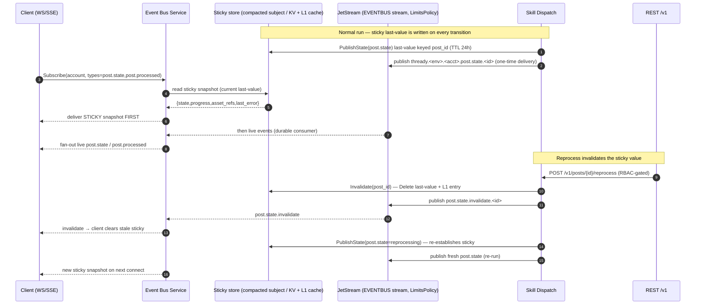
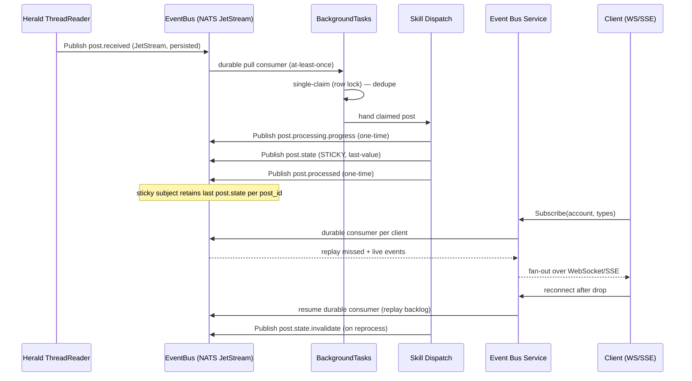

<!--
  Title           : Helix Thready — Event Model (EventBus / NATS JetStream)
  Classification  : PUBLIC
  Location        : docs/public/research/mvp/architecture/event-model.md
  Status          : Draft — v0.1
  Revision        : 1 (2026-07-21)
  Author          : Helix Thready documentation swarm (System Architecture)
  Related         : ./system-overview.md, ./concurrency-and-idempotency.md,
                    ./data-flow.md, ./messenger-ingestion.md, ./processing-pipeline.md
-->

# Helix Thready — Event Model

| Rev | Date | Author | Change |
|-----|------|--------|--------|
| 1 | 2026-07-21 | swarm (System Architecture) | Initial draft — transport, event catalog, sticky/one-time, replay |
| 2 | 2026-07-21 | swarm (review pass) | Add OpenAPI 3.1 SSE subscription contract (§8) per CONVENTIONS §6 |
| 3 | 2026-07-22 | swarm (Pass 3 depth) | Fold verified `pkg/nats` mechanics (ephemeral `DeliverNew`+`AckExplicit`, `LimitsPolicy` `EVENTBUS` stream, `SubjectPrefix`+`sanitizeType`, payload re-marshal); anti-bluff on durable replay; add sticky-invalidation sequence (§4.1) |
| 4 | 2026-07-22 | swarm (Pass 3 depth, cont.) | Split the §5 event-lifecycle-diagram explanation into true multi-paragraph form (produce+claim linchpin → emitted event stream → client durable-replay + reprocess) per CONVENTIONS §4 |

## Table of Contents

1. [Transport & guarantees](#1-transport--guarantees)
2. [The `event.Event` envelope (verified interface)](#2-the-eventevent-envelope-verified-interface)
3. [Subject naming & namespacing](#3-subject-naming--namespacing)
4. [One-time vs sticky events + invalidation](#4-one-time-vs-sticky-events--invalidation)
4.1. [Sticky-event invalidation flow](#41-sticky-event-invalidation-flow)
5. [Event lifecycle diagram](#5-event-lifecycle-diagram)
6. [Durable replay for disconnected clients](#6-durable-replay-for-disconnected-clients)
7. [Event catalog (MVP)](#7-event-catalog-mvp)
8. [Client subscription contract](#8-client-subscription-contract)
9. [Gap-register coverage](#9-gap-register-coverage)
10. [TDD reproduce-first skeletons](#10-tdd-reproduce-first-skeletons)
11. [Open items](#11-open-items)

---

## 1. Transport & guarantees

The event bus is `digital.vasic.eventbus` `[IN-HOUSE: eventbus]`. It ships **two mirrored
transports** behind one event model:

- `pkg/bus` — an in-process channel bus for intra-process fan-out (buffered subscriber
  channels, publish timeout, dead-subscriber cleanup). **VERIFIED** at source: `bus.New(config)`,
  `Config{BufferSize, PublishTimeout, CleanupInterval, MaxSubscribers}`.
- `pkg/nats` — a **NATS JetStream** adapter that mirrors the same pub/sub surface but persists
  every published event in a JetStream stream. **Re-read at source this pass** (`pkg/nats/nats.go`):
  `nats.New(ctx, Config{URL, StreamName, SubjectPrefix, ConnectTimeout})` calls `ensureStream()`
  and exposes `Publish(e *event.Event) error`, `Subscribe(ctx, t event.Type) (<-chan *event.Event,
  func(), error)`, and `Close()`. `ensureStream()` creates one stream (default name `EVENTBUS`)
  with `Storage: FileStorage` and **`Retention: LimitsPolicy`**, capturing the wildcard
  `"<SubjectPrefix>.>"` (default prefix `eventbus`). `Publish` JSON-marshals the event and calls
  `js.Publish(subject, data)` synchronously.

> **Anti-bluff note on durability (important).** The verified `pkg/nats.Subscribe` opens an
> **ephemeral push subscription** with **`DeliverNew()` + `AckExplicit()`** — meaning a
> subscriber sees only events published *after* it subscribes and its cursor does **not** survive
> a disconnect. So the base adapter does **not**, by itself, provide the durable replay this
> document relies on: durable per-client replay (§6) is a capability the thin **Event Bus
> Service** `[BUILD-NEW]` must add by driving the JetStream `JetStreamContext` directly with a
> **named durable consumer** (`Durable`/`DeliverAll` + explicit ack floor), not by calling
> `pkg/nats.Subscribe`. The `EVENTBUS` stream being `LimitsPolicy` + `FileStorage` is what makes
> that durable replay *possible* (events are retained on disk within the limits window); the base
> `Subscribe` simply does not expose it. This is the honest boundary between the VERIFIED engine
> and the `[BUILD-NEW]` service.

At Thready's **Large scale** `[OPERATOR]`, **JetStream is the primary transport**; the
in-process bus is used only for tight intra-service fan-out. Delivery guarantee is
**at-least-once** with idempotent consumers `[research_request_final §3.4]`. Kafka/RabbitMQ
(`digital.vasic.messaging`) remain available for firehose-scale inter-service streams but are
**not** the Thready event bus (that decision is explicit: "Not Redis, not Kafka" in §2.1.3).

> **Anti-bluff note.** At-least-once means duplicate deliveries *will* happen (redeliver on
> consumer restart, network partition). Correctness therefore depends on the idempotent
> single-claim in [concurrency-and-idempotency.md](./concurrency-and-idempotency.md), not on
> the bus. The event model is only safe *because* consumers dedupe.

## 2. The `event.Event` envelope (verified interface)

The envelope is fixed by `eventbus/pkg/event` — **read at source**, reproduced verbatim:

```go
// digital.vasic.eventbus/pkg/event
package event

type Type string // dot-notation topic, e.g. "post.received"

type Event struct {
    ID        string
    Type      Type
    Source    string
    Payload   interface{}
    Timestamp time.Time
    TraceID   string
    Metadata  map[string]string
}

func New(eventType Type, source string, payload interface{}) *Event // sets ID, TraceID, ts
func (e *Event) WithTraceID(traceID string) *Event
func (e *Event) WithMetadata(key, value string) *Event

type Handler func(*Event)
type Subscription struct { ID string; Types []Type; Channel <-chan *Event; /*…*/ }
```

Thready adds **no new envelope fields**; it uses `Metadata` for `account_id`, `messenger`,
`post_id`, and `idempotency_key`, and reuses `TraceID` to stitch a post's whole processing
story across services (the same `TraceID` flows from `post.received` through every
`post.processing.*` to `post.processed`). Payloads are typed Go structs serialized to JSON by
the JetStream adapter (`Publish` marshals to JSON — VERIFIED).

> **Verified payload caveat.** `Event.Payload` is `interface{}`, and the `pkg/nats` package doc
> spells out the consequence at source: JSON cannot preserve the concrete Go type, so on the
> **receiving** side a payload published as a struct arrives as a generic
> `map[string]interface{}` (numbers as `float64`, etc.). Consumers therefore **re-marshal** the
> received `Payload` into their concrete type, or carry a discriminator in `Type`/`Metadata`.
> Thready already carries that discriminator in `Type` (e.g. `post.received`) and in `Metadata`,
> so every consumer does `json.Unmarshal(reencode(evt.Payload), &typed)` on receipt — never a
> naked type assertion on `evt.Payload`.

```go
// Thready publishes a post.received event on ingestion (illustrative composition
// over the verified event.New signature).
evt := event.New("post.received", "ingestion", PostReceivedPayload{
    PostID:    p.ID,
    Account:   p.AccountID,
    Messenger: "telegram",
    RootMsgID: p.RootMessageID,
    Hashtags:  p.Hashtags,
}).WithMetadata("account_id", p.AccountID).
   WithMetadata("idempotency_key", p.ID)
if err := jetstreamBus.Publish(evt); err != nil { /* retry with backoff */ }
```

## 3. Subject naming & namespacing

The JetStream adapter derives the wire subject as `"<SubjectPrefix>.<sanitizeType(event.Type)>"`
(VERIFIED: `subjectFor(t)` = `b.subjectPrefix + "." + sanitizeType(t)`). `sanitizeType` splits the
dot-notation type into tokens and replaces any NATS-illegal character *inside a token* (`*`, `>`,
whitespace) with `_`, preserving the **dot separators between tokens** and the token count so
routing is stable; an empty type maps to `_`. The default `SubjectPrefix` is `eventbus` and the
default stream `EVENTBUS` captures `"<prefix>.>"`.

Thready layers three namespaces onto that primitive **by composing them into the two knobs the
adapter actually exposes** — `SubjectPrefix` and `event.Type`:

```
thready.<env> . <account_id>.<event.type>
└── SubjectPrefix ┘  └────── event.Type (dot-notation) ──────┘
   e.g. thready.prod      e.g. 9c1e….post.received  → wire: thready.prod.9c1e_….post.received
```

Concretely: the environment lives in the **`SubjectPrefix`** (`thready.dev` / `thready.sta` /
`thready.prod`), and the account id + event type are composed into the **`event.Type`** the
publisher passes (e.g. `event.New("9c1e….post.received", …)` or, for global events,
`"system.channel.health"`). Because a UUID contains `-` (legal in a NATS token) but the sanitizer
would rewrite any stray `*`/`>`, account ids are lower-cased UUIDs and safe. Consumers then filter
by subject wildcards: a per-account client subscribes to `thready.prod.9c1e_….>` (all events for
its account) while the Processing service consumes `thready.prod.*.post.received` across accounts.
This directly resolves `[OPEN: OVERVIEW-2]` — env isolation is achievable with the `SubjectPrefix`
knob on a shared cluster, with no change to the verified adapter. (Because the base adapter derives
one subject per `Type`, the account-in-`Type` composition is the mechanism that makes per-tenant
wildcards work; the thin Event Bus Service owns building these composite `Type` strings so callers
never hand-format subjects.)

## 4. One-time vs sticky events + invalidation

The original request mandates **both** one-time events and **sticky** events with explicit
invalidation `[research_request_final §2.1.3, §3.4]`.

- **One-time events** — fire, are delivered, and are done (`post.received`,
  `post.processing.progress`, `post.processed`, `asset.stored`). A late subscriber does **not**
  see a past one-time event except via JetStream durable replay of the retained window.
- **Sticky events** — retain a **last value per entity** so a newly connected client can read
  current state without a REST round-trip. Implemented as a **compacted JetStream subject** (a
  `WorkQueue`/`Limits` stream with per-subject last-value retention keyed by entity id) plus an
  L1 last-value cache (`digital.vasic.cache`). The canonical sticky event is `post.state`
  (keyed `…post.state.<post_id>`) carrying the current `{state, progress, last_error,
  asset_refs}`.
- **Invalidation** — a sticky value is invalidated on state change or TTL. On an explicit
  reprocess (`client → REST /v1/posts/{id}/reprocess → System`), the Processing service
  publishes `post.state.invalidate` for that `post_id`, clears the last-value cache entry, and
  the next `post.state` re-establishes the sticky value. TTL is a defensive backstop
  (`[DEFAULT — adjustable]` 24 h) so a crashed producer cannot pin a stale sticky value forever.

```go
// Sticky publish: last-value semantics keyed by entity id.
func (p *Publisher) PublishState(ctx context.Context, s PostState) error {
    subj := fmt.Sprintf("thready.%s.%s.post.state.%s", p.env, s.AccountID, s.PostID)
    p.lastValue.Set(subj, s, 24*time.Hour)      // L1 sticky cache
    return p.js.PublishMsg(ctx, subj, mustJSON(s)) // compacted subject retains last
}

func (p *Publisher) Invalidate(ctx context.Context, accountID, postID string) error {
    subj := fmt.Sprintf("thready.%s.%s.post.state.%s", p.env, accountID, postID)
    p.lastValue.Delete(subj)
    return p.js.PublishMsg(ctx, subj+".invalidate", nil)
}
```

Note the code uses `p.js.PublishMsg`/`Delete` **directly on the JetStream context and the sticky
store** — not `pkg/nats.Publish`/`Subscribe` — because (per the anti-bluff note in §1) sticky
last-value + invalidate + durable replay are precisely the capabilities the base adapter does not
expose. The sticky store is either a **compacted subject** on a dedicated stream (`MaxMsgsPerSubject
= 1`) or a `nats.KeyValue` bucket; both are separate from the `LimitsPolicy` `EVENTBUS` stream that
carries one-time events (see `[OPEN: EVT-2]`).

### 4.1 Sticky-event invalidation flow



> Rendered PNG/SVG exported via Docs Chain (§11.4.65). Source: `diagrams/sticky-invalidation.mmd`.

**Explanation (for readers/models that cannot see the diagram).** The diagram separates the two
regimes a sticky value passes through: steady-state delivery and invalidation-on-reprocess. In the
top half, every state transition the Skill Dispatch engine makes does two things — it writes the
current `{state, progress, asset_refs, last_error}` as the **last value** into the sticky store
keyed by `post_id` (with the 24 h defensive TTL), and it publishes the same `post.state` as a
one-time event onto the `LimitsPolicy` `EVENTBUS` stream. The sticky write is what a *future*
subscriber will read; the one-time publish is what *current* subscribers see live. This dual write
is deliberate: it decouples "what is true now" (the sticky snapshot) from "what just changed" (the
live event), so neither a slow client nor a fast producer can desynchronize a UI.

The middle of the top half shows why sticky matters for connect latency. When a client subscribes
through the Event Bus Service, the service first reads the sticky snapshot from the store and
delivers it **before** any live event, then attaches the client's durable consumer to the live
stream. The payoff is that a freshly opened dashboard paints the current state of every post
immediately — no REST round-trip, no waiting for the next transition — and only then begins
receiving deltas. This ordering (snapshot-first, then live) is the contract §8 promises clients.

The bottom half is the invalidation flow, triggered by an explicit reprocess. The REST layer
calls into Skill Dispatch, which invalidates the sticky value in two coordinated steps: it
`Delete`s the last-value entry (and its L1 cache mirror) so no stale snapshot can be served, and
it publishes a `post.state.invalidate.<id>` event so any *connected* client can proactively clear
the value it is currently showing. Without the explicit invalidate, a client that connected during
the previous run could keep displaying a `done` snapshot while the post is actually re-running. The
engine then immediately re-establishes the sticky value by publishing `post.state=reprocessing`,
so the store is never left empty for long, and the next connect (or the next live event) reflects
the fresh run. The TTL is the backstop for the one failure this dance cannot cover — a producer
that crashes between `Invalidate` and the first re-established `PublishState` — after which the
stale key simply expires rather than pinning forever.

## 5. Event lifecycle diagram



> Rendered PNG/SVG exported via Docs Chain (§11.4.65). Source: `diagrams/event-flow.mmd`.

**Explanation (for readers/models that cannot see the diagram).** The sequence starts when the
Herald ThreadReader publishes `post.received` to JetStream, where it is persisted. A durable
pull consumer inside BackgroundTasks receives it (at-least-once, so possibly more than once).
Before doing any work, BackgroundTasks performs the **single-claim** (a Postgres row lock) that
deduplicates redeliveries — this is the linchpin that makes at-least-once safe.

Once claimed, the Skill Dispatch engine runs and emits a stream of events: repeated one-time
`post.processing.progress` events for live UI, a **sticky** `post.state` event that JetStream
retains as the last value for that `post_id`, and finally a one-time `post.processed`.

On the client side, a client subscribes through the thin Event Bus Service, which opens a **durable
consumer** per client; JetStream replays any events the client missed and then streams live
ones, fanned out over WebSocket or SSE. If the client drops and reconnects, the durable
consumer resumes and replays the backlog — no events are lost. Finally, when someone triggers a
reprocess, the dispatcher publishes `post.state.invalidate`, clearing the sticky value so the
next `post.state` reflects the fresh run.

## 6. Durable replay for disconnected clients

Each client subscription is backed by a **named durable JetStream consumer**
(`durable = "client-<client_id>"`) so its acknowledgement cursor survives disconnects. On
reconnect the Event Bus Service resumes the same durable consumer and JetStream redelivers
unacknowledged events from the retained window. For long outages beyond the retention window,
clients **reconcile via REST snapshots** (`GET /v1/posts?updated_since=…`) — the event stream
is the fast path, REST is the source-of-truth backstop. This dual path is mandated by
`§3.4` ("durable JetStream consumers replay missed events on reconnect; clients also reconcile
via REST snapshots").

## 7. Event catalog (MVP)

The original request mandates a dedicated document enumerating **every** system event, when it
fires, and how to subscribe. This is the architectural seed of that catalog (the exhaustive
per-field version lives in the API pack).

| Event `Type` | Kind | Producer | Fires when | Key payload |
|--------------|------|----------|-----------|-------------|
| `post.received` | one-time | Ingestion | Root+organic thread assembled & persisted | post_id, account, messenger, hashtags |
| `post.claimed` | one-time | BackgroundTasks | Post claimed for processing (dedupe won) | post_id, worker_id |
| `post.processing.progress` | one-time | Skill Dispatch | Each Skill step reports progress | post_id, step, percent, message |
| `post.state` | **sticky** | Skill Dispatch | State transition (queued→running→done) | post_id, state, progress, asset_refs, last_error |
| `post.state.invalidate` | one-time | Skill Dispatch | Reprocess/refresh requested | post_id |
| `post.processed` | one-time | Skill Dispatch | All Skills done, status reply posted | post_id, metrics, asset_refs |
| `post.failed` | one-time | Skill Dispatch | Whole-post processing failed after retries | post_id, error, retriable |
| `skill.step.retried` | one-time | Skill Dispatch | A step re-enqueued after backoff | post_id, step, attempt |
| `asset.download.progress` | one-time | Download Mgr/Boba/MeTube | Delegated download progress callback | job_id, percent |
| `asset.stored` | one-time | Asset Service | Asset (raw or `…-web`) committed to storage | asset_id, post_id, kind, checksum |
| `index.updated` | one-time | Semantic-search | Embeddings written for a post/artifact | source_id, kind, vector_count |
| `channel.health` | **sticky** | Ingestion | Channel reachability/lag changes | channel_id, reachable, lag_s |
| `account.updated` | **sticky** | User Service | Account/branding/policy change | account_id, version |

## 8. Client subscription contract

Clients never touch NATS directly. They subscribe through the **Event Bus Service** over
WebSocket (bidirectional) or SSE (one-way), authenticated by the same JWT/API-key as REST and
scoped by RBAC so a client only receives events for accounts it can see. The wire contract
(OpenAPI/AsyncAPI detail in the API pack):

```
WS  /v1/events?types=post.state,post.processed&account=<id>   (Authorization: Bearer …)
SSE GET /v1/events/stream?types=post.processing.progress&post_id=<id>
```

On connect, sticky events are delivered **first** (current last-value snapshot) then live
events follow — so a UI paints current state immediately without a separate REST fetch.

The architecture-level contract as **OpenAPI 3.1** `[CONVENTIONS §6]` (the full per-event
AsyncAPI channel doc — including the bidirectional WebSocket frames, which OpenAPI does not model
natively — lives in the [api/](../api/index.md) pack):

```yaml
openapi: 3.1.0
info: { title: Helix Thready — Event stream (architecture excerpt), version: "1.0.0" }
paths:
  /v1/events/stream:
    get:
      operationId: subscribeEventStream
      summary: Server-Sent Events stream of Thready events (one-way).
      security: [ { bearerAuth: [] } ]     # same JWT/API-key as REST; RBAC-scoped by account
      parameters:
        - { name: types, in: query, required: true,
            description: Comma-separated event.Type filter (e.g. post.state,post.processed),
            schema: { type: string } }
        - { name: account, in: query, required: false,
            schema: { type: string, format: uuid } }
        - { name: post_id, in: query, required: false,
            schema: { type: string, format: uuid } }
        - { name: Last-Event-ID, in: header, required: false,
            description: Resume cursor; maps to the durable JetStream consumer ack floor,
            schema: { type: string } }
      responses:
        "200":
          description: text/event-stream; sticky snapshot first, then live events.
          content:
            text/event-stream:
              schema: { $ref: "#/components/schemas/EventEnvelope" }
        "401": { description: Missing/invalid credentials }
        "403": { description: RBAC denies the requested account/types }
components:
  securitySchemes:
    bearerAuth: { type: http, scheme: bearer, bearerFormat: JWT }
  schemas:
    EventEnvelope:               # mirrors eventbus/pkg/event.Event (§2)
      type: object
      required: [id, type, source, timestamp]
      properties:
        id:        { type: string }
        type:      { type: string, examples: [post.state, post.processed] }
        source:    { type: string }
        payload:   {}            # typed per event.Type; see §7 catalog
        timestamp: { type: string, format: date-time }
        traceId:   { type: string }
        metadata:  { type: object, additionalProperties: { type: string } }
```

## 9. Gap-register coverage

- `[GAP: 2.9]` `session_orchestrator` (the atomic claim registry) is DESIGN-ONLY. Thready does
  **not** depend on it; the equivalent guarantee is provided by BackgroundTasks' Postgres claim
  (see [concurrency-and-idempotency.md](./concurrency-and-idempotency.md)). The event model is
  designed to be correct under at-least-once *without* a separate claim registry.
- `[GAP: 6.6]` The standardized callback/task module feeds `asset.download.progress` /
  `asset.stored`; its schema is defined in [asset-and-download.md](./asset-and-download.md).
- The Event Bus Service itself is `[BUILD-NEW]` (gap register §11) — a thin wrapper; the heavy
  lifting (JetStream, durability) is the VERIFIED `eventbus/pkg/nats`.

## 10. TDD reproduce-first skeletons

Per `[CONSTITUTION §11.4.27/43]`, every behavior starts RED. Representative skeletons:

```go
// RED: at-least-once must NOT cause double processing.
func TestPostReceived_DuplicateDelivery_ProcessesOnce(t *testing.T) {
    bus := newTestJetStream(t)
    evt := event.New("post.received", "test", PostReceivedPayload{PostID: "p1"})
    _ = bus.Publish(evt)
    _ = bus.Publish(evt) // simulate JetStream redelivery
    got := drainClaims(t, bus, 2*time.Second)
    require.Equal(t, 1, got.ProcessedCount("p1")) // FAILS until single-claim wired
}

// RED: sticky post.state must be delivered to a late subscriber before live events.
func TestStickyState_LateSubscriber_GetsSnapshotFirst(t *testing.T) {
    pub := newPublisher(t)
    _ = pub.PublishState(ctx, PostState{PostID: "p1", State: "running", Progress: 42})
    sub := subscribe(t, "thready.test.*.post.state.p1")
    first := <-sub.Channel
    require.Equal(t, "running", first.Payload.(PostState).State) // snapshot first
}

// RED: invalidate must clear the sticky value.
func TestInvalidate_ClearsStickyValue(t *testing.T) {
    pub := newPublisher(t)
    _ = pub.PublishState(ctx, PostState{PostID: "p1", State: "done"})
    _ = pub.Invalidate(ctx, "acct", "p1")
    require.False(t, pub.lastValue.Has("thready.test.acct.post.state.p1"))
}
```

The 15 mandated test types apply: unit (above), integration (real JetStream container), chaos
(kill the consumer mid-stream, assert replay), stress (10k `post.received`/min), security (a
client cannot subscribe to another account's subject).

## 11. Open items

- `[OPEN: EVT-1]` (narrowed). **Source-verified** that the default `EVENTBUS` stream is
  `Storage: FileStorage`, `Retention: LimitsPolicy` (`ensureStream`, `pkg/nats/nats.go`), i.e. the
  retention *policy* is already the right kind for a durable-replay backstop; only the **window
  sizing** remains a deployment decision — `[DEFAULT — adjustable]` 7 days / 50 GB per stream —
  set via the stream's `MaxAge`/`MaxBytes` at creation (the base `ensureStream` sets neither, so
  the Event Bus Service `[BUILD-NEW]` must create/configure the stream with explicit limits).
  Tracked against the deployment area.
- `[OPEN: EVT-2]` Whether `post.state` sticky uses a dedicated **compacted** subject
  (`MaxMsgsPerSubject = 1` on a `LimitsPolicy` stream) vs a KV bucket (`nats.KeyValue`) is an
  implementation choice; both satisfy last-value + invalidate, and both are **separate** from the
  verified `EVENTBUS` one-time stream (which is not compacted). Decision deferred to the Event Bus
  Service build (`[BUILD-NEW]`).
- `[NOTE: EVT-3]` `pkg/nats.Subscribe` is ephemeral (`DeliverNew`), so the durable per-client
  replay of §6 is an Event Bus Service responsibility over the raw `JetStreamContext`, not a base
  adapter feature (see the anti-bluff note in §1). Not an open verification — a build boundary.

---

*Made with love ♥ by Helix Development.*
