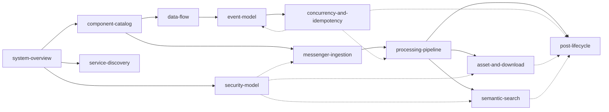

<!--
  Title           : Helix Thready — System Architecture (Area Index)
  Classification  : PUBLIC
  Location        : docs/public/research/mvp/architecture/index.md
  Status          : Draft — v0.1
  Revision        : 1 (2026-07-21)
  Author          : Helix Thready documentation swarm (System Architecture)
  Related         : ../index.md, ../CONVENTIONS.md, ../api/index.md, ../database/index.md,
                    ../deployment/index.md, ../testing/index.md
-->

# Helix Thready — System Architecture (Area Index)

| Rev | Date | Author | Change |
|-----|------|--------|--------|
| 1 | 2026-07-21 | swarm (System Architecture) | Initial area index — files, deps, gap coverage, open items |
| 2 | 2026-07-21 | swarm (review pass) | reading-order `.mmd` sibling + multi-para explanation; split GAP 2.9 rows; PROC-4 |
| 3 | 2026-07-22 | swarm (Pass 3 depth) | Register new `post-lifecycle.md` capstone (homes `post-lifecycle.mmd`); update reading order + diagram-sources; note consistency fixes (concurrency `retrying`-status, security sensitive-content multi-para) |
| 4 | 2026-07-22 | swarm (Pass 3 depth, cont.) | Close CAT-1/CAT-2 (source-verified `rag`/`cache`/`messaging` `pkg/` layouts; **corrected** `SkillRegistry`=`dev.helix.agent/skillregistry` & MCP=`digital.vasic.mcp` import paths); rewrite §7 register with accurate CLOSED/OPEN status; refresh §8 verified inventory; record the diagram-depth pass (system-overview C4 ×2, data-flow ×2, processing-pipeline, asset-download, component-deps, event-flow split to multi-paragraph) |
| 5 | 2026-07-22 | swarm (critic consistency) | Register `post-lifecycle.md` in §3 docs table + §4 reading-order (embedded diagram was out of sync with its `.mmd` sibling; prose said "eleven documents"); complete §5 diagram-sources table (add `sticky-invalidation`, `retry-state-machine`, `post-lifecycle` — three existing `.mmd` files were unlisted); cross-refs to the service-discovery diagram fix (registry→broadcast) and PROC-2 closure |

## Table of Contents

1. [Purpose](#1-purpose)
2. [Upstream / downstream dependencies](#2-upstream--downstream-dependencies)
3. [Documents in this area](#3-documents-in-this-area)
4. [Reading order](#4-reading-order)
5. [Diagram sources](#5-diagram-sources)
6. [Gap-register coverage summary](#6-gap-register-coverage-summary)
7. [Consolidated open-items register](#7-consolidated-open-items-register)
8. [Verified-at-source module inventory](#8-verified-at-source-module-inventory)
9. [Conventions & provenance](#9-conventions--provenance)

---

## 1. Purpose

This is the canonical entry point for the **System Architecture** area of Helix Thready. It
delivers the enterprise-grade, implementation-ready architecture: system overview (C4
context+container), the full component catalog with in-house submodule mapping, data-flow and
event model, concurrency/idempotency, service discovery, security, the four core subsystems
(messenger ingestion, processing pipeline, semantic search, assets & download), and the
[post-lifecycle.md](./post-lifecycle.md) capstone that walks one post end-to-end across every
plane. Every document follows [../CONVENTIONS.md](../CONVENTIONS.md) exactly and never contradicts
the authoritative sources (the final answered request, the gap register, the original request).

## 2. Upstream / downstream dependencies

**Upstream (this area consumes):**

- **Authoritative sources of truth** (read-only, private): the final answered request
  (`helix_thready_research_request_final.md` — decision matrix §0.2, architecture §2, workflow
  §3, Q1–Q45 §18), the subsystem gap register
  (`helix_thready_subsystem_gaps_and_improvements.md`), and the original request. These are never
  contradicted.
- **In-house engines** (`vasic-digital` / `HelixDevelopment` submodules) whose real interfaces
  anchor the code examples — see [§8](#8-verified-at-source-module-inventory).

**Downstream (these areas derive from this one):**

- **[api/](../api/index.md)** — the REST `/v1` OpenAPI 3.1, WebSocket/SSE event contract, and SDK
  strategy all realize the component boundaries, event catalog and endpoints defined here.
- **[database/](../database/index.md)** — the full ERD, PostgreSQL + pgvector DDL, indexes,
  partitioning and migrations expand the architecture-level data model in
  [data-flow.md](./data-flow.md) and the DDL fragments in
  [concurrency-and-idempotency.md](./concurrency-and-idempotency.md) and
  [semantic-search.md](./semantic-search.md).
- **[deployment/](../deployment/index.md)** — rootless Podman Compose, 3 envs, discovery/ports,
  Let's Encrypt, backup/DR consume [service-discovery.md](./service-discovery.md) and the scale
  drivers in [system-overview.md](./system-overview.md).
- **[testing/](../testing/index.md)** — the 15 mandated test types target the contracts, events
  and TDD skeletons seeded throughout this area.

## 3. Documents in this area

| Document | Scope |
|----------|-------|
| [system-overview.md](./system-overview.md) | C4 context + container; scale/SLO/tenancy drivers; cross-cutting concerns |
| [component-catalog.md](./component-catalog.md) | Every service & reused submodule; in-house mapping; maturity; dependency matrix |
| [data-flow.md](./data-flow.md) | End-to-end flow; architecture ERD; SoR vs derived; partitioning; sensitive flow |
| [event-model.md](./event-model.md) | EventBus/JetStream; one-time vs sticky + invalidation; at-least-once; durable replay; event catalog |
| [concurrency-and-idempotency.md](./concurrency-and-idempotency.md) | Single-claim per post; retry/back-off; circuit breaker; precedence |
| [service-discovery.md](./service-discovery.md) | discovery + mdns + port_prefix; dynamic ports; health; subdomain routing |
| [security-model.md](./security-model.md) | auth; three-tier RBAC; encryption at rest/in transit; sensitive-content handling |
| [messenger-ingestion.md](./messenger-ingestion.md) | Herald + gotd/td; Max adapter; ThreadReader root+organic-reply assembly |
| [processing-pipeline.md](./processing-pipeline.md) | Hashtag classification; Skill dispatch order; content-type recipe matrix; OCR |
| [semantic-search.md](./semantic-search.md) | Lumen-style: embeddings → pgvector → rag; HelixLLM /v1/embeddings; HashEmbedder guard |
| [asset-and-download.md](./asset-and-download.md) | Asset Service (Catalogizer); Download Manager; Boba/MeTube; standardized callback |
| [post-lifecycle.md](./post-lifecycle.md) | Capstone: end-to-end ingest→claim→process→finalize sequence; stage/event/failure reference; latency-SLO decomposition |

## 4. Reading order

> Rendered PNG/SVG exported via Docs Chain (§11.4.65). Source: `diagrams/reading-order.mmd`.

**Explanation (for readers/models that cannot see the diagram).** The diagram is a directed
reading graph over the twelve documents of this area. Start with the system overview for the C4
mental model, then the component catalog to learn which engines back which services. From the
catalog, follow the data plane along the solid spine: data-flow → event-model →
concurrency-and-idempotency — how a post moves, how events behave, and how exactly-once is
enforced. These three are ordered because each consumes the previous one's vocabulary (the event
model names the events the data-flow produced; the concurrency model dedupes the deliveries the
event model admits).

Two cross-cutting documents branch directly off the overview rather than off the data spine:
service-discovery (how services find each other and get deterministic ports) and security-model
(auth, three-tier RBAC, encryption, sensitive-content handling). They are drawn as separate
branches because they apply to every service uniformly, not to a single point in the flow. The
functional spine then runs messenger-ingestion → processing-pipeline, which fans out to
semantic-search and asset-and-download — the two subsystems the pipeline delegates to. The
pipeline also flows into the **post-lifecycle** capstone, which is the terminus of the graph: it
stitches ingestion, claim, processing, assets and search into one end-to-end sequence, so it is
drawn as a sink that the concurrency, asset and semantic docs also feed (the dashed edges into PL).

The dashed edges encode the cross-cutting dependencies that are not part of the linear reading
order: security underpins ingestion, assets and search (session secrets, sealed content, tenant
scoping), and the concurrency model underpins both the pipeline and the event model (single-claim
makes at-least-once safe). The post-lifecycle capstone is best read **last** — it assumes the
vocabulary every other document establishes and re-derives none of it. Any document can be read
standalone — each carries full context and its own gap/open-item registers — but following the
arrows minimizes forward references.

## 5. Diagram sources

All Mermaid diagrams are embedded in the docs **and** saved as sibling `.mmd` sources in
[`diagrams/`](./diagrams/) so Docs Chain can export PNG/SVG later `[CONSTITUTION §11.4.65]`:

| `.mmd` | Used in |
|--------|---------|
| `diagrams/reading-order.mmd` | index (this file) |
| `diagrams/c4-context.mmd` | system-overview |
| `diagrams/c4-container.mmd` | system-overview |
| `diagrams/component-deps.mmd` | component-catalog |
| `diagrams/data-flow-e2e.mmd` | data-flow |
| `diagrams/data-model.mmd` | data-flow |
| `diagrams/event-flow.mmd` | event-model |
| `diagrams/sticky-invalidation.mmd` | event-model (§4.1) |
| `diagrams/single-claim.mmd` | concurrency-and-idempotency |
| `diagrams/retry-state-machine.mmd` | concurrency-and-idempotency (§5.1) |
| `diagrams/discovery.mmd` | service-discovery |
| `diagrams/rbac.mmd` | security-model |
| `diagrams/sensitive-content.mmd` | security-model |
| `diagrams/thread-assembly.mmd` | messenger-ingestion |
| `diagrams/processing-pipeline.mmd` | processing-pipeline |
| `diagrams/semantic-search.mmd` | semantic-search |
| `diagrams/asset-download.mmd` | asset-and-download |
| `diagrams/post-lifecycle.mmd` | post-lifecycle |

## 6. Gap-register coverage summary

Every gap-register item relevant to System Architecture is addressed with a design plan or a
tracked `[BUILD-NEW]` item, tagged `[GAP: …]` in the owning document. None claims a stub "works".

| Gap | Priority | Headline | Addressed in |
|-----|----------|----------|--------------|
| 2.1 | P0 | HelixLLM default embedder is non-semantic HashEmbedder | [semantic-search.md](./semantic-search.md) |
| 2.5 | P2 | LLMsVerifier port `:7061` vs `:8080` | [semantic-search.md](./semantic-search.md), [component-catalog.md](./component-catalog.md) |
| 2.6 | P0 | VisionEngine has no OCR engine | [processing-pipeline.md](./processing-pipeline.md) |
| 2.7 | P1 | Embeddings has no native llama.cpp backend | [semantic-search.md](./semantic-search.md) |
| 2.8 | P2 | Memory search is word-overlap, not semantic | [semantic-search.md](./semantic-search.md) |
| 2.9 (claim) | P1 | session_orchestrator claim registry is design-only | [concurrency-and-idempotency.md](./concurrency-and-idempotency.md) |
| 2.9 (token-opt) | P1 | token_optimizer WIP / TOON scaffold — token-optimization mandate `[§11.4.198]` | [processing-pipeline.md](./processing-pipeline.md) §5.1 |
| 3.1 | P1 | VectorDB only pgvector wired; others unverified | [semantic-search.md](./semantic-search.md) |
| 3.2 | P1 | database has no partitioning/sharding helpers | [data-flow.md](./data-flow.md) |
| 4.1 | P0 | helix_skills has no processing/execution engine | [processing-pipeline.md](./processing-pipeline.md) |
| 5.1 | P0 | Herald MTProto in QA harness; Max empty stub | [messenger-ingestion.md](./messenger-ingestion.md) |
| 6.1 | P1 | Catalogizer not decoupled; Streaming = WS hub | [asset-and-download.md](./asset-and-download.md) |
| 6.2 | P0 | filesystem: no HTTP source, no download semantics | [asset-and-download.md](./asset-and-download.md) |
| 6.3 | P0 | Download Manager does not exist | [asset-and-download.md](./asset-and-download.md) |
| 6.4 | P1 | Boba callback contract bespoke | [asset-and-download.md](./asset-and-download.md) |
| 6.5 | P0 | MeTube poll-only, no outbound webhook | [asset-and-download.md](./asset-and-download.md) |
| 6.6 | P1 | No standardized callback/task module | [asset-and-download.md](./asset-and-download.md), [event-model.md](./event-model.md) |
| 7.1 | P2 | Searchable-but-sealed credentials | [security-model.md](./security-model.md) |
| 7.2 | P1 | auth JWT default HMAC-SHA256 (needs asymmetric) | [security-model.md](./security-model.md) |
| 7.3 | P0 (mobile) | Security-KMP mobile storage is in-memory stub | [security-model.md](./security-model.md) |
| 7.4 | P1 | Auth-KMP must consume fixed Security-KMP | [security-model.md](./security-model.md) |
| 11.* | P0–P1 | New subsystems (Asset/Download/User/Max/OCR/webhook/callback/EventBus svc/ThreadReader/Semantic) | [component-catalog.md](./component-catalog.md) §4 + owning docs |

## 7. Consolidated open-items register

Each `[OPEN: …]` is a tracked workable item, not a papered-over gap. Most were source-verification
of a FLAGGED interface (gap register §13 re-verification backlog) before implementation — and the
Pass-3 source reads have now **closed** the interface-verification items (their owning docs carry the
matching `[CLOSED: …]`). What remains open is genuinely *deferred decisions* (deployment topology,
tuning, a build-time schema), never an unverified "it works". The Status column is authoritative;
each item's full detail lives in its owning doc's Open-items section.

| ID | Item | Status | Owner doc |
|----|------|--------|-----------|
| OVERVIEW-1/2 | HTTP/3 gateway topology; JetStream env isolation | OVERVIEW-1 OPEN (deployment); OVERVIEW-2 resolved — env lives in `SubjectPrefix` (event-model §3) | system-overview / event-model |
| CAT-1/2 | rag/messaging/cache layouts; MCP/SkillRegistry import paths | **CLOSED** — layouts source-verified; paths corrected to `digital.vasic.mcp` / `dev.helix.agent/skillregistry` | component-catalog §8 |
| EVT-1/2 | JetStream retention window; sticky compacted-stream vs KV | EVT-1 narrowed — `LimitsPolicy`+`FileStorage` verified, only window sizing is a deployment knob; EVT-2 OPEN (impl choice) | event-model |
| CONC-1/2 | `models.BackgroundTask` dedup field; breaker package path | CONC-1 **CLOSED** — no `DedupeKey`/`ErrDuplicateTask`, dedup is Thready-side; CONC-2 narrowed — `resilience.Manager` verified, unify-vs-split is a design call | concurrency-and-idempotency |
| DISC-1/2 | `discovery.Registry` API; reverse-proxy choice | DISC-1 **CLOSED** — no `Registry`; real API is `pkg/broadcast` (`Announcer`/`Listener`/`Responder`); DISC-2 OPEN (proxy) | service-discovery |
| SEC-1/2/3 | `security/pkg/policy` API; redaction spec; internal mTLS vs tokens | SEC-1 **CLOSED** — `Enforcer`/`EvaluateAll` (most-restrictive); SEC-2/3 OPEN (spec/decision) | security-model |
| ING-1/2/3 | Max OneMe port; herald model mapping; forum-topic normalization | ING-2 **CLOSED** — `commons_messaging/channels` (`Channel`/`IsSelfEcho`); ING-1/3 OPEN (research/mapping) | messenger-ingestion |
| PROC-1/2/3/4 | Canonical `SKILL.md` schema; SkillRegistry/MCP paths; per-Skill caps; token_optimizer/TOON scope | PROC-2 resolved by CAT-2 (paths source-confirmed); PROC-1/3/4 OPEN (schema/tuning/scope) | processing-pipeline |
| SEM-1/2/3 | vectordb/embeddings interfaces; local code-embedding GGUF; HNSW tuning | SEM-1 **CLOSED** — `VectorStore`/`EmbeddingProvider` verified; SEM-2/3 OPEN (GGUF/tuning) | semantic-search |
| ASSET-1/2/3 | Asset Service extraction plan; transcoder choice; callback auth | OPEN (design/decision — owned by the BUILD-NEW submodules) | asset-and-download |
| DF-1/2/3 | ERD ownership (database area); partition granularity; chunk partitioning | OPEN (owned by database/testing packs) | data-flow |
| PL-1/2/3 | Per-stage soft-timeout budgets summing to 30 min; end-to-end integration harness; Max full-lifecycle | PL-1/2 OPEN (load-test/testing pack); PL-3 NOTE — Max lifecycle blocked on `[GAP: 5.1.2]` OneMe port | post-lifecycle |

## 8. Verified-at-source module inventory

To honor the "in-house first, do not invent APIs" rule, these interfaces were **read at source**
this pass (via `gh api`) and anchor the code examples:

- `vasic-digital/EventBus` — `pkg/event` (`Event`, `Handler`, `Subscription`), `pkg/bus`
  (`Config`, `New`), `pkg/nats` (JetStream `Bus` with `Publish`/`Subscribe`/`Close`,
  `ensureStream`, default stream `EVENTBUS`). **VERIFIED.**
- `vasic-digital/BackgroundTasks` — `interfaces.go` (`TaskQueue`, `TaskExecutor`,
  `ProgressReporter`, `TaskRepository` with `Dequeue(workerID, maxCPU, maxMem)`, `StuckDetector`),
  `models/task_status.go` (status enum). **VERIFIED.**
- `vasic-digital/herald` — `pkg/messenger/messenger.go` (`Messenger`, `Factory` interfaces);
  `pkg/messenger/max.go` (empty stub, `// TODO: MAX platform` — confirms `[GAP: 5.1.2]`).
  **VERIFIED.**
- `vasic-digital/discovery` — `pkg/report` (`Report`, `scanner.Service`). **VERIFIED.**
- `vasic-digital/port_prefix` — `portprefix.Exposed(prefix, internalPort, taken)`, band mapping.
  **VERIFIED.**
- `vasic-digital/security` — `pkg/securestorage/securestorage.go` (`Storage` interface,
  `FileStorage` AES-256-GCM, credential/token/key helpers); `pkg/policy.Enforcer`
  (`EvaluateAll` most-restrictive `Deny>Audit>Allow`, `Policy`/`Rule`/`Condition`). **VERIFIED**
  (`[CLOSED: SEC-1]`).
- `vasic-digital/RAG` / `cache` / `Messaging` — `pkg/` layouts read (`rag`:
  chunker/retriever/reranker/hybrid/pipeline; `cache`: memory/redis/postgres/distributed/policy/
  service; `messaging`: broker/producer/consumer/kafka/rabbitmq). **VERIFIED** (Pass 3 cont.,
  `[CLOSED: CAT-1]`).
- `vasic-digital/MCP_Module` = module **`digital.vasic.mcp`**,
  `pkg/{server,client,protocol,registry,adapter,config}`; `vasic-digital/SkillRegistry` = module
  **`dev.helix.agent/skillregistry`** (flat package: `executor.go`/`loader.go`/`manager.go`/
  `registry.go`/`storage.go`/`validator.go`/`types.go`). **VERIFIED** (`go.mod` read,
  `[CLOSED: CAT-2]`) — the previously-quoted `digital.vasic.mcp_module` /
  `digital.vasic.skill_registry` paths were **wrong** and are corrected.
- `vasic-digital/VectorDB` (`pkg/client.VectorStore` + `Vector`/`SearchQuery`/`SearchResult`/
  `DistanceMetric`; backends pgvector/qdrant/pinecone/milvus) and `vasic-digital/Embeddings`
  (`pkg/provider.EmbeddingProvider`; providers openai/voyage/jina/google/cohere/bedrock — no
  `llama`/`hash`, confirming `[GAP: 2.7]`). **VERIFIED** (`[CLOSED: SEM-1]`).
- `vasic-digital/herald` current `commons_messaging/channels.Channel`
  (`SendReplyGeneric`/`BotSelfIdentity`/`DownloadAttachment`) + self-filter
  `IsSelfEcho`/`StampSender` (`SelfIdentity`/`IdentityKind`). **VERIFIED** (`[CLOSED: ING-2]`).
- `vasic-digital/discovery` `pkg/broadcast` (`Announcer`/`Listener`/`Responder`/`ServiceInfo`) +
  `pkg/resilience.Manager` (`Connected/Disconnected/Reconnecting/Offline`). **VERIFIED**
  (`[CLOSED: DISC-1]`, `CONC-2` narrowed).

Every interface the Wave-1 pass had left unread — `vectordb` `VectorStore`, `embeddings`
provider, `security/pkg/policy`, herald's current channel model, discovery's real API, and the
`rag`/`cache`/`messaging`/MCP/SkillRegistry layouts — has since been **read at source** across the
Pass-3 depth passes (each has the matching `[CLOSED: …]` in its owning doc). What remains
representative rather than source-exact is confined to the `[BUILD-NEW]` composition code
(ThreadReader, Skill Dispatch Engine, Download Manager, standardized callback module, thin Event
Bus Service, Semantic-search service), which is Thready-new orchestration by definition and carries
its own `[GAP: …]`/`[OPEN: …]` tags — no reused engine's interface is now shown as a guess.

## 9. Conventions & provenance

Provenance tags used throughout `[CONVENTIONS §3]`: `[CONSTITUTION §x]` authoritative ·
`[IN-HOUSE: module]` reuse existing submodule · `[RESEARCH]` web/source research · `[OPERATOR]`
operator decision · `[DEFAULT — adjustable]` proposed default · `[BUILD-NEW]` confirmed
new-submodule gap · `[GAP: id]` addresses a gap-register item. Every diagram carries a
multi-paragraph prose explanation and a sibling `.mmd`; every file carries the metadata header,
revision table and ToC.

---

*Made with love ♥ by Helix Development.*
