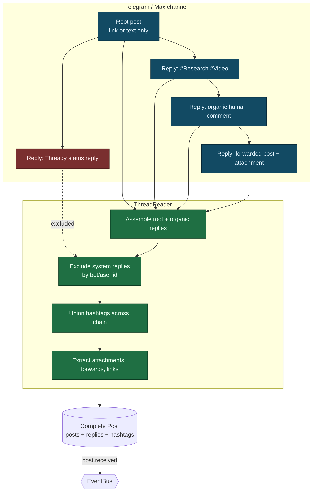

<!--
  Title           : Helix Thready — Messenger Ingestion (Herald, Telegram gotd/td, Max, ThreadReader)
  Classification  : PUBLIC
  Location        : docs/public/research/mvp/architecture/messenger-ingestion.md
  Status          : Draft — v0.1
  Revision        : 1 (2026-07-21)
  Author          : Helix Thready documentation swarm (System Architecture)
  Related         : ./system-overview.md, ./data-flow.md, ./event-model.md,
                    ./concurrency-and-idempotency.md, ./processing-pipeline.md, ./security-model.md
-->

# Helix Thready — Messenger Ingestion

| Rev | Date | Author | Change |
|-----|------|--------|--------|
| 1 | 2026-07-21 | swarm (System Architecture) | Initial draft — Herald, gotd/td, Max adapter, ThreadReader |

## Table of Contents

1. [Responsibility](#1-responsibility)
2. [Herald as the base (verified interface + gaps)](#2-herald-as-the-base-verified-interface--gaps)
3. [Telegram via gotd/td MTProto user client](#3-telegram-via-gotdtd-mtproto-user-client)
4. [Max adapter (BUILD-NEW)](#4-max-adapter-build-new)
5. [The ThreadReader abstraction](#5-the-threadreader-abstraction)
6. [Thread-assembly diagram](#6-thread-assembly-diagram)
7. [Accounts (sign-in) service](#7-accounts-sign-in-service)
8. [Ingestion → persistence → event](#8-ingestion--persistence--event)
9. [Gap-register coverage](#9-gap-register-coverage)
10. [TDD reproduce-first skeletons](#10-tdd-reproduce-first-skeletons)
11. [Open items](#11-open-items)

---

## 1. Responsibility

The Ingestion service connects to configured messengers with the operator's private accounts,
reads chosen channels/groups on a configurable schedule **and** on push triggers, assembles the
**complete post** (root + full organic reply chain, excluding Thready's own status replies),
persists raw data to the relational store, and emits `post.received`
`[research_request_final §3.1]`. It also posts the status reply back to the source thread at the
end of processing.

The **critical** requirement (called out in the original request in bold) is thread assembly:
hashtags are frequently added as a *reply* to a link-only or text-only root post, so a "post"
is the root plus its organic replies — never a single message
`[research_request_final §3.2.1, request "IMPORTANT: To form full post"]`.

## 2. Herald as the base (verified interface + gaps)

Ingestion extends `vasic-digital/herald` `[IN-HOUSE: herald]`. The `Messenger` seam is
**VERIFIED** at source (`herald/pkg/messenger/messenger.go`):

```go
// vasic-digital/herald/pkg/messenger — VERIFIED
type Messenger interface {
    Connect(ctx context.Context) error
    Disconnect(ctx context.Context) error
    SendMessage(ctx context.Context, message *Message) error
    ReceiveMessages(ctx context.Context) (<-chan *Message, error)
    GetChannels(ctx context.Context) ([]*Channel, error)
    HealthCheck(ctx context.Context) error
    Name() string
}
type Factory interface { CreateMessenger(config *Config) (Messenger, error) }
```

Existing adapters (VERIFIED files): `telegram.go`, `telegram_bot.go`, `mtproto.go`, `slack.go`,
`max.go`, `registry.go`, `factory.go`, `types.go`, `config.go`.

> **`[GAP: 5.1]` Herald gaps (all addressed below).**
> 1. **`[GAP: 5.1.1]` MTProto thread reader trapped in a QA harness** — the real `gotd/td` user
>    client (reads history via `messages.getHistory`/`getDialogs`) lives in
>    `qaherald/internal/mtproto` as a QA tool, not a first-class channel. The Bot-API adapter
>    (`telebot.v3`) **cannot backfill channel/group history**.
> 2. **`[GAP: 5.1.2]` Max is an empty stub** — VERIFIED at source: `herald/pkg/messenger/max.go`
>    is a placeholder (`// TODO: MAX platform - awaiting API specifications`, reference
>    `https://dev.max.ru/`, no client). Only reserved env vars exist.
> 3. **`[GAP: 5.1.3]` No generic thread-reader abstraction** for root + organic reply chain,
>    forum topics, and reply threads — Thready's core requirement.

The `Messenger` interface above is fine for *bot-style* send/receive but does **not** expose
history backfill or thread assembly. Thready therefore (a) promotes the MTProto client to a
first-class channel, (b) builds the Max adapter, and (c) introduces a **ThreadReader**
abstraction on top of `Messenger`.

## 3. Telegram via gotd/td MTProto user client

Telegram is read with the **`github.com/gotd/td` MTProto user client** (already vendored and
exercised in Herald's `qaherald`) `[IN-HOUSE: herald]` `[RESEARCH]`. A user client (not a bot)
is mandatory because bots cannot backfill arbitrary channel/group history. The promotion plan
`[GAP: 5.1.1]`:

- Promote `qaherald/internal/mtproto` into a first-class `TelegramThreadReader` behind the
  `Messenger`/ThreadReader seam.
- Forum topics via `channels.getForumTopics`; reply threads via `messages.getReplies`; history
  via `messages.getHistory` / `messages.getDialogs`.
- Full attachment / forwarded-message / link extraction; resolve `access_hash`.
- Auth: `api_id`/`api_hash` + phone + login code + optional 2FA, stored via
  `security/pkg/securestorage` ([security-model.md](./security-model.md)).

```go
// Illustrative: promoted MTProto reader implementing the ThreadReader seam.
type TelegramThreadReader struct { client *telegram.Client /* gotd/td */ }

func (r *TelegramThreadReader) ReadThread(ctx context.Context, ch ChannelRef, rootID int) (*Thread, error) {
    root, err := r.getMessage(ctx, ch, rootID)
    if err != nil { return nil, err }
    replies, err := r.getReplies(ctx, ch, rootID) // messages.getReplies
    if err != nil { return nil, err }
    return assemble(root, replies), nil           // → ThreadReader.Assemble
}
```

## 4. Max adapter (BUILD-NEW)

Max has **no Go client and no Herald code** `[GAP: 5.1.2]`. The adapter is `[BUILD-NEW]`
`[RESEARCH]`:

- **Bot API** (Go SDK, `dev.max.ru`) for bot-scoped access.
- **A Go port of the OneMe user-WebSocket protocol** for full channel/thread history (reference
  implementations `vkmax` / `max-mcp` / `MaxAPI` are Python; Thready ports the protocol to Go).

The adapter implements the same `Messenger` + ThreadReader seams so the rest of the pipeline is
messenger-agnostic. Until the OneMe port lands, Max ingestion is **explicitly incomplete** and
must not be claimed as working — the current `max.go` stub is the honest baseline.

## 5. The ThreadReader abstraction

`[BUILD-NEW]` (gap register §11, `[GAP: 5.1.3]`). A reusable, decoupled abstraction that
assembles the **root + organic replies**, excludes system replies, resolves access hashes, and
normalizes forum topics / reply threads across messengers. It is the seam that makes the
processing pipeline platform-independent.

```go
// ThreadReader — messenger-agnostic thread assembly (BUILD-NEW, own submodule).
type ThreadReader interface {
    // ListChannels returns configured channels for the account.
    ListChannels(ctx context.Context) ([]ChannelRef, error)
    // Poll returns new root posts since the last cursor (schedule path).
    Poll(ctx context.Context, ch ChannelRef, since Cursor) ([]RootRef, Cursor, error)
    // ReadThread assembles a complete post: root + full organic reply chain.
    ReadThread(ctx context.Context, ch ChannelRef, rootID MessageID) (*Thread, error)
    // Reply posts a status reply back to the source thread (Robot/User account).
    Reply(ctx context.Context, ch ChannelRef, rootID MessageID, body StatusReply) error
}

type Thread struct {
    Root      Message
    Replies   []Message      // organic only — system replies filtered out
    Hashtags  []string       // union across root + replies
    Attachments []Attachment // files, media, forwards, links
    Forwards  []Forward
    Links     []Link         // github, youtube, torrent/magnet, protocol URLs
}
```

**System-reply exclusion** is by author identity: Thready records the id of its Robot/User
account per channel; any reply authored by that id is skipped, so the system never processes its
own status replies `[research_request_final §3.2.3 "Processing skips the system's own replies"]`.

## 6. Thread-assembly diagram



> Rendered PNG/SVG exported via Docs Chain (§11.4.65). Source: `diagrams/thread-assembly.mmd`.

**Explanation (for readers/models that cannot see the diagram).** In the channel, a root post
(often just a link or a line of text) has a chain of replies: one reply carries the hashtags
(`#Research #Video`), another is an organic human comment, another is a forwarded post with an
attachment — and separately, Thready's own earlier status reply hangs off the root. The
ThreadReader assembles the root together with its organic replies, then filters out the system
reply by matching the author id against Thready's Robot/User account, so the system never
re-ingests its own output. It unions all hashtags found *anywhere* in the chain (which is why a
link-only root still gets classified — the tags came from a reply), then extracts every
attachment, forwarded message, and link. The result is one **Complete Post** row set (post +
replies + hashtags + attachments) persisted to the relational store, which emits `post.received`
onto the EventBus. The whole point of the diagram is that "a post" is a *composite* — collapsing
it to the single root message would drop the hashtags and the attachments that live in replies.

## 7. Accounts (sign-in) service

A decoupled Accounts-management sub-system handles **interactive and non-interactive** sign-in
to each messenger `[request "Note: System MUST PROVIDE Accounts management Service"]`:

- **Interactive** — operator enters phone + login code (+ 2FA) for Telegram; Max bot token /
  OneMe session.
- **Non-interactive** — credentials from env vars (`.env` / host `~/api_keys.sh`), runtime-load
  only, `chmod 600/700`, SKIP-if-missing, never logged `[CONSTITUTION §11.4.10]`.
- Sessions and tokens are stored via `security/pkg/securestorage` (AES-256-GCM), keyed per
  account+messenger. The service is reusable/decoupled so any project can adopt it.

## 8. Ingestion → persistence → event

1. Poll (configurable, reasonable frequency) **and** honor push triggers (new-post events).
2. For each new root, `ReadThread` assembles root + organic replies.
3. Extract all hashtags (union across chain); classify (indirect determination where tags are
   absent — see [processing-pipeline.md](./processing-pipeline.md)).
4. Persist the complete post (posts/replies/hashtags/attachments) to PostgreSQL — the system of
   record ([data-flow.md](./data-flow.md)).
5. Emit `post.received` (with `idempotency_key = post_id`) onto the EventBus; downstream claim
   is exactly-once ([concurrency-and-idempotency.md](./concurrency-and-idempotency.md)).

Health of each channel is a **sticky** `channel.health` event (reachability + lag), surfaced to
dashboards ([event-model.md](./event-model.md)); a channel that flaps is guarded by a circuit
breaker honoring Telegram `FLOOD_WAIT`.

## 9. Gap-register coverage

- `[GAP: 5.1.1]` MTProto in QA harness → promote to first-class `TelegramThreadReader` (§3).
- `[GAP: 5.1.2]` Max empty stub (VERIFIED `max.go` TODO) → build Max adapter, Bot API + OneMe
  WebSocket Go port (§4); ingestion marked incomplete until it lands (anti-bluff).
- `[GAP: 5.1.3]` No thread-reader abstraction → the ThreadReader submodule (§5).
- Sensitive session storage → `security/pkg/securestorage` (§7, [security-model.md](./security-model.md)).

## 10. TDD reproduce-first skeletons

```go
// RED: hashtags on a reply must classify a link-only root.
func TestThreadAssembly_HashtagsFromReply(t *testing.T) {
    thr := fixtureThread(root="https://youtu.be/x", replies=[]string{"#Video #ToDownload"})
    post := assemble(thr)
    require.ElementsMatch(t, []string{"Video", "ToDownload"}, post.Hashtags) // FAILS if only root parsed
}

// RED: system status replies must be excluded.
func TestThreadAssembly_ExcludesSystemReply(t *testing.T) {
    thr := fixtureThread(root="text", replies=withSystemReply(botID="thready-bot"))
    post := assemble(thr, systemAuthor="thready-bot")
    require.NotContains(t, authorIDs(post.Replies), "thready-bot")
}

// RED: Max adapter is not silently "working" — must report unimplemented until built.
func TestMax_NotBluffed(t *testing.T) {
    m := newMaxMessenger(cfg)
    _, err := m.ReceiveMessages(ctx)
    require.ErrorIs(t, err, ErrMaxAdapterNotImplemented) // honest until OneMe port lands
}
```

## 11. Open items

- `[OPEN: ING-1]` The Max OneMe WebSocket protocol must be reverse-engineered from the Python
  references (`vkmax`/`max-mcp`/`MaxAPI`) and ported to Go; frame formats and auth handshake are
  `[RESEARCH]` and not yet source-verified. Tracked as a P0 workable item.
- `[OPEN: ING-2]` Exact herald `Message`/`Channel` struct fields (`types.go`) were not read
  field-by-field this pass (fetch failed under rate limit); the `Thread`/`Message` shapes above
  are the ThreadReader's own model and must be mapped to herald's `types.go` at implementation.
- `[OPEN: ING-3]` Forum-topic vs linear-thread normalization across Telegram and Max needs a
  concrete mapping table (Telegram forum topics ↔ Max thread model); tracked with the
  ThreadReader build.

---

*Made with love ♥ by Helix Development.*
