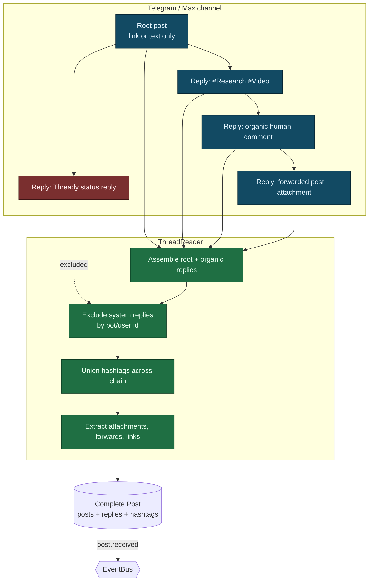

<!--
  Title           : Helix Thready — Messenger Ingestion (Herald, Telegram gotd/td, Max, ThreadReader)
  Classification  : PUBLIC
  Location        : docs/public/research/mvp/architecture/messenger-ingestion.md
  Status          : Draft — v0.1
  Revision        : 1 (2026-07-21)
  Author          : Helix Thready documentation swarm (System Architecture)
  Related         : ./system-overview.md, ./data-flow.md, ./event-model.md,
                    ./concurrency-and-idempotency.md, ./processing-pipeline.md, ./security-model.md
-->

# Helix Thready — Messenger Ingestion

| Rev | Date | Author | Change |
|-----|------|--------|--------|
| 1 | 2026-07-21 | swarm (System Architecture) | Initial draft — Herald, gotd/td, Max adapter, ThreadReader |
| 2 | 2026-07-22 | swarm (Pass 3 depth) | Close ING-2 — verified CURRENT herald `commons_messaging/channels.Channel` (Wave 7) + self-filter `IsSelfEcho`/`StampSender`/`BotSelfIdentity`/`SelfIdentity`/`IdentityKind` read at source; `SendReplyGeneric`/`DownloadAttachment` back Reply/attachment fetch; deepen thread-assembly explanation |

## Table of Contents

1. [Responsibility](#1-responsibility)
2. [Herald as the base (verified interface + gaps)](#2-herald-as-the-base-verified-interface--gaps)
3. [Telegram via gotd/td MTProto user client](#3-telegram-via-gotdtd-mtproto-user-client)
4. [Max adapter (BUILD-NEW)](#4-max-adapter-build-new)
5. [The ThreadReader abstraction](#5-the-threadreader-abstraction)
6. [Thread-assembly diagram](#6-thread-assembly-diagram)
7. [Accounts (sign-in) service](#7-accounts-sign-in-service)
8. [Ingestion → persistence → event](#8-ingestion--persistence--event)
9. [Gap-register coverage](#9-gap-register-coverage)
10. [TDD reproduce-first skeletons](#10-tdd-reproduce-first-skeletons)
11. [Open items](#11-open-items)

---

## 1. Responsibility

The Ingestion service connects to configured messengers with the operator's private accounts,
reads chosen channels/groups on a configurable schedule **and** on push triggers, assembles the
**complete post** (root + full organic reply chain, excluding Thready's own status replies),
persists raw data to the relational store, and emits `post.received`
`[research_request_final §3.1]`. It also posts the status reply back to the source thread at the
end of processing.

The **critical** requirement (called out in the original request in bold) is thread assembly:
hashtags are frequently added as a *reply* to a link-only or text-only root post, so a "post"
is the root plus its organic replies — never a single message
`[research_request_final §3.2.1, request "IMPORTANT: To form full post"]`.

## 2. Herald as the base (verified interface + gaps)

Ingestion extends `vasic-digital/herald` `[IN-HOUSE: herald]`. The `Messenger` seam is
**VERIFIED** at source (`herald/pkg/messenger/messenger.go`):

```go
// vasic-digital/herald/pkg/messenger — VERIFIED
type Messenger interface {
    Connect(ctx context.Context) error
    Disconnect(ctx context.Context) error
    SendMessage(ctx context.Context, message *Message) error
    ReceiveMessages(ctx context.Context) (<-chan *Message, error)
    GetChannels(ctx context.Context) ([]*Channel, error)
    HealthCheck(ctx context.Context) error
    Name() string
}
type Factory interface { CreateMessenger(config *Config) (Messenger, error) }
```

Existing adapters (VERIFIED files, earlier `pkg/messenger` layout): `telegram.go`,
`telegram_bot.go`, `mtproto.go`, `slack.go`, `max.go`, `registry.go`, `factory.go`, `types.go`,
`config.go`.

**ING-2 closure — the CURRENT verified messaging seam (Wave 7).** The herald repo has since
evolved; the **current** channel model was re-read at source this pass under
`commons_messaging/channels` (`channel.go`, `selffilter.go`, `registry.go`, `inbox.go`, plus
`tgram`/`slack` adapters). The live adapter interface is a *richer* `Channel` that embeds the
§11.0 `commons.Channel` (`Name`/`Capabilities`/`Send`/`Subscribe`/`HealthCheck`) and adds three
inbound-runtime methods — **VERIFIED verbatim**:

```go
// vasic-digital/herald · commons_messaging/channels/channel.go — VERIFIED (Pass 3)
type IdentityKind string // "username" (Telegram @handle) | "user_id" (Slack) | "address" (email)
type SelfIdentity struct { Kind IdentityKind; Value string } // username(no @) | user-id | address

type Channel interface {
    commons.Channel // Name / Capabilities / Send / Subscribe / HealthCheck

    // SendReplyGeneric posts a reply quoting replyToID, then fans out each attachment as its own
    // reply at the same thread depth. replyToID=="" => fresh message. Returns native message id.
    SendReplyGeneric(ctx context.Context, recipient commons.Recipient, body string,
        replyToID string, attachments []commons.Attachment) (string, error)

    // BotSelfIdentity returns the channel-native bot identity; MUST cross the wire on first call
    // (getMe / auth.test); Subscribe refuses to boot without it (echo-loop hazard).
    BotSelfIdentity(ctx context.Context) (SelfIdentity, error)

    // DownloadAttachment streams the channel file into ~/.herald/inbox/<channel>/<sha256>.<ext>
    // while hashing inline; returns (finalPath, sha256Hex, error). Idempotent.
    DownloadAttachment(ctx context.Context, externalID string, mime string) (string, string, error)
}
```

Three verified facts here directly satisfy Thready requirements without new code: (1)
**`SendReplyGeneric`** is exactly the status-reply-quoting-the-root mechanism Thready's Reply step
needs (§9 of [processing-pipeline.md](./processing-pipeline.md)); `replyToID=""` is the fresh-post
sentinel. (2) **`DownloadAttachment`** already returns a content-addressed
`~/.herald/inbox/<channel>/<sha256>.<ext>` path with the sha256 inline and is **idempotent**
("content == proof of presence") — this is the ingestion side of the content-hash dedup the Asset
Service relies on. (3) **`BotSelfIdentity`** + the self-filter below are the verified primitive for
"never re-ingest our own status replies" (§5).

> **`[GAP: 5.1]` Herald gaps (all addressed below).**
> 1. **`[GAP: 5.1.1]` MTProto thread reader trapped in a QA harness** — the real `gotd/td` user
>    client (reads history via `messages.getHistory`/`getDialogs`) lives in
>    `qaherald/internal/mtproto` as a QA tool, not a first-class channel. The Bot-API adapter
>    (`telebot.v3`) **cannot backfill channel/group history**.
> 2. **`[GAP: 5.1.2]` Max is an empty stub** — VERIFIED at source: `herald/pkg/messenger/max.go`
>    is a placeholder (`// TODO: MAX platform - awaiting API specifications`, reference
>    `https://dev.max.ru/`, no client). Only reserved env vars exist.
> 3. **`[GAP: 5.1.3]` No generic thread-reader abstraction** for root + organic reply chain,
>    forum topics, and reply threads — Thready's core requirement.

The `Messenger` interface above is fine for *bot-style* send/receive but does **not** expose
history backfill or thread assembly. Thready therefore (a) promotes the MTProto client to a
first-class channel, (b) builds the Max adapter, and (c) introduces a **ThreadReader**
abstraction on top of `Messenger`.

## 3. Telegram via gotd/td MTProto user client

Telegram is read with the **`github.com/gotd/td` MTProto user client** (already vendored and
exercised in Herald's `qaherald`) `[IN-HOUSE: herald]` `[RESEARCH]`. A user client (not a bot)
is mandatory because bots cannot backfill arbitrary channel/group history. The promotion plan
`[GAP: 5.1.1]`:

- Promote `qaherald/internal/mtproto` into a first-class `TelegramThreadReader` behind the
  `Messenger`/ThreadReader seam.
- Forum topics via `channels.getForumTopics`; reply threads via `messages.getReplies`; history
  via `messages.getHistory` / `messages.getDialogs`.
- Full attachment / forwarded-message / link extraction; resolve `access_hash`.
- Auth: `api_id`/`api_hash` + phone + login code + optional 2FA, stored via
  `security/pkg/securestorage` ([security-model.md](./security-model.md)).

```go
// Illustrative: promoted MTProto reader implementing the ThreadReader seam.
type TelegramThreadReader struct { client *telegram.Client /* gotd/td */ }

func (r *TelegramThreadReader) ReadThread(ctx context.Context, ch ChannelRef, rootID int) (*Thread, error) {
    root, err := r.getMessage(ctx, ch, rootID)
    if err != nil { return nil, err }
    replies, err := r.getReplies(ctx, ch, rootID) // messages.getReplies
    if err != nil { return nil, err }
    return assemble(root, replies), nil           // → ThreadReader.Assemble
}
```

## 4. Max adapter (BUILD-NEW)

Max has **no Go client and no Herald code** `[GAP: 5.1.2]`. The adapter is `[BUILD-NEW]`
`[RESEARCH]`:

- **Bot API** (Go SDK, `dev.max.ru`) for bot-scoped access.
- **A Go port of the OneMe user-WebSocket protocol** for full channel/thread history (reference
  implementations `vkmax` / `max-mcp` / `MaxAPI` are Python; Thready ports the protocol to Go).

The adapter implements the same `Messenger` + ThreadReader seams so the rest of the pipeline is
messenger-agnostic. Until the OneMe port lands, Max ingestion is **explicitly incomplete** and
must not be claimed as working — the current `max.go` stub is the honest baseline.

## 5. The ThreadReader abstraction

`[BUILD-NEW]` (gap register §11, `[GAP: 5.1.3]`). A reusable, decoupled abstraction that
assembles the **root + organic replies**, excludes system replies, resolves access hashes, and
normalizes forum topics / reply threads across messengers. It is the seam that makes the
processing pipeline platform-independent.

```go
// ThreadReader — messenger-agnostic thread assembly (BUILD-NEW, own submodule).
type ThreadReader interface {
    // ListChannels returns configured channels for the account.
    ListChannels(ctx context.Context) ([]ChannelRef, error)
    // Poll returns new root posts since the last cursor (schedule path).
    Poll(ctx context.Context, ch ChannelRef, since Cursor) ([]RootRef, Cursor, error)
    // ReadThread assembles a complete post: root + full organic reply chain.
    ReadThread(ctx context.Context, ch ChannelRef, rootID MessageID) (*Thread, error)
    // Reply posts a status reply back to the source thread (Robot/User account).
    Reply(ctx context.Context, ch ChannelRef, rootID MessageID, body StatusReply) error
}

type Thread struct {
    Root      Message
    Replies   []Message      // organic only — system replies filtered out
    Hashtags  []string       // union across root + replies
    Attachments []Attachment // files, media, forwards, links
    Forwards  []Forward
    Links     []Link         // github, youtube, torrent/magnet, protocol URLs
}
```

**System-reply exclusion** is by author identity — and this is a **VERIFIED herald primitive**,
not Thready-new code (`[GAP: 5.1]` closure detail). `commons_messaging/channels/selffilter.go`
(read at source) implements the channel-agnostic anti-echo-loop guard:

```go
// vasic-digital/herald · commons_messaging/channels/selffilter.go — VERIFIED (Pass 3)
// StampSender records the sender's native identity into ev.Raw so the generalized filter can
// compare it against the bot's SelfIdentity WITHOUT channel-specific knowledge.
func StampSender(raw map[string]any, isBot bool, kind IdentityKind, value string)

// IsSelfEcho reports whether ev originates from THIS bot (self-echo) so the inbound runtime drops
// it before re-dispatching its own reply. A DIFFERENT bot in the same conversation is KEPT.
func IsSelfEcho(ev commons.InboundEvent, self SelfIdentity) bool
```

Each adapter calls `StampSender` when it builds an `InboundEvent` (stamping the raw keys
`sender_is_bot`, `sender_identity_kind`, `sender_identity`); the runtime then drops any event for
which `IsSelfEcho(ev, self)` is true, where `self` comes from `BotSelfIdentity`. The design is
deliberately narrow and correct: an **empty** self-identity never classifies as echo (and
`Subscribe` refuses to boot without one, so the hazard cannot go unnoticed), and a **different**
bot in the same channel is *kept* (multi-bot collaboration is real traffic). Thready sets its
Robot/User account as the channel's `SelfIdentity` and inherits this filter unchanged, so it never
processes its own status replies `[research_request_final §3.2.3 "Processing skips the system's own
replies"]`.

## 6. Thread-assembly diagram



> Rendered PNG/SVG exported via Docs Chain (§11.4.65). Source: `diagrams/thread-assembly.mmd`.

**Explanation (for readers/models that cannot see the diagram).** The diagram exists to make one
non-obvious claim concrete: in these messengers "a post" is a *composite*, and collapsing it to
the single root message would silently drop the very hashtags and attachments that decide how it
is processed. Reading it top to bottom shows the assembly and the two filters that make the
composite trustworthy.

At the top is the source channel. A root post — often just a link or a single line of text — has a
chain of replies hanging off it: one reply carries the hashtags (`#Research #Video`), another is an
organic human comment, another is a forwarded post with an attachment. Separately, Thready's own
earlier status reply also hangs off the root. That last one is the trap the design must avoid: if
the system re-ingested its own replies it would loop, reprocess, and pollute the thread.

The middle band is the ThreadReader. It assembles the root together with its organic replies, then
applies the **self-filter** — and, as §5 now documents, this is the *verified herald primitive*
`IsSelfEcho(ev, SelfIdentity)` fed by `StampSender`, not a bespoke id comparison — so the system
reply is dropped by matching the bot's channel-native identity, while a different bot's reply would
be kept. It then **unions all hashtags found anywhere in the chain**, which is precisely why a
link-only root still classifies: the tags lived on a reply, not the root. Finally it extracts every
attachment, forwarded message, and link (torrent/magnet, GitHub, YouTube, protocol URLs), using the
verified `DownloadAttachment` for channel-hosted files so each arrives content-addressed by sha256.

The bottom is the persisted result: one **Complete Post** row set (post + replies + hashtags +
attachments) written to the relational system of record, which emits `post.received` onto the
EventBus keyed by `post_id`. Everything downstream — classification, dispatch, dedup — operates on
this composite, which is the architectural reason the whole pipeline can be messenger-agnostic: the
ThreadReader is the single place that knows a post is more than its first message.

## 7. Accounts (sign-in) service

A decoupled Accounts-management sub-system handles **interactive and non-interactive** sign-in
to each messenger `[request "Note: System MUST PROVIDE Accounts management Service"]`:

- **Interactive** — operator enters phone + login code (+ 2FA) for Telegram; Max bot token /
  OneMe session.
- **Non-interactive** — credentials from env vars (`.env` / host `~/api_keys.sh`), runtime-load
  only, `chmod 600/700`, SKIP-if-missing, never logged `[CONSTITUTION §11.4.10]`.
- Sessions and tokens are stored via `security/pkg/securestorage` (AES-256-GCM), keyed per
  account+messenger. The service is reusable/decoupled so any project can adopt it.

## 8. Ingestion → persistence → event

1. Poll (configurable, reasonable frequency) **and** honor push triggers (new-post events).
2. For each new root, `ReadThread` assembles root + organic replies.
3. Extract all hashtags (union across chain); classify (indirect determination where tags are
   absent — see [processing-pipeline.md](./processing-pipeline.md)).
4. Persist the complete post (posts/replies/hashtags/attachments) to PostgreSQL — the system of
   record ([data-flow.md](./data-flow.md)).
5. Emit `post.received` (with `idempotency_key = post_id`) onto the EventBus; downstream claim
   is exactly-once ([concurrency-and-idempotency.md](./concurrency-and-idempotency.md)).

Health of each channel is a **sticky** `channel.health` event (reachability + lag), surfaced to
dashboards ([event-model.md](./event-model.md)); a channel that flaps is guarded by a circuit
breaker honoring Telegram `FLOOD_WAIT`.

## 9. Gap-register coverage

- `[GAP: 5.1.1]` MTProto in QA harness → promote to first-class `TelegramThreadReader` (§3).
- `[GAP: 5.1.2]` Max empty stub (VERIFIED `max.go` TODO) → build Max adapter, Bot API + OneMe
  WebSocket Go port (§4); ingestion marked incomplete until it lands (anti-bluff).
- `[GAP: 5.1.3]` No thread-reader abstraction → the ThreadReader submodule (§5).
- Sensitive session storage → `security/pkg/securestorage` (§7, [security-model.md](./security-model.md)).

## 10. TDD reproduce-first skeletons

```go
// RED: hashtags on a reply must classify a link-only root.
func TestThreadAssembly_HashtagsFromReply(t *testing.T) {
    thr := fixtureThread(root="https://youtu.be/x", replies=[]string{"#Video #ToDownload"})
    post := assemble(thr)
    require.ElementsMatch(t, []string{"Video", "ToDownload"}, post.Hashtags) // FAILS if only root parsed
}

// RED: system status replies must be excluded.
func TestThreadAssembly_ExcludesSystemReply(t *testing.T) {
    thr := fixtureThread(root="text", replies=withSystemReply(botID="thready-bot"))
    post := assemble(thr, systemAuthor="thready-bot")
    require.NotContains(t, authorIDs(post.Replies), "thready-bot")
}

// RED: Max adapter is not silently "working" — must report unimplemented until built.
func TestMax_NotBluffed(t *testing.T) {
    m := newMaxMessenger(cfg)
    _, err := m.ReceiveMessages(ctx)
    require.ErrorIs(t, err, ErrMaxAdapterNotImplemented) // honest until OneMe port lands
}
```

## 11. Open items

- `[OPEN: ING-1]` The Max OneMe WebSocket protocol must be reverse-engineered from the Python
  references (`vkmax`/`max-mcp`/`MaxAPI`) and ported to Go; frame formats and auth handshake are
  `[RESEARCH]` and not yet source-verified. Tracked as a P0 workable item.
- `[CLOSED: ING-2]` (was: herald `Message`/`Channel` fields unread). **Source-verified this pass**
  — the current herald messaging model is `commons_messaging/channels`: the `Channel` interface
  (embedding `commons.Channel` + `SendReplyGeneric`/`BotSelfIdentity`/`DownloadAttachment`),
  `SelfIdentity{Kind,Value}`, `IdentityKind` (`username`/`user_id`/`address`), and the self-filter
  `IsSelfEcho`/`StampSender` over `commons.InboundEvent{Sender, Raw}` (§2, §5). Thready's
  `Thread`/`Message` shapes remain the ThreadReader's own assembly model and map onto these
  verified types (inbound `InboundEvent` → `Message`; `Channel.Subscribe` feeds `Poll`; `Channel`
  exposes no history-backfill, which is exactly why the MTProto reader promotion of §3 and the
  ThreadReader of §5 are still `[BUILD-NEW]`).
- `[OPEN: ING-3]` Forum-topic vs linear-thread normalization across Telegram and Max needs a
  concrete mapping table (Telegram forum topics ↔ Max thread model); tracked with the
  ThreadReader build.

---

*Made with love ♥ by Helix Development.*
