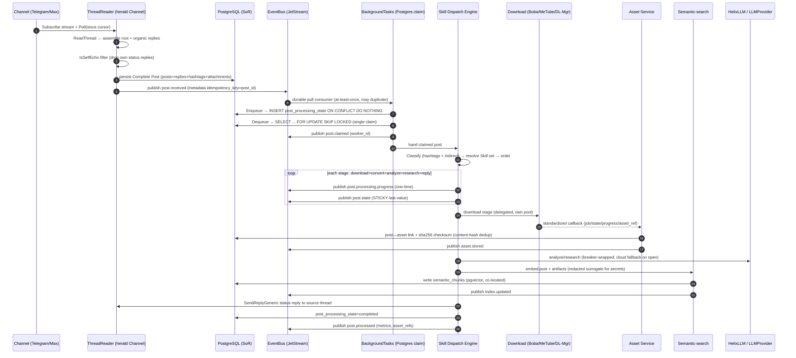

<!--
  Title           : Helix Thready — End-to-End Post Lifecycle (capstone walkthrough)
  Classification  : PUBLIC
  Location        : docs/public/research/mvp/architecture/post-lifecycle.md
  Status          : Draft — v0.1
  Revision        : 3 (2026-07-22)
  Author          : Helix Thready documentation swarm (System Architecture)
  Related         : ./messenger-ingestion.md, ./concurrency-and-idempotency.md,
                    ./event-model.md, ./processing-pipeline.md, ./asset-and-download.md,
                    ./semantic-search.md, ./data-flow.md, ./system-overview.md,
                    ./security-model.md, ./component-catalog.md
-->

# Helix Thready — End-to-End Post Lifecycle

| Rev | Date | Author | Change |
|-----|------|--------|--------|
| 1 | 2026-07-22 | swarm (System Architecture) | New capstone — full ingestion→claim→dispatch→download→asset→semantic→reply sequence; stage/event/failure reference; latency-SLO decomposition; cross-lifecycle idempotency; homes the `post-lifecycle.mmd` sequence diagram |
| 2 | 2026-07-22 | swarm (Pass 3 consistency) | §5 latency-table cell: clarify reprocess sets the sticky `post.state=reprocessing` *display* value, not a `TaskStatus` (aligns with §6 and concurrency §2) |
| 3 | 2026-07-22 | swarm (docs export) | Fixed inline mermaid syntax so diagram renders |

## Table of Contents

1. [Purpose & scope](#1-purpose--scope)
2. [The end-to-end sequence](#2-the-end-to-end-sequence)
3. [Stage-by-stage reference](#3-stage-by-stage-reference)
4. [Event-emission timeline](#4-event-emission-timeline)
5. [Latency & SLO decomposition](#5-latency--slo-decomposition)
6. [Idempotency & recovery across the lifecycle](#6-idempotency--recovery-across-the-lifecycle)
7. [Verified-at-source anchor points](#7-verified-at-source-anchor-points)
8. [Gap-register coverage](#8-gap-register-coverage)
9. [TDD reproduce-first skeletons](#9-tdd-reproduce-first-skeletons)
10. [Open items](#10-open-items)

---

## 1. Purpose & scope

This document is the **capstone** of the System Architecture area: it follows one post from the
moment a message lands in a channel to the moment a client can search the generated materials,
and stitches together the guarantees that each specialist sibling doc proves in isolation. It is
the single place that reads the lifecycle **end to end** across every plane.

It deliberately does **not** re-derive the mechanisms it references — the single-claim proof lives
in [concurrency-and-idempotency.md](./concurrency-and-idempotency.md), the sticky/one-time event
semantics in [event-model.md](./event-model.md), thread assembly in
[messenger-ingestion.md](./messenger-ingestion.md), stage ordering in
[processing-pipeline.md](./processing-pipeline.md), the fetch/store split in
[asset-and-download.md](./asset-and-download.md), and the embed path in
[semantic-search.md](./semantic-search.md). What it adds on top of the coarse flow in
[data-flow.md](./data-flow.md) §2 is threefold: (a) a **finer-grained sequence** that names the
verified interface at every hop, (b) a consolidated **event-emission timeline** and
**stage/failure reference** an implementer can build straight against, and (c) a **latency-SLO
decomposition** showing exactly why the aggressive SLO survives a 30-minute research step. Every
claim traces to a source-verified fact already established in a sibling doc (see
[§7](#7-verified-at-source-anchor-points)); nothing here upgrades a scaffold to "works".

## 2. The end-to-end sequence



> Rendered PNG/SVG exported via Docs Chain (§11.4.65). Source: `diagrams/post-lifecycle.mmd`.

**Explanation (for readers/models that cannot see the diagram).** The sequence has four movements
— **ingest**, **claim**, **process**, **finalize** — and the value of reading it end to end is
seeing how the boundary between each is a *durable artifact* (a persisted row or a published event)
rather than an in-memory hand-off, which is what lets any hop crash and resume without losing or
double-processing a post.

The **ingest** movement (steps 1–5) is the ThreadReader over the verified herald `Channel`. It
subscribes to the live stream and polls from a saved cursor, calls `ReadThread` to assemble the
root plus its *organic* reply chain, and runs the verified `IsSelfEcho` self-filter so Thready's
own earlier status reply is dropped before it can loop. Only then does it persist the **Complete
Post** — posts, replies, the union of hashtags across the whole chain, and attachments — to
PostgreSQL, the system of record. Persisting *before* publishing is deliberate: the
`post.received` event in step 5 carries `idempotency_key = post_id`, and because the row already
exists, any consumer can re-read authoritative state from the SoR rather than trusting the event
payload (whose concrete Go type JSON cannot preserve — see [event-model.md](./event-model.md) §2).

The **claim** movement (steps 6–10) is the exactly-once linchpin. The `post.received` event is
delivered to a durable JetStream consumer inside BackgroundTasks *at-least-once*, so it may arrive
more than once — and a scheduled poll can independently rediscover the same root while the push
event is still in flight. Two orthogonal gates collapse that fan-out to one unit of work: the
**enqueue gate** (`INSERT post_processing_state … ON CONFLICT (post_id, task_kind) DO NOTHING`
admits exactly one writer) and the **claim gate** (`Dequeue` runs `SELECT … FOR UPDATE SKIP
LOCKED`, so exactly one worker transitions `pending → running`). `post.claimed` announces the
winner; the losers are acked as no-ops. This is the same VERIFIED Postgres primitive proven in
[concurrency-and-idempotency.md](./concurrency-and-idempotency.md) §3–4 — Thready does not wait on
the DESIGN-ONLY `session_orchestrator` `[GAP: 2.9]`.

The **process** movement (steps 11–24) is the Skill Dispatch Engine. It classifies the post
(hashtags plus indirect determination from link shape), resolves the concrete Skill set from the
HelixSkills DAG, and orders it by the fixed precedence **download > convert > analyze > research >
reply**. The `loop` box is the heart of live observability: on every stage it publishes a one-time
`post.processing.progress` for the live UI *and* a sticky `post.state` last-value so a late
subscriber can paint current state without a REST round-trip. The download stage is **delegated**
to a separate pool (Boba/MeTube/Download Manager) and returns through the standardized callback to
the Asset Service, which writes the post↔asset link and sha256 checksum (content-hash dedup) and
emits `asset.stored` — download bytes and storage are separate concerns joined by one callback
contract. The analyze/research substeps call the LLM stack behind a circuit breaker (cloud
fallback when the local breaker opens), and every artifact — plus the original post — is embedded
into pgvector, with a **redacted surrogate** standing in for any secret so the vector store never
holds plaintext ([security-model.md](./security-model.md) §7); `index.updated` marks each write.

The **finalize** movement (steps 25–27) closes the loop: the dispatcher posts a status reply back
to the *source* thread via the verified `SendReplyGeneric` (quoting the root; `replyToID` set),
flips `post_processing_state` to `completed`, and emits `post.processed` carrying metrics and asset
references. Because the status reply is authored by Thready's own channel identity, the self-filter
of the ingest movement will drop it on the next poll — the lifecycle is closed *and* self-stable.
An explicit reprocess re-enters at the claim movement after invalidating the sticky `post.state`
(see [§6](#6-idempotency--recovery-across-the-lifecycle)).

## 3. Stage-by-stage reference

Each row is one hop of the sequence: what triggers it, what it does, which events it emits, its
dominant failure mode + degradation, and the sibling doc that owns the full design. This is the
build-order index for the pipeline.

| # | Phase | Trigger | Action (verified engine) | Events emitted | Failure mode → degradation | Owner |
|---|-------|---------|--------------------------|----------------|----------------------------|-------|
| 1 | Ingest | schedule poll + push trigger | herald `Channel.Subscribe`/poll; `ReadThread` assembles root+organic; `IsSelfEcho` filter; persist Complete Post | `post.received`; sticky `channel.health` | `FLOOD_WAIT`/rate-limit → breaker backs off, `channel.health` degraded; Max stub `[GAP: 5.1.2]` → ingestion explicitly incomplete | [messenger-ingestion.md](./messenger-ingestion.md) |
| 2 | Claim (enqueue) | `post.received` (at-least-once) | `INSERT post_processing_state … ON CONFLICT DO NOTHING` (`post_id` in `CorrelationID`) | — (losers ack as no-op) | duplicate storm → single row; module has **no** `DedupeKey`, dedup is Thready-side `[CLOSED: CONC-1]` | [concurrency-and-idempotency.md](./concurrency-and-idempotency.md) |
| 3 | Claim (dequeue) | worker free + resources fit | `Dequeue` → `SELECT … FOR UPDATE SKIP LOCKED`; `pending → running` | `post.claimed` | two workers race → exactly one claims; worker death → `StuckDetector` reclaim to `pending` | [concurrency-and-idempotency.md](./concurrency-and-idempotency.md) |
| 4 | Classify | claimed post | hashtags (union across chain) + indirect determination → category set → Skill-Graph resolve → precedence order | — | unclassifiable → `GenericIngest`, never dropped `[Q32]` | [processing-pipeline.md](./processing-pipeline.md) |
| 5 | Download | stage 1 | route by link type → Boba / MeTube / Download Manager (**own pool**) | `post.processing.progress`, sticky `post.state`, `asset.download.progress` | source unavailable → retriable callback → requeue w/ backoff; exhausted → `post.failed`; MeTube poll-only `[GAP: 6.5]` | [asset-and-download.md](./asset-and-download.md) |
| 6 | Convert / Store | download callback | Asset Service keeps raw + `…-web` rendition; content-hash dedup; post↔asset link + checksum | `asset.stored` | transcode fail → raw preserved, `…-web` retried; serve falls back to raw | [asset-and-download.md](./asset-and-download.md) |
| 7 | Analyze | stage 3 | VisionEngine + OCR adapter; transcript; content classification | `post.processing.progress`, sticky `post.state` | OCR missing today `[GAP: 2.6]` → BUILD-NEW adapter; low-confidence region → LLM-vision second pass | [processing-pipeline.md](./processing-pipeline.md) |
| 8 | Research | stage 4 (token-heavy) | multi-pass web research → docs → Skill-Graph growth via LLM stack (breaker-wrapped) | `post.processing.progress`, sticky `post.state`, `skill.step.retried` | local LLM outage → `LLMProvider` cloud fallback; per-post soft budget 30 min; HashEmbedder trap `[GAP: 2.1]` guarded | [processing-pipeline.md](./processing-pipeline.md) |
| 9 | Index | any artifact ready | chunk → embed (same model both sides) → `VectorStore.Upsert` into pgvector (co-located); secrets as redacted surrogate | `index.updated` | dimension mismatch → refuse; pgvector down → serve from cache / relational filter | [semantic-search.md](./semantic-search.md) |
| 10 | Reply | all stages done | `SendReplyGeneric` status reply to source thread (Robot/User account) | — | reply authored by self-identity → dropped on next poll (self-stable) | [messenger-ingestion.md](./messenger-ingestion.md) |
| 11 | Finalize | reply posted | `post_processing_state = completed` | `post.processed` | whole-post exhaustion earlier → `dead_letter` + `post.failed` (manual reprocess allowed) | [concurrency-and-idempotency.md](./concurrency-and-idempotency.md) |

## 4. Event-emission timeline

A single successful post emits the following event stream, in order; the sticky events additionally
retain a last-value per `post_id`. The full per-field catalog is [event-model.md](./event-model.md)
§7 — this is the *lifecycle ordering* of that catalog for one post.

```
post.received            (one-time)   — ingest: Complete Post persisted
post.claimed             (one-time)   — claim: single worker won the row lock
post.processing.progress (one-time ×N)— once per stage step (live UI)
post.state               (STICKY  ×N) — last-value {state,progress,asset_refs,last_error}
asset.download.progress  (one-time ×N)— delegated download callbacks
asset.stored             (one-time ×N)— each raw / …-web committed to storage
index.updated            (one-time ×N)— embeddings written for post + each artifact
post.processed           (one-time)   — finalize: status reply posted, metrics + asset_refs
```

Failure and control variants interleave with the above rather than replacing it:
`skill.step.retried` on each per-step back-off; `post.failed` (with `retriable`) on whole-post
exhaustion after `MoveToDeadLetter`; `post.state.invalidate` when a reprocess clears the sticky
value; and the ambient sticky `channel.health` whenever a channel's reachability/lag changes.
Clients receive this stream through the thin Event Bus Service, which delivers the **sticky
snapshot first** on connect and then live deltas ([event-model.md](./event-model.md) §4.1, §8), so
a dashboard opened mid-lifecycle paints the post's current `post.state` immediately and only then
begins receiving the tail of the timeline above.

## 5. Latency & SLO decomposition

The operator SLO is **Aggressive** — API p95 < 150 ms, semantic search < 500 ms, page < 1.5 s —
while a single research-heavy post carries a **30-minute** soft processing budget `[OPERATOR]`
`[research_request_final Q14, §3.3]`. Those two numbers only coexist because the lifecycle splits
into a **synchronous read/write plane** and an **asynchronous work plane** that never share a
request thread. The split is the whole reason the sequence in §2 crosses the EventBus at step 5
instead of calling the dispatcher inline.

| Path | Budget | What runs on it | Why it holds |
|------|--------|-----------------|--------------|
| API write (ingest trigger, reprocess request) | p95 < 150 ms | persist row / mark reprocess (sticky `post.state=reprocessing`) + publish one event | no Skill runs on the request; the event returns immediately, work happens off-thread |
| API read (browse, status) | p95 < 150 ms | SoR read; sticky `post.state` snapshot from cache | sticky last-value means "current state" is a cache read, not a pipeline wait |
| Semantic search | < 500 ms | `VectorStore.Search` (pgvector ANN) + hydrate ids from SoR | pgvector co-located with SoR → local join; ANN index tuned; query-embedding cached |
| Post processing (async) | soft 30 min / post | full stage pipeline, delegated downloads, LLM research | lives entirely in the BackgroundTasks pool; progress surfaced via events, never blocking the API |

Three design consequences follow, each already enforced by a sibling doc. First, **downloads are
delegated to their own pool** so a multi-gigabyte transfer cannot occupy a processing worker, let
alone an API thread ([asset-and-download.md](./asset-and-download.md) §3). Second, **retry timing
is bounded** — exponential back-off base 2 s, factor 2.0, cap 5 min, ±20 % full-jitter, ceiling 5
attempts — so a flapping dependency degrades throughput gracefully instead of stalling a worker
indefinitely ([concurrency-and-idempotency.md](./concurrency-and-idempotency.md) §5). Third,
**stuck recovery is time-boxed** by the module defaults (10 s heartbeat, 300 s stale threshold),
so a worker that dies inside the 30-minute budget is reclaimed within five minutes rather than
pinning the post. The aggressive API SLO is therefore a property of *where work runs*, not of how
fast any single Skill is.

## 6. Idempotency & recovery across the lifecycle

The lifecycle survives every partial failure because each movement re-enters at a durable
boundary, never mid-memory. The recovery matrix:

| Failure | Where it re-enters | Guarantee |
|---------|--------------------|-----------|
| `post.received` redelivered (at-least-once) | Claim enqueue gate | `ON CONFLICT DO NOTHING` → one row; duplicates ack as no-op |
| Two workers race the pending row | Claim dequeue gate | `FOR UPDATE SKIP LOCKED` → exactly one `running` |
| Worker dies mid-stage | Stuck recovery | stale heartbeat → `GetStaleTasks` → back to `pending`; each Skill step is idempotent so partial side-effects are safe |
| A single step fails transiently | Per-step retry | checkpointed via `TaskExecutor.Pause/Resume`; only that step retries, not the whole post; `skill.step.retried` |
| Whole post exhausts retries | Dead-letter | `MoveToDeadLetter` + `post.failed`; operator/user manual reprocess (`DeadLetterTask.ReprocessAfter`) |
| Explicit reprocess/refresh | Claim movement | `post.state.invalidate` clears sticky value → fresh claim; re-embed **replaces** chunks for the source, not duplicates ([data-flow.md](./data-flow.md) §7) |
| Client disconnects mid-stream | Event Bus Service | durable per-client consumer resumes from ack floor; beyond retention → reconcile via REST `updated_since` snapshot |

The invariant tying these together is that a post has exactly one `post_processing_state` row and
that row's status walks the **real nine-value** `models.TaskStatus` machine
([concurrency-and-idempotency.md](./concurrency-and-idempotency.md) §5.1) — "retrying" and
"reprocessing" are *transitions between* those states (a return to `pending`), not statuses of
their own, so the lifecycle has no illegal state to reconcile after any of the recoveries above.

## 7. Verified-at-source anchor points

Every hop of §2 rests on an interface that was **read at source** in a sibling doc this pass; this
table is the consolidated provenance so a reader can trust the sequence without re-deriving it.

| Hop | Verified interface (module) | Where verified |
|-----|-----------------------------|----------------|
| Ingest / reply / self-filter | herald `commons_messaging/channels.Channel` (`Subscribe`/`SendReplyGeneric`/`BotSelfIdentity`/`DownloadAttachment`), `IsSelfEcho`/`StampSender` | [messenger-ingestion.md](./messenger-ingestion.md) §2, §5 `[CLOSED: ING-2]` |
| Publish / subscribe | eventbus `pkg/event.Event`, `pkg/nats` JetStream (`Publish`/`Subscribe`, `LimitsPolicy` `EVENTBUS` stream, ephemeral `DeliverNew`) | [event-model.md](./event-model.md) §1–2 |
| Claim / retry / stuck | background `TaskQueue`/`TaskRepository` (`Dequeue` = `FOR UPDATE SKIP LOCKED`), nine-value `TaskStatus`, no `DedupeKey` (`CorrelationID`), `StuckDetector` | [concurrency-and-idempotency.md](./concurrency-and-idempotency.md) §2 `[CLOSED: CONC-1]` |
| Index | vectordb `VectorStore` (`Upsert`/`Search`/`Delete`/`Get`), embeddings `EmbeddingProvider` (`Embed`/`Dimensions`) | [semantic-search.md](./semantic-search.md) `[CLOSED: SEM-1]` |
| Seal / gate | security `pkg/securestorage.Storage` (`IsSecure` startup gate), `pkg/policy.Enforcer.EvaluateAll` (most-restrictive) | [security-model.md](./security-model.md) §3, §6 `[CLOSED: SEC-1]` |
| Breaker / failover | discovery `pkg/resilience.Manager` (`Connected/Disconnected/Reconnecting/Offline`) | [concurrency-and-idempotency.md](./concurrency-and-idempotency.md) §6 |

The **composition** — ThreadReader, Skill Dispatch Engine, Semantic-search service, Asset Service,
Download Manager, Event Bus Service — is Thready-new orchestration over those verified engines and
is marked `[BUILD-NEW]` in [component-catalog.md](./component-catalog.md) §4. Where an engine is a
scaffold (HelixLLM default embedder, VisionEngine OCR, herald Max, MeTube webhook), the sequence
shows the *target* hop and the owning doc carries the `[GAP: …]` and the plan; no hop here claims a
stub works.

## 8. Gap-register coverage

This capstone closes no gaps of its own — it routes each to the owning doc and shows where it bites
in the lifecycle:

- `[GAP: 5.1]` herald Max stub / MTProto QA-harness → the **ingest** movement is explicitly
  incomplete for Max until the OneMe port lands ([messenger-ingestion.md](./messenger-ingestion.md)).
- `[GAP: 2.9]` `session_orchestrator` DESIGN-ONLY → the **claim** movement reuses the VERIFIED
  BackgroundTasks Postgres claim, not the registry ([concurrency-and-idempotency.md](./concurrency-and-idempotency.md)).
- `[GAP: 4.1]` helix_skills has no run engine → the **process** movement is the BUILD-NEW Skill
  Dispatch Engine over the Skill-Graph ([processing-pipeline.md](./processing-pipeline.md)).
- `[GAP: 6.2/6.3/6.5]` no Download Manager / no HTTP source / MeTube poll-only → the **download**
  hop routes to BUILD-NEW downloaders + the standardized callback ([asset-and-download.md](./asset-and-download.md)).
- `[GAP: 2.1/2.6]` HashEmbedder trap / no OCR → the **analyze/index** hops guard the embedder and
  add the OCR adapter ([semantic-search.md](./semantic-search.md), [processing-pipeline.md](./processing-pipeline.md)).
- `[GAP: 7.1]` searchable-but-sealed secrets → the **index** hop embeds a redacted surrogate
  ([security-model.md](./security-model.md) §7).

## 9. TDD reproduce-first skeletons

Per `[CONSTITUTION §11.4.27/43]`, the end-to-end path starts RED. These integration-level skeletons
assert the lifecycle *as a whole*, complementing the per-stage unit skeletons in the sibling docs.

```go
// RED: a post that is duplicated at ingest still emits exactly one post.processed.
func TestLifecycle_DuplicateReceived_ProcessesOnce(t *testing.T) {
    sys := newIntegrationStack(t) // real JetStream + Postgres containers
    p := fixtureThread(root="https://youtu.be/x", replies=[]string{"#Video #ToDownload"})
    sys.PublishReceived(p); sys.PublishReceived(p) // at-least-once duplicate
    ev := sys.WaitForTerminal(t, p.ID, 60*time.Second)
    require.Equal(t, "post.processed", ev.Type)
    require.Equal(t, 1, sys.CountEvents(p.ID, "post.claimed")) // one claim only
}

// RED: the status reply Thready posts must NOT be re-ingested (self-stable loop).
func TestLifecycle_StatusReplyNotReingested(t *testing.T) {
    sys := newIntegrationStack(t)
    p := sys.RunToCompletion(t, fixtureThread(root="text"))
    sys.PollAgain(t, p.ChannelID) // next scheduled poll sees our own reply
    require.Equal(t, 1, sys.CountEvents(p.ID, "post.received")) // filtered by IsSelfEcho
}

// RED: reprocess replays the lifecycle without duplicating semantic chunks.
func TestLifecycle_Reprocess_ReplacesNotDuplicates(t *testing.T) {
    sys := newIntegrationStack(t)
    p := sys.RunToCompletion(t, fixtureThread(root="https://github.com/o/r", replies=[]string{"#Research"}))
    before := sys.ChunkCount(p.ID)
    sys.Reprocess(t, p.ID) // → post.state.invalidate → fresh claim
    sys.WaitForTerminal(t, p.ID, 60*time.Second)
    require.Equal(t, before, sys.ChunkCount(p.ID)) // replaced, not doubled
}
```

The 15 mandated test types apply end to end: integration (above, real containers), chaos (kill a
worker mid-research, assert stuck-reclaim then `post.processed`), stress (10k `post.received`/min,
assert one claim each), performance (API write p95 < 150 ms while processing runs async), and
security (a client cannot see another account's lifecycle events).

## 10. Open items

- `[OPEN: PL-1]` The per-stage soft-timeout budgets that sum to the 30-minute per-post ceiling are
  `[DEFAULT — adjustable]` and need load-test validation in the testing pack (mirrors
  `[OPEN: PROC-3]`); tracked, not guessed.
- `[OPEN: PL-2]` The end-to-end **integration harness** wiring real JetStream + Postgres containers
  (used by §9) is owned by the testing area; this doc specifies the assertions, the harness build is
  cross-linked, not duplicated.
- `[NOTE: PL-3]` Max ingestion cannot yet run the full lifecycle (`[GAP: 5.1.2]` empty stub); the
  sequence in §2 is verified for Telegram and is the *target* for Max once the OneMe port lands —
  stated here so the capstone is not read as claiming Max works.

---

*Made with love ♥ by Helix Development.*
