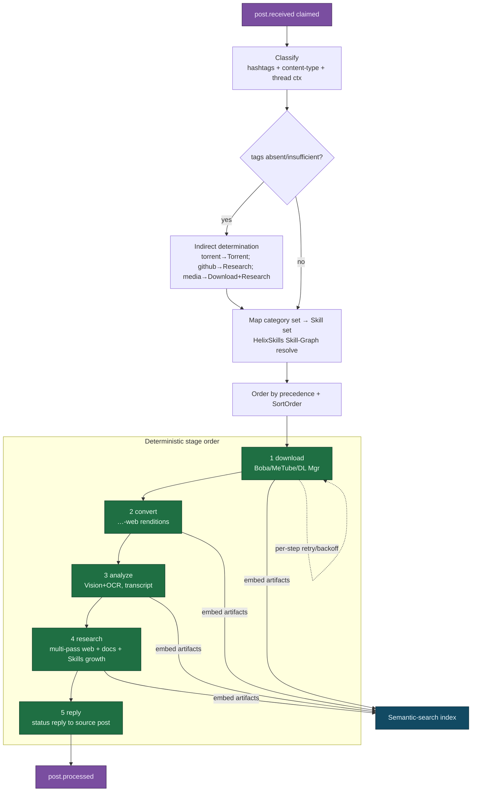

<!--
  Title           : Helix Thready — Processing Pipeline (classification, Skill dispatch, recipes)
  Classification  : PUBLIC
  Location        : docs/public/research/mvp/architecture/processing-pipeline.md
  Status          : Draft — v0.1
  Revision        : 1 (2026-07-21)
  Author          : Helix Thready documentation swarm (System Architecture)
  Related         : ./concurrency-and-idempotency.md, ./event-model.md, ./semantic-search.md,
                    ./asset-and-download.md, ./messenger-ingestion.md, ./data-flow.md
-->

# Helix Thready — Processing Pipeline

| Rev | Date | Author | Change |
|-----|------|--------|--------|
| 1 | 2026-07-21 | swarm (System Architecture) | Initial draft — classification, dispatch, recipe matrix, OCR |
| 2 | 2026-07-21 | swarm (review pass) | Add §5.1 token optimization (closes GAP 2.9 token-opt half); PROC-4 open item |

## Table of Contents

1. [What the pipeline does](#1-what-the-pipeline-does)
2. [HelixSkills: knowledge units, not a run engine](#2-helixskills-knowledge-units-not-a-run-engine)
3. [The Skill Dispatch Engine (BUILD-NEW)](#3-the-skill-dispatch-engine-build-new)
4. [Classification: hashtags + indirect determination](#4-classification-hashtags--indirect-determination)
5. [Deterministic stage order & precedence](#5-deterministic-stage-order--precedence)
5.1. [Token optimization in the research stage (GAP 2.9)](#51-token-optimization-in-the-research-stage-gap-29)
6. [Pipeline diagram](#6-pipeline-diagram)
7. [Content-type recipe matrix](#7-content-type-recipe-matrix)
8. [OCR & Vision (BUILD-NEW OCR adapter)](#8-ocr--vision-build-new-ocr-adapter)
9. [Status reply](#9-status-reply)
10. [Gap-register coverage](#10-gap-register-coverage)
11. [TDD reproduce-first skeletons](#11-tdd-reproduce-first-skeletons)
12. [Open items](#12-open-items)

---

## 1. What the pipeline does

For each claimed post, the pipeline: classifies it by hashtag + content type + thread context;
selects the matching Skill(s); runs them in a deterministic order
(**download → convert → analyze → research → reply**); embeds every artifact for semantic
search; and posts a status reply to the source thread. A post may match **multiple** categories
at once and runs *every* matching Skill — categories are additive, not exclusive
`[research_request_final §3.2.2, §3.3, Q33]`.

## 2. HelixSkills: knowledge units, not a run engine

Thready reuses `HelixDevelopment/helix_skills` `[IN-HOUSE: helix_skills]`. Skills are versioned
**knowledge units** organized as a DAG (`atomic → composite → umbrella`) with typed hard-closure
edges (`requires`/`extends`/`composes`) and advisory edges
(`recommends`/`related_to`/`alternative_to`). Discovery is via `register.sh` symlinks + a
generated `INDEX.md`; runtime registration via `SkillRegistry`; tool exposure via `MCP_Module`.

> **`[GAP: 4.1]` No processing/execution engine.** Skills are knowledge units in a DAG, **not
> runnable jobs**. The Skill-Graph gives *ordering/knowledge*, not *task execution*. Thready's
> "recipe per hashtag" therefore needs a **dispatch/execution engine built on top** — that is
> the Skill Dispatch Engine below. Additional flagged issues: inconsistent Skill file format
> (`SKILL.md` with YAML frontmatter vs bare `skill.md`), and a Skill-Graph "Gaps & Risks
> Register" with 95 open findings. **Plan:** build the dispatch engine; standardize on one
> canonical `SKILL.md` schema and migrate the no-frontmatter dirs; triage the open findings
> relevant to Thready. Nothing here claims helix_skills executes work today.

## 3. The Skill Dispatch Engine (BUILD-NEW)

The engine maps hashtag/content-type → Skill(s), orders them, and runs each Skill step via the
BackgroundTasks queue with idempotent single-claim, retries and events. It keeps the Skill-Graph
as the **knowledge/ordering source** and adds the **execution** layer
`[research_request_final Q33]` `[GAP: 4.1]`.

```go
// Skill Dispatch Engine — composition over helix_skills (BUILD-NEW).
type Dispatcher struct {
    graph   skills.Graph       // helix_skills Skill-Graph (knowledge/order)
    queue   background.TaskQueue
    bus     eventbus.Publisher
}

// Dispatch selects, orders and runs the Skills for one post.
func (d *Dispatcher) Dispatch(ctx context.Context, post *Post) error {
    cats := Classify(post)                     // §4 — hashtags + indirect + content-type
    skillSet := d.graph.Resolve(cats)          // knowledge DAG → concrete Skills
    steps := OrderByPrecedence(skillSet)        // §5 — download>convert>analyze>research>reply
    for _, step := range steps {
        task := stepTask(post, step)            // idempotent per (post_id, step)
        if err := d.queue.Enqueue(ctx, task); err != nil { return err }
        _ = d.bus.Publish(progress(post, step)) // post.processing.progress
    }
    return nil
}
```

Each Skill step is itself **idempotent** (re-running it produces the same result / is a no-op if
already done), which is what makes per-step retry and stuck-recovery safe
([concurrency-and-idempotency.md](./concurrency-and-idempotency.md)).

## 4. Classification: hashtags + indirect determination

1. Extract **all** hashtags from the assembled thread (root + organic replies — union across the
   chain; see [messenger-ingestion.md](./messenger-ingestion.md)).
2. Where tags are absent/insufficient, derive them via **indirect determination**
   `[research_request_final §3.5]`:
   - Torrent/magnet links → `Torrent` + `ToDownload`.
   - GitHub / other coding-service links → full deep Research + docs + Skill-tree growth.
   - YouTube / streaming / media → Download, and deep Research if IT-related.
3. If still unclassified → **generic ingest** (store + embed + index) and queue for manual
   review; never silently drop `[research_request_final Q32]`.
4. Multiple categories may apply simultaneously (e.g. a YouTube link + GitHub repo tagged
   `#Research #Video #TODO #ToDownload` triggers **both** video download **and** mandatory deep
   technology research).

```go
func Classify(p *Post) CategorySet {
    cats := FromHashtags(p.Hashtags)          // direct
    if cats.Weak() {                          // absent/insufficient
        for _, l := range p.Links {
            switch {
            case l.IsTorrentOrMagnet(): cats.Add("Torrent", "ToDownload")
            case l.IsCodeHost():        cats.Add("Research", "Technology")
            case l.IsMedia():           cats.Add("ToDownload"); if l.IsITRelated() { cats.Add("Research") }
            }
        }
    }
    if cats.Empty() { cats.Add("GenericIngest") } // never drop; manual-review queue
    return cats
}
```

## 5. Deterministic stage order & precedence

Categories are additive; ordering is deterministic by a Skill `SortOrder` plus a fixed
precedence so later stages consume earlier outputs `[research_request_final §3.3, §19.2]`:

> **download > convert > analyze > research > reply**

| Stage | Purpose | Engines |
|-------|---------|---------|
| 1. download | Fetch raw media/attachments | Boba (torrents), MeTube (video), Download Manager (direct) |
| 2. convert | Generate `…-web` optimized renditions; keep raw | Asset Service transcoder (H.264/AAC fMP4 + H.265/AV1; HLS/DASH) |
| 3. analyze | Extract meaning: Vision, OCR, transcript, content classification | VisionEngine + OCR adapter; HelixLLM |
| 4. research | Multi-pass deep web research → docs → Skills/MCP/Embeddings | HelixLLM/LLMProvider/HelixAgent; CodeGraph ingest |
| 5. reply | Post status reply to source thread; mark processed | ThreadReader.Reply |

Within a stage, independent Skills may run concurrently (bounded by per-Skill caps); across
stages the order is strict. Retry/back-off and circuit-breaking are per step
([concurrency-and-idempotency.md](./concurrency-and-idempotency.md)).

### 5.1 Token optimization in the research stage (GAP 2.9)

Stage 4 (**research**) is the token-heavy stage: a single `#Research`/`#Technology` post can fan
out into multi-pass web research, document synthesis and Skill-Graph growth, driving many large
LLM calls through HelixLLM/LLMProvider/HelixAgent. The Constitution mandates a token-optimization
layer `[CONSTITUTION §11.4.198]`, and the gap register flags its two owned building blocks as
not-yet-usable:

> **`[GAP: 2.9]` token_optimizer is WIP; TOON is a scaffold.** `token_optimizer` has only
> `pkg/config` implemented (pipeline/router scaffolded; its six declared deps are declared, not
> integrated) and `TOON` returns `ErrTOONEncodingNotImplemented` (a prior json-delegating
> "contract bluff" was removed) — **do not use TOON yet**. Both are VERIFIED at source. The
> `session_orchestrator` half of this same gap (the atomic claim registry) is closed separately
> by BackgroundTasks' Postgres claim ([concurrency-and-idempotency.md](./concurrency-and-idempotency.md)).

**Plan (tracked, MVP-scoped — nothing here is claimed to work today):**

- **MVP:** the research stage runs **without** a bespoke token-optimizer; it bounds cost with the
  levers that already exist — per-Skill concurrency caps (§8 caps LLM-research low), the
  `LLMProvider` model-tier fallback (small/local model first, escalate only on need), prompt
  templating that ships only the retrieved `rag` context (not whole documents), and the
  `digital.vasic.cache` query/embedding cache. This keeps the aggressive SLO honest without
  depending on a scaffold.
- **P1 (post-MVP):** implement `token_optimizer`'s pipeline/router and a real `TOON` encoder, or
  explicitly mark them **out of scope for the Thready MVP** — do not wire either until it passes an
  anti-bluff gate (a green test that proves real token reduction, not a json passthrough)
  `[CONSTITUTION §11.4.27]`. Until then the research Skills call the LLM stack directly through the
  levers above. See `[OPEN: PROC-4]`.

## 6. Pipeline diagram



> Rendered PNG/SVG exported via Docs Chain (§11.4.65). Source: `diagrams/processing-pipeline.mmd`.

**Explanation (for readers/models that cannot see the diagram).** A claimed `post.received`
first goes to classification, which reads the union of hashtags plus content-type and thread
context. If tags are absent or insufficient, indirect determination fills them in from link
shape (a torrent link becomes `Torrent`, a GitHub link becomes `Research`, a media link becomes
download-plus-research-if-IT). The resulting category set is mapped to concrete Skills by
resolving the HelixSkills Skill-Graph, then ordered by the fixed precedence and each Skill's
`SortOrder`. Execution then proceeds through the five strict stages: download (delegated to
Boba/MeTube/Download Manager), convert (generate `…-web` renditions while keeping the raw),
analyze (Vision + OCR + transcript + content classification), research (multi-pass web research
that also grows the Skill-Graph and knowledge base), and finally reply (post the status reply and
mark the post processed, emitting `post.processed`). Crucially, stages 1–4 each embed their
artifacts into the semantic index as they complete, and the download stage has a self-loop
indicating per-step retry with back-off — a transient download failure retries just that step,
not the whole post. The order is not cosmetic: research in stage 4 can analyze the media
downloaded in stage 1 and transcribed in stage 3, and the reply in stage 5 reports the complete
result.

## 7. Content-type recipe matrix

Every documented hashtag category has a written Skill (recipe), all built in parallel
`[OPERATOR: all categories]` `[research_request_final §3.2.2]`. Each recipe composes the stages
above.

| Category | Recipe (stages) |
|----------|-----------------|
| Video / Videos | download → convert (`…-web`) → analyze; maintain post↔asset links; re-downloadable via REST |
| Torrent / Magnet | locate torrent/magnet (Boba if absent) → delegated download with callback |
| Serial / Series | search all seasons (3rd-party) → download all with callbacks |
| Movie / Movies | as Series, movie-oriented |
| Research (+Technology) | multi-pass deep web research → comprehensive docs → Skills/Plugins/MCP/ACP/LSP/Embeddings; semantic + CodeGraph ingest |
| Documentary | as Movies; if no `#ToDownload`, full processing + documentation/book |
| Concert / Concerts | as shows; live music/artist media (video/audio) |
| Game / Games | seek per platform (default PS4/PC/Android; PC default OS Windows unless `#macOS`/`#Linux`) |
| Software | as games; default OS Windows/Linux/macOS |
| Channel | download full channel; raw + web; IT content → research |
| Playlist | as channels; grouped with ordering-number prefixes for watch order |
| Music | as concerts; MP3/OPUS/FLAC + majors; locate if no links |
| Book / Books | determine author, download full bibliography; if IT → research + Skills |
| Comic / Comics | download → **OCR full transcription** → semantic ingest (no research/Skills) |
| Netflix | find first (unless links provided); as movies/series |
| Training | full course download (Udemy/Coursera…); analyze; documentation + Skills |
| Technology (+Research) | mandatory deep research + analysis docs; download all media; Skills growth; powerful semantic search |

`#ToDownload` semantics: with the tag, download-then-other-processing-by-kind; e.g. an IT
resource is downloaded **and** deep-researched.

## 8. OCR & Vision (BUILD-NEW OCR adapter)

The analyze stage needs OCR for Comics (full transcription), Screenshots, QR codes, and scanned
documents. VisionEngine provides LLM-vision adapters but **has no OCR engine**
`[GAP: 2.6]` (VERIFIED grep-confirmed no Tesseract/gosseract/PaddleOCR/GOT-OCR).

**Plan `[BUILD-NEW: OCR adapter]` `[research_request_final Q37]`:**

- Add a **Tesseract adapter** (cgo `gosseract` or `tesseract` subprocess) + a **PaddleOCR**
  option for hard/multilingual scans, behind a first-class `OCRProvider` seam; per-word bounding
  boxes; offline + deterministic.
- **Hybrid pipeline:** Tesseract/PaddleOCR fast first pass (raw text + boxes) → LLM-vision second
  pass over ambiguous regions; wire VisionEngine's `TextRegion` type to the real recognizer.
- Make the GoCV analyzer (behind the `-tags vision` build tag) a real path or clearly gate/
  document it (it is a `StubAnalyzer` today).

```go
// OCRProvider seam behind VisionEngine (BUILD-NEW adapter).
type OCRProvider interface {
    Recognize(ctx context.Context, img []byte, lang []string) (OCRResult, error)
}
type OCRResult struct {
    Text   string
    Words  []Word // per-word bounding boxes
}
// Hybrid: fast OCR first, LLM-vision fallback for low-confidence regions.
func (a *HybridAnalyzer) Analyze(ctx context.Context, img []byte) (Analysis, error) {
    ocr, _ := a.ocr.Recognize(ctx, img, a.langs)        // Tesseract/PaddleOCR
    if ocr.MinConfidence() < a.threshold {
        vis, _ := a.vision.Describe(ctx, img)           // LLM-vision second pass
        return merge(ocr, vis), nil
    }
    return fromOCR(ocr), nil
}
```

QR codes are decoded (target + metadata extracted) and treated as **sensitive** (encrypted);
screenshots are OCR+Vision analyzed and sensitivity-classified — see
[security-model.md](./security-model.md) §7. All extracted text is embedded for semantic search.

## 9. Status reply

After all Skills complete, the pipeline posts a **status reply** to the original post via
ThreadReader.Reply (Robot or User account) containing success/failure, metrics (durations,
artifact counts), and asset references `[research_request_final §3.2.3, §21.2]`. It then marks
the post processed and emits `post.processed`. Reprocessing/refresh is allowed via an explicit
trigger (`client → REST /v1/posts/{id}/reprocess → System`), which invalidates the sticky
`post.state` ([event-model.md](./event-model.md)). The system never processes its own status
replies ([messenger-ingestion.md](./messenger-ingestion.md) §5).

## 10. Gap-register coverage

- `[GAP: 4.1]` helix_skills has no execution engine → Skill Dispatch Engine (§3), standardize
  `SKILL.md`, triage open findings.
- `[GAP: 2.9]` token_optimizer WIP / TOON scaffold → research stage runs on existing cost levers
  for MVP; real token-optimizer/TOON deferred behind an anti-bluff gate (§5.1). The
  session_orchestrator half of 2.9 is closed in
  [concurrency-and-idempotency.md](./concurrency-and-idempotency.md).
- `[GAP: 2.6]` VisionEngine has no OCR → BUILD-NEW OCR adapter + hybrid pipeline (§8).
- Download delegation gaps (`[GAP: 6.x]`) are consumed here but owned by
  [asset-and-download.md](./asset-and-download.md).
- Research-stage embedding + the HashEmbedder trap (`[GAP: 2.1]`) are owned by
  [semantic-search.md](./semantic-search.md).

## 11. TDD reproduce-first skeletons

```go
// RED: multi-hashtag post runs BOTH video-download and research Skills.
func TestDispatch_MultiCategory(t *testing.T) {
    post := fixturePost(hashtags=[]string{"Research","Video","TODO","ToDownload"},
                        links=[]string{"https://youtu.be/x","https://github.com/o/r"})
    steps := dispatch(t, post)
    require.Subset(t, skillNames(steps), []string{"video.download","tech.research"})
}

// RED: precedence must order download before research.
func TestDispatch_PrecedenceOrder(t *testing.T) {
    steps := OrderByPrecedence(mixedSkills)
    require.Less(t, indexOf(steps,"stage:download"), indexOf(steps,"stage:research"))
}

// RED: comic OCR must produce a transcription (not silently skip).
func TestComic_OCRTranscription(t *testing.T) {
    res := analyze(t, comicPage())
    require.NotEmpty(t, res.Transcription) // FAILS until OCR adapter wired (GAP 2.6)
}

// RED: unclassifiable post is generic-ingested, never dropped.
func TestClassify_NeverDrops(t *testing.T) {
    cats := Classify(fixturePost(hashtags=nil, links=nil, text="hello"))
    require.Contains(t, cats, "GenericIngest")
}
```

## 12. Open items

- `[OPEN: PROC-1]` The canonical `SKILL.md` schema (frontmatter fields, versioning) must be
  finalized before migrating the no-frontmatter Skill dirs `[GAP: 4.1]`; tracked as a workable
  item against helix_skills.
- `[OPEN: PROC-2]` The exact `SkillRegistry`/`MCP_Module` import paths are FLAGGED (docs-only) in
  the gap register; the dispatcher references them abstractly until source-confirmed (re-verify
  backlog).
- `[OPEN: PROC-3]` Per-Skill concurrency caps and per-category soft timeouts are
  `[DEFAULT — adjustable]` (research-heavy 30 min); final values need load-testing in the testing
  pack.
- `[OPEN: PROC-4]` Whether `token_optimizer`/`TOON` are hardened for Thready or declared
  out-of-scope for the MVP `[GAP: 2.9]` is a tracked P1 decision; the research stage runs on the
  existing cost levers (§5.1) until then. Re-verify both at source before any reliance (gap
  register §13 re-verification backlog).

---

*Made with love ♥ by Helix Development.*
