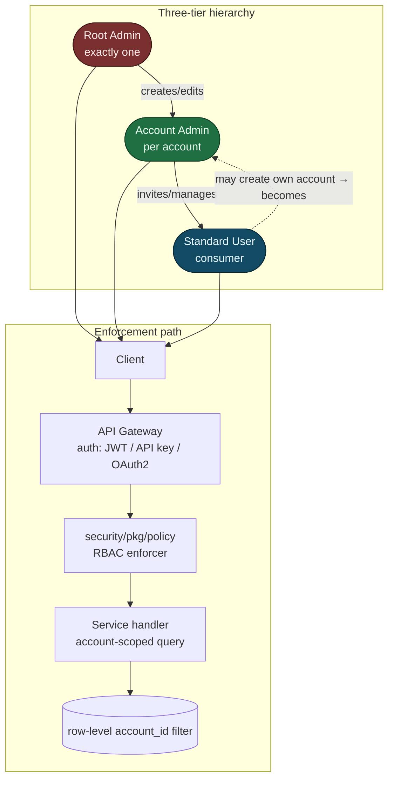

<!--
  Title           : Helix Thready — Security Model (auth, RBAC, encryption, sensitive content)
  Classification  : PUBLIC
  Location        : docs/public/research/mvp/architecture/security-model.md
  Status          : Draft — v0.1
  Revision        : 1 (2026-07-21)
  Author          : Helix Thready documentation swarm (System Architecture)
  Related         : ./system-overview.md, ./component-catalog.md, ./data-flow.md,
                    ./asset-and-download.md, ./semantic-search.md, ./service-discovery.md
-->

# Helix Thready — Security Model

| Rev | Date | Author | Change |
|-----|------|--------|--------|
| 1 | 2026-07-21 | swarm (System Architecture) | Initial draft — auth, RBAC, encryption, sensitive content |

## Table of Contents

1. [Threat model & posture](#1-threat-model--posture)
2. [Authentication](#2-authentication)
3. [Three-tier RBAC](#3-three-tier-rbac)
4. [RBAC & auth diagram](#4-rbac--auth-diagram)
5. [Encryption in transit & at rest](#5-encryption-in-transit--at-rest)
6. [`security/pkg/securestorage` (verified interface)](#6-securitypkgsecurestorage-verified-interface)
7. [Sensitive-content handling](#7-sensitive-content-handling)
8. [Secrets & key management](#8-secrets--key-management)
9. [Audit trail](#9-audit-trail)
10. [Gap-register coverage](#10-gap-register-coverage)
11. [TDD reproduce-first skeletons](#11-tdd-reproduce-first-skeletons)
12. [Open items](#12-open-items)

---

## 1. Threat model & posture

Compliance posture is **internal/private — minimal** `[OPERATOR]`: encryption and secrets
hygiene are mandatory; formal GDPR/CCPA certification is deferred but the design stays
GDPR-aware (data-minimization, erasure/export hooks). The principal assets to protect are (a)
messenger session credentials (a leaked Telegram session is account takeover), (b) operator/
user secrets stored in posts, (c) sensitive scanned documents (credit cards, contracts, signed/
stamped docs, QR codes), and (d) multi-tenant isolation (account A must never see account B's
data). No server/login/credential data may reach any public repo or leak through logs
`[CONSTITUTION §11.4.10]`.

## 2. Authentication

Authentication is `digital.vasic.auth` `[IN-HOUSE: auth]` (VERIFIED PRODUCTION):

- **JWT** access + refresh (`golang-jwt/v5`) for interactive clients (Web/Desktop/Mobile/TUI).
- **API keys** (scoped) for SDK/CLI and pipeline automation.
- **OAuth2** for linking external services (Dropbox/GDrive/OneDrive presets in `Auth-KMP`).

Session policy `[research_request_final §6.3, Q9]` `[DEFAULT — adjustable]`: access token 15 min,
refresh 7 d, idle timeout 30 min (web); revocation via the token store; passwords Argon2id
(`security`), min 12 chars, breach-list check. **MFA (TOTP) mandatory for Root Admin and Account
Admin; optional for standard users**.

> **`[GAP: 7.2]` JWT signing.** `auth`'s JWT default is **HMAC-SHA256** — fine for a single
> service, but Thready is multi-service (Ingestion, Processing, Asset, Semantic-search, User,
> Gateway all verify tokens). **Plan:** add **RS256/EdDSA** asymmetric signing + **JWKS
> rotation** so services verify with a public key without sharing the HMAC secret; add TOTP MFA
> for admin tiers. This is a P1 hardening — until it lands, the docs do **not** claim
> multi-service token verification is secure with the default HMAC.

## 3. Three-tier RBAC

The hierarchy is fixed `[research_request_final §6.1]`. RBAC is layered via the Catalogizer
pattern + `security/pkg/policy` enforcer, folded into the new **User Service** `[BUILD-NEW]`
(gap register §11).

| Tier | Role | Permissions |
|------|------|-------------|
| 1 | **Root Admin** | Full control of all accounts/users/roles/permissions; exactly one exists; bootstrapped at deploy (owner-only) |
| 2 | **Account Admin** | Full control of their own account and its users; sets per-account branding/policy |
| 3 | **Standard User** | Consumer access to assigned accounts |

Membership is many-to-many: a user may belong to multiple accounts, create their own account
(becoming its Admin), or be invited to others as Admin or user `[research_request_final §6.1]`.
Every domain row carries `account_id`; every service handler runs account-scoped queries; the
policy enforcer gates each action **before** the handler touches data.

```go
// Enforcement at the handler boundary (illustrative over security/pkg/policy).
func (h *PostHandler) Reprocess(w http.ResponseWriter, r *http.Request) {
    sub := auth.Subject(r.Context())                 // from validated JWT/API-key
    postID := chi.URLParam(r, "id")
    acct := h.posts.AccountOf(r.Context(), postID)
    if !h.policy.Allow(sub, policy.Action("post:reprocess"), policy.Resource{Account: acct}) {
        httpx.Forbidden(w); return                    // RBAC denies cross-account access
    }
    h.svc.Reprocess(r.Context(), postID)
}
```

## 4. RBAC & auth diagram



> Rendered PNG/SVG exported via Docs Chain (§11.4.65). Source: `diagrams/rbac.mmd`.

**Explanation (for readers/models that cannot see the diagram).** The top half shows the
authority chain: the single Root Admin creates and edits Account Admins; each Account Admin
invites and manages Standard Users; and a Standard User may create their own account, at which
point they become an Account Admin of it (the dashed self-edge). The bottom half shows how any
of those principals is enforced on every request: the client presents a token to the API
Gateway, which authenticates it via `auth` (JWT, API key, or OAuth2); the request then passes
through the `security/pkg/policy` RBAC enforcer, which checks the subject's role against the
requested action and the target account **before** the service handler runs; the handler
finally executes an account-scoped query so the database only ever returns rows matching the
caller's `account_id`. There are two independent gates (policy check + row-level account filter)
so a bug in one does not silently leak cross-tenant data.

## 5. Encryption in transit & at rest

`[research_request_final Q38, §14.4]`:

- **In transit** — TLS 1.3 everywhere; public endpoints carry `lets_encrypt` certs per
  subdomain (see [service-discovery.md](./service-discovery.md)). Internal service-to-service
  traffic also runs over TLS.
- **At rest** — **AES-256-GCM** via `security/pkg/securestorage` (Argon2id-derived keys).
  Asset bytes live in encrypted directories / SQLCipher-at-rest (Catalogizer) and the MinIO/S3
  tier with server-side encryption; the relational DB encrypts sensitive columns; secrets never
  land in plaintext on disk.

## 6. `security/pkg/securestorage` (verified interface)

Read at source from `vasic-digital/security/pkg/securestorage/securestorage.go` — the
credential/token/key store Thready uses for messenger sessions and linked-service tokens:

```go
// digital.vasic.security/pkg/securestorage — VERIFIED
type Storage interface {
    Store(key, value string) error
    Retrieve(key string) (string, error)
    Delete(key string) error
    Contains(key string) (bool, error)
    ListKeys() ([]string, error)
    Clear() error
    IsSecure() (bool, error)
}

// FileStorage is the AES-256-GCM-backed implementation (encrypt/decrypt at rest):
func NewFileStorage(storageDir string) *FileStorage
func (fs *FileStorage) StoreCredentials(service, username, password string) error
func (fs *FileStorage) RetrieveCredentials(service string) (username, password string, err error)
func (fs *FileStorage) StoreToken(service, token string) error
func (fs *FileStorage) RetrieveToken(service string) (string, error)
func (fs *FileStorage) StorePrivateKey(service, privateKey string) error
```

Thready stores each messenger session and OAuth2 token here, keyed by
`account:<id>:telegram:session` / `account:<id>:max:token`. `IsSecure()` gates startup: a
service that cannot open a secure store **refuses to start** rather than falling back to
plaintext.

> **`[GAP: 7.3]` Mobile secure storage.** On mobile, `Security-KMP`'s Android/iOS/Wasm secure
> storage is an **in-memory STUB** — only the JVM/desktop `FileStorage` above is real AES-256-GCM.
> Shipping mobile clients on the stub would store secrets in plaintext memory. **Plan:** implement
> **Android Keystore**, **iOS Keychain**, and a Wasm/browser secure store behind the same
> `securestorage.Storage` seam; contract-test round-trip on-device; **block mobile release until
> real**. Until then, mobile clients are treated as untrusted for secret storage and use
> short-lived tokens only.

## 7. Sensitive-content handling

The original request enumerates specific sensitive content types and how each must be handled
`[research_request_final §3.6, request "Content with sensitive data"]`:

| Content | Handling | Searchable? |
|---------|----------|-------------|
| API keys / tokens / credentials in posts | Persist AES-256-GCM (`securestorage`); **never logged** | **Yes** — embeddings computed over a **redacted/tokenized** representation so secrets are findable without leaking the raw value |
| Credit cards / contracts / signed & stamped docs | Stored in a **specially encrypted asset directory**; only the Asset Service decrypts; `security/pkg/pii` detection/redaction | Metadata only (encrypted at rest) |
| QR codes | Decoded; target + basic metadata extracted for search; treated as sensitive (encrypted) | Yes (over decoded metadata) |
| Screenshots | OCR + Vision extract meaning for search; sensitivity-classified | Yes (over extracted text) |
| Uncovered types | Documented as open items for refinement | — |

The **searchable-but-sealed** requirement (`[GAP: 7.1]` improvement) is the subtle one: a secret
must be findable ("show me the AWS key I saved") without the vector store or logs ever holding
the plaintext. The design embeds a **tokenized surrogate** — e.g. `AWS_ACCESS_KEY_ID
AKIA…REDACTED for service=prod-billing` — so semantic search matches intent while the raw value
stays only in the AES-GCM store, retrievable solely through an RBAC-gated Asset/secret endpoint.
Detail of the embedding-over-redaction path is in [semantic-search.md](./semantic-search.md).

```mermaid
flowchart LR
  P[Post with secret] --> DET[security/pkg/pii\ndetect + classify]
  DET --> SEAL[Encrypt raw value\nAES-256-GCM securestorage]
  DET --> RED[Tokenize/redact surrogate]
  RED --> EMB[Embed surrogate]
  EMB --> VEC[(pgvector)]
  SEAL --> KV[(sealed secret store)]
  Q[Search "aws key"] --> VEC --> HIT[match surrogate]
  HIT --> GATE{RBAC allow?}
  GATE -->|yes| KV --> REVEAL[reveal raw via Asset/secret API]
  GATE -->|no| DENY[forbidden]
```

> Rendered PNG/SVG exported via Docs Chain (§11.4.65). Source: `diagrams/sensitive-content.mmd`.

**Explanation (for readers/models that cannot see the diagram).** When a post contains a secret,
`security/pkg/pii` detects and classifies it. Two things then happen in parallel: the **raw
value** is encrypted with AES-256-GCM into the sealed secret store, and a **redacted surrogate**
(intent-preserving, value-stripped) is produced. Only the surrogate is embedded and written to
pgvector, so a later semantic query like "aws key" matches the surrogate — the vector store
never holds the plaintext. When a match is found, revealing the raw value passes through an RBAC
gate; only if the caller is allowed does the sealed store return the plaintext through the
account-scoped Asset/secret endpoint. An unauthorized caller can, at most, learn that a secret
*exists* by its surrogate, never its value.

## 8. Secrets & key management

`[research_request_final Q39, §14.4]` `[CONSTITUTION §11.4.10]`:

- Runtime-load-only from gitignored `.env` / `secrets` (or host `~/api_keys.sh`); `chmod
  600/700`; leak-audit + rotate-on-leak; **SKIP if missing, never log**.
- AES-GCM sealed key store via `security`; owner-only signing-key generation stored in the
  **private repo** (never public). No external Vault mandated for MVP; SOPS/age may be added.
- Firebase signing keys generated dynamically, owner-only, per env `[CONSTITUTION §11.4.47]`.

## 9. Audit trail

All admin/user actions are logged append-only and queryable via `digital.vasic.observability`
(logrus + ClickHouse) `[research_request_final §14.4, Q40]`; access-log retention
`[DEFAULT — adjustable]` 1 year; admin actions are audit-grade. Every mutating REST call and
RBAC decision emits an audit record `{actor, action, resource, account, decision, ts, trace_id}`
correlated to the event `TraceID` ([event-model.md](./event-model.md)).

## 10. Gap-register coverage

- `[GAP: 7.2]` auth JWT HMAC-SHA256 → add RS256/EdDSA + JWKS rotation + TOTP MFA (§2 above).
- `[GAP: 7.3]` Security-KMP mobile in-memory stub → native Keystore/Keychain, block mobile
  release until real (§6 above).
- `[GAP: 7.1]` searchable-but-sealed credentials → embed-over-redaction surrogate (§7 above).
- `[GAP: 7.4]` Auth-KMP must consume the fixed Security-KMP for token storage (currently
  interface-backed by the stub) — tracked; mobile clients use short-lived tokens until §6 lands.
- `[GAP: 9.x]` Security testing (authn/authz, secret-leak scans, fuzzing, CVE, DDoS) is covered
  by the testing pack (SonarQube + Snyk + HelixQA security banks) `[CONSTITUTION §11.4.27]`.

## 11. TDD reproduce-first skeletons

```go
// RED: cross-account access must be forbidden.
func TestRBAC_CrossAccountDenied(t *testing.T) {
    userB := subjectFor(t, account="B", role="user")
    resp := doReprocess(t, userB, postOwnedBy="A")
    require.Equal(t, http.StatusForbidden, resp.Code)
}

// RED: a secret must never appear in the vector store plaintext.
func TestSensitive_SecretNotEmbeddedRaw(t *testing.T) {
    idx := ingestPost(t, "my key is AKIAEXAMPLE1234SECRET")
    require.NotContains(t, idx.EmbeddedText, "AKIAEXAMPLE1234SECRET") // surrogate only
    require.True(t, sealedStore.Contains(t, "…")) // raw is sealed
}

// RED: service refuses to start on an insecure store.
func TestSecureStore_RefuseInsecureStart(t *testing.T) {
    fs := securestorage.NewFileStorage(worldReadableDir(t))
    ok, _ := fs.IsSecure()
    require.False(t, ok)
    require.Error(t, bootWithStore(fs)) // must fail closed, not plaintext-fallback
}
```

## 12. Open items

- `[OPEN: SEC-1]` Exact `security/pkg/policy` API (`Allow`, `Action`, `Resource`) is illustrative;
  the policy enforcer surface must be source-confirmed (only `securestorage` was read
  field-by-field this pass). Tracked in the re-verification backlog.
- `[OPEN: SEC-2]` The redaction/tokenization scheme for searchable-but-sealed secrets needs a
  concrete spec (which token boundaries preserve searchability without leaking entropy);
  tracked as a P2 workable item with `security/pkg/pii`.
- `[OPEN: SEC-3]` Whether internal service-to-service auth uses mTLS or signed service tokens is
  deferred to the deployment pack; both are compatible with the JWKS plan in §2.

---

*Made with love ♥ by Helix Development.*
