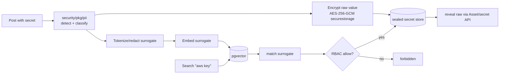

<!--
  Title           : Helix Thready — Security Model (auth, RBAC, encryption, sensitive content)
  Classification  : PUBLIC
  Location        : docs/public/research/mvp/architecture/security-model.md
  Status          : Draft — v0.1
  Revision        : 4 (2026-07-22)
  Author          : Helix Thready documentation swarm (System Architecture)
  Related         : ./system-overview.md, ./component-catalog.md, ./data-flow.md,
                    ./asset-and-download.md, ./semantic-search.md, ./service-discovery.md
-->

# Helix Thready — Security Model

| Rev | Date | Author | Change |
|-----|------|--------|--------|
| 1 | 2026-07-21 | swarm (System Architecture) | Initial draft — auth, RBAC, encryption, sensitive content |
| 2 | 2026-07-22 | swarm (Pass 3 depth) | Close SEC-1 — real `security/pkg/policy` (`Enforcer`, `Policy`/`Rule`/`Condition`, `EvaluationContext`, `Decision` allow/deny/audit, most-restrictive `EvaluateAll`) read at source; replace imagined `Allow(sub,action,resource)`; deepen RBAC explanation |
| 3 | 2026-07-22 | swarm (Pass 3 depth) | Split the §7 sensitive-content diagram explanation into true multi-paragraph form (fork → dual store → RBAC-gated reveal; never-plaintext-in-vector invariant) per CONVENTIONS §4 |
| 4 | 2026-07-22 | swarm (docs export) | Fixed inline mermaid syntax so diagram renders |

## Table of Contents

1. [Threat model & posture](#1-threat-model--posture)
2. [Authentication](#2-authentication)
3. [Three-tier RBAC](#3-three-tier-rbac)
4. [RBAC & auth diagram](#4-rbac--auth-diagram)
5. [Encryption in transit & at rest](#5-encryption-in-transit--at-rest)
6. [`security/pkg/securestorage` (verified interface)](#6-securitypkgsecurestorage-verified-interface)
7. [Sensitive-content handling](#7-sensitive-content-handling)
8. [Secrets & key management](#8-secrets--key-management)
9. [Audit trail](#9-audit-trail)
10. [Gap-register coverage](#10-gap-register-coverage)
11. [TDD reproduce-first skeletons](#11-tdd-reproduce-first-skeletons)
12. [Open items](#12-open-items)

---

## 1. Threat model & posture

Compliance posture is **internal/private — minimal** `[OPERATOR]`: encryption and secrets
hygiene are mandatory; formal GDPR/CCPA certification is deferred but the design stays
GDPR-aware (data-minimization, erasure/export hooks). The principal assets to protect are (a)
messenger session credentials (a leaked Telegram session is account takeover), (b) operator/
user secrets stored in posts, (c) sensitive scanned documents (credit cards, contracts, signed/
stamped docs, QR codes), and (d) multi-tenant isolation (account A must never see account B's
data). No server/login/credential data may reach any public repo or leak through logs
`[CONSTITUTION §11.4.10]`.

## 2. Authentication

Authentication is `digital.vasic.auth` `[IN-HOUSE: auth]` (VERIFIED PRODUCTION):

- **JWT** access + refresh (`golang-jwt/v5`) for interactive clients (Web/Desktop/Mobile/TUI).
- **API keys** (scoped) for SDK/CLI and pipeline automation.
- **OAuth2** for linking external services (Dropbox/GDrive/OneDrive presets in `Auth-KMP`).

Session policy `[research_request_final §6.3, Q9]` `[DEFAULT — adjustable]`: access token 15 min,
refresh 7 d, idle timeout 30 min (web); revocation via the token store; passwords Argon2id
(`security`), min 12 chars, breach-list check. **MFA (TOTP) mandatory for Root Admin and Account
Admin; optional for standard users**.

> **`[GAP: 7.2]` JWT signing.** `auth`'s JWT default is **HMAC-SHA256** — fine for a single
> service, but Thready is multi-service (Ingestion, Processing, Asset, Semantic-search, User,
> Gateway all verify tokens). **Plan:** add **RS256/EdDSA** asymmetric signing + **JWKS
> rotation** so services verify with a public key without sharing the HMAC secret; add TOTP MFA
> for admin tiers. This is a P1 hardening — until it lands, the docs do **not** claim
> multi-service token verification is secure with the default HMAC.

## 3. Three-tier RBAC

The hierarchy is fixed `[research_request_final §6.1]`. RBAC is layered via the Catalogizer
pattern + `security/pkg/policy` enforcer, folded into the new **User Service** `[BUILD-NEW]`
(gap register §11).

| Tier | Role | Permissions |
|------|------|-------------|
| 1 | **Root Admin** | Full control of all accounts/users/roles/permissions; exactly one exists; bootstrapped at deploy (owner-only) |
| 2 | **Account Admin** | Full control of their own account and its users; sets per-account branding/policy |
| 3 | **Standard User** | Consumer access to assigned accounts |

Membership is many-to-many: a user may belong to multiple accounts, create their own account
(becoming its Admin), or be invited to others as Admin or user `[research_request_final §6.1]`.
Every domain row carries `account_id`; every service handler runs account-scoped queries; the
policy enforcer gates each action **before** the handler touches data.

**SEC-1 correction (source-verified this pass).** `security/pkg/policy` was read at source
(`policy.go`). Its real surface is a **rules-and-conditions `Enforcer`**, not an
`Allow(subject, action, resource)` method — there are no `Action`/`Resource` types:

```go
// digital.vasic.security/pkg/policy — VERIFIED at source (Pass 3)
type Decision string                       // "allow" | "deny" | "audit"
type Operator string                       // equals|not_equals|contains|starts_with|ends_with|in|not_in|exists|not_exists
type Condition struct { Field string; Operator Operator; Value string; Values []string }
type Rule      struct { Name string; Conditions []Condition; Decision Decision }
type Policy    struct { Name, Description string; Rules []Rule; DefaultDecision Decision }
type EvaluationContext struct { Fields map[string]string }
type EvaluationResult  struct { Decision Decision; MatchedRule, Reason string }

type Enforcer struct { /* … */ }
func NewEnforcer() *Enforcer
func (e *Enforcer) LoadPolicy(p *Policy) error
func (e *Enforcer) Evaluate(ctx, policyName string, ec *EvaluationContext) (*EvaluationResult, error)
func (e *Enforcer) EvaluateAll(ctx, ec *EvaluationContext) (*EvaluationResult, error) // most-restrictive: Deny > Audit > Allow
```

RBAC decisions are made by building an `EvaluationContext` of string fields (role, action,
resource account, the subject's own account, …) and calling `EvaluateAll`, which returns the
**most restrictive** decision across all loaded policies (`Deny > Audit > Allow`; empty ruleset
defaults to Allow with reason "no policies loaded"). Thready wraps this in a small `Allow(...)`
helper so handlers stay terse while the real enforcer does the work:

```go
// Thready-side helper over the VERIFIED policy.Enforcer + EvaluationContext.
func (h *PostHandler) allow(ctx context.Context, sub auth.Sub, action, resourceAcct string) bool {
    res, err := h.enforcer.EvaluateAll(ctx, &policy.EvaluationContext{Fields: map[string]string{
        "role":            sub.Role,            // root_admin | account_admin | user
        "action":          action,              // e.g. "post:reprocess"
        "resource_account": resourceAcct,       // the post's account_id
        "subject_account":  sub.AccountID,      // caller's account_id
    }}) // cross-account rule: Deny unless subject_account == resource_account or role == root_admin
    return err == nil && res.Decision == policy.DecisionAllow
}

// Enforcement at the handler boundary.
func (h *PostHandler) Reprocess(w http.ResponseWriter, r *http.Request) {
    sub := auth.Subject(r.Context())                 // from validated JWT/API-key
    postID := chi.URLParam(r, "id")
    acct := h.posts.AccountOf(r.Context(), postID)
    if !h.allow(r.Context(), sub, "post:reprocess", acct) {
        httpx.Forbidden(w); return                    // RBAC denies cross-account access
    }
    h.svc.Reprocess(r.Context(), postID)
}
```

## 4. RBAC & auth diagram


> Rendered PNG/SVG exported via Docs Chain (§11.4.65). Source: `diagrams/rbac.mmd`.

**Explanation (for readers/models that cannot see the diagram).** The diagram has two halves — an
authority hierarchy and an enforcement pipeline — and the design intent is that the hierarchy is
*data* while the enforcement is *mechanism*, so adding a role never means adding a code path.

The top half is the authority chain. The single Root Admin (bootstrapped owner-only at deploy)
creates and edits Account Admins; each Account Admin invites and manages the Standard Users of its
own account and sets that account's branding/policy; and a Standard User may create their own
account, at which point they become an Account Admin *of that account* — the dashed self-edge. The
key subtlety the diagram encodes is that "Account Admin" is not global: a principal can be an Admin
of account A and a plain User of account B simultaneously, which is why every decision must be made
against a *specific* target account rather than a global role bit.

The bottom half is how any of those principals is enforced on every request. The client presents a
token to the API Gateway, which authenticates it via `auth` (JWT, API key, or OAuth2) and extracts
the subject (role + the caller's own `account_id`). The request then passes through the
`security/pkg/policy` enforcer, which — per the verified API above — evaluates the loaded policies
against an `EvaluationContext` whose fields include the subject's role, the requested action, the
**resource's** account, and the **subject's** account, and returns the **most restrictive**
decision (`EvaluateAll`: `Deny > Audit > Allow`). Only if the decision is `Allow` does the service
handler run, and it then executes an account-scoped query so the database returns only rows
matching the caller's `account_id`. Two independent gates therefore stand between a caller and
another tenant's data — the policy decision and the row-level `account_id` filter — so a bug in
either one alone cannot silently leak cross-tenant data, and the `audit` decision gives a third
outcome (allow-but-record) for sensitive-but-permitted actions without a separate code path.

## 5. Encryption in transit & at rest

`[research_request_final Q38, §14.4]`:

- **In transit** — TLS 1.3 everywhere; public endpoints carry `lets_encrypt` certs per
  subdomain (see [service-discovery.md](./service-discovery.md)). Internal service-to-service
  traffic also runs over TLS.
- **At rest** — **AES-256-GCM** via `security/pkg/securestorage` (Argon2id-derived keys).
  Asset bytes live in encrypted directories / SQLCipher-at-rest (Catalogizer) and the MinIO/S3
  tier with server-side encryption; the relational DB encrypts sensitive columns; secrets never
  land in plaintext on disk.

## 6. `security/pkg/securestorage` (verified interface)

Read at source from `vasic-digital/security/pkg/securestorage/securestorage.go` — the
credential/token/key store Thready uses for messenger sessions and linked-service tokens:

```go
// digital.vasic.security/pkg/securestorage — VERIFIED
type Storage interface {
    Store(key, value string) error
    Retrieve(key string) (string, error)
    Delete(key string) error
    Contains(key string) (bool, error)
    ListKeys() ([]string, error)
    Clear() error
    IsSecure() (bool, error)
}

// FileStorage is the AES-256-GCM-backed implementation (encrypt/decrypt at rest):
func NewFileStorage(storageDir string) *FileStorage
func (fs *FileStorage) StoreCredentials(service, username, password string) error
func (fs *FileStorage) RetrieveCredentials(service string) (username, password string, err error)
func (fs *FileStorage) StoreToken(service, token string) error
func (fs *FileStorage) RetrieveToken(service string) (string, error)
func (fs *FileStorage) StorePrivateKey(service, privateKey string) error
```

Thready stores each messenger session and OAuth2 token here, keyed by
`account:<id>:telegram:session` / `account:<id>:max:token`. `IsSecure()` gates startup: a
service that cannot open a secure store **refuses to start** rather than falling back to
plaintext.

> **`[GAP: 7.3]` Mobile secure storage.** On mobile, `Security-KMP`'s Android/iOS/Wasm secure
> storage is an **in-memory STUB** — only the JVM/desktop `FileStorage` above is real AES-256-GCM.
> Shipping mobile clients on the stub would store secrets in plaintext memory. **Plan:** implement
> **Android Keystore**, **iOS Keychain**, and a Wasm/browser secure store behind the same
> `securestorage.Storage` seam; contract-test round-trip on-device; **block mobile release until
> real**. Until then, mobile clients are treated as untrusted for secret storage and use
> short-lived tokens only.

## 7. Sensitive-content handling

The original request enumerates specific sensitive content types and how each must be handled
`[research_request_final §3.6, request "Content with sensitive data"]`:

| Content | Handling | Searchable? |
|---------|----------|-------------|
| API keys / tokens / credentials in posts | Persist AES-256-GCM (`securestorage`); **never logged** | **Yes** — embeddings computed over a **redacted/tokenized** representation so secrets are findable without leaking the raw value |
| Credit cards / contracts / signed & stamped docs | Stored in a **specially encrypted asset directory**; only the Asset Service decrypts; `security/pkg/pii` detection/redaction | Metadata only (encrypted at rest) |
| QR codes | Decoded; target + basic metadata extracted for search; treated as sensitive (encrypted) | Yes (over decoded metadata) |
| Screenshots | OCR + Vision extract meaning for search; sensitivity-classified | Yes (over extracted text) |
| Uncovered types | Documented as open items for refinement | — |

The **searchable-but-sealed** requirement (`[GAP: 7.1]` improvement) is the subtle one: a secret
must be findable ("show me the AWS key I saved") without the vector store or logs ever holding
the plaintext. The design embeds a **tokenized surrogate** — e.g. `AWS_ACCESS_KEY_ID
AKIA…REDACTED for service=prod-billing` — so semantic search matches intent while the raw value
stays only in the AES-GCM store, retrievable solely through an RBAC-gated Asset/secret endpoint.
Detail of the embedding-over-redaction path is in [semantic-search.md](./semantic-search.md).



> Rendered PNG/SVG exported via Docs Chain (§11.4.65). Source: `diagrams/sensitive-content.mmd`.

**Explanation (for readers/models that cannot see the diagram).** The diagram resolves an apparent
contradiction in the original requirement — secrets must be *encrypted at rest yet semantically
searchable* — by forking the data at the moment of detection so that the value and its *meaning*
travel down two physically separate paths that only ever rejoin behind an RBAC gate. Reading it
left to right shows the fork, the two stores it feeds, and the single guarded door back.

The fork is the `security/pkg/pii` node: when a post contains a secret it is detected and
classified, and two things then happen **in parallel**. On the upper path the **raw value** is
encrypted with AES-256-GCM (`securestorage`) into the sealed secret store — that store is the only
place the plaintext ever exists on disk. On the lower path a **redacted surrogate** is produced —
intent-preserving but value-stripped, e.g. `AWS_ACCESS_KEY_ID … REDACTED for service=prod-billing`
— and *only* the surrogate is embedded and written to pgvector. This is the load-bearing invariant
the diagram exists to make visible: the vector store and the logs never receive the plaintext, so
there is no index, cache, or replica from which a leaked secret could later be reconstructed.

The right half is the query-and-reveal path, and its shape is what makes "searchable but sealed"
honest rather than a euphemism. A semantic query such as "aws key" is matched against the
**surrogate**, so search returns intent hits without ever touching the sealed store. Revealing the
underlying raw value is a *second, explicit* action that passes through the same
`security/pkg/policy` RBAC gate as every other resource: only if the caller is allowed does the
sealed store hand back the plaintext, and only through the account-scoped Asset/secret endpoint. An
unauthorized caller therefore hits the hard boundary the design guarantees — at most it can learn
that a secret *exists* (by its surrogate) and never its value — which is the precise trade the
`[GAP: 7.1]` improvement was written to deliver. The concrete token-boundary scheme that keeps a
surrogate searchable without leaking entropy is still a spec item (`[OPEN: SEC-2]`).

## 8. Secrets & key management

`[research_request_final Q39, §14.4]` `[CONSTITUTION §11.4.10]`:

- Runtime-load-only from gitignored `.env` / `secrets` (or host `~/api_keys.sh`); `chmod
  600/700`; leak-audit + rotate-on-leak; **SKIP if missing, never log**.
- AES-GCM sealed key store via `security`; owner-only signing-key generation stored in the
  **private repo** (never public). No external Vault mandated for MVP; SOPS/age may be added.
- Firebase signing keys generated dynamically, owner-only, per env `[CONSTITUTION §11.4.47]`.

## 9. Audit trail

All admin/user actions are logged append-only and queryable via `digital.vasic.observability`
(logrus + ClickHouse) `[research_request_final §14.4, Q40]`; access-log retention
`[DEFAULT — adjustable]` 1 year; admin actions are audit-grade. Every mutating REST call and
RBAC decision emits an audit record `{actor, action, resource, account, decision, ts, trace_id}`
correlated to the event `TraceID` ([event-model.md](./event-model.md)).

## 10. Gap-register coverage

- `[GAP: 7.2]` auth JWT HMAC-SHA256 → add RS256/EdDSA + JWKS rotation + TOTP MFA (§2 above).
- `[GAP: 7.3]` Security-KMP mobile in-memory stub → native Keystore/Keychain, block mobile
  release until real (§6 above).
- `[GAP: 7.1]` searchable-but-sealed credentials → embed-over-redaction surrogate (§7 above).
- `[GAP: 7.4]` Auth-KMP must consume the fixed Security-KMP for token storage (currently
  interface-backed by the stub) — tracked; mobile clients use short-lived tokens until §6 lands.
- `[GAP: 9.x]` Security testing (authn/authz, secret-leak scans, fuzzing, CVE, DDoS) is covered
  by the testing pack (SonarQube + Snyk + HelixQA security banks) `[CONSTITUTION §11.4.27]`.

## 11. TDD reproduce-first skeletons

```go
// RED: cross-account access must be forbidden.
func TestRBAC_CrossAccountDenied(t *testing.T) {
    userB := subjectFor(t, account="B", role="user")
    resp := doReprocess(t, userB, postOwnedBy="A")
    require.Equal(t, http.StatusForbidden, resp.Code)
}

// RED: a secret must never appear in the vector store plaintext.
func TestSensitive_SecretNotEmbeddedRaw(t *testing.T) {
    idx := ingestPost(t, "my key is AKIAEXAMPLE1234SECRET")
    require.NotContains(t, idx.EmbeddedText, "AKIAEXAMPLE1234SECRET") // surrogate only
    require.True(t, sealedStore.Contains(t, "…")) // raw is sealed
}

// RED: service refuses to start on an insecure store.
func TestSecureStore_RefuseInsecureStart(t *testing.T) {
    fs := securestorage.NewFileStorage(worldReadableDir(t))
    ok, _ := fs.IsSecure()
    require.False(t, ok)
    require.Error(t, bootWithStore(fs)) // must fail closed, not plaintext-fallback
}
```

## 12. Open items

- `[CLOSED: SEC-1]` (was: exact `security/pkg/policy` API). **Source-verified this pass**
  (`policy.go`): the enforcer is rules/conditions-based — `Enforcer` (`NewEnforcer`, `LoadPolicy`,
  `Evaluate`, `EvaluateAll` most-restrictive `Deny > Audit > Allow`), `Policy`/`Rule`/`Condition`
  (nine `Operator`s), `EvaluationContext{Fields map[string]string}`, `Decision`
  (`allow`/`deny`/`audit`). There is **no** `Allow(subject, action, resource)` and no
  `Action`/`Resource` type; §3 now shows the real surface and the Thready `allow(...)` wrapper that
  builds the `EvaluationContext`. No residual verification needed; the concrete cross-account
  *policy document* (rules JSON) is a data artifact for the User Service build.
- `[OPEN: SEC-2]` The redaction/tokenization scheme for searchable-but-sealed secrets needs a
  concrete spec (which token boundaries preserve searchability without leaking entropy);
  tracked as a P2 workable item with `security/pkg/pii`.
- `[OPEN: SEC-3]` Whether internal service-to-service auth uses mTLS or signed service tokens is
  deferred to the deployment pack; both are compatible with the JWKS plan in §2.

---

*Made with love ♥ by Helix Development.*
