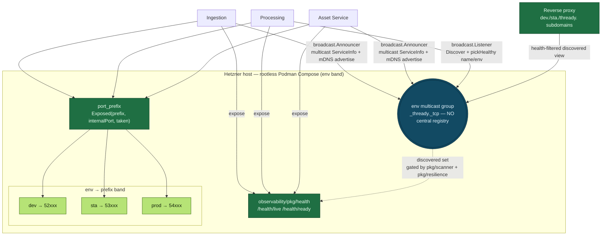

<!--
  Title           : Helix Thready — Service Discovery & Dynamic Ports
  Classification  : PUBLIC
  Location        : docs/public/research/mvp/architecture/service-discovery.md
  Status          : Draft — v0.1
  Revision        : 4 (2026-07-22)
  Author          : Helix Thready documentation swarm (System Architecture)
  Related         : ./system-overview.md, ./component-catalog.md, ./security-model.md
-->

# Helix Thready — Service Discovery & Dynamic Ports

| Rev | Date | Author | Change |
|-----|------|--------|--------|
| 1 | 2026-07-21 | swarm (System Architecture) | Initial draft — discovery, mDNS, port_prefix, health |
| 2 | 2026-07-22 | swarm (Pass 3 depth) | Close DISC-1 — real `discovery/pkg/broadcast` (`Announcer`/`Listener`/`Responder`/`ServiceInfo`) + `pkg/scanner`/`pkg/report`/`pkg/resilience` verified; no central `Registry.Resolve`; deepen discovery diagram explanation |
| 3 | 2026-07-22 | swarm (critic consistency) | Fix residual central-registry model still drawn in the §5 diagram + `discovery.mmd` sibling (now `broadcast.Announcer`/`Listener` multicast, no `register`/`resolve` edges — matches the DISC-1 correction & the prose); rewrite the §10 TDD skeleton off the non-existent `Registry`/`Resolve`/`ErrNoHealthyInstance` API onto `broadcast.Listener`+`pickHealthy` |
| 4 | 2026-07-22 | swarm (docs export) | Fixed inline mermaid syntax so diagram renders |

## Table of Contents

1. [Requirement](#1-requirement)
2. [Three collaborating submodules](#2-three-collaborating-submodules)
3. [Deterministic dynamic ports (`port_prefix`, verified)](#3-deterministic-dynamic-ports-port_prefix-verified)
4. [Registration & resolution (`discovery` + `mdns`)](#4-registration--resolution-discovery--mdns)
5. [Discovery diagram](#5-discovery-diagram)
6. [Health checks](#6-health-checks)
7. [Subdomain routing across three environments](#7-subdomain-routing-across-three-environments)
8. [Config surface](#8-config-surface)
9. [Gap-register coverage](#9-gap-register-coverage)
10. [TDD reproduce-first skeletons](#10-tdd-reproduce-first-skeletons)
11. [Open items](#11-open-items)

---

## 1. Requirement

The system must support **dynamic port assignment with predefined defaults**, **service
discovery** so every micro-service and infrastructure part finds the others consistently, and
**domain/subdomain binding** so publicly exposed services answer on the right host+port
`[research_request_final §14.3, §8.2]` `[request "Services discovery", "Dynamic ports"]`. All
three environments (dev/sta/prod) run as fully separated container stacks on one Hetzner host
under rootless Podman Compose `[CONSTITUTION §11.4.76]`.

## 2. Three collaborating submodules

| Submodule | Role | Provenance |
|-----------|------|------------|
| `port_prefix` | Deterministic, overflow-safe host-port bands per environment | `[IN-HOUSE: port_prefix]` VERIFIED |
| `digital.vasic.discovery` | Service advertise/discover + scan + resilience — `pkg/broadcast` (`Announcer`/`Listener`/`Responder`/`ServiceInfo`), `pkg/scanner`, `pkg/report`, `pkg/resilience`, `pkg/smb` | `[IN-HOUSE: discovery]` VERIFIED (packages re-read at source Pass 3) |
| `digital.vasic.mdns` | mDNS advertise/browse for LAN/in-host resolution | `[IN-HOUSE: mdns]` VERIFIED |

Health is provided by `observability/pkg/health`; TLS per subdomain by `lets_encrypt`.

## 3. Deterministic dynamic ports (`port_prefix`, verified)

`port_prefix` maps each service's internal port onto a **numeric band** so ports are dynamic
but *predictable*, never random. Read at source (README, VERIFIED):

```
API: portprefix.Exposed(prefix, internalPort int, taken map[int]bool) (int, error)

For prefix 52, every exposed port is in 52000–52999 (always starts with "52",
always <= 65535); collisions resolved by linear probe within the band.
  443 -> 52443,  80 -> 52080,  8080 -> 52080(taken)->52081,  3000 -> 52000
```

Thready assigns one **prefix band per environment** so the three stacks never collide on the
host:

| Environment | Prefix band | Example: REST(:8443) → host |
|-------------|-------------|------------------------------|
| Development | `52` (52000–52999) | 52443 |
| Staging | `53` (53000–53999) | 53443 |
| Production | `54` (54000–54999) | 54443 |

```go
// Allocate host ports for a service, deterministically, within the env band.
taken := map[int]bool{}
band := 54 // prod
restHost, _ := portprefix.Exposed(band, 8443, taken); taken[restHost] = true
wsHost,  _  := portprefix.Exposed(band, 8080, taken); taken[wsHost]  = true
// restHost=54443, wsHost=54080 — stable across restarts, no clashes with dev/sta bands.
```

Because the mapping is a pure function of `(prefix, internalPort, taken)`, a service's host
port is reproducible from config alone — the deployment scripts and the reverse proxy compute
the same numbers without a lookup, which is what "predefined defaults + dynamic" means here.

## 4. Registration & resolution (`discovery` + `mdns`)

**DISC-1 correction (source-verified this pass).** There is **no** central
`discovery.NewRegistry/Register/Resolve` API. `digital.vasic.discovery` implements discovery as
**UDP-multicast advertise/discover** in `pkg/broadcast` plus network **scan** in
`pkg/scanner`→`pkg/report`, with `pkg/resilience` tracking per-source availability. The verified
surfaces:

```go
// digital.vasic.discovery/pkg/broadcast — VERIFIED at source (Pass 3)
type ServiceInfo struct { /* name, endpoint, metadata the service advertises */ }
type Config struct { /* multicast addr/port, interval, MessageType … */ }
func DefaultConfig() Config

// Announcer — proactively multicasts this service's presence on an interval.
func NewAnnouncer(info ServiceInfo, cfg Config) *Announcer
func (a *Announcer) Start() error
func (a *Announcer) Stop()
func (a *Announcer) UpdateInfo(info ServiceInfo)

// Listener — discovers peers by collecting multicast announcements.
func NewListener(cfg Config) *Listener
func (l *Listener) Discover(ctx context.Context) ([]ServiceInfo, error)
func (l *Listener) DiscoverOne(ctx context.Context) (*ServiceInfo, error)

// Responder — passively answers discovery queries (unlike the proactive Announcer).
func NewResponder(info ServiceInfo, port int) *Responder
```

```go
// digital.vasic.discovery/pkg/report — VERIFIED at source
type Report struct {
    ScanTime   time.Time
    Duration   time.Duration
    Network    string
    Services   []*scanner.Service
    TotalFound int
}
```

So Thready's model is **advertise + discover**, not register-and-resolve-through-a-registry: on
startup each service constructs a `ServiceInfo` (logical name, host:port from `port_prefix`,
health URL, `env`/`role` metadata) and runs an `Announcer` on the environment's multicast group;
peers run a `Listener` to build a live view and pick a healthy instance by name. mDNS
(`digital.vasic.mdns`, `_thready._tcp`) is the LAN/in-host equivalent for tools that browse.

```go
// Thready service self-advertisement (composition over the verified broadcast API).
info := broadcast.ServiceInfo{ /* Name:"semantic-search", Endpoint: host:restHost,
    Metadata:{"env":"prod","role":"search","health":"/health/ready"} */ }
ann := broadcast.NewAnnouncer(info, broadcast.DefaultConfig()) // env-scoped multicast group
_ = ann.Start(); defer ann.Stop()
mdns.Advertise(ctx, "_thready._tcp", "semantic-search", restHost,
    map[string]string{"env": "prod", "role": "search"})

// Resolve a dependency by name (Processing → Semantic-search):
lis := broadcast.NewListener(broadcast.DefaultConfig())
peers, _ := lis.Discover(ctx)                       // []ServiceInfo advertised this window
svc := pickHealthy(peers, "semantic-search", "prod")// name+env filter over discovered set
client := searchclient.New(svc.Endpoint)
```

The `pickHealthy`/name-filter step (choosing one healthy `ServiceInfo` from the discovered set,
gated on the readiness probe of §6) is the thin Thready-side helper that replaces the imagined
`Resolve`; it is deliberately small because the multicast set is already scoped by the
environment's multicast group and the `env`/`role` metadata.

## 5. Discovery diagram



> Rendered PNG/SVG exported via Docs Chain (§11.4.65). Source: `diagrams/discovery.mmd`.

**Explanation (for readers/models that cannot see the diagram).** The diagram closes a loop that
turns "where is service X?" into a question answerable from config plus a short runtime lookup,
across three co-tenant stacks on one host. It has three moving parts — deterministic ports, a
discovery fabric, and a health gate — and the arrows show how a service becomes reachable.

First, ports. Every service (Ingestion, Processing, Asset Service, …) asks `port_prefix` for its
host port; `port_prefix` maps each internal port into the band for the service's environment — dev
into 52xxx, staging into 53xxx, production into 54xxx — guaranteeing the three stacks never fight
over a host port. Because `Exposed(prefix, internalPort, taken)` is a pure function, the very same
number is recomputable by the deploy scripts and the reverse proxy without any lookup, which is
what "predefined defaults + dynamic" means: the port is *derived*, not *discovered*.

Second, discovery. Each service builds a `broadcast.ServiceInfo` (logical name, the `port_prefix`
host:port, health URL, and `env`/`role` metadata) and runs a `broadcast.Announcer` that multicasts
its presence on the environment's group, and advertises the same over mDNS. A dependent service —
here Processing resolving Semantic-search — runs a `broadcast.Listener`, collects the advertised
`ServiceInfo` set, and filters by logical name + `env` (the `pickHealthy` helper), never a
hard-coded address. This is the corrected mental model from DISC-1: *advertise + discover*, not a
central registry with `Resolve`.

Third, the health gate. Every service exposes `/health/live` and `/health/ready` via
`observability/pkg/health`; `pickHealthy` and the reverse proxy only ever route to an instance
whose readiness probe passes, and `pkg/scanner`→`pkg/report` periodic scans plus
`pkg/resilience`'s `Connected/Disconnected/Reconnecting/Offline` state drive a service out of the
pool when it flaps. The reverse proxy at the host edge uses the discovered, health-filtered view
to route the three public subdomains (`dev.`/`sta.`/`thready.`) to the correct stack. The net
effect: a service's address is derivable from config, discoverable at runtime, and health-gated
before any traffic reaches it — and because ports are stable by construction, a container restart
changes nothing the proxy has to re-learn.

## 6. Health checks

Each container exposes liveness and readiness via `observability/pkg/health`
`[research_request_final §22.10]`:

- `GET /health/live` — process is up (cheap; used by Podman restart policy).
- `GET /health/ready` — dependencies reachable (DB, JetStream, storage); gates the service's
  `broadcast.Announcer` advertisement and reverse-proxy routing. A service that fails `ready` stops
  announcing (and is dropped by `pickHealthy`), so it falls out of the discovered set and the proxy
  pool (failover).

A periodic scan (`discovery/pkg/scanner` → `pkg/report`), with `pkg/resilience` tracking per-source
availability, marks a service unreachable after N failed probes and emits the sticky
`channel.health`/service-health event ([event-model.md](./event-model.md)) so dashboards reflect it
in real time. There is no central registry to deregister from — availability is a property of the
live multicast/announce view plus the readiness gate.

## 7. Subdomain routing across three environments

One host, one reverse proxy, three isolated container stacks `[research_request_final §21.5]`:

```
dev.thready.hxd3v.com  → dev  stack  (band 52xxx)  — Let's Encrypt cert #1
sta.thready.hxd3v.com  → sta  stack  (band 53xxx)  — Let's Encrypt cert #2
thready.hxd3v.com      → prod stack  (band 54xxx)  — Let's Encrypt cert #3
```

Each subdomain has its own `lets_encrypt` certificate (HTTP-01/DNS-01, auto-renew, atomic
deploy-hook + rollback) `[IN-HOUSE: lets_encrypt]`. The proxy resolves the upstream host:port from
the **discovered, health-filtered `broadcast.Listener` view** for that env (not a central registry —
DISC-1), so a container restart (nothing changes — the port is stable by `port_prefix`) or a scale
event is transparent.

## 8. Config surface

Discovery/ports are env-driven (documented in the dedicated env-vars doc):

```yaml
# per-environment (illustrative)
THREADY_ENV: prod
THREADY_PORT_PREFIX: 54          # port_prefix band
THREADY_DISCOVERY_ADDR: 127.0.0.1:5400
THREADY_MDNS_SERVICE: _thready._tcp
THREADY_HEALTH_PATH: /health/ready
THREADY_PUBLIC_DOMAIN: thready.hxd3v.com
```

## 9. Gap-register coverage

No `[GAP: …]` items are owned by discovery/ports directly (the register flags no discovery
gaps). The relevant cross-cutting item is `[GAP: 3.2]` (database partitioning at scale), which
is a data-plane concern handled in [data-flow.md](./data-flow.md), not discovery. The
constitution's decoupling-audit `[CONSTITUTION §11.4.28]` applies: `discovery`, `mdns`,
`port_prefix` are consumed config-injected, never forked.

## 10. TDD reproduce-first skeletons

```go
// RED: port_prefix must be deterministic and collision-free within a band.
func TestPortPrefix_Deterministic(t *testing.T) {
    taken := map[int]bool{}
    a, _ := portprefix.Exposed(54, 8443, taken); taken[a] = true
    b, _ := portprefix.Exposed(54, 8443, map[int]bool{a: true})
    require.Equal(t, 54443, a)
    require.NotEqual(t, a, b) // second caller probes to next free
}

// RED: a service failing readiness must not be picked from the discovered set.
// NOTE (anti-bluff): there is NO discovery.Registry/Resolve/ErrNoHealthyInstance API
// (DISC-1, verified). The real surface is broadcast.Announcer/Listener + the Thready-side
// pickHealthy name/env filter gated on /health/ready — this test exercises exactly that.
func TestDiscovery_UnhealthyNotPicked(t *testing.T) {
    unhealthy := broadcast.ServiceInfo{ /* Name:"semantic-search", Endpoint:…, Metadata:{"env":"prod"} */ }
    lis := stubListener(t, []broadcast.ServiceInfo{unhealthy}) // announced but /health/ready fails
    peers, _ := lis.Discover(ctx)
    _, err := pickHealthy(peers, "semantic-search", "prod")    // readiness-gated selection helper
    require.ErrorIs(t, err, ErrNoHealthyInstance)              // Thready-side sentinel, not discovery's
}

// RED: two envs must not collide on a host port.
func TestBands_NoCrossEnvCollision(t *testing.T) {
    dev, _ := portprefix.Exposed(52, 8443, map[int]bool{})
    prod, _ := portprefix.Exposed(54, 8443, map[int]bool{})
    require.NotEqual(t, dev, prod) // 52443 vs 54443
}
```

## 11. Open items

- `[CLOSED: DISC-1]` (was: exact `discovery.Registry` API). **Source-verified this pass** — there
  is no `Registry`/`Resolve`; the real API is `pkg/broadcast` (`Announcer` with
  `NewAnnouncer`/`Start`/`Stop`/`UpdateInfo`; `Listener` with `Discover`/`DiscoverOne`;
  `Responder`; `ServiceInfo`; `Config`/`DefaultConfig`) over UDP multicast, plus `pkg/scanner`→
  `pkg/report` scan and `pkg/resilience` availability state. §4 now shows the verified surface;
  the only Thready-side glue is the `pickHealthy` name/env filter over the discovered set.
- `[OPEN: DISC-2]` Whether the reverse proxy is Caddy/nginx/Traefik or a `vasic-digital`
  component is a deployment-pack decision; the discovery contract above is proxy-agnostic.
- `[NOTE: DISC-3]` `pkg/broadcast` is UDP-multicast; on the single Hetzner host all three stacks
  share the loopback/host network so multicast discovery works in-host. If a future multi-host
  topology blocks multicast, the `Responder` (unicast query/answer) or the `pkg/scanner` sweep is
  the fallback — both verified present. Tracked with the deployment pack.

---

*Made with love ♥ by Helix Development.*
