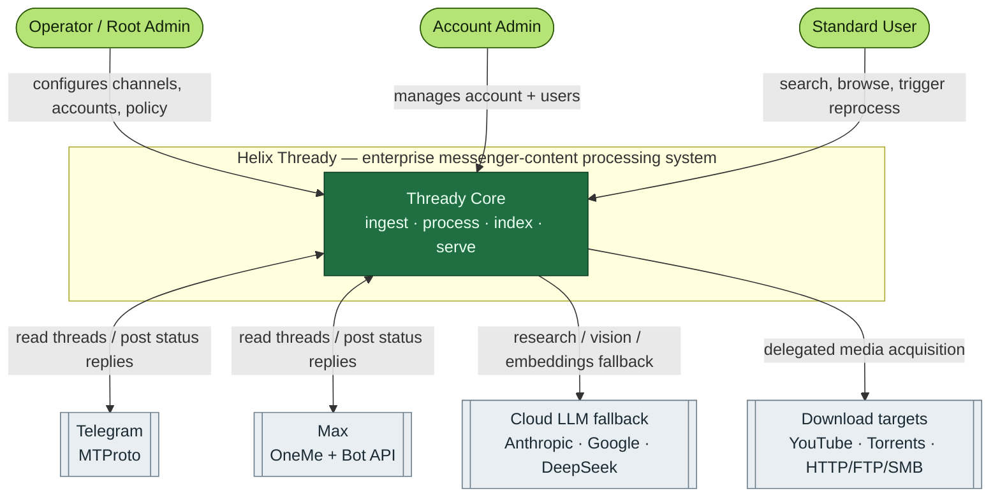
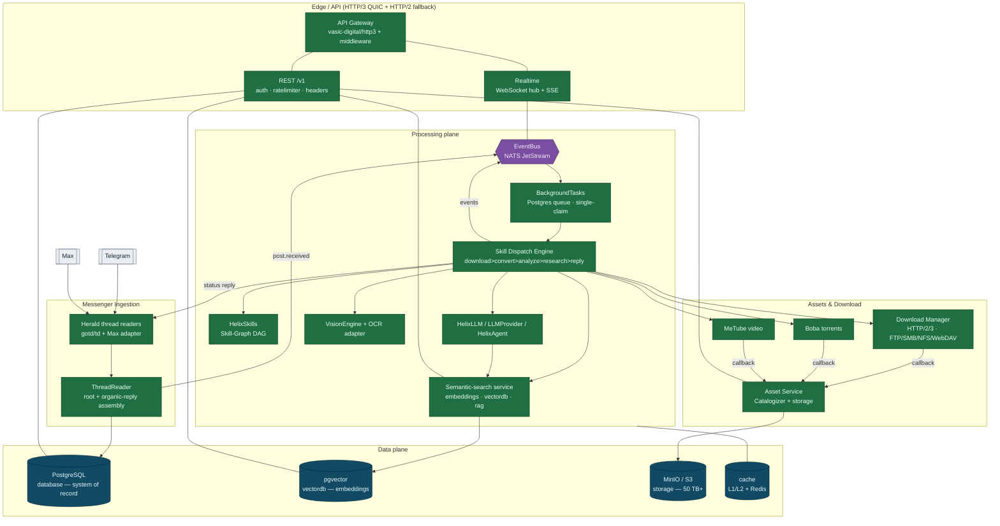

<!--
  Title           : Helix Thready — System Overview (C4 Context & Container)
  Classification  : PUBLIC
  Location        : docs/public/research/mvp/architecture/system-overview.md
  Status          : Draft — v0.1
  Revision        : 1 (2026-07-21)
  Author          : Helix Thready documentation swarm (System Architecture)
  Related         : ./index.md, ./component-catalog.md, ./data-flow.md, ./event-model.md,
                    ./messenger-ingestion.md, ./processing-pipeline.md, ./semantic-search.md,
                    ./asset-and-download.md, ./security-model.md, ./service-discovery.md
-->

# Helix Thready — System Overview (C4 Context & Container)

| Rev | Date | Author | Change |
|-----|------|--------|--------|
| 1 | 2026-07-21 | swarm (System Architecture) | Initial draft — C4 context+container, scale, SLOs, cross-cutting |

## Table of Contents

1. [Purpose & scope](#1-purpose--scope)
2. [What Helix Thready is](#2-what-helix-thready-is)
3. [C4 Level 1 — System context](#3-c4-level-1--system-context)
4. [C4 Level 2 — Container view](#4-c4-level-2--container-view)
5. [Architectural drivers (scale, SLO, tenancy)](#5-architectural-drivers-scale-slo-tenancy)
6. [Cross-cutting concerns](#6-cross-cutting-concerns)
7. [Verified vs assumed](#7-verified-vs-assumed)
8. [Gap-register coverage](#8-gap-register-coverage)
9. [Open items](#9-open-items)

---

## 1. Purpose & scope

This document is the top-level architectural map of **Helix Thready** (`helix_thready`). It
gives the C4 context and container views and states the drivers (scale, SLO, tenancy) that
shape every downstream decision. It never re-decides technology — the canonical decision
matrix lives in `helix_thready_research_request_final.md §0.2` and is treated as read-only.
Detailed subsystem designs are delegated to the sibling files linked in the header.

## 2. What Helix Thready is

Helix Thready connects to messaging platforms — **initially Telegram and Max** — using the
operator's private accounts, reads the **complete thread** (root post + the full chain of
organic replies), persists it to a relational store and a semantic (vector) store, classifies
each post by hashtag + content type, dispatches AI-powered **Skills** (recipes) to process it
(download, convert, analyze, research), posts a **status reply** back to the source post, and
exposes everything through a REST `/v1` API and a real-time event bus. It is event-driven,
idempotent (no double-processing of the same post), multi-tenant (three-tier RBAC), and
white-labelable. `[research_request_final §1.2–1.3]`

The single most load-bearing functional requirement, called out explicitly in the original
request, is **thread assembly**: hashtags are frequently added as a *reply* to a link-only or
text-only root post, so a "post" is never a single message — it is the root plus its organic
reply chain, excluding the system's own status replies. This drives the ingestion design
([messenger-ingestion.md](./messenger-ingestion.md)) and the idempotency model
([concurrency-and-idempotency.md](./concurrency-and-idempotency.md)).

## 3. C4 Level 1 — System context

> Rendered PNG/SVG exported via Docs Chain (§11.4.65). Source: `diagrams/c4-context.mmd`.

**Explanation (for readers/models that cannot see the diagram).** The context diagram places
one box — *Thready Core* — at the center, surrounded by the actors and external systems it
touches. Three human actor roles interact with it, mirroring the three-tier RBAC hierarchy:
the **Operator / Root Admin** (exactly one exists) configures monitored channels, accounts and
global policy; the **Account Admin** manages their own account and its users; the **Standard
User** consumes the system — searching, browsing generated materials, and triggering
reprocessing. On the external-system side there are four boundaries. **Telegram** and **Max**
are bidirectional: Thready reads thread history *from* them (via user-level protocols, not
just bot APIs) and posts *status replies* back to them. The **Cloud LLM fallback** boundary
(Anthropic, Google, DeepSeek via `LLMProvider`) is outbound-only and used solely when the
local HelixLLM stack cannot serve a request. The **Download targets** boundary (YouTube,
torrents, and HTTP/FTP/SMB/NFS/WebDAV sources) is outbound-only and always reached through the
delegated download layer, never by clients directly. Everything a client can see is mediated
by Thready Core; clients never receive direct file URLs or raw messenger tokens.

## 4. C4 Level 2 — Container view

> Rendered PNG/SVG exported via Docs Chain (§11.4.65). Source: `diagrams/c4-container.mmd`.

**Explanation (for readers/models that cannot see the diagram).** The container diagram groups
Thready into five planes. The **Edge / API** plane terminates client traffic over HTTP/3 (QUIC)
with HTTP/2 fallback via `vasic-digital/http3`, applies auth (`digital.vasic.auth`), rate
limiting (`digital.vasic.ratelimiter`) and security headers (`security/pkg/headers`), and
exposes a versioned REST `/v1` surface plus a realtime surface (a WebSocket hub +
Server-Sent-Events for one-way streams). The **Messenger Ingestion** plane is the extended
Herald: platform readers (Telegram via `gotd/td`, Max via a new adapter) feed a shared
**ThreadReader** that assembles the root + organic reply chain and writes raw posts to
PostgreSQL, then emits a `post.received` event. The **Processing plane** is the heart: the
`post.received` event lands on the **EventBus** (NATS JetStream), is claimed exactly once by
the Postgres-backed **BackgroundTasks** queue, and handed to the **Skill Dispatch Engine**,
which orders and runs the matching Skills (from the HelixSkills Skill-Graph) using the LLM
stack, VisionEngine+OCR, the download layer, and the semantic-search service. The **Assets &
Download** plane fetches bytes (Download Manager for direct protocols, Boba for torrents,
MeTube for streaming video) and hands completed artifacts to the **Asset Service** (built on
Catalogizer), which stores them in the MinIO/S3 object tier. The **Data plane** holds the
system of record (PostgreSQL), the co-located embedding index (pgvector), the object store
(MinIO/S3 for the 50 TB+ target), and the L1/L2 cache. Two edges are worth stressing: the
processing plane both *consumes from* and *produces to* the EventBus (closing the event loop,
including the status reply back to Herald), and semantic indexing (`SEM → PGV`) happens for
both original posts and every generated artifact, which is what makes "search by meaning"
work across the whole corpus.

## 5. Architectural drivers (scale, SLO, tenancy)

These operator decisions (`§0.1`) are non-negotiable inputs to every subsystem:

| Driver | Value | Architectural consequence | Provenance |
|--------|-------|---------------------------|------------|
| Scale | Large / multi-tenant: 100+ channels, 10k+ posts/day, 100+ users, 50 TB+ assets | Postgres partitioning + read replicas; JetStream as primary transport; MinIO/S3 object tier; horizontal scaling from day one | `[OPERATOR]` |
| SLO | Aggressive: API p95 < 150 ms, semantic search < 500 ms, page < 1.5 s | Async processing with progress events (never block the API on a Skill); pgvector ANN index tuning; cache tiers | `[OPERATOR]` |
| Tenancy | Three-tier RBAC (Root / Account Admin / User); white-labeling | Every row carries `account_id`; policy enforcement at the API and Asset Service; per-account branding | `[OPERATOR]` `[research_request_final §6]` |
| Retention | Keep indefinitely, per-account overrides | Time-partitioned posts; retention/archive helpers; per-account cleanup policy | `[OPERATOR]` |
| Backup/DR | Daily full + hourly DB incrementals; RPO ≈ 1 h, RTO ≈ 4 h | PITR from incrementals; asset snapshot/dedup; documented restore runbook | `[OPERATOR]` |
| Compliance | Internal/private — minimal | Encryption + secrets hygiene mandatory; GDPR-aware hooks (erasure/export) but no formal certification for MVP | `[OPERATOR]` |

The 10k+ posts/day figure (~0.12 posts/s average, with bursts) is comfortably within a single
Postgres+JetStream deployment; the design constraint is not raw throughput but **latency
isolation** — a research-heavy Skill can run for 30 minutes, so processing must never share a
request thread with the API. This is why processing is fully decoupled behind the EventBus +
BackgroundTasks queue. See [processing-pipeline.md](./processing-pipeline.md).

## 6. Cross-cutting concerns

- **In-house first** `[CONSTITUTION §11.4.28]`. Almost every capability maps to an existing
  owned Go submodule (`digital.vasic.*`, `HelixDevelopment/*`); only six items are genuinely
  new (`[BUILD-NEW]`): Asset Service (decouple Catalogizer), Download Manager, User Service,
  Max adapter, OCR adapter, MeTube completion webhook — plus the thin Event Bus service,
  ThreadReader abstraction, and Semantic-search service that wrap existing engines. The full
  mapping and maturity is in [component-catalog.md](./component-catalog.md).
- **Event-driven & idempotent.** All state changes emit events; the same post is claimed and
  processed exactly once. See [event-model.md](./event-model.md) and
  [concurrency-and-idempotency.md](./concurrency-and-idempotency.md).
- **Security & tenancy.** AES-256-GCM at rest, TLS 1.3 in transit, three-tier RBAC, sensitive
  content sealed but semantically searchable. See [security-model.md](./security-model.md).
- **Discovery & dynamic ports.** `discovery` + `mdns` + `port_prefix` give deterministic
  host-port bands and self-registration. See [service-discovery.md](./service-discovery.md).
- **Observability.** OpenTelemetry + Prometheus + logrus + ClickHouse via
  `digital.vasic.observability`; per-container health checks (`observability/pkg/health`).
- **No server-side CI** `[CONSTITUTION §11.4.156]`. Local git-hooks + pre-tag full-suite retest
  + all-four-upstreams push.

## 7. Verified vs assumed

- **VERIFIED (read at source):** the container-plane engines exist and expose the interfaces
  used here — `EventBus` (`pkg/event`, `pkg/bus`, `pkg/nats` JetStream), `BackgroundTasks`
  (`TaskQueue`/`TaskExecutor`/`TaskRepository` interfaces, Postgres claim), `herald`
  (`pkg/messenger.Messenger` interface), `discovery`/`port_prefix`, `security/pkg/securestorage`.
- **ASSUMPTION / DESIGN:** the *composition* shown here (ThreadReader, Skill Dispatch Engine,
  Semantic-search service, Asset Service, Download Manager) is Thready-new orchestration over
  those engines. Where an engine is a scaffold/stub (HelixLLM default embedder, VisionEngine
  OCR, Herald Max, MeTube webhook, Security-KMP mobile storage), the diagram shows the
  *target* state and the corresponding sibling doc carries the `[GAP: …]` and the plan to
  close it. Nothing here claims a stub "works".

## 8. Gap-register coverage

This overview does not itself close gaps; it routes them. Each `[GAP: …]` from
`helix_thready_subsystem_gaps_and_improvements.md` is addressed in the owning sibling doc:
Herald/Max (§5.1) → messenger-ingestion; HelixLLM embedder + VectorDB + Embeddings (§2.1/3.1/2.7)
→ semantic-search; VisionEngine OCR + helix_skills engine (§2.6/4.1) → processing-pipeline;
Download Manager + Catalogizer + MeTube/Boba (§6.1–6.5) → asset-and-download; auth + Security-KMP
(§7.2/7.3) → security-model; session_orchestrator claim registry (§2.9) →
concurrency-and-idempotency; database partitioning (§3.2) → data-flow & component-catalog.

## 9. Open items

- `[OPEN: OVERVIEW-1]` Exact HTTP/3 gateway topology (single `http3` process fronting all
  services vs per-service listeners) is deferred to the deployment pack; tracked as a workable
  item against `vasic-digital/containers` orchestration.
- `[OPEN: OVERVIEW-2]` Whether the three environments (dev/sta/prod) share one JetStream
  cluster with subject prefixes or run isolated clusters is a deployment decision; the
  architecture supports either (subjects are already namespaced by env in
  [event-model.md](./event-model.md)).

---

*Made with love ♥ by Helix Development.*
