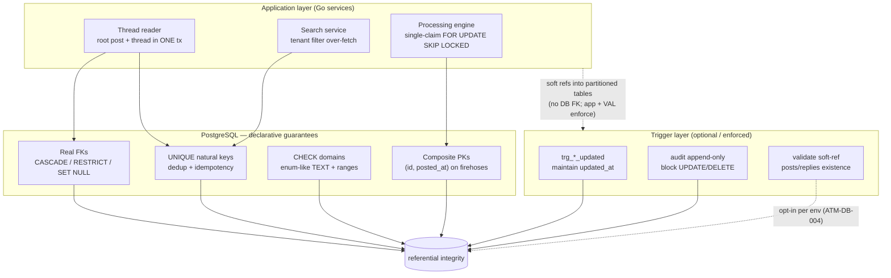

<!--
  Title           : Helix Thready — Constraints & Referential Integrity
  Classification  : PUBLIC
  Location        : docs/public/research/mvp/database/constraints-and-integrity.md
  Status          : Draft — v0.1
  Revision        : 2 (2026-07-22)
  Author          : Helix Thready documentation swarm (database, Pass 3)
  Related         : ./schema-relational.sql ./erd.md ./partitioning.md
                    ./indexing.md ./migration-strategy.md
                    ../architecture/index.md ../api/index.md
-->

# Helix Thready — Constraints & Referential Integrity

| Rev | Date | Author | Change |
|-----|------|--------|--------|
| 1 | 2026-07-22 | swarm (database, Pass 3) | New doc: enforcement-layer model, CHECK-domain catalogue, FK on-delete matrix, append-only audit trigger DDL, and the opt-in soft-ref validation triggers that close `ATM-DB-004` for the safety-critical links |
| 2 | 2026-07-22 | swarm (docs export) | Fixed inline mermaid syntax so diagram renders |

This document consolidates the data-integrity rules that were previously scattered across
[`schema-relational.sql`](./schema-relational.sql), [`erd.md`](./erd.md), and
[`partitioning.md`](./partitioning.md) into one enterprise reference: **what is guaranteed,
where it is guaranteed (declarative DB / application / trigger), and the exact DDL** for the
optional hardening triggers. It closes the design half of the partitioned-FK trade-off
(`ATM-DB-004`) with concrete, runnable trigger definitions.

## Table of Contents

1. [Enforcement-layer model](#1-enforcement-layer-model)
2. [CHECK-domain catalogue (enum-like columns)](#2-check-domain-catalogue-enum-like-columns)
3. [FK on-delete action matrix](#3-fk-on-delete-action-matrix)
4. [Soft references into partitioned tables](#4-soft-references-into-partitioned-tables)
5. [Optional validation triggers (closing ATM-DB-004)](#5-optional-validation-triggers-closing-atm-db-004)
6. [Append-only audit-log enforcement](#6-append-only-audit-log-enforcement)
7. [`updated_at` trigger & single-root guard](#7-updated_at-trigger--single-root-guard)
8. [Verification & open items](#8-verification--open-items)

> Rendered PNG/SVG exported via Docs Chain (§11.4.65). The diagram below has a sibling
> [`diagrams/integrity-layers.mmd`](./diagrams/integrity-layers.mmd) per
> [CONVENTIONS.md §4](../CONVENTIONS.md).

---

## 1. Enforcement-layer model

Source: [`diagrams/integrity-layers.mmd`](./diagrams/integrity-layers.mmd).



**Explanation (for readers/models that cannot see the diagram).** Helix Thready enforces
integrity at three layers, and the diagram shows which guarantee lives where. The top box is
the **application layer**: the thread reader writes a root post and its `threads` envelope in a
single transaction (so the soft `root_post_id` reference is never dangling at commit), the
processing engine claims exactly one post at a time with `SELECT … FOR UPDATE SKIP LOCKED`
(so a `post.received` storm cannot double-process), and the search service applies the tenant
filter itself because — as verified at source — the pgvector adapter's `Search` emits no
`WHERE` clause. These are behaviours the database cannot express declaratively, so they are
owned by code and covered by tests.

The middle box is the **declarative database layer**, which carries everything Postgres can
guarantee without a procedure: real foreign keys (with the CASCADE/RESTRICT/SET NULL choices in
§3), `UNIQUE` natural keys that make ingestion idempotent and dedup content, `CHECK` domains
that constrain the enum-like `TEXT` columns and numeric ranges (§2), and the composite
`(id, posted_at)` primary keys that the RANGE-partitioned firehose tables require. This layer
is always on and needs no application cooperation — a buggy service still cannot insert a post
with a duplicate `(channel_id, external_message_id, posted_at)` or an out-of-domain `status`.

The bottom box is the **trigger layer**. Two triggers are always enforced: `trg_*_updated`
maintains `updated_at`, and (recommended) an append-only rule blocks `UPDATE`/`DELETE` on
`audit_log` so the compliance trail is tamper-evident. A third, **optional** family —
`VAL`, the soft-reference validation triggers of §5 — is the closure for `ATM-DB-004`: because
Postgres forbids a foreign key that points *into* a partitioned table without the partition key,
deployments that want a hard DB guarantee (not just the app guarantee) on the safety-critical
`processing_state → posts` link can install a constraint trigger that checks existence on
insert. The dotted edge marks it opt-in per environment: it trades a little write throughput
for belt-and-braces integrity, and the default is app-enforced.

---

## 2. CHECK-domain catalogue (enum-like columns)

Thready uses **`TEXT` + `CHECK`** instead of `CREATE TYPE` enums so a domain can be widened by
an expand-only `ALTER … DROP/ADD CONSTRAINT` (no `ALTER TYPE` table rewrite — see
[migration-strategy.md §5](./migration-strategy.md#5-expand--contract-zero-downtime)). The
complete catalogue:

| Table.column | Allowed values | Provenance |
|--------------|----------------|------------|
| `accounts.status` | `active, suspended, deleted` | §6.1 |
| `users.status` | `active, invited, disabled, deleted` | §6.3 |
| `roles.tier` | `root, account_admin, user` | §6.1 |
| `memberships.status` | `active, invited, revoked` | §6.1 |
| `messengers.kind` | `telegram, max` | §1.2 |
| `messenger_accounts.auth_state` | `unauthenticated, pending_code, pending_2fa, authenticated, revoked` | §3.1 |
| `messenger_accounts.status` | `active, disabled` | §3.1 |
| `channels.kind` | `channel, group, forum` | §3.1 |
| `post_hashtags.source` / `reply_hashtags.source` | `explicit, indirect, ai_inferred` | §3.5 / §3.2.1 |
| `categories.precedence_class` | `download, convert, analyze, research, reply` | §3.3 |
| `post_categories.confidence` | `0 ≤ confidence ≤ 1` (real range) | §3.2.2 |
| `processing_state.status` | `pending, claimed, running, done, failed, skipped` | §3.3 |
| `skills.kind` | `atomic, composite, umbrella` | helix_skills taxonomy |
| `skill_runs.status` | `pending, running, done, failed, skipped` | §3.3 |
| `generated_artifacts.kind` | `research_doc, book, transcript, summary, other` | §3.2.3 |
| `assets.kind` | `video, audio, image, document, book, comic, other` | §7 |
| `assets.storage_backend` | `minio, s3, local` | §7 / ATM-DB-033 |
| `assets.sensitivity` | `public, internal, sensitive` | §3.6 |
| `asset_links.role` | `source, generated, rendition` | §7.3 |
| `asset_links` (constraint) | exactly one of `{post_id, reply_id, generated_artifact_id}` set | §7.3 |
| `events.scope` | `one_time, sticky` | §3.4 |
| `event_subscriptions.transport` | `ws, sse, webhook` | §13.3 |
| `plans.interval` | `month, year` | Q11 |
| `subscriptions.status` | `trialing, active, past_due, canceled` | Q11 |
| `usage_records.metric` | `posts_processed, assets_bytes, llm_tokens, searches` | Q11 |
| `invoices.status` | `open, paid, void` | Q11 |
| Non-negative ranges | `accounts.default_retention_days ≥ 0`, `channels.retention_days ≥ 0`, `channels.poll_interval_seconds > 0`, `assets.size_bytes ≥ 0`, `plans.price_cents ≥ 0`, `invoices.amount_cents ≥ 0`, `usage_records.quantity ≥ 0` | schema |

Widening example (already shown in migration-strategy.md) — adding a `translate` precedence
class is a pure expand:

```sql
-- +thready Up
ALTER TABLE categories DROP CONSTRAINT categories_precedence_class_check;
ALTER TABLE categories ADD  CONSTRAINT categories_precedence_class_check
  CHECK (precedence_class IN ('download','convert','analyze','research','reply','translate'));
```

---

## 3. FK on-delete action matrix

The choices are commented at each column in [`schema-relational.sql`](./schema-relational.sql)
and summarised here.

| Action | Foreign keys | Why |
|--------|--------------|-----|
| **CASCADE** | `memberships → users/accounts`, `roles → accounts`, `role_permissions → roles/permissions`, `messenger_accounts → accounts`, `channels → accounts/messenger_accounts`, `threads → accounts/channels`, `posts → accounts/channels`, `replies → accounts/threads`, `processing_state → accounts`, `generated_artifacts → accounts`, `assets → accounts`, `asset_links → assets/generated_artifacts`, `subscriptions → accounts`, `usage_records → accounts`, `invoices → accounts`, `event_subscriptions → accounts/users`, all `*_hashtags/*_categories → hashtags/categories` | The child is meaningless without the parent; deleting a tenant must reclaim all its rows (GDPR erasure relies on this — see [retention-archive.md §6](./retention-archive.md#6-gdpr-aware-erasure--export)). |
| **RESTRICT** | `messenger_accounts → messengers`, `memberships → roles`, `skill_runs → skills`, `subscriptions → plans` | Deleting the parent would erase authorisation/audit meaning; deactivate (`is_active=false`) instead of deleting. |
| **SET NULL** | `posts → threads`, `memberships.invited_by → users`, `invoices → subscriptions`, `assets.parent_asset_id → assets` | The reference is advisory; the child must survive parent loss (an invoice is a financial record; a post may be re-threaded). |
| **(no FK)** | soft refs into partitioned `posts`/`replies` (`threads.root_post_id`, `replies.parent_post_id`, `processing_state`, `skill_runs`, `generated_artifacts`, `asset_links`); high-volume soft refs (`events`/`audit_log` → `accounts`/`users`) | Postgres forbids a FK into a partitioned table without the partition key; audit/event rows must outlive a deleted account (§4, [erd.md §9](./erd.md#9-referential-integrity-strategy-partitioned-tables)). |

---

## 4. Soft references into partitioned tables

**VERIFIED constraint (PostgreSQL).** A foreign key's target must include the referenced
table's partition key. The firehose tables `posts`, `replies`, `events`, `audit_log` are
RANGE-partitioned on a timestamp, so their PK is `(id, <time>)`. A child that wants a real FK
would have to carry both `(<child>_id, <child>_posted_at)` **and** cascade over the composite —
heavy on the 10k+/day write path. Thready therefore:

1. Stores a **plain UUID** reference column (e.g. `processing_state.post_id`), plus a
   **denormalised `…_posted_at`** copy of the partition key so joins back to the parent prune
   partitions.
2. Guarantees existence in the **application**: the thread reader writes root post + thread in
   one transaction; the processing engine creates `processing_state` in the same unit of work
   that persists the post.
3. Optionally installs the **validation triggers** below where a hard DB guarantee is wanted.

This is a standard pattern at Large scale; the honest trade-off (throughput vs DB-enforced
integrity) is tracked as `ATM-DB-004`.

---

## 5. Optional validation triggers (closing ATM-DB-004)

Two concrete hardening options, from lightest to strongest. Both are **opt-in per environment**
and default OFF (app-enforced is the baseline).

**Option A — composite FK on the safety-critical link only.** For `processing_state → posts`,
carry the partition key and declare the composite FK (already shown in
[partitioning.md §8](./partitioning.md#8-the-partitioned-fk-trade-off)):

```sql
ALTER TABLE processing_state
  ADD CONSTRAINT fk_processing_post
  FOREIGN KEY (post_id, post_posted_at) REFERENCES posts (id, posted_at)
  ON DELETE CASCADE;
```

This is the strongest guarantee but forces every `processing_state` write to supply
`post_posted_at` and makes cascades heavier on the firehose delete path.

**Option B — constraint trigger that checks existence on insert.** Lighter than a composite FK
(no cascade machinery), it rejects an orphan at insert time while leaving the delete path
cheap. Because the check carries `post_posted_at`, the existence probe prunes to one partition:

```sql
-- Reject a processing_state row whose (post_id, post_posted_at) has no matching post.
CREATE OR REPLACE FUNCTION thready_assert_post_exists() RETURNS trigger
LANGUAGE plpgsql AS $$
BEGIN
  IF NOT EXISTS (
    SELECT 1 FROM posts
    WHERE id = NEW.post_id AND posted_at = NEW.post_posted_at   -- prunes to one partition
  ) THEN
    RAISE foreign_key_violation
      USING MESSAGE = format('processing_state references missing post %s @ %s',
                             NEW.post_id, NEW.post_posted_at);
  END IF;
  RETURN NEW;
END;
$$;

-- CONSTRAINT TRIGGER so it can be deferred within a tx if the post is written slightly later.
CREATE CONSTRAINT TRIGGER trg_processing_post_exists
  AFTER INSERT ON processing_state
  DEFERRABLE INITIALLY DEFERRED
  FOR EACH ROW EXECUTE FUNCTION thready_assert_post_exists();
```

The same pattern generalises to `skill_runs`, `generated_artifacts`, and `asset_links` (probe
`posts`/`replies` by the denormalised partition key). Deployments that value throughput over a
DB-level guarantee simply do not install these — the application transaction is the contract.
`[OPEN: db-partition-fk]` (`ATM-DB-004`) — decide per environment in the deployment pack.

---

## 6. Append-only audit-log enforcement

[`audit_log`](./schema-relational.sql) is a compliance record: no `UPDATE`/`DELETE` in normal
operation ([final request §14.4, Q40](./erd.md#6-domain-d--events-billing--audit)). Enforce it
in depth — role privileges **and** a trigger so even a privileged mistake is blocked:

```sql
-- 1) Least privilege: the app role may only INSERT/SELECT.
REVOKE UPDATE, DELETE, TRUNCATE ON audit_log FROM thready_app;
GRANT  INSERT, SELECT           ON audit_log TO   thready_app;

-- 2) Defence in depth: a trigger that raises on any UPDATE/DELETE, even by the owner.
CREATE OR REPLACE FUNCTION thready_block_audit_mutation() RETURNS trigger
LANGUAGE plpgsql AS $$
BEGIN
  RAISE insufficient_privilege
    USING MESSAGE = 'audit_log is append-only: UPDATE/DELETE is not permitted';
END;
$$;
CREATE TRIGGER trg_audit_append_only
  BEFORE UPDATE OR DELETE ON audit_log
  FOR EACH ROW EXECUTE FUNCTION thready_block_audit_mutation();
```

Age-out of old audit partitions is **not** an `UPDATE`/`DELETE` — it is a partition `DETACH` +
archive ([retention-archive.md §4](./retention-archive.md#4-archive-pipeline-detach--cold--drop)),
which the trigger does not block (it fires on row DML, not DDL). Retention default is 1 year
(Q40, adjustable), independent of content retention.

---

## 7. `updated_at` trigger & single-root guard

Two always-on guarantees already in the schema, restated here for completeness:

```sql
-- Every mutable table has BEFORE UPDATE -> thready_set_updated_at() (sets NEW.updated_at := now()).
-- Applied to: accounts, users, memberships, messenger_accounts, channels, threads,
-- processing_state, skills, generated_artifacts, assets, subscriptions.
CREATE TRIGGER trg_accounts_updated BEFORE UPDATE ON accounts
  FOR EACH ROW EXECUTE FUNCTION thready_set_updated_at();

-- Exactly one Root Admin (final request §6.1 "only one exists"):
CREATE UNIQUE INDEX uq_users_single_root ON users ((is_root)) WHERE is_root;
```

The single-root guard is a **partial UNIQUE index**, not a trigger: indexing `((is_root)) WHERE
is_root` means at most one row can have `is_root = true`, enforced by the index without any
procedural code and with no cost to the common `is_root = false` case.

---

## 8. Verification & open items

| Item | Status |
|------|--------|
| CHECK-domain widening is expand-only | Demonstrated §2; covered by the migration apply/rollback test bank |
| FK on-delete choices (CASCADE for GDPR erasure) | §3; erasure reach tested in [retention-archive.md §6](./retention-archive.md#6-gdpr-aware-erasure--export) |
| `[OPEN: db-partition-fk]` app- vs DB-enforced soft refs | §5 — both hardening options specified with runnable DDL; default app-enforced; tracked `ATM-DB-004` |
| Append-only audit enforced in depth | §6 privileges + trigger; a chaos/security test asserts UPDATE/DELETE is rejected |

**Verification.** A security test asserts the audit trigger rejects UPDATE/DELETE; a
correctness test asserts the Option-B constraint trigger rejects an orphan `processing_state`
insert and accepts a valid one; a migration test asserts each CHECK widening applies and rolls
back cleanly. All run against a real Postgres container per `[CONSTITUTION §11.4.27]`.

---

*Made with love ♥ by Helix Development.*
