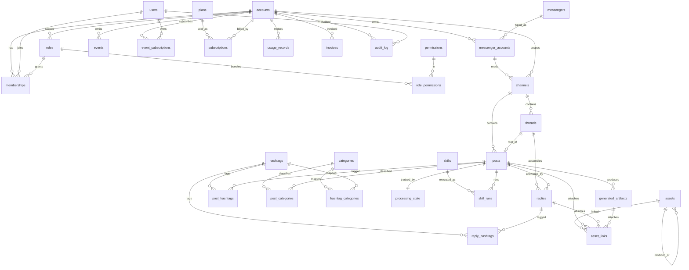
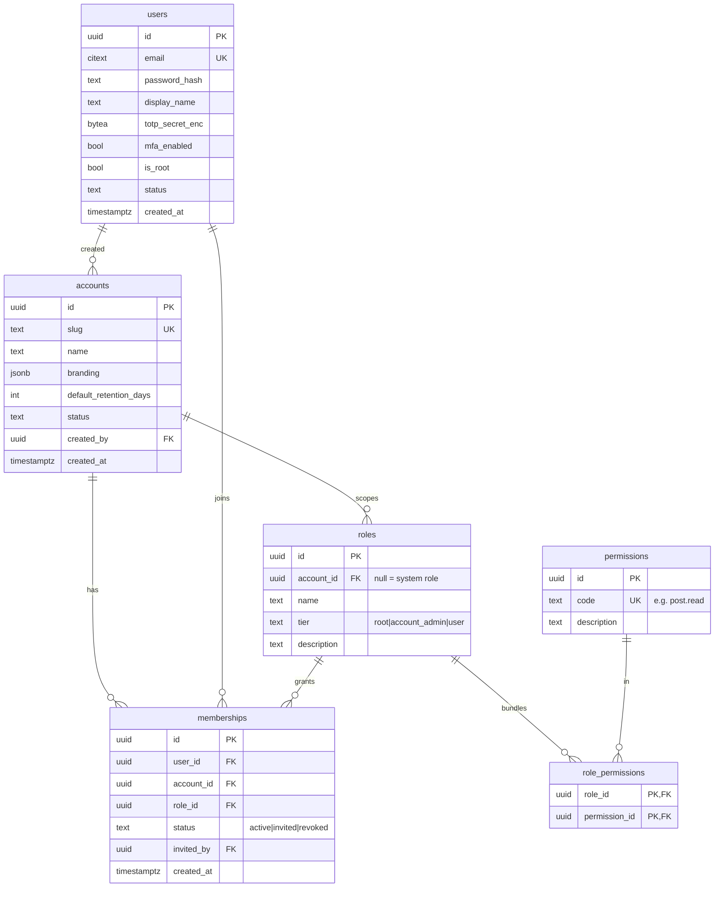
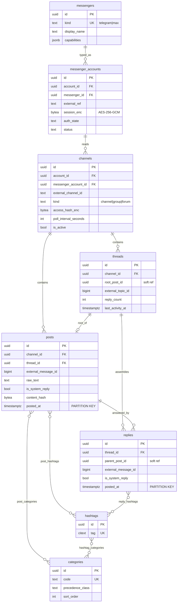
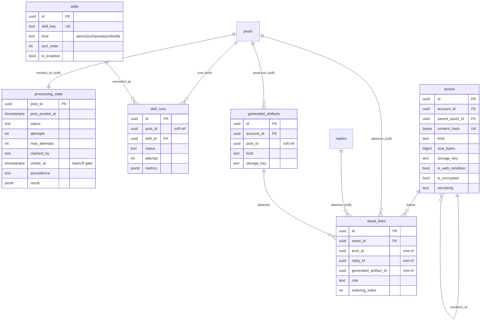
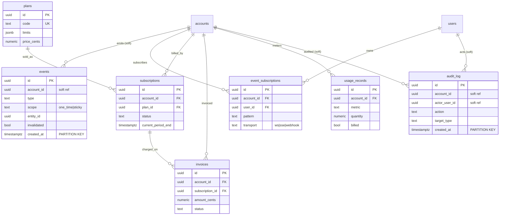
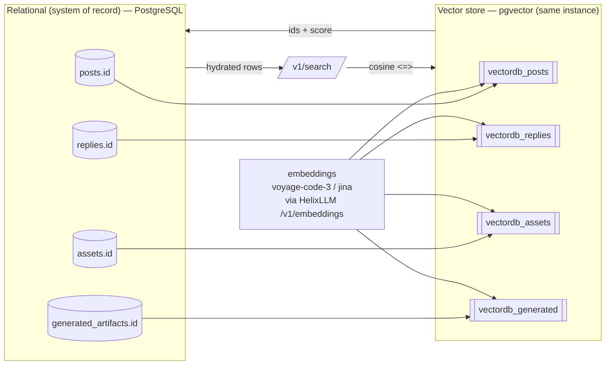

<!--
  Title           : Helix Thready — Entity-Relationship Model (ERD)
  Classification  : PUBLIC
  Location        : docs/public/research/mvp/database/erd.md
  Status          : Draft — v0.1
  Revision        : 1 (2026-07-21)
  Author          : Helix Thready documentation swarm (database)
  Related         : ./index.md ./schema-relational.sql ./schema-vector.sql
                    ./indexing.md ./partitioning.md ./retention-archive.md
                    ./constraints-and-integrity.md ./migration-strategy.md
                    ../architecture/index.md ../api/index.md
-->

# Helix Thready — Entity-Relationship Model (ERD)

| Rev | Date | Author | Change |
|-----|------|--------|--------|
| 1 | 2026-07-21 | swarm (database) | Initial full ERD: overview + 5 domain diagrams + entity dictionary |
| 2 | 2026-07-21 | reviewer (database) | Domain C/D diagrams: drew the soft-ref edges (no orphan `processing_state`/`events`/`audit_log` boxes); labelled soft vs hard FKs consistent with §9 and the `.mmd` siblings |
| 3 | 2026-07-22 | swarm (database, Pass 3) | Cross-linked the new [`constraints-and-integrity.md`](./constraints-and-integrity.md) (FK on-delete matrix, CHECK catalogue, soft-ref validation-trigger DDL) and the shipped `0001`–`0007` migrations from §9 |
| 4 | 2026-07-22 | critic (database, Pass 4) | Diagram↔schema parity: added `is_encrypted` to the Domain-C `assets` box (already in the `.mmd` sibling and referenced by the prose + schema) |

## Table of Contents

1. [Scope & modelling principles](#1-scope--modelling-principles)
2. [Master ERD (overview)](#2-master-erd-overview)
3. [Domain A — Tenancy & Identity](#3-domain-a--tenancy--identity)
4. [Domain B — Messenger & Ingestion](#4-domain-b--messenger--ingestion)
5. [Domain C — Processing, Skills & Assets](#5-domain-c--processing-skills--assets)
6. [Domain D — Events, Billing & Audit](#6-domain-d--events-billing--audit)
7. [Relational ↔ Vector reference model](#7-relational--vector-reference-model)
8. [Entity dictionary](#8-entity-dictionary)
9. [Referential-integrity strategy (partitioned tables)](#9-referential-integrity-strategy-partitioned-tables)
10. [Gaps addressed & open items](#10-gaps-addressed--open-items)

> Rendered PNG/SVG exported via Docs Chain (§11.4.65). Mermaid sources live in
> [`diagrams/`](./diagrams/) as siblings of this document.

---

## 1. Scope & modelling principles

This document is the authoritative entity model for the Helix Thready data layer.
It realises the entity list mandated by the research request — *messengers, accounts,
channels/groups, posts, threads, replies, hashtags, categories, assets, asset_links,
processing_state, skills, users, roles, permissions, memberships, events,
subscriptions, billing/metering, audit_log* — plus the supporting tables the workflow
requires (`generated_artifacts`, `archived_partitions`). The executable DDL is in
[`schema-relational.sql`](./schema-relational.sql) (relational) and
[`schema-vector.sql`](./schema-vector.sql) (pgvector). `[RESEARCH final request §19.12]`

Principles (VERIFIED against the decision matrix, final request §0.2 / §2.1):

- **Single Postgres instance, two logical stores.** The relational store is the
  **system of record**; the pgvector store holds embeddings that *reference* relational
  PKs. Because pgvector co-locates in the same PostgreSQL instance, the datastore count
  stays low. `[IN-HOUSE: database, vectordb]`
- **Multi-tenant by `account_id`.** Every business row is tenant-scoped; `accounts` is
  the tenant boundary. Three-tier RBAC (root / account-admin / user). `[final request §6]`
- **UUID surrogate keys** (`gen_random_uuid`) + natural unique keys for idempotent upserts.
- **TEXT + CHECK enums** (not `CREATE TYPE`) so expand/contract migrations widen a domain
  without a table rewrite (see [migration-strategy.md](./migration-strategy.md)).
- **Time-partitioned firehose tables** (`posts`, `replies`, `events`, `audit_log`) for the
  operator's Large scale (10k+ posts/day) — see [partitioning.md](./partitioning.md).

---

## 2. Master ERD (overview)

Source: [`diagrams/erd-overview.mmd`](./diagrams/erd-overview.mmd).

**Explanation (for readers/models that cannot see the diagram).** The overview shows the
whole Helix Thready schema as a single connected graph rooted at two hubs: `accounts`
(the tenant) and `posts` (the processed unit). On the left, the identity cluster —
`users`, `roles`, `permissions`, `role_permissions`, `memberships` — implements the
three-tier RBAC: a `membership` binds one `user` to one `account` with one `role`, and a
`role` bundles many `permissions`. A user may hold memberships in many accounts, which is
how "belong to multiple Accounts / create your own Account" (final request §6.1) is
represented.

The ingestion cluster flows top-to-bottom: an `account` owns `messenger_accounts` (the
operator's connected Telegram/Max sessions), each of which reads one or more `channels`
(channels, groups, or forums). A `channel` contains `threads` and `posts`; a `thread` is
the envelope of one "complete post" and is the *root_of* exactly one root `post` while it
*assembles* many `replies`. Both `posts` and `replies` carry hashtags (`post_hashtags`,
`reply_hashtags`) because — critically — tags are frequently added as a reply to a
link-only root post (final request §3.2.1). `categories` are the documented content types
(Video, Torrent, Research, Comic, …); a `post` may be classified into many categories
(additive, not exclusive — §3.3), and `hashtag_categories` maps tags to the categories
they imply for indirect determination (§3.5).

The processing cluster hangs off `posts`: each post has exactly one `processing_state` row
(the idempotent single-claim record), zero-or-many `skill_runs` (one per Skill execution),
and zero-or-many `generated_artifacts` (research docs, transcripts, books). The asset
cluster connects media to content: `assets` are content-hash-deduped blobs stored via the
Asset Service; `asset_links` attach an asset to exactly one subject (a post, a reply, or a
generated artifact) and preserve series/playlist ordering; an asset may be a rendition of
another asset (`assets` self-relationship: raw → `…-web`). Finally the operations cluster
— `events` and `event_subscriptions` (real-time), `plans`/`subscriptions`/`usage_records`/
`invoices` (subscription + metered billing), and the append-only `audit_log` — all hang
off `accounts`. The following domain diagrams zoom into each cluster with attributes.

---

## 3. Domain A — Tenancy & Identity

Source: [`diagrams/erd-tenancy.mmd`](./diagrams/erd-tenancy.mmd).

**Explanation (for readers/models that cannot see the diagram).** This domain is the
foundation of the BUILD-NEW **User Service** (final request §4.2.1), built on
`digital.vasic.auth` + `security/pkg/policy`. `accounts` is the tenant: its `slug` is a
case-insensitive unique handle, `branding` (JSONB) carries the white-label colors/logo/
slogan, and `default_retention_days` encodes the operator's retention decision — `NULL`
means keep-indefinitely (the system default set by Root), and a positive integer is a
per-account override that only *shortens* retention.

`users` are global identities (a single email can access many tenants). `password_hash`
holds an Argon2id digest produced by `digital.vasic.security`; `totp_secret_enc` is the
AES-256-GCM-sealed TOTP secret (MFA is mandatory for admin tiers — Q9). Exactly one root
admin may exist — enforced by the partial unique index `uq_users_single_root` — matching
"only one exists" (§6.1). `roles` are either system roles (`account_id IS NULL`, e.g. the
canonical root/account_admin/user tiers) or account-scoped custom roles. `permissions`
are fine-grained capability codes (`post.read`, `billing.view`, …); `role_permissions` is
the many-to-many bundle. `memberships` is the join that grants one user one role within
one account, with an `invited_by` self-reference to `users` for the invitation trail and a
`UNIQUE(user_id, account_id)` guaranteeing a single active membership per tenant. The
`users → accounts "created"` edge records which user bootstrapped an account (the
account-admin who created their own account). RBAC is enforced at the API layer by the
`security/pkg/policy` enforcer reading these tables. `[GAP: auth-7.2 RS256/JWKS]` is a
signing-key concern handled in the API/security docs, not the schema.

---

## 4. Domain B — Messenger & Ingestion

Source: [`diagrams/erd-ingestion.mmd`](./diagrams/erd-ingestion.mmd).

**Explanation (for readers/models that cannot see the diagram).** This domain persists
what the extended Herald thread readers ingest (final request §3.1). `messengers` is a
small registry of platform types — `telegram` (via `gotd/td` MTProto, `[IN-HOUSE: herald]`)
and `max` (the BUILD-NEW OneMe/Bot adapter) — with a `capabilities` JSONB advertising
whether forum topics and reply threads are supported. `messenger_accounts` are the
operator's *connected* accounts per tenant; the sensitive `session_enc` (gotd/td session,
Max session) and `channels.access_hash_enc` are AES-256-GCM-sealed via
`security/pkg/securestorage` and are **never logged** (final request §14.4, §3.6).

`channels` are the channels/groups/forums to read, each with a `poll_interval_seconds`
(the configurable poll cadence) and an optional `retention_days` override. `threads` is
the envelope of a "complete post": it points at its `root_post_id` (a soft reference — see
§9) and carries the forum `external_topic_id` and aggregate `reply_count`. `posts` are the
root messages (the primary processed unit) and `replies` are the organic replies within a
thread; both are RANGE-partitioned on `posted_at` and both carry `is_system_reply`, which
is how the pipeline **skips the system's own status replies** — only organic human posts
and replies are processed (final request §3.2.3).

Classification uses three many-to-many relationships. `post_hashtags` and `reply_hashtags`
attach `hashtags` (stored without the `#`, case-insensitive) to posts and replies; each
link records a `source` (explicit literal tag, `indirect` derivation from a link type per
§3.5, or `ai_inferred` LLM fallback per §3.2.1). `post_categories` attaches content-type
`categories` to a post additively (a post may be Video *and* Research *and* ToDownload
simultaneously — §3.2.2), each with a confidence score. `hashtag_categories` maps a tag to
the categories it implies, driving indirect determination (a `#torrent` tag implies the
Torrent + ToDownload categories). `categories.precedence_class` and `sort_order` encode the
deterministic multi-hashtag precedence (download > convert > analyze > research > reply,
§3.3) that the processing engine uses to order Skill dispatch.

---

## 5. Domain C — Processing, Skills & Assets

Source: [`diagrams/erd-processing-assets.mmd`](./diagrams/erd-processing-assets.mmd).

> The `posts` and `replies` nodes are shown for context only — they are owned by
> [Domain B](#4-domain-b--messenger--ingestion). Every edge marked **(soft)** is a
> *logical* reference into a RANGE-partitioned table and therefore carries **no DB-level
> foreign key**; integrity is enforced in the application plus a denormalised `…_posted_at`
> partition-key copy on each child, exactly as specified in
> [§9](#9-referential-integrity-strategy-partitioned-tables). The sibling
> [`diagrams/erd-processing-assets.mmd`](./diagrams/erd-processing-assets.mmd) uses the same
> soft-reference notation.

**Explanation (for readers/models that cannot see the diagram).** `processing_state` is
the safety-critical table: one row per post (PK `post_id`), holding the `status`, retry
`attempts`/`max_attempts`, the `claimed_by` worker id, and the `visible_at` back-off gate.
The processing engine (`digital.vasic.background`, a Postgres task queue) claims work with
`SELECT … FOR UPDATE SKIP LOCKED` on `(status='pending' AND visible_at <= now())`,
guaranteeing **exactly-once** processing even under a `post.received` event storm (final
request §3.3). `precedence` records the resolved highest precedence class so ordering is
observable.

`skills` is the relational mirror of the `helix_skills` Skill-Graph nodes that Thready
dispatches — `kind` is atomic/composite/umbrella and `sort_order` implements
"download-type Skills before analysis-type Skills" (§3.3). Note the register gap
`[GAP: helix_skills-4.1]`: helix_skills is a *knowledge* DAG with **no execution engine**;
Thready's dispatch engine is BUILD-NEW and `skill_runs` is its execution ledger — one row
per `(post, skill)` attempt with timing and `metrics`. `generated_artifacts` captures the
research docs / transcripts / books a Skill produces, which are then embedded into
`vectordb_generated` for semantic search over generated materials.

The asset cluster realises §7. `assets` are content-hash-deduped blobs (`UNIQUE(account_id,
content_hash)`) stored via the Asset Service (Catalogizer + `digital.vasic.storage`
MinIO/S3); `parent_asset_id` links a `…-web` rendition back to its raw original, and
`sensitivity` + `is_encrypted` flag the specially-encrypted asset directory for credit
cards / contracts / QR / screenshots (§3.6). `asset_links` attaches an asset to exactly
one subject — a `post`, a `reply`, or a `generated_artifact` — enforced by the
`asset_links_one_subject` CHECK; `ordering_index` preserves the numeric-prefix ordering for
series and playlists (§7.3). Client links resolve through the Asset Service and are never
raw file paths (§7.1).

---

## 6. Domain D — Events, Billing & Audit

Source: [`diagrams/erd-billing-audit.mmd`](./diagrams/erd-billing-audit.mmd).

> The `events` and `audit_log` account/actor columns are **(soft)** references: both tables
> are high-volume and RANGE-partitioned, so they hold a plain `uuid` (no cascading DB FK) —
> an audit row must survive even if the referenced account is later deleted. `event_subscriptions`,
> `subscriptions`, `usage_records` and `invoices` are bounded per tenant and keep real DB
> foreign keys. This matches the sibling
> [`diagrams/erd-billing-audit.mmd`](./diagrams/erd-billing-audit.mmd) and
> [§9](#9-referential-integrity-strategy-partitioned-tables).

**Explanation (for readers/models that cannot see the diagram).** `events` is the durable
catalog/replay log for the real-time system (final request §3.4). The live transport is
`digital.vasic.eventbus` over NATS JetStream; this table is the queryable audit/replay
mirror. `scope` distinguishes `one_time` events (fire-and-consume) from `sticky` events
(last-value retained per `entity_id`, with `invalidated` flipping on state change or TTL).
It is RANGE-partitioned on `created_at` because it is a firehose. `event_subscriptions`
holds client-facing subscription registrations (WebSocket, SSE, or outbound webhook),
scoped to an account and optionally a user, with a `pattern` subject filter.

Billing realises the operator's **subscription + metered** decision (Q11). `plans` are the
sellable tiers with a JSONB `limits` object (e.g. `{channels:100, posts_per_day:10000}`)
matching the Large-scale ceilings. `subscriptions` binds an account to a plan with a
billing period and status lifecycle (trialing → active → past_due → canceled).
`usage_records` are metered windows per metric (`posts_processed`, `assets_bytes`,
`llm_tokens`, `searches`) with a `UNIQUE(account_id, metric, window_start)` guaranteeing
idempotent metering, and a `billed` flag for reconciliation. `invoices` roll a period's
plan fee + metered usage into a charge. `audit_log` is append-only (no UPDATE/DELETE in
normal operation — enforced by role privileges and documented in
[retention-archive.md](./retention-archive.md)); it records every admin/user action with
actor, target, IP and metadata, RANGE-partitioned on `created_at` with a default 1-year
retention (Q40).

---

## 7. Relational ↔ Vector reference model

Source: [`diagrams/vector-reference.mmd`](./diagrams/vector-reference.mmd).

**Explanation (for readers/models that cannot see the diagram).** This resolves the
progress-doc inconsistency #1 (final request §2.1.1). The relational tables on the left —
`posts.id`, `replies.id`, `assets.id`, `generated_artifacts.id` — are the **system of
record**. Nothing in the vector store is authoritative; the four `vectordb_*` collections on
the right hold only embeddings that *point back* at those relational rows. This one-directional
"vectors reference rows, never the reverse" rule is what keeps the two stores consistent under
deletes and re-embeds.

For each embeddable row — a post, a reply, an asset's extracted text (OCR/caption/transcript),
or a generated artifact — `digital.vasic.embeddings` computes a float32 vector via HelixLLM's
`/v1/embeddings` (`voyage-code-3` at 1024 dims or `jina-embeddings-v2-base-code` at 768 dims)
and upserts it into the matching collection. Each vector row's `id` is the relational UUID
(optionally suffixed `:chunk` for chunked documents), and its `metadata` JSONB always carries
`source_id`, `kind`, and `account_id` so the row can be traced home and scoped to a tenant.
The `EMB` node in the diagram fans out to all four collections precisely because the same
embedding pipeline feeds source content *and* generated materials — the "both posts and
generated materials are indexed" requirement (final request §1.3, §19.1).

A `/v1/search` query (the `Q` node) embeds the query text, runs a cosine (`<=>`)
nearest-neighbour scan against the ANN index, gets back `(id, score)` pairs, and the API
hydrates the full rows from the relational store — the `VEC → REL → Q` return path in the
diagram. Because pgvector lives in the same PostgreSQL instance, no cross-datastore join is
needed and there is no second database to keep in sync. The executable DDL, ANN indexes, the
verified caveat that the adapter's `Search` applies no tenant filter, and the anti-bluff note
about HelixLLM's default non-semantic `HashEmbedder` are all in
[`schema-vector.sql`](./schema-vector.sql). `[GAP: vectordb-3.1]` `[GAP: HelixLLM-1]`

---

## 8. Entity dictionary

| Entity | Table | Partitioned | Purpose | Key relationships | Provenance |
|--------|-------|-------------|---------|-------------------|------------|
| Account (tenant) | `accounts` | no | Tenant boundary; branding; retention default | ← memberships, channels, subscriptions, … | §6.1 `[OPERATOR]` |
| User | `users` | no | Global identity; Argon2id; TOTP; single root | → memberships, audit_log | §6.3 `[IN-HOUSE: auth]` |
| Role | `roles` | no | System or account-scoped role (3 tiers) | → role_permissions, memberships | §6.1 |
| Permission | `permissions` | no | Fine-grained capability code | → role_permissions | §6.3 |
| Role↔Permission | `role_permissions` | no | RBAC bundle (M:N) | roles×permissions | §6.3 |
| Membership | `memberships` | no | user↔account↔role grant | accounts,users,roles | §6.1 |
| Messenger | `messengers` | no | Platform registry (telegram/max) | → messenger_accounts | §1.2 `[IN-HOUSE: herald]` |
| Messenger account | `messenger_accounts` | no | Connected session (sealed) | → channels | §3.1 |
| Channel/Group | `channels` | no | Source channel/group/forum | → threads, posts | §3.1 |
| Thread | `threads` | no | "Complete post" envelope | root_of posts, has replies | §1.2 §3.2.1 |
| Post | `posts` | **yes** (posted_at) | Root message; processed unit | ← replies, processing_state, … | §3.2 |
| Reply | `replies` | **yes** (posted_at) | Organic reply; may carry tags | → hashtags | §3.2.1 |
| Hashtag | `hashtags` | no | Normalised tag | ↔ posts/replies/categories | §3.2.1 |
| Category (content type) | `categories` | no | Video/Torrent/Research/… + precedence | ↔ posts, hashtags | §3.2.2 |
| Post↔Hashtag | `post_hashtags` | no | Tagging (explicit/indirect/ai) | posts×hashtags | §3.5 |
| Reply↔Hashtag | `reply_hashtags` | no | Reply tagging | replies×hashtags | §3.2.1 |
| Post↔Category | `post_categories` | no | Additive classification | posts×categories | §3.3 |
| Hashtag↔Category | `hashtag_categories` | no | Indirect determination map | hashtags×categories | §3.5 |
| Processing state | `processing_state` | no | Idempotent single-claim + retry | 1:1 posts | §3.3 `[IN-HOUSE: background]` |
| Skill | `skills` | no | Dispatchable Skill-Graph node mirror | → skill_runs | §3.2.2 `[IN-HOUSE: helix_skills]` |
| Skill run | `skill_runs` | no | Per-(post,skill) execution ledger | skills, posts | §3.3 |
| Generated artifact | `generated_artifacts` | no | Research doc/book/transcript/summary | → asset_links, vectordb_generated | §3.2.3 |
| Asset | `assets` | no | Deduped blob; raw + `…-web` renditions | → asset_links; self (renditions) | §7 `[IN-HOUSE: Catalogizer, storage]` |
| Asset link | `asset_links` | no | Attach asset to one subject; ordering | assets, posts/replies/artifacts | §7.3 |
| Event | `events` | **yes** (created_at) | Durable event catalog; sticky/one-time | account | §3.4 `[IN-HOUSE: eventbus]` |
| Event subscription | `event_subscriptions` | no | Client subscription (ws/sse/webhook) | accounts, users | §13.3 |
| Plan | `plans` | no | Sellable subscription tier + limits | → subscriptions | Q11 |
| Subscription | `subscriptions` | no | Account↔plan billing binding | plans, accounts, invoices | Q11 `[OPERATOR]` |
| Usage record | `usage_records` | no | Metered usage window (idempotent) | accounts | Q11 |
| Invoice | `invoices` | no | Period charge (plan + usage) | accounts, subscriptions | Q11 |
| Audit log | `audit_log` | **yes** (created_at) | Append-only action trail | accounts, users | §14.4 Q40 |
| Archive catalog | `archived_partitions` | no | Detached/cold partition bookkeeping | — | retention-archive.md |
| Vector: posts | `vectordb_posts` | no | Embeddings of posts (cosine) | → posts.id via metadata | Q1 `[IN-HOUSE: vectordb]` |
| Vector: replies | `vectordb_replies` | no | Embeddings of replies | → replies.id | Q1 |
| Vector: assets | `vectordb_assets` | no | Embeddings of extracted asset text | → assets.id | §19.1 |
| Vector: generated | `vectordb_generated` | no | Embeddings of generated materials | → generated_artifacts.id | §1.3 |

---

## 9. Referential-integrity strategy (partitioned tables)

**VERIFIED constraint.** PostgreSQL requires that a foreign key's target include the
table's partition key. The firehose tables `posts`, `replies`, `events`, `audit_log` are
RANGE-partitioned on a timestamp, so their primary key is `(id, <time>)`. Consequently:

- **Outgoing FKs from partitioned tables are fine** (Postgres 12+). `posts` and `replies`
  keep real FKs to `accounts`, `channels`, and `threads`.
- **Incoming FKs into partitioned tables are deliberately omitted.** Tables that reference
  a post/reply (`threads.root_post_id`, `replies.parent_post_id`, `processing_state`,
  `skill_runs`, `generated_artifacts`, `asset_links`) hold a plain UUID column plus a
  denormalised `…_posted_at` copy of the partition key (used to prune partitions in joins).
  Integrity is enforced by (a) the processing engine's transactional single-claim, (b) the
  reader writing root post + thread in one transaction, and (c) optional validation
  triggers where a hard guarantee is required.

This is the standard, defensible pattern at the operator's Large scale; it keeps the hot
write path cheap and avoids the composite-key propagation that native partition FKs would
force onto every child table. The alternative (carry `(post_id, post_posted_at)` composite
FKs referencing `posts(id, posted_at)`) is documented as an option in
[partitioning.md](./partitioning.md) for deployments that prefer DB-enforced integrity over
write throughput. `[OPEN: db-partition-fk]` — decide per environment; tracked as ATM item
`ATM-DB-004`.

Both hardening options — the composite FK **and** a lighter deferred `CONSTRAINT TRIGGER`
that checks existence on insert (pruning to one partition via the denormalised
`post_posted_at`) — are specified with runnable DDL in
[`constraints-and-integrity.md §5`](./constraints-and-integrity.md#5-optional-validation-triggers-closing-atm-db-004),
alongside the full CHECK-domain catalogue and the FK on-delete action matrix. The executable
schema is delivered as the seven reviewable migrations
[`0001`–`0007`](./migration-strategy.md#9-migration-roadmap-00010007).

---

## 10. Gaps addressed & open items

| Gap-register item | Where addressed |
|-------------------|-----------------|
| `[GAP: vectordb-3.1]` pgvector-only; Qdrant unverified; ANN tuning | §7, [schema-vector.sql](./schema-vector.sql), [indexing.md](./indexing.md) |
| `[GAP: database-3.2]` no partitioning/retention helpers | §4/§5 partition parents, [partitioning.md](./partitioning.md), [retention-archive.md](./retention-archive.md) |
| `[GAP: HelixLLM-1]` default HashEmbedder is non-semantic | §7 note, [schema-vector.sql](./schema-vector.sql) dimension policy |
| `[GAP: helix_skills-4.1]` no execution engine | §5 `skill_runs` ledger + BUILD-NEW dispatch engine |
| `[GAP: auth-7.2]` HMAC→RS256/EdDSA + RBAC | §3 tables back the User Service (signing handled in API/security area) |

Open items: `[OPEN: db-partition-fk]` (§9), `[OPEN: vector-tenant-isolation]`
([schema-vector.sql](./schema-vector.sql)). Both are tracked as workable items in
[index.md](./index.md#open-items).

---

*Made with love ♥ by Helix Development.*
