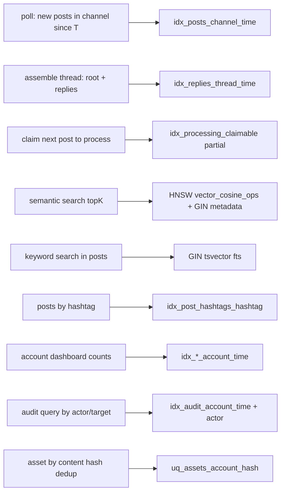

<!--
  Title           : Helix Thready — Indexing Strategy
  Classification  : PUBLIC
  Location        : docs/public/research/mvp/database/indexing.md
  Status          : Draft — v0.1
  Revision        : 1 (2026-07-21)
  Author          : Helix Thready documentation swarm (database)
  Related         : ./schema-relational.sql ./schema-vector.sql ./erd.md
                    ./partitioning.md ./migration-strategy.md
-->

# Helix Thready — Indexing Strategy

| Rev | Date | Author | Change |
|-----|------|--------|--------|
| 1 | 2026-07-21 | swarm (database) | Initial index catalogue: btree/GIN/trigram/FTS/partial/ANN + SLO tuning |

## Table of Contents

1. [Objectives & SLO budget](#1-objectives--slo-budget)
2. [Query-path → index map](#2-query-path--index-map)
3. [Relational index catalogue](#3-relational-index-catalogue)
4. [Full-text search (FTS)](#4-full-text-search-fts)
5. [Vector ANN indexes (pgvector)](#5-vector-ann-indexes-pgvector)
6. [The hot claim index (idempotent processing)](#6-the-hot-claim-index-idempotent-processing)
7. [Index maintenance on partitioned tables](#7-index-maintenance-on-partitioned-tables)
8. [Verification & TDD](#8-verification--tdd)
9. [Gaps & open items](#9-gaps--open-items)

---

## 1. Objectives & SLO budget

The operator chose the **Aggressive** performance tier (final request Q14): API p95
< 150 ms, semantic search < 500 ms, page < 1.5 s. Indexing must make the read paths that
back those SLOs index-only or index-scan, never sequential-scan, at the Large scale
(100+ channels, 10k+ posts/day, 100+ users, 50 TB+ assets — Q2). Every index below is
justified by a concrete query path; we do **not** add speculative indexes (each index taxes
the hot write path — 10k+ inserts/day plus replies).

Design rules:

- **Partition-prune first.** All firehose reads (`posts`, `replies`, `events`,
  `audit_log`) carry the time predicate so the planner prunes to a few partitions before
  any index scan. Children denormalise `…_posted_at` for this reason (see
  [erd.md §9](./erd.md#9-referential-integrity-strategy-partitioned-tables)).
- **Tenant-scope every business query** with `account_id` as the leading (or included)
  index column.
- **Partial indexes** for skewed predicates (claimable rows, active channels).
- **GIN** for JSONB containment and array/tsvector membership; **trigram** for fuzzy text;
  **HNSW** for vector ANN.
- Structural PK/UNIQUE indexes live in [`schema-relational.sql`](./schema-relational.sql);
  the secondary indexes below are applied by migration `0007_secondary_indexes` using
  `CREATE INDEX CONCURRENTLY` (see [migration-strategy.md](./migration-strategy.md)).

---

## 2. Query-path → index map

Source: [`diagrams/indexing-query-paths.mmd`](./diagrams/indexing-query-paths.mmd).



**Explanation (for readers/models that cannot see the diagram).** The diagram maps the nine
dominant query paths to the index that serves them. `Q1` — the messenger poller asking "what
posts arrived in this channel since timestamp T" — is served by a composite btree on
`(channel_id, posted_at)` after partition pruning. `Q2` — assembling a complete post
(root + organic reply chain) — is served by `(thread_id, posted_at)` on `replies`. `Q3` —
the processing engine claiming the next unit — is served by the **partial** index on
`processing_state(visible_at) WHERE status='pending'`, which stays tiny because only
unclaimed rows are indexed. `Q4` — semantic search — combines the HNSW ANN index on the
embedding with a GIN index on `metadata` for the tenant filter. `Q5` — keyword/full-text
search — uses a GIN index over a generated `tsvector`. `Q6` — "all posts tagged #x" — uses
the reverse index on `post_hashtags(hashtag_id)`. `Q7` — account dashboards — use
`(account_id, <time>)` composites. `Q8` — audit queries — use `(account_id, created_at)`
plus an actor index. `Q9` — asset dedup — uses the `UNIQUE(account_id, content_hash)`
already declared on `assets`. The remaining sections give the exact DDL.

---

## 3. Relational index catalogue

> Applied by `0007_secondary_indexes` with `CONCURRENTLY` (non-blocking on live tables).
> On a RANGE-partitioned parent, `CREATE INDEX` (without `CONCURRENTLY`) cascades to all
> partitions but takes `ACCESS EXCLUSIVE` briefly per partition; use the per-partition
> `CONCURRENTLY` + `ATTACH` recipe in §7 for zero-downtime on large existing partitions.

```sql
-- ---- Ingestion read paths --------------------------------------------------
-- Q1 poll: newest posts per channel (partition-pruned by posted_at)
CREATE INDEX CONCURRENTLY idx_posts_channel_time
  ON posts (channel_id, posted_at DESC);

-- Account-scoped dashboards / exports
CREATE INDEX CONCURRENTLY idx_posts_account_time
  ON posts (account_id, posted_at DESC);

-- Q2 thread assembly: replies of a thread in order
CREATE INDEX CONCURRENTLY idx_replies_thread_time
  ON replies (thread_id, posted_at ASC);

-- reply -> parent post lookups (soft ref)
CREATE INDEX CONCURRENTLY idx_replies_parent
  ON replies (parent_post_id);

-- threads by channel + recency
CREATE INDEX CONCURRENTLY idx_threads_channel_activity
  ON threads (channel_id, last_activity_at DESC);

-- active channels due for polling (partial: only active)
CREATE INDEX CONCURRENTLY idx_channels_due_poll
  ON channels (last_polled_at)
  WHERE is_active;

-- ---- Classification --------------------------------------------------------
-- Q6 posts by hashtag (reverse), and tags of a post (forward via PK)
CREATE INDEX CONCURRENTLY idx_post_hashtags_hashtag
  ON post_hashtags (hashtag_id);
CREATE INDEX CONCURRENTLY idx_reply_hashtags_hashtag
  ON reply_hashtags (hashtag_id);
-- posts of a category
CREATE INDEX CONCURRENTLY idx_post_categories_category
  ON post_categories (category_id);

-- ---- Processing ------------------------------------------------------------
-- Q3 claim index is created in 0001 (see §6). Observability: failed/stuck rows.
CREATE INDEX CONCURRENTLY idx_processing_status
  ON processing_state (status, updated_at);
CREATE INDEX CONCURRENTLY idx_skill_runs_post
  ON skill_runs (post_id, skill_id);

-- ---- Assets ----------------------------------------------------------------
-- renditions of a raw asset
CREATE INDEX CONCURRENTLY idx_assets_parent
  ON assets (parent_asset_id) WHERE parent_asset_id IS NOT NULL;
-- links of a subject (three partial indexes keep each small)
CREATE INDEX CONCURRENTLY idx_asset_links_post
  ON asset_links (post_id) WHERE post_id IS NOT NULL;
CREATE INDEX CONCURRENTLY idx_asset_links_reply
  ON asset_links (reply_id) WHERE reply_id IS NOT NULL;
CREATE INDEX CONCURRENTLY idx_asset_links_artifact
  ON asset_links (generated_artifact_id) WHERE generated_artifact_id IS NOT NULL;
CREATE INDEX CONCURRENTLY idx_asset_links_asset
  ON asset_links (asset_id);

-- ---- Identity / RBAC hot paths --------------------------------------------
CREATE INDEX CONCURRENTLY idx_memberships_account
  ON memberships (account_id) WHERE status = 'active';
CREATE INDEX CONCURRENTLY idx_memberships_user
  ON memberships (user_id) WHERE status = 'active';

-- ---- Billing / metering ----------------------------------------------------
CREATE INDEX CONCURRENTLY idx_usage_account_metric
  ON usage_records (account_id, metric, window_start DESC);
CREATE INDEX CONCURRENTLY idx_usage_unbilled
  ON usage_records (account_id) WHERE NOT billed;
CREATE INDEX CONCURRENTLY idx_subscriptions_account
  ON subscriptions (account_id, status);

-- ---- Events / audit --------------------------------------------------------
CREATE INDEX CONCURRENTLY idx_events_account_time
  ON events (account_id, created_at DESC);
-- sticky last-value lookups
CREATE INDEX CONCURRENTLY idx_events_sticky
  ON events (entity_id, created_at DESC) WHERE scope = 'sticky' AND NOT invalidated;
CREATE INDEX CONCURRENTLY idx_audit_account_time
  ON audit_log (account_id, created_at DESC);
CREATE INDEX CONCURRENTLY idx_audit_actor
  ON audit_log (actor_user_id, created_at DESC);
```

---

## 4. Full-text search (FTS)

Semantic search is the primary discovery path, but keyword FTS complements it for exact
terms, code identifiers, and filtering. We add a **generated** `tsvector` column and a GIN
index; `pg_trgm` supports fuzzy/`ILIKE` on short fields (titles, hashtags).

```sql
-- posts: generated tsvector over the message body (English config; per-lang variants TBD)
ALTER TABLE posts
  ADD COLUMN IF NOT EXISTS body_fts tsvector
  GENERATED ALWAYS AS (to_tsvector('english', coalesce(raw_text, ''))) STORED;
CREATE INDEX CONCURRENTLY idx_posts_fts ON posts USING gin (body_fts);

-- fuzzy title/tag search (trigram)
CREATE INDEX CONCURRENTLY idx_hashtags_trgm ON hashtags USING gin (tag gin_trgm_ops);
CREATE INDEX CONCURRENTLY idx_threads_title_trgm ON threads USING gin (title gin_trgm_ops);
```

> `[OPEN: fts-multilang]` The generated column pins the `english` text-search config.
> Post content is stored in its original language (en/ru/sr-Cyrl — §12). A per-language FTS
> strategy (a `lang`-driven expression index or `simple` config + language-aware ranking)
> is tracked as `ATM-DB-011`. Semantic search (which is language-robust via the embedding
> model) is the primary path meanwhile.

---

## 5. Vector ANN indexes (pgvector)

**Anti-bluff (VERIFIED):** `digital.vasic.vectordb`'s pgvector `Client.CreateCollection`
creates the collection *table only* — it does **not** create an ANN index (source:
`pkg/pgvector/client.go`). Without an index every `Search` is a sequential scan and the
< 500 ms SLO is impossible at scale. The ANN indexes are therefore **owned by our
migrations**, not the adapter. `[GAP: vectordb-3.1]`

```sql
-- HNSW (preferred): cosine op class MUST match the query operator <=>
CREATE INDEX CONCURRENTLY idx_vec_posts_hnsw
  ON vectordb_posts USING hnsw (embedding vector_cosine_ops)
  WITH (m = 16, ef_construction = 64);
-- (repeat for vectordb_replies / _assets / _generated — see schema-vector.sql)
```

Tuning to hit `< 500 ms`:

| Knob | Meaning | Start | Raise when |
|------|---------|-------|-----------|
| `m` | HNSW graph degree (build) | 16 | recall too low on high-dim (1024) data |
| `ef_construction` | build-time candidate list | 64 | recall too low (costs build time/memory) |
| `hnsw.ef_search` (session) | query candidate list | 40 | recall too low; **higher = slower** |
| topK over-fetch | fetch `topK*4`, then metadata-filter | ×4 | tenant filter under-fills topK |
| `maintenance_work_mem` | index build memory | 2 GB | large collections build slowly |

Operational guidance:

- Set `SET hnsw.ef_search = 40;` per search session; expose it as a config so the search
  service can trade latency for recall under the 500 ms budget.
- Build HNSW indexes **after** bulk backfill (faster) but keep them present during
  incremental writes (HNSW tolerates inserts; no retrain needed, unlike IVFFlat).
- Pair the ANN scan with `idx_vec_*_meta` (GIN on `metadata jsonb_path_ops`) for the
  tenant filter; because pgvector post-filters after ANN, over-fetch topK.
- `[GAP: vectordb-3.1]` hardening path: the same `client.VectorStore` interface fronts a
  **Qdrant** backend with native payload filtering — swap by config if per-tenant recall
  or filter selectivity becomes the bottleneck. Benchmark both against the 500 ms SLO in
  the testing pack (`ATM-DB-012`).

---

## 6. The hot claim index (idempotent processing)

The single most latency-sensitive query is the processing engine claiming the next post.
It runs continuously across the worker pool (Q4: default 32 workers) and MUST stay O(1)ish.

```sql
-- Created in 0001_init (see migrations/0001_init.sql):
CREATE INDEX idx_processing_claimable
  ON processing_state (visible_at)
  WHERE status = 'pending';

-- Claim query (one worker, exactly-once via SKIP LOCKED):
WITH claimed AS (
  SELECT post_id
  FROM   processing_state
  WHERE  status = 'pending' AND visible_at <= now()
  ORDER  BY visible_at
  FOR UPDATE SKIP LOCKED
  LIMIT  1
)
UPDATE processing_state ps
SET    status = 'claimed', claimed_by = $1, claimed_at = now(), attempts = attempts + 1
FROM   claimed
WHERE  ps.post_id = claimed.post_id
RETURNING ps.post_id, ps.post_posted_at;
```

Because the index is **partial** (`WHERE status='pending'`), it only ever contains the
backlog — typically small — so the ordered scan + `SKIP LOCKED` claim is cheap even though
`processing_state` grows to one row per post forever. This is the in-house analogue of an
exactly-once claim registry (final request §3.3, `[IN-HOUSE: background]`,
`[CONSTITUTION §11.4.176]`) and closes `[GAP: session_orchestrator-2.9]` (the design-only
atomic track-claim registry) *for Thready's per-post claim* by reusing the Postgres
row-lock primitive rather than the unimplemented module.

---

## 7. Index maintenance on partitioned tables

- **New partitions inherit parent indexes automatically** when created with `PARTITION OF`
  — the maintenance job (see [partitioning.md](./partitioning.md)) creates partitions ahead
  of time so indexes exist before rows land.
- **Adding an index to an existing large partitioned table** without downtime:

```sql
-- 1) create the index on the PARENT as INVALID (no build), then build per partition
CREATE INDEX idx_posts_channel_time ON ONLY posts (channel_id, posted_at DESC);
-- 2) per existing partition, build CONCURRENTLY then attach
CREATE INDEX CONCURRENTLY idx_posts_channel_time_2026_07
  ON posts_2026_07 (channel_id, posted_at DESC);
ALTER INDEX idx_posts_channel_time ATTACH PARTITION idx_posts_channel_time_2026_07;
-- ... repeat per partition; parent index becomes VALID once all children attached.
```

- **`REINDEX CONCURRENTLY`** per partition for bloat; never on the whole parent at once.
- Keep index count lean on firehose tables — each index is written on every insert.

---

## 8. Verification & TDD

Per `[CONSTITUTION §11.4.43]` (reproduce-first) and §11.4.27 (performance/benchmark test
types), each index carries an `EXPLAIN (ANALYZE, BUFFERS)` assertion in the DB test bank:

```go
// RED first: assert the claim query is an Index Scan on the partial index, not Seq Scan.
func TestClaimUsesPartialIndex(t *testing.T) {
    plan := explain(t, db, claimSQL, "worker-1")
    require.Contains(t, plan, "Index Scan using idx_processing_claimable")
    require.NotContains(t, plan, "Seq Scan")
}

// Semantic search must meet the SLO on a seeded 1e6-vector fixture.
func TestSemanticSearchP95Under500ms(t *testing.T) {
    p95 := benchSearch(t, vec, 200 /*queries*/)
    require.Less(t, p95, 500*time.Millisecond) // Q14 Aggressive SLO
}
```

These live in the testing area (`testing/`) and run against a **real** Postgres+pgvector
container (mocks are unit-only per §11.4.27). Benchmarks feed the scaling/stress test types.

---

## 9. Gaps & open items

| Item | Status |
|------|--------|
| `[GAP: vectordb-3.1]` ANN index owned by migrations; Qdrant swap benchmarked | Addressed §5; benchmark `ATM-DB-012` |
| `[GAP: database-3.2]` partitioned-index maintenance recipe | Addressed §7 |
| `[OPEN: fts-multilang]` per-language FTS config | Tracked `ATM-DB-011` |
| `[OPEN: vector-tenant-isolation]` post-filter under-fill (`ATM-DB-013`) | Addressed via over-fetch §5; Qdrant fallback |

---

*Made with love ♥ by Helix Development.*
