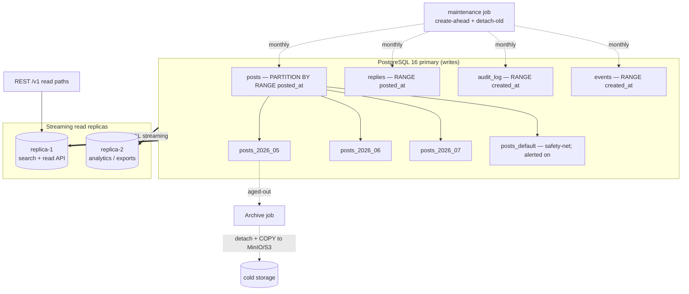

<!--
  Title           : Helix Thready — Partitioning & Scaling Plan
  Classification  : PUBLIC
  Location        : docs/public/research/mvp/database/partitioning.md
  Status          : Draft — v0.1
  Revision        : 1 (2026-07-21)
  Author          : Helix Thready documentation swarm (database)
  Related         : ./schema-relational.sql ./indexing.md ./retention-archive.md
                    ./erd.md ../deployment/index.md
-->

# Helix Thready — Partitioning & Scaling Plan

| Rev | Date | Author | Change |
|-----|------|--------|--------|
| 1 | 2026-07-21 | swarm (database) | Initial: time-partitioned firehose tables, read replicas, maintenance job |
| 2 | 2026-07-21 | reviewer (database) | Topology diagram: added the `posts_default` safety-net node (parity with the `.mmd` sibling) |
| 3 | 2026-07-22 | swarm (database, Pass 3) | Added §4.1 concrete HASH sub-partition DDL (whale-tenant escalation, `ATM-DB-021`) + a LIST-partition worked example; §4.2 range-bound conventions; explicit per-partition autovacuum/`fillfactor` ALTER DDL in §7 |

## Table of Contents

1. [Why partition (the Large-scale mandate)](#1-why-partition-the-large-scale-mandate)
2. [What is partitioned and how](#2-what-is-partitioned-and-how)
3. [Topology diagram](#3-topology-diagram)
4. [Declarative range partitioning DDL](#4-declarative-range-partitioning-ddl)
   - [4.1 Sub-partitioning & list-partitioning DDL (escalation path)](#41-sub-partitioning--list-partitioning-ddl-escalation-path)
   - [4.2 Range-bound & naming conventions](#42-range-bound--naming-conventions)
5. [Partition maintenance (create-ahead + detach-old)](#5-partition-maintenance-create-ahead--detach-old)
6. [Read replicas & routing](#6-read-replicas--routing)
7. [Connection pooling & pgvector co-location tuning](#7-connection-pooling--pgvector-co-location-tuning)
8. [The partitioned-FK trade-off](#8-the-partitioned-fk-trade-off)
9. [Gaps, verification & open items](#9-gaps-verification--open-items)

---

## 1. Why partition (the Large-scale mandate)

The operator selected **Large / multi-tenant** scale (final request Q2/§0.1): 100+ channels,
**10k+ posts/day**, 100+ users, 50 TB+ assets, with horizontal scaling planned from day one.
At 10k posts/day plus a multiple of that in replies, `posts` and `replies` grow by millions
of rows per year; `events` and `audit_log` grow faster still. Unpartitioned, these tables
would make autovacuum, index bloat, retention deletes, and cold-data archival increasingly
expensive and would violate the Aggressive SLOs (Q14).

**VERIFIED gap.** `digital.vasic.database` provides `Config`, `pkg/migration.Runner`,
pooling and dialects, but **no partitioning/sharding or retention helpers** (confirmed:
the package set is `connection, database, dialect, gorm, helpers, migration, netstorage,
pool, postgres, query, repository, sqlite` — no `partition`/`retention`/`archive`).
`[GAP: database-3.2]` Thready therefore owns partitioning at the **schema + migration +
maintenance-job** layer described here, and proposes a reusable `pkg/partition` helper to
fold back upstream (§5). This is the honest status: partitioning is *designed and specified
here*, not shipped in the module today.

---

## 2. What is partitioned and how

| Table | Strategy | Key | Granularity | Rationale |
|-------|----------|-----|-------------|-----------|
| `posts` | RANGE | `posted_at` | monthly | firehose; time-ordered reads; monthly age-out |
| `replies` | RANGE | `posted_at` | monthly | firehose; assembled with posts |
| `events` | RANGE | `created_at` | monthly | durable event catalog; short retention |
| `audit_log` | RANGE | `created_at` | monthly | append-only; 1-year retention window |

All other tables (tenancy, channels, threads metadata, assets, billing) are **not**
partitioned — they are bounded by tenant/channel counts, not by time, and keep full
database-level foreign keys. Monthly granularity balances partition count (12/year/table,
manageable) against per-partition size (sub-100M rows, comfortable for index builds and
`DETACH`). Sub-partitioning by `account_id` (HASH) is an available escalation if a single
tenant dominates volume — tracked as `ATM-DB-021`, not needed for MVP.

---

## 3. Topology diagram

Source: [`diagrams/partitioning.mmd`](./diagrams/partitioning.mmd).



**Explanation (for readers/models that cannot see the diagram).** Writes land on the single
PostgreSQL 16 **primary**, shown as the top box. The four firehose tables are declared as
RANGE-partitioned parents; each month has its own child partition (e.g. `posts_2026_07`), and
a `posts_default` safety-net partition catches any row whose timestamp falls outside the
provisioned months. That default is deliberately drawn separately because it is *alerted on* —
a row landing there means the maintenance job fell behind, not that the write should silently
succeed forever in the wrong place.

A **maintenance job** (the `PM` node) runs on a schedule to (a) create next month's partitions
*ahead* of need so inserts never hit the `DEFAULT` partition, and (b) detach partitions that
have aged past their retention window. It touches all four parents on the same monthly cadence.
Two **streaming read replicas** receive WAL from the primary: `replica-1` serves the read-heavy
API paths (search hydration, dashboards) so read load never competes with ingestion writes;
`replica-2` serves heavy analytics/exports so a long report cannot stall the API. The REST
`/v1` read paths are routed to `replica-1`.

When a partition ages out, the **archive job** detaches it, copies it to the MinIO/S3 cold
tier (`digital.vasic.storage`), records it in `archived_partitions`, and drops the live
partition — the flow detailed in [retention-archive.md](./retention-archive.md) and shown as
the `P1 → ARCH → Cold` edge. One correctness rule governs the whole topology: writes and
strongly-consistent reads (the processing claim, billing, auth) always target the **primary**,
because a claim or a balance read against a lagging replica could act on stale state. Only
lag-tolerant reads are offloaded to the replicas.

---

## 4. Declarative range partitioning DDL

The partition parents and initial partitions are created in
[`schema-relational.sql`](./schema-relational.sql) / `0001_init`. The pattern:

```sql
CREATE TABLE posts (
  id uuid NOT NULL DEFAULT gen_random_uuid(),
  ...,
  posted_at timestamptz NOT NULL,          -- PARTITION KEY (part of PK)
  PRIMARY KEY (id, posted_at)
) PARTITION BY RANGE (posted_at);

CREATE TABLE posts_2026_07 PARTITION OF posts
  FOR VALUES FROM ('2026-07-01') TO ('2026-08-01');
CREATE TABLE posts_default PARTITION OF posts DEFAULT;  -- safety net; alerted on
```

A `DEFAULT` partition is a safety net so an insert with an unexpected timestamp never fails;
monitoring alerts if any row lands in `*_default`, signalling the maintenance job fell
behind. New-partition creation goes through the migration runner OR the maintenance job
(both are just DDL); creating a partition is metadata-only and does not lock the parent's
existing partitions.

**Native declarative vs `pg_partman`.** We specify **native declarative partitioning** as
the baseline (no extension dependency, fully controlled by our migrations + job). Deployments
that prefer a battle-tested manager may adopt **`pg_partman`** with `p_type := 'range'`,
`p_interval := '1 month'`, `p_premake := 3`, and its `run_maintenance_proc()` on a schedule —
the DDL above is compatible with either. `[DEFAULT — adjustable]`

### 4.1 Sub-partitioning & list-partitioning DDL (escalation path)

**HASH sub-partition by account — the whale-tenant escalation (`ATM-DB-021`, not MVP).**
Monthly range partitions are the MVP baseline. If a single tenant's volume dominates a month
and its rows contend on the same partition's indexes/autovacuum, a monthly partition can be
declared as a *further* partitioned table and sub-partitioned by `HASH (account_id)` so one
whale's writes spread across N sub-partitions:

```sql
-- Escalation: make ONE month a hash-sub-partitioned parent (do this only for hot months).
-- Composite partition key must include BOTH range and hash columns.
CREATE TABLE posts_2027_01
  PARTITION OF posts
  FOR VALUES FROM ('2027-01-01') TO ('2027-02-01')
  PARTITION BY HASH (account_id);

-- 4 hash buckets for that month (bucket count is fixed at creation; pick a power of two).
CREATE TABLE posts_2027_01_h0 PARTITION OF posts_2027_01
  FOR VALUES WITH (MODULUS 4, REMAINDER 0);
CREATE TABLE posts_2027_01_h1 PARTITION OF posts_2027_01
  FOR VALUES WITH (MODULUS 4, REMAINDER 1);
CREATE TABLE posts_2027_01_h2 PARTITION OF posts_2027_01
  FOR VALUES WITH (MODULUS 4, REMAINDER 2);
CREATE TABLE posts_2027_01_h3 PARTITION OF posts_2027_01
  FOR VALUES WITH (MODULUS 4, REMAINDER 3);
```

Because `posts`' PK is `(id, posted_at)` and `account_id` is a plain column, the hash sub-key
does not change the PK; queries that carry `account_id` prune to one hash bucket, and queries
that don't still prune by month then scan all four buckets. The trade-off is more relations to
manage, so this is reserved for genuinely hot months — the `MonthlyRange.EnsureAhead` helper
(§5) creates flat monthly partitions by default and only emits the sub-partitioned form for
tenants/months flagged in config.

**LIST partition worked example (alternative axis).** Where the dominant access pattern is by
a low-cardinality discriminator rather than time — e.g. isolating one messenger platform's
firehose, or separating a `sensitive` asset tier for a distinct autovacuum/retention regime —
`PARTITION BY LIST` is the right tool. Illustrative (assets are *not* partitioned in the MVP;
this shows the DDL shape for the escalation):

```sql
-- Illustrative LIST partitioning of an asset-events firehose by sensitivity tier.
CREATE TABLE asset_events (
  id          uuid NOT NULL DEFAULT gen_random_uuid(),
  account_id  uuid NOT NULL,
  sensitivity text NOT NULL,          -- LIST PARTITION KEY
  payload     jsonb NOT NULL DEFAULT '{}'::jsonb,
  created_at  timestamptz NOT NULL,
  PRIMARY KEY (id, sensitivity)
) PARTITION BY LIST (sensitivity);
CREATE TABLE asset_events_public    PARTITION OF asset_events FOR VALUES IN ('public');
CREATE TABLE asset_events_internal  PARTITION OF asset_events FOR VALUES IN ('internal');
CREATE TABLE asset_events_sensitive PARTITION OF asset_events FOR VALUES IN ('sensitive');
CREATE TABLE asset_events_default   PARTITION OF asset_events DEFAULT;
```

The same DEFAULT-partition safety-net + alert discipline applies to LIST partitioning: an
unexpected discriminator value lands in `*_default` and raises the maintenance alert.

### 4.2 Range-bound & naming conventions

- **Half-open ranges.** Every range is `[start, end)` — inclusive lower, exclusive upper — so
  adjacent months never overlap and a timestamp of exactly `'2026-08-01T00:00:00Z'` belongs to
  `posts_2026_08`, not `posts_2026_07`. This is Postgres' native RANGE semantics; the
  maintenance helper always emits `FROM firstOfMonth(m) TO firstOfMonth(m+1)`.
- **UTC boundaries.** Bounds are UTC (`timestamptz` compared in UTC on a UTC server), so a
  month boundary is unambiguous regardless of client timezone.
- **Naming.** `<table>_<YYYY>_<MM>` for monthly ranges, `<table>_<YYYY>_<MM>_h<n>` for hash
  sub-buckets, `<table>_default` for the safety net. The archive catalog
  (`archived_partitions.partition_name`) stores this exact name so a detached partition is
  re-attachable by name.

---

## 5. Partition maintenance (create-ahead + detach-old)

The maintenance job runs monthly (and is idempotent, so it can run daily harmlessly) via
`digital.vasic.background` (the Postgres task queue) so it inherits retry/back-off and
observability. Proposed reusable helper `pkg/partition` (fold back into
`digital.vasic.database` — closes `[GAP: database-3.2]`):

```go
// Package partition — reusable range-partition maintenance for digital.vasic.database.
// Proposed BUILD-NEW helper to close gap database-3.2 (no partitioning helpers today).
type MonthlyRange struct {
    Table       string        // "posts"
    KeyColumn   string        // "posted_at"
    Premake     int           // create N months ahead (default 3)
    Retain      time.Duration // 0 = keep indefinitely (system default)
}

// EnsureAhead creates the next `Premake` monthly partitions if missing. Idempotent.
func (m MonthlyRange) EnsureAhead(ctx context.Context, db database.Database, now time.Time) error {
    for i := 0; i <= m.Premake; i++ {
        start := firstOfMonth(now.AddDate(0, i, 0))
        end   := start.AddDate(0, 1, 0)
        name  := fmt.Sprintf("%s_%04d_%02d", m.Table, start.Year(), start.Month())
        // metadata-only; safe under concurrent runs via advisory lock (see migration-strategy.md)
        ddl := fmt.Sprintf(
            `CREATE TABLE IF NOT EXISTS %s PARTITION OF %s FOR VALUES FROM ('%s') TO ('%s')`,
            name, m.Table, start.Format("2006-01-02"), end.Format("2006-01-02"))
        if _, err := db.Exec(ctx, ddl); err != nil {
            return fmt.Errorf("ensure partition %s: %w", name, err)
        }
    }
    return nil
}

// DetachAged detaches partitions whose whole range is older than Retain (if Retain>0),
// handing them to the archive pipeline. Retain==0 (keep-indefinitely) is a no-op.
func (m MonthlyRange) DetachAged(ctx context.Context, db database.Database, now time.Time) ([]string, error) {
    if m.Retain == 0 { return nil, nil } // operator default: keep indefinitely
    // ... enumerate partitions from pg_inherits, DETACH those with range_end < now-Retain,
    //     append to a result slice consumed by retention-archive.md's archive job.
}
```

- `EnsureAhead` guarantees a partition always exists before rows for that month arrive.
- `DetachAged` respects the **keep-indefinitely default** — it only detaches when a
  retention window is explicitly set (globally or per-account/channel; see
  [retention-archive.md](./retention-archive.md)). Detach is metadata-only and fast;
  archival + drop happen separately.
- Concurrency: partition DDL takes an advisory lock (`pg_advisory_xact_lock`) so the job
  and a concurrent migration never race (see [migration-strategy.md §advisory-lock](./migration-strategy.md)).

---

## 6. Read replicas & routing

- **Streaming replication** (physical WAL) to ≥2 replicas on the Hetzner host topology
  (final request §14, Q5). Async by default (favours write latency); a synchronous standby
  is an option for stricter RPO but is not required given the hourly-incremental backup
  policy (RPO ≈ 1 h — Q41/Q45).
- **Routing policy:**
  - *Writes + read-after-write + strongly-consistent reads* (processing claim, billing,
    auth) → **primary**.
  - *Search hydration, dashboards, list endpoints* → **replica-1** (tolerate ≤ replica lag,
    usually < 1 s).
  - *Analytics, exports, ClickHouse feed* → **replica-2**.
- The API layer selects the target via the `digital.vasic.database` pool per request intent
  (a `ReadOnly` context flag). Replica lag is exposed via `observability/pkg/health` and
  alerts if it exceeds a threshold that would breach the page SLO.
- pgvector search runs on a replica **only if** the ANN indexes are present there (they are,
  via streaming replication) and freshness tolerance allows; newly-embedded content is
  visible on the replica within lag. For "search must see my just-processed post"
  interactions, route that one query to the primary.

---

## 7. Connection pooling & pgvector co-location tuning

`[GAP: database-3.2]` calls for documented connection-pool + pgvector co-location tuning.

- **Pooling.** `digital.vasic.database` exposes `Config.MaxConns/MinConns/MaxConnLifetime/
  MaxConnIdleTime` (VERIFIED in `pkg/database/database.go`). At Large scale front Postgres
  with **PgBouncer** in `transaction` pooling mode; size the pgx pool to
  `MaxConns ≈ (cores × 2) + effective_spindle_count` per service, not per request. The 32
  processing workers (Q4) share a bounded pool; the claim query is short so a small pool
  suffices.
- **pgvector co-location.** Because pgvector lives in the **same** Postgres instance as the
  relational data (final request §2.1.1), HNSW index builds and searches compete with OLTP
  for shared buffers and CPU. Mitigations:
  - Give the instance generous `shared_buffers` (≈ 25% RAM) and `maintenance_work_mem`
    (≥ 2 GB for HNSW builds); build big ANN indexes in a maintenance window.
  - Run heavy semantic search on **replica-1** so ANN CPU does not steal from ingestion on
    the primary.
  - If ANN load and OLTP genuinely contend, the escape hatch is to move vectors to a
    dedicated Postgres+pgvector instance **or** to Qdrant behind the same `VectorStore`
    interface (`[GAP: vectordb-3.1]`) — a config change, not a schema change.
- **Autovacuum.** Tune per-partition `autovacuum_vacuum_scale_factor` down on hot
  partitions (e.g. 0.02) so bloat is controlled; freeze aggressively before archival. Because
  storage parameters are set per relation, apply them to the **current** partition (where all
  the churn is), not the parent:

```sql
-- Aggressive autovacuum on the hot (current-month) partition: vacuum after ~0.02*rows dead.
ALTER TABLE posts_2026_07 SET (
  autovacuum_vacuum_scale_factor  = 0.02,
  autovacuum_analyze_scale_factor = 0.02,
  autovacuum_vacuum_cost_delay    = 2   -- ms; let it keep up under the 10k+/day insert rate
);
-- Append-mostly firehose: a high fillfactor packs pages tightly (few in-place updates).
ALTER TABLE posts_2026_07 SET (fillfactor = 95);
-- Before a month ages out and is archived, freeze it so the cold copy needs no later vacuum:
VACUUM (FREEZE, ANALYZE) posts_2025_01;
```

  The maintenance job (§5) stamps these storage parameters on each new partition it creates,
  so every hot partition inherits the aggressive-autovacuum profile without manual steps; older
  partitions can relax back to defaults since they no longer receive writes.

---

## 8. The partitioned-FK trade-off

As documented in [erd.md §9](./erd.md#9-referential-integrity-strategy-partitioned-tables),
we omit DB-level FKs *into* the partitioned tables and enforce those references in the app.
The alternative — DB-enforced integrity — requires composite FKs:

```sql
-- OPTIONAL hardening: composite FK into a partitioned parent.
-- Requires children to carry the partition key and the parent to expose (id, posted_at)
-- as its PK/UNIQUE (it does). Trade-off: every child write must supply post_posted_at,
-- and cascades are heavier on the firehose path.
ALTER TABLE processing_state
  ADD CONSTRAINT fk_processing_post
  FOREIGN KEY (post_id, post_posted_at) REFERENCES posts (id, posted_at)
  ON DELETE CASCADE;
```

`[OPEN: db-partition-fk]` (`ATM-DB-004`) — the default is app-enforced (throughput); a
deployment may enable composite FKs for the safety-critical `processing_state` link only.
Decide per environment in the deployment pack.

---

## 9. Gaps, verification & open items

| Item | Status |
|------|--------|
| `[GAP: database-3.2]` no partitioning helpers in module | Addressed: schema partitions + `pkg/partition` proposal §5; pooling/co-location §7 |
| `[GAP: vectordb-3.1]` ANN co-location contention | Addressed §7 (replica offload; Qdrant escape hatch) |
| `[OPEN: db-partition-fk]` app- vs DB-enforced FK | Tracked `ATM-DB-004` |
| Sub-partition by account for whales | Tracked `ATM-DB-021` (not MVP) |

**Verification.** Partitioning correctness is covered by the scaling + chaos test types
(§11.4.27): a seeded month-boundary fixture asserts inserts land in the right partition and
prune in `EXPLAIN`; a "maintenance job skipped" chaos test asserts rows fall into
`*_default` and the alert fires; a load test asserts ingestion throughput ≥ 10k posts/day
with search p95 < 500 ms concurrently.

---

*Made with love ♥ by Helix Development.*
