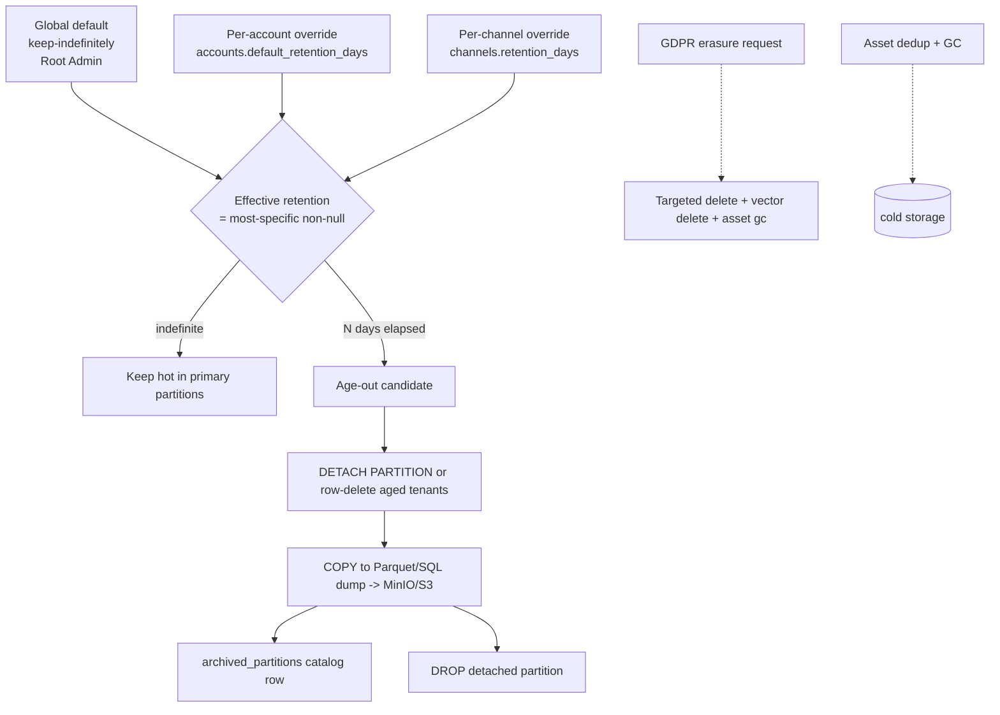

<!--
  Title           : Helix Thready — Retention & Archive Strategy
  Classification  : PUBLIC
  Location        : docs/public/research/mvp/database/retention-archive.md
  Status          : Draft — v0.1
  Revision        : 1 (2026-07-21)
  Author          : Helix Thready documentation swarm (database)
  Related         : ./schema-relational.sql ./partitioning.md ./indexing.md
                    ./erd.md ../deployment/index.md
-->

# Helix Thready — Retention & Archive Strategy

| Rev | Date | Author | Change |
|-----|------|--------|--------|
| 1 | 2026-07-21 | swarm (database) | Initial: keep-indefinitely default, per-account overrides, archive lifecycle, GDPR-aware erasure |
| 2 | 2026-07-21 | reviewer (database) | Tracked MinIO signed-URL parity (`ATM-DB-033`) to fully close gap `database-3.2` |

## Table of Contents

1. [Policy (operator decision)](#1-policy-operator-decision)
2. [Retention resolution model](#2-retention-resolution-model)
3. [Lifecycle diagram](#3-lifecycle-diagram)
4. [Archive pipeline (detach → cold → drop)](#4-archive-pipeline-detach--cold--drop)
5. [Vector & asset retention](#5-vector--asset-retention)
6. [GDPR-aware erasure & export](#6-gdpr-aware-erasure--export)
7. [Backup/DR interaction](#7-backupdr-interaction)
8. [Verification & open items](#8-verification--open-items)

---

## 1. Policy (operator decision)

The operator's retention decision is **keep indefinitely, with per-account overrides**
(final request §0.1, Q12): *Root sets the global default; each Account may shorten it.*
This document specifies exactly how that resolves to physical data lifecycle actions, so the
default is genuinely "nothing is ever deleted unless a shorter window is explicitly set".

Consequences encoded in the schema:

- `accounts.default_retention_days` — `NULL` = keep indefinitely (system default); a
  positive integer *shortens* retention for that account only.
- `channels.retention_days` — optional per-channel override (more specific still).
- The **global default** is a configuration value owned by Root Admin (stored in system
  config, not a per-row column) and is `NULL`/indefinite for MVP.

`[OPERATOR]` `[final request §0.1, Q12]`

---

## 2. Retention resolution model

The **effective retention** for a post/reply is the *most specific non-null* window:

```
effective_retention(post) =
    coalesce(channel.retention_days,
             account.default_retention_days,
             global_default /* NULL = indefinite */)
```

```sql
-- Effective retention per channel (used by the archive job to pick aged partitions).
SELECT c.id AS channel_id,
       COALESCE(c.retention_days, a.default_retention_days) AS effective_days
FROM   channels c
JOIN   accounts a ON a.id = c.account_id;
-- NULL effective_days => keep indefinitely (row/partition never ages out).
```

Because retention can differ per account/channel while data is co-mingled in monthly
partitions, the archive job does **not** blindly drop whole partitions on age. It drops a
partition only when **every** row in it is past its effective retention; otherwise it
performs row-level deletes for the aged tenants/channels and leaves the partition in place
until fully drainable. In practice, since the default is indefinite, most partitions are
kept forever and only tenants who opted into a short window are pruned. `[DEFAULT — adjustable]`

---

## 3. Lifecycle diagram

Source: [`diagrams/retention-archive.mmd`](./diagrams/retention-archive.mmd).



**Explanation (for readers/models that cannot see the diagram).** Retention resolves top to
bottom: the global default (keep-indefinitely, owned by Root) is overridden by an optional
per-account window, which is overridden by an optional per-channel window; the *most
specific non-null* value wins. If the result is indefinite, the data stays hot in the
primary's partitions forever. If a finite window `N` has elapsed, the row/partition becomes
an age-out candidate. The archive step either **detaches** a fully-drainable monthly
partition or row-deletes just the aged tenants within a still-live partition; either way the
data is first **copied** to the MinIO/S3 cold tier as a Parquet or SQL dump, a bookkeeping
row is written to `archived_partitions`, and only then is the live partition dropped —
"archive before drop" guarantees no irreversible loss. Two side flows sit outside the age
timer: a **GDPR erasure request** triggers a targeted purge (relational rows + their vector
rows + asset unlink/garbage-collection) regardless of retention; and **asset dedup/GC**
reclaims cold-tier space for orphaned blobs. This directly closes the retention/archive half
of `[GAP: database-3.2]` at the schema+job layer.

---

## 4. Archive pipeline (detach → cold → drop)

The archive job runs via `digital.vasic.background` (retry/observability) and uses
`digital.vasic.storage` for the cold tier. Steps, per aged monthly partition:

```sql
-- 1) Detach the partition (metadata-only; the data becomes a standalone table).
ALTER TABLE posts DETACH PARTITION posts_2025_01;

-- 2) Export to cold storage. Parquet (analytics-friendly) or COPY ... TO (SQL restore).
COPY posts_2025_01 TO PROGRAM
  'zstd | mc pipe minio/thready-archive/posts/2025-01.sql.zst' (FORMAT text);

-- 3) Record the archive (see schema-relational.sql: archived_partitions).
INSERT INTO archived_partitions
  (source_table, partition_name, range_start, range_end, row_count,
   storage_backend, storage_key, checksum, archived_at)
VALUES
  ('posts','posts_2025_01','2025-01-01','2025-02-01',
   (SELECT count(*) FROM posts_2025_01), 'minio',
   'posts/2025-01.sql.zst', $checksum, now());

-- 4) Drop the detached, now-archived partition; stamp dropped_at.
DROP TABLE posts_2025_01;
UPDATE archived_partitions SET dropped_at = now()
  WHERE source_table='posts' AND partition_name='posts_2025_01';
```

Guarantees:

- **Archive before drop** — the `DROP` only runs after the cold copy is verified (checksum
  matches) and cataloged. Chaos test asserts a mid-archive crash never drops un-copied data.
- **Restorable** — `archived_partitions` records the exact cold-storage key + checksum so a
  partition can be re-attached (`CREATE TABLE … ; COPY … FROM ; ALTER TABLE … ATTACH
  PARTITION`) on demand for audits or legal hold.
- **Idempotent** — steps are guarded by the catalog so a re-run skips completed partitions.
- **Indefinite default** — with the system default, step 1 never triggers; the pipeline only
  acts on tenants/channels that set a finite window.

---

## 5. Vector & asset retention

- **Vectors follow their source.** When a post/reply/asset/artifact row is purged or
  archived-and-dropped, its corresponding `vectordb_*` rows are deleted in the same unit of
  work (the `id`/`metadata.source_id` back-reference makes this a targeted delete). Archived
  content is removed from the live ANN index so search never returns cold/erased results;
  if archived content must remain searchable, its vectors are retained while the relational
  detail moves cold (a per-account policy flag, `ATM-DB-031`).
- **Assets** are content-hash-deduped (`assets.UNIQUE(account_id, content_hash)`); GC only
  removes a blob from the cold tier when **no** `asset_links` reference it and no retention
  hold applies. Raw originals are preserved per §7.3 unless the account's retention window
  explicitly covers assets.
- **Signed-URL parity `[GAP: database-3.2]`.** The `assets.storage_backend` column allows
  `minio`, `s3`, or `local`. The gap register flags that `digital.vasic.storage`'s signed-URL
  helper is CloudFront/AWS-specific and MinIO parity is unverified. Because the schema is
  storage-backend-agnostic (it stores only an opaque `storage_key`, never a signed URL), this
  is an **Asset-Service/deployment concern, not a schema concern** — tracked as `ATM-DB-033`
  and validated against a self-hosted MinIO (Hetzner) in the deployment pack
  ([`../deployment/index.md`](../deployment/index.md)). The database layer is unaffected either way.
- **Audit log** retains for the Q40 default (1 year, adjustable) independently of content
  retention — audit is a compliance record, not user content, and ages out on its own timer.

---

## 6. GDPR-aware erasure & export

Compliance posture is **minimal/internal** (Q7), but the design is **GDPR-aware**
(erasure/export hooks designed, not certified — final request §19.13):

- **Erasure (right to be forgotten).** A targeted erase for a user or an account cascades:
  relational rows via `ON DELETE CASCADE` from `accounts`/`users`, their vector rows via the
  `source_id` back-reference, and asset blobs via `asset_links` GC. Because erasure must
  reach cold storage too, the job also removes/anonymises matching archived dumps (or records
  a tombstone if legal hold applies). Erasure bypasses the retention timer.
- **Export (portability).** A per-account export assembles the tenant's posts/threads/replies
  + generated artifacts + asset manifest into a signed archive via `digital.vasic.storage`.
- **Encrypted sensitive data.** Credentials/QR/screenshots/contracts stored encrypted
  (§3.6) are erased by destroying the row + its sealed bytes; the AES-256-GCM key material
  is managed by `security` (never in the DB).

`[OPEN: gdpr-cold-erasure]` (`ATM-DB-032`) — cold-tier erasure/anonymisation tooling is
specified here but its implementation depends on the archive format choice; tracked.

---

## 7. Backup/DR interaction

Retention/archive is **orthogonal** to backup/DR (Q41/Q45): daily full + hourly DB
incrementals, RPO ≈ 1 h, RTO ≈ 4 h.

- Backups capture the **live** database (hot partitions); archived-and-dropped partitions
  are protected by their cold-tier copies + the `archived_partitions` catalog, not by DB
  backups — so DR restore + catalog re-attach together reconstruct full history.
- PITR from incrementals covers accidental deletes within the backup window; the archive
  catalog covers intentional age-out beyond it.
- The restore runbook (deployment pack) includes "re-attach archived partition" as a step so
  an operator can rehydrate cold history during an audit.

---

## 8. Verification & open items

| Item | Status |
|------|--------|
| `[GAP: database-3.2]` retention/archive helpers | Addressed: resolution model §2, archive job §4, `pkg/partition.DetachAged` (partitioning.md §5) |
| `[GAP: database-3.2]` MinIO signed-URL parity | Storage/deployment concern (schema stores opaque `storage_key` only); tracked `ATM-DB-033` (§5) |
| Archive-before-drop safety | Chaos test asserts no un-copied drop (§4) |
| `[OPEN: gdpr-cold-erasure]` cold-tier erasure tooling | Tracked `ATM-DB-032` |
| `[OPEN]` keep-archived-vectors-searchable flag | Tracked `ATM-DB-031` |

**Verification.** Covered by chaos (crash mid-archive), scaling (archive of a full month
under load), and security (erasure reaches vectors + cold tier) test types per §11.4.27,
each with runtime evidence (anti-bluff).

---

*Made with love ♥ by Helix Development.*
