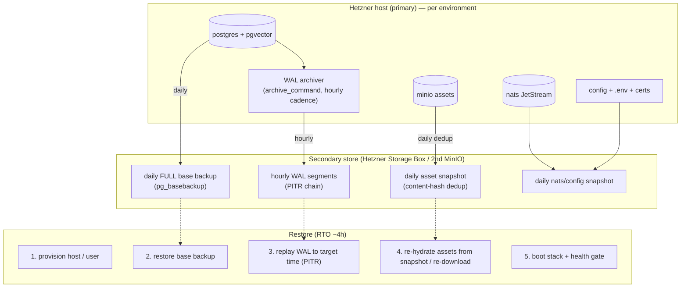

<!--
  Title           : Helix Thready — Backup & Disaster Recovery
  Classification  : PUBLIC
  Location        : docs/public/research/mvp/deployment/backup-dr.md
  Status          : Review — v0.2
  Revision        : 2 (2026-07-21)
  Author          : Helix Thready documentation swarm (deployment)
  Related         : ./index.md, ./container-topology.md, ./deploy-and-rollback.md,
                    ./hetzner-provisioning.md, ../database/index.md, ../testing/index.md
-->

# Helix Thready — Backup & Disaster Recovery

| Rev | Date | Author | Change |
|-----|------|--------|--------|
| 1 | 2026-07-21 | swarm (deployment) | Initial backup topology, WAL/PITR plan, asset snapshots, RPO/RTO, restore runbook, chaos validation |
| 2 | 2026-07-21 | swarm (deployment review) | Added concrete Prometheus backup-integrity alert rules and reproduce-first (RED) PITR/RTO/asset-heal TDD skeletons; split the topology prose into multiple paragraphs |

This document specifies Helix Thready's backup and disaster-recovery design: **daily full backups +
hourly PostgreSQL incrementals**, daily asset snapshots, the **RPO ≈ 1 h / RTO ≈ 4 h** targets, the
step-by-step **restore runbook**, and how chaos tests validate it — all per the operator decisions
(`§0.1`, Q41, Q45).

> Diagram source: sibling under [`diagrams/`](./diagrams/). Rendered PNG/SVG exported via Docs Chain (§11.4.65).

## Table of Contents

1. [Targets (RPO / RTO)](#1-targets-rpo--rto)
2. [What is backed up](#2-what-is-backed-up)
3. [Backup & DR topology diagram](#3-backup--dr-topology-diagram)
4. [PostgreSQL: daily full + hourly WAL (PITR)](#4-postgresql-daily-full--hourly-wal-pitr)
5. [Assets: daily snapshot + dedup](#5-assets-daily-snapshot--dedup)
6. [Secondary store & retention](#6-secondary-store--retention)
7. [Restore runbook (RTO ≈ 4 h)](#7-restore-runbook-rto--4h)
8. [Chaos / DR validation](#8-chaos--dr-validation)
   - [8.1 Reproduce-first DR tests (TDD)](#81-reproduce-first-dr-tests-tdd)
9. [Verified vs assumed](#9-verified-vs-assumed)
10. [Open items](#10-open-items)

---

## 1. Targets (RPO / RTO)

| Target | Value | Meaning |
|--------|-------|---------|
| **RPO** (Recovery Point Objective) | **≈ 1 h** | At most ~1 h of data may be lost — met by hourly DB incrementals (WAL) + daily asset snapshot |
| **RTO** (Recovery Time Objective) | **≈ 4 h** | The system is fully restored within ~4 h — met by the documented runbook below |

`[OPERATOR]` (Q41, Q45). Assets have a coarser effective RPO (daily) because they are large,
content-addressed and re-downloadable; the *relational + vector* system-of-record has the ≈ 1 h RPO.

## 2. What is backed up

| Data | Source | Cadence | Method | Restorable by |
|------|--------|---------|--------|---------------|
| Relational + pgvector | `thready-<env>-pgdata` | daily full + **hourly WAL** | `pg_basebackup` + WAL archiving | PITR |
| Archived WAL | `thready-<env>-pgwal` | continuous → shipped hourly | `archive_command` → secondary | PITR replay |
| Assets (raw + `…-web`) | `thready-<env>-minio` | daily | snapshot + content-hash dedup | re-hydrate or re-download |
| Event streams | `thready-<env>-nats` (JetStream) | daily | stream snapshot | replay/rebuild |
| Config + secrets refs | `/home/thready/<env>/config`, `.env` **(encrypted)** | daily | encrypted archive | redeploy |
| TLS certs | `/home/thready/edge/certs` | daily (+ re-issuable) | file copy / re-issue via `lets_encrypt` | copy or re-issue |
| Firebase signing keys | private repo (owner-only) | on change | private repo | restore from private repo |

> Redis and ClickHouse are **not** critical backups — the cache is rebuildable and log analytics are
> reconstructable; they may be snapshotted for convenience but are not on the RPO path.

> **Secrets in backups.** The `.env` and `api_keys.sh` are backed up **only in encrypted form**
> (AES-256-GCM via `security/pkg/securestorage`), never in plaintext, and never to a public
> location `[CONSTITUTION §11.4.10]` (see [secrets-and-config.md](./secrets-and-config.md)).

## 3. Backup & DR topology diagram



**Explanation (for readers/models that cannot see the diagram).** On the primary Hetzner host, each
environment's Postgres continuously writes WAL; an `archive_command` ships completed WAL segments to
the **secondary store** at least hourly, and a full `pg_basebackup` is taken daily. Assets in MinIO
are snapshotted daily with content-hash deduplication (identical objects are stored once), and the
NATS streams plus config/certs are snapshotted daily.

The **secondary store** — a Hetzner Storage Box or a second MinIO, physically separate from the
primary — holds the daily base backups, the hourly WAL chain, the asset snapshots and the config
snapshots. Its defining property is that a total loss of the primary host cannot take the backups
with it, which is what makes the RTO target achievable at all.

Recovery uses three streams: the base backup gives the daily starting point, the WAL chain is
**replayed forward** to any point in time (point-in-time recovery, PITR) up to ~1 h before the
incident, and assets are re-hydrated from the snapshot (or, for anything missing, re-downloaded from
source since assets are content-addressed and their source URLs are recorded). The right-hand
**restore** column is the runbook: provision a host, restore the base backup, replay WAL to the
chosen target time, re-hydrate assets, then boot the stack through the same health gate a normal
deploy uses. Because the WAL cadence is hourly and the runbook fits inside ~4 h, this topology meets
RPO ≈ 1 h and RTO ≈ 4 h — targets whose achievement is asserted, not assumed, by the reproduce-first
tests in [§8.1](#81-reproduce-first-dr-tests-tdd).

## 4. PostgreSQL: daily full + hourly WAL (PITR)

Postgres native PITR gives both the daily full and the hourly incremental with one mechanism.
pgvector lives in the **same** instance (`§2.1.1`), so it is covered automatically — no separate
vector backup.

**Configuration (per env Postgres):**

```ini
# postgresql.conf (in the thready-postgres container)
wal_level = replica
archive_mode = on
# Ship each completed WAL segment to the secondary store (rootless: rclone/scp to Storage Box).
archive_command = 'rclone copyto %p thready-secondary:wal/<env>/%f'
archive_timeout = 3600          # force a segment at least hourly → RPO ≈ 1 h even under low write volume
```

**Daily full base backup (cron / systemd --user timer, as `thready`):**

```bash
# /home/thready/scripts/backup-pg-full.sh <env>
ENV="$1"
pg_basebackup \
  -h 127.0.0.1 -p "$(port_prefix --prefix "${PREFIX[$ENV]}" --port 5432)" \
  -U "$THREADY_PG_USER" \
  -D - -Ft -z \
  | rclone rcat "thready-secondary:base/$ENV/$(date -u +%Y%m%dT%H%M%SZ).tar.gz"
```

- `archive_timeout = 3600` guarantees a WAL segment is shipped at least hourly even if write volume
  is low, pinning RPO to ≈ 1 h.
- The base backup + the WAL chain since it are all that PITR needs.
- `[GAP: #3.2]` — the [database](../database/index.md) area adds **time-partitioning** for the
  10k+/day post volume; partitioned tables back up and restore with the same base+WAL mechanism, and
  old partitions can be archived to the object tier to keep the hot set small.

## 5. Assets: daily snapshot + dedup

Assets are large (50 TB+) and content-addressed, so they use a snapshot rather than WAL:

- **Daily snapshot with content-hash dedup** — MinIO object versioning + a dedup pass keyed by the
  content hash the Asset Service already computes (`§19.3`), so unchanged/duplicate objects are not
  re-shipped.
- **Re-download fallback** — every asset row records its source (post↔asset link + origin URL), so a
  missing/corrupt object can be **re-downloaded** via the REST API (`§7`, "broken physical links are
  re-downloadable"). This makes assets the lowest-risk data class.
- `[GAP: #3.2 signed-URL parity]` — before assets go live, the deploy checklist runs a **MinIO
  signed-URL put+get round-trip** to confirm the self-hosted MinIO signing works (the gap register
  flags `storage`'s signing as AWS-CloudFront-specific). This is asserted in the
  [post-deploy anti-bluff gate](./deploy-and-rollback.md#7-post-deploy-verification-anti-bluff-gate).

## 6. Secondary store & retention

**Secondary store** `[OPEN: secondary-store]` `[DEFAULT — adjustable]` — a **Hetzner Storage Box**
(cheap, off-host, SFTP/rclone) is the default target; a second MinIO on separate hardware is the
alternative if S3 semantics are wanted for the backups too. The key property is **physical
separation from the primary host** so a host loss does not take the backups with it.

**Retention** `[DEFAULT — adjustable]` (the *data* retention is keep-indefinitely per Q12; this is
the *backup-copy* retention, a separate lifecycle):

| Class | Keep |
|-------|------|
| Hourly WAL | 8 days (covers any 7-day incident window + margin) |
| Daily base backup | 30 days |
| Weekly base backup | 12 weeks |
| Monthly base backup | 12 months |
| Asset snapshots | 30 daily + 12 monthly (dedup makes this cheap) |

Backups are encrypted at rest on the secondary and their integrity is checksummed; a monthly
**restore drill** ([§8](#8-chaos--dr-validation)) proves they are actually restorable.

## 7. Restore runbook (RTO ≈ 4 h)

This is the documented restore procedure (`§14.4`, Q45). It targets a **fresh** host or the same host
after wipe. Steps are timed so the whole path fits ≈ 4 h.

| # | Step | Detail | ~time |
|---|------|--------|-------|
| 1 | **Provision host + user** | Run the [Hetzner provisioning](./hetzner-provisioning.md) up to "rootless Podman ready" (can be a saved image to shortcut) | 30 m |
| 2 | **Restore secrets & config** | Pull the encrypted `.env`/`api_keys.sh` + `config/` from the secondary; decrypt with the owner key; `chmod 600` | 10 m |
| 3 | **Restore Postgres base** | `rclone` the latest daily base backup for the env; extract into `thready-<env>-pgdata` | 40 m |
| 4 | **PITR replay WAL** | Configure `restore_command` to pull WAL from the secondary; set `recovery_target_time` to ~just-before-incident; start Postgres in recovery | 60 m |
| 5 | **Re-hydrate assets** | Restore the latest MinIO snapshot; queue re-download for any object failing a checksum | 40 m (parallel) |
| 6 | **Re-issue / restore TLS** | Copy certs from the config snapshot, or re-issue via `lets_encrypt issue.sh` (fast on staging-tested config) | 10 m |
| 7 | **Boot stack + health gate** | Run `thready-deploy.sh --env <env>` — the same health-gated boot; promotes only if healthy | 30 m |
| 8 | **Verify** | Run the [anti-bluff verification](./deploy-and-rollback.md#7-post-deploy-verification-anti-bluff-gate) + smoke tests on the live test threads (Appendix A) | 20 m |

**Point-in-time recovery core (step 4):**

```ini
# recovery configuration for PITR restore
restore_command = 'rclone copyto thready-secondary:wal/<env>/%f %p'
recovery_target_time = '2026-07-21 09:55:00+00'   # ~just before the incident (RPO ≈ 1h)
recovery_target_action = 'promote'
```

Because pgvector is in the same cluster, semantic-search indexes are restored by the same PITR — no
separate vector rebuild is required (though a `REINDEX`/HNSW rebuild is available if an index is
suspected corrupt).

## 8. Chaos / DR validation

DR is only real if it is exercised. Per `§11.4.27` (chaos + scaling test types) and Q45:

- **Monthly restore drill** — restore the latest prod backup into an isolated **dev-band** stack and
  run the verification suite; record actual RTO. A drill that misses RTO is a P1 finding.
- **Chaos tests** — kill the primary Postgres mid-write and confirm PITR loses ≤ 1 h; corrupt a MinIO
  object and confirm re-download heals it; sever the secondary during WAL ship and confirm the
  archiver retries without gaps.
- **Backup-integrity monitoring** — Prometheus alerts if: no WAL segment shipped in > 90 min (RPO
  risk), the daily base backup is missing, or a checksum fails. Alerts route through the
  [observability](../architecture/index.md) stack. The backup scripts push timestamps/results to the
  Prometheus **Pushgateway** (rootless, per env), and the alert rules are concrete:

```yaml
# /home/thready/prod/config/prometheus/rules/backup-integrity.rules.yml
groups:
  - name: thready-backup-integrity
    rules:
      - alert: WALArchiveStalled
        # RPO guard: a completed WAL segment must ship at least hourly (archive_timeout=3600).
        expr: time() - thready_backup_last_wal_ship_timestamp_seconds > 5400   # 90 min
        for: 5m
        labels: { severity: critical, rpo: at-risk }
        annotations:
          summary: "No WAL segment shipped for >90m ({{ $labels.env }}) — RPO≈1h at risk"
      - alert: DailyBaseBackupMissing
        expr: time() - thready_backup_last_base_success_timestamp_seconds > 93600   # 26 h
        for: 10m
        labels: { severity: critical }
        annotations:
          summary: "Daily pg_basebackup missing for >26h ({{ $labels.env }})"
      - alert: BackupChecksumFailed
        expr: increase(thready_backup_checksum_failures_total[1h]) > 0
        labels: { severity: critical }
        annotations:
          summary: "A backup object failed checksum verification ({{ $labels.env }})"
      - alert: RestoreDrillMissedRTO
        # A monthly drill that overran the 4h RTO is a P1 finding (see §8.1).
        expr: thready_restore_drill_seconds > 14400
        labels: { severity: warning, rto: missed }
        annotations:
          summary: "Last restore drill exceeded the 4h RTO ({{ $value | humanizeDuration }})"
```

These tests are authored in the [testing](../testing/index.md) area as HelixQA/Challenges banks with
runtime evidence (the anti-bluff rule).

### 8.1 Reproduce-first DR tests (TDD)

`[CONVENTIONS §6]` `[CONSTITUTION §11.4.27]` — DR is only real if a **reproduce-first (RED)** test
provokes the failure and asserts the target is met. These cover the *chaos* and *scaling* test types
and are authored in [testing](../testing/index.md); skeletons here pin the RPO/RTO/asset invariants
this document promises. Each runs against an isolated **dev-band** throwaway stack so it never touches
live data.

```go
// backup_dr_test.go — RED first. These provoke the incident, then assert the target.

// RED 1 — RPO: SIGKILL Postgres mid-write; PITR must lose <= 1h of committed data.
func TestPITR_KillMidWrite_LosesAtMostOneHour(t *testing.T) {
    env := bootIsolatedStack(t, "dev")                 // throwaway, dev band
    defer env.Down()
    lastCommit := writeContinuously(t, env, 90*time.Minute)  // steady inserts, records max id/ts
    target := time.Now().Add(-2 * time.Minute)         // "just before the incident"
    hardKill(t, env.Postgres)                           // SIGKILL mid-write (chaos)

    restored := restorePITR(t, env, target)             // base + WAL replay to target
    lostWindow := lastCommit.At.Sub(restored.MaxCommittedAt)
    require.LessOrEqual(t, lostWindow, time.Hour)        // RPO <= 1h — the operator target
}

// RED 2 — RTO: the documented runbook (steps 1..8 of §7) must complete a full restore under 4h,
// and the restored stack must pass the anti-bluff gate (not just boot).
func TestRestoreDrill_CompletesUnderRTO(t *testing.T) {
    start := time.Now()
    stack := runRestoreRunbook(t, latestProdBackup(t), into("dev-band"))
    defer stack.Down()

    require.Less(t, time.Since(start), 4*time.Hour)                      // RTO <= 4h
    require.True(t, antiBluffGatePasses(t, stack))                       // verified, not bluffed
    recordMetric(t, "thready_restore_drill_seconds", time.Since(start))  // feeds the RTO alert
}

// RED 3 — a corrupted asset object must self-heal via re-download (content-addressed).
func TestAsset_Corrupt_ReDownloadHeals(t *testing.T) {
    obj := putAsset(t, "sample.jpg")
    corruptInMinio(t, obj)                              // flip bytes → checksum mismatch
    require.NoError(t, reconcileAssets(t))              // detects mismatch, re-downloads from origin
    require.Equal(t, obj.OriginalSHA256, sha256Of(t, fetch(t, obj)))
}
```

A drill that misses the RTO fails `TestRestoreDrill_CompletesUnderRTO` and simultaneously fires the
`RestoreDrillMissedRTO` alert above — the test and the monitor guard the same invariant from two
sides.

## 9. Verified vs assumed

- **VERIFIED:** the operator RPO/RTO and daily-full+hourly-incremental decision (Q41/Q45, `§0.1`);
  pgvector co-located in Postgres so one backup covers both (`§2.1.1`); assets re-downloadable
  (`§7`); `lets_encrypt` re-issuance for cert recovery.
- **ASSUMED / `[DEFAULT — adjustable]`:** Postgres-native PITR (`pg_basebackup` + WAL archiving) as
  the mechanism; `rclone`→Hetzner Storage Box as the secondary transport/target; the retention
  ladder; the step timings in the runbook.

## 10. Open items

- `[OPEN: secondary-store]` — Storage Box vs second MinIO for the secondary target; both meet the
  physical-separation requirement.
- `[GAP: #3.2]` — MinIO signed-URL parity + time-partition archive helpers are tracked with the
  [database](../database/index.md) area; the deploy gate already asserts the signed-URL round-trip.
- `[OPEN: pitr-tooling]` — whether to adopt a higher-level PITR tool (e.g. pgBackRest in a rootless
  container) over hand-rolled `archive_command` is an optimization, not required for MVP.

---

*Made with love ♥ by Helix Development.*
