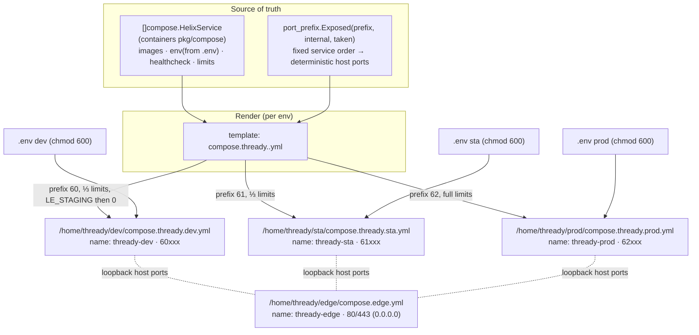

<!--
  Title           : Helix Thready — Complete Rootless Podman Compose Files (per environment)
  Classification  : PUBLIC
  Location        : docs/public/research/mvp/deployment/compose-files.md
  Status          : Review — v0.1
  Revision        : 1 (2026-07-22)
  Author          : Helix Thready documentation swarm (deployment)
  Related         : ./index.md, ./podman-compose.md, ./container-topology.md,
                    ./service-discovery-ports.md, ./environments.md,
                    ./secrets-and-config.md, ./tls-lets-encrypt.md
-->

# Helix Thready — Complete Rootless Podman Compose Files (per environment)

| Rev | Date | Author | Change |
|-----|------|--------|--------|
| 1 | 2026-07-22 | swarm (deployment) | Full copy-paste-ready edge + dev/sta/prod compose YAML, buildnew profile, healthchecks, resource limits, loopback bindings, generator step |

This document is the **concrete, implementation-ready** compose layer: the complete rootless
Podman Compose YAML for the host-wide **edge** and for each of the three environment stacks
(`dev` / `sta` / `prod`). Where [podman-compose.md](./podman-compose.md) specifies the *runtime
mechanism* (the `containers` orchestration API, boot gating) and
[container-topology.md](./container-topology.md) specifies *what services exist*, this document is
the **rendered artifact** an operator drops onto the host under `/home/thready/<env>/`.

Every port literal here is the **verified `port_prefix` mapping** from
[service-discovery-ports.md §4](./service-discovery-ports.md#4-the-deterministic-port-plan); every
credential is injected from the environment (`.env`, `chmod 600`) per
[secrets-and-config.md](./secrets-and-config.md) — **never a literal**.

> Diagram source: sibling under [`diagrams/`](./diagrams/). Rendered PNG/SVG exported via Docs Chain (§11.4.65).

## Table of Contents

1. [How these files are produced (generated, not hand-drifted)](#1-how-these-files-are-produced-generated-not-hand-drifted)
2. [Compose-file composition diagram](#2-compose-file-composition-diagram)
3. [Edge compose (`compose.edge.yml`)](#3-edge-compose-composeedgeyml)
4. [Production stack (`compose.thready.prod.yml`)](#4-production-stack-composethreadyprodyml)
5. [Rendering dev and sta (the deltas)](#5-rendering-dev-and-sta-the-deltas)
6. [The BUILD-NEW profile in the file](#6-the-build-new-profile-in-the-file)
7. [Prometheus scrape config sibling](#7-prometheus-scrape-config-sibling)
8. [Validation before first boot](#8-validation-before-first-boot)
9. [Verified vs assumed](#9-verified-vs-assumed)
10. [Open items](#10-open-items)

---

## 1. How these files are produced (generated, not hand-drifted)

The three per-environment files are **the same template rendered three times** with the environment's
`port_prefix` band and resource fractions substituted. This matches the verified design in
[service-discovery-ports.md §7](./service-discovery-ports.md#7-health--registration-wiring): *"Deploy
computes each service's host port via `port_prefix.Exposed` in fixed order → writes them into the
compose file's `ports:` and the release manifest."* Two supported production paths, both
`[VERIFIED]` against `vasic-digital/containers`:

- **Programmatic (preferred):** build the stack as a `[]compose.HelixService` and render it with
  `compose.NewHelixComposeProject("thready-"+env, services)` (verified
  `pkg/compose/helix_project.go`), so the `HelixResourceLimits`/`HelixHealthCheck`/`PortMapping`
  structs are the single source of truth and the host ports come from `portprefix.Exposed`. See
  [container-topology.md §10](./container-topology.md#10-modelling-the-stack-with-the-containers-api).
- **Hand-authored to the same shape (shown here):** the literal YAML below, kept byte-identical to
  what the generator emits, so an operator can read and diff it. The `name:` key namespaces every
  container/network/volume as `thready-<env>` so the three stacks cannot collide.

> **Anti-drift rule `[GAP: #12]`.** The compose files are **build artifacts**, not a second source of
> truth. If the `[]HelixService` model and a hand-authored file disagree, the model wins and the file
> is regenerated. The [deploy pre-flight](./deploy-and-rollback.md#4-the-deploy-script-bash--go-gate)
> refuses to promote a stack whose rendered ports do not match the release manifest.

## 2. Compose-file composition diagram



**Explanation (for readers/models that cannot see the diagram).** The top band is the **single
source of truth**: a `[]compose.HelixService` slice (the verified `containers` model that carries each
service's image, environment references, health check and resource limits) together with the
`port_prefix.Exposed` function that computes deterministic host ports from a fixed service order. These
two inputs feed one **template**, which is the only thing that ever changes between environments.

The middle-to-bottom flow shows the template being **rendered three times**. For `dev` it is rendered
with band prefix `60`, roughly one-third of the production resource limits, and `LE_STAGING=1` on the
first pass (then `0`); for `sta` with prefix `61` and the same reduced limits; for `prod` with prefix
`62` and the full baseline limits. The output of each render is a concrete file placed under that
environment's directory, with the compose `name:` set to `thready-<env>` so the container, network and
volume namespaces are disjoint. Because only the prefix and the limit fractions differ, `sta` is a
faithful mirror of `prod` — the same images, the same topology, the same health gates — which is
exactly what makes staging a trustworthy pre-production step.

The **edge** file is rendered separately and once: it is the only host-wide, `0.0.0.0`-bound stack
(ports 80/443), and it reaches each environment over the loopback host ports the three env files
publish (`62443`, `61443`, `60443`, …). Finally, each rendered file is bound to its own
`chmod 600` `.env`, from which every credential and the port prefix are injected at runtime — no
secret and no environment-specific literal is ever baked into a tracked file.

## 3. Edge compose (`compose.edge.yml`)

The edge is the **only** stack bound to public `0.0.0.0`. Its ACME is disabled — certs come from
`lets_encrypt` (see [tls-lets-encrypt.md](./tls-lets-encrypt.md)) — and it hot-reloads on
`podman kill -s HUP caddy`, the rootless idiom the `lets_encrypt` `deploy-hook.sh` runs as
`LE_RELOAD_CMD` `[VERIFIED: lets_encrypt/scripts/deploy-hook.sh]`.

```yaml
# /home/thready/edge/compose.edge.yml
name: thready-edge
services:
  caddy:
    image: docker.io/library/caddy:2.8-alpine
    container_name: caddy                       # stable name so `podman kill -s HUP caddy` targets it
    ports:
      - "0.0.0.0:80:80"                          # HTTP-01 challenge + HTTPS redirect
      - "0.0.0.0:443:443/tcp"                     # HTTP/1.1 + HTTP/2
      - "0.0.0.0:443:443/udp"                     # HTTP/3 (QUIC) — needs udp/443 open (firewall §5)
    volumes:
      - ./Caddyfile:/etc/caddy/Caddyfile:ro,Z
      - ./certs:/certs:ro,Z                       # dev/ sta/ prod/ cert dirs installed by lets_encrypt
      - /var/www/acme:/var/www/acme:ro,Z          # shared ACME webroot (HTTP-01)
      - thready-edge-data:/data:Z
      - thready-edge-config:/config:Z
    healthcheck:
      test: ["CMD", "wget", "-qO-", "http://127.0.0.1:2019/config/"]  # Caddy admin API liveness
      interval: 10s
      timeout: 5s
      retries: 5
      start_period: 10s
    restart: unless-stopped
volumes:
  thready-edge-data:
  thready-edge-config:
```

> The `:Z` mount flag relabels the volume for SELinux under rootless Podman — omit on non-SELinux
> hosts. The Caddyfile itself is in [environments.md §4](./environments.md#4-the-edge-reverse-proxy).

## 4. Production stack (`compose.thready.prod.yml`)

The complete production stack. All host ports are `127.0.0.1`-only in the **prod band `62`**
(verified mapping, [service-discovery-ports.md §4](./service-discovery-ports.md#4-the-deterministic-port-plan)),
every credential comes from `env_file: ./.env`, health checks match the `containers`
`DefaultHelixServices()` idioms `[VERIFIED: pkg/compose/helix_project.go]`, and resource limits are the
prod baseline from [container-topology.md §7](./container-topology.md#7-resource-limits).

```yaml
# /home/thready/prod/compose.thready.prod.yml
# Rendered from the []compose.HelixService model with port_prefix band=62, full limits.
# Every credential is injected from ./.env (chmod 600, gitignored) — NEVER a literal.
name: thready-prod

x-restart: &restart unless-stopped
x-logging: &logging
  driver: json-file
  options: { max-size: "50m", max-file: "5" }    # bounded logs; ClickHouse holds the durable copy

services:

  # ---------- data plane (loopback host ports only) ----------
  thready-postgres:
    image: docker.io/pgvector/pgvector:pg17        # pg17 + pgvector; see [OPEN: pgvector-image]
    env_file: ./.env
    environment:
      POSTGRES_USER: ${THREADY_PG_USER}
      POSTGRES_PASSWORD: ${THREADY_PG_PASSWORD}
      POSTGRES_DB: thready
    command: >
      postgres -c wal_level=replica -c archive_mode=on
               -c archive_command='rclone copyto %p thready-secondary:wal/prod/%f'
               -c archive_timeout=3600 -c max_wal_senders=3
    ports: ["127.0.0.1:62432:5432"]
    volumes:
      - thready-prod-pgdata:/var/lib/postgresql/data:Z
      - thready-prod-pgwal:/var/lib/postgresql/wal:Z
    healthcheck:
      test: ["CMD-SHELL", "pg_isready -U $${POSTGRES_USER} -d thready"]
      interval: 5s
      timeout: 5s
      retries: 5
      start_period: 15s
    deploy: { resources: { limits: { cpus: "6.0", memory: 24g }, reservations: { memory: 8g } } }
    pids_limit: 512
    logging: *logging
    restart: *restart
    networks: [thready-prod-net]

  thready-redis:
    image: docker.io/library/redis:7-alpine
    command: ["redis-server", "--save", "", "--appendonly", "no"]  # cache only; rebuildable
    ports: ["127.0.0.1:62379:6379"]
    volumes: ["thready-prod-redis:/data:Z"]
    healthcheck:
      test: ["CMD", "redis-cli", "ping"]
      interval: 5s
      timeout: 3s
      retries: 5
    deploy: { resources: { limits: { cpus: "1.0", memory: 2g } } }
    logging: *logging
    restart: *restart
    networks: [thready-prod-net]

  thready-nats:
    image: docker.io/library/nats:2.10-alpine
    command: ["-js", "-sd", "/data", "-m", "8222"]   # JetStream + monitoring endpoint on 8222
    ports:
      - "127.0.0.1:62222:4222"
      - "127.0.0.1:62223:8222"                        # 8222 mod 1000 collides with 4222→probe→…223
    volumes: ["thready-prod-nats:/data:Z"]
    healthcheck:
      test: ["CMD-SHELL", "wget -qO- http://localhost:8222/healthz || exit 1"]
      interval: 5s
      timeout: 3s
      retries: 5
    deploy: { resources: { limits: { cpus: "2.0", memory: 4g } } }
    logging: *logging
    restart: *restart
    networks: [thready-prod-net]

  thready-minio:
    image: docker.io/minio/minio:latest              # pin by digest in the real file
    command: ["server", "/data", "--console-address", ":9001"]
    env_file: ./.env
    environment:
      MINIO_ROOT_USER: ${THREADY_MINIO_ROOT_USER}
      MINIO_ROOT_PASSWORD: ${THREADY_MINIO_ROOT_PASSWORD}
    ports:
      - "127.0.0.1:62000:9000"
      - "127.0.0.1:62001:9001"
    volumes: ["thready-prod-minio:/data:Z"]
    healthcheck:
      test: ["CMD-SHELL", "curl -fsS http://localhost:9000/minio/health/ready || exit 1"]
      interval: 10s
      timeout: 5s
      retries: 5
      start_period: 20s
    deploy: { resources: { limits: { cpus: "2.0", memory: 4g } } }
    logging: *logging
    restart: *restart
    networks: [thready-prod-net]

  thready-clickhouse:
    image: docker.io/clickhouse/clickhouse-server:24-alpine
    ports:
      - "127.0.0.1:62123:8123"
      - "127.0.0.1:62009:9009"
    volumes: ["thready-prod-clickhouse:/var/lib/clickhouse:Z"]
    ulimits: { nofile: { soft: 262144, hard: 262144 } }
    healthcheck:
      test: ["CMD-SHELL", "wget -qO- http://localhost:8123/ping || exit 1"]
      interval: 10s
      timeout: 5s
      retries: 5
    deploy: { resources: { limits: { cpus: "2.0", memory: 4g } } }
    logging: *logging
    restart: *restart
    networks: [thready-prod-net]

  # ---------- application plane (FOUNDATION services) ----------
  thready-api:
    image: localhost/thready-api:${THREADY_VERSION}   # digest-pinned in the release manifest
    env_file: ./.env
    depends_on: [thready-postgres, thready-redis, thready-nats, thready-minio]
    ports: ["127.0.0.1:62443:8443"]
    healthcheck:
      test: ["CMD-SHELL", "wget -qO- http://localhost:8443/health/ready || exit 1"]
      interval: 10s
      timeout: 5s
      retries: 5
      start_period: 20s
    deploy: { resources: { limits: { cpus: "2.0", memory: 2g } } }
    logging: *logging
    restart: *restart
    networks: [thready-prod-net]

  thready-web:
    image: localhost/thready-web:${THREADY_VERSION}
    depends_on: [thready-api]
    ports: ["127.0.0.1:62088:8088"]
    healthcheck:
      test: ["CMD-SHELL", "wget -qO- http://localhost:8088/ || exit 1"]
      interval: 15s
      timeout: 5s
      retries: 5
    deploy: { resources: { limits: { cpus: "0.5", memory: 256m } } }
    logging: *logging
    restart: *restart
    networks: [thready-prod-net]

  thready-herald:
    image: localhost/thready-herald:${THREADY_VERSION}
    env_file: ./.env
    depends_on: [thready-postgres, thready-nats]
    ports: ["127.0.0.1:62080:7080"]
    healthcheck:
      test: ["CMD-SHELL", "wget -qO- http://localhost:7080/health/ready || exit 1"]
      interval: 10s
      timeout: 5s
      retries: 5
      start_period: 20s
    deploy: { resources: { limits: { cpus: "1.0", memory: 1g } } }
    logging: *logging
    restart: *restart
    networks: [thready-prod-net]

  thready-processing:
    image: localhost/thready-processing:${THREADY_VERSION}
    env_file: ./.env
    environment:
      HELIX_EMBEDDING_PROVIDER: ${HELIX_EMBEDDING_PROVIDER}   # GAP #1 — must be "llama"
      THREADY_BG_WORKERS: "32"                                 # prod worker count (Q4)
    depends_on: [thready-postgres, thready-nats, thready-redis]
    # internal-only: no host port published (see topology §3)
    healthcheck:
      test: ["CMD-SHELL", "wget -qO- http://localhost:8080/health/ready || exit 1"]
      interval: 10s
      timeout: 5s
      retries: 5
      start_period: 20s
    deploy: { resources: { limits: { cpus: "4.0", memory: 8g } } }
    logging: *logging
    restart: *restart
    networks: [thready-prod-net]

  # ---------- 3rd-party download workers ----------
  boba:
    image: localhost/boba:${BOBA_VERSION}
    ports: ["127.0.0.1:62002:8000"]                 # 8000 mod 1000 collides with minio 9000→probe→…002
    volumes: ["thready-prod-boba:/downloads:Z"]
    deploy: { resources: { limits: { cpus: "1.0", memory: 1g } } }
    logging: *logging
    restart: *restart
    networks: [thready-prod-net]

  metube:
    image: localhost/metube:${METUBE_VERSION}
    ports: ["127.0.0.1:62091:8091"]
    volumes: ["thready-prod-metube:/downloads:Z"]
    deploy: { resources: { limits: { cpus: "1.0", memory: 1g } } }
    logging: *logging
    restart: *restart
    networks: [thready-prod-net]

  # ---------- observability (per env) ----------
  thready-prometheus:
    image: docker.io/prom/prometheus:v2.50.0
    command: ["--config.file=/etc/prometheus/prometheus.yml", "--storage.tsdb.retention.time=15d"]
    ports: ["127.0.0.1:62090:9090"]
    volumes:
      - ./config/prometheus:/etc/prometheus:ro,Z
      - thready-prod-prometheus:/prometheus:Z
    healthcheck:
      test: ["CMD-SHELL", "wget -qO- http://localhost:9090/-/healthy || exit 1"]
      interval: 15s
      timeout: 5s
      retries: 5
    deploy: { resources: { limits: { cpus: "1.0", memory: 2g } } }
    logging: *logging
    restart: *restart
    networks: [thready-prod-net]

  thready-grafana:
    image: docker.io/grafana/grafana:10.4.0
    env_file: ./.env
    environment:
      GF_SECURITY_ADMIN_USER: ${THREADY_GRAFANA_ADMIN_USER}
      GF_SECURITY_ADMIN_PASSWORD: ${THREADY_GRAFANA_ADMIN_PASSWORD}
    depends_on: [thready-prometheus]
    ports: ["127.0.0.1:62003:3000"]                 # 3000 mod 1000 collides with minio 9000→probe→…003
    volumes: ["thready-prod-grafana:/var/lib/grafana:Z"]
    healthcheck:
      test: ["CMD-SHELL", "wget -qO- http://localhost:3000/api/health || exit 1"]
      interval: 15s
      timeout: 5s
      retries: 5
    deploy: { resources: { limits: { cpus: "0.5", memory: 512m } } }
    logging: *logging
    restart: *restart
    networks: [thready-prod-net]

  thready-jaeger:
    image: docker.io/jaegertracing/all-in-one:1.55
    environment: { COLLECTOR_OTLP_ENABLED: "true" }
    ports:
      - "127.0.0.1:62686:16686"                     # UI
      - "127.0.0.1:62317:4317"                       # OTLP gRPC (loopback; scraped in-network)
    deploy: { resources: { limits: { cpus: "0.5", memory: 1g } } }
    logging: *logging
    restart: *restart
    networks: [thready-prod-net]

  # ---------- BUILD-NEW placeholders (kept OUT of a default `up` by the profile) ----------
  thready-assetsvc:
    image: localhost/thready-assetsvc:${THREADY_VERSION}
    profiles: ["buildnew"]                           # [GAP: #9/#20] not started by default
    env_file: ./.env
    depends_on: [thready-minio, thready-postgres]
    ports: ["127.0.0.1:62081:8081"]
    networks: [thready-prod-net]
  thready-downloadmgr:
    image: localhost/thready-downloadmgr:${THREADY_VERSION}
    profiles: ["buildnew"]                           # [GAP: #4/#20]
    env_file: ./.env
    ports: ["127.0.0.1:62082:8082"]
    networks: [thready-prod-net]
  thready-usersvc:
    image: localhost/thready-usersvc:${THREADY_VERSION}
    profiles: ["buildnew"]                           # [GAP: #20]
    env_file: ./.env
    depends_on: [thready-postgres]
    ports: ["127.0.0.1:62083:8083"]
    networks: [thready-prod-net]
  thready-eventbus-svc:
    image: localhost/thready-eventbus-svc:${THREADY_VERSION}
    profiles: ["buildnew"]                           # [GAP: #20]
    env_file: ./.env
    depends_on: [thready-nats]
    ports: ["127.0.0.1:62084:8084"]
    networks: [thready-prod-net]
  thready-semsearch:
    image: localhost/thready-semsearch:${THREADY_VERSION}
    profiles: ["buildnew"]                           # [GAP: #20 + #1 embedder]
    env_file: ./.env
    environment:
      HELIX_EMBEDDING_PROVIDER: ${HELIX_EMBEDDING_PROVIDER}   # GAP #1 — must be "llama"
      HELIX_LLM_BASE_URL: ${HELIX_LLM_BASE_URL}
    depends_on: [thready-postgres]
    ports: ["127.0.0.1:62085:8085"]
    networks: [thready-prod-net]

networks:
  thready-prod-net:
    driver: bridge                                    # rootless: netavark + aardvark-dns in-network DNS

volumes:
  thready-prod-pgdata:
  thready-prod-pgwal:
  thready-prod-redis:
  thready-prod-nats:
  thready-prod-minio:
  thready-prod-clickhouse:
  thready-prod-prometheus:
  thready-prod-grafana:
  thready-prod-boba:
  thready-prod-metube:
```

> **Escaping note.** Inside a compose `healthcheck.test` the `$${POSTGRES_USER}` double-dollar is
> compose-escaped so the *container's* shell expands it, not the compose renderer — matching the
> verified `DefaultHelixServices()` `pg_isready` idiom. Application host ports use `${THREADY_VERSION}`
> which *is* rendered by compose from `.env`.

## 5. Rendering dev and sta (the deltas)

`dev` and `sta` are the **same file** with three mechanical substitutions. Do **not** maintain three
divergent files by hand — render them.

| Knob | prod | sta | dev |
|------|------|-----|-----|
| `name:` | `thready-prod` | `thready-sta` | `thready-dev` |
| host-port band (all `ports:` first field) | `62xxx` | `61xxx` | `60xxx` |
| network / volume prefix | `thready-prod-*` | `thready-sta-*` | `thready-dev-*` |
| `deploy.resources.limits` | full baseline | ≈ ⅓ | ≈ ⅓ |
| `THREADY_BG_WORKERS` | `32` | `16` | `8` |
| `archive_command` target | `…:wal/prod/%f` | `…:wal/sta/%f` | `…:wal/dev/%f` |
| Prometheus retention | `15d` | `10d` | `5d` |

The band substitution is exactly the [verified port plan](./service-discovery-ports.md#4-the-deterministic-port-plan):
`5432→6X432`, `4222→6X222`, `9000→6X000`, `8443→6X443`, with the three documented collision probes
(`8222→6X223`, `8000→6X002`, `3000→6X003`). Generate with the `port_prefix` CLI and a template, e.g.:

```bash
# render-compose.sh <env> <prefix>  — regenerate one env file from the template (idempotent).
ENV="$1"; PREFIX="$2"
# 1. Compute the host ports deterministically (fixed service order → reproducible).
eval "$(port_prefix --prefix "$PREFIX" \
        --ports 5432,6379,4222,8222,9000,9001,8123,9009,8443,8088,7080,8081,8082,8083,8084,8085,8000,8091,9090,3000,16686,4317 \
        --export)"                                   # exports PP_5432=6X432 … for the template
# 2. Render the template with the env name + computed ports + resource fraction.
env THREADY_ENV="$ENV" PP_PREFIX="$PREFIX" \
    envsubst < templates/compose.thready.tmpl.yml > "/home/thready/$ENV/compose.thready.$ENV.yml"
# 3. Sanity: the file must parse and its ports must match the release manifest.
podman-compose -f "/home/thready/$ENV/compose.thready.$ENV.yml" -p "thready-$ENV" config >/dev/null
```

> `--export` / `PP_*` is the deterministic-plan contract described in
> [service-discovery-ports.md](./service-discovery-ports.md); the exact flag name is a
> `[DEFAULT — adjustable]` Thready wrapper over the verified `portprefix.Exposed` core. dev/sta reduce
> `deploy.resources.limits` to roughly one-third so prod keeps headroom on the shared host
> ([container-topology.md §7](./container-topology.md#7-resource-limits)).

## 6. The BUILD-NEW profile in the file

The five `[BUILD-NEW]` services carry `profiles: ["buildnew"]`. A default
`podman-compose -p thready-prod up -d` **does not** start them, so the stack never presents an empty
placeholder as if it were working `[GAP: #20]`. They are brought up only when explicitly selected:

```bash
# Default up — buildnew services are EXCLUDED (the honest, no-bluff default).
podman-compose -p thready-prod up -d

# Only once a placeholder is really built and its image exists:
podman-compose -p thready-prod --profile buildnew up -d thready-semsearch
```

The [post-deploy anti-bluff gate](./deploy-and-rollback.md#7-post-deploy-verification-anti-bluff-gate)
asserts *no* `buildnew` container is running in a promoted prod stack unless its gap is closed and its
`/health/ready` proves real behaviour (e.g. `thready-semsearch` fails if `HELIX_EMBEDDING_PROVIDER`
is not `llama`, per [GAP: #1]).

## 7. Prometheus scrape config sibling

Each env's `thready-prometheus` mounts `./config/prometheus/`. The scrape targets are the
in-network compose DNS names (not host ports), so a dev Prometheus can never scrape prod:

```yaml
# /home/thready/prod/config/prometheus/prometheus.yml
global: { scrape_interval: 15s, external_labels: { env: prod } }
rule_files: ["rules/backup-integrity.rules.yml"]     # see backup-dr.md §8
scrape_configs:
  - job_name: thready-api
    static_configs: [{ targets: ["thready-api:8443"], labels: { env: prod } }]
  - job_name: thready-herald
    static_configs: [{ targets: ["thready-herald:7080"], labels: { env: prod } }]
  - job_name: thready-processing
    metrics_path: /metrics
    static_configs: [{ targets: ["thready-processing:8080"], labels: { env: prod } }]
  - job_name: thready-postgres
    static_configs: [{ targets: ["thready-postgres:9187"], labels: { env: prod } }]  # postgres_exporter (if enabled)
  - job_name: pushgateway
    honor_labels: true
    static_configs: [{ targets: ["thready-pushgateway:9091"], labels: { env: prod } }]  # backup scripts push here
```

The backup scripts push their `thready_backup_*` timestamps to the (per-env) Pushgateway, which is
what the `WALArchiveStalled` / `DailyBaseBackupMissing` alerts in
[backup-dr.md §8](./backup-dr.md#8-chaos--dr-validation) evaluate.

## 8. Validation before first boot

Every rendered file is validated before it is ever `up`'d — this is a deploy pre-flight gate:

```bash
# 1. Structural: compose must parse and interpolate cleanly (fails on a missing .env var).
podman-compose -f compose.thready.prod.yml -p thready-prod config >/dev/null

# 2. No secret literal leaked into the file (defence in depth vs. the pre-commit hook).
! grep -nE '(PASSWORD|SECRET|TOKEN|KEY)\s*:\s*["'"'"']?[A-Za-z0-9]{6,}' compose.thready.prod.yml \
  || { echo "FATAL: literal secret in compose file"; exit 1; }

# 3. Ports match the release manifest (anti-drift with the port plan).
thready-verify-ports --env prod --compose compose.thready.prod.yml --manifest releases/current.json
```

`podman-compose … config` is the compose-native lint; it hard-fails if any `${VAR}` referenced by the
file is absent from `./.env`, which is precisely the "fail fast on a missing secret" behaviour the
`mustEnv` rule enforces on the programmatic path
([container-topology.md §10](./container-topology.md#10-modelling-the-stack-with-the-containers-api)).

## 9. Verified vs assumed

- **VERIFIED (read at source):** the `HelixService`/`PortMapping`/`HelixHealthCheck`/
  `HelixResourceLimits` structs and `NewHelixComposeProject`/`DefaultHelixServices` shape
  (`pkg/compose/helix_project.go`); the health-probe idioms (`pg_isready`, `redis-cli ping`,
  `wget …:8222/healthz`, `…/api/health`, `…/-/healthy`); the `podman kill -s HUP caddy` reload target
  and the `LE_RELOAD_CMD` deploy-hook contract (`lets_encrypt/scripts/deploy-hook.sh`); the band port
  literals (verified `port_prefix` plan).
- **ASSUMED / `[DEFAULT — adjustable]`:** the exact image tags for Thready's *own* services (built
  from each submodule `Containerfile`); the `pgvector/pgvector:pg17` choice vs `postgres:17-alpine +
  extension` ([OPEN: pgvector-image]); MinIO `latest` (pin by digest before prod); the `render-compose.sh`
  / `--export` / `thready-verify-ports` wrapper names (Thready conventions, not module APIs); the
  `json-file` log rotation sizes and reservations.

## 10. Open items

- `[OPEN: pgvector-image]` — `pgvector/pgvector:pg17` (used above) vs `postgres:17-alpine` + the
  extension added at build time; both satisfy the topology. Owned by the [database](../database/index.md) area.
- `[OPEN: minio-digest]` — pin `minio/minio` to a specific digest for prod (the file uses `latest`
  for readability); a `[DEFAULT — adjustable]` operational step.
- `[OPEN: postgres-exporter]` — whether to add `postgres_exporter` (scrape job shown) or scrape
  Postgres metrics another way is an observability-area choice; the scrape stub is inert until present.
- `[OPEN: buildnew-images]` — the five `buildnew`-profile services have no real images until their
  P0/P1 gaps are built; the profile keeps them out of a default `up`
  ([container-topology.md §8](./container-topology.md#8-build-new-placeholders-no-bluff)).

---

*Made with love ♥ by Helix Development.*
