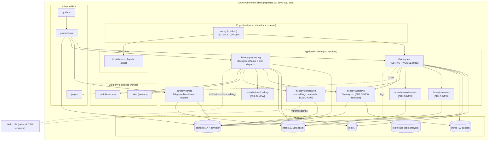

<!--
  Title           : Helix Thready — Container Topology
  Classification  : PUBLIC
  Location        : docs/public/research/mvp/deployment/container-topology.md
  Status          : Draft — v0.1
  Revision        : 1 (2026-07-21)
  Author          : Helix Thready documentation swarm (deployment)
  Related         : ./index.md, ./podman-compose.md, ./service-discovery-ports.md,
                    ../architecture/index.md
-->

# Helix Thready — Container Topology

| Rev | Date | Author | Change |
|-----|------|--------|--------|
| 1 | 2026-07-21 | swarm (deployment) | Initial per-environment service inventory, images, networks, volumes, limits |

This document is the authoritative inventory of **what containers make up one Helix Thready
environment**, the images they run, how they are networked and volumed, their resource limits,
and which of them are **BUILD-NEW placeholders** that do not yet run real code. The same stack is
instantiated three times (dev / sta / prod), each in its own Podman Compose project and its own
[host-port band](./service-discovery-ports.md).

> Diagram source: sibling under [`diagrams/`](./diagrams/). Rendered PNG/SVG exported via Docs Chain (§11.4.65).

## Table of Contents

1. [Design constraints](#1-design-constraints)
2. [Per-environment topology diagram](#2-per-environment-topology-diagram)
3. [Service inventory](#3-service-inventory)
4. [Container images (pinned)](#4-container-images-pinned)
5. [Networks](#5-networks)
6. [Volumes & persistence](#6-volumes--persistence)
7. [Resource limits](#7-resource-limits)
8. [BUILD-NEW placeholders (no bluff)](#8-build-new-placeholders-no-bluff)
9. [HelixLLM as an external endpoint](#9-helixllm-as-an-external-endpoint)
10. [Modelling the stack with the containers API](#10-modelling-the-stack-with-the-containers-api)
11. [Open items](#11-open-items)

---

## 1. Design constraints

- **Rootless Podman only** — every container runs under the unprivileged `thready` user; no
  Docker daemon, no root, no `sudo` `[CONSTITUTION §11.4.76/161]`.
- **Full environment separation** — no container, network, volume or port is shared between
  `dev`, `sta` and `prod` (`§8.2`). The only host-wide shared component is the single edge reverse
  proxy that fans out by subdomain (see [environments.md](./environments.md)).
- **In-house first** — the data/infra containers are the standard images the `containers` module's
  `DefaultHelixServices()` already uses (Postgres, Redis, NATS, Prometheus, Grafana, Jaeger), plus
  MinIO and ClickHouse for Thready's asset and analytics needs `[IN-HOUSE: containers]`.
- **Large-scale posture** — assets on a MinIO/S3 object tier (50 TB+), Postgres partitioned for
  10k+ posts/day, JetStream as the primary event transport `[OPERATOR: scale]`.

> **Anti-bluff note.** `vasic-digital/containers` ships a `DefaultHelixServices()` helper that
> hardcodes **dev-only** credentials (`POSTGRES_PASSWORD=helix`, `GF_SECURITY_ADMIN_PASSWORD=admin`,
> a Vault dev root token) as *documented fallback defaults for local bring-up only*. Thready **does
> not** use that 20-service dev stack verbatim; it constructs its own `[]HelixService` and injects
> every credential from the environment (see [secrets-and-config.md](./secrets-and-config.md)).
> `[GAP: #12 anti-bluff]`

## 2. Per-environment topology diagram



**Explanation (for readers/models that cannot see the diagram).** The box labelled *EnvStack* is
one complete environment; it is created three times, once per environment, in disjoint port bands.
The single host-wide **edge** (Caddy) is drawn inside the box for context but is actually shared —
it is the only component bound to the public 80/443 and it forwards to each environment's
`thready-api` and static `thready-web` by subdomain.

The **application plane** is Thready's own Go services. `thready-api` is the public surface: the
REST `/v1` API plus the WebSocket/SSE hub, served over HTTP/3 via `vasic-digital/http3`. `thready-herald`
is the extended Herald that reads Telegram (via `gotd/td` MTProto) and Max threads and writes raw
posts to Postgres while emitting `post.received` onto NATS JetStream. `thready-processing` is the
engine: it consumes those events through a Postgres-backed BackgroundTasks queue (idempotent
single-claim per post), classifies by hashtag/content-type, and dispatches the matching Skill(s) —
calling out to `thready-assetsvc` (Catalogizer-based asset store), `thready-downloadmgr` (generic
downloads), `thready-semsearch` (embeddings + pgvector), and the 3rd-party workers `boba` (torrents)
and `metube` (video). `thready-usersvc` (three-tier RBAC), `thready-eventbus-svc` (client-facing
subscription), and `thready-semsearch` back the API.

The **data plane** holds the stateful containers: PostgreSQL with the pgvector extension (both the
system-of-record *and* the vector store live in one instance, per `§2.1.1`), Redis for the cache
tier, NATS with JetStream for durable events, MinIO for the 50 TB+ asset object store, and
ClickHouse for observability analytics. The **observability** trio (Prometheus scraping every Go
service's `/metrics`, Grafana for dashboards, Jaeger for OTLP traces) is deployed per environment
so a dev incident can never perturb prod telemetry. Finally, because the GPU lives on the operator
workstation, **HelixLLM sits outside the compose file** and is reached as an external endpoint over
its OpenAI-compatible `/v1/chat/completions` and `/v1/embeddings` routes — this is why the arrows to
`LLM` are dotted and cross the environment boundary.

## 3. Service inventory

Legend — **Kind**: `data` (stateful infra) · `app` (Thready Go service) · `worker` (3rd-party) ·
`obs` (observability) · `edge` (host-wide). **Host-exposed**: whether a host port is published
(all host ports are bound to `127.0.0.1` inside the env's band, except the edge). **Status** per the
gap register.

| Service | Kind | Internal port | Host-exposed | Status | Provenance |
|---------|------|---------------|--------------|--------|------------|
| `caddy` (edge) | edge | 80, 443 (TCP+UDP) | **yes, `0.0.0.0`** | PRODUCTION | `[IN-HOUSE: lets_encrypt reload target]` |
| `thready-postgres` | data | 5432 | loopback | PRODUCTION | `[IN-HOUSE: database]` |
| `thready-redis` | data | 6379 | loopback | PRODUCTION | `[IN-HOUSE: cache]` |
| `thready-nats` | data | 4222 (mon 8222) | loopback | PRODUCTION | `[IN-HOUSE: eventbus]` |
| `thready-minio` | data | 9000 (console 9001) | loopback | PRODUCTION | `[IN-HOUSE: storage]` |
| `thready-clickhouse` | data | 8123 (native 9009) | loopback | PRODUCTION | `[IN-HOUSE: observability]` |
| `thready-api` | app | 8443 | loopback | FOUNDATION | `[IN-HOUSE: http3, auth, middleware]` |
| `thready-web` | app | 8088 | loopback | FOUNDATION | `[IN-HOUSE: design_system]` |
| `thready-herald` | app | 7080 | loopback | FOUNDATION (Telegram) / **P0 gap** (Max) | `[GAP: #3 herald]` |
| `thready-processing` | app | — (internal) | no | **P0 gap** (skill dispatch engine) | `[GAP: #6 skills]` |
| `thready-assetsvc` | app | 8081 | loopback | **BUILD-NEW (decouple)** | `[GAP: #9/#20]` |
| `thready-downloadmgr` | app | 8082 | loopback | **BUILD-NEW** | `[GAP: #4/#20]` |
| `thready-usersvc` | app | 8083 | loopback | **BUILD-NEW** | `[GAP: #20]` |
| `thready-eventbus-svc` | app | 8084 | loopback | **BUILD-NEW** | `[GAP: #20]` |
| `thready-semsearch` | app | 8085 | loopback | **BUILD-NEW** | `[GAP: #20 + #1 embedder]` |
| `boba` | worker | 8000 | loopback | FOUNDATION | `[IN-HOUSE: Boba]` |
| `metube` | worker | 8091 | loopback | FOUNDATION / **P0 gap** (webhook) | `[GAP: #5 metube]` |
| `thready-prometheus` | obs | 9090 | loopback | PRODUCTION | `[IN-HOUSE: observability]` |
| `thready-grafana` | obs | 3000 | loopback | PRODUCTION | `[IN-HOUSE: observability]` |
| `thready-jaeger` | obs | 16686 (OTLP 4317) | loopback | PRODUCTION | `[IN-HOUSE: observability]` |

> **Why loopback host-ports?** Inter-container traffic uses the compose network and DNS names
> (`thready-postgres:5432`), so almost nothing *needs* a host port. Host ports are published on
> `127.0.0.1` only for (a) the edge→api hop, (b) operator debugging over an SSH tunnel, and (c)
> Prometheus scraping — never on `0.0.0.0` except the edge. This keeps the attack surface to ports
> 22/80/443 (see [hetzner-provisioning.md](./hetzner-provisioning.md) firewall).

## 4. Container images (pinned)

Images are pinned by digest in the real compose files; tags shown here for readability. Thready
application images are built locally from each submodule's `Containerfile` and tagged
`THREADY-<component>-<version>` (project-prefixed tags, `§11.4.151`).

| Service | Image (tag) | Source |
|---------|-------------|--------|
| `caddy` | `docker.io/library/caddy:2.8-alpine` | upstream (edge only; ACME disabled — certs come from `lets_encrypt`) |
| `thready-postgres` | `docker.io/library/postgres:17-alpine` + `pgvector` | upstream + extension |
| `thready-redis` | `docker.io/library/redis:7-alpine` | upstream |
| `thready-nats` | `docker.io/library/nats:2.10-alpine` | upstream (JetStream enabled) |
| `thready-minio` | `docker.io/minio/minio:latest` (pin digest) | upstream |
| `thready-clickhouse` | `docker.io/clickhouse/clickhouse-server:24-alpine` | upstream |
| `thready-api` etc. | `localhost/thready-<component>:THREADY-<ver>` | built from the submodule `Containerfile` |
| `boba` | `localhost/boba:<ver>` | `milos85vasic/Boba-Base` |
| `metube` | `localhost/metube:<ver>` | `milos85vasic/YT-DLP` |
| `thready-prometheus` | `docker.io/prom/prometheus:v2.50.0` | upstream (matches `containers` default) |
| `thready-grafana` | `docker.io/grafana/grafana:10.4.0` | upstream |
| `thready-jaeger` | `docker.io/jaegertracing/all-in-one:1.55` | upstream (`COLLECTOR_OTLP_ENABLED=true`) |

> **VERIFIED:** the Prometheus/Grafana/Jaeger/Postgres/Redis/NATS image choices mirror the pinned
> images in `vasic-digital/containers` `pkg/compose/helix_project.go::DefaultHelixServices()`
> (read at source). MinIO and ClickHouse are Thready additions for the asset tier and log analytics.

## 5. Networks

Each environment declares **one internal bridge network**, isolated per Compose project:

```yaml
# fragment of compose.thready.<env>.yml
networks:
  thready-<env>-net:
    driver: bridge        # rootless: netavark/aardvark-dns provides in-network DNS
    internal: false       # egress allowed (ACME, image pulls, messenger APIs); ingress only via edge
```

- **In-network DNS** resolves service names (`thready-postgres`) automatically under rootless
  Podman via `aardvark-dns`.
- Networks are **not** shared across environments: `thready-dev-net`, `thready-sta-net`,
  `thready-prod-net` are three separate bridges. A container in `dev` cannot reach a container in
  `prod` even by IP.
- The edge proxy joins **all three** networks (plus its own) so it can forward to each env's API,
  or — the default — reaches them via the loopback host-ports in each band, which avoids
  cross-joining and keeps the edge decoupled. `[DEFAULT — adjustable]`

## 6. Volumes & persistence

Named volumes per environment (Podman rootless volumes live under
`/home/thready/.local/share/containers/storage/volumes/`):

| Volume | Mounted by | Contents | Backup class |
|--------|------------|----------|--------------|
| `thready-<env>-pgdata` | `thready-postgres` | Postgres cluster incl. pgvector | **daily full + hourly WAL** |
| `thready-<env>-pgwal` | `thready-postgres` | archived WAL segments (PITR) | **continuous → secondary** |
| `thready-<env>-minio` | `thready-minio` | asset objects (raw + `…-web` renditions) | **daily snapshot/dedup** |
| `thready-<env>-redis` | `thready-redis` | cache (ephemeral, RDB optional) | none (rebuildable) |
| `thready-<env>-nats` | `thready-nats` | JetStream streams/consumers | daily |
| `thready-<env>-clickhouse` | `thready-clickhouse` | logs/metrics analytics | daily (or drop; rebuildable) |
| `thready-<env>-grafana` | `thready-grafana` | dashboards/config | daily |
| `certs` (bind) | `caddy` | live TLS certs from `lets_encrypt` | included in config backup |

Backup classes are defined in [backup-dr.md](./backup-dr.md). Postgres WAL archiving to
`thready-<env>-pgwal` (and onward to the secondary store) is what delivers the RPO ≈ 1 h target.

> `[GAP: #3.2]` **MinIO signed-URL parity.** The gap register flags that `storage`'s CloudFront-style
> signing is AWS-specific; Thready runs self-hosted MinIO, so the deploy checklist includes a
> **signed-URL round-trip test against the deployed MinIO** before assets go live (tracked in
> [backup-dr.md §6](./backup-dr.md)).

## 7. Resource limits

Resource limits use the `containers` `HelixResourceLimits` shape (`CPUs`, `Memory`, `Pids`), which
maps to Podman `--cpus` / `--memory` / `--pids-limit`. Production baseline `[DEFAULT — adjustable]`:

| Service | CPUs | Memory | Notes |
|---------|------|--------|-------|
| `thready-postgres` (prod) | 6.0 | 24 GiB | NVMe-backed; `shared_buffers` ≈ 25 % RAM; pgvector HNSW cache |
| `thready-minio` (prod) | 2.0 | 4 GiB | I/O bound; disk is the constraint |
| `thready-processing` (prod) | 4.0 | 8 GiB | 32 BackgroundTasks workers (Q4) |
| `thready-api` (prod) | 2.0 | 2 GiB | stateless; scale out if p95 > 150 ms |
| `thready-clickhouse` | 2.0 | 4 GiB | analytics only |
| dev / sta each service | ≈ ⅓ of prod | ≈ ⅓ of prod | smaller footprint; three stacks co-reside |

Because all three stacks co-reside on one host, the sum of prod + sta + dev limits must fit the host
(see [hetzner-provisioning.md §2](./hetzner-provisioning.md) for the ≥ 16 vCPU / ≥ 64 GB baseline).
`dev`/`sta` are intentionally throttled so `prod` keeps headroom.

## 8. BUILD-NEW placeholders (no bluff)

The following containers are **declared in the compose files but their images are placeholders** —
they do not yet run production code. They correspond to confirmed `[BUILD-NEW]` gaps (`§4.2.1`,
gap-register §11). Until built, the compose file marks them with `profiles: [buildnew]` so a
default `up` **does not** start a non-working container and pretend the stack is complete.

| Placeholder service | Gap | Blocking? | Plan to close |
|---------------------|-----|-----------|---------------|
| `thready-downloadmgr` | `[GAP: #4 filesystem/Download Manager, P0]` | Yes (media pipeline) | New Go submodule: HTTP/2+3 source + queue/resume/segment/progress/callback reusing `filesystem` |
| `thready-usersvc` | `[GAP: #20, P0]` | Yes (multi-tenant auth) | Build on `auth` + `security/pkg/policy` + Catalogizer RBAC; RS256/EdDSA + TOTP |
| `thready-semsearch` | `[GAP: #20 + #1, P0]` | Yes (search SLO) | `embeddings`+`vectordb`(pgvector)+`MCP_Module` over HelixLLM; **must** set `HELIX_EMBEDDING_PROVIDER=llama` |
| `thready-assetsvc` | `[GAP: #9 decouple, P1]` | Partial | Decouple Asset Service from Catalogizer; add HLS/DASH + `…-web` renditions |
| `thready-eventbus-svc` | `[GAP: #20, P1]` | No (API can read JetStream directly first) | Thin service wrapping `eventbus`/JetStream for client subscription |
| `thready-herald` (Max path) | `[GAP: #3 herald, P0]` | Yes (Max ingest) | Promote MTProto reader to first-class channel; build Max Bot API + OneMe WebSocket Go client |
| `metube` (webhook) | `[GAP: #5 metube, P0]` | Yes (async completion) | Add outbound completion webhook (shared callback schema) |

> **This is the "no bluff" contract in practice:** the deployment never green-lights a stack whose
> `buildnew` profile services are empty shells. The [deploy verification](./deploy-and-rollback.md#7-post-deploy-verification-anti-bluff-gate)
> asserts each *enabled* service passes a **real** health check, not a stub that always returns 200.

## 9. HelixLLM as an external endpoint

HelixLLM is not in the per-environment compose file because the GPU lives on the operator
workstation (Q5). It is registered as a `ServiceEndpoint` (from `containers/pkg/endpoint`) that the
processing/semsearch services resolve at runtime:

```go
// thready processing/semsearch config → containers ServiceEndpoint
llm := endpoint.ServiceEndpoint{
    Host:            "http://gpu-node.helix.lan", // or the workstation tunnel
    Port:            "8080",
    URL:             "http://gpu-node.helix.lan:8080", // OpenAI-compatible base
    Enabled:         true,
    Required:        true,          // semsearch cannot work without it
    Remote:          true,          // NOT managed by the local runtime
    HealthType:      "http",
    HealthPath:      "/health",
    Timeout:         10 * time.Second,
    RetryCount:      3,
    DiscoveryEnabled: true,
    DiscoveryMethod:  "dns",        // or mDNS on the LAN
}
```

`Remote: true` tells the `BootManager` this endpoint is *discovered/health-checked* but never
`compose up`'d locally. If HelixLLM is unreachable at boot, the semantic-search service (which is
`Required`) fails the boot gate loudly rather than silently degrading — consistent with the
`[GAP: #1]` rule that a missing real embedder must **fail, not warn**.

## 10. Modelling the stack with the containers API

Thready's stack is expressed as a `[]compose.HelixService` and driven through the
`containers` orchestrator. The types below are **verified** from
`vasic-digital/containers/pkg/compose/helix_project.go`:

```go
import (
    "time"
    "digital.vasic.containers/pkg/compose"
)

// One environment's Thready data-plane fragment (credentials injected from env — never literals).
func threadyDataPlane(env string) []compose.HelixService {
    return []compose.HelixService{
        {
            Name:  "thready-postgres",
            Image: "docker.io/library/postgres:17-alpine",
            Ports: []compose.PortMapping{{HostPort: 0, ContainerPort: 5432, Protocol: "tcp"}}, // HostPort resolved by port_prefix
            Env: map[string]string{
                "POSTGRES_USER":     mustEnv("THREADY_" + env + "_PG_USER"),
                "POSTGRES_PASSWORD": mustEnv("THREADY_" + env + "_PG_PASSWORD"),
                "POSTGRES_DB":       "thready",
            },
            Volumes: []string{"thready-" + env + "-pgdata:/var/lib/postgresql/data"},
            HealthCheck: &compose.HelixHealthCheck{
                Test:     []string{"CMD-SHELL", "pg_isready -U $POSTGRES_USER -d thready"},
                Interval: 5 * time.Second, Timeout: 5 * time.Second, Retries: 5,
            },
            ResourceLimits: &compose.HelixResourceLimits{CPUs: "6.0", Memory: "24g", Pids: 512},
        },
        // … redis, nats, minio, clickhouse …
    }
}
```

- `HelixService`, `PortMapping`, `HelixHealthCheck`, `HelixResourceLimits` are the exact structs the
  module exposes.
- `NewHelixComposeProject("thready-"+env, services)` builds the project;
  [podman-compose.md](./podman-compose.md) shows how it is rendered and brought up rootlessly.
- `mustEnv` (a Thready helper, not a module function) fails fast if a secret env var is unset — the
  no-hardcoding rule `[CONSTITUTION §11.4.10]`.

## 11. Open items

- `[OPEN: buildnew-images]` — the placeholder services in [§8](#8-build-new-placeholders-no-bluff)
  have no real images yet; the compose `buildnew` profile keeps them out of a default `up`. Tracked
  as ATM workable items in [development](../development/index.md).
- `[OPEN: pgvector-image]` — whether to use `pgvector/pgvector:pg17` directly or add the extension to
  the base `postgres:17-alpine` at build time is a build decision for the database area; both
  satisfy this topology.
- `[GAP: #3.2]` MinIO signed-URL parity test — tracked in [backup-dr.md](./backup-dr.md).

---

*Made with love ♥ by Helix Development.*
