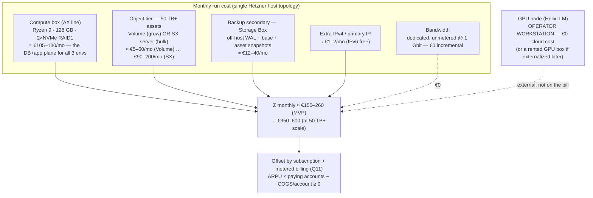

<!--
  Title           : Helix Thready — Cost & Capacity (Hetzner host, object tier, backup, billing offsets)
  Classification  : PUBLIC
  Location        : docs/public/research/mvp/deployment/cost-and-capacity.md
  Status          : Draft — v0.1
  Revision        : 1 (2026-07-22)
  Author          : Helix Thready documentation swarm (deployment)
  Related         : ./index.md, ./hetzner-provisioning.md, ./container-topology.md,
                    ./backup-dr.md, ./environments.md
-->

# Helix Thready — Cost & Capacity

| Rev | Date | Author | Change |
|-----|------|--------|--------|
| 1 | 2026-07-22 | swarm (deployment) | Initial cost quantification: Hetzner host + object tier + backup secondary + GPU node + bandwidth, capacity envelope for three co-resident stacks, and the subscription+metered billing-offset model |

The final research request explicitly defers cost quantification to this pack: *"Cost estimates —
Hetzner host + object storage + optional GPU; billing offsets via subscription/metered (**to be
quantified in the deployment pack**)"* (`§16.3`). This document closes that promise. It sizes the
**monthly run cost** of the single-host, three-environment topology, ties each line item to the
capacity it buys, and specifies the **subscription + metered** billing-offset model that funds it
(Q11, `§8.1`).

> Diagram source: sibling under [`diagrams/`](./diagrams/). Rendered PNG/SVG exported via Docs Chain (§11.4.65).

## Table of Contents

1. [What this costs — the one-line answer](#1-what-this-costs--the-one-line-answer)
2. [Cost breakdown diagram](#2-cost-breakdown-diagram)
3. [Line items](#3-line-items)
   - [3.1 Compute host](#31-compute-host)
   - [3.2 Object tier (50 TB+ assets)](#32-object-tier-50-tb-assets)
   - [3.3 Backup secondary](#33-backup-secondary)
   - [3.4 GPU node (HelixLLM)](#34-gpu-node-helixllm)
   - [3.5 Bandwidth & IPs](#35-bandwidth--ips)
4. [Capacity envelope (what the money buys)](#4-capacity-envelope-what-the-money-buys)
5. [Three cost scenarios](#5-three-cost-scenarios)
6. [Billing-offset model (subscription + metered)](#6-billing-offset-model-subscription--metered)
7. [Cost-control levers](#7-cost-control-levers)
8. [Verified vs assumed](#8-verified-vs-assumed)
9. [Open items](#9-open-items)

---

## 1. What this costs — the one-line answer

`[RESEARCH]` `[DEFAULT — adjustable]` — the **MVP baseline** (one AX-class compute box, assets on a
Hetzner Volume, a Storage Box backup secondary, GPU external on the operator workstation) runs at
roughly **€150–260 / month**, dominated by the compute box and the asset object tier. The
**at-scale** figure (a dedicated SX storage server for a full 50 TB+ asset pool, plus a larger
compute box) rises to roughly **€350–600 / month**. All figures are ex-VAT list prices as read during
research and **must be re-confirmed at purchase** — Hetzner's catalogue and prices drift, so the
*family + profile* is fixed here, not the cent.

> **Why a range, not a number.** The exact SKU is deliberately `[OPEN: host-sizing]`
> ([hetzner-provisioning.md §1.1](./hetzner-provisioning.md#11-candidate-hetzner-skus--object-tier-split))
> — the operator confirms the model at purchase after the load test fixes the real pgvector working-set
> and asset-growth curves. This document gives the envelope those curves land inside.

## 2. Cost breakdown diagram



**Explanation (for readers/models that cannot see the diagram).** The monthly bill for the whole
Helix Thready deployment is the sum of a small number of Hetzner line items, because the architecture
deliberately puts **all three environments on one host** and reaches the expensive GPU as an external
endpoint rather than renting it. The dominant item is the **compute box** — an AX-line dedicated
server (Ryzen 9, 128 GB RAM, two NVMe drives in RAID1) that carries the Postgres+pgvector data plane
and every Go service for dev, sta and prod at once; at roughly €105–130/month it is a fixed cost that
does not grow with usage.

The second item is the **object tier** for the 50 TB+ asset store, and it is the one that scales:
early on it is a Hetzner **Volume** attached to the compute box (a few euros per terabyte per month,
so a modest start is cheap and grows linearly), while at full scale it becomes a dedicated **SX
storage server** whose flat price buys tens of terabytes of HDD capacity. The **backup secondary** is
a Hetzner **Storage Box** — an off-host SFTP/rclone target that holds the WAL chain, the daily base
backups and the asset snapshots for a low flat fee, and whose physical separation from the primary is
what makes the RTO target real ([backup-dr.md §6](./backup-dr.md#6-secondary-store--retention)).

Two items are near-free: an extra IPv4 costs a euro or two a month (IPv6 is free), and **bandwidth on
a Hetzner dedicated server is unmetered at 1 Gbit**, so serving assets and API traffic adds no
incremental cost — a structural advantage over metered clouds for a media-heavy workload. Critically,
the **GPU that HelixLLM needs is not on this bill at all**: it runs on the operator workstation / GPU
node (Q5) and is reached over the discovery/endpoint layer
([container-topology.md §9](./container-topology.md#9-helixllm-as-an-external-endpoint)), so the
cloud cost of the most expensive hardware in the system is zero. The whole sum is then **offset by the
subscription + metered billing model** ([§6](#6-billing-offset-model-subscription--metered)): the
deployment is a cost of goods sold that per-account revenue is designed to cover from day one.

## 3. Line items

All prices are `[RESEARCH]` list figures read during research (ex-VAT, EUR) and **must be
re-confirmed at purchase**; they are `[DEFAULT — adjustable]`. The point is the *structure* and
*relative weight*, not the exact cent.

### 3.1 Compute host

| Candidate | Profile | ≈ €/mo | Notes |
|-----------|---------|--------|-------|
| **AX102-class** *(recommended MVP default)* | Ryzen 9, 16C/32T, 128 GB DDR5, 2×~2 TB NVMe | **≈ €105–130** | Best pgvector/DB latency; assets go to a separate tier |
| AX52-class (entry) | Ryzen, 64 GB, 2×NVMe | ≈ €65–75 | Meets the ≥16 vCPU/≥64 GB floor but tight for three co-resident stacks + pgvector |
| EX-class (Intel) | comparable core/RAM, NVMe | ≈ €100–140 | Alternative if Intel/ECC is preferred |
| One-time setup fee | — | €0–39 once | Some SKUs waive it on longer terms |

The AX102-class is the [recommended default](./hetzner-provisioning.md#11-candidate-hetzner-skus--object-tier-split);
its 128 GB comfortably holds the Postgres shared-buffers + pgvector HNSW working set for prod while
dev/sta run throttled ([container-topology.md §7](./container-topology.md#7-resource-limits)).

### 3.2 Object tier (50 TB+ assets)

| Backing | ≈ €/mo | When |
|---------|--------|------|
| **Hetzner Volume** (attached to the AX box) | ≈ **€5 / TB / mo** (so ≈ €25–60 for 5–12 TB early) | MVP / sub-50 TB start that grows elastically |
| **SX-line storage server** (dedicated, on-box HDDs) | ≈ **€90–200 flat** for tens of TB | At/near the full 50 TB+ envelope; cheapest €/TB at scale |
| Storage Box as live tier | (see [3.3](#33-backup-secondary)) | **Avoid** — couples primary+backup; keep it for backups only |

Assets are content-addressed and re-downloadable ([backup-dr.md §5](./backup-dr.md#5-assets-daily-snapshot--dedup)),
so the object tier can start small and grow with real ingest rather than pre-buying 50 TB.

### 3.3 Backup secondary

| Storage Box tier | Capacity | ≈ €/mo |
|------------------|----------|--------|
| BX11-class | ~1 TB | ≈ €4 |
| BX21-class | ~5 TB | ≈ €12 |
| BX31-class | ~10 TB | ≈ €22 |
| BX41-class | ~20 TB | ≈ €40 |

Sized to hold the retention ladder ([backup-dr.md §6](./backup-dr.md#6-secondary-store--retention)):
8 days of hourly WAL + 30 daily/12 weekly/12 monthly base backups + deduped asset snapshots. Because
the asset snapshot is content-hash deduped, a 20 TB Storage Box covers a far larger live asset pool.

### 3.4 GPU node (HelixLLM)

**€0 cloud cost in the MVP.** HelixLLM runs on the **operator workstation / GPU node** (Q5) and is
reached as an [external endpoint](./container-topology.md#9-helixllm-as-an-external-endpoint) — it is
not on the Hetzner bill. If HelixLLM is later externalized to a rented GPU box, add that provider's
GPU-hour or monthly rate here as a **separate, elastic** line item; the topology does not change
(only the endpoint host does), so this is a pure add-on, not a rework.

### 3.5 Bandwidth & IPs

- **Bandwidth:** Hetzner **dedicated** servers include **unmetered traffic at 1 Gbit** — the
  media-heavy asset serving adds **€0** incremental egress, unlike metered hyperscalers. (Hetzner
  *Cloud* instances meter egress; the dedicated-host choice avoids that.)
- **IPs:** one primary IPv4 is typically included or ≈ €1–2/mo; IPv6 is free. The single edge binds
  the one public IP for all three subdomains ([environments.md §3](./environments.md#3-subdomain-routing-diagram)),
  so no per-environment IP cost.

## 4. Capacity envelope (what the money buys)

The one AX102-class box must fit **prod + sta + dev** simultaneously
([container-topology.md §7](./container-topology.md#7-resource-limits)); this is the capacity the
compute line item buys:

| Resource | AX102-class has | Prod claims | Sta+Dev (≈⅓ each) | Headroom |
|----------|-----------------|-------------|-------------------|----------|
| vCPU (threads) | 32 | ~16 (pg 6 + proc 4 + api/others) | ~10 combined | ~6 |
| RAM | 128 GB | ~40 GB (pg 24 + proc 8 + rest) | ~26 GB combined | ~62 GB |
| NVMe (DB + hot) | ~2 TB usable (RAID1) | pgdata+pgwal hot set | dev/sta small | grows → archive old partitions to object tier |
| Assets | (object tier, [§3.2](#32-object-tier-50-tb-assets)) | 50 TB+ | shared logical, separated by bucket/prefix | elastic |

The headroom is intentional: dev/sta are throttled to ≈⅓ so a dev load test cannot starve prod
([environments.md §5](./environments.md#5-per-environment-configuration-matrix)). When the prod
pgvector working set outgrows RAM, the lever is either a larger box (next AX tier) or archiving cold
post-partitions to the object tier ([backup-dr.md §4](./backup-dr.md#4-postgresql-daily-full--hourly-wal-pitr)) —
both are cost levers in [§7](#7-cost-control-levers).

## 5. Three cost scenarios

`[DEFAULT — adjustable]` — indicative monthly totals for planning:

| Scenario | Compute | Object tier | Backup | IP | **≈ €/mo total** |
|----------|---------|-------------|--------|----|------------------|
| **A — MVP launch** (few TB assets, Volume) | AX102 ≈ €120 | Volume ~5 TB ≈ €25 | BX21 ≈ €12 | €2 | **≈ €160** |
| **B — Growth** (~15 TB assets) | AX102 ≈ €120 | Volume ~15 TB ≈ €75 | BX31 ≈ €22 | €2 | **≈ €220** |
| **C — At scale** (50 TB+ assets, SX tier) | AX102 ≈ €120 | SX server ≈ €160 | BX41 ≈ €40 | €2 | **≈ €320** |

GPU is €0 in all three (external). VAT and any one-time setup fees are excluded. Scenario A is the
number to budget for the first production cut; C is the ceiling as the asset pool fills the 50 TB+
envelope.

## 6. Billing-offset model (subscription + metered)

Q11 / `§8.1` fix the revenue side as **subscription + metered from day one** — the deployment cost
above is the **cost of goods sold (COGS)** that this model must cover. The account/metering machinery
itself is the **User Service** (`[GAP: #20]`, a `[BUILD-NEW]` container reserved in
[container-topology.md §8](./container-topology.md#8-build-new-placeholders-no-bluff)); this section
specifies only the *cost-offset arithmetic*, not the pricing UI.

**Offset identity (per month):**

```
gross_margin = Σ(account_i revenue) − fixed_infra − Σ(account_i metered_COGS)
where
  account_i revenue      = subscription_tier_price + metered_usage_charges
  fixed_infra            = compute + backup + IP           (≈ €160–320/mo, §5) — amortized across all accounts
  account_i metered_COGS = object_storage(GB·mo) + LLM_tokens + download_egress(≈€0 on dedicated) + compute_share
```

- **Fixed vs metered split.** The compute box, backup Storage Box and IP are **fixed** — they do not
  grow per account, so their per-account cost *falls* as accounts are added. The **object tier** and
  **LLM token** costs are **metered** — they scale with each account's asset volume and research
  intensity, so they map cleanly onto per-account metered charges.
- **What to meter** (feeds the metered charge, measured by observability, see
  [monitoring-observability.md](./monitoring-observability.md)): assets stored (GB·month), LLM tokens
  consumed (via HelixLLM), posts processed, downloads performed. Egress is *not* metered as a cost
  because dedicated bandwidth is unmetered ([§3.5](#35-bandwidth--ips)) — a deliberate margin
  advantage.
- **Break-even sizing.** With fixed infra ≈ €160–320/mo and a modest subscription ARPU, break-even is
  a small number of paying accounts; every account beyond that improves margin because the largest
  cost (compute) is already paid. The exact tier prices and metered rates are a product decision owned
  by the [development](../development/index.md) User/Billing service, tracked as `[OPEN: pricing]`.

> **Anti-bluff note.** The metered-COGS inputs are only trustworthy if the metering is real, not
> stubbed. Usage counters are emitted through the same [observability](./monitoring-observability.md)
> pipeline the SLO alerts use, so a broken meter is itself an alertable condition rather than a silent
> revenue leak.

## 7. Cost-control levers

| Lever | Effect | Reference |
|-------|--------|-----------|
| Start assets on a **Volume**, split to **SX** only near 50 TB | pay for storage as it fills, not up front | [§3.2](#32-object-tier-50-tb-assets) |
| **Archive cold post-partitions** to the object tier | keeps the NVMe hot set (and DB RAM) small → defers a bigger box | [backup-dr.md §4](./backup-dr.md#4-postgresql-daily-full--hourly-wal-pitr) |
| **Dedup** asset snapshots | a 20 TB Storage Box backs a much larger live pool | [backup-dr.md §5](./backup-dr.md#5-assets-daily-snapshot--dedup) |
| Keep the **GPU external** | the single most expensive component stays off the cloud bill | [§3.4](#34-gpu-node-helixllm) |
| **Unmetered dedicated bandwidth** | media egress is free — do not move assets to a metered-egress cloud | [§3.5](#35-bandwidth--ips) |
| Throttle **dev/sta to ≈⅓** | three environments fit one box → one bill, not three | [container-topology.md §7](./container-topology.md#7-resource-limits) |

## 8. Verified vs assumed

- **VERIFIED (from the authoritative research docs):** the cost-quantification mandate and its
  deferral to this pack (`§16.3`); the subscription+metered billing decision (Q11, `§8.1`, `§8.1`
  billing bullet); the single-host / three-env / GPU-external topology that fixes *what* is on the
  bill (Q5, Q8); unmetered bandwidth being the reason a dedicated host beats a metered cloud for a
  media workload (architecture rationale).
- **ASSUMED / `[RESEARCH]` / `[DEFAULT — adjustable]`:** every euro figure (Hetzner list prices drift
  and must be confirmed at purchase); the AX102-class as the default SKU; the Volume-then-SX object
  progression; the Storage Box tier sizing; the ARPU/tier prices (owned by the billing service, not
  this pack).

## 9. Open items

- `[OPEN: host-sizing]` — exact Hetzner SKU + object-tier backing finalize the compute/object lines
  after load tests ([hetzner-provisioning.md §1.1](./hetzner-provisioning.md#11-candidate-hetzner-skus--object-tier-split)).
- `[OPEN: pricing]` — subscription tier prices + metered rates are a product/billing decision owned by
  the [development](../development/index.md) User/Billing service; this pack quantifies COGS, not the
  price card.
- `[OPEN: gpu-externalize]` — if HelixLLM is ever moved off the operator workstation to a rented GPU,
  add that provider's GPU-hour/monthly rate as a separate elastic line item (topology unchanged).
- `[OPEN: price-refresh]` — re-read Hetzner list prices at purchase time; the figures here are a
  research-time snapshot, not a quote.

---

*Made with love ♥ by Helix Development.*
