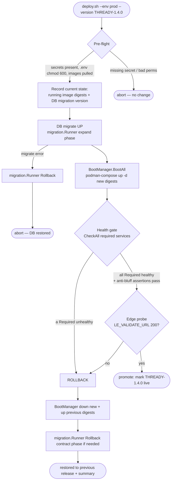

<!--
  Title           : Helix Thready — Deploy & Rollback
  Classification  : PUBLIC
  Location        : docs/public/research/mvp/deployment/deploy-and-rollback.md
  Status          : Review — v0.2
  Revision        : 2 (2026-07-21)
  Author          : Helix Thready documentation swarm (deployment)
  Related         : ./index.md, ./podman-compose.md, ./container-topology.md,
                    ./backup-dr.md, ./secrets-and-config.md, ../database/index.md,
                    ../testing/index.md
-->

# Helix Thready — Deploy & Rollback

| Rev | Date | Author | Change |
|-----|------|--------|--------|
| 1 | 2026-07-21 | swarm (deployment) | Initial deploy pipeline (bash + Go health gate), image-tag pinning, expand-contract migrations, rollback |
| 2 | 2026-07-21 | swarm (deployment review) | Added reproduce-first (RED) rollback + anti-bluff TDD skeletons; split the pipeline prose into multiple paragraphs |

This document specifies the **release mechanism**: how a Thready version is deployed to an
environment with full automation and rollback (`§8.2`), how database migrations are sequenced so
they are reversible, and how a failed deploy self-restores to the previous release. It builds on the
[rootless boot sequence](./podman-compose.md#5-boot-sequence-diagram) and the
[TLS renewal](./tls-lets-encrypt.md) gate.

> Diagram source: sibling under [`diagrams/`](./diagrams/). Rendered PNG/SVG exported via Docs Chain (§11.4.65).

## Table of Contents

1. [Principles](#1-principles)
2. [Release artifacts & tag pinning](#2-release-artifacts--tag-pinning)
3. [Deploy pipeline diagram](#3-deploy-pipeline-diagram)
4. [The deploy script (bash + Go gate)](#4-the-deploy-script-bash--go-gate)
5. [Expand-contract database migrations](#5-expand-contract-database-migrations)
6. [Rollback strategy](#6-rollback-strategy)
7. [Post-deploy verification (anti-bluff gate)](#7-post-deploy-verification-anti-bluff-gate)
   - [7.1 Reproduce-first rollback & anti-bluff tests (TDD)](#71-reproduce-first-rollback--anti-bluff-tests-tdd)
8. [Remote deploy over SSH (cmd/deploy-stack)](#8-remote-deploy-over-ssh-cmddeploy-stack)
9. [No server-side CI — where enforcement lives](#9-no-server-side-ci--where-enforcement-lives)
10. [Verified vs assumed](#10-verified-vs-assumed)
11. [Open items](#11-open-items)

---

## 1. Principles

- **Full automation with rollback** — every deploy is a single command that either promotes the new
  release or restores the previous one; no half-applied state `[§8.2]`.
- **Health-gated** — promotion happens only after the `containers` health checker confirms every
  `Required` service is genuinely healthy ([podman-compose.md §6](./podman-compose.md#6-health-gating)).
- **Reversible data changes** — migrations use expand-contract so schema can roll back with the code
  (Q30).
- **Immutable artifacts** — the same image digests validated in `sta` are what deploy to `prod`
  (no rebuild between stages; see [environments.md §6](./environments.md#6-promotion-flow-dev--sta--prod)).
- **Rootless, no sudo** — the deploy runs entirely as the `thready` user.

## 2. Release artifacts & tag pinning

- Application images are built once and tagged with **project-prefixed tags**
  `THREADY-<component>-<version>` (`§11.4.151`) and pinned by digest.
- A **release manifest** records the exact digest of every service for a version:

```json
// /home/thready/prod/releases/THREADY-1.4.0.json
{
  "version": "THREADY-1.4.0",
  "created": "2026-07-21T10:00:00Z",
  "db_migration": 47,
  "services": {
    "thready-api":        "localhost/thready-api@sha256:aa11…",
    "thready-herald":     "localhost/thready-herald@sha256:bb22…",
    "thready-processing": "localhost/thready-processing@sha256:cc33…",
    "thready-web":        "localhost/thready-web@sha256:dd44…"
  }
}
```

- The **currently-live** manifest is symlinked `releases/current.json`. Deploy records it as
  `releases/previous.json` before switching — this is the rollback target.
- Data-plane images (Postgres, NATS, MinIO, …) are pinned to fixed upstream digests and change rarely
  and independently of application releases.

## 3. Deploy pipeline diagram



**Explanation (for readers/models that cannot see the diagram).** The deploy begins with a
**pre-flight** that refuses to proceed unless the environment's secrets are present, the `.env` is
`chmod 600`, and the target image digests are already pulled/built — a missing secret or wrong
permission aborts with **no** change to the running system. Pre-flight then **records the current
state**: the running image digests (from `releases/current.json`) and the current DB migration
version — this snapshot is the rollback anchor that everything downstream restores to.

Next it runs the **database migration** forward using `database/pkg/migration.Runner` in *expand*
mode (additive, backward-compatible changes only — see
[§5](#5-expand-contract-database-migrations)); if the migration errors, the Runner's `Rollback`
undoes it and the deploy aborts with the database restored. With the schema expanded, the deploy
calls `BootManager.BootAll`, which brings up the new image digests via rootless `podman-compose`
(no `--wait`; readiness is proven by the health gate, per
[podman-compose.md §5](./podman-compose.md#5-boot-sequence-diagram)).

The **health gate** then runs `CheckAll` across every `Required` service plus Thready's anti-bluff
assertions (e.g. the real-embedder check); if any required service is unhealthy it goes straight to
**rollback**. If health passes, a final **edge probe** hits `LE_VALIDATE_URL` (`/health/ready`
through the public TLS endpoint) — the same probe the TLS renewal uses — to confirm the release is
reachable end-to-end.

A 200 promotes the release (update `current.json`); anything else triggers **rollback**: the
`BootManager` brings the new containers down and the previous digests back up, and if the contract
phase of the migration must be undone it is rolled back too, leaving the system on the previous,
known-good release with a summary of what happened. Every one of these transitions is exercised by
the reproduce-first tests in [§7.1](#71-reproduce-first-rollback--anti-bluff-tests-tdd).

## 4. The deploy script (bash + Go gate)

The deploy is a thin **bash** orchestrator that shells to a small **Go** health-gate built on the
`containers` `BootManager`/`HealthChecker`. Bash handles the file/secret/manifest plumbing; Go owns
the gated boot + rollback (which the module already implements correctly).

```bash
#!/usr/bin/env bash
# /home/thready/submodules/containers/scripts/thready-deploy.sh  (excerpt)
set -euo pipefail
ENV="$1"; VERSION="$2"                     # e.g. prod THREADY-1.4.0
DIR="/home/thready/$ENV"
source "$DIR/.env"                          # runtime-load-only secrets (chmod 600)

# 1. Pre-flight: secrets + perms + images
[ "$(stat -c '%a' "$DIR/.env")" = "600" ] || { echo "FATAL: .env not chmod 600"; exit 1; }
: "${HELIX_EMBEDDING_PROVIDER:?FATAL: HELIX_EMBEDDING_PROVIDER unset (GAP #1)}"   # anti-hash-embedder
[ "$HELIX_EMBEDDING_PROVIDER" = "llama" ] || { echo "FATAL: embedder must be 'llama'"; exit 1; }
podman-compose -p "thready-$ENV" pull       # ensure digests present

# 2. Record rollback anchor
cp "$DIR/releases/current.json" "$DIR/releases/previous.json" 2>/dev/null || true

# 3. Migrate (expand) — reversible; the Go gate rolls it back on failure
thready-migrate --dsn "$THREADY_PG_DSN" --up --expand-only || { thready-migrate --dsn "$THREADY_PG_DSN" --rollback; exit 2; }

# 4. Health-gated boot + rollback (Go, on containers pkg/boot)
thready-boot --env "$ENV" --version "$VERSION" --validate-url "$LE_VALIDATE_URL"
```

The Go gate (`thready-boot`) uses the **verified** `containers` API:

```go
// thready-boot (excerpt) — the gated boot with automatic rollback.
bm := boot.NewBootManager(endpoints,
    boot.WithOrchestrator(orch),          // podman-aware ComposeOrchestrator
    boot.WithHealthChecker(hc),           // pkg/health CheckAll
    boot.WithProjectDir("/home/thready/"+env),
    boot.WithDiscoverer(disc),            // resolves external HelixLLM
)
summary, err := bm.BootAll(ctx)           // Phase1 discover → Phase2 up → Phase3 health; rolls back internally
if err != nil || summary.HasFailures() {
    // BootManager already tore down partial state (verified rollback);
    // now restore the previous release digests and reload.
    restorePrevious(ctx, orch, env)
    return fmt.Errorf("deploy failed, rolled back: %w", err)
}
if !probe(validateURL) {                  // final end-to-end edge probe
    restorePrevious(ctx, orch, env)
    return errors.New("edge probe failed, rolled back")
}
promote(env, version)                     // update current.json
```

- `BootManager.BootAll` **already** tears down partially-booted projects in reverse order on any
  `Required` failure or context cancellation (verified `pkg/boot/manager.go`), so the deploy inherits
  correct partial-failure cleanup rather than re-implementing it.
- `restorePrevious` reads `previous.json` and `up`s those digests — the explicit release-level
  rollback on top of the module's container-level rollback.

## 5. Expand-contract database migrations

Migrations use `digital.vasic.database` `pkg/migration.Runner` (`Init`/`Applied`/`Apply`/`Rollback`),
verified from the decision matrix (`§2.1.1`, Q30). To keep deploys reversible with zero downtime,
schema changes follow **expand-contract**:

```
Release N   (expand)   : add new nullable column / new table / new index CONCURRENTLY
                         — old code still works; new code can use the new shape.
Release N   (deploy)   : new app images run against the expanded schema.
Release N+1 (contract) : once no old code remains, drop the old column/constraint.
```

- The deploy applies only the **expand** phase; the **contract** phase runs in a *later* release once
  the previous version is fully gone — so a rollback within release N never needs to un-drop a column.
- Each migration ships a tested `up` **and** `down` (`Rollback`) — the down is exercised in
  [testing](../testing/index.md) so the rollback path is proven, not hoped for.
- Forward/rollback DDL scripts are owned by the [database](../database/index.md) area; deploy only
  *invokes* the Runner.

Example migration pair (illustrative):

```sql
-- 0047_add_post_processing_state.up.sql  (EXPAND — safe, additive)
ALTER TABLE posts ADD COLUMN processing_state text;         -- nullable → backward compatible
CREATE INDEX CONCURRENTLY idx_posts_processing_state ON posts (processing_state);

-- 0047_add_post_processing_state.down.sql  (ROLLBACK)
DROP INDEX CONCURRENTLY IF EXISTS idx_posts_processing_state;
ALTER TABLE posts DROP COLUMN IF EXISTS processing_state;
```

## 6. Rollback strategy

Rollback is layered, matching the three ways a deploy can fail:

| Failure point | What rolls back | Mechanism |
|---------------|-----------------|-----------|
| Pre-flight (secret/perm) | nothing started | abort before any change |
| Migration (expand) | the schema change | `migration.Runner.Rollback` (the `down` script) |
| Health gate (a Required service unhealthy) | the new containers | `BootManager` reverse-order `Down` (verified) + `restorePrevious` up |
| Edge probe (end-to-end unreachable) | the whole release | `restorePrevious` (previous digests) + optional contract-rollback |

Because artifacts are pinned by digest, rollback is deterministic: bring the **exact previous
digests** back up. Data written by the failed release remains valid because expand-only migrations
never removed anything the previous code relied on. If a release also required a data backfill, the
backfill is written to be **idempotent and forward-only** so a rollback of code does not corrupt it;
irreversible data operations are deferred to a contract release.

> Certificate rollback is handled **independently** by the `lets_encrypt` risk-free gate
> ([tls-lets-encrypt.md §7](./tls-lets-encrypt.md#7-risk-free-renewal-flow-diagram)) — a cert renewal
> failure never blocks or is blocked by an application deploy.

## 7. Post-deploy verification (anti-bluff gate)

`[GAP: #12 anti-bluff]` — the health gate is deliberately **not** a bare HTTP 200 check, because a
stub can return 200. Before promotion, the gate asserts *real* behaviour of the enabled services:

- **Embedder is real** — `thready-semsearch /health/ready` fails if the active provider is the
  non-semantic `HashEmbedder` (`[GAP: #1]`); a probe embeds a known string and checks the vector is
  not the hash-embedder's deterministic pseudo-vector.
- **DB reachable & migrated** — `pg_isready` **and** the migration version equals the manifest's
  `db_migration`.
- **JetStream durable** — a publish/consume round-trip on a canary subject.
- **Asset round-trip** — a MinIO signed-URL put+get (`[GAP: #3.2]` signed-URL parity for self-hosted
  MinIO).
- **buildnew profile excluded** — the gate confirms no placeholder (`buildnew`) container is running
  in a promoted stack.

Only when all assertions pass is `current.json` updated. This is the deployment-side expression of
the constitution's no-bluff / anti-stub mandate (`§11.4.27`).

### 7.1 Reproduce-first rollback & anti-bluff tests (TDD)

`[CONVENTIONS §6]` `[CONSTITUTION §11.4.27]` — the deploy pipeline ships **reproduce-first (RED)**
tests: each one encodes a past-or-plausible incident and is written to **fail** against a naive
deploy (one that promotes on a bare `200`, or leaves half-booted containers). They exercise every
edge in the [pipeline diagram](#3-deploy-pipeline-diagram) — the health-gate rollback, the migration
rollback, and the anti-bluff embedder assertion. They belong to the regression, chaos and
paired-mutation (anti-bluff) types of the 15 mandated test types and are authored in
[testing](../testing/index.md); the skeletons are shown here because they pin the behaviour this
document specifies.

```go
// deploy_rollback_test.go — RED first. Run against the real containers pkg/boot gate.
// These MUST fail against a deploy that trusts a bare 200 or forgets to restore digests.

// RED 1 — a Required service that never becomes healthy MUST roll the release back to the
// previous digests and MUST NOT promote. Reproduces "new image boots but /health/ready 503s".
func TestDeploy_RequiredUnhealthy_RollsBackToPrevious(t *testing.T) {
    seedCurrent(t, "sta", release("THREADY-1.3.0"))          // rollback anchor
    gate := stubHealth{unhealthy: []string{"thready-api"}}   // api never ready

    err := runDeploy(t, deployArgs{Env: "sta", Version: "THREADY-1.4.0", Health: gate})

    require.Error(t, err)                                    // deploy must fail, not promote
    require.Equal(t, "THREADY-1.3.0", currentJSON(t, "sta").Version)  // restored
    require.Equal(t, release("THREADY-1.3.0").Digests, liveDigests(t, "sta"))
    require.Empty(t, danglingContainers(t, "sta"))          // no half-booted leak
}

// RED 2 — the anti-bluff gate MUST reject a stack whose embedder is the HashEmbedder,
// even though /health returns 200 on the naive path. Reproduces GAP #1 (silent garbage relevance).
func TestGate_HashEmbedder_BlocksPromotion(t *testing.T) {
    stack := bootStack(t, "sta", withEmbeddingProvider("hash"))
    defer stack.Down()

    ok := antiBluffGate(t, stack)                            // §7 assertions

    require.False(t, ok, "hash embedder must fail the gate (GAP #1)")
    require.False(t, promoted(t, "sta"))                     // current.json untouched
}

// RED 3 — an expand migration that errors MUST leave the DB on its pre-deploy version.
func TestDeploy_MigrationError_RestoresSchema(t *testing.T) {
    v0 := migrationVersion(t, "sta")
    injectMigrationFailure(t, 48)                            // 0048 up fails mid-apply

    err := runDeploy(t, deployArgs{Env: "sta", Version: "THREADY-1.5.0"})

    require.Error(t, err)
    require.Equal(t, v0, migrationVersion(t, "sta"))         // Runner.Rollback ran
}
```

Each test names the invariant it guards in its assertions, so a green run is evidence of *real*
rollback behaviour rather than a stub — the anti-bluff contract applied to the pipeline itself.

## 8. Remote deploy over SSH (cmd/deploy-stack)

For the initial bring-up and for CI-less operator-driven deploys **from a workstation**, the
`containers` module ships `cmd/deploy-stack` (verified) — it scp's a compose project + artifacts to a
remote host over SSH and runs `compose up -d --build` there via `pkg/remote.RemoteComposeOrchestrator`:

```bash
# From the operator workstation → the Hetzner host, as the thready user.
deploy-stack \
  --env    /home/thready/prod/.env \
  --host-index 1 \
  --compose /home/thready/prod/compose.thready.prod.yml \
  --remote-dir prod \
  --artifact  Caddyfile \
  --artifact-dir config \
  --env-file  /home/thready/prod/.env \
  --compose-cmd podman-compose \
  --timeout 30m
```

- Host is resolved from `CONTAINERS_REMOTE_HOST_<N>_*` in `--env` (verified `.env.example` shape).
- `--compose-cmd podman-compose` forces the rootless backend (no docker).
- After bring-up it prints `compose ps` so the operator sees **what actually came up**, not merely a
  zero exit — the module's own anti-bluff stance.

The steady-state path, once the host is provisioned, is the local `thready-deploy.sh`
([§4](#4-the-deploy-script-bash--go-gate)) run **on** the host; `deploy-stack` is primarily for
first bootstrap and disaster re-bring-up.

## 9. No server-side CI — where enforcement lives

`[GAP: #12 CI-equivalent]` `[CONSTITUTION §11.4.156]` — there is **no GitHub Actions / GitLab CI /
Jenkins**. The gates that a CI server would normally run are instead **local**:

- **pre-commit** — secret scan (block committing `.env`/keys), formatting, `sh -n`/`bash -n` on
  scripts (see [secrets-and-config.md §5](./secrets-and-config.md#5-local-git-hook-enforcement-no-server-ci)).
- **pre-push / pre-tag** — full-suite retest GREEN (`§11.4.40`) + independent AI review on Fable @
  xhigh (`§11.4.209`) before a `THREADY-<ver>` tag is cut.
- **release** — tag → fan-out push to all four upstreams (`§2.1`).

The deploy script itself re-checks the security invariants (secret presence, `chmod 600`,
`HELIX_EMBEDDING_PROVIDER=llama`) at run time, so a mis-configured host is refused even if a hook was
bypassed.

## 10. Verified vs assumed

- **VERIFIED:** `BootManager.BootAll` phased boot + reverse-order rollback; `ComposeOrchestrator`
  `Up`/`Down`; `HealthChecker.CheckAll`; `migration.Runner` up/down (Q30); `cmd/deploy-stack` +
  `RemoteComposeOrchestrator` + `.env` host block shape; no-server-CI (Q21, `§11.4.156`).
- **ASSUMED / `[DEFAULT — adjustable]`:** the `thready-deploy.sh` / `thready-boot` / `thready-migrate`
  wrapper names and the release-manifest JSON shape (Thready conventions, not module APIs); the
  30-minute deploy timeout.

## 11. Open items

- `[OPEN: buildnew-images]` — deploys of environments whose critical services are still
  `[BUILD-NEW]` will keep those under the `buildnew` profile and cannot promote a full prod stack
  until the P0 gaps (#3 Herald-Max, #4 Download Manager, #6 Skill dispatch, #20 User/Semsearch) are
  built. Tracked in [development](../development/index.md).
- `[OPEN: blue-green]` — a future zero-downtime blue/green variant (two prod bands, edge flips) is
  possible on the same host but is **not** MVP; single-band health-gated rollback is the MVP default.

---

*Made with love ♥ by Helix Development.*
