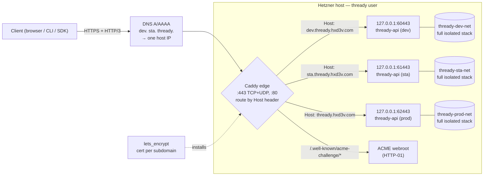

<!--
  Title           : Helix Thready — Environments (dev / sta / prod)
  Classification  : PUBLIC
  Location        : docs/public/research/mvp/deployment/environments.md
  Status          : Review — v0.2
  Revision        : 2 (2026-07-21)
  Author          : Helix Thready documentation swarm (deployment)
  Related         : ./index.md, ./container-topology.md, ./tls-lets-encrypt.md,
                    ./service-discovery-ports.md, ./secrets-and-config.md
-->

# Helix Thready — Environments (dev / sta / prod)

| Rev | Date | Author | Change |
|-----|------|--------|--------|
| 1 | 2026-07-21 | swarm (deployment) | Initial three-environment separation model, subdomain routing, per-env config, promotion flow |
| 2 | 2026-07-21 | swarm (deployment review) | Split the subdomain-routing prose into multiple paragraphs |

Helix Thready runs **three fully-separated environments on a single Hetzner host**, behind three
subdomains (`§8.2`, Q8). This document specifies exactly *what* separation means, how the edge
routes each subdomain to its stack, how per-environment configuration differs, and how a build is
promoted dev → sta → prod.

> Diagram source: sibling under [`diagrams/`](./diagrams/). Rendered PNG/SVG exported via Docs Chain (§11.4.65).

## Table of Contents

1. [The three environments](#1-the-three-environments)
2. [What "fully separated" means](#2-what-fully-separated-means)
3. [Subdomain routing diagram](#3-subdomain-routing-diagram)
4. [The edge reverse proxy](#4-the-edge-reverse-proxy)
5. [Per-environment configuration matrix](#5-per-environment-configuration-matrix)
6. [Promotion flow (dev → sta → prod)](#6-promotion-flow-dev--sta--prod)
7. [Mandatory per-environment env vars](#7-mandatory-per-environment-env-vars)
8. [Verified vs assumed](#8-verified-vs-assumed)
9. [Open items](#9-open-items)

---

## 1. The three environments

| Environment | Subdomain | Port band | Compose project | Purpose |
|-------------|-----------|-----------|-----------------|---------|
| Development | `dev.thready.hxd3v.com` | `60xxx` | `thready-dev` | Development testing; latest `main` |
| Staging | `sta.thready.hxd3v.com` | `61xxx` | `thready-sta` | Pre-production; release-candidate tags |
| Production | `thready.hxd3v.com` (apex) | `62xxx` | `thready-prod` | Live system; released `THREADY-<ver>` tags |

Port bands are assigned by the `port_prefix` module and detailed in
[service-discovery-ports.md](./service-discovery-ports.md). The prefixes `60/61/62` are
`[DEFAULT — adjustable]`.

## 2. What "fully separated" means

Separation is enforced at **every** layer — this is the concrete checklist that satisfies the
`§8.2` "complete separation between environments" requirement:

| Layer | Separation mechanism |
|-------|----------------------|
| **Process/namespace** | Three independent Podman Compose projects (`thready-<env>`); rootless, same user, but distinct container namespaces |
| **Network** | Three bridge networks (`thready-<env>-net`); no cross-env routing even by IP |
| **Host ports** | Disjoint `port_prefix` bands (`60/61/62`); a dev port can never equal a prod port |
| **Data** | Separate Postgres, pgvector, MinIO, NATS, Redis volumes per env; no shared datastore |
| **Secrets** | Separate `.env` per env directory (`/home/thready/<env>/.env`, `chmod 600`) |
| **TLS** | One Let's Encrypt certificate **per subdomain** (`§21.5`); independent renewal |
| **Config** | Per-env `config/` directory; per-env resource limits, log levels, retention |
| **Telemetry** | Per-env Prometheus/Grafana/Jaeger/ClickHouse; a dev load test cannot skew prod metrics |

The **only** host-wide shared component is the edge reverse proxy, which exists solely to demultiplex
the single public IP's port 443 across the three subdomains. It holds no application state.

## 3. Subdomain routing diagram



**Explanation (for readers/models that cannot see the diagram).** A client resolves one of the
three subdomains; all three DNS records (A for IPv4, AAAA for IPv6) point at the **same** host IP.
The request reaches the single **Caddy edge**, which is the only process on the public 443 (both TCP
for HTTP/2 and UDP for HTTP/3) and 80.

Caddy inspects the TLS SNI / HTTP `Host` header and routes: `dev.thready.hxd3v.com` to the dev API at
loopback `127.0.0.1:60443`, `sta.` to `61443`, and the apex `thready.hxd3v.com` to prod at `62443`.
Those loopback ports are the `port_prefix` mappings of the internal API port `8443` in each
environment's band. Requests to `/.well-known/acme-challenge/*` on port 80 are served from a shared
ACME webroot so the `lets_encrypt` HTTP-01 challenge can validate each subdomain (see
[tls-lets-encrypt.md](./tls-lets-encrypt.md)).

Behind each loopback gateway sits a **completely isolated stack** on its own bridge network — the
boxes never touch, which is the routing-level expression of the separation checklist in
[§2](#2-what-fully-separated-means). The `lets_encrypt` module installs one certificate per subdomain
into the edge's `certs/` directory and reloads Caddy, so each subdomain has an independent TLS
lifecycle even though one edge process fronts all three.

## 4. The edge reverse proxy

**Chosen default:** Caddy 2, rootless, in its own tiny compose/quadlet unit (`/home/thready/edge/`).
Rationale: native HTTP/3, trivial `Host`-based routing, and a clean `HUP` reload that the
`lets_encrypt` deploy-hook already supports (`podman kill -s HUP caddy`). `[DEFAULT — adjustable]` —
nginx is an equally valid alternative (its reload is `nginx -s reload`); both appear in the
`lets_encrypt` reload-command examples.

**Caddy's own ACME is disabled** — certificates come exclusively from the `lets_encrypt` module so
the risk-free validate → backup → atomic-deploy → probe → rollback guarantee applies. The edge is
handed static cert paths:

```caddyfile
# /home/thready/edge/Caddyfile
{
    auto_https off            # certs are managed by lets_encrypt, not Caddy
    servers { protocols h1 h2 h3 }
}

dev.thready.hxd3v.com {
    tls /certs/dev/fullchain.pem /certs/dev/privkey.pem
    reverse_proxy 127.0.0.1:60443
}
sta.thready.hxd3v.com {
    tls /certs/sta/fullchain.pem /certs/sta/privkey.pem
    reverse_proxy 127.0.0.1:61443
}
thready.hxd3v.com {
    tls /certs/prod/fullchain.pem /certs/prod/privkey.pem
    reverse_proxy 127.0.0.1:62443
}

# Port 80: ACME HTTP-01 webroot + redirect everything else to HTTPS
http://dev.thready.hxd3v.com, http://sta.thready.hxd3v.com, http://thready.hxd3v.com {
    handle /.well-known/acme-challenge/* { root * /var/www/acme; file_server }
    handle { redir https://{host}{uri} permanent }
}
```

The edge container binds the public ports; see [hetzner-provisioning.md §4](./hetzner-provisioning.md)
for the `net.ipv4.ip_unprivileged_port_start` sysctl that lets a rootless container bind 80/443.

## 5. Per-environment configuration matrix

| Setting | dev | sta | prod |
|---------|-----|-----|------|
| Image source | build from `main` | release-candidate tag | released `THREADY-<ver>` |
| Log level | `debug` | `info` | `info` (warn for noisy modules) |
| Resource limits | ≈ ⅓ prod | ≈ ⅓ prod | full baseline ([container-topology §7](./container-topology.md#7-resource-limits)) |
| `LE_STAGING` | `1` (staging CA first, then `0`) | `0` | `0` |
| Backup | daily (short retention) | daily | daily full + hourly WAL, long retention |
| BackgroundTasks workers | 8 | 16 | 32 (Q4) |
| Data retention | short (dev churn) | medium | keep-indefinitely + per-account overrides (Q12) |
| Telemetry sampling | 100 % traces | 25 % | 10 % (tune to SLO) |
| Rate limits | relaxed | production-like | production (`ratelimiter`) |

All differences are expressed only in each env's `.env` and `config/` — the **container images are
identical** across environments (build once, promote the same artifact). This is what makes staging a
faithful pre-production mirror.

## 6. Promotion flow (dev → sta → prod)

```
main (green, full-suite retest passes locally — no server CI, §11.4.156)
   │  build THREADY-<component>-<ver> images
   ▼
dev.thready.hxd3v.com        # continuous; validates on the live Telegram/Max test threads (Appendix A)
   │  operator promotes the SAME image digests
   ▼
sta.thready.hxd3v.com        # release-candidate soak; HelixQA banks + chaos/DR rehearsal
   │  tag THREADY-<ver>; pre-tag full-suite retest GREEN (§11.4.40); push to all 4 upstreams (§2.1)
   ▼
thready.hxd3v.com (prod)     # health-gated deploy with rollback (deploy-and-rollback.md)
```

- Promotion moves **image digests**, not source — the exact artifact validated in `sta` is what runs
  in `prod` (anti-drift).
- The gate between stages is the **local** full-suite retest + independent AI review on Fable @ xhigh
  (`§11.4.209`), because server-side CI is forbidden (`§11.4.156`, Q21). Enforcement lives in the
  [git-hooks](./secrets-and-config.md#5-local-git-hook-enforcement-no-server-ci).
- Each prod deploy is applied by the health-gated [deploy script](./deploy-and-rollback.md) with
  automatic rollback.

## 7. Mandatory per-environment env vars

Beyond secrets ([secrets-and-config.md](./secrets-and-config.md)), each environment **must** set
these — some enforce gap-register fixes:

| Var | Example (prod) | Why |
|-----|----------------|-----|
| `THREADY_ENV` | `prod` | selects config, port band, project name |
| `THREADY_PORT_PREFIX` | `62` | the `port_prefix` band for this env |
| `THREADY_PUBLIC_HOST` | `thready.hxd3v.com` | canonical URL, CORS, cookie domain |
| `HELIX_EMBEDDING_PROVIDER` | `llama` | **`[GAP: #1]`** — forbids the non-semantic `HashEmbedder`; semsearch health probe asserts this |
| `HELIX_LLM_BASE_URL` | `http://gpu-node.helix.lan:8080` | external HelixLLM endpoint (Q5) |
| `THREADY_PG_DSN` | `postgres://…@thready-postgres:5432/thready` | injected DSN (no literal creds) |
| `THREADY_NATS_URL` | `nats://thready-nats:4222` | JetStream transport |
| `THREADY_MINIO_ENDPOINT` | `http://thready-minio:9000` | asset object store |
| `THREADY_LOG_LEVEL` | `info` | per-env verbosity |

> `[GAP: #1 HelixLLM HashEmbedder]` — `HELIX_EMBEDDING_PROVIDER=llama` is **required** in every
> environment that runs semantic search. The deploy gate and the `thready-semsearch` readiness probe
> both fail if it is unset or falls back to the hash embedder, so no environment can silently ship
> garbage-relevance search.

## 8. Verified vs assumed

- **VERIFIED:** the three subdomains and their purposes (`§8.2`); per-subdomain certs (`§21.5`);
  no-server-CI promotion gating (Q21); the BackgroundTasks worker default (Q4); retention (Q12).
- **ASSUMED / `[DEFAULT — adjustable]`:** port-band prefixes `60/61/62`; Caddy over nginx; telemetry
  sampling rates; per-env resource fractions; log levels.

## 9. Open items

- `[OPEN: apex-vs-www]` — whether to also serve `www.thready.hxd3v.com` (redirect to apex) is a
  marketing-site decision, not required for the three product environments.
- `[OPEN: dns-provider]` — DNS-01 wildcard as an alternative to per-subdomain HTTP-01 depends on the
  `hxd3v.com` DNS provider; tracked in [tls-lets-encrypt.md](./tls-lets-encrypt.md).

---

*Made with love ♥ by Helix Development.*
