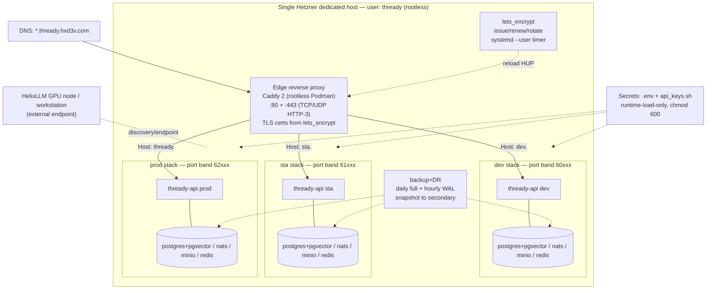

<!--
  Title           : Helix Thready — Deployment & Operations (Area Index)
  Classification  : PUBLIC
  Location        : docs/public/research/mvp/deployment/index.md
  Status          : Review — v0.2
  Revision        : 2 (2026-07-21)
  Author          : Helix Thready documentation swarm (deployment)
  Related         : ../CONVENTIONS.md, ../index.md,
                    ./container-topology.md, ./podman-compose.md, ./environments.md,
                    ./tls-lets-encrypt.md, ./deploy-and-rollback.md, ./backup-dr.md,
                    ./service-discovery-ports.md, ./hetzner-provisioning.md,
                    ./secrets-and-config.md
-->

# Helix Thready — Deployment & Operations (Area Index)

| Rev | Date | Author | Change |
|-----|------|--------|--------|
| 1 | 2026-07-21 | swarm (deployment) | Initial implementation-ready draft of the full Deployment & Operations pack |
| 2 | 2026-07-21 | swarm (deployment review) | Review pass: added OpenAPI 3.1 health contract + reproduce-first TDD skeletons, fixed the boot `--wait` contradiction, addressed GAP #17, split single-paragraph diagram explanations |

This is the canonical entry point for the **Deployment & Operations** documentation of
Helix Thready. It specifies how the system is provisioned, containerized, secured with TLS,
released, rolled back, backed up and recovered on a **single Hetzner dedicated host**, running
**three fully-separated environments** (`dev` / `sta` / `prod`) as **rootless Podman Compose**
stacks behind subdomains, using only the in-house `vasic-digital` module fleet named in the
technology decision matrix. All authors follow **[CONVENTIONS.md](../CONVENTIONS.md)**.

> Every Mermaid diagram in this pack has a sibling source under
> [`diagrams/`](./diagrams/) and a following multi-paragraph prose explanation.
> Rendered PNG/SVG exported via Docs Chain (`§11.4.65`).

## Table of Contents

1. [Scope & operator decisions](#1-scope--operator-decisions)
2. [Upstream / Downstream dependencies](#2-upstream--downstream-dependencies)
3. [In-house modules this area binds to](#3-in-house-modules-this-area-binds-to)
4. [Deployment overview diagram](#4-deployment-overview-diagram)
5. [Document map](#5-document-map)
6. [Gap-register items addressed by this area](#6-gap-register-items-addressed-by-this-area)
7. [Open items tracked by this area](#7-open-items-tracked-by-this-area)
8. [Verified vs assumed — reading guide](#8-verified-vs-assumed--reading-guide)

---

## 1. Scope & operator decisions

The scope of this area is fixed by the operator decisions in the final research request
(`§0.1`) and answers Q8, Q21, Q39, Q41–Q45 `[OPERATOR]` `[CONSTITUTION]`:

| Concern | Decision | Provenance |
|---------|----------|------------|
| Orchestration | **Rootless Podman Compose only** via `vasic-digital/containers` — no Docker, no `sudo` | `[CONSTITUTION §11.4.76/161]` |
| Host | **One Hetzner dedicated host**; root provisions the `thready` user (`/home/thready`) | `[OPERATOR]` `[CONSTITUTION §11.4.76]` |
| Environments | **Three fully-separated** stacks behind subdomains (`dev.` / `sta.` / `thready.`) | `[OPERATOR]` (Q8, §8.2) |
| TLS | **`vasic-digital/lets_encrypt`** (acme.sh, HTTP-01/DNS-01, atomic deploy-hook + rollback) | `[IN-HOUSE: lets_encrypt]` (Q44) |
| Ports / discovery | Dynamic ports via **`port_prefix`**, discovery via **`discovery`** + **`mdns`** | `[IN-HOUSE]` (§14.3) |
| CI/CD | **No server-side CI** — local git-hooks + pre-tag full-suite retest + all-upstreams push | `[CONSTITUTION §11.4.156/75/40/§2.1]` (Q21) |
| Secrets | **Runtime-load-only** from gitignored `.env` / `api_keys.sh`, `chmod 600/700`, never logged | `[CONSTITUTION §11.4.10]` (Q39) |
| Backup / DR | **Daily full + hourly DB incrementals**; RPO ≈ 1 h, RTO ≈ 4 h; documented restore runbook | `[OPERATOR]` (Q41, Q45) |
| Monitoring | Prometheus + Grafana + OpenTelemetry (Jaeger) + ClickHouse via `observability` | `[IN-HOUSE]` (Q42/Q43) |

The three subdomains (from `§8.2`):

| Environment | Domain | Purpose |
|-------------|--------|---------|
| Development | `dev.thready.hxd3v.com` | Development testing |
| Staging | `sta.thready.hxd3v.com` | Pre-production |
| Production | `thready.hxd3v.com` | Live system |

## 2. Upstream / Downstream dependencies

**Upstream (this area consumes):**

- **[architecture](../architecture/index.md)** — the service inventory (Herald, Processing
  Engine, Asset Service, Semantic Search, API, Event Bus) that the container topology packages.
- **[database](../database/index.md)** — the PostgreSQL + pgvector schema, migration runner
  (`migration.Runner`) and partitioning strategy that the deploy/rollback and backup runbooks
  operate on (expand-contract migrations; PITR from WAL).
- **[api](../api/index.md)** — the REST `/v1` (HTTP/3) + WebSocket/SSE surface the edge reverse
  proxy fronts and the `LE_VALIDATE_URL` health probe hits.

**Downstream (consumes this area):**

- **[development](../development/index.md)** — the ATM-NNN workable items that build the new
  submodules (Download Manager, User Service, Max adapter, etc.) whose containers this topology
  reserves slots for; the local git-hook enforcement defined in
  [secrets-and-config.md](./secrets-and-config.md).
- **[testing](../testing/index.md)** — the chaos / DR / scaling tests (`§11.4.27`) that validate
  the [backup-dr.md](./backup-dr.md) RPO/RTO targets and the [deploy-and-rollback.md](./deploy-and-rollback.md)
  rollback gate.

## 3. In-house modules this area binds to

Every module below is named in the decision matrix (`§0.2`). Interfaces were read at source
(`gh repo view` / shallow clone) during authoring — **do not invent APIs** `[CONVENTIONS §1]`.

| Module | Repo | Role in deployment | Verified surface used |
|--------|------|--------------------|-----------------------|
| Containers | `vasic-digital/containers` | Rootless compose orchestration, boot, health, discovery, remote deploy | `pkg/compose.ComposeOrchestrator`, `pkg/boot.BootManager`, `pkg/health.HealthChecker`, `pkg/endpoint.ServiceEndpoint`, `pkg/serviceregistry.ServiceRegistry`, `cmd/deploy-stack` |
| Let's Encrypt | `vasic-digital/lets_encrypt` | ACME issuance/renewal/rotation; atomic deploy-hook + rollback | `scripts/{issue,renew,rotate,revoke,deploy-hook}.sh`, `config/lets_encrypt.conf`, `systemd/*`, `api/le-api` |
| Port prefix | `vasic-digital/port_prefix` | Deterministic per-env host-port bands | `portprefix.Exposed(prefix, internalPort, taken) (int, error)` |
| mDNS | `vasic-digital/mdns` | LAN service announcement/discovery | `Announce` / `Browse` |
| Discovery | `vasic-digital/discovery` | Network/service scanning | `pkg/scanner.Scanner` |
| Observability | `vasic-digital/observability` | Health aggregation, metrics, tracing | `pkg/health.{Checker,Aggregator,Report}`, `pkg/metrics` |
| HTTP/3 | `vasic-digital/http3` | QUIC transport for API + edge | `http3.Config` / `http3.Server` |
| Security | `digital.vasic.security` | AES-256-GCM sealed key store for secrets at rest | `pkg/securestorage` |

## 4. Deployment overview diagram

**Explanation (for readers/models that cannot see the diagram).** The entire system lives on a
single Hetzner dedicated host and runs entirely as the unprivileged `thready` user — there is no
Docker daemon and no `sudo` in the runtime path `[CONSTITUTION §11.4.76/161]`. Public DNS points
the wildcard `*.thready.hxd3v.com` (and the apex `thready.hxd3v.com`) at the host's single public
IP.

A single **rootless edge reverse proxy** (Caddy 2, itself a rootless Podman container) is the
only process bound to the public ports 80 and 443 (443 on both TCP and UDP so HTTP/3 works). It
terminates TLS using certificates that the **`lets_encrypt`** module issues and installs, then
routes by HTTP `Host` header to the correct environment: `dev.` → the dev stack, `sta.` → the
staging stack, `thready.` (apex) → the production stack.

Each of the three environments is an **independent Podman Compose project** with its own
Postgres+pgvector, NATS JetStream, MinIO object store and Redis cache — nothing is shared across
environments, which is what "fully separated" means (`§8.2`). The three stacks never collide on
the host because each is assigned a disjoint **host-port band** via the `port_prefix` module
(dev = `60xxx`, sta = `61xxx`, prod = `62xxx`); the details are in
[service-discovery-ports.md](./service-discovery-ports.md). The `lets_encrypt` renewal runs as a
`systemd --user` timer and, on a successful renew, atomically installs the new cert and sends the
edge proxy a `HUP` reload with zero dropped connections. The **backup/DR** subsystem takes a daily
full backup plus hourly PostgreSQL WAL increments of all three stacks and ships snapshots to a
secondary store, meeting the RPO ≈ 1 h / RTO ≈ 4 h targets. Because the operator workstation holds
the 32 GB GPU, **HelixLLM** is reached as an *external endpoint* (via the containers
`discovery`/`endpoint` layer) rather than being packaged inside the per-environment compose files.
Finally, every stack loads its secrets at runtime only, from gitignored `.env` and `api_keys.sh`
files with `chmod 600`, never from a tracked file and never into logs `[CONSTITUTION §11.4.10]`.

## 5. Document map

| Document | What it specifies |
|----------|-------------------|
| [container-topology.md](./container-topology.md) | The full per-environment service inventory, container images, networks, volumes, resource limits, and the BUILD-NEW placeholders |
| [podman-compose.md](./podman-compose.md) | Rootless Podman + `podman-compose` runtime, the `containers` boot/orchestrator API, compose file layout, health gating |
| [environments.md](./environments.md) | The three-environment separation model, subdomain routing, per-env config, promotion flow |
| [tls-lets-encrypt.md](./tls-lets-encrypt.md) | ACME issuance (HTTP-01/DNS-01), renewal timer, atomic deploy-hook + risk-free rollback, per-subdomain certs |
| [deploy-and-rollback.md](./deploy-and-rollback.md) | The deploy pipeline (bash + Go health gate), image-tag pinning, expand-contract migrations, rollback |
| [backup-dr.md](./backup-dr.md) | Daily full + hourly WAL backups, asset snapshots, RPO/RTO, the restore runbook, chaos validation |
| [service-discovery-ports.md](./service-discovery-ports.md) | `port_prefix` bands, `discovery`/`mdns`, `serviceregistry`, the deterministic port plan |
| [hetzner-provisioning.md](./hetzner-provisioning.md) | Root bootstrap → `thready` user, rootless Podman setup, firewall, linger, sysctl, first deploy |
| [secrets-and-config.md](./secrets-and-config.md) | Secret sources, load precedence, `chmod`, leak-audit, local git-hook enforcement (no server CI) |

## 6. Gap-register items addressed by this area

From `helix_thready_subsystem_gaps_and_improvements.md`. Each is tagged `[GAP: ...]` at the point
of treatment in the relevant document.

| Gap | Where addressed | Treatment |
|-----|-----------------|-----------|
| **#1 HelixLLM `HashEmbedder` trap (P0)** | [secrets-and-config.md](./secrets-and-config.md), [environments.md](./environments.md) | Mandatory `HELIX_EMBEDDING_PROVIDER=llama` env var enforced per environment; deploy gate fails if unset for a semantic workload |
| **#3.2 database/storage — no partitioning; MinIO signed-URL parity (P1)** | [backup-dr.md](./backup-dr.md), [container-topology.md](./container-topology.md) | Self-hosted MinIO on Hetzner validated for signed URLs; time-partition-aware backup plan; tracked item |
| **#19 docs_chain SKIPs without pandoc/weasyprint (P2)** | [hetzner-provisioning.md](./hetzner-provisioning.md) | Provision `pandoc` + `weasyprint` in the host toolchain so md→HTML/PDF siblings generate |
| **#12 CI-equivalent gating (P1, cross-cutting)** | [secrets-and-config.md](./secrets-and-config.md), [deploy-and-rollback.md](./deploy-and-rollback.md) | Local git-hooks (secret-scan pre-commit, full-suite pre-tag retest) replace forbidden server CI |
| **#12 Decoupling / anti-bluff sweep (P1)** | [deploy-and-rollback.md](./deploy-and-rollback.md) | Deploy verification asserts real health (not stub) before promotion; DEV-only default creds in the `containers` compose are overridden |
| **#20 BUILD-NEW subsystems** | [container-topology.md](./container-topology.md) | Their containers are declared as *placeholders* and clearly marked not-yet-working until built |
| **#17 LLMsVerifier port discrepancy (:7061 vs :8080) (P2)** | [service-discovery-ports.md](./service-discovery-ports.md) | `HELIX_LLM_VERIFIER_URL` pinned explicitly per env to the port LLMsVerifier actually serves; endpoint marked `Required` only if in the fallback chain, else skipped |

## 7. Open items tracked by this area

| ID | Item | Where |
|----|------|-------|
| `[OPEN: dns-provider]` | The acme.sh DNS-01 hook for `hxd3v.com` is unconfirmed; DNS-01 wildcard is documented as an option pending the provider | [tls-lets-encrypt.md](./tls-lets-encrypt.md) |
| `[OPEN: host-sizing]` | Exact Hetzner SKU + GPU-node topology is a `[DEFAULT — adjustable]` baseline pending load tests | [hetzner-provisioning.md](./hetzner-provisioning.md) |
| `[OPEN: secondary-store]` | The backup secondary target (Hetzner Storage Box vs a second MinIO) is a proposed default | [backup-dr.md](./backup-dr.md) |
| `[OPEN: buildnew-images]` | Container images for the BUILD-NEW services do not exist yet; topology reserves their slots | [container-topology.md](./container-topology.md) |

## 8. Verified vs assumed — reading guide

- **VERIFIED** facts are drawn from module source read during authoring (`containers`,
  `lets_encrypt`, `port_prefix`, `mdns`, `discovery`, `observability`) or from the authoritative
  research documents. They are stated plainly and cite the module/section.
- **ASSUMPTIONS / DEFAULTS** are tagged `[DEFAULT — adjustable]` — enterprise defaults the operator
  may override (port-band prefixes, backup retention, resource limits, Caddy-vs-nginx edge).
- Where a module is a **scaffold/stub** per the gap register, this pack **never claims it works**:
  its container is a declared placeholder with a `[GAP: ...]` tag and a plan to close it.

---

*Made with love ♥ by Helix Development.*
