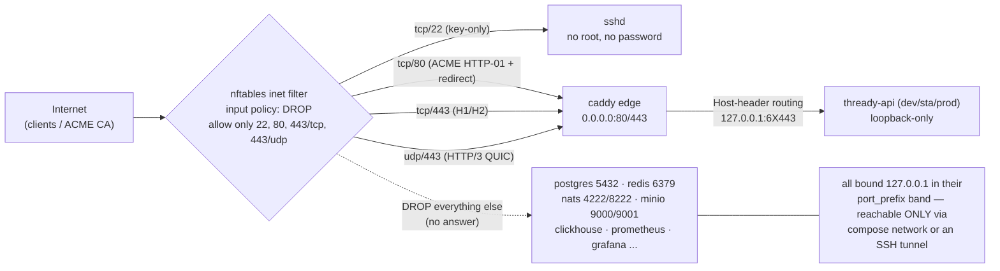

<!--
  Title           : Helix Thready — Host Firewall Rules (materialized)
  Classification  : PUBLIC
  Location        : docs/public/research/mvp/deployment/materials/firewall.rules.md
  Status          : Review — v0.1
  Revision        : 1 (2026-07-22)
  Author          : Helix Thready documentation swarm (deployment)
  Related         : ../hetzner-provisioning.md, ../environments.md, ../container-topology.md,
                    ../service-discovery-ports.md, ../tls-lets-encrypt.md,
                    ./compose.edge.yaml, ./Caddyfile
-->

# Helix Thready — Host Firewall Rules (materialized)

| Rev | Date | Author | Change |
|-----|------|--------|--------|
| 1 | 2026-07-22 | swarm (deployment) | Materialized the `hetzner-provisioning.md §5` firewall as a drop-in nftables ruleset + ufw/firewalld equivalents + a reproduce-first closed-port test |

This is the **concrete, drop-in** firewall for the single Hetzner host that runs all three Helix
Thready environments. It materializes [hetzner-provisioning.md §5](../hetzner-provisioning.md#5-firewall):
the entire public attack surface is **SSH + the edge** (22, 80, 443/tcp, 443/udp) and **nothing else**
— every datastore binds `127.0.0.1` in its [port_prefix band](../service-discovery-ports.md) and is
never exposed. `[CONSTITUTION §11.4.76]` (rootless) · `[OPERATOR]` (single host, Q8).

> Diagram source: sibling under [`diagrams/firewall-flow.mmd`](./diagrams/firewall-flow.mmd).
> Rendered PNG/SVG exported via Docs Chain (§11.4.65).

## Table of Contents

1. [Traffic-flow diagram](#1-traffic-flow-diagram)
2. [Open-port policy (what and why)](#2-open-port-policy-what-and-why)
3. [nftables ruleset (default)](#3-nftables-ruleset-default)
4. [ufw equivalent (alternative)](#4-ufw-equivalent-alternative)
5. [firewalld equivalent (alternative)](#5-firewalld-equivalent-alternative)
6. [Reproduce-first closed-port test](#6-reproduce-first-closed-port-test)
7. [Verified vs assumed](#7-verified-vs-assumed)
8. [Open items](#8-open-items)

---

## 1. Traffic-flow diagram



**Explanation (for readers/models that cannot see the diagram).** Every packet from the internet — a
browser, a CLI/SDK client, or the Let's Encrypt CA validating an ACME challenge — first hits the
**nftables `inet filter` input chain**, whose default policy is **drop**. The chain lets through
exactly four things: `tcp/22` for key-only SSH, `tcp/80` for the ACME HTTP-01 challenge and the
HTTP→HTTPS redirect, `tcp/443` for HTTP/1.1 and HTTP/2, and `udp/443` for HTTP/3 (QUIC). Port 22 goes
to `sshd` (hardened to no-root, no-password); the three 80/443 flows go to the single **Caddy edge**,
the only process bound to public `0.0.0.0`.

Everything else is **dropped with no answer** — the dashed edge to the *BLOCKED* box represents every
datastore and observability port (Postgres 5432, Redis 6379, NATS 4222/8222, MinIO 9000/9001,
ClickHouse, Prometheus, Grafana, Jaeger, …). Those services are not merely firewalled; they are
**bound to `127.0.0.1`** inside each environment's `port_prefix` band, so even without the firewall
they would not answer a remote SYN. They are reachable only over the in-container compose network (by
DNS name) or through an operator **SSH tunnel** — the *LOOP* note. The edge, having accepted a 443
connection, terminates TLS and reverse-proxies to the correct environment by `Host` header to its
loopback API port (`60443`/`61443`/`62443`). The net effect is a two-line public surface — SSH and the
edge — with all state strictly private to the host.

## 2. Open-port policy (what and why)

| Port | Proto | Direction | Allowed to | Why |
|------|-------|-----------|-----------|-----|
| 22 | tcp | ingress | sshd | Operator access; **key-only**, no root, no password (`hetzner-provisioning.md §3`). |
| 80 | tcp | ingress | caddy edge | ACME **HTTP-01** challenge webroot + permanent redirect to HTTPS (`tls-lets-encrypt.md §4`). |
| 443 | tcp | ingress | caddy edge | HTTPS (HTTP/1.1 + HTTP/2) for all three subdomains. |
| 443 | udp | ingress | caddy edge | **HTTP/3 (QUIC)** — `vasic-digital/http3` + Caddy `h3` (`environments.md §4`). |
| — | icmp/icmpv6 | ingress | host | Path-MTU discovery + diagnostics (ping). |
| (all) | any | egress | host | **Open** — needed for ACME, image pulls, messenger/LLM APIs, rclone backups. |
| **any other** | any | ingress | — | **DROP** (default policy). No DB/cache/bus/object/obs port is ever public. |

- **No `0.0.0.0` datastore bind exists** — the [compose files](./compose.prod.yaml) publish every
  non-edge port as `127.0.0.1:<band>` only ([container-topology.md §3](../container-topology.md#3-service-inventory)).
- **Forward chain is dropped** — the host is not a router; rootless Podman's own netavark handles
  in-namespace traffic without needing the host forward chain open.
- **Egress stays open** — restricting egress is a `[DEFAULT — adjustable]` future hardening; ACME,
  registry pulls, Telegram/Max APIs and `rclone` to the backup secondary all need outbound.

## 3. nftables ruleset (default)

Install as root **once** in provisioning Phase A ([hetzner-provisioning.md §3](../hetzner-provisioning.md#3-phase-a--root-bootstrap-one-time)).
This is the authoritative ruleset; the ufw/firewalld blocks below are equivalents for other distros.

```nft
#!/usr/sbin/nft -f
# /etc/nftables.conf  — Helix Thready host firewall (install as root, then `systemctl enable --now nftables`)
flush ruleset

table inet filter {
  chain input {
    type filter hook input priority 0; policy drop;

    ct state established,related accept
    ct state invalid drop
    iif "lo" accept

    ip  protocol icmp   accept          # IPv4 ping / PMTUD
    ip6 nexthdr  icmpv6 accept          # IPv6 ND / PMTUD

    tcp dport 22          accept        # SSH (key-only, no root)
    tcp dport { 80, 443 } accept        # edge: ACME HTTP-01 + HTTPS (H1/H2)
    udp dport 443         accept        # edge: HTTP/3 (QUIC)

    # (optional) rate-limit new SSH connections as light brute-force defence:
    # tcp dport 22 ct state new limit rate 10/minute accept

    counter comment "dropped-by-default"
  }
  chain forward { type filter hook forward priority 0; policy drop; }
  chain output  { type filter hook output  priority 0; policy accept; }
}
```

- Apply/verify: `sudo nft -f /etc/nftables.conf` then `sudo nft list ruleset`.
- Optional `fail2ban` on SSH complements (does not replace) the key-only policy.

## 4. ufw equivalent (alternative)

For Ubuntu/Debian hosts that standardize on `ufw` `[DEFAULT — adjustable]`:

```bash
# Reset to a deny-by-default posture, then open exactly the edge + SSH surface.
sudo ufw --force reset
sudo ufw default deny incoming
sudo ufw default allow outgoing            # egress open (ACME, pulls, APIs, rclone)
sudo ufw allow 22/tcp    comment 'SSH key-only'
sudo ufw allow 80/tcp    comment 'ACME HTTP-01 + redirect'
sudo ufw allow 443/tcp   comment 'HTTPS H1/H2'
sudo ufw allow 443/udp   comment 'HTTP/3 QUIC'
sudo ufw --force enable
sudo ufw status verbose
```

> ufw does not touch the loopback datastore binds — they are already private. ufw and nftables must
> not both manage the ruleset; pick one.

## 5. firewalld equivalent (alternative)

For AlmaLinux/RHEL-family hosts that standardize on `firewalld` `[DEFAULT — adjustable]`:

```bash
sudo firewall-cmd --permanent --zone=public --set-target=DROP
sudo firewall-cmd --permanent --zone=public --add-service=ssh
sudo firewall-cmd --permanent --zone=public --add-service=http
sudo firewall-cmd --permanent --zone=public --add-service=https      # 443/tcp
sudo firewall-cmd --permanent --zone=public --add-port=443/udp       # HTTP/3 QUIC (not in the https service)
sudo firewall-cmd --reload
sudo firewall-cmd --zone=public --list-all
```

## 6. Reproduce-first closed-port test

`[CONVENTIONS §6]` `[CONSTITUTION §11.4.27]` — the firewall's load-bearing property ("no datastore
port answers from off-host") is guarded by a **reproduce-first (RED)** test, run from a machine that is
**not** the host. It is written to fail against a misconfigured host that accidentally publishes a
datastore on `0.0.0.0`.

```bash
# firewall_closed_ports_test.sh — run from a REMOTE host (not the Thready box).
# RED first: fails if any datastore port is reachable from off-host.
HOST="thready.hxd3v.com"

# 1. The public surface MUST be open.
for p in 22 80 443; do
  nc -z -w3 "$HOST" "$p" || fail "expected OPEN port $p is closed"
done

# 2. Datastore / obs ports MUST be closed from off-host (loopback-only bind + firewall drop).
#    Probe both the prod band (62xxx) and the raw internal ports — all must REFUSE/timeout.
for p in 5432 6379 4222 8222 9000 9001 8123 9009 9090 3000 16686 \
         62432 62379 62222 62223 62000 62001 62090 62003; do
  if nc -z -w3 "$HOST" "$p" 2>/dev/null; then
    fail "SECURITY: port $p is reachable off-host — must be loopback-only + firewalled"
  fi
done
echo "OK: public surface = {22,80,443} only; all datastore ports closed off-host"
```

This pairs with the [service-discovery-ports.md §4.1](../service-discovery-ports.md#41-reproduce-first-port-plan-test-tdd)
port-determinism test: one proves the ports are deterministic, this proves they are not exposed.

## 7. Verified vs assumed

- **VERIFIED:** the minimal-ingress policy (22 + 80 + 443/tcp + 443/udp) and the loopback-only
  datastore binds are read directly from [hetzner-provisioning.md §5](../hetzner-provisioning.md#5-firewall)
  and [container-topology.md §3](../container-topology.md#3-service-inventory); `udp/443` is required by
  the HTTP/3 edge; egress-open is the documented stance.
- **ASSUMED / `[DEFAULT — adjustable]`:** the choice of nftables over ufw/firewalld (distro-dependent —
  [OPEN: distro]); the optional SSH rate-limit and `fail2ban`; keeping egress fully open (a future
  egress-allowlist is possible but not MVP).

## 8. Open items

- `[OPEN: egress-allowlist]` — an outbound allowlist (ACME endpoints, registries, messenger/LLM APIs,
  the backup remote) would shrink the egress surface; deferred, not MVP-blocking.
- `[OPEN: distro]` — the concrete tool (nftables/ufw/firewalld) follows the host distro choice tracked
  in [hetzner-provisioning.md §10](../hetzner-provisioning.md#10-open-items).

---

*Made with love ♥ by Helix Development.*
