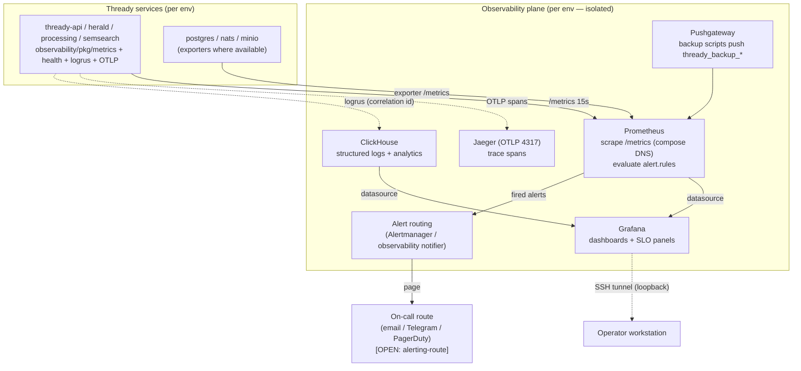

<!--
  Title           : Helix Thready — Monitoring & Observability (Prometheus/Grafana/OTel/ClickHouse)
  Classification  : PUBLIC
  Location        : docs/public/research/mvp/deployment/monitoring-observability.md
  Status          : Draft — v0.1
  Revision        : 1 (2026-07-22)
  Author          : Helix Thready documentation swarm (deployment)
  Related         : ./index.md, ./compose-files.md, ./backup-dr.md,
                    ./operations-runbook.md, ./tls-lets-encrypt.md, ./podman-compose.md,
                    ../architecture/index.md
-->

# Helix Thready — Monitoring & Observability

| Rev | Date | Author | Change |
|-----|------|--------|--------|
| 1 | 2026-07-22 | swarm (deployment) | Consolidated the Q42/Q43 observability deployment: signal topology, SLOs, the full alert-rule set (service-down, cert-expiry, latency, disk — closing the runbook's referenced-but-undefined alerts), alert routing, ClickHouse log analytics, OTel/Jaeger tracing wiring, dashboard inventory, and a reproduce-first alert test |

This document specifies **how Helix Thready is monitored** — the deployment of the in-house
`digital.vasic.observability` stack (Prometheus + Grafana + OpenTelemetry/Jaeger + ClickHouse, Q42/Q43,
`§14.4`) across the three environments, the **service-level objectives (SLOs)** it enforces, and the
**alert rules** that page an operator. It is the counterpart to the health/readiness contract in
[podman-compose.md §6.1](./podman-compose.md#61-operational-health-api-openapi-31): health gates a
*deploy*, monitoring watches *steady state*.

> **Why this document exists.** The [operations runbook](./operations-runbook.md#1-on-call-quick-card)
> reacts to a "Site down / 502/503" and a "Cert error / expiry alert", and [backup-dr.md §8](./backup-dr.md#8-chaos--dr-validation)
> defines backup-integrity alerts — but the **service-level and certificate alert rules those playbooks
> assume were not defined anywhere**. This document defines them, so every symptom the runbook responds
> to has a rule that fires it. `[GAP: consistency]`

> Diagram source: sibling under [`diagrams/`](./diagrams/). Rendered PNG/SVG exported via Docs Chain (§11.4.65).

## Table of Contents

1. [The in-house observability stack](#1-the-in-house-observability-stack)
2. [Signal-flow diagram](#2-signal-flow-diagram)
3. [The three signals: metrics, traces, logs](#3-the-three-signals-metrics-traces-logs)
4. [Service-level objectives (SLOs)](#4-service-level-objectives-slos)
5. [Alert rules (complete set)](#5-alert-rules-complete-set)
   - [5.1 Reproduce-first alert test (TDD)](#51-reproduce-first-alert-test-tdd)
6. [Alert routing](#6-alert-routing)
7. [Dashboards](#7-dashboards)
8. [Per-environment isolation](#8-per-environment-isolation)
9. [Verified vs assumed](#9-verified-vs-assumed)
10. [Open items](#10-open-items)

---

## 1. The in-house observability stack

Q42/Q43 fix the stack as **in-house `digital.vasic.observability`** — explicitly **not** ELK / Loki /
Datadog (`§14.4`). The four components, each deployed **per environment** so a dev incident cannot
perturb prod telemetry ([container-topology.md §3](./container-topology.md#3-service-inventory)):

| Component | Role | Deployed in | Source |
|-----------|------|-------------|--------|
| **Prometheus** | scrape + store metrics, evaluate alert rules | every env (`thready-prometheus`) | `[IN-HOUSE: observability]` |
| **Grafana** | dashboards over Prometheus (+ ClickHouse) | every env (`thready-grafana`) | `[IN-HOUSE: observability]` |
| **OpenTelemetry → Jaeger** | distributed traces (OTLP) | every env (`thready-jaeger`) | `[IN-HOUSE: observability]` |
| **ClickHouse** | structured-log + analytics store (logrus → CH) | every env (`thready-clickhouse`) | `[IN-HOUSE: observability]` |
| **Pushgateway** | ingest batch-job metrics (backup scripts) | every env (`thready-pushgateway`) | `[IN-HOUSE]` (referenced by [backup-dr.md §8](./backup-dr.md#8-chaos--dr-validation)) |

The application side uses `observability/pkg/health` for the readiness `Report`
([podman-compose.md §6.1](./podman-compose.md#61-operational-health-api-openapi-31)),
`observability/pkg/metrics` for the Prometheus `/metrics` surface, OTLP export for traces, and logrus
with correlation IDs for logs — all `[IN-HOUSE]`, all injected/config-driven.

## 2. Signal-flow diagram



**Explanation (for readers/models that cannot see the diagram).** Every Thready service emits **three
signals**. It exposes a Prometheus `/metrics` endpoint that the per-environment **Prometheus** scrapes
every 15 seconds over the in-network compose DNS names (never host ports, so a dev Prometheus can
physically never reach a prod service — see [compose-files.md §7](./compose-files.md#7-prometheus-scrape-config-sibling)).
It exports **trace spans** over OTLP to the per-environment **Jaeger**, and it writes **structured
logs** (logrus, each line carrying a correlation ID that ties it to a trace and a request) into
**ClickHouse**. Batch jobs that have no long-lived `/metrics` endpoint — notably the backup scripts —
**push** their timestamps to the per-environment **Pushgateway**, which Prometheus then scrapes, which
is how the backup-integrity alerts in [backup-dr.md §8](./backup-dr.md#8-chaos--dr-validation) get
their data.

Prometheus is both the store and the **alert engine**: it continuously evaluates the rule set in
[§5](#5-alert-rules-complete-set) and, when an expression trips for its `for:` duration, hands the
firing alert to the **alert-routing** layer, which pages the on-call operator over whichever channel
the operator wired (`[OPEN: alerting-route]`). **Grafana** reads both Prometheus (metrics/SLO panels)
and ClickHouse (log analytics) as datasources; because every host port is loopback-only, the operator
reaches Grafana over an **SSH tunnel** rather than a public port
([operations-runbook.md §2](./operations-runbook.md#2-routine-operations)). The entire plane is
replicated per environment, so the three environments' telemetry never mixes — the observability
expression of the [full-separation rule](./environments.md#2-what-fully-separated-means).

## 3. The three signals: metrics, traces, logs

- **Metrics (Prometheus).** Scrape config is the sibling in
  [compose-files.md §7](./compose-files.md#7-prometheus-scrape-config-sibling): `thready-api:8443`,
  `thready-herald:7080`, `thready-processing:8080` (`/metrics`), the Pushgateway, and — if enabled —
  `postgres_exporter`. Retention is per-env (`15d` prod / `10d` sta / `5d` dev,
  [compose-files.md §5](./compose-files.md#5-rendering-dev-and-sta-the-deltas)). RED metrics (Rate,
  Errors, Duration) per service back the SLOs in [§4](#4-service-level-objectives-slos).
- **Traces (OpenTelemetry → Jaeger).** Services export OTLP to `thready-jaeger:4317`
  ([compose-files.md §4](./compose-files.md#4-production-stack-composethreadyprodyml), `COLLECTOR_OTLP_ENABLED=true`).
  Trace sampling is per-env (`100%` dev / `25%` sta / `10%` prod,
  [environments.md §5](./environments.md#5-per-environment-configuration-matrix)) so prod tracing is
  cheap while dev is fully sampled for debugging. A correlation ID links a trace to its logs.
- **Logs (logrus → ClickHouse).** Structured JSON logs with correlation IDs flow to ClickHouse for
  queryable analytics; the container-local `json-file` driver keeps a **bounded** copy
  (`max-size: 50m, max-file: 5`, [compose-files.md §4](./compose-files.md#4-production-stack-composethreadyprodyml))
  so a log flood cannot fill the disk — ClickHouse holds the durable, searchable copy. **Secrets are
  redacted** from every log line ([secrets-and-config.md §1](./secrets-and-config.md#1-non-negotiable-rules)).

## 4. Service-level objectives (SLOs)

`[DEFAULT — adjustable]` — the targets the alerts and dashboards are built around. These make
"healthy" measurable rather than vibes-based.

| SLO | Target | Measured by | Ties to |
|-----|--------|-------------|---------|
| **API availability** | ≥ 99.5% monthly (prod) | `/health/ready` 200 ratio over the edge | [operations-runbook.md §1](./operations-runbook.md#1-on-call-quick-card) |
| **API latency** | p95 < 150 ms (prod) | `histogram_quantile` on request-duration | [container-topology.md §7](./container-topology.md#7-resource-limits) ("scale out if p95 > 150 ms") |
| **Semantic-search latency** | p95 < 500 ms | semsearch request-duration | gap-register §3.1 (< 500 ms search SLO) |
| **Post-processing lag** | p95 claim→reply within the per-post soft budget | BackgroundTasks queue depth + age | request `§`(30-min soft budget) |
| **RPO** | ≤ 1 h data loss | WAL-ship freshness | [backup-dr.md §1](./backup-dr.md#1-targets-rpo--rto) |
| **RTO** | ≤ 4 h restore | monthly drill duration | [backup-dr.md §8.1](./backup-dr.md#81-reproduce-first-dr-tests-tdd) |
| **Cert validity** | never serve an expired cert; renew < 30 days left | `days_left` metric | [tls-lets-encrypt.md §6](./tls-lets-encrypt.md#6-renewal--rotation-automated) |

Each SLO has a corresponding alert in [§5](#5-alert-rules-complete-set) that fires **before** the
objective is breached (a burn-rate / early-warning posture), not after users notice.

## 5. Alert rules (complete set)

This is the alert set the [operations runbook](./operations-runbook.md) responds to. The
**backup-integrity** rules already live in [backup-dr.md §8](./backup-dr.md#8-chaos--dr-validation)
(`WALArchiveStalled`, `DailyBaseBackupMissing`, `BackupChecksumFailed`, `RestoreDrillMissedRTO`) and
are **not** repeated here; this file adds the **service, edge, certificate, latency and resource**
rules that were previously referenced by the runbook but undefined.

```yaml
# /home/thready/prod/config/prometheus/rules/service-slo.rules.yml
# Loaded alongside backup-integrity.rules.yml (compose-files.md §7 rule_files).
groups:
  - name: thready-availability
    rules:
      - alert: ServiceDown
        # A Required service stopped exposing metrics / failing its up probe.
        expr: up{job=~"thready-.*"} == 0
        for: 2m
        labels: { severity: critical }
        annotations:
          summary: "{{ $labels.job }} is DOWN in {{ $labels.env }} (no scrape for 2m)"
          runbook: "operations-runbook.md#4-playbook--a-service-is-unhealthy--crash-looping"

      - alert: EdgeUnreachable
        # The public /health/ready blackbox probe over TLS is failing → user-facing outage.
        expr: probe_success{instance=~"https://.*thready.hxd3v.com/health/ready"} == 0
        for: 1m
        labels: { severity: critical, page: now }
        annotations:
          summary: "Public endpoint {{ $labels.instance }} unreachable — user-facing outage"
          runbook: "operations-runbook.md#3-incident-triage-diagram"

      - alert: ReadinessDegraded
        # Service is up but /health/ready reports a component unhealthy (incl. the GAP #1 embedder).
        expr: thready_health_ready{status="unhealthy"} == 1
        for: 3m
        labels: { severity: warning }
        annotations:
          summary: "{{ $labels.job }} readiness degraded in {{ $labels.env }} (a Report component is unhealthy)"

  - name: thready-latency
    rules:
      - alert: APILatencyHigh
        # p95 API latency over the 150 ms SLO for 10m → scale-out signal.
        expr: |
          histogram_quantile(0.95,
            sum(rate(thready_http_request_duration_seconds_bucket{job="thready-api"}[5m])) by (le, env)
          ) > 0.150
        for: 10m
        labels: { severity: warning, slo: api-latency }
        annotations:
          summary: "API p95 latency {{ $value | humanizeDuration }} > 150ms ({{ $labels.env }})"

      - alert: SemsearchLatencyHigh
        expr: |
          histogram_quantile(0.95,
            sum(rate(thready_semsearch_request_duration_seconds_bucket[5m])) by (le, env)
          ) > 0.500
        for: 10m
        labels: { severity: warning, slo: search-latency }
        annotations:
          summary: "Semantic-search p95 {{ $value | humanizeDuration }} > 500ms ({{ $labels.env }})"

      - alert: APIErrorRateHigh
        # >5% 5xx over 5m.
        expr: |
          sum(rate(thready_http_requests_total{job="thready-api",code=~"5.."}[5m])) by (env)
          / sum(rate(thready_http_requests_total{job="thready-api"}[5m])) by (env) > 0.05
        for: 5m
        labels: { severity: critical }
        annotations:
          summary: "API 5xx ratio {{ $value | humanizePercentage }} > 5% ({{ $labels.env }})"

  - name: thready-certificates
    rules:
      - alert: CertificateExpirySoon
        # The le-api status days_left, exported as a gauge, dropped below the renewal window.
        # Fires BEFORE expiry so the twice-daily timer has runway; escalates as it shrinks.
        expr: thready_cert_days_left < 20
        for: 1h
        labels: { severity: warning }
        annotations:
          summary: "TLS cert for {{ $labels.domain }} expires in {{ $value }}d (renew window is 30d) — check renewal timer"
          runbook: "operations-runbook.md#5-playbook--certificate-expiry-imminent--renewal-failing"
      - alert: CertificateExpiryCritical
        expr: thready_cert_days_left < 7
        for: 10m
        labels: { severity: critical, page: now }
        annotations:
          summary: "TLS cert for {{ $labels.domain }} expires in {{ $value }}d — renewal is FAILING"

  - name: thready-resources
    rules:
      - alert: DiskPressure
        expr: (node_filesystem_avail_bytes{mountpoint="/home"} / node_filesystem_size_bytes{mountpoint="/home"}) < 0.15
        for: 5m
        labels: { severity: warning }
        annotations:
          summary: "Host /home < 15% free — DB/asset growth + container churn compete"
          runbook: "operations-runbook.md#7-playbook--disk-pressure"
      - alert: JetStreamConsumerLagHigh
        # Processing is falling behind ingest → post-processing SLO at risk.
        expr: thready_jetstream_consumer_pending{stream="posts"} > 5000
        for: 10m
        labels: { severity: warning }
        annotations:
          summary: "BackgroundTasks lag {{ $value }} pending posts ({{ $labels.env }}) — processing behind ingest"
```

- The `thready_cert_days_left` gauge is exported by a tiny exporter that runs `le-api status --json`
  ([tls-lets-encrypt.md §9](./tls-lets-encrypt.md#9-programmatic-json-driver)) and publishes its
  verified `days_left` field — turning the runbook's "cert expiry alert" from an implied manual check
  into a real firing rule.
- `EdgeUnreachable` uses a blackbox-exporter probe against the **public TLS** `/health/ready` — the
  same signal the [incident-triage diagram](./operations-runbook.md#3-incident-triage-diagram) starts
  from, so the alert and the human triage agree on ground truth.

### 5.1 Reproduce-first alert test (TDD)

`[CONVENTIONS §6]` `[CONSTITUTION §11.4.27]` — an alert rule is only real if a **reproduce-first (RED)**
test provokes the condition and asserts the rule fires. These run against Prometheus's own
`promtool test rules` harness with synthetic series and are authored in [testing](../testing/index.md);
the skeleton pins the behaviour this document promises.

```yaml
# service-slo.rules.test.yml — promtool test rules. RED first: written to fail if the rule is missing.
rule_files: [service-slo.rules.yml]
evaluation_interval: 1m
tests:
  - interval: 1m
    input_series:
      - series: 'up{job="thready-api",env="prod"}'
        values: '1 1 0 0 0 0'          # service drops at t=2m and stays down
      - series: 'thready_cert_days_left{domain="thready.hxd3v.com"}'
        values: '5 5 5 5 5 5'          # cert 5 days out → must be CRITICAL
    alert_rule_test:
      - eval_time: 5m
        alertname: ServiceDown
        exp_alerts:
          - exp_labels: { severity: critical, job: thready-api, env: prod }
      - eval_time: 5m
        alertname: CertificateExpiryCritical
        exp_alerts:
          - exp_labels: { severity: critical, page: now, domain: thready.hxd3v.com }
```

A missing or mistyped rule makes `promtool test rules` fail — so the alert set cannot silently rot
away from the runbook it backs.

## 6. Alert routing

`[OPEN: alerting-route]` — the rules define **what** fires and its `severity`/`page` labels; **who is
paged and how** is an operator wiring choice. The routing layer (Alertmanager or the `observability`
notifier) maps labels → channels:

| Label | Route `[DEFAULT — adjustable]` |
|-------|-------------------------------|
| `severity: critical` + `page: now` | immediate page — Telegram bot (fits the in-house Herald stack) and/or PagerDuty |
| `severity: critical` | Telegram + email |
| `severity: warning` | email digest + Grafana panel; no wake-up |
| `env != prod` | dev/sta alerts route to a low-priority channel — never page on a dev incident |

Routing by the `env` label keeps a dev/sta problem from waking anyone, matching the per-environment
isolation posture. The concrete channel choice is tracked for the observability wiring in
[development](../development/index.md); until then, `warning` lands in Grafana and `critical` in email.

## 7. Dashboards

Grafana ships a small, purposeful set (`[DEFAULT — adjustable]`), provisioned from
`./config/grafana/` so they are versioned, not click-built:

| Dashboard | Panels |
|-----------|--------|
| **Fleet overview** | per-service `up`, RED metrics, the [readiness Report](./podman-compose.md#61-operational-health-api-openapi-31) status |
| **SLO board** | API/search p95, error ratio, availability burn-rate vs the [§4](#4-service-level-objectives-slos) targets |
| **Backup & DR** | WAL-ship freshness, last base backup, last drill duration (feeds [backup-dr.md §8](./backup-dr.md#8-chaos--dr-validation)) |
| **TLS** | `days_left` per subdomain, last renewal result |
| **Capacity & cost** | disk/RAM/CPU headroom, asset-tier growth, metered-usage counters (feeds [cost-and-capacity.md §6](./cost-and-capacity.md#6-billing-offset-model-subscription--metered)) |

The **Capacity & cost** board deliberately surfaces the metered-usage counters
([cost-and-capacity.md §6](./cost-and-capacity.md#6-billing-offset-model-subscription--metered)) so a
broken usage meter shows up as an anomaly rather than a silent revenue leak.

## 8. Per-environment isolation

Each environment runs its **own** Prometheus/Grafana/Jaeger/ClickHouse
([container-topology.md §3](./container-topology.md#3-service-inventory)); scrape targets are
in-network compose DNS names, so cross-env scraping is physically impossible
([compose-files.md §7](./compose-files.md#7-prometheus-scrape-config-sibling)). Every series carries an
`env` label (`external_labels: { env: prod }`), so even if dashboards are viewed side by side the data
never blends, and alert routing can silence non-prod. This is the telemetry-layer expression of the
[separation checklist](./environments.md#2-what-fully-separated-means).

## 9. Verified vs assumed

- **VERIFIED (from the authoritative docs / module):** the in-house Prometheus + Grafana + OTel/Jaeger
  + ClickHouse stack and the explicit *not* ELK/Loki/Datadog decision (Q42/Q43, `§14.4`); the
  `observability/pkg/health` `Report` shape ([podman-compose.md §6.1](./podman-compose.md#61-operational-health-api-openapi-31));
  the scrape topology and Pushgateway ([compose-files.md §7](./compose-files.md#7-prometheus-scrape-config-sibling));
  per-env sampling/retention ([environments.md §5](./environments.md#5-per-environment-configuration-matrix));
  the `le-api status` `days_left` field the cert exporter reads ([tls-lets-encrypt.md §9](./tls-lets-encrypt.md#9-programmatic-json-driver)).
- **ASSUMED / `[DEFAULT — adjustable]`:** the SLO thresholds (p95 150 ms / 500 ms, 99.5% availability);
  the exact Thready metric names (`thready_http_request_duration_seconds_bucket`,
  `thready_cert_days_left`, `thready_jetstream_consumer_pending` — Thready-owned services are
  FOUNDATION/BUILD-NEW); Alertmanager-vs-`observability`-notifier for routing; the blackbox/
  postgres/node exporters being enabled; the dashboard inventory.

## 10. Open items

- `[OPEN: alerting-route]` — the page channel (email/Telegram/PagerDuty) is an operator/observability
  wiring choice; the rules carry the `severity`/`page` labels the router needs
  ([operations-runbook.md §13](./operations-runbook.md#13-open-items)).
- `[OPEN: exporters]` — whether to run `postgres_exporter`, `node_exporter` and `blackbox_exporter`
  (assumed by the resource/edge rules) or source those signals another way is an observability-area
  implementation choice; the rules are inert until their series exist.
- `[OPEN: metric-names]` — the Thready service metric names are pinned once the FOUNDATION/BUILD-NEW
  services emit real `observability/pkg/metrics` series; the rules above use the intended names.

---

*Made with love ♥ by Helix Development.*
