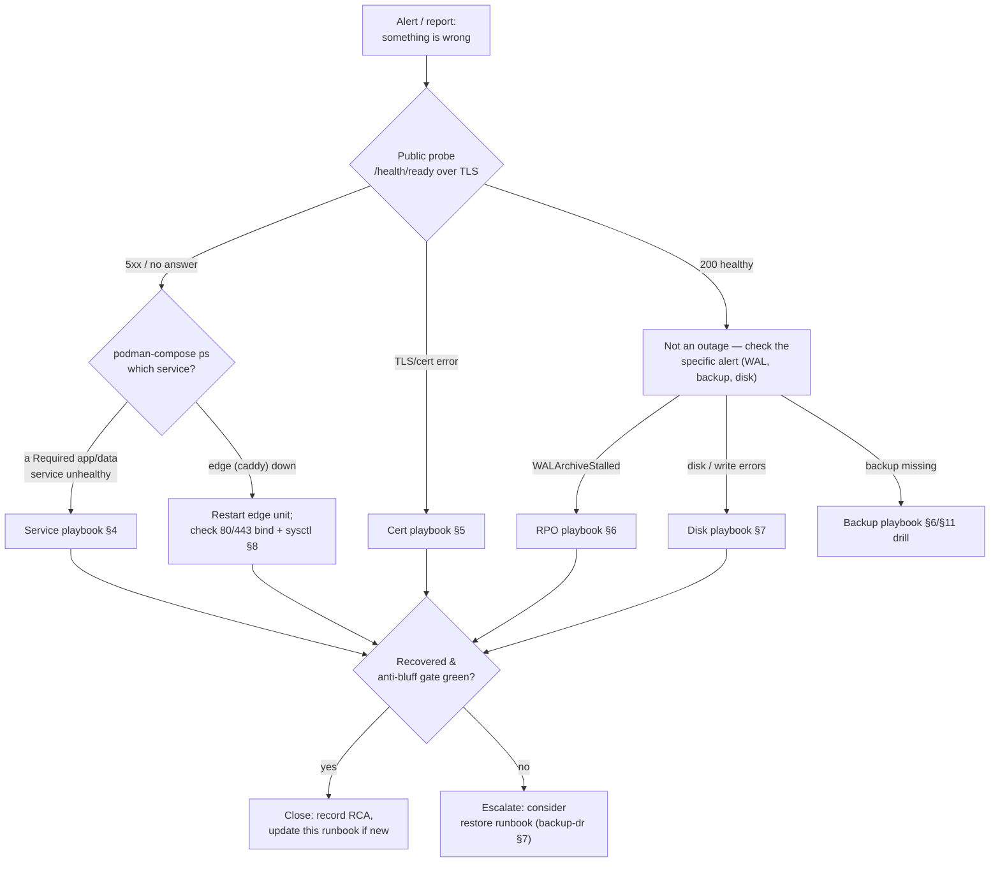

<!--
  Title           : Helix Thready — Day-2 Operations & Incident Runbook
  Classification  : PUBLIC
  Location        : docs/public/research/mvp/deployment/operations-runbook.md
  Status          : Review — v0.1
  Revision        : 1 (2026-07-22)
  Author          : Helix Thready documentation swarm (deployment)
  Related         : ./index.md, ./hetzner-provisioning.md, ./deploy-and-rollback.md,
                    ./backup-dr.md, ./tls-lets-encrypt.md, ./podman-compose.md,
                    ./compose-files.md, ./secrets-and-config.md, ./service-discovery-ports.md,
                    ./monitoring-observability.md
-->

# Helix Thready — Day-2 Operations & Incident Runbook

| Rev | Date | Author | Change |
|-----|------|--------|--------|
| 1 | 2026-07-22 | swarm (deployment) | Consolidated day-2 operator runbook: routine ops, on-call quick card, incident playbooks, maintenance cadence |

Where [hetzner-provisioning.md](./hetzner-provisioning.md) is the **day-0/day-1** runbook (bring the
host into existence) and [deploy-and-rollback.md](./deploy-and-rollback.md) is the **release**
mechanism, this is the **day-2** runbook: what an operator runs during normal operation and what they
do when a specific thing breaks. Every command runs **as the `thready` user, rootless, no `sudo`**
`[CONSTITUTION §11.4.76/161]`. Every incident playbook ends by re-running the same
[health-gated verification](./deploy-and-rollback.md#7-post-deploy-verification-anti-bluff-gate) a
normal deploy uses, so "resolved" always means *verified healthy*, never *looks up*.

> Diagram source: sibling under [`diagrams/`](./diagrams/). Rendered PNG/SVG exported via Docs Chain (§11.4.65).

## Table of Contents

1. [On-call quick card](#1-on-call-quick-card)
2. [Routine operations](#2-routine-operations)
3. [Incident-triage diagram](#3-incident-triage-diagram)
4. [Playbook — a service is unhealthy / crash-looping](#4-playbook--a-service-is-unhealthy--crash-looping)
5. [Playbook — certificate expiry imminent / renewal failing](#5-playbook--certificate-expiry-imminent--renewal-failing)
6. [Playbook — WAL archive stalled (RPO at risk)](#6-playbook--wal-archive-stalled-rpo-at-risk)
7. [Playbook — disk pressure](#7-playbook--disk-pressure)
8. [Playbook — host reboot / after power loss](#8-playbook--host-reboot--after-power-loss)
9. [Playbook — a deploy is stuck or a rollback did not complete](#9-playbook--a-deploy-is-stuck-or-a-rollback-did-not-complete)
10. [Playbook — suspected secret leak](#10-playbook--suspected-secret-leak)
11. [Maintenance cadence](#11-maintenance-cadence)
12. [Verified vs assumed](#12-verified-vs-assumed)
13. [Open items](#13-open-items)

---

## 1. On-call quick card

The five things to know at 3 a.m. Full detail is in the playbooks below.

| Symptom | First look | Playbook |
|---------|-----------|----------|
| Site down / 502 / 503 | `curl -sS -o /dev/null -w '%{http_code}' https://thready.hxd3v.com/health/ready` | [§4](#4-playbook--a-service-is-unhealthy--crash-looping) |
| Cert error / expiry alert | `le-api status --config /home/thready/prod/config/lets_encrypt.conf` | [§5](#5-playbook--certificate-expiry-imminent--renewal-failing) |
| `WALArchiveStalled` alert | `podman logs thready-postgres 2>&1 \| tail` + check secondary | [§6](#6-playbook--wal-archive-stalled-rpo-at-risk) |
| Disk full / write errors | `df -h; podman system df` | [§7](#7-playbook--disk-pressure) |
| Deploy hung / half-rolled-back | `podman-compose -p thready-prod ps` | [§9](#9-playbook--a-deploy-is-stuck-or-a-rollback-did-not-complete) |

**Golden rule:** a production change is only "done" after
`thready-deploy.sh --env prod` (or the manual equivalent) passes the health gate **and** the edge
probe returns `200`. Never leave prod on an un-verified state.

## 2. Routine operations

All paths assume the layout in [podman-compose.md §3](./podman-compose.md#3-compose-file-layout).

```bash
ENV=prod                                  # dev | sta | prod
DIR="/home/thready/$ENV"

# ---- status & logs --------------------------------------------------------
podman-compose -p "thready-$ENV" ps                         # what is actually running
podman-compose -p "thready-$ENV" logs -f --tail=200 thready-api
podman healthcheck run thready-api 2>/dev/null || true      # force a healthcheck now (rootless)
curl -fsS "https://thready.hxd3v.com/health/ready" | jq .   # end-to-end readiness (Report JSON)

# ---- deploy / rollback (health-gated, self-rolling-back) -------------------
"$DIR/../submodules/containers/scripts/thready-deploy.sh" "$ENV" "THREADY-1.4.0"
# rollback is automatic on gate failure; to force back to the recorded previous release:
thready-boot --env "$ENV" --restore-previous

# ---- certificates ---------------------------------------------------------
LE=/home/thready/submodules/lets_encrypt
CFG="$DIR/config/lets_encrypt.conf"
"$LE/scripts/status.sh" --config "$CFG"                     # subject, SANs, days-left, renew_due
"$LE/scripts/renew.sh"  --config "$CFG"                     # no-op unless inside the window
systemctl --user list-timers 'le-renew-*'                  # confirm the renewal timers are armed

# ---- backup health --------------------------------------------------------
rclone lsl thready-secondary:base/$ENV | tail -3            # latest daily base backups present?
rclone lsl thready-secondary:wal/$ENV  | tail -3            # WAL chain flowing?
systemctl --user list-timers 'thready-backup-*'

# ---- observability --------------------------------------------------------
# Grafana over an SSH tunnel (host ports are loopback-only):
#   ssh -L 3000:127.0.0.1:62003 thready@host   → http://localhost:3000
```

`podman-compose … ps` (not merely a zero exit) is the anti-bluff habit the `containers` tooling
itself models: **read what actually came up**, do not trust a silent success.

## 3. Incident-triage diagram



**Explanation (for readers/models that cannot see the diagram).** Triage always begins from the
**single public signal** every other subsystem also trusts: the `/health/ready` probe over the real
TLS endpoint. That one call disambiguates the three top-level failure modes. If it returns a healthy
`200`, there is no user-facing outage and the operator is instead reacting to a *specific* internal
alert (a stalled WAL, a missing backup, disk pressure) — those route to their own playbooks and never
warrant a risky production restart.

If the probe fails at the **TLS layer** (an expired or mis-installed certificate), the certificate
playbook in §5 owns it, because a cert fault is handled entirely by the `lets_encrypt` risk-free gate
and is independent of the application. If the probe returns a **5xx or nothing**, the operator runs
`podman-compose ps` to localize the fault: an edge (Caddy) failure is a narrow "restart the edge,
confirm it can still bind 80/443" path (§8), whereas a `Required` application or data-plane service
being unhealthy routes to the service playbook in §4, which leans on the same reverse-order,
self-rolling-back machinery a deploy uses.

Every branch **converges on one gate**: is the system recovered *and* does the anti-bluff verification
pass? Only a green gate closes the incident — and closing it includes writing the root-cause note and,
if the failure was novel, extending this runbook so the next operator inherits the knowledge. If the
gate cannot be made green in place, the path escalates to the full
[restore runbook](./backup-dr.md#7-restore-runbook-rto--4h), trading a longer RTO for a known-good
rebuild rather than fighting an unrecoverable live state.

## 4. Playbook — a service is unhealthy / crash-looping

**Detect.** `/health/ready` returns `503`, or `podman-compose -p thready-prod ps` shows a service
`unhealthy`/`restarting`.

```bash
ENV=prod; SVC=thready-api
podman-compose -p "thready-$ENV" ps
podman-compose -p "thready-$ENV" logs --tail=300 "$SVC"     # root-cause in the logs
curl -fsS "http://127.0.0.1:62443/health/ready" | jq .      # which Report component is unhealthy?
```

**Decide by which component the `Report` names** (the readiness contract in
[podman-compose.md §6.1](./podman-compose.md#61-operational-health-api-openapi-31)):

| Unhealthy component | Likely cause | Action |
|---------------------|--------------|--------|
| `postgres` | DB down / disk / connections exhausted | `podman-compose restart thready-postgres`; if it will not start → [§7](#7-playbook--disk-pressure) / [restore](./backup-dr.md#7-restore-runbook-rto--4h) |
| `nats` | JetStream store issue | restart `thready-nats`; check `…:62223/healthz` |
| `minio` | object store / disk | restart; verify `…/minio/health/ready`; [§7](#7-playbook--disk-pressure) |
| `embedder` | **HashEmbedder active or LLM unreachable** `[GAP: #1]` | confirm `HELIX_EMBEDDING_PROVIDER=llama` and `HELIX_LLM_BASE_URL` reachable — the probe is *supposed* to fail loudly here |

**Recover (single service, no full redeploy):**

```bash
podman-compose -p "thready-$ENV" up -d --force-recreate "$SVC"   # recreate just this one
# then re-prove readiness — do NOT declare victory on a restart alone:
curl -fsS "https://thready.hxd3v.com/health/ready" | jq -e '.status=="healthy"'
```

If a **bad release** is the cause (started failing right after a deploy), roll the whole release back
rather than nursing one container:

```bash
thready-boot --env "$ENV" --restore-previous     # brings the previous digests back up (releases/previous.json)
```

This is the deploy-time `restorePrevious` path
([deploy-and-rollback.md §4](./deploy-and-rollback.md#4-the-deploy-script-bash--go-gate)) invoked
manually. The `embedder`-unhealthy row is deliberately *not* "make it pass": a stack that would serve
garbage-relevance search must stay blocked until a real `llama` embedder is wired.

## 5. Playbook — certificate expiry imminent / renewal failing

**Detect.** Browser TLS error, or the `le-api status` `renew_due` is `true` / `days_left` is low, or
the twice-daily timer has been failing.

```bash
LE=/home/thready/submodules/lets_encrypt
CFG=/home/thready/prod/config/lets_encrypt.conf
"$LE/scripts/status.sh" --config "$CFG"                    # days_left, renew_due, SANs, not_after
systemctl --user status le-renew-prod.service              # last run + failure reason
journalctl --user -u le-renew-prod.service --no-pager | tail -40
```

**Recover.** Force a renewal (the risk-free gate protects you — a bad renew self-rolls-back to the
current cert, verified `engine.sh`):

```bash
"$LE/scripts/renew.sh" --config "$CFG" --force            # bypass the window; still validate→backup→deploy→probe→rollback
# if the CA is rate-limiting or you suspect a bad state, rehearse on STAGING first:
#   set LE_STAGING=1 in the config, run issue.sh, confirm, then flip back to 0.
```

**If HTTP-01 itself is failing** (port 80 unreachable, webroot wrong): confirm the firewall still
allows `80` ([hetzner-provisioning.md §5](./hetzner-provisioning.md#5-firewall)), the edge serves
`/.well-known/acme-challenge/*` ([environments.md §4](./environments.md#4-the-edge-reverse-proxy)),
and `/var/www/acme` is writable by acme.sh. As a fallback, switch that env to **DNS-01**
([tls-lets-encrypt.md §4](./tls-lets-encrypt.md#4-challenge-types-http-01-vs-dns-01)) — no port 80
needed. The served site is never taken down by a cert operation because the atomic `mv` deploy-hook +
probe-and-rollback gate is always in the path.

## 6. Playbook — WAL archive stalled (RPO at risk)

**Detect.** The `WALArchiveStalled` alert fired (no WAL segment shipped in > 90 min — the RPO guard
from [backup-dr.md §8](./backup-dr.md#8-chaos--dr-validation)).

```bash
ENV=prod
podman-compose -p "thready-$ENV" logs --tail=100 thready-postgres | grep -i archive
rclone lsl thready-secondary:wal/$ENV | tail -5            # last shipped segment timestamp
rclone about thready-secondary:                           # is the secondary reachable / full?
```

**Recover.** The three usual causes and their fix:

| Cause | Fix |
|-------|-----|
| Secondary unreachable (network/credential) | Fix `rclone` remote / credentials; Postgres retries `archive_command` automatically — segments queue in `pg_wal` and flush once it succeeds |
| Secondary full | Free space / expand; apply the [retention ladder](./backup-dr.md#6-secondary-store--retention) prune |
| `archive_command` itself failing | `podman exec thready-postgres sh -c 'rclone copyto /path %f …'` to reproduce; fix the command; reload Postgres config |

Do **not** delete unshipped WAL from `pg_wal` to reclaim space — that breaks the PITR chain and the
RPO guarantee. If `pg_wal` is filling the disk, expand storage or fix shipping; see also
[§7](#7-playbook--disk-pressure). Once segments flow again, confirm the alert clears and the WAL
timestamp on the secondary is fresh.

## 7. Playbook — disk pressure

**Detect.** `DailyBaseBackupMissing`/write errors, or `df -h` shows a full filesystem. Rootless
Podman state lives under `/home/thready/.local/share/containers/` — it is on the same volume as the
DB/asset data, so container churn and data growth compete.

```bash
df -h /home/thready
podman system df                                          # image/volume/container space
du -sh /home/thready/.local/share/containers/storage/volumes/* | sort -h | tail
```

**Recover — safe-to-reclaim, in order:**

```bash
podman image prune -f                                     # dangling images from old releases
podman system prune -f                                    # stopped containers, unused networks (NOT volumes)
# Rotate container logs (json-file caps are set in the compose x-logging anchor).
# Old MinIO renditions / old partitions are archived to the object tier by the database area, not deleted here.
```

**Never** `podman volume prune` on this host without care — it can destroy `thready-<env>-pgdata`.
The durable data classes (pgdata, pgwal, minio) are protected by the [backup plan](./backup-dr.md);
cache (`redis`) and analytics (`clickhouse`) are rebuildable and safe to shrink. If Postgres is out of
space specifically, prioritise WAL shipping ([§6](#6-playbook--wal-archive-stalled-rpo-at-risk)) so
archived segments can be trimmed from `pg_wal` normally.

## 8. Playbook — host reboot / after power loss

The stacks come back **automatically** because of lingering + `systemd --user` units
([podman-compose.md §7](./podman-compose.md#7-rootless-systemd-integration-linger--quadlet)). Verify,
don't assume:

```bash
loginctl show-user thready | grep Linger                  # Linger=yes (else: loginctl enable-linger thready as root once)
systemctl --user list-units 'thready-*.service' 'thready-edge.service'
systemctl --user list-timers 'le-renew-*' 'thready-backup-*'
# If a stack did not come up:
systemctl --user start thready-prod.service
curl -fsS https://thready.hxd3v.com/health/ready | jq -e '.status=="healthy"'
```

**If the edge cannot bind 80/443 after reboot,** confirm the privileged-port sysctl survived
([hetzner-provisioning.md §4](./hetzner-provisioning.md#4-the-privileged-port-sysctl-why-root-is-needed-once)):
`sysctl net.ipv4.ip_unprivileged_port_start` must be `80` (it is set persistently in
`/etc/sysctl.d/99-thready-ports.conf`; a manual `sysctl --system` reapplies it). Bring the edge up
before the app stacks so routing is ready.

## 9. Playbook — a deploy is stuck or a rollback did not complete

The `BootManager` rolls back **internally** on any `Required`-service failure or context cancellation
(verified reverse-order `Down`, `pkg/boot/manager.go`), so a *clean* failed deploy already restored
itself. This playbook is for the rare case a run was killed mid-flight (SSH dropped, host OOM).

```bash
ENV=prod
podman-compose -p "thready-$ENV" ps                       # is it new digests, old digests, or a mix?
cat "/home/thready/$ENV/releases/current.json"  | jq .version
cat "/home/thready/$ENV/releases/previous.json" | jq .version
```

**Reconcile to the last known-good release:**

```bash
# Force the previous (or a specific) known-good release fully up, then prove it.
thready-boot --env "$ENV" --restore-previous
curl -fsS "https://thready.hxd3v.com/health/ready" | jq -e '.status=="healthy"'
# Confirm no half-booted / buildnew leak (anti-bluff):
podman-compose -p "thready-$ENV" ps --services --filter status=running
```

If the DB migration's **expand** phase applied but the boot failed, the schema is still
backward-compatible by design (expand-only, [deploy-and-rollback.md §5](./deploy-and-rollback.md#5-expand-contract-database-migrations)),
so the previous release runs correctly against it — no schema rollback is required to recover service.
Only a mid-apply migration *error* triggers `migration.Runner.Rollback`. Never hand-edit
`current.json` to "promote" a stack you have not verified.

## 10. Playbook — suspected secret leak

Follow the verified rotate-on-leak runbook from
[secrets-and-config.md §6](./secrets-and-config.md#6-leak-audit--rotation) — summarized here for
on-call:

1. **Revoke at source** — LLM/messenger console, DB `ALTER ROLE … PASSWORD`, or
   `lets_encrypt revoke.sh` + `rotate.sh` for a cert/key.
2. **Replace** the value in the **private repo**, refresh `/home/thready/<env>/.env` /
   `secrets/api_keys.sh` (`chmod 600`).
3. **Redeploy** the affected env — the health gate confirms the new credential works.
4. **Purge history** only if the secret ever reached a *tracked* file (BFG/`git filter-repo`), then
   force-refresh all four upstreams once (the only sanctioned rewrite).

Treat any hit from the continuous scan (`security/pkg/scanner` + `secret-scan.sh`) as a **P0**. The
deploy pre-flight and `pre-commit` hook are the two independent guards that should have caught it;
record which failed so the gap is closed.

## 11. Maintenance cadence

| Cadence | Task | Command / reference |
|---------|------|--------------------|
| Twice daily (auto) | Cert renewal check (no-op unless due) | `le-renew-*.timer` ([tls §10](./tls-lets-encrypt.md#10-rootless-systemd-timer-install)) |
| Hourly (auto) | WAL segment ship (`archive_timeout=3600`) | [backup-dr §4](./backup-dr.md#4-postgresql-daily-full--hourly-wal-pitr) |
| Daily (auto) | Full `pg_basebackup` + asset/nats/config snapshot | [backup-dr §2](./backup-dr.md#2-what-is-backed-up) |
| Weekly | Review Grafana SLO dashboards; check alert noise; `podman image prune` | [§2](#2-routine-operations) |
| **Monthly** | **Restore drill** — restore latest prod backup into a dev-band throwaway, verify RTO ≤ 4 h | [backup-dr §8](./backup-dr.md#8-chaos--dr-validation) |
| Monthly | Cert key hygiene rotation (optional) | `rotate.sh` ([tls §6](./tls-lets-encrypt.md#6-renewal--rotation-automated)) |
| Quarterly | Secret rotation pass; firewall + SSH audit; OS patch window | [secrets §6](./secrets-and-config.md#6-leak-audit--rotation), [hetzner §5](./hetzner-provisioning.md#5-firewall) |
| Per release | Promote dev→sta→prod with health-gated deploy | [environments §6](./environments.md#6-promotion-flow-dev--sta--prod) |

The **monthly restore drill is not optional**: a backup that has never been restored is a hypothesis,
not a recovery plan. The drill's measured duration feeds the `thready_restore_drill_seconds` metric and
the `RestoreDrillMissedRTO` alert, so an over-4h drill is a tracked P1 finding
([backup-dr.md §8.1](./backup-dr.md#81-reproduce-first-dr-tests-tdd)).

## 12. Verified vs assumed

- **VERIFIED (read at source):** the `BootManager` reverse-order self-rollback (`pkg/boot/manager.go`);
  the `lets_encrypt` `status.sh --json` fields (`days_left`, `renew_due`, `sans`, `not_after`) and the
  `renew.sh --force` window bypass with the risk-free gate (`scripts/renew.sh`, `lib/engine.sh`); the
  twice-daily renewal timer + oneshot service (`systemd/*`); the `/health/ready` `Report` shape
  ([podman-compose.md §6.1](./podman-compose.md#61-operational-health-api-openapi-31)).
- **ASSUMED / `[DEFAULT — adjustable]`:** the `thready-deploy.sh` / `thready-boot` / `thready-backup-*`
  wrapper + unit names (Thready conventions, not module APIs); the `rclone` remote name
  `thready-secondary`; the Grafana SSH-tunnel workflow; the maintenance intervals.

## 13. Open items

- `[OPEN: alerting-route]` — where alerts *page* (email/Telegram/PagerDuty) is an operator choice; the
  Prometheus rules in [monitoring-observability.md §5](./monitoring-observability.md#5-alert-rules-complete-set)
  (service-down, edge, cert-expiry, latency, resource) and
  [backup-dr.md §8](./backup-dr.md#8-chaos--dr-validation) (backup-integrity) define *what* fires, with
  `severity`/`page` labels; *who* is woken is the observability wiring in
  [monitoring-observability.md §6](./monitoring-observability.md#6-alert-routing).
- `[OPEN: runbook-automation]` — several playbook steps (single-service recreate, restore-previous)
  could be wrapped as `thready-ops <verb>` subcommands; a nice-to-have over the documented manual path.

---

*Made with love ♥ by Helix Development.*
