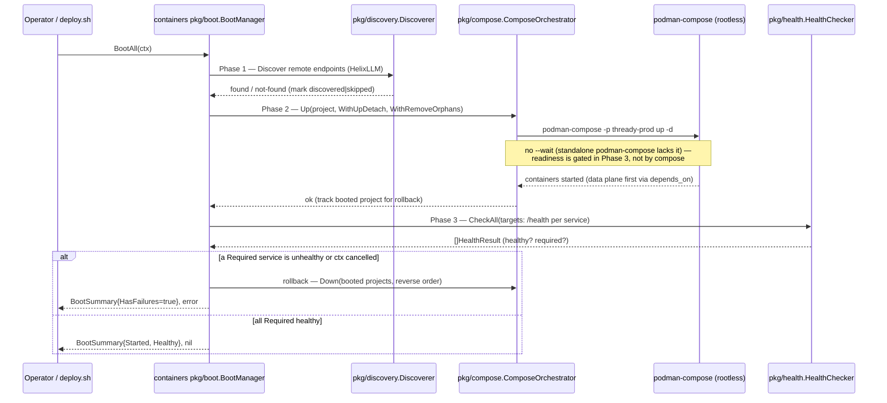

<!--
  Title           : Helix Thready — Rootless Podman Compose Runtime
  Classification  : PUBLIC
  Location        : docs/public/research/mvp/deployment/podman-compose.md
  Status          : Review — v0.2
  Revision        : 2 (2026-07-21)
  Author          : Helix Thready documentation swarm (deployment)
  Related         : ./index.md, ./container-topology.md, ./deploy-and-rollback.md,
                    ./hetzner-provisioning.md, ../testing/index.md
-->

# Helix Thready — Rootless Podman Compose Runtime

| Rev | Date | Author | Change |
|-----|------|--------|--------|
| 1 | 2026-07-21 | swarm (deployment) | Initial rootless runtime + `containers` boot/orchestrator API + compose layout + health gating |
| 2 | 2026-07-21 | swarm (deployment review) | Fixed the boot-diagram `--wait` contradiction; added the OpenAPI 3.1 operational health contract; split the boot-sequence prose into multiple paragraphs |

This document specifies **how** the Thready stacks run: the rootless Podman runtime, the
`vasic-digital/containers` orchestration API (`pkg/boot`, `pkg/compose`, `pkg/health`), the
compose-file layout, and the health-gated boot sequence. It is the mechanism layer beneath
[container-topology.md](./container-topology.md) (what runs) and
[deploy-and-rollback.md](./deploy-and-rollback.md) (how a release is applied).

> Diagram source: sibling under [`diagrams/`](./diagrams/). Rendered PNG/SVG exported via Docs Chain (§11.4.65).

## Table of Contents

1. [Why rootless Podman (constraint)](#1-why-rootless-podman-constraint)
2. [Compose command detection](#2-compose-command-detection)
3. [Compose file layout](#3-compose-file-layout)
4. [The containers orchestration API](#4-the-containers-orchestration-api)
5. [Boot sequence diagram](#5-boot-sequence-diagram)
6. [Health gating](#6-health-gating)
   - [6.1 Operational health API (OpenAPI 3.1)](#61-operational-health-api-openapi-31)
   - [6.2 Reproduce-first health-gate test (TDD)](#62-reproduce-first-health-gate-test-tdd)
7. [Rootless systemd integration (linger + quadlet)](#7-rootless-systemd-integration-linger--quadlet)
8. [Bringing a stack up / down (commands)](#8-bringing-a-stack-up--down-commands)
9. [Verified vs assumed](#9-verified-vs-assumed)
10. [Open items](#10-open-items)

---

## 1. Why rootless Podman (constraint)

`[CONSTITUTION §11.4.76/161]` makes **rootless Podman the sole container orchestration layer** — no
Docker daemon, no `sudo`, no root in the runtime path. This is not a preference; it is mandated.
Consequences that shape everything below:

- Containers run in the `thready` user's namespace; UIDs/GIDs are mapped via `/etc/subuid` and
  `/etc/subgid` (set once during [provisioning](./hetzner-provisioning.md)).
- Binding privileged ports (80/443) from a rootless container requires either lowering
  `net.ipv4.ip_unprivileged_port_start` (the chosen default) or a port-forward helper — a one-time
  **root** provisioning step, never a runtime one.
- Persistent state lives under `/home/thready/.local/share/containers/` — this directory is part of
  the [backup plan](./backup-dr.md).
- The runtime survives logout only if **lingering** is enabled (`loginctl enable-linger thready`),
  see [§7](#7-rootless-systemd-integration-linger--quadlet).

## 2. Compose command detection

The `containers` module's `pkg/compose` orchestrator auto-detects the compose command and is
**Podman-first aware**. This is a real, subtle correctness property verified in
`pkg/compose/orchestrator.go`:

- `detectComposeCmd()` probes `{"docker", ["compose"]}` first, then `podman compose`, then
  standalone `podman-compose`, then `docker-compose` v1.
- On a **podman-docker compatibility-shim** host, `docker compose version` exits 0 by silently
  re-execing into podman — so the orchestrator also **inspects the combined stdout/stderr for a
  podman banner** and reclassifies the backend as podman even when the literal command is `docker`.
  Without this, `Status()` and `Up(WithWait)` would take docker-native code paths against a podman
  backend and break.
- `isPodmanComposeCmd()` distinguishes the standalone `podman-compose` tool (which lacks
  `up --wait` and emits podman-native JSON from `ps`) from the docker-compose-compatible
  `podman compose` provider.

**For Thready we target the standalone `podman-compose` tool** installed rootless during
provisioning, and we do **not** rely on `up --wait` (which `podman-compose` lacks); the boot
sequence uses the `containers` health checker for readiness gating instead (see [§6](#6-health-gating)).
`[VERIFIED: containers/pkg/compose/orchestrator.go]`

## 3. Compose file layout

On the host, under `/home/thready`, the layout is one directory per environment plus a shared edge:

```
/home/thready/
├── edge/                          # host-wide reverse proxy (spans all envs)
│   ├── compose.edge.yml
│   ├── Caddyfile
│   └── certs/                     # live certs installed by lets_encrypt deploy-hook
├── dev/
│   ├── compose.thready.dev.yml    # dev stack (port band 60xxx)
│   ├── .env                       # dev secrets (chmod 600, gitignored)
│   └── config/
├── sta/
│   ├── compose.thready.sta.yml    # sta stack (port band 61xxx)
│   ├── .env
│   └── config/
├── prod/
│   ├── compose.thready.prod.yml   # prod stack (port band 62xxx)
│   ├── .env
│   └── config/
├── secrets/
│   └── api_keys.sh                # runtime-sourced API keys (chmod 600)
└── submodules/
    ├── containers/                # vasic-digital/containers (deploy tooling)
    └── lets_encrypt/              # vasic-digital/lets_encrypt
```

Each `compose.thready.<env>.yml` is generated from the `[]compose.HelixService` model
([container-topology.md §10](./container-topology.md#10-modelling-the-stack-with-the-containers-api))
or hand-authored to the same shape. The project name is `thready-<env>`, which namespaces every
container, network and volume so the three environments cannot collide. A representative fragment:

```yaml
# compose.thready.prod.yml (fragment)
name: thready-prod
services:
  thready-postgres:
    image: docker.io/library/postgres:17-alpine
    environment:
      POSTGRES_USER: ${THREADY_PROD_PG_USER}         # injected from ./.env — never a literal
      POSTGRES_PASSWORD: ${THREADY_PROD_PG_PASSWORD}
      POSTGRES_DB: thready
    ports:
      - "127.0.0.1:62432:5432"                        # host port from port_prefix band 62
    volumes:
      - thready-prod-pgdata:/var/lib/postgresql/data
      - thready-prod-pgwal:/var/lib/postgresql/wal
    healthcheck:
      test: ["CMD-SHELL", "pg_isready -U $${POSTGRES_USER} -d thready"]
      interval: 5s
      timeout: 5s
      retries: 5
      start_period: 15s
    deploy:
      resources:
        limits: { cpus: "6.0", memory: 24g }
    restart: unless-stopped
    networks: [thready-prod-net]
networks:
  thready-prod-net:
    driver: bridge
volumes:
  thready-prod-pgdata:
  thready-prod-pgwal:
```

> The `127.0.0.1:62432:5432` host binding is **loopback-only** and its host port `62432` is the
> deterministic `port_prefix` mapping of internal `5432` in prod's band `62`
> (see [service-discovery-ports.md](./service-discovery-ports.md)).

## 4. The containers orchestration API

Thready drives compose through the **verified** `containers` interfaces rather than shelling out ad
hoc, so it gets the podman-aware detection, health gating and rollback for free.

```go
// VERIFIED signatures from vasic-digital/containers.
package compose

type ComposeOrchestrator interface {
    Up(ctx context.Context, project ComposeProject, opts ...UpOption) error
    Down(ctx context.Context, project ComposeProject, opts ...DownOption) error
    Status(ctx context.Context, project ComposeProject) ([]ServiceStatus, error)
    Logs(ctx context.Context, project ComposeProject, service string) (io.ReadCloser, error)
}

type ComposeProject struct {
    Name     string   // --project-name  → "thready-prod"
    File     string   // path to compose.thready.prod.yml
    Profile  string   // "" for the default profile; "buildnew" is excluded
    Services []string // empty = all services
}
```

Bring-up options (verified from `pkg/compose/options.go`): `WithUpDetach(true)`,
`WithRemoveOrphans(true)`, `WithForceRecreate(bool)`, `WithUpTimeout(seconds)`. `WithWait(true)` is
available for docker-compose backends but is a **no-op guard** on standalone `podman-compose`, which
is exactly why Thready gates readiness with `pkg/health` instead.

```go
orch, err := compose.NewDefaultOrchestrator(logging.NopLogger{})
if err != nil { return err }
proj := compose.ComposeProject{
    Name: "thready-prod",
    File: "/home/thready/prod/compose.thready.prod.yml",
}
// buildnew placeholders are excluded by NOT selecting that profile.
if err := orch.Up(ctx, proj,
    compose.WithUpDetach(true),
    compose.WithRemoveOrphans(true),
    compose.WithUpTimeout(1800), // image build can be slow
); err != nil {
    return err
}
```

## 5. Boot sequence diagram

The `pkg/boot.BootManager` wraps discovery + compose-up + health-check + rollback into one gated
sequence. It is the primitive the [deploy script](./deploy-and-rollback.md) calls.



**Explanation (for readers/models that cannot see the diagram).** The operator (or the deploy
script) calls `BootManager.BootAll(ctx)`, which sequences three phases and rolls the whole thing back
if any of them fails. **Phase 1 — Discovery:** for endpoints flagged `DiscoveryEnabled` and `Remote`
(the external HelixLLM), the manager runs the `Discoverer`; if the endpoint answers it is marked
*discovered*, and disabled endpoints are marked *skipped* — this is the real behaviour read from
`pkg/boot/manager.go`. Discovery happens *before* compose-up so a `Required` remote that is
unreachable can fail the boot early rather than after the data plane is already running.

**Phase 2 — Compose up:** the manager calls `ComposeOrchestrator.Up`, which shells out to the
detected rootless `podman-compose` with the project name `thready-prod`. Thready passes
`WithUpDetach` + `WithRemoveOrphans` but deliberately **omits `--wait`/`WithWait`** — as noted in
[§2](#2-compose-command-detection) and [§4](#4-the-containers-orchestration-api), standalone
`podman-compose` has no working `up --wait`, so relying on it would give a false "ready" signal.
Ordering is instead guaranteed by `depends_on` in the compose file (the data plane — Postgres, NATS,
MinIO — starts before the app plane), and *readiness* is proven separately in Phase 3. The manager
records each successfully-started project so it can be torn down on failure.

**Phase 3 — Health:** the manager runs `HealthChecker.CheckAll` against every service's health target
and collects `[]HealthResult`. If any service marked `Required` is unhealthy — or the context is
cancelled between phases — the manager **rolls back**: it calls `Down` on the booted projects in
reverse order (verified `BootManager.rollback`), so a partial boot never leaks half-started
containers, and returns a `BootSummary` whose `HasFailures()` is true plus an error. Only when every
required service is healthy does it return a clean summary. This gated, self-rolling-back boot — with
readiness decided by real health probes rather than a compose flag — is the foundation of Thready's
safe deploys.

## 6. Health gating

Readiness is decided by `pkg/health`, not by `podman-compose`'s weak `--wait`. Verified surface:

```go
// VERIFIED from containers/pkg/health.
type HealthType string
const ( HealthTCP HealthType = "tcp"; HealthHTTP HealthType = "http"; HealthGRPC HealthType = "grpc" )

type HealthTarget struct {
    Name     string
    Host     string
    Port     string
    URL      string        // wins over Host:Port for HTTP
    Type     HealthType
    Path     string        // e.g. "/health"
    Timeout  time.Duration
    Required bool          // a Required failure is fatal → triggers rollback
}

type HealthChecker interface {
    Check(ctx context.Context, target HealthTarget) *HealthResult
    CheckAll(ctx context.Context, targets []HealthTarget) []*HealthResult // concurrent
}
```

Thready's per-service targets (the app services expose `/health/*` via `observability/pkg/health`,
per `§22.10`):

| Service | Type | Path | Required |
|---------|------|------|----------|
| `thready-postgres` | tcp | — | yes |
| `thready-nats` | http | `/healthz` (:8222) | yes |
| `thready-minio` | http | `/minio/health/ready` | yes |
| `thready-api` | http | `/health/ready` | yes |
| `thready-processing` | http | `/health/ready` | yes |
| `thready-semsearch` | http | `/health/ready` (asserts real embedder) | yes |
| `thready-grafana` | http | `/api/health` | no |

The application-side health report uses the `observability` health aggregator (verified surface):

```go
// VERIFIED from vasic-digital/observability/pkg/health.
type Status string
const ( StatusHealthy Status = "healthy"; StatusDegraded Status = "degraded"; StatusUnhealthy Status = "unhealthy" )
type CheckFunc func(ctx context.Context) error
type Checker interface { Check(ctx context.Context) *Report }

agg := health.NewAggregator(&health.AggregatorConfig{ /* … */ })
agg.Register("postgres", func(ctx context.Context) error { return db.PingContext(ctx) })
agg.Register("nats", natsPing)
agg.Register("embedder", assertRealEmbedder)   // [GAP: #1] — fails if HashEmbedder is active
// GET /health/ready → agg.Check(ctx) → Report{Status, Components[]}
```

> `[GAP: #1 HelixLLM HashEmbedder]` — the `embedder` health component **fails** the readiness probe
> if the active embedding provider is the non-semantic `HashEmbedder`, so a stack that would return
> garbage semantic-search relevance can never pass the boot gate and reach production. This is the
> deployment-side enforcement of the "fail loudly, not warn" rule.

### 6.1 Operational health API (OpenAPI 3.1)

The readiness/liveness surface that the boot gate and the edge probe consume is a real HTTP contract,
specified here as **OpenAPI 3.1** `[CONVENTIONS §6]`. Every Thready Go service exposes it via
`observability/pkg/health`; the deploy gate ([deploy-and-rollback.md §7](./deploy-and-rollback.md#7-post-deploy-verification-anti-bluff-gate))
and the TLS renewal probe ([tls-lets-encrypt.md](./tls-lets-encrypt.md)) both hit `/health/ready`.

```yaml
openapi: 3.1.0
info:
  title: Helix Thready — Operational Health API
  version: 1.0.0
  description: >
    Liveness/readiness endpoints exposed by every Thready service via
    observability/pkg/health. The deployment health gate (containers pkg/health.CheckAll)
    and the edge probe (LE_VALIDATE_URL) consume GET /health/ready. A 503 blocks promotion.
servers:
  - url: http://thready-api:8443
    description: In-network address (compose DNS); the edge fronts this over TLS.
paths:
  /health/live:
    get:
      operationId: getLiveness
      summary: Liveness — the process is up (no dependency checks).
      responses:
        '200':
          description: Process is alive.
          content:
            application/json:
              schema: { $ref: '#/components/schemas/Report' }
  /health/ready:
    get:
      operationId: getReadiness
      summary: Readiness — every Required dependency component is genuinely healthy.
      responses:
        '200':
          description: Ready — all components healthy, including a verified real embedder.
          content:
            application/json:
              schema: { $ref: '#/components/schemas/Report' }
              examples:
                ready:
                  value:
                    status: healthy
                    components:
                      - { name: postgres, status: healthy }
                      - { name: nats,     status: healthy }
                      - { name: embedder, status: healthy }
        '503':
          description: >
            Not ready — at least one component is unhealthy. Returned (among other cases)
            when the embedder component detects the non-semantic HashEmbedder (GAP #1),
            so a garbage-relevance stack can never pass the boot gate.
          content:
            application/json:
              schema: { $ref: '#/components/schemas/Report' }
              examples:
                hashEmbedder:
                  value:
                    status: unhealthy
                    components:
                      - { name: postgres, status: healthy }
                      - { name: embedder, status: unhealthy, error: "HashEmbedder active — refusing (GAP #1)" }
components:
  schemas:
    Status:
      type: string
      enum: [healthy, degraded, unhealthy]
    Component:
      type: object
      required: [name, status]
      properties:
        name:   { type: string, examples: [postgres, nats, embedder] }
        status: { $ref: '#/components/schemas/Status' }
        error:  { type: [string, 'null'] }
    Report:
      type: object
      required: [status, components]
      properties:
        status:     { $ref: '#/components/schemas/Status' }
        components:
          type: array
          items: { $ref: '#/components/schemas/Component' }
```

**Explanation.** The contract has exactly two operations. `GET /health/live` is a shallow liveness
check — it returns `200` as long as the process is running and is used by systemd/quadlet restart
policy, never by the promotion gate. `GET /health/ready` is the load-bearing one: it aggregates every
registered dependency (`postgres`, `nats`, `minio`, and — critically — `embedder`) and returns `200`
only when all `Required` components report `healthy`. When any component is unhealthy it returns
`503` with a `Report` body that names the offending component, which is exactly what makes the
anti-bluff gate possible: the `embedder` component returns `unhealthy` (→ `503`) whenever the active
provider is the `HashEmbedder`, so `[GAP: #1]` is enforced by the HTTP contract itself rather than by
convention. The `503` example above is the machine-readable shape the deploy gate asserts against.

### 6.2 Reproduce-first health-gate test (TDD)

`[CONVENTIONS §6]` `[CONSTITUTION §11.4.27]` — the readiness contract ships with a **reproduce-first
(RED)** test, written to fail against a naive gate that trusts a bare `200`. It reproduces the GAP #1
incident directly:

```go
// health_gate_test.go — RED first: written before the embedder component existed.
// It MUST fail against a stack that returns 200 while the HashEmbedder is active.
// Test types (§11.4.27): regression + anti-bluff (paired-mutation) coverage.

func TestReady_HashEmbedder_Returns503_NotBluff200(t *testing.T) {
    // GIVEN a semsearch service wired to the non-semantic hash embedder (the trap).
    svc := startSemsearch(t, withEmbeddingProvider("hash"))
    defer svc.Stop()

    // WHEN the deploy gate probes readiness.
    resp := httpGet(t, svc.URL+"/health/ready")

    // THEN it must be 503 (blocks promotion), and the body must name the real cause —
    // a stub that always answered 200 would FAIL this test, which is the point.
    require.Equal(t, 503, resp.StatusCode)
    var r health.Report
    mustDecode(t, resp.Body, &r)
    require.Equal(t, health.StatusUnhealthy, r.Status)
    require.True(t, r.HasComponent("embedder", health.StatusUnhealthy))
}

// GREEN counterpart — with the real llama.cpp embedder, readiness passes.
func TestReady_RealEmbedder_Returns200(t *testing.T) {
    svc := startSemsearch(t, withEmbeddingProvider("llama"))
    defer svc.Stop()
    require.Equal(t, 200, httpGet(t, svc.URL+"/health/ready").StatusCode)
}
```

The full bank of deployment reproduce-first tests (rollback, PITR/RTO, cert rollback, port
determinism) lives with the [testing](../testing/index.md) area; this one is co-located because it
tests the gate defined in this section.

## 7. Rootless systemd integration (linger + quadlet)

To make the stacks survive reboot and logout without root:

1. **Enable lingering** (once, during provisioning): `loginctl enable-linger thready`. This lets the
   `thready` user's systemd instance run while nobody is logged in — required for both the compose
   stacks and the `lets_encrypt` renewal timer.
2. **Generate `systemd --user` units** for the stacks. Two supported approaches `[DEFAULT — adjustable]`:
   - **Quadlet** (`.container`/`.kube` files under `~/.config/containers/systemd/`) — the modern
     Podman-native path; each service becomes a user unit with `WantedBy=default.target`.
   - **`podman-compose systemd`** generated units per env, e.g. `thready-prod.service` whose
     `ExecStart` runs `podman-compose -p thready-prod up`.
3. **Enable + start**: `systemctl --user enable --now thready-prod.service`.

The `lets_encrypt` renewal timer is installed the same way (rootless, `~/.config/systemd/user/`) —
see [tls-lets-encrypt.md §5](./tls-lets-encrypt.md).

## 8. Bringing a stack up / down (commands)

All commands run as the `thready` user (never root):

```bash
# Up (excludes buildnew placeholders by not selecting that profile)
cd /home/thready/prod
podman-compose -p thready-prod up -d

# Status
podman-compose -p thready-prod ps

# Logs for one service
podman-compose -p thready-prod logs -f thready-api

# Graceful down (keeps volumes)
podman-compose -p thready-prod down

# Preferred: go through the health-gated deploy wrapper (see deploy-and-rollback.md)
/home/thready/submodules/containers/scripts/thready-deploy.sh --env prod
```

## 9. Verified vs assumed

- **VERIFIED (read at source):** the podman-aware compose detection, the `ComposeOrchestrator` /
  `BootManager` / `HealthChecker` interfaces and option functions, the phased boot-with-rollback in
  `pkg/boot/manager.go`, and the `observability` health aggregator surface.
- **ASSUMED / `[DEFAULT — adjustable]`:** quadlet-vs-`podman-compose systemd` for unit generation;
  the exact `/health/*` paths of Thready's *own* services (they follow `§22.10` but the services are
  FOUNDATION/BUILD-NEW); the 30-minute up timeout.

## 10. Open items

- `[OPEN: unit-strategy]` — pick quadlet vs generated compose units after the first real host
  bring-up; both are documented and either satisfies the linger/reboot requirement.
- `[OPEN: buildnew-images]` — placeholder services stay under the `buildnew` profile until built
  (see [container-topology.md §8](./container-topology.md#8-build-new-placeholders-no-bluff)).

---

*Made with love ♥ by Helix Development.*
