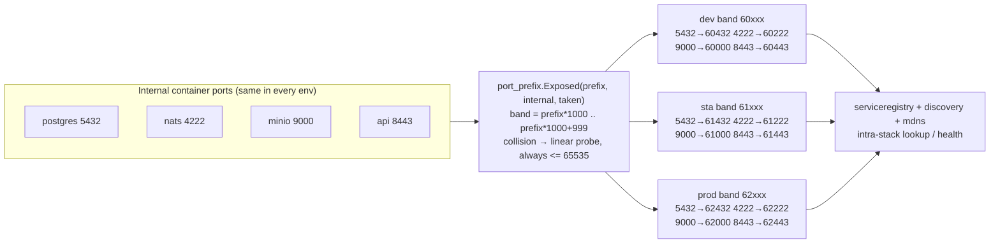

<!--
  Title           : Helix Thready — Service Discovery & Dynamic Ports
  Classification  : PUBLIC
  Location        : docs/public/research/mvp/deployment/service-discovery-ports.md
  Status          : Review — v0.2
  Revision        : 2 (2026-07-21)
  Author          : Helix Thready documentation swarm (deployment)
  Related         : ./index.md, ./container-topology.md, ./environments.md,
                    ./podman-compose.md, ../testing/index.md
-->

# Helix Thready — Service Discovery & Dynamic Ports

| Rev | Date | Author | Change |
|-----|------|--------|--------|
| 1 | 2026-07-21 | swarm (deployment) | Initial port_prefix bands, discovery/mdns, serviceregistry, deterministic port plan |
| 2 | 2026-07-21 | swarm (deployment review) | Added the HelixLLM verifier-port reconciliation (GAP #17); a reproduce-first (RED) port-determinism test; split the port-band prose into multiple paragraphs |

This document specifies how Helix Thready assigns host ports **deterministically** so three
environments coexist on one host without collision (`§14.3`), and how services find each other via
the in-house `port_prefix`, `discovery`, `mdns` and the `containers` `serviceregistry`.

> Diagram source: sibling under [`diagrams/`](./diagrams/). Rendered PNG/SVG exported via Docs Chain (§11.4.65).

## Table of Contents

1. [The problem: three stacks, one host](#1-the-problem-three-stacks-one-host)
2. [port_prefix: deterministic host-port bands](#2-port_prefix-deterministic-host-port-bands)
3. [Port band diagram](#3-port-band-diagram)
4. [The deterministic port plan](#4-the-deterministic-port-plan)
   - [4.1 Reproduce-first port-plan test (TDD)](#41-reproduce-first-port-plan-test-tdd)
5. [Intra-stack discovery (serviceregistry)](#5-intra-stack-discovery-serviceregistry)
6. [Network discovery & mDNS](#6-network-discovery--mdns)
   - [6.1 External HelixLLM endpoint & verifier port (GAP #17)](#61-external-helixllm-endpoint--verifier-port-gap-17)
7. [Health & registration wiring](#7-health--registration-wiring)
8. [Verified vs assumed](#8-verified-vs-assumed)
9. [Open items](#9-open-items)

---

## 1. The problem: three stacks, one host

Three fully-separated environments run on a single Hetzner host. If two stacks tried to publish the
same host port (e.g. both Postgres on `5432`), they would collide. The `§14.3` mandate — "dynamic
port allocation (`port_prefix`), automatic service registration (`discovery` + `mdns`)" — solves this
by giving each environment a disjoint **host-port band** and resolving intra-stack lookups by name.

Key insight: **containers talk to each other by service name over the compose network**
(`thready-postgres:5432`), so host ports are needed only for the edge→api hop, operator debugging,
and Prometheus scraping. The banding therefore governs the small set of *published* ports, and
guarantees they never overlap across environments.

## 2. port_prefix: deterministic host-port bands

`vasic-digital/port_prefix` maps an internal port onto a host-port **band** identified by a numeric
prefix. Verified API:

```
portprefix.Exposed(prefix, internalPort int, taken map[int]bool) (int, error)
```

- For prefix `P`, every exposed port lies in `P*1000 .. P*1000+999` — it "always starts with `P`,
  always `<= 65535`".
- The mapping is `P*1000 + (internalPort mod 1000)`, with **linear probe** within the band on
  collision (the `taken` set).
- Worked example from the module: prefix `52`, ports `443,80,8080,3000` →
  `443→52443`, `80→52080`, `8080→52080` (taken) `→52081`, `3000→52000`.

CLI form (usable from deploy scripts):

```bash
port_prefix --prefix 62 --ports 5432,4222,9000,8443
# 5432 -> 62432 ; 4222 -> 62222 ; 9000 -> 62000 ; 8443 -> 62443
```

**Environment → prefix assignment** `[DEFAULT — adjustable]`:

| Env | Prefix | Band | Rationale |
|-----|--------|------|-----------|
| dev | `60` | `60000–60999` | keeps prefix ≤ 62 so the whole band ≤ 62999 < 65535 |
| sta | `61` | `61000–61999` | |
| prod | `62` | `62000–62999` | |

Prefixes must stay ≤ 65 for the band to remain within the 65535 ceiling; `60/61/62` are chosen for
readability (a `62xxx` port is obviously prod).

## 3. Port band diagram



**Explanation (for readers/models that cannot see the diagram).** Every environment uses the **same**
internal container ports (Postgres always listens on 5432 *inside* its container, NATS on 4222, MinIO
on 9000, the API on 8443) — this uniformity keeps compose files identical across environments. The
`port_prefix.Exposed` function is applied at deploy time with the environment's prefix to compute the
**host** port each published service binds.

Because the band is `prefix*1000 + (internal mod 1000)`, the same internal 5432 becomes `60432` in
dev, `61432` in sta and `62432` in prod — three disjoint numbers that can never collide on the shared
host. If two internal ports map to the same last-three digits within one band, the linear probe picks
the next free slot, and the module guarantees the result stays ≤ 65535. This determinism is what lets
the edge Caddyfile hard-code `62443`/`61443`/`60443` without a lookup, and it is asserted by the
reproduce-first test in [§4.1](#41-reproduce-first-port-plan-test-tdd).

The computed host ports feed the `serviceregistry` / `discovery` / `mdns` layer, which records where
each service actually landed so other components (and the operator) can look it up by name rather than
memorizing numbers.

## 4. The deterministic port plan

Worked host-port plan for **prod (prefix 62)**. The same internal layout repeats in dev (`60`) and
sta (`61`) bands. Only services that publish a host port appear; internal-only services
(`thready-processing`) bind nothing. All bindings are `127.0.0.1` except the edge.

| Service | Internal | prod host (62) | sta host (61) | dev host (60) | Bind |
|---------|----------|----------------|----------------|----------------|------|
| edge (Caddy) | 80 / 443 | **80 / 443** | **80 / 443** | **80 / 443** | `0.0.0.0` (shared, host-wide) |
| thready-api | 8443 | 62443 | 61443 | 60443 | loopback |
| thready-web | 8088 | 62088 | 61088 | 60088 | loopback |
| thready-postgres | 5432 | 62432 | 61432 | 60432 | loopback |
| thready-redis | 6379 | 62379 | 61379 | 60379 | loopback |
| thready-nats (client) | 4222 | 62222 | 61222 | 60222 | loopback |
| thready-nats (mon) | 8222 | 62223¹ | 61223¹ | 60223¹ | loopback |
| thready-minio (S3) | 9000 | 62000 | 61000 | 60000 | loopback |
| thready-minio (console) | 9001 | 62001 | 61001 | 60001 | loopback |
| thready-clickhouse (HTTP) | 8123 | 62123 | 61123 | 60123 | loopback |
| thready-clickhouse (native) | 9009 | 62009 | 61009 | 60009 | loopback |
| thready-herald | 7080 | 62080 | 61080 | 60080 | loopback |
| thready-assetsvc | 8081 | 62081 | 61081 | 60081 | loopback |
| thready-downloadmgr | 8082 | 62082 | 61082 | 60082 | loopback |
| thready-usersvc | 8083 | 62083 | 61083 | 60083 | loopback |
| thready-eventbus-svc | 8084 | 62084 | 61084 | 60084 | loopback |
| thready-semsearch | 8085 | 62085 | 61085 | 60085 | loopback |
| boba | 8000 | 62002² | 61002² | 60002² | loopback |
| metube | 8091 | 62091 | 61091 | 60091 | loopback |
| thready-prometheus | 9090 | 62090 | 61090 | 60090 | loopback |
| thready-grafana | 3000 | 62003³ | 61003³ | 60003³ | loopback |
| thready-jaeger (UI) | 16686 | 62686 | 61686 | 60686 | loopback |
| thready-jaeger (OTLP gRPC) | 4317 | 62317 | 61317 | 60317 | loopback |

¹ `8222 mod 1000 = 222` collides with NATS-client `4222`; linear probe → `…223`.
² `8000 mod 1000 = 000` collides with MinIO S3 `9000`; probe skips `…000/…001` → `…002`.
³ `3000 mod 1000 = 000` collides too; probe → next free `…003`.

The `taken` set is fed to `port_prefix.Exposed` in a **fixed service order** (data plane first) so the
plan is fully **deterministic and reproducible** — the same inputs always yield the same host ports,
which is what lets the edge Caddyfile hardcode `62443`, `61443`, `60443` safely.

### 4.1 Reproduce-first port-plan test (TDD)

`[CONVENTIONS §6]` `[CONSTITUTION §11.4.27]` — the two properties the whole scheme rests on
(*reproducible* and *collision-free across environments*) are guarded by a **reproduce-first (RED)**
test. It is written to fail if `port_prefix` is ever swapped for a non-deterministic or overlapping
allocator, and it hard-codes the documented collision-probe result so a regression in the probe is
caught. Authored in [testing](../testing/index.md):

```go
// port_plan_test.go — RED first. Guards determinism + cross-env disjointness + the 65535 ceiling.
func TestPortPlan_DeterministicDisjointAndBounded(t *testing.T) {
    internal := []int{5432, 4222, 9000, 8443, 8222, 3000, 8000} // fixed service order (data first)

    dev  := plan(t, 60, internal)
    sta  := plan(t, 61, internal)
    prod := plan(t, 62, internal)

    // 1. Reproducible: identical inputs → identical output.
    require.Equal(t, prod, plan(t, 62, internal))

    // 2. Disjoint across environments: no dev host port equals any sta/prod host port.
    require.Empty(t, intersect(values(dev), values(sta)))
    require.Empty(t, intersect(values(sta), values(prod)))
    require.Empty(t, intersect(values(dev), values(prod)))

    // 3. Bounded: every mapped port stays within the 65535 ceiling.
    for _, p := range values(prod) { require.LessOrEqual(t, p, 65535) }

    // 4. Documented collision-probe results hold (8222 & 3000 & 8000 all collide on last-3-digits).
    require.Equal(t, 62223, prod[8222]) // 222 taken by 4222 → probe → 223
    require.Equal(t, 62003, prod[3000]) // 000 taken by 9000 → probe → 003
    require.Equal(t, 62002, prod[8000]) // 000/001 taken → probe → 002
}
```

## 5. Intra-stack discovery (serviceregistry)

Within one environment, services resolve each other via the `containers` `serviceregistry` (verified
`pkg/serviceregistry`). The registry persists to disk and supports name-based lookup, endpoint/URL
resolution, health marking, and port-range discovery:

```go
// VERIFIED from containers/pkg/serviceregistry.
type Service struct {
    Name       string; Host string; Port int; Protocol string
    HealthPath string; HealthType string; Labels map[string]string
    Healthy    bool; DiscoveredAt time.Time; LastChecked time.Time
}

reg := serviceregistry.New()                              // persists under registryDir
_ = reg.Register("thready-postgres", 62432,
    serviceregistry.WithProtocol("tcp"))
ep := reg.GetEndpoint("thready-postgres")                 // "127.0.0.1:62432"
_ = reg.UpdateHealth("thready-postgres", true)

// Discover a service in a port range if its exact port is unknown:
svc, err := reg.Discover(ctx, "thready-api", 62443, 62443, 62543)
```

- `Discover` dials candidate ports in a range and registers the first that answers — a fallback for
  when a service moved within its band.
- `GetURL`/`GetEndpoint` give callers a ready connection string, so application config references a
  **name**, not a hardcoded port — the port plan can change without touching app code.

## 6. Network discovery & mDNS

For LAN-level discovery (e.g. the operator workstation finding the host, or the host finding the
external HelixLLM GPU node), the in-house modules apply:

- **`vasic-digital/mdns`** — RFC 6762/6763 announcement/discovery. A service is announced as
  `_<service>._tcp` with typed TXT records; clients `Browse` for it. Compatible with Android
  `NsdManager` / Apple Bonjour. Thready can announce the API on the LAN for zero-config workstation
  access; the HelixLLM node can be discovered by `Browse` instead of a hardcoded host.

  ```go
  // Announce the API on the LAN (illustrative — mdns Announce/Browse pair).
  h, _ := mdns.Announce(mdns.Service{
      Instance: "thready-prod-api", Type: "_thready._tcp", Port: 62443,
      Text: map[string]string{"env": "prod", "path": "/v1"},
  })
  defer h.Stop()
  ```

- **`vasic-digital/discovery`** — network/service **scanning** (`pkg/scanner.Scanner`, DNS + TCP
  discoverers). The `containers` boot manager uses a `Discoverer` in Phase 1 to resolve `Remote`
  endpoints (HelixLLM) before compose-up; the DNS method resolves `gpu-node.helix.lan`, the TCP
  method probes reachability.

> mDNS is a **LAN convenience**, not the public routing mechanism — public access is always through
> DNS + the edge proxy ([environments.md](./environments.md)). mDNS/discovery are for host-local and
> workstation-to-host resolution.

### 6.1 External HelixLLM endpoint & verifier port (GAP #17)

The external HelixLLM GPU node is resolved as a `ServiceEndpoint` at boot Phase 1
([container-topology.md §9](./container-topology.md#9-helixllm-as-an-external-endpoint)). Two ports
must be pinned in the environment so discovery targets the right sockets:

| Endpoint | Env var | Thready value | Notes |
|----------|---------|---------------|-------|
| HelixLLM OpenAI-compatible base (`/v1/chat`, `/v1/embeddings`) | `HELIX_LLM_BASE_URL` | `http://gpu-node.helix.lan:8080` | `Required` for `thready-semsearch` |
| HelixLLM → LLMsVerifier | `HELIX_LLM_VERIFIER_URL` | `http://gpu-node.helix.lan:8080` | see the reconciliation below |

> `[GAP: #17 verifier port]` — the gap register flags that **HelixLLM defaults
> `HELIX_LLM_VERIFIER_URL` to `:7061` while LLMsVerifier actually serves `:8080`** (gap-register
> §2.1.3 / §2.5). Left unset, discovery/health would probe a dead port. Thready therefore **pins
> `HELIX_LLM_VERIFIER_URL` explicitly** in each env `.env` to the port LLMsVerifier really listens on
> (confirmed at first bring-up), and the boot Phase-1 `Discoverer` marks the endpoint `Required` only
> if the verifier is actually in the fallback chain — otherwise it is `Enabled:false` and skipped, so
> a stale default port can never silently fail a deploy. The reconciliation is a tracked item in
> [development](../development/index.md) (single-source-of-truth in config, per the gap's improvement).

## 7. Health & registration wiring

Discovery, ports and health compose into one flow at boot (matching
[podman-compose.md §5](./podman-compose.md#5-boot-sequence-diagram)):

1. Deploy computes each service's host port via `port_prefix.Exposed` in fixed order → writes them
   into the compose file's `ports:` (loopback) and the release manifest.
2. `BootManager` brings the stack up; on success, each service is `Register`ed in the
   `serviceregistry` with its `{name, host, port, healthPath, healthType}`.
3. `HealthChecker.CheckAll` probes every registered service; results feed `reg.UpdateHealth(name,
   healthy)`, so the registry reflects live health.
4. The edge and the app services read connection targets from the registry (or from injected
   `THREADY_*_URL` env vars derived from it) — never from a hardcoded port literal.

## 8. Verified vs assumed

- **VERIFIED:** the `port_prefix.Exposed` signature + band semantics + collision probe (module
  README); the `serviceregistry` `Service`/`Register`/`Discover`/`GetEndpoint`/`UpdateHealth`
  surface; `mdns` `Announce`/`Browse`; `discovery` `pkg/scanner.Scanner` + DNS/TCP discoverers; the
  boot manager's Phase-1 discovery of `Remote` endpoints.
- **ASSUMED / `[DEFAULT — adjustable]`:** the `60/61/62` prefix assignment; the specific internal
  port numbers of Thready's *own* services (FOUNDATION/BUILD-NEW); which services announce over mDNS.

## 9. Open items

- `[OPEN: prefix-registry]` — as more environments or ephemeral preview stacks are added, prefixes
  must be centrally registered to stay disjoint; a tiny `ports.yaml` prefix registry per host is the
  proposed mechanism.
- `[OPEN: buildnew-ports]` — BUILD-NEW services occupy their band slots but do not bind until built;
  the plan reserves the numbers so a later build does not shift the plan.

---

*Made with love ♥ by Helix Development.*
