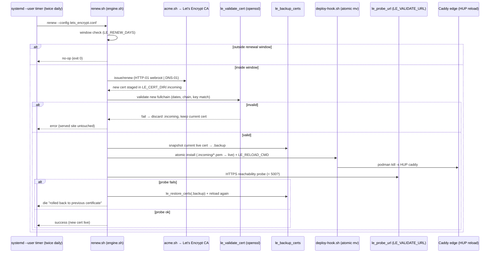

<!--
  Title           : Helix Thready — TLS with lets_encrypt (ACME)
  Classification  : PUBLIC
  Location        : docs/public/research/mvp/deployment/tls-lets-encrypt.md
  Status          : Review — v0.3
  Revision        : 3 (2026-07-22)
  Author          : Helix Thready documentation swarm (deployment)
  Related         : ./index.md, ./environments.md, ./deploy-and-rollback.md,
                    ./hetzner-provisioning.md, ./secrets-and-config.md,
                    ./operations-runbook.md, ../testing/index.md
-->

# Helix Thready — TLS with `lets_encrypt` (ACME)

| Rev | Date | Author | Change |
|-----|------|--------|--------|
| 1 | 2026-07-21 | swarm (deployment) | Initial ACME issuance/renewal/rotation, atomic deploy-hook + risk-free rollback, per-subdomain certs |
| 2 | 2026-07-21 | swarm (deployment review) | Added a reproduce-first (RED) cert-rollback test; split the renewal-flow prose into multiple paragraphs |
| 3 | 2026-07-22 | swarm (deployment) | Pass 3: narrowed `[OPEN: dns-provider]` with the verified `dns_loopia` hook + acme.sh env vars; added `LE_BACKUP_DIR`/`LE_CA_SERVER`/`LE_ACME_HOME` (verified config vars); enriched the `status.sh --json` field list; verified all script/engine names at source |

TLS/HTTPS for all three subdomains is provided by **`vasic-digital/lets_encrypt`** (Q44), a
decoupled ACME automation module wired into Thready's deploy scripts by reference. This document
specifies how certificates are issued (HTTP-01 / DNS-01), renewed, rotated, atomically installed and
**rolled back on failure**, per subdomain, entirely rootless.

> Diagram source: sibling under [`diagrams/`](./diagrams/). Rendered PNG/SVG exported via Docs Chain (§11.4.65).

## Table of Contents

1. [Module overview & guarantees](#1-module-overview--guarantees)
2. [The injection contract (config)](#2-the-injection-contract-config)
3. [Per-subdomain certificate model](#3-per-subdomain-certificate-model)
4. [Challenge types: HTTP-01 vs DNS-01](#4-challenge-types-http-01-vs-dns-01)
   - [4.1 Concrete DNS-01 with the Loopia hook](#41-concrete-dns-01-with-the-loopia-hook)
5. [Issuance (first time)](#5-issuance-first-time)
6. [Renewal + rotation (automated)](#6-renewal--rotation-automated)
7. [Risk-free renewal flow diagram](#7-risk-free-renewal-flow-diagram)
   - [7.1 Reproduce-first cert-rollback test (TDD)](#71-reproduce-first-cert-rollback-test-tdd)
8. [The atomic deploy-hook](#8-the-atomic-deploy-hook)
9. [Programmatic (JSON) driver](#9-programmatic-json-driver)
10. [Rootless systemd timer install](#10-rootless-systemd-timer-install)
11. [Revocation](#11-revocation)
12. [Verified vs assumed](#12-verified-vs-assumed)
13. [Open items](#13-open-items)

---

## 1. Module overview & guarantees

`lets_encrypt` carries **zero project literals** — every value (domains, email, challenge, cert dir,
reload command) is injected via a config file or the environment, and it is consumed **by reference**
as a submodule. It drives `acme.sh` (rootless) and provides (verified from the module README +
scripts):

- `issue.sh` — first-time issuance.
- `renew.sh` — window-aware renewal (the timer/cron target); **no-op until due**.
- `rotate.sh` — force a new cert **and private key** on demand.
- `status.sh` — human or JSON status (subject, SANs, days-left, due).
- `revoke.sh` — CA revocation (key compromise), confirmed.
- `deploy-hook.sh` — atomic install + service reload.
- `api/le-api` — a thin Go JSON wrapper for deploy tooling.

**Risk-free guarantee (verified in `scripts/lib/engine.sh`):** every issue/renew/rotate runs the
gate *validate the new cert before it goes live → snapshot the current cert → atomically install
(`mv` on the same filesystem) → hot-reload the service → optional HTTPS reachability probe → roll
back to the previous cert on any failure and reload again.* The served site never breaks during a
cert operation. Rehearse the whole flow on the **staging CA** first (`LE_STAGING=1`).

> **VERIFIED:** everything in this document was read from the `lets_encrypt` source
> (`scripts/deploy-hook.sh`, `scripts/lib/engine.sh`, `config/lets_encrypt.conf.example`,
> `systemd/*`, `api/main.go`). No behaviour is invented.

## 2. The injection contract (config)

Thready owns one config per subdomain (the module owns only the mechanism). The load-bearing
variables (verified from `config/lets_encrypt.conf.example`):

| Variable | Meaning | Thready prod value |
|----------|---------|--------------------|
| `LE_DOMAINS` | space-separated; first = primary CN, rest = SANs | `"thready.hxd3v.com"` |
| `LE_ACME_EMAIL` | ACME account contact | `admin@hxd3v.com` |
| `LE_CHALLENGE` | `webroot` (HTTP-01) or `dns-01` | `webroot` |
| `LE_WEBROOT` | document root for HTTP-01 | `/var/www/acme` (edge-served) |
| `LE_DNS_PROVIDER` | acme.sh DNS hook for DNS-01 | *(unset by default — see [§4](#4-challenge-types-http-01-vs-dns-01))* |
| `LE_CERT_DIR` | where live cert/key/fullchain/chain deploy | `/home/thready/edge/certs/prod` |
| `LE_KEY_TYPE` | `ec-256` \| `ec-384` \| `rsa-2048` \| `rsa-4096` | `ec-256` |
| `LE_RELOAD_CMD` | atomic reload after install | `podman kill -s HUP caddy` |
| `LE_VALIDATE_URL` | HTTPS probe for the rollback gate | `https://thready.hxd3v.com/health/ready` |
| `LE_STAGING` | `1` = staging CA, `0` = production | `0` (after staging rehearsal) |
| `LE_RENEW_DAYS` | renew when < N days remain | `30` |
| `LE_ROTATE_ALWAYS_NEW_KEY` | force new key on rotate | `1` |
| `LE_BACKUP_DIR` | where pre-change cert snapshots are kept for rollback | *(default `LE_CERT_DIR/.backup`)* |
| `LE_CA_SERVER` | override the ACME directory entirely (wins over `LE_STAGING`) | *(unset; e.g. `letsencrypt_test` for staging)* |
| `LE_ACME_HOME` | acme.sh state/home (rootless) | `/home/thready/.acme.sh` |
| `LE_CLIENT` | ACME client backend | `acme.sh` |

> All of the above are `[VERIFIED: config/lets_encrypt.conf.example]` — the module carries zero
> project literals; each is injected. `LE_BACKUP_DIR` is the directory the risk-free gate snapshots
> the current cert into before an atomic install (the `.backup` in [§7](#7-risk-free-renewal-flow-diagram)),
> and `LE_CA_SERVER` lets an operator point at an alternate ACME directory without touching `LE_STAGING`.

Config files live at `/home/thready/<env>/config/lets_encrypt.conf`, `chmod 600`. **DNS-01 secrets**
(if used) are read from the **environment** by acme.sh — exported from the gitignored
`api_keys.sh`, never written into the config (`[CONSTITUTION §11.4.10]`, see
[secrets-and-config.md](./secrets-and-config.md)).

## 3. Per-subdomain certificate model

`§21.5` mandates that each subdomain has **its own** Let's Encrypt certificate — matching the full
environment separation. Thready therefore runs three independent cert lifecycles:

| Env | `LE_DOMAINS` | `LE_CERT_DIR` | `LE_VALIDATE_URL` |
|-----|--------------|---------------|-------------------|
| dev | `dev.thready.hxd3v.com` | `/home/thready/edge/certs/dev` | `https://dev.thready.hxd3v.com/health/ready` |
| sta | `sta.thready.hxd3v.com` | `/home/thready/edge/certs/sta` | `https://sta.thready.hxd3v.com/health/ready` |
| prod | `thready.hxd3v.com` | `/home/thready/edge/certs/prod` | `https://thready.hxd3v.com/health/ready` |

The edge Caddy loads all three cert directories (see
[environments.md §4](./environments.md#4-the-edge-reverse-proxy)). Each renewal reloads the *same*
edge but only rewrites *its* subdomain's cert files, so a dev renewal cannot disturb the prod cert.

**Alternative (optional):** a single DNS-01 wildcard `*.thready.hxd3v.com` (+ apex) covering all
three, which reduces to one lifecycle. This trades strict per-subdomain separation for fewer ACME
operations; it is documented in [§4](#4-challenge-types-http-01-vs-dns-01) but **not** the default,
because the operator chose per-subdomain certs.

## 4. Challenge types: HTTP-01 vs DNS-01

`lets_encrypt` supports both (verified). Thready default = **HTTP-01 (`webroot`)**:

- **HTTP-01 (`LE_CHALLENGE=webroot`)** — acme.sh writes tokens under `LE_WEBROOT`; the edge Caddy
  serves `/.well-known/acme-challenge/` on port 80 for all three subdomains (see the Caddyfile in
  [environments.md](./environments.md#4-the-edge-reverse-proxy)). Requires port 80 reachable from the
  internet — which the [firewall](./hetzner-provisioning.md) allows. This is the simplest, works
  per-subdomain, and needs no DNS API credentials.
- **DNS-01 (`LE_CHALLENGE=dns-01`)** — acme.sh drives `LE_DNS_PROVIDER`'s API and supports
  **wildcards**. Use this if port 80 is ever blocked or a single `*.thready.hxd3v.com` cert is
  preferred. It needs the DNS provider's acme.sh hook name and its secrets (exported from
  `api_keys.sh`).

> `[OPEN: dns-provider]` (**narrowed, Rev 3**) — the acme.sh DNS hook for the `hxd3v.com` zone is not
> formally confirmed by the operator, but two independent in-repo signals point at **Loopia**: the
> `lets_encrypt` config example ships `LE_DNS_PROVIDER=dns_loopia` as its documented example
> `[VERIFIED: config/lets_encrypt.conf.example]`, and [secrets-and-config.md §4](./secrets-and-config.md#4-file-conventions--permissions)
> already reserves `LOOPIA_*` keys in `api_keys.sh`. The concrete DNS-01 path is therefore documented
> in [§4.1](#41-concrete-dns-01-with-the-loopia-hook); HTTP-01 remains the working default, and this
> item closes fully once the operator confirms the registrar of the `hxd3v.com` zone.

### 4.1 Concrete DNS-01 with the Loopia hook

When DNS-01/wildcard is wanted (port 80 blocked, or a single `*.thready.hxd3v.com` cert), Thready's
strongly-indicated provider is **Loopia**, driven by acme.sh's built-in `dns_loopia` hook. The
config sets the challenge + hook name; the **secrets stay in the environment** (from `api_keys.sh`),
never in the config file `[CONSTITUTION §11.4.10]`:

```ini
# /home/thready/prod/config/lets_encrypt.conf  (DNS-01 variant — chmod 600)
LE_CHALLENGE=dns-01
LE_DNS_PROVIDER=dns_loopia          # acme.sh built-in hook (VERIFIED as the config-example provider)
LE_DOMAINS="thready.hxd3v.com *.thready.hxd3v.com"   # wildcard covers dev./sta. in one cert (optional)
LE_KEY_TYPE=ec-256
LE_RELOAD_CMD="podman kill -s HUP caddy"
LE_VALIDATE_URL="https://thready.hxd3v.com/health/ready"
```

```bash
# /home/thready/secrets/api_keys.sh  (chmod 600, sourced at runtime — NEVER committed)
# acme.sh dns_loopia reads these from the environment:
export LOOPIA_User="apiuser@loopiaapi"      # Loopia API sub-account user
export LOOPIA_Password="__from_private_repo__"
# export LOOPIA_Api="https://api.loopia.se/RPCSERV"   # default endpoint; override only if needed
```

The issuance/renewal commands are **identical** to the HTTP-01 flow ([§5](#5-issuance-first-time),
[§6](#6-renewal--rotation-automated)) — only the config challenge differs — because `lets_encrypt`
injects the challenge type and lets acme.sh drive the provider API. This means switching an env to
DNS-01 is a config-file change plus two exported secrets, with **no** change to the deploy scripts,
the renewal timer, or the risk-free gate. A wildcard cert collapses the three per-subdomain lifecycles
into one; whether to keep strict per-subdomain certs (the [operator default](#3-per-subdomain-certificate-model))
or adopt the wildcard is the operator's call.

> `[RESEARCH]` The `LOOPIA_User`/`LOOPIA_Password`/`LOOPIA_Api` variable names are acme.sh's documented
> `dns_loopia` contract; the *values* live only in the private repo. If the operator confirms a
> different registrar, only `LE_DNS_PROVIDER` and the two exported secret names change — the rest of
> this section is provider-agnostic.

## 5. Issuance (first time)

Run **as the `thready` user**, staging first, then production. Wired via the submodule by reference:

```bash
LE=/home/thready/submodules/lets_encrypt
CFG=/home/thready/prod/config/lets_encrypt.conf

# 0. one-time: install acme.sh (rootless) + register the ACME account (STAGING)
"$LE/scripts/setup.sh" --config "$CFG" --install

# 1. rehearse on the staging CA (LE_STAGING=1 in the config)
"$LE/scripts/issue.sh" --config "$CFG"          # staging cert, high rate limits

# 2. flip LE_STAGING=0 and issue the real certificate
"$LE/scripts/issue.sh" --config "$CFG"          # production cert

# 3. confirm
"$LE/scripts/status.sh" --config "$CFG"         # subject, SANs, days-left
```

Repeat per environment with each env's config. The first successful issue installs the cert into
`LE_CERT_DIR` and reloads the edge.

## 6. Renewal + rotation (automated)

- **Renewal** — `renew.sh` is **window-aware**: it is a no-op until the cert has fewer than
  `LE_RENEW_DAYS` (30) of validity left, so running it twice a day is cheap and safe. It is the
  target of the systemd timer ([§10](#10-rootless-systemd-timer-install)).
- **Rotation** — `rotate.sh` forces a brand-new **private key** (`LE_ROTATE_ALWAYS_NEW_KEY=1`) plus
  a new cert on demand — used on suspected key compromise or scheduled key hygiene.

Both go through the same risk-free gate as issuance.

## 7. Risk-free renewal flow diagram



**Explanation (for readers/models that cannot see the diagram).** Twice a day the rootless systemd
timer runs `renew.sh`. The script first checks the **renewal window**: if the current certificate
still has more than `LE_RENEW_DAYS` of validity, it exits immediately as a no-op — this is why
frequent runs are harmless. Inside the window, it asks `acme.sh` to obtain a new certificate using
the configured challenge (HTTP-01 webroot or DNS-01); acme.sh stages the fresh cert into
`LE_CERT_DIR/.incoming`.

The engine then **validates** the staged cert with openssl (dates, chain, key-match); if it is
invalid the `.incoming` is discarded and the live site is left completely untouched. If valid, the
engine **snapshots** the current live cert to a `.backup` directory, then invokes `deploy-hook.sh`
which **atomically** `mv`s each staged `*.pem` into place (so a reader never sees a torn key/cert
pair) and runs `LE_RELOAD_CMD` — for Thready, `podman kill -s HUP caddy`, a zero-downtime hot reload.

Finally, if `LE_VALIDATE_URL` is set, the engine **probes** the live HTTPS endpoint; if the probe
fails (no answer under 500 over TLS), it **restores the previous cert from the backup and reloads
again**, then dies with a clear "rolled back to the previous certificate" message. The net effect:
the served site is never left on a broken certificate, and a bad renewal self-heals to the last
known-good cert — the behaviour the reproduce-first test in
[§7.1](#71-reproduce-first-cert-rollback-test-tdd) provokes and asserts.

### 7.1 Reproduce-first cert-rollback test (TDD)

`[CONVENTIONS §6]` `[CONSTITUTION §11.4.27]` — the risk-free guarantee is only real if a test
**forces a bad renewal** and proves the served site is unharmed. This **reproduce-first (RED)** test
rehearses on the staging CA and is written to fail against any engine that installs a new cert without
the probe-and-rollback gate. It covers the regression + chaos test types and is authored in
[testing](../testing/index.md):

```bash
# tls_rollback_test.sh — RED first. Rehearse on the STAGING CA (LE_STAGING=1).
# Reproduces "the renewed cert fails the HTTPS probe" and asserts self-heal to the previous cert.

test_renew_probe_fail_rolls_back() {
  before="$(fingerprint /home/thready/edge/certs/prod/fullchain.pem)"

  # Force the post-install probe to fail (unreachable URL) so the gate MUST roll back.
  LE_VALIDATE_URL="https://127.0.0.1:1/never" \
    run "$LE/scripts/renew.sh" --config "$CFG" && fail "renew must exit non-zero on probe failure"

  after="$(fingerprint /home/thready/edge/certs/prod/fullchain.pem)"
  assert_equal "$before" "$after" "cert must be rolled back to the previous fingerprint"
  assert_https_2xx "https://thready.hxd3v.com/health/ready" "served site must stay up throughout"
}

# GREEN counterpart — a healthy renewal installs the new cert and the probe passes.
test_renew_healthy_installs_new_cert() {
  before="$(fingerprint /home/thready/edge/certs/prod/fullchain.pem)"
  run "$LE/scripts/rotate.sh" --config "$CFG" || fail "healthy rotate should succeed"
  after="$(fingerprint /home/thready/edge/certs/prod/fullchain.pem)"
  assert_not_equal "$before" "$after" "a healthy rotate must install a new cert+key"
}
```

## 8. The atomic deploy-hook

Verified from `scripts/deploy-hook.sh`. It is reusable by any ACME client that can call a post-issue
command (`acme.sh --reloadcmd`, `certbot --deploy-hook`). Behaviour:

1. Requires `LE_CERT_DIR` with an `.incoming/` staging dir.
2. For each of `privkey.pem`, `cert.pem`, `fullchain.pem`, `chain.pem` that exists in `.incoming/`,
   runs `mv -f` into `LE_CERT_DIR` — **atomic on the same filesystem**, so the cert and key swap
   instantaneously and no reader ever sees a half-updated pair.
3. Removes the now-empty `.incoming/`.
4. Runs `LE_RELOAD_CMD` (Thready: `podman kill -s HUP caddy`); if the reload command fails, the hook
   dies loudly (the engine's rollback then restores the previous cert).

For Thready the `LE_RELOAD_CMD` targets the **rootless** edge container — the module's own docs list
`podman kill -s HUP <container>` as the rootless reload idiom, which is exactly our case.

## 9. Programmatic (JSON) driver

The Go `api/le-api` wrapper lets the [deploy script](./deploy-and-rollback.md) drive certs
programmatically and parse structured results (verified from `api/main.go`):

```bash
cd /home/thready/submodules/lets_encrypt/api && go build -o le-api .

./le-api status --config /home/thready/prod/config/lets_encrypt.conf
# → the parsed status.sh --json (subject, SANs, days-left, due)

./le-api renew --config /home/thready/prod/config/lets_encrypt.conf
# → {"command":"renew","ok":true,"exit_code":0}
```

The result shape is `{command, ok, exit_code, message?, status?}` `[VERIFIED: api/main.go]`; commands
are `status|issue|renew|rotate|revoke` (flags `--config`, `--scripts`, `--force`, `--yes`). For
`status`, the embedded `status` object is the parsed `status.sh --json`, whose **verified** fields are:

```json
{ "present": true, "primary_domain": "thready.hxd3v.com",
  "subject": "CN=thready.hxd3v.com", "issuer": "…", "not_before": "…", "not_after": "…",
  "sans": "thready.hxd3v.com", "days_left": 63, "renew_days": 30, "renew_due": false }
```

Thready's deploy verification calls `le-api status` and asserts `present==true`, `renew_due==false`
and `days_left > 0` before promoting — a cert that is absent or already inside its renewal window is a
pre-flight signal, not a surprise at expiry. `[VERIFIED: scripts/status.sh]`

## 10. Rootless systemd timer install

The module ships a `systemd/` unit set. Install **rootless** (per the mandate — no sudo). Verified
from `systemd/lets-encrypt-renew.{service,timer}`:

```bash
LE=/home/thready/submodules/lets_encrypt
mkdir -p ~/.config/systemd/user

# Substitute the two @TOKENS@ for Thready's paths and install per env (prod shown)
sed -e "s#@LE_DIR@#$LE#" -e "s#@LE_CONFIG@#/home/thready/prod/config/lets_encrypt.conf#" \
    "$LE/systemd/lets-encrypt-renew.service" > ~/.config/systemd/user/le-renew-prod.service
sed "s#@LE_DIR@##" "$LE/systemd/lets-encrypt-renew.timer" > ~/.config/systemd/user/le-renew-prod.timer

systemctl --user daemon-reload
systemctl --user enable --now le-renew-prod.timer

# CRITICAL: keep the timer running while logged out
loginctl enable-linger thready
```

- The timer fires **twice daily** (`OnCalendar=*-*-* 03,15:00:00`) with up to a 1 h randomized delay
  (`RandomizedDelaySec=3600`) — the ACME best practice of renewing often with jitter so many hosts
  don't hammer the CA at once. `renew.sh` being a no-op outside the window makes this safe.
- The service is a `oneshot` with hardening (`NoNewPrivileges`, `ProtectSystem=full`, `PrivateTmp`).
- Install **three** timers (`le-renew-dev`, `le-renew-sta`, `le-renew-prod`), one per env config.
- A **cron fallback** (`systemd/lets-encrypt-renew.cron`) is available for hosts without systemd.

## 11. Revocation

`revoke.sh` revokes at the CA on key compromise (confirmed, not silent). After revocation, run
`rotate.sh` to issue a fresh key+cert. This is part of the [secret rotation](./secrets-and-config.md#6-leak-audit--rotation)
runbook.

## 12. Verified vs assumed

- **VERIFIED (read at source):** the risk-free validate→backup→atomic-deploy→probe→rollback flow in
  `engine.sh`; the atomic `mv` deploy-hook; the config injection contract; the twice-daily jittered
  timer; the `le-api` JSON shape; rootless install; HTTP-01/DNS-01 support; staging-first.
- **ASSUMED / `[DEFAULT — adjustable]`:** `ec-256` key type; `LE_RENEW_DAYS=30`; ACME email
  `admin@hxd3v.com`; Caddy `HUP` as the reload target; per-subdomain (not wildcard) certs.

## 13. Open items

- `[OPEN: dns-provider]` (**narrowed, Rev 3**) — the concrete DNS-01 path is now documented against the
  verified `dns_loopia` hook + `LOOPIA_*` env secrets ([§4.1](#41-concrete-dns-01-with-the-loopia-hook)),
  consistent with the `LOOPIA_*` keys already reserved in `api_keys.sh`. It **fully** closes once the
  operator confirms the `hxd3v.com` registrar; HTTP-01 is the working default meanwhile, so nothing is
  blocked.
- `[OPEN: acme-email]` — confirm the ACME account contact email for expiry notices (`LE_ACME_EMAIL`;
  `admin@hxd3v.com` is the working default).

---

*Made with love ♥ by Helix Development.*
