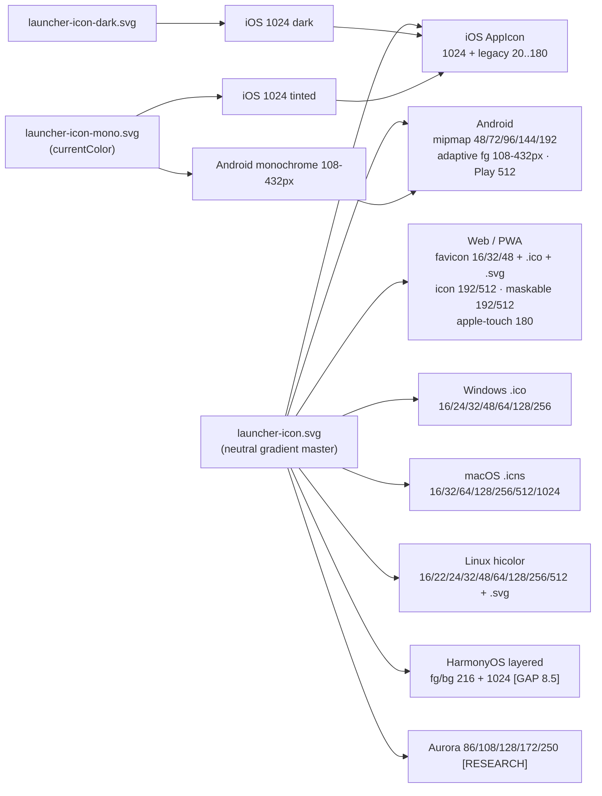

<!--
  Title           : Helix Thready — Icon Export Size/Format Matrix
  Classification  : PUBLIC
  Location        : docs/public/research/mvp/design/assets/icon-export-matrix.md
  Status          : Draft — v0.1
  Revision        : 1 (2026-07-22)
  Author          : Helix Thready documentation swarm (design · assets)
  Related         : ../brand-assets.md, ../design-system.md, ./generate-raster.sh,
                    ../../CONVENTIONS.md
-->

# Helix Thready — Icon Export Size/Format Matrix

| Rev | Date | Author | Change |
|-----|------|--------|--------|
| 1 | 2026-07-22 | swarm (design · assets) | Initial matrix: exact per-platform pixel/format table for every OS surface (Web/PWA favicon + maskable, Android mipmap/adaptive/monochrome, iOS AppIcon incl. dark/tinted, Windows `.ico`, macOS `.icns`, Linux hicolor, HarmonyOS layered, Aurora); source-SVG→target mapping; output inventory tree; renderer/bundler tooling contract. Locked 1:1 to `generate-raster.sh`. |
| 2 | 2026-07-22 | swarm (design · assets · verify) | Verification pass: all 7 master SVGs confirmed `xmllint`-valid; `generate-raster.sh` confirmed `shellcheck`-clean and executed end-to-end (chromium renderer, ImageMagick `.ico` bundler, `.icns` correctly SKIPPED with note) — **83 real rasters, no faked/blank output** (`favicon-16` non-blank, all outputs transparent-bg, `.ico` multi-res 16–256 verified). Corrected `logo-full-h64` cell 170→**169** px (⌊64·1060/400⌋) to keep the 1:1 lock with the script. `[VERIFIED — 2026-07-22 live run]` |

## Table of contents

- [1. Scope, sources of truth, and conventions](#1-scope-sources-of-truth-and-conventions)
- [2. Source SVGs and the source→target mapping](#2-source-svgs-and-the-sourcetarget-mapping)
- [3. The pixel/format matrix (per platform)](#3-the-pixelformat-matrix-per-platform)
  - [3.1 Web / PWA](#31-web--pwa)
  - [3.2 Android](#32-android)
  - [3.3 iOS](#33-ios)
  - [3.4 Windows](#34-windows)
  - [3.5 macOS](#35-macos)
  - [3.6 Linux](#36-linux)
  - [3.7 HarmonyOS](#37-harmonyos)
  - [3.8 Aurora](#38-aurora)
  - [3.9 Brand lockups (non-launcher, convenience raster)](#39-brand-lockups-non-launcher-convenience-raster)
- [4. Export fan-out (diagram)](#4-export-fan-out-diagram)
- [5. Output inventory tree](#5-output-inventory-tree)
- [6. Renderer & bundler tooling contract](#6-renderer--bundler-tooling-contract)
- [7. Verification / legibility gates](#7-verification--legibility-gates)
- [8. Gaps & open items](#8-gaps--open-items)

## 1. Scope, sources of truth, and conventions

This file is the **exact pixel/format matrix** for every OS/platform icon Helix Thready ships, and
is the specification `generate-raster.sh` (sibling in this directory) implements 1:1. It expands the
platform tables in [brand-assets.md §5](../brand-assets.md#5-os--platform-export-matrix) into
concrete filenames and pixel dimensions.

**Sources of truth** (never contradicted, per [CONVENTIONS §1](../../CONVENTIONS.md)):

- [brand-assets.md](../brand-assets.md) — icon concept, numeric geometry (§3.1), platform matrix
  (§5), concrete manifests (§5.1). `[VERIFIED — inspected]`
- [design-system.md §3.2](../design-system.md#32-the-thready-brand-theme) — the brand palette
  (`brand #B6E376`, `brand-2 #ABDDC9`/`#B7EBD6`, `accent #446E12`/`#B6E376`). `[VERIFIED]`
- `helix_thready_research_request_final.md` (decision matrix, Q1–Q45) and
  `helix_thready_subsystem_gaps_and_improvements.md` (gap register) — the merged request and the
  per-subsystem gaps referenced below (`[GAP: 8.5]`). `[CONSTITUTION]`

**Units.** All sizes are **pixels of the exported raster** unless the row says "vector". Android
adaptive/monochrome are quoted as **dp @ density** with the resolved px in the same cell (px =
`dp × density`, mdpi = ×1). iOS legacy rows quote the resolved **px** (the `pt@scale` role is noted).

**Provenance legend** (per [CONVENTIONS §3](../../CONVENTIONS.md)): `[VERIFIED]` size set is the
platform-canonical set corroborated by brand-assets.md §5 / platform packaging docs · `[RESEARCH]`
must be re-verified against current OS docs at integration · `[GAP: id]` produced now but consumed
by a subsystem the gap register flags as a **scaffold** (do not claim that launcher ships).

## 2. Source SVGs and the source→target mapping

Six hand-authored, **valid** (xmllint-clean) master vectors in this directory feed every raster.
No output invents a new drawing — each is a rasterization of one master (single-source consistency,
brand-assets.md §3).

| Source SVG | Fill | Transparent bg | Feeds |
|------------|------|----------------|-------|
| `launcher-icon.svg` (neutral master) | `brand #B6E376 → brand-2 #ABDDC9` gradient | yes | Web/PWA, Android legacy+adaptive-fg+Play, iOS light + legacy set, Windows, macOS, Linux, HarmonyOS, Aurora |
| `launcher-icon-light.svg` | `accent #446E12 → brand #B6E376` | yes | light-surface in-app mark; optional light launcher slot |
| `launcher-icon-dark.svg` | `brand #B6E376 → brand-2(dark) #B7EBD6` | yes | iOS 18 **dark** appearance (`icon-1024-dark.png`); dark-surface in-app mark |
| `launcher-icon-mono.svg` | single tone via `currentColor` (default `accent #446E12`) | yes | Android **monochrome** layer; iOS 18 **tinted** appearance (`icon-1024-tinted.png`) |
| `logo-full.svg` (mark + "Thready" wordmark) | mark gradient + theme-aware text | yes | headers/marketing lockup raster (§3.9) — **never** a launcher icon |
| `logo-mark.svg` (tight-crop mark) | `brand → brand-2` gradient | yes | avatar/lockup raster (§3.9) |
| `footer-slogan.svg` ("Made with ♥ by Helix Development") | heart `ds-heart = accent`; text `muted` | yes | footer lockup raster (§3.9) |

The launcher icons are **letter-free by construction** (brand-assets.md §1); the wordmark and slogan
carry text and are never baked into a launcher/OS icon slot.

## 3. The pixel/format matrix (per platform)

### 3.1 Web / PWA

| Output file | Size (px) | Format | Source | Purpose | Provenance |
|-------------|-----------|--------|--------|---------|------------|
| `web/favicon.svg` | vector | SVG | `launcher-icon.svg` | scalable favicon (`rel=icon type=image/svg+xml`) | `[VERIFIED]` |
| `web/favicon-16.png` | 16 | PNG | master | favicon component | `[VERIFIED]` |
| `web/favicon-32.png` | 32 | PNG | master | favicon component | `[VERIFIED]` |
| `web/favicon-48.png` | 48 | PNG | master | favicon component | `[VERIFIED]` |
| `web/favicon.ico` | 16 + 32 + 48 | ICO (multi) | master (bundled) | legacy `rel=icon` | `[VERIFIED]` |
| `web/icon-192.png` | 192 | PNG | master | PWA manifest `purpose:any` | `[VERIFIED]` |
| `web/icon-512.png` | 512 | PNG | master | PWA manifest `purpose:any` | `[VERIFIED]` |
| `web/maskable-192.png` | 192 | PNG | master | PWA `purpose:maskable` (art within Ø916 safe zone, §3.1) | `[VERIFIED]` |
| `web/maskable-512.png` | 512 | PNG | master | PWA `purpose:maskable` | `[VERIFIED]` |
| `web/apple-touch-icon.png` | 180 | PNG | master | iOS Safari home-screen | `[VERIFIED]` |

Wired via `manifest.webmanifest` + `<head>` in [brand-assets.md §5.1](../brand-assets.md#51-concrete-platform-manifests)
(self-hosted, no external CDN — CSP hygiene).

### 3.2 Android

Legacy density mipmaps (`res/mipmap-<density>/ic_launcher.png`):

| Density | Size (px) | Output | Source | Provenance |
|---------|-----------|--------|--------|------------|
| mdpi (×1) | 48 | `android/mipmap-mdpi/ic_launcher.png` | master | `[VERIFIED]` |
| hdpi (×1.5) | 72 | `android/mipmap-hdpi/ic_launcher.png` | master | `[VERIFIED]` |
| xhdpi (×2) | 96 | `android/mipmap-xhdpi/ic_launcher.png` | master | `[VERIFIED]` |
| xxhdpi (×3) | 144 | `android/mipmap-xxhdpi/ic_launcher.png` | master | `[VERIFIED]` |
| xxxhdpi (×4) | 192 | `android/mipmap-xxxhdpi/ic_launcher.png` | master | `[VERIFIED]` |

Adaptive **foreground** + Android-13 **monochrome** (108 dp canvas, `res/mipmap-<density>/`):

| Density | 108 dp → px | `_foreground` source | `_monochrome` source | Provenance |
|---------|-------------|----------------------|----------------------|------------|
| mdpi | 108 | master | `launcher-icon-mono.svg` | `[VERIFIED]` |
| hdpi | 162 | master | mono | `[VERIFIED]` |
| xhdpi | 216 | master | mono | `[VERIFIED]` |
| xxhdpi | 324 | master | mono | `[VERIFIED]` |
| xxxhdpi | 432 | master | mono | `[VERIFIED]` |

| Extra | Size (px) | Output | Notes |
|-------|-----------|--------|-------|
| Adaptive **background** | — | `@color/ic_launcher_background` | solid/token color, **not** a raster (brand-assets.md §5.1 `ic_launcher.xml`) |
| Play Store listing | 512 | `android/play-store-512.png` | `[VERIFIED]` |

Adaptive art stays within the **66 dp inner safe circle** so no coil clips under the OS mask (§3.1).
`ic_launcher.xml` (`mipmap-anydpi-v26`) references `background`/`foreground`/`monochrome` verbatim
per [brand-assets.md §5.1](../brand-assets.md#51-concrete-platform-manifests).

### 3.3 iOS

`Assets.xcassets/AppIcon.appiconset/` — modern single-size + iOS 18 appearances:

| Output file | Size (px) | Source | Appearance | Provenance |
|-------------|-----------|--------|------------|------------|
| `icon-1024.png` | 1024 | `launcher-icon.svg` | any / light | `[VERIFIED]` |
| `icon-1024-dark.png` | 1024 | `launcher-icon-dark.svg` | dark (`luminosity:dark`) | `[VERIFIED]` |
| `icon-1024-tinted.png` | 1024 | `launcher-icon-mono.svg` | tinted (`luminosity:tinted`) | `[VERIFIED]` |

Legacy full set (only if targeting pre-Xcode-14 catalogs), all from master:

| Size (px) | `pt@scale` role |
|-----------|-----------------|
| 20 | notification 20pt@1x (iPad) |
| 29 | settings 29pt@1x |
| 40 | notification 20pt@2x / spotlight 40pt@1x |
| 58 | settings 29pt@2x |
| 60 | notification 20pt@3x |
| 76 | app 76pt@1x (iPad) |
| 80 | spotlight 40pt@2x |
| 87 | settings 29pt@3x |
| 120 | app 60pt@2x (iPhone) / spotlight 40pt@3x |
| 152 | app 76pt@2x (iPad) |
| 167 | app 83.5pt@2x (iPad Pro) |
| 180 | app 60pt@3x (iPhone) |

`Contents.json` (single-size + dark + tinted) is reproduced verbatim in
[brand-assets.md §5.1](../brand-assets.md#51-concrete-platform-manifests). `[VERIFIED]`

### 3.4 Windows

`.ico` multi-resolution bundle (Tauri `icon` / `tauri.conf.json`):

| PNG components (px) | Bundle | Source | Provenance |
|---------------------|--------|--------|------------|
| 16, 24, 32, 48, 64, 128, 256 | `windows/thready.ico` | master | `[VERIFIED]` |

### 3.5 macOS

`.icns` iconset components (`macos/thready.iconset/`), bundled to `macos/thready.icns`:

| Iconset name | Size (px) | Source |
|--------------|-----------|--------|
| `icon_16x16.png` | 16 | master |
| `icon_16x16@2x.png` | 32 | master |
| `icon_32x32.png` | 32 | master |
| `icon_32x32@2x.png` | 64 | master |
| `icon_128x128.png` | 128 | master |
| `icon_128x128@2x.png` | 256 | master |
| `icon_256x256.png` | 256 | master |
| `icon_256x256@2x.png` | 512 | master |
| `icon_512x512.png` | 512 | master |
| `icon_512x512@2x.png` | 1024 | master |

Unique pixel sizes bundled: **16, 32, 64, 128, 256, 512, 1024**. `[VERIFIED]`

### 3.6 Linux

hicolor icon theme (`linux/hicolor/<size>x<size>/apps/thready.png`) + scalable SVG:

| Size (px) | Output | Source | Provenance |
|-----------|--------|--------|------------|
| 16 | `hicolor/16x16/apps/thready.png` | master | `[VERIFIED]` |
| 22 | `hicolor/22x22/apps/thready.png` | master | `[VERIFIED]` |
| 24 | `hicolor/24x24/apps/thready.png` | master | `[VERIFIED]` |
| 32 | `hicolor/32x32/apps/thready.png` | master | `[VERIFIED]` |
| 48 | `hicolor/48x48/apps/thready.png` | master | `[VERIFIED]` |
| 64 | `hicolor/64x64/apps/thready.png` | master | `[VERIFIED]` |
| 128 | `hicolor/128x128/apps/thready.png` | master | `[VERIFIED]` |
| 256 | `hicolor/256x256/apps/thready.png` | master | `[VERIFIED]` |
| 512 | `hicolor/512x512/apps/thready.png` | master | `[VERIFIED]` |
| vector | `hicolor/scalable/apps/thready.svg` | master (copy) | `[VERIFIED]` |

### 3.7 HarmonyOS

Layered image (`resources/base/media/`), consumed by the ArkTS client — a **scaffold**
`[GAP: 8.5 helix_shims / HarmonyOS]`; assets are produced now, but no HarmonyOS launcher is claimed
to ship:

| Output | Size (px) | Source | Role | Provenance |
|--------|-----------|--------|------|------------|
| `harmonyos/foreground.png` | 216 | master | `layered_image.json > foreground` | `[GAP: 8.5]` |
| `harmonyos/background.png` | 216 | master | `layered_image.json > background` (solid/branded bg supplied at integration) | `[GAP: 8.5]` |
| `harmonyos/appgallery-1024.png` | 1024 | master | AppGallery listing | `[GAP: 8.5]` |

`layered_image.json` is reproduced in [brand-assets.md §5.1](../brand-assets.md#51-concrete-platform-manifests).

### 3.8 Aurora

Aurora OS (auroraos.ru / Sailfish density buckets) — `[RESEARCH]`, re-verify against current Aurora
packaging docs at integration (`[OPEN: THREADY-DES-05]`); consumed by a native Qt client scaffold
`[GAP: 8.5]`:

| Output | Size (px) | Source | Provenance |
|--------|-----------|--------|------------|
| `aurora/thready-86.png` | 86 | master | `[RESEARCH]` |
| `aurora/thready-108.png` | 108 | master | `[RESEARCH]` |
| `aurora/thready-128.png` | 128 | master | `[RESEARCH]` |
| `aurora/thready-172.png` | 172 | master | `[RESEARCH]` |
| `aurora/thready-250.png` | 250 | master | `[RESEARCH]` |

### 3.9 Brand lockups (non-launcher, convenience raster)

Emitted for docs/marketing/email where an SVG cannot be used. **Not** launcher icons (they carry
text); never placed in an OS icon slot.

| Output | Size (W×H px) | Source | Notes |
|--------|---------------|--------|-------|
| `brand/logo-full-h64.png` | 169×64 | `logo-full.svg` | aspect 1060:400 preserved (169 = ⌊64·1060/400⌋) |
| `brand/logo-full-h128.png` | 339×128 | `logo-full.svg` | aspect preserved |
| `brand/logo-mark-128.png` | 128×128 | `logo-mark.svg` | square mark |
| `brand/logo-mark-256.png` | 256×256 | `logo-mark.svg` | square mark |
| `brand/logo-mark-512.png` | 512×512 | `logo-mark.svg` | square mark |
| `brand/footer-slogan-h44.png` | 560×44 | `footer-slogan.svg` | aspect 560:44 preserved |

## 4. Export fan-out (diagram)



> Rendered PNG/SVG exported via Docs Chain (§11.4.65). Source: `icon-export-fanout.mmd`.

**Explanation (for readers/models that cannot see the diagram).** Three of the six master vectors
drive the launcher outputs. The **neutral master** (`launcher-icon.svg`) is the single source for
almost every platform bundle: the Web/PWA set (scalable + 16/32/48 favicons, the multi-resolution
`.ico`, the 192/512 `purpose:any` icons, the 192/512 `maskable` icons whose art sits inside the
Ø916 safe zone, and the 180 px apple-touch icon); the Android legacy density mipmaps (48/72/96/144/192)
and the adaptive **foreground** across the five densities (108→432 px) plus the 512 Play-Store image;
the iOS 1024 base and its legacy 20–180 px set; the Windows `.ico` components (16–256); the macOS
`.icns` iconset (unique sizes 16–1024); the Linux hicolor theme (16–512 plus the scalable SVG copy);
and the HarmonyOS layered foreground/background (216) + AppGallery (1024) and Aurora buckets
(86–250). Two masters specialize appearance-variant slots: the **dark master**
(`launcher-icon-dark.svg`) renders the iOS 18 **dark** 1024, and the **monochrome master**
(`launcher-icon-mono.svg`, drawn with `currentColor`) renders both the Android 13+ **monochrome**
layer at every density and the iOS 18 **tinted** 1024. The monochrome and dark/tinted branches feed
back into their platform's asset set (they are additional slots in the same Android `mipmap` folders
and the same iOS `AppIcon.appiconset`), which is why their edges rejoin the Android and iOS nodes.
Because every arrow originates from one hand-authored, xmllint-valid vector, a change to a master
re-emits its whole downstream fan without drift. HarmonyOS and Aurora are drawn but flagged
(`[GAP 8.5]`, `[RESEARCH]`) because the clients that consume them are scaffolds.

## 5. Output inventory tree

`generate-raster.sh [OUTPUT_DIR]` (default `./raster`) writes exactly this tree:

```text
raster/
  web/        favicon.svg  favicon-{16,32,48}.png  favicon.ico
              icon-{192,512}.png  maskable-{192,512}.png  apple-touch-icon.png
  android/    mipmap-{mdpi,hdpi,xhdpi,xxhdpi,xxxhdpi}/ic_launcher.png
              mipmap-{mdpi,hdpi,xhdpi,xxhdpi,xxxhdpi}/ic_launcher_foreground.png
              mipmap-{mdpi,hdpi,xhdpi,xxhdpi,xxxhdpi}/ic_launcher_monochrome.png
              play-store-512.png
  ios/AppIcon.appiconset/
              icon-1024.png  icon-1024-dark.png  icon-1024-tinted.png
              icon-{20,29,40,58,60,76,80,87,120,152,167,180}.png
  windows/    icon-{16,24,32,48,64,128,256}.png  thready.ico
  macos/thready.iconset/
              icon_16x16.png … icon_512x512@2x.png            (10 components)
        thready.icns                                          (if packer present)
  linux/hicolor/
              {16,22,24,32,48,64,128,256,512}x…/apps/thready.png
              scalable/apps/thready.svg
  harmonyos/  foreground.png  background.png  appgallery-1024.png   [GAP 8.5]
  aurora/     thready-{86,108,128,172,250}.png                       [RESEARCH]
  brand/      logo-full-h{64,128}.png  logo-mark-{128,256,512}.png  footer-slogan-h44.png
```

Total distinct raster targets ≈ **95 PNGs + 2 SVG copies + up to 2 bundles** (`.ico`, `.icns`).

## 6. Renderer & bundler tooling contract

`generate-raster.sh` **detects** a real rasterizer and **self-tests** it before use; if none renders
it prints a `[SKIP]` note and exits 0 **without writing any placeholder/fake PNG** (the "no bluff"
rule, [CONVENTIONS §7](../../CONVENTIONS.md)).

| Role | Accepted tools (in preference order) | If absent |
|------|--------------------------------------|-----------|
| SVG → PNG rasterizer | `rsvg-convert` (librsvg) → `inkscape` → `resvg` → headless Chromium/Chrome → ImageMagick* | `[SKIP]`, exit 0, no output faked |
| `.ico` bundler | `icotool` → ImageMagick (`magick`) | PNG components kept; `.ico` step skipped with a note |
| `.icns` bundler | `png2icns` → `iconutil` (macOS) | `.iconset/*.png` kept; run `iconutil -c icns` on macOS |

\* ImageMagick is accepted **only** if its SVG delegate actually renders this directory's masters:
the probe rejects an IM whose internal MSVG coder mishandles `<text>`/CSS/`currentColor`, so it falls
through to the next renderer instead of emitting garbage. `[VERIFIED — probe logic in the script]`

**Detected in this environment `[VERIFIED — 2026-07-22]`:** `magick`/`convert` and headless
`chromium` are present; `rsvg-convert`, `inkscape`, `resvg`, `icotool`, `png2icns`, `iconutil` are
**absent**. The script therefore selects Chromium (which renders the masters and honors the
transparent background via `--default-background-color=00000000`); `.ico` bundling falls to
ImageMagick; `.icns` bundling is **skipped with a note** (no `png2icns`/`iconutil` here) and leaves
the `.iconset` PNGs for a macOS packaging pass. All seven source SVGs are xmllint-valid, so the
strict librsvg/resvg paths also succeed where those tools are installed.

## 7. Verification / legibility gates

Per brand-assets.md §6 export-pipeline `verify:` block and [design-system.md §8](../design-system.md#8-visual-regression--a11y-testing):

- **Legibility:** every rendered size asserts no clipped coil (art within the Ø768 keyline / Ø916
  maskable safe circle) and ≥ 3:1 mark/background where placed. The **full** gradient tier is used
  ≥ 48 px; 16–32 px favicons rely on the simplified/heavier-stroke reading (mono stroke widened to
  128 for tint slots).
- **Transparent background:** every launcher output is transparent (probe render confirms
  non-opaque canvas); no platform corners are baked into the art — the OS applies its own mask.
- **Visual-regression:** snapshot each target into the `ScreenDiff` bank `[GAP: 9.3]` so a master
  edit that breaks a size fails CI once that bank has CI (workable item THREADY-DES-VR-01).

## 8. Gaps & open items

- `[GAP: 8.5 helix_shims / HarmonyOS + Aurora]` — HarmonyOS layered + Aurora PNGs are produced now
  but consumed by native ArkTS/Qt clients that are **scaffolds**; do not claim those launchers ship.
- `[OPEN: THREADY-DES-05]` — Aurora density buckets (86/108/128/172/250) are `[RESEARCH]`; re-verify
  against current Aurora OS packaging docs at integration.
- `[OPEN: THREADY-DES-03]` — heart color in `footer-slogan.svg` is `ds-heart = accent` (brand)
  by in-house precedent; classic love-red is the alternative pending an operator decision.
- `[GAP: 9.3 VisualRegression family]` — the size-legibility snapshots have no CI yet; tracked as
  THREADY-DES-VR-01.

---

*Made with love ♥ by Helix Development.*
