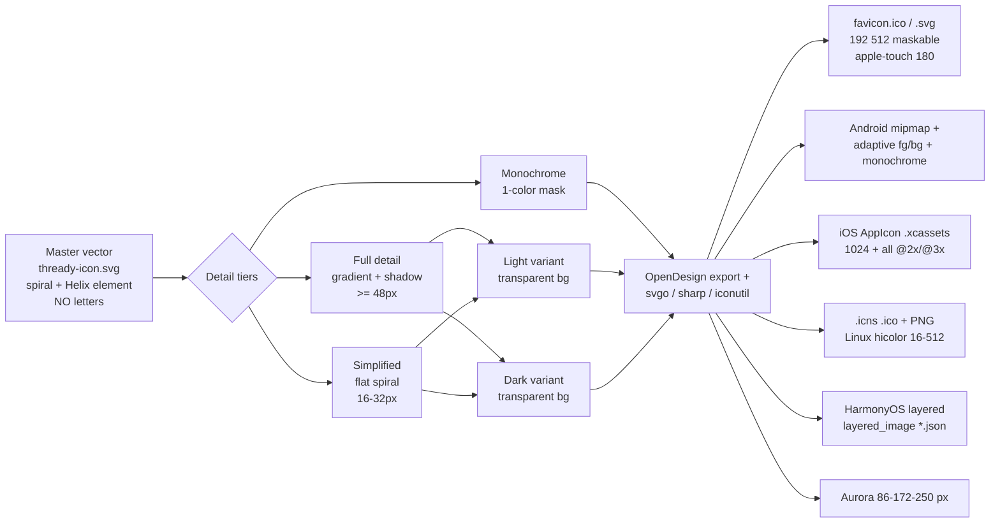

<!--
  Title           : Helix Thready — Brand Assets (Launcher Icon, Logo, Slogan)
  Classification  : PUBLIC
  Location        : docs/public/research/mvp/design/brand-assets.md
  Status          : Draft — v0.1
  Revision        : 1 (2026-07-21)
  Author          : Helix Thready documentation swarm (design)
  Related         : ./index.md, ./design-system.md, ./theming.md, ../CONVENTIONS.md
-->

# Helix Thready — Brand Assets (Launcher Icon, Logo, Slogan)

| Rev | Date | Author | Change |
|-----|------|--------|--------|
| 1 | 2026-07-21 | swarm (design) | Initial complete draft: icon concept, construction, detail tiers, light/dark, OS export matrix, org logo usage, footer slogan + heart |
| 2 | 2026-07-22 | swarm (design · Pass 3) | Depth pass: numeric icon geometry spec (grid/safe-zones/coil growth, §3.1); concrete per-platform manifests — `manifest.webmanifest`, favicon `<head>`, Android `ic_launcher.xml` + adaptive/monochrome, iOS `Contents.json`, HarmonyOS layered JSON (§5.1); per-surface **slogan-placement matrix** (§8.1); corrected heart-color provenance to the **verified** `--accent-ink` token + exact i18n keys (`footer.made`/`footer.by`/`a11y.love`) |
| 3 | 2026-07-22 | swarm (design · decisions) | Operator ruling: `[CLOSED: THREADY-DES-03]` — heart stays `--ds-heart: var(--accent)` (accent green; AA-legible both modes; white-label-safe); love-red alternative dropped; §8 + §11 updated |

## Table of contents

- [1. Requirements (verbatim intent)](#1-requirements-verbatim-intent)
- [2. The mark: reading Logo.png](#2-the-mark-reading-logopng)
- [3. Launcher‑icon concept & construction](#3-launcher-icon-concept--construction)
  - [3.1 Numeric geometry spec](#31-numeric-geometry-spec)
- [4. Detail tiers & light/dark variants](#4-detail-tiers--lightdark-variants)
- [5. OS / platform export matrix](#5-os--platform-export-matrix)
  - [5.1 Concrete platform manifests](#51-concrete-platform-manifests)
- [6. Export pipeline](#6-export-pipeline)
- [7. Helix Development org logo (attribution)](#7-helix-development-org-logo-attribution)
- [8. The footer slogan & heart glyph](#8-the-footer-slogan--heart-glyph)
  - [8.1 Per‑surface slogan placement](#81-per-surface-slogan-placement)
- [9. Brand on generated documents](#9-brand-on-generated-documents)
- [10. Clear‑space, misuse, and file inventory](#10-clear-space-misuse-and-file-inventory)
- [11. Gaps & open items](#11-gaps--open-items)

## 1. Requirements (verbatim intent)

From the original request (§ "Launcher icon / main logo design") `[OPERATOR]`:

- Create the launcher icon with **OpenDesign** `[CONSTITUTION §11.4.162]`.
- **No letters** — the OS prints the app title, so the mark must not contain any text.
- Reflect the project's **central theme, purpose, and a creative idea**.
- The **Helix element** (the defining element of the Helix Development logo) **must be part of**
  the product icon.
- Vector master; exported in **all major sizes/formats for all supported OSes**.
- Legible at **very large and very small** sizes.
- Provide **multiple versions** (more / less detail) used per context.
- Provide **light and dark** versions with **transparent background**.
- The **Helix Development org logo** is still used in footers/branding so it is clear the software
  is part of Helix Development.

## 2. The mark: reading Logo.png

`assets/Logo.png` `[VERIFIED — inspected]` is a **spiral** — an unrolling nautilus/thread coil —
that reads simultaneously as:

- a **helix / spiral** (the Helix Development defining element, satisfying "helix must be part of
  the icon"), and
- a **thread** unspooling into a coil (the literal meaning of *Thready* — reading threads of
  posts), and
- a **chameleon‑tail / shell** silhouette (adaptive, organic — matching the product that adapts to
  many content types).

Color reading (informs the theme in [design-system.md](./design-system.md)):

| Region | Color (approx.) | Role |
|--------|-----------------|------|
| Outer sweep, left | Chartreuse / lime green | Primary brand — `--brand` helix‑green `#B6E376` `[VERIFIED base]` (Logo.png green‑region eyedrop `#BAE448`, n≈1.06M, corroborates) |
| Flowing to right | Mint / soft teal | Secondary — `--brand-2` teal `#ABDDC9` `[VERIFIED — eyedrop mean of Logo.png mint region, n=618,886; median #B7EBD6]` |
| Spiral negative space | White | The coil / thread path |

The mark is **already letter‑free** and **already carries the Helix spiral** — so the product icon
is a refinement of this master, not a new invention.

## 3. Launcher‑icon concept & construction

**Concept:** *"The thread becomes a helix."* A single ribbon starts as a straight thread at the
outer edge and coils inward into a tight helix/spiral eye — the reading loop of a thread rendered
as the Helix element. Letter‑free by construction.

**Construction rules** (authored in OpenDesign, master as SVG):

- **Grid:** designed on a 1024×1024 master with a safe area. Two safe zones are cut:
  - a **circular** safe zone (Android adaptive, iOS squircle, macOS/Windows rounded) — the spiral
    eye is centered so no coil is clipped by platform masking;
  - a **full‑bleed** zone for maskable/adaptive backgrounds.
- **Geometry:** the ribbon width, coil count and eye position are proportion‑locked to the master;
  the spiral uses a logarithmic (golden‑ratio‑ish) growth so it stays balanced when simplified.
- **Fill:** a chartreuse→teal gradient (`--brand #B6E376` → `--brand-2 #ABDDC9`, both eyedrop‑captured
  from `Logo.png`) on the ribbon; white/transparent negative space for the coil path. A **flat**
  (non‑gradient) fill is the small‑size fallback.
- **No letters, no wordmark inside the icon.** The wordmark "Thready" is a *separate* lockup used
  only in headers/marketing, never inside the launcher icon.



> Rendered PNG/SVG exported via Docs Chain (§11.4.65). Source: `diagrams/icon-export-pipeline.mmd`.

**Explanation (for readers/models that cannot see the diagram).** A single master vector
(`thready-icon.svg`) — the spiral/Helix element, with no letters — is the only hand‑authored
source. From it three **detail tiers** are derived: a full‑detail version (gradient + subtle
elevation, used at ≥ 48px), a simplified flat spiral (16–32px, where gradients and shadows muddy),
and a monochrome one‑color mask (for tinted/adaptive contexts). Each tier is produced in a **light**
and a **dark** variant, both on transparent backgrounds so they compose over any UI. All variants
then pass through the **export pipeline** (OpenDesign export plus `svgo` for SVG optimization,
`sharp` for raster sizes, `iconutil`/`png2icns` for macOS, and platform packagers). The pipeline
emits every platform bundle: web favicons + PWA maskable icons + apple‑touch, Android mipmaps with
an adaptive foreground/background pair and a monochrome layer, the iOS `AppIcon` asset catalog, the
desktop `.icns`/`.ico`/PNG set (Linux hicolor 16–512), the HarmonyOS layered image, and the Aurora
sizes. Because the master is a single vector, every downstream size stays perfectly consistent.

### 3.1 Numeric geometry spec

So the master is reproducible (not "draw a nice spiral"), the construction is pinned to numbers on
the **1024×1024** master `[DEFAULT — adjustable, pending the OpenDesign authoring pass]`:

| Property | Value | Rationale |
|----------|-------|-----------|
| Master canvas | 1024×1024 px | OS‑canonical largest source |
| **Keyline safe circle** (Android adaptive / iOS squircle) | Ø 768 px, centered (75%) | Android adaptive masks to ~66–75%; the spiral **eye** sits at center so no coil clips |
| **Full‑bleed** zone (maskable / adaptive bg) | full 1024, art within Ø 916 | maskable icons need art inside the 80% inner circle |
| Spiral eye center | canvas center (512, 512) | mask‑safe under circle **and** squircle |
| Ribbon stroke width | 96 px at outer turn → 40 px at the eye | tapered ribbon reads as a thread narrowing into the coil |
| Coil count | 2.75 turns (full tier) → 2.0 (simplified) → 1.75 (mono) | fewer turns as size shrinks so it never muddies |
| Growth | logarithmic, ratio ≈ 1.618 per quarter‑turn (golden) | stays balanced when simplified |
| Clear‑space | ≥ 128 px (⅛ box ≈ one outer ribbon width) | matches §10 clear‑space rule |
| Corner radius (adaptive fg) | n/a — art only; the OS applies the mask | never bake platform corners into the art |

**Fills.** Full tier = a linear gradient `--brand #B6E376 → --brand-2 #ABDDC9` along the ribbon's sweep,
white/transparent negative space for the coil path. Simplified/mono tiers = a single flat tone
(`--accent #446E12` light, `--brand #B6E376` dark) so the mark survives at 16–32 px and in tinted
Android‑monochrome / notification slots. **No letters** are ever inside any tier (the OS prints the
title). The `--brand-2` endpoint is the eyedrop‑captured `#ABDDC9` `[VERIFIED — closes THREADY-DES-01]`.

## 4. Detail tiers & light/dark variants

| Tier | Used at | Contents | Fallback of |
|------|---------|----------|-------------|
| **Full** | ≥ 48px (launcher, splash, store) | Gradient ribbon, soft inner shadow, full coil count | — |
| **Simplified** | 16–32px (favicon, tab, list rows) | Flat single‑tone ribbon, reduced coil count, thicker stroke | Full |
| **Monochrome** | Adaptive/tinted (Android monochrome, notification, watch) | 1‑color silhouette of the spiral | Simplified |

**Light vs. dark** (transparent bg, per requirement):

- **Light variant:** ribbon in `--brand`→`--brand-2` gradient (or `--accent #446E12` for the
  flat/mono tone), tuned for light UIs and light home screens.
- **Dark variant:** ribbon brightened to the logo lime `#B6E376` (the verified dark accent) so it
  holds on dark surfaces; coil negative space stays transparent (reads as the dark surface).
- Selection at runtime follows the same three mechanisms as the theme
  (`prefers-color-scheme` / `[data-theme]` / `.dark`) for in‑app marks; OS launcher icons use the
  platform's own light/dark icon slots where available (iOS 18 dark/tinted, Android monochrome).

## 5. OS / platform export matrix

All exported from the single master `[DEFAULT — adjustable]`. Sizes are the platform‑canonical set.

**Web / PWA**

| Asset | Sizes |
|-------|-------|
| `favicon.svg` (scalable) + `favicon.ico` | 16, 32, 48 |
| PWA `icon` (manifest) | 192, 512 |
| PWA `maskable` | 192, 512 (full‑bleed safe zone) |
| `apple-touch-icon.png` | 180 |

**Android** (`res/mipmap-*` + adaptive)

| Asset | Densities |
|-------|-----------|
| Legacy `ic_launcher.png` | mdpi 48, hdpi 72, xhdpi 96, xxhdpi 144, xxxhdpi 192 |
| Adaptive `ic_launcher_foreground` + `_background` | 108dp @ all densities (72px safe circle) |
| `ic_launcher_monochrome` (Android 13+ themed) | 108dp |
| Play Store | 512×512 |

**iOS** (`Assets.xcassets/AppIcon.appiconset`)

| Asset | Sizes |
|-------|-------|
| App icon (single‑size, Xcode 14+) | 1024 (system downscales) |
| Legacy full set (if targeting older) | 20/29/40/58/60/76/80/87/120/152/167/180 |
| Dark + tinted (iOS 18) | 1024 each |

**Desktop**

| OS | Format | Sizes |
|----|--------|-------|
| macOS (Tauri) | `.icns` | 16, 32, 64, 128, 256, 512, 1024 (@1x/@2x) |
| Windows (Tauri) | `.ico` | 16, 24, 32, 48, 64, 128, 256 |
| Linux (Tauri) | PNG hicolor | 16, 22, 24, 32, 48, 64, 128, 256, 512 + scalable SVG |

**HarmonyOS / Aurora** `[GAP: 8.5 — native clients scaffold]`

| OS | Format | Notes |
|----|--------|-------|
| HarmonyOS | layered image (`foreground`+`background` PNG + `layered_image` JSON) | via ArkTS client (scaffold) |
| Aurora (auroraos.ru) | PNG | 86, 108, 128, 172, 250 (per Sailfish/Aurora density buckets) `[RESEARCH — verify at integration]` |

### 5.1 Concrete platform manifests

The export pipeline emits these files verbatim (not just sizes) so each client wires the icon with
no guesswork `[DEFAULT — adjustable]`:

**Web — `manifest.webmanifest` + `<head>`:**

```json
{
  "name": "Thready", "short_name": "Thready",
  "theme_color": "#020817", "background_color": "#ffffff", "display": "standalone",
  "icons": [
    { "src": "/icons/icon-192.png", "sizes": "192x192", "type": "image/png" },
    { "src": "/icons/icon-512.png", "sizes": "512x512", "type": "image/png" },
    { "src": "/icons/maskable-192.png", "sizes": "192x192", "type": "image/png", "purpose": "maskable" },
    { "src": "/icons/maskable-512.png", "sizes": "512x512", "type": "image/png", "purpose": "maskable" }
  ]
}
```

```html
<!-- self-hosted, no external CDN (CSP hygiene) -->
<link rel="icon" href="/icons/favicon.svg" type="image/svg+xml">
<link rel="icon" href="/icons/favicon.ico" sizes="16x16 32x32 48x48">
<link rel="apple-touch-icon" href="/icons/apple-touch-icon.png" sizes="180x180">
<link rel="manifest" href="/manifest.webmanifest">
<meta name="theme-color" content="#ffffff" media="(prefers-color-scheme: light)">
<meta name="theme-color" content="#020817" media="(prefers-color-scheme: dark)">
```

**Android — `res/mipmap-anydpi-v26/ic_launcher.xml` (adaptive + Android‑13 monochrome):**

```xml
<adaptive-icon xmlns:android="http://schemas.android.com/apk/res/android">
    <background android:drawable="@color/ic_launcher_background"/>   <!-- #FFFFFF light / handled by themed -->
    <foreground android:drawable="@drawable/ic_launcher_foreground"/> <!-- spiral, art within 66dp safe -->
    <monochrome android:drawable="@drawable/ic_launcher_monochrome"/> <!-- 1-color spiral (themed icons) -->
</adaptive-icon>
```

**iOS — `Assets.xcassets/AppIcon.appiconset/Contents.json` (single‑size + dark + tinted, iOS 18):**

```json
{ "images": [
  { "idiom": "universal", "platform": "ios", "size": "1024x1024", "filename": "icon-1024.png" },
  { "idiom": "universal", "platform": "ios", "size": "1024x1024", "filename": "icon-1024-dark.png",
    "appearances": [ { "appearance": "luminosity", "value": "dark" } ] },
  { "idiom": "universal", "platform": "ios", "size": "1024x1024", "filename": "icon-1024-tinted.png",
    "appearances": [ { "appearance": "luminosity", "value": "tinted" } ] }
], "info": { "author": "opendesign-export", "version": 1 } }
```

**HarmonyOS — `resources/base/media/layered_image.json` (ArkTS client, `[GAP: 8.5 scaffold]`):**

```json
{ "layered-image": { "background": "$media:ic_launcher_background",
                     "foreground": "$media:ic_launcher_foreground" } }
```

Aurora consumes plain PNGs at the density buckets in §5 `[OPEN: THREADY-DES-05 — verify at
integration]`. Because all of these reference art derived from the **one** master, a master change
re‑emits every file through Docs Chain (§6).

## 6. Export pipeline

```yaml
# thready-icons.export.yaml  [DEFAULT — adjustable]
master: assets/brand/thready-icon.svg          # single hand-authored vector, no letters
tiers:  { full: ">=48", simplified: "16-32", monochrome: "adaptive" }
variants: [light, dark]                          # transparent background
targets:
  web:      { favicon: [16,32,48], svg: true, pwa: [192,512], maskable: [192,512], appleTouch: 180 }
  android:  { mipmap: [48,72,96,144,192], adaptive: true, monochrome: true, playstore: 512 }
  ios:      { appicon: 1024, dark: true, tinted: true }
  macos:    { icns: [16,32,64,128,256,512,1024] }
  windows:  { ico:  [16,24,32,48,64,128,256] }
  linux:    { hicolor: [16,22,24,32,48,64,128,256,512], svg: true }
  harmonyos:{ layered: true }                    # via ArkTS client [GAP: 8.5]
  aurora:   { png: [86,108,128,172,250] }         # [RESEARCH]
tools: [opendesign-export, svgo, sharp, png2icns, icotool]
verify:
  - render each target size and assert legibility (no clipped coil, >=3:1 mark/bg where placed)
  - snapshot into the visual-regression bank (ScreenDiff)   # [GAP: 9.3]
```

The pipeline is wired into **Docs Chain** so a change to the master re‑exports every size
`[CONSTITUTION §11.4.65]` and the design↔project hooks required by the request ("all design
materials … completely connected … through Docs Chain").

## 7. Helix Development org logo (attribution)

The Helix Development org logo (green helix, `assets/logos/helix-development-logo.png` in
`design_system` `[VERIFIED]`) remains the **attribution** mark. It appears — never removed by
white‑labeling — in:

- app **footers** (alongside the slogan, §8),
- generated‑document footers (§9),
- the "About"/legal surface.

Per §8.3 white‑labeling (see [theming.md](./theming.md)): an Account may override the *product*
logo/colors/slogan, but the **Helix Development attribution persists** in footers.

## 8. The footer slogan & heart glyph

**Required string** `[OPERATOR]`: *"Made with love by Helix Development"*, where **"love" is
replaced by a heart glyph in a proper color**.

The in‑house `design_system` **already ships this exact pattern** in `reference.footer.component.ts`
`[VERIFIED — inspected source]`, and Thready reuses it:

- The heart is the canonical **lucide `Heart` SVG** (`fill=currentColor`), tinted by a brand token,
  with `[attr.aria-label]="i18n.t('a11y.love')"` so the **accessible name reads "Made with love by
  Helix Development"**.
- The text around it is localized via the exact shipped i18n keys `footer.made` … heart …
  `footer.by` (`[VERIFIED — `{{ i18n.t('footer.made') }}` / `{{ i18n.t('footer.by') }}` in the
  component]`), so the slogan translates (en/ru/sr‑Cyrl) without hard‑coding.
- **Ordered visual fallbacks** (the head script toggles `html.no-svg`, applied via
  `:host-context(html.no-svg)` in the shipped component): lucide SVG → `U+2665` (♥) glyph → literal
  word "love". This guarantees the slogan renders in any environment (including the TUI and
  plain‑text/email exports).

```html
<!-- Thready footer slogan (adapted from design_system reference.footer) [VERIFIED pattern] -->
<p class="made-with">
  Made with
  <span class="heart" role="img" aria-label="love" title="love">
    <svg class="heart-svg" viewBox="0 0 24 24" width="18" height="18"
         fill="currentColor" stroke="none" aria-hidden="true" focusable="false">
      <path d="M19 14c1.49-1.46 3-3.21 3-5.5A5.5 5.5 0 0 0 16.5 3c-1.76 0-3 .5-4.5 2-1.5-1.5-2.74-2-4.5-2A5.5 5.5 0 0 0 2 8.5c0 2.3 1.5 4.05 3 5.5l7 7Z"/>
    </svg>
    <span class="heart-glyph" aria-hidden="true">&#9829;</span>  <!-- ♥ fallback -->
    <span class="heart-word" aria-hidden="true">love</span>       <!-- text fallback -->
  </span>
  by Helix Development
</p>
```

```css
.heart { color: var(--ds-heart); display:inline-flex; align-items:center; line-height:0; }
.heart-glyph, .heart-word { display:none; }
html.no-svg .heart-svg { display:none; } html.no-svg .heart-glyph { display:inline; }
```

**Heart "proper color".** The shipped precedent tints the heart with **`var(--accent-ink)`** — the
accessible accent‑ink token — so it is AA‑legible in light and dark `[VERIFIED — `.heart { color:
var(--accent-ink); }` in `reference.footer.component.ts`]`. Thready exposes this as a `--ds-heart`
token that defaults to that accent‑ink (in the Thready theme, `--accent` already resolves to the
AA‑pinned `#446E12` light / `#B6E376` dark).
`[CLOSED: THREADY-DES-03]` — **operator ruling (2026-07-22): the heart color stays
`--ds-heart: var(--accent)`** (accent green). Rationale: AA-legible in both modes as shipped,
and white-label-safe — a rebranded Account's server-validated accent re-tints the heart
automatically, where a hard-coded love-red would sit outside the override contract and risk
reading as `--danger`. The classic love-red alternative is dropped. The heart remains
decorative (its meaning is carried by the accessible name "love"), so text-contrast does not
apply — but the accent pair keeps the mark legible in both modes regardless.

**Surface variants of the slogan:**

- **Web/Desktop/Mobile:** the SVG heart (above).
- **TUI/CLI:** the `U+2665` (♥) glyph, tinted with the Lipgloss `Accent` (or `Danger`‑red)
  style — e.g. `Made with ♥ by Helix Development`.
- **Generated Markdown/PDF/HTML:** `♥` glyph (matches this doc's own footer).

### 8.1 Per‑surface slogan placement

The slogan and attribution appear on **every** surface; placement and glyph differ by medium but the
accessible string is always "Made with love by Helix Development". This is the locked contract the
white‑label cannot remove (§7, [theming §3](./theming.md#3-white-labeling-model)):

| Surface | Location | Heart rendering | Attribution logo |
|---------|----------|-----------------|------------------|
| Web / Desktop portal | `.ds-footer` app‑shell footer (§ wireframes §3.1) | lucide SVG, `--ds-heart` | Helix Development mark beside slogan |
| Mobile (More tab / About) | Settings › About + app footer | SVG (Compose/SwiftUI vector) | mark in About |
| TUI | bottom rail under the live pane (§ wireframes §5) | `♥` glyph, Lipgloss `Accent` | text "Helix Development" |
| CLI | `thready version` / `--help` epilogue | `♥` glyph (or `love` if `--no-color`/no‑UTF8) | text |
| Generated docs (PDF/HTML/MD) | document **footer**, every page | `♥` glyph | Helix Development attribution logo (§9) |
| Login / splash | under the wordmark ("read your threads, smarter") | SVG | product logo (Account‑branded) above |
| Launcher icon | **never** — the icon is letter‑free by construction | — | — |

The one place the slogan/heart must **not** appear is inside the launcher icon (§1: "no letters").

## 9. Brand on generated documents

Per §8.3 and the request ("Adding logo into header and footers of all documents + slogan"): every
generated artifact (research docs, books, reports) carries, styled by the design system via
**Docs Chain**:

- **Header:** the effective **product** logo (Account‑branded if white‑labeled, else Thready) +
  document title.
- **Footer:** the **Helix Development** attribution logo + the "Made with ♥ by Helix Development"
  slogan + document metadata (revision, date).
- Typography, code/syntax‑highlight, diagram and callout styles are the design‑system tokens
  (§ design‑system.md), so generated documents read as one system with the apps
  `[CONSTITUTION §11.4.65]`.

## 10. Clear‑space, misuse, and file inventory

**Clear‑space:** minimum padding around the icon = the ribbon width (≈ 1/8 of the icon box). Do not
place other marks inside the clear‑space.

**Misuse (do not):** add letters inside the icon; recolor outside `--brand`/`--brand-2`/mono; skew
or rotate the spiral; drop the transparent background; use the full‑detail tier below 48px; use the
product icon where the Helix Development attribution logo is required.

**File inventory** (proposed, under `assets/brand/` `[DEFAULT — adjustable]`):

```text
assets/brand/
  thready-icon.svg                 # master (no letters)
  thready-icon.mono.svg
  thready-wordmark.svg             # "Thready" lockup (headers/marketing only)
  light/  dark/                    # per-variant exports (transparent bg)
  export/                          # generated OS bundles (web, android, ios, macos, windows, linux, harmonyos, aurora)
  helix-development-logo.svg       # attribution (from design_system)
```

## 11. Gaps & open items

- `[GAP: 8.1 design_system]` — the Thready brand assets live beside the design‑system brand assets;
  add `thready` theme + Thready icon set to the published package (workable item THREADY‑DES‑DS‑01).
- `[GAP: 8.5 helix_shims / HarmonyOS+Aurora]` — HarmonyOS layered icon + Aurora sizes are produced
  now but consumed by native clients that are still scaffolds; do not claim those launchers ship.
- `[CLOSED: THREADY-DES-01]` — `--brand-2` teal captured from a formal `assets/Logo.png` eyedrop
  (mint region mean **`#ABDDC9`**, n = 618,886; dark median `#B7EBD6`), replacing the `#7AA590`
  stand‑in; method in [design-system §3.2](./design-system.md#32-the-thready-brand-theme). Re‑confirm
  with the design‑system's own eyedrop tool at integration.
- `[CLOSED: THREADY-DES-03]` — heart color **decided** (operator ruling 2026-07-22): stays
  `--ds-heart: var(--accent)` — accent green, AA-legible in both modes, white-label-safe;
  the love-red alternative is dropped (§8).
- `[OPEN: THREADY-DES-05]` — Aurora density buckets `[RESEARCH]` must be verified against current
  Aurora OS packaging docs at integration.

---

*Made with love ♥ by Helix Development.*
