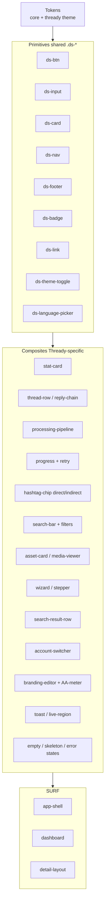
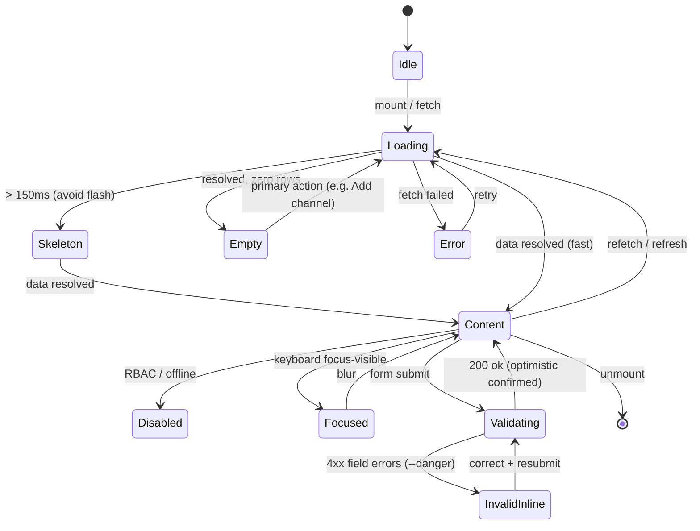

<!--
  Title           : Helix Thready — Component Library
  Classification  : PUBLIC
  Location        : docs/public/research/mvp/design/component-library.md
  Status          : Draft — v0.1
  Revision        : 1 (2026-07-21)
  Author          : Helix Thready documentation swarm (design)
  Related         : ./index.md, ./design-system.md, ./wireframes.md,
                    ./ux-flows.md, ../CONVENTIONS.md
-->

# Helix Thready — Component Library

| Rev | Date | Author | Change |
|-----|------|--------|--------|
| 1 | 2026-07-21 | swarm (design) | Initial complete draft: shared `.ds-*` primitives (verbatim), Thready composites, per‑platform adapters, states/anatomy, build backlog, testing |
| 2 | 2026-07-21 | swarm (design · review) | Second-pass review: added a TDD reproduce‑first (RED) test for `thready-processing-pipeline`; added the mandated **Challenges** scenario‑bank test type (`[GAP: 9.3]`) + backlog item |
| 3 | 2026-07-22 | swarm (design · Pass 3) | Depth pass: verbatim primitives table completed against source (`--btn--secondary/--ghost`, `--elev-flat`, `--fg-2`/`--meta`/`--border-soft` aliases); component state-lifecycle diagram (§5b) + `.mmd`; **per-platform variant matrix for every composite** (§7.1 Angular/React/KMP/Flutter/TUI + status); five more component contracts (thread-row, hashtag-chip, search-bar, wizard, branding-editor, toast, §6.1); a11y name/role/keyboard per composite |
| 4 | 2026-07-22 | swarm (design · review-fixes) | Consistency fix from the adversarial platform review: §7.1 retitled from "(all platforms)" to "(five realization tracks)" — the table has five columns (Qt shares the Flutter/`helix_design` track; SwiftUI and ArkTS have no build track), which the old title overstated; added an explicit pointer to the full 8-column matrix in library/platform-map.md §3. No cell content changed — no verification was fabricated |

## Table of contents

- [1. Layering](#1-layering)
- [2. Component taxonomy](#2-component-taxonomy)
- [3. Shared primitives (verbatim from design_system)](#3-shared-primitives-verbatim-from-design_system)
- [4. Angular adapters (verbatim interfaces)](#4-angular-adapters-verbatim-interfaces)
- [5. Thready composite components](#5-thready-composite-components)
- [5b. Component state lifecycle](#5b-component-state-lifecycle)
- [6. Component contract (anatomy · props · states · a11y)](#6-component-contract-anatomy--props--states--a11y)
  - [6.1 Additional component contracts](#61-additional-component-contracts)
- [7. Per‑platform adapters](#7-per-platform-adapters)
  - [7.1 Per‑component variant matrix (five realization tracks)](#71-per-component-variant-matrix-five-realization-tracks)
- [8. States, empty/skeleton/error](#8-states-emptyskeletonerror)
- [9. Testing the library](#9-testing-the-library)
- [10. Build backlog & gaps](#10-build-backlog--gaps)
- [11. Open items](#11-open-items)

## 1. Layering

Three layers, bottom‑up:

1. **Tokens** — `core.css` + `themes/thready.css` (see [design-system.md](./design-system.md)).
2. **Primitives** — the **shared, framework‑agnostic `.ds-*`** components from
   `vasic-digital/design_system` (`components/css/components.css`) + the three Angular adapters.
   **Consumed, not re‑authored** `[CONSTITUTION §11.4.28]`.
3. **Composites / Surfaces** — the **Thready‑specific** components (thread rows, processing
   pipeline, search bar, branding editor, etc.) built *from* primitives and contributed upstream
   where generic.

The rule: **if a component is generic, it belongs in `design_system`** (contribute upstream); if it
is Thready‑domain (a thread/reply chain, a processing pipeline), it lives in Thready's component
package but is still built entirely on tokens + primitives.

## 2. Component taxonomy



> Rendered PNG/SVG exported via Docs Chain (§11.4.65). Source: `diagrams/component-taxonomy.mmd`.

**Explanation (for readers/models that cannot see the diagram).** Tokens feed the **primitives** —
the shared `.ds-*` set (`ds-btn`, `ds-input`, `ds-card`, `ds-nav`, `ds-footer`, `ds-badge`,
`ds-link`) plus the two Angular utility components (`ds-theme-toggle`, `ds-language-picker`). Those
primitives compose into the **Thready composites**: the stat card; the thread row and reply‑chain;
the processing pipeline and its progress+retry control; the direct/indirect hashtag chip; the search
bar with filters and the search‑result row; the asset card and media viewer; the wizard/stepper; the
account switcher; the branding editor with its live AA meter; the toast/live‑region; and the shared
empty/skeleton/error states. Composites in turn assemble into **surfaces/templates** — the app
shell, the dashboard, and the generic detail layout — which the concrete screens in
[wireframes.md](./wireframes.md) instantiate. Everything above the token line is built only from the
line below it, so a token or theme change re‑skins the entire tree.

## 3. Shared primitives (verbatim from design_system)

These ship today `[VERIFIED — components/css/components.css]`. The `.ds-` prefix avoids host‑framework
collisions. All are token‑bound (a theme swap re‑tints them) and AA‑inherited.

| Component | Class(es) | Notes |
|-----------|-----------|-------|
| Container / section | `.ds-container`, `.ds-section` | responsive gutters + section rhythm |
| Button | `.ds-btn` + `--primary` / `--secondary` / `--ghost` | focus‑ring, reduced‑motion aware |
| Card | `.ds-card` + `--raised` | `--elev-raised` shadow |
| Input | `.ds-input` | `--border-strong`, focus‑ring, placeholder `--muted` |
| Link | `.ds-link` | `--accent`, underline on hover |
| Nav | `.ds-nav`, `.ds-nav__links`, `.ds-nav__link` | `aria-current` styling |
| Footer | `.ds-footer` | carries the slogan (§brand-assets) |
| Badge | `.ds-badge` + `--success`/`--warn`/`--danger` | semantic, `color-mix` tint |
| Brand mark | `.ds-brand-mark` | decorative `--brand` only |

Example (verbatim button contract, **all three variants** `[VERIFIED — components/css/components.css]`):

```css
.ds-btn { display:inline-flex; align-items:center; gap:var(--space-2);
  font:500 var(--text-base)/1 var(--font-body); padding:var(--space-3) var(--space-5);
  border-radius:var(--radius-sm); border:1px solid transparent; cursor:pointer;
  transition: background-color var(--motion-fast) var(--ease-standard),
              color var(--motion-fast) var(--ease-standard),
              box-shadow var(--motion-fast) var(--ease-standard); }
.ds-btn:focus-visible { outline:none; box-shadow:var(--focus-ring); }
.ds-btn--primary   { background:var(--accent); color:var(--accent-on); }
.ds-btn--primary:hover  { background:var(--accent-hover); }   /* color-mix(accent, black 8%)  */
.ds-btn--primary:active { background:var(--accent-active); }  /* color-mix(accent, black 14%) */
.ds-btn--secondary { background:transparent; color:var(--fg); border-color:var(--border-strong); }
.ds-btn--secondary:hover { background:var(--surface-warm); }
.ds-btn--ghost     { background:transparent; color:var(--accent); }
.ds-btn--ghost:hover { background:color-mix(in oklab, var(--accent), transparent 90%); }
@media (prefers-reduced-motion: reduce) { .ds-btn { transition:none; } }
```

The `.ds-container` responsive gutters and `.ds-section` rhythm are token‑driven at the two
breakpoints (768 / 1024px) `[VERIFIED]`; the badge tints use `color-mix(in oklab, <semantic>,
transparent 90%)`, so a theme swap re‑tints every semantic badge without new CSS. Additional
verified structural aliases the primitives lean on: `--elev-flat: none`, `--fg-2`/`--meta` (=`--fg`
/`--muted`), and `--border-soft` (=`--border`) — declared once in `core.css`/theme so composites
never hard‑code a value.

## 4. Angular adapters (verbatim interfaces)

Three shipped Angular adapters `[VERIFIED — components/angular/*]` that Thready consumes as‑is:

- **`ThemeService`** — signal `choice: 'light'|'dark'|'system'`, `set()`, `resolved()`; stamps
  `data-theme`/`.dark`, persists to `${prefix}-theme`; SSR‑safe.
- **`I18nService`** — signal `lang`, `t(key)`, `set(code)`; injected `DS_DICTIONARY`/`DS_LOCALES`;
  persists to `${prefix}-lang`; roadmap notes drop‑in Transloco migration.
- **`FooterComponent`** — the "Made with ♥ by Helix Development" pattern (lucide `Heart` SVG +
  `U+2665` + text fallback, `aria-label="love"`).
- Utility components: **`ThemeToggleComponent`** (`ds-theme-toggle`), **`LanguagePickerComponent`**
  (`ds-language-picker`).
- Config: **`DS_CONFIG`** (`storagePrefix`, `defaultTheme`, `defaultLocale`), **`DS_LOCALES`**,
  **`DS_DICTIONARY`** injection tokens.

```typescript
// The exact injection contract Thready provides at bootstrap (see design-system.md §3.3)
export interface DsConfig { storagePrefix: string; defaultTheme?: 'light'|'dark'|'system'; defaultLocale?: string; }
export type DsDictionary = Record<string, Record<string, string>>;
export interface Locale { code: string; label: string; }
```

## 5. Thready composite components

Built on §3/§4. Each is listed with its purpose and the primitives it uses. `[DEFAULT — adjustable]`
API names.

| Component | Purpose | Built from | Used in |
|-----------|---------|-----------|---------|
| `thready-stat-card` | KPI tile (channels, posts, assets) | `.ds-card`, type tokens | Dashboard |
| `thready-thread-row` | One complete post = root + reply count | `.ds-card`/list, `hashtag-chip`, `status-badge` | Channel detail, Dashboard |
| `thready-reply-chain` | Expandable organic replies (system replies separated) | list, tokens | Post detail |
| `thready-hashtag-chip` | Tag with **direct/indirect** distinction | `.ds-badge`, `--brand`/`--muted` | everywhere tags show |
| `thready-processing-pipeline` | Ordered steps download→…→reply + per‑step status | `progress`, `status-badge` | Post detail |
| `thready-progress` | Determinate/indeterminate bar + **retry** affordance | tokens, `.ds-btn--ghost` | Dashboard queue, Post detail |
| `thready-status-badge` | queued/running/processed/failed | `.ds-badge` semantics | lists, detail |
| `thready-search-bar` | Query + scope + mode + filters | `.ds-input`, chips, `.ds-btn` | Search, app shell |
| `thready-search-result` | Scored result row → route | list, tokens | Search |
| `thready-asset-card` / `thready-media-viewer` | Media tile + Range/HLS viewer | `.ds-card`, native `<video>`/player | Assets |
| `thready-wizard` (stepper) | Multi‑step flows (Add‑Channel) | `.ds-card`, `.ds-btn`, form fields | Add‑Channel |
| `thready-account-switcher` | Multi‑Account membership switch | menu, `.ds-nav` | app shell |
| `thready-branding-editor` | White‑label editor + **live AA meter** | `.ds-input`, swatches, `.ds-badge` | Settings › Branding |
| `thready-messenger-signin` | Interactive/non‑interactive sign‑in | form, `.ds-btn` | Settings, Add‑Channel |
| `thready-toast` / live‑region | Async result + SR announcements | tokens, ARIA live | global |
| `thready-empty` / `thready-skeleton` | Empty & loading states | tokens | every list/detail |

## 5b. Component state lifecycle

Every data‑bearing composite moves through **one** state machine (the legend in
[wireframes §1.1](./wireframes.md#11-interaction-state-legend)). Specifying it once means no screen
ships a missing state and the visual‑regression matrix (§9) has an exhaustive list of cells to cover.



> Rendered PNG/SVG exported via Docs Chain (§11.4.65). Source: `diagrams/component-state-lifecycle.mmd`.

**Explanation (for readers/models that cannot see the diagram).** A component starts **Idle**, then
enters **Loading** on mount or fetch. To avoid a flash of placeholder for fast responses, the skeleton
only shows after ~150ms (`Loading → Skeleton`); a fast response goes straight to **Content**. A
resolved fetch with zero rows becomes **Empty** (never a blank pane — an icon, a one‑line reason, and
a primary action), and a failed fetch becomes **Error** (page‑level with retry, or field‑level inline).

From **Content** the component can refetch (back to Loading), take keyboard focus (**Focused**, drawn
with the verified `--focus-ring`), or — for forms — submit into **Validating**. A validating submit
that the server accepts returns to Content with the optimistic value confirmed; one the server rejects
with `4xx` field errors moves to **InvalidInline** (`--danger`, `aria-describedby` to the message),
from which the user corrects and resubmits. **Disabled** covers RBAC‑gated or offline controls (muted,
`aria-disabled`, not focus‑trapping). Retry and the empty‑state primary action both re‑enter Loading,
so the loop is closed. Every arrow here is a **test cell**: the Challenges scenario banks (§9) drive a
component through each transition and capture runtime evidence, and each terminal state is a row in the
visual‑regression theme×state matrix.

## 6. Component contract (anatomy · props · states · a11y)

Every Thready component is documented to this contract. Worked example — `thready-processing-pipeline`:

```typescript
// thready-processing-pipeline — anatomy + props (Angular signal inputs) [DEFAULT — adjustable]
export interface ProcessingStep {
  id: 'classify'|'download'|'convert'|'analyze'|'research'|'reply';
  label: string;
  state: 'queued'|'running'|'done'|'failed'|'skipped';
  progress?: number;        // 0..1 for running
  error?: string;
}
@Component({ selector: 'thready-processing-pipeline', /* … */ })
export class ProcessingPipelineComponent {
  steps    = input.required<ProcessingStep[]>();     // ordered per precedence
  precedence = input<string>('download > convert > analyze > research > reply');
  retryStep  = output<ProcessingStep['id']>();       // idempotent single-claim retry
}
```

- **Anatomy:** ordered step rows (icon + label + state + optional progress), a precedence caption,
  and an inline retry on `failed`.
- **States:** `queued` (muted), `running` (accent progress), `done` (success), `failed` (danger +
  retry), `skipped` (muted italic).
- **Events:** binds `processing.progress` / `processing.completed` / `processing.failed` from WS/SSE.
- **A11y:** each step is a list item with `aria-label` = "`label`: `state`"; progress uses
  `role="progressbar"` with `aria-valuenow`; the retry is a real `<button>` with a clear name;
  updates are announced via a polite live region; motion honors `prefers-reduced-motion`.

The same contract (anatomy / props / all interaction states / a11y name+role+keyboard / theme
light+dark) is authored for **every** component in §5 — this is the spec the Figma component set
([prototypes.md](./prototypes.md)) and the implementation must both satisfy.

### 6.1 Additional component contracts

The five most load‑bearing composites, to the same contract `[DEFAULT — adjustable API names,
OPEN THREADY-DES-11]`:

**`thready-thread-row`** — one complete post (root + organic reply count).

```typescript
export interface ThreadRow {
  postId: string; author: string; excerpt: string; replyCount: number;
  tags: HashTag[]; status: 'queued'|'running'|'processed'|'failed';
  hasSystemReplies: boolean;                 // system replies are separated, not counted
}
@Component({ selector: 'thready-thread-row' })
export class ThreadRowComponent {
  row     = input.required<ThreadRow>();
  expanded = model(false);                    // ▸/▾ discloses the organic reply chain inline
  open     = output<string>();                // routes to Post detail
}
```

- **Anatomy:** excerpt + `↩N` reply count + hashtag chips + status badge + disclosure caret.
- **States:** default / hover / focus‑visible / expanded / running (inline % on the status badge) /
  failed (danger badge). **A11y:** row is a `role="button"` with `aria-expanded`; `Enter/Space`
  toggles disclosure, `→`/`←` expand/collapse; the count reads "12 replies".

**`thready-hashtag-chip`** — a tag with the **direct vs. AI‑indirect** distinction.

```typescript
export interface HashTag { label: string; origin: 'direct'|'indirect'; }
// direct  = --brand fill / brand-ink; indirect = --muted outline + a "derived" tooltip.
```

- **A11y:** indirect chips append "(derived)" to the accessible name so the origin is not
  color‑only; chips are focusable when interactive (filter‑on‑click) and inert when decorative.

**`thready-search-bar`** — query + mode + scope + filters.

- **Props:** `query = model<string>()`, `mode = model<'semantic'|'keyword'|'hybrid'>()`,
  `scope = model<Scope[]>()`, `filters`, `search = output<SearchRequest>()`.
- **States:** idle (recent searches) / typing / validating (busy) / degraded (`--warn` banner + score
  column hidden when on the hash‑embedder `[GAP: 2.1]`). **A11y:** a labelled `role="search"`; mode is
  a radio group, scope a checkbox group with ≥ 1 enforced; results announced via a polite live region.

**`thready-wizard`** (stepper) — multi‑step flows (Add‑Channel).

- **Props:** `steps`, `current = model<number>()`, per‑step `valid` guard, `complete = output()`.
- **Behavior:** *Next* gated on step validity; *Back*/`Esc` never loses entered data. **A11y:**
  `aria-current="step"`; each step is a labelled region; the busy step sets `aria-busy` (Resolve).

**`thready-branding-editor`** + **live AA meter** — the white‑label surface.

```typescript
export interface AccentCheck { hex: string; surface: string; ratio: number; passes: boolean; suggestion?: string; }
@Component({ selector: 'thready-branding-editor' })
export class BrandingEditorComponent {
  value  = model<Branding>();
  aaLight = computed<AccentCheck>(() => contrast(this.value().accentLight, '#ffffff'));
  aaDark  = computed<AccentCheck>(() => contrast(this.value().accentDark,  '#020817'));
  save   = output<Branding>();                // disabled while any AccentCheck.passes === false
}
```

- **Contract:** the client meter and the server `ValidateAccent` gate **MUST agree on the ratio**
  ([theming §10.1](./theming.md#101-tdd-reproduce-first-red-then-green)); a server `422` re‑opens the
  offending field. **States:** default / dirty (unsaved guard) / previewing / validating / `422` /
  success (audit‑logged). **A11y:** each swatch pairs a hex `<input>` with a color picker sharing one
  label; the AA readout is `aria-live="polite"` ("accent 3.1:1, below AA 4.5:1 — try #446E12").

**`thready-toast` / live‑region** — async results + SR announcements.

- **Props:** `kind: 'success'|'warn'|'danger'|'info'`, `message`, `action?`, `timeout`.
- **A11y:** `role="status"` (polite) for info/success, `role="alert"` (assertive) for danger;
  auto‑dismiss pauses on hover/focus; never the only channel for a critical error (also inline).

## 7. Per‑platform adapters

The composites are specified once and realized per platform from the same tokens. Honest status:

| Platform | Realization | Status |
|----------|-------------|--------|
| **Angular (Web/Desktop)** | Standalone Angular components on `.ds-*` + adapters | Primary; **Web first** `[OPERATOR]` |
| **React** | `UI-Components-React` | `SCAFFOLD/FLAGGED` `[GAP: 8.6]` — re‑audit before use |
| **KMP/Compose** | `UI-Components-KMP` + token bridge | `SCAFFOLD`, **no CI/publish** `[GAP: 8.4]` |
| **Flutter / Qt‑Aurora** | `helix_design` + `helix_ui` | `SCAFFOLD` `[GAP: 8.2/8.3]`; Qt/ArkTS via `helix_shims` `[GAP: 8.5]` |
| **TUI** | Lipgloss component styles | pattern exists `[VERIFIED — helix_track/llms_verifier/.../tui]` |

**Cross‑platform component parity is a contract, not an aspiration:** each composite's states and
a11y semantics must match across platforms (a `processing-pipeline` behaves the same on Web, Compose
and the TUI). Parity is enforced by the visual‑regression bank (§9) once CI lands `[GAP: 9.3]`.

### 7.1 Per‑component variant matrix (five realization tracks)

Each composite is realized per platform from the same tokens. The columns are the **five build
tracks of §7** — Angular (Web/Desktop‑Tauri), React, KMP/Compose, Flutter/Qt (one `helix_design`
track), and TUI — **not** the eight per‑platform columns of the library matrix: SwiftUI and ArkTS
have no build track of their own (iOS is planned via KMP/Compose, HarmonyOS via `helix_shims`),
and Qt shares the `helix_design` track with Flutter. For the full per‑component **8‑column**
breakdown (incl. SwiftUI/ArkTS/Qt cells, all ASSUMED), see
[library/platform-map.md §3](./library/platform-map.md#3-the-matrix). The cell records the
**realization mechanism** and honest **status**; a blank/`—` means "renders as its primitives, no
bespoke work". Legend: ✅ usable today · ◐ scaffold/needs‑hardening · ○ not‑yet / deferred.

| Composite | Angular (Web/Desktop) ✅ | React ◐ `[GAP: 8.6]` | KMP/Compose ◐ `[GAP: 8.4]` | Flutter/Qt ◐ `[GAP: 8.2/8.3]` | TUI ✅ `[VERIFIED]` |
|-----------|-------------------------|----------------------|----------------------------|------------------------------|--------------------|
| `stat-card` | `.ds-card` + type tokens ✅ | Card ◐ | `Card`/`Surface` ◐ | `Card` ○ | Lipgloss bordered box ✅ |
| `thread-row` / `reply-chain` | standalone cmp ✅ | list item ◐ | `LazyColumn` row ◐ | `ListTile` ○ | list row + disclosure ✅ |
| `hashtag-chip` (direct/indirect) | `.ds-badge` variants ✅ | badge ◐ | `AssistChip` ◐ | `Chip` ○ | tinted `#tag` span ✅ |
| `processing-pipeline` | signal‑input cmp ✅ | ◐ | `Column` of step rows ◐ | ○ | vertical step list ✅ |
| `progress` + retry | `<progress>`/`.ds-btn--ghost` ✅ | ◐ | `LinearProgressIndicator` ◐ | `LinearProgressIndicator` ○ | `▓▓░` bar + `[r]etry` ✅ |
| `status-badge` | `.ds-badge` semantics ✅ | ◐ | badge ◐ | badge ○ | glyph `✓⭮◷⚠` ✅ |
| `search-bar` + filters | `.ds-input` + chips ✅ | ◐ | `SearchBar` ◐ | `TextField` ○ | query line + selectors ✅ |
| `search-result` | list row ✅ | ◐ | row ◐ | row ○ | scored row ✅ |
| `asset-card` / `media-viewer` | `<video>` + Range/HLS ✅ | ◐ | `ExoPlayer`/`AVPlayer` ◐ | platform player ○ | (link‑out; no inline media) ◐ |
| `wizard` (stepper) | `.ds-card` steps ✅ | ◐ | `HorizontalPager` ◐ | `Stepper` ○ | numbered steps ✅ |
| `account-switcher` | menu on `.ds-nav` ✅ | ◐ | `DropdownMenu` ◐ | `PopupMenu` ○ | `acct:` selector ✅ |
| `branding-editor` + AA meter | inputs + swatches ✅ | ◐ | color pickers ◐ | ○ | (read‑only preview) ◐ |
| `messenger-signin` | form + `.ds-btn` ✅ | ◐ | form ◐ | form ○ | prompt sequence ✅ |
| `toast` / live‑region | ARIA live ✅ | ◐ | `Snackbar` ◐ | `SnackBar` ○ | `notifications.go` pane ✅ |
| `empty` / `skeleton` | tokens ✅ | ◐ | shimmer/placeholder ◐ | shimmer ○ | text placeholder ✅ |

**How to read the honesty here.** Only the **Angular** and **TUI** columns are grounded in usable
in‑house code today (the `.ds-*` set + adapters, and the verified Bubble Tea/Lipgloss pattern). The
**KMP/Compose**, **Flutter/Qt** and **React** columns are the *plan* on scaffolds — their status
badges are the gap‑register reality (`[GAP: 8.2/8.3/8.4/8.6]`), and the token bridge (§7) is what
makes a Compose/Flutter cell a re‑tint rather than a re‑author. A cell is only marked ✅ when its
platform package is real; nothing in a ◐/○ column may be claimed to "work" until its workable item
(§10) closes. Two intentional non‑parity cells: the TUI `media-viewer` and `branding-editor` are
link‑out / read‑only (a terminal cannot show inline video or a live color picker), which is a
documented, tested divergence rather than a missing state.

## 8. States, empty/skeleton/error

Uniform, reusable states (the request demands "full forms validations, hints, tooltips"):

- **Empty:** `thready-empty` — icon + one‑line explanation + a primary action (e.g. "Add your first
  channel"). Never a blank screen.
- **Skeleton:** `thready-skeleton` — token‑tinted placeholder blocks during load (respects reduced
  motion — static shimmer off).
- **Error:** inline (`--danger`, field‑level, with hint) and page‑level (`thready-error` with retry).
- **Validation:** synchronous + server‑side; messages are specific and actionable (e.g. branding
  accent "6.03:1 needed, got 3.1:1 — try #446E12").
- **Tooltips/hints:** on every non‑obvious control; keyboard‑reachable, SR‑described.

## 9. Testing the library

Per `[CONSTITUTION §11.4.27/162]` and [../testing/index.md](../testing/index.md):

- **Unit** (Jasmine/Karma) — component logic, inputs/outputs.
- **a11y** (`cypress-axe`/Playwright+axe) — zero critical violations per component/state.
- **Visual‑regression** — `ScreenDiff` (pixel) + `VisualRegression` (LLM‑vision) across the
  theme×state matrix (§ design-system.md §8); **`ReplayBuffer`** for interaction sequences. The
  family has **no CI today** `[GAP: 9.3]` → workable item THREADY‑DES‑VR‑01 adds it.
- **Interaction** (Cypress/Playwright) — the flows in [ux-flows.md](./ux-flows.md).
- **Challenges** (`vasic-digital/challenges`) — one of the 15 mandated test types
  `[CONSTITUTION §11.4.27]`. Author Thready UI/UX **scenario banks** (adversarial/edge‑case decks:
  a 40‑step reply chain, an all‑`failed` pipeline, a 12‑hashtag post, RTL + Cyrillic overflow, a
  white‑label accent at the 4.5:1 boundary) run against the real component tree. This is the second
  half of `[GAP: 9.3]` (the first half is CI for the visual‑regression family) → workable item
  **THREADY‑DES‑CHAL‑01**.
- **Runtime evidence mandatory** (HelixQA anti‑bluff): screenshots + DOM snapshot + axe report per
  case — a green test proves real rendering, not a stub.

**TDD reproduce‑first (RED → GREEN) `[CONSTITUTION §11.4.27/43]`.** Every component test starts as a
**failing RED test that reproduces the defect**, then the component is implemented/fixed to GREEN,
then the case matrix (§6) is filled in. Worked example — the `thready-processing-pipeline` invariant
"a **failed** step MUST expose a keyboard‑focusable retry, and retry MUST be idempotent (single
claim, never double‑process)":

```typescript
// processing-pipeline.spec.ts — RED FIRST (written before the component/behavior exists).
import { render, screen } from '@testing-library/angular';
import userEvent from '@testing-library/user-event';
import { ProcessingPipelineComponent } from './processing-pipeline.component';

describe('thready-processing-pipeline (reproduce-first)', () => {
  it('RED: a failed step exposes a focusable retry button', async () => {
    const emitted: string[] = [];
    await render(ProcessingPipelineComponent, {
      inputs: { steps: [{ id: 'convert', label: 'convert', state: 'failed' }] },
      on: { retryStep: (id: string) => emitted.push(id) },
    });
    const retry = screen.getByRole('button', { name: /retry/i }); // FAILS until the button exists → RED
    retry.focus();
    expect(document.activeElement).toBe(retry);                    // keyboard-reachable

    // EXTEND: retry is single-claim/idempotent — double activation emits exactly one retry.
    await userEvent.click(retry);
    await userEvent.click(retry);
    expect(emitted).toEqual(['convert']); // debounced/disabled-after-claim; never double-processes [§3.3]
  });

  it('a running step announces progress via role=progressbar with aria-valuenow', async () => {
    await render(ProcessingPipelineComponent, {
      inputs: { steps: [{ id: 'download', label: 'download', state: 'running', progress: 0.63 }] },
    });
    const bar = screen.getByRole('progressbar');
    expect(bar).toHaveAttribute('aria-valuenow', '63');
  });
});
```

```yaml
# per-component contract test (excerpt)
component: thready-processing-pipeline
cases:
  - state: running,   step: download, progress: 0.63, expect: [progressbar aria-valuenow=63, no-retry]
  - state: failed,    step: convert,  expect: [danger badge, retry button focusable, axe: 0 critical]
  - theme: [thready-light, thready-dark]
  - reduced_motion: true, expect: no-animation
evidence: [screenshot, dom-snapshot, axe-report]
```

## 10. Build backlog & gaps

Ordered by the **Web + CLI first** priority `[OPERATOR]`:

1. **THREADY‑DES‑WEB‑01** — Angular composite set (§5) on the published `design_system` primitives.
   Blocks on `[GAP: 8.1]` (publish `@vasic-digital/design-system` to npm) — until then consume via
   git dependency.
2. **THREADY‑DES‑TUI‑01** — Lipgloss component styles from the token export (`[VERIFIED]` pattern).
3. **THREADY‑DES‑VR‑01** — CI for the visual‑regression family `[GAP: 9.3]`.
4. **THREADY‑DES‑CHAL‑01** — Thready UI/UX **Challenges** scenario banks (mandated test type,
   `vasic-digital/challenges`) — the second half of `[GAP: 9.3]` `[CONSTITUTION §11.4.27]`.
5. **THREADY‑DES‑KMP‑01** — `UI-Components-KMP` CI + Maven publish + token bridge `[GAP: 8.4]`.
6. **THREADY‑DES‑FLUT‑01 / ‑QT‑01** — `helix_design` per‑platform packages `[GAP: 8.2/8.3]`;
   native ArkTS/Qt via `helix_shims` `[GAP: 8.5]`.
7. **THREADY‑DES‑REACT‑01** — only if a React surface is required; re‑audit `UI-Components-React`
   first `[GAP: 8.6]`.

**Honesty:** only the Web (Angular) and TUI (Lipgloss) realizations are grounded in verified,
usable in‑house code today. Every other platform's component package is a **scaffold** — do not
claim those components work until their workable item closes.

## 11. Open items

- `[OPEN: THREADY-DES-11]` — finalize the Thready composite public API names with the web
  implementation team (names here are `[DEFAULT — adjustable]`).
- `[OPEN: THREADY-DES-12]` — decide which composites are generic enough to contribute upstream to
  `design_system` vs. keep in Thready's package.
- `[OPEN: THREADY-DES-04]` — Cyrillic font‑subset verification affects text‑bearing components.

---

*Made with love ♥ by Helix Development.*
