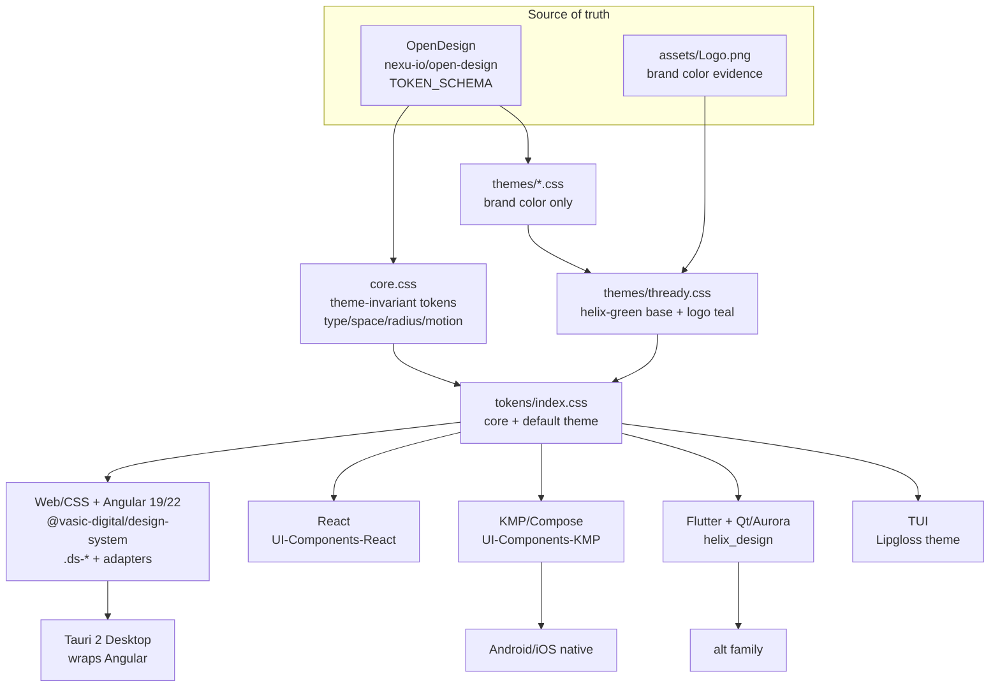

<!--
  Title           : Helix Thready — Design System
  Classification  : PUBLIC
  Location        : docs/public/research/mvp/design/design-system.md
  Status          : Draft — v0.1
  Revision        : 1 (2026-07-21)
  Author          : Helix Thready documentation swarm (design)
  Related         : ./index.md, ./theming.md, ./brand-assets.md,
                    ./component-library.md, ../CONVENTIONS.md
-->

# Helix Thready — Design System

| Rev | Date | Author | Change |
|-----|------|--------|--------|
| 1 | 2026-07-21 | swarm (design) | Initial complete draft: token architecture, Thready theme, platform fan‑out, typography/spacing/motion, a11y contract, visual‑regression testing |
| 2 | 2026-07-21 | swarm (design · review) | Second-pass review: clarified Angular 19 (product) vs 22 (marketing) per Q17; added the mandated **Challenges** scenario‑bank test type to §8/§9 (`[GAP: 9.3]` second half) |
| 3 | 2026-07-22 | swarm (design · Pass 3) | Depth pass: re-verified every token name at source (`gh`); added the remaining verified core token (`--elev-flat`) and theme aliases (`--fg-2`/`--meta`/`--border-soft`); shipped-brand-themes reference table + measured contrasts (helix-green/vasic-red/helix-ota-blue) + the 4-step "add a theme" process (§3.4); typography weight/variable-axis detail + exact i18n keys |
| 4 | 2026-07-22 | swarm (design · review-fixes) | Rendering fix from the adversarial platform review: the Angular 19/22 `[Q17]` blockquote had been inserted **mid-table** in §7, splitting the platform table so the Desktop/React/KMP/Flutter/TUI rows rendered as a broken second table — moved the blockquote below the (now contiguous, single) table; no row content changed |

## Table of contents

- [1. Position and non‑negotiables](#1-position-and-non-negotiables)
- [2. Source: OpenDesign + the shared design_system](#2-source-opendesign--the-shared-design_system)
- [3. Token architecture](#3-token-architecture)
  - [3.1 Theme‑invariant core tokens (verbatim)](#31-theme-invariant-core-tokens-verbatim)
  - [3.2 The Thready brand theme](#32-the-thready-brand-theme)
  - [3.3 Import order and entry](#33-import-order-and-entry)
  - [3.4 Shipped brand themes & adding a theme](#34-shipped-brand-themes--adding-a-theme)
- [4. Typography](#4-typography)
- [5. Spacing, radius, elevation, motion](#5-spacing-radius-elevation-motion)
- [6. Accessibility contract](#6-accessibility-contract)
- [7. Per‑platform fan‑out](#7-per-platform-fan-out)
- [8. Visual‑regression & a11y testing](#8-visual-regression--a11y-testing)
- [9. Gaps addressed & tracked workable items](#9-gaps-addressed--tracked-workable-items)
- [10. Open items](#10-open-items)

## 1. Position and non‑negotiables

The Thready design system is **not a new system**. It is a **brand theme + Thready‑specific
component set layered on the shared, in‑house `vasic-digital/design_system`**, which is itself
extracted from OpenDesign `[CONSTITUTION §11.4.162]` `[IN-HOUSE: design_system]`. This is mandated:

- **Consume, never fork.** The design system is a dependency; Thready extends it upstream, never
  vendors or forks it (decision matrix §10.2, `[CONSTITUTION §11.4.28]`).
- **Light + dark are both first‑class**, with explicit choice and a system default (§Frontends,
  Q‑theming) `[OPERATOR]`.
- **One design system for every surface** — Web, Desktop, Mobile, **and TUI** — every widget comes
  from the design system (§Frontends: "All widgets MUST BE created from our Design System … TUI
  included").
- **Default theme derived from `Logo.png`** (§Frontends) — the Thready theme.
- **No invented values** `[CONSTITUTION §11.4.6]`: structural tokens come from the OpenDesign
  schema defaults; brand color comes from captured pixel evidence of the logo.

> **Verified status.** `design_system` is `FOUNDATION` (real, extracted from HelixOTA, web‑only)
> `[GAP: 8.1 design_system]`. The web/CSS + Angular layer is production‑usable today; the non‑web
> arms (`helix_design` for Flutter/Qt, `UI-Components-KMP`) are **scaffolds** and are tracked in
> §7 and §9. We do **not** claim the non‑web variants work.

## 2. Source: OpenDesign + the shared design_system

**OpenDesign** (`nexu-io/open-design`, release `0.13.0` at time of writing `[VERIFIED]`) is an
agent‑driven design‑system daemon. Its `brands/engine` derives a token set from brand inputs
(logo, seed color, `DESIGN.md`) and its `export.ts` emits the canonical artifacts:

```text
DesignTokens ── tokensToJson      ──▶  tokens.json   (raw, inspectable)
DesignTokens ── tokensToCssVars   ──▶  :root { --… }  (CSS custom properties)
SeedToken    ── tokensToThemeJson ──▶  theme.json    (Ant Design ConfigProvider)
                                       + screenshot‑backed PPTX / PDF
```

`[VERIFIED]` from `apps/daemon/src/brands/engine/export.ts`. **PenPot and Lottie are not native
OpenDesign export targets** — see [prototypes.md](./prototypes.md) and `[OPEN: THREADY-DES-02]`.

The shared **`vasic-digital/design_system`** package is the normalized output of that pipeline for
the Helix web surfaces. Its layers (`[VERIFIED]` from the repo `manifest.json`):

| Layer | Path | Notes |
|-------|------|-------|
| Theme‑invariant core tokens | `tokens/core.css` | type scale, spacing, radius, elevation, focus, motion, layout — **no brand color** |
| Brand themes (light + dark) | `tokens/themes/*.css` | `helix-green` (default), `vasic-red`, `helix-ota-blue` |
| Default entry | `tokens/index.css` | `core.css` + default green theme |
| Tailwind v4 layer | `tailwind/tailwind-v4.css` | token‑bound utility layer |
| Fonts | `fonts/fonts.css` | Space Grotesk / Hanken Grotesk / JetBrains Mono (variable) |
| Universal components (CSS) | `components/css/components.css` | framework‑agnostic `.ds-*` |
| Angular adapters | `components/angular/*` | `ThemeService`, `I18nService`, `ThemeToggle`, `LanguagePicker`, `DS_CONFIG` |
| i18n base | `i18n/en.json` | English shipped; +1 locale = 1 JSON + 1 `DS_LOCALES` row |

Thready adds exactly one theme file (`tokens/themes/thready.css`), a Thready `DS_CONFIG` at app
bootstrap, and the Thready‑specific components that the shared `.ds-*` base does not yet cover
(see [component-library.md](./component-library.md)).

## 3. Token architecture



> Rendered PNG/SVG exported via Docs Chain (§11.4.65). Source: `diagrams/token-fan-out.mmd`.

**Explanation (for readers/models that cannot see the diagram).** Two inputs sit at the top: the
OpenDesign TOKEN_SCHEMA (which fixes the *structural* tokens — type scale, spacing, radius,
elevation, focus, motion, layout) and `assets/Logo.png` (which supplies the *brand color*
evidence). OpenDesign produces two independent things: `core.css` (theme‑invariant, carries no
brand color) and the per‑brand `themes/*.css` (brand color only). The Thready theme
(`themes/thready.css`) is derived from the existing `helix-green` theme plus a teal secondary
captured from the logo. `core.css` and the Thready theme combine in `tokens/index.css`, the single
entry a consumer imports. From that entry the tokens fan out to every platform variant: the
Web/CSS + Angular package (which the Tauri 2 desktop client wraps directly), a React variant, a
KMP/Compose variant (the source for the Android/iOS native clients), a Flutter+Qt/Aurora variant
(`helix_design`, the alternative family), and a Lipgloss theme for the TUI. Because brand color is
isolated in one file, a white‑label swap (see [theming.md](./theming.md)) re‑tints every platform
without touching structure.

### 3.1 Theme‑invariant core tokens (verbatim)

Reproduced from `tokens/core.css` `[VERIFIED — IN-HOUSE: design_system]`. These are declared once
and **never re‑bound per theme**:

```css
:root {
  /* Fonts */
  --font-display: "Space Grotesk Variable", ui-sans-serif, system-ui, sans-serif;
  --font-body:    "Hanken Grotesk Variable", ui-sans-serif, system-ui, sans-serif;
  --font-mono:    "JetBrains Mono", ui-monospace, "SF Mono", Menlo, monospace;

  /* Type scale (OpenDesign `default` A1-structure, Tailwind-aligned) */
  --text-xs: 12px;  --text-sm: 14px;  --text-base: 16px; --text-lg: 20px;
  --text-xl: 24px;  --text-2xl: 32px; --text-3xl: 48px;  --text-4xl: 64px;
  --leading-body: 1.5; --leading-tight: 1.2; --tracking-display: -0.01em;

  /* Spacing (4px base) */
  --space-1: 4px; --space-2: 8px; --space-3: 12px; --space-4: 16px;
  --space-5: 20px; --space-6: 24px; --space-8: 32px; --space-12: 48px;
  --section-y-desktop: 80px; --section-y-tablet: 48px; --section-y-phone: 32px;

  /* Radius */
  --radius-sm: 8px; --radius-md: 12px; --radius-lg: 16px; --radius-pill: 9999px;

  /* Elevation & accent formula tokens (reference per-theme --fg/--border/--accent) */
  --elev-flat:   none;
  --elev-ring:   0 0 0 1px var(--border);
  --elev-raised: 0 2px 8px color-mix(in oklab, var(--fg), transparent 92%);
  --accent-hover:  color-mix(in oklab, var(--accent), black 8%);
  --accent-active: color-mix(in oklab, var(--accent), black 14%);
  --focus-ring:    0 0 0 3px color-mix(in oklab, var(--accent), transparent 70%);

  /* Motion */
  --motion-fast: 150ms; --motion-base: 200ms; --ease-standard: cubic-bezier(0.2, 0, 0, 1);

  /* Layout */
  --container-max: 1200px; --container-gutter-desktop: 24px;
  --container-gutter-tablet: 16px; --container-gutter-phone: 12px;
}
```

### 3.2 The Thready brand theme

The Thready theme extends the **verified** `helix-green` theme. `helix-green`'s brand color
`#B6E376` was captured as the eyedrop **mean of 1,625,855 green‑dominant saturated pixels** of the
Helix Development logo, and its accessible accent is pinned to WCAG‑AA (`#446E12` = 6.03:1 on
white for light; `#B6E376` = 13.56:1 on `#020817` for dark) `[VERIFIED — design_system/docs/THEMES.md]`.

Thready's own `Logo.png` is a **spiral/thread mark in chartreuse‑green flowing to a mint/teal**
(see [brand-assets.md](./brand-assets.md)). The Thready theme therefore keeps the AA‑verified
helix‑green accents and adds a **secondary teal** for the second brand color the spiral introduces:

```css
/* tokens/themes/thready.css — import AFTER tokens/core.css */
/* [DEFAULT — adjustable] — extends the VERIFIED helix-green theme */
:root {
  --theme-id: "thready";

  /* Brand identity (decorative — logo marks / one focal element, NOT body text) */
  --brand:    #b6e376;   /* helix-green base [VERIFIED] — 1.47:1 on white, decorative only */
  --brand-2:  #abddc9;   /* Thready teal/mint secondary [VERIFIED — eyedrop mean of assets/Logo.png, see §3.2] */
  --brand-ink:#0a0f04;   /* readable ink on a --brand fill (13.15:1) [VERIFIED] */

  /* Surface / foreground / border — brand-neutral slate, carried from helix-green [VERIFIED] */
  --bg: #ffffff; --surface: #ffffff; --surface-warm: #f1f5f9;
  --fg: #020817; --muted: #475569; --border: #e2e8f0; --border-strong: #64748b;

  /* Accent — LIGHT (helix-green, AA text on white) [VERIFIED] */
  --accent: #446e12; --accent-on: #ffffff;

  /* Semantic — LIGHT (AA) [VERIFIED] */
  --success: #166534; --warn: #854d0e; --danger: #dc2626;

  /* Footer heart (see brand-assets.md) — brand accent by in-house precedent */
  --ds-heart: var(--accent);   /* [OPEN: THREADY-DES-03] confirm vs. classic love-red */
}

@media (prefers-color-scheme: dark) {
  :root:not([data-theme="light"]) {
    --brand: #b6e376; --brand-2: #b7ebd6; --brand-ink: #0a0f04;  /* brighter teal (Logo.png median) for dark surfaces */
    --bg: #020817; --surface: #020817; --surface-warm: #1e293b;
    --fg: #f8fafc; --muted: #94a3b8; --border: #1e293b; --border-strong: #64748b;
    --accent: #b6e376; --accent-on: #0a0f04;   /* logo lime IS the dark accent — 13.56:1 */
    --success: #16a34a; --warn: #eab308; --danger: #ef4444;
    --ds-heart: var(--accent);
  }
}
:root[data-theme="dark"], .dark { /* same dark block, for explicit-choice + .dark class */
  --brand: #b6e376; --brand-2: #b7ebd6; --brand-ink: #0a0f04;
  --bg: #020817; --surface: #020817; --surface-warm: #1e293b;
  --fg: #f8fafc; --muted: #94a3b8; --border: #1e293b; --border-strong: #64748b;
  --accent: #b6e376; --accent-on: #0a0f04;
  --success: #16a34a; --warn: #eab308; --danger: #ef4444;
  --ds-heart: var(--accent);
}
```

**Provenance honesty.** `--accent`, `--accent-on`, surfaces, foreground, border and semantic tokens
are the **verified** helix‑green/slate values (measured, AA). The Thready `--brand-2` teal is now
**captured**, not provisional `[VERIFIED — eyedrop of `assets/Logo.png`, closes THREADY-DES-01]`:
applying the design‑system provenance rule (`§11.4.6` — the mean of a color‑dominant pixel region,
the same method that produced helix‑green `#B6E376`), the **mint/teal region** of `Logo.png`
(1916×1522, pixels where `blue > red` and `green ≥ blue`, saturated, opaque — **n = 618,886**) has
mean **`#ABDDC9`** (median `#B7EBD6`, brightest sample `#B8ECD7`). The light theme uses the mean
`#ABDDC9`; dark uses the brighter median `#B7EBD6` so the mark holds on the dark surface. The same
capture over the **green‑dominant** region (n = 1,057,661) returns `#BAE448`, which corroborates the
documented helix‑green base (`#B6E376`, median `#BEE747`) and validates the method. The exact
heuristic is reproducible and should be re‑confirmed by the design‑system's own eyedrop tool at
integration, but the value is captured evidence, not a guess. The teal is **decorative** (spiral
marks, gradients, illustration) and MUST NOT be used for body text on light surfaces without an
AA‑verified darkening — matching the `--brand` rule.

### 3.3 Import order and entry

```css
/* Thready app entry (product web + desktop) */
@import "@vasic-digital/design-system/tokens/core.css";
@import "@vasic-digital/design-system/tokens/themes/thready.css";  /* Thready default */
@import "@vasic-digital/design-system/fonts/fonts.css";
@import "@vasic-digital/design-system/components/css/components.css";
```

At Angular bootstrap the Thready app provides the `DS_CONFIG` so the shared `ThemeService` /
`I18nService` key their storage and defaults correctly `[VERIFIED — ds.config.ts interface]`:

```typescript
import { DS_CONFIG, DS_LOCALES, DS_DICTIONARY } from '@vasic-digital/design-system';

export const appConfig = {
  providers: [
    { provide: DS_CONFIG, useValue: {
        storagePrefix: 'thready',      // -> localStorage 'thready-theme' / 'thready-lang'
        defaultTheme: 'system',        // light | dark | system  [OPERATOR: light+dark, system default]
        defaultLocale: 'en',
      } },
    { provide: DS_LOCALES, useValue: [
        { code: 'en', label: 'English' },
        { code: 'ru', label: 'Русский' },
        { code: 'sr-Cyrl', label: 'Српски' },   // [OPERATOR: en/ru/sr-Cyrl] (§12)
      ] },
    { provide: DS_DICTIONARY, useValue: THREADY_I18N },
  ],
};
```

### 3.4 Shipped brand themes & adding a theme

The package ships **three** brand themes today `[VERIFIED — tokens/themes/{helix-green,vasic-red,helix-ota-blue}.css + docs/THEMES.md]`.
They matter to Thready twice: `helix-green` is the base the Thready theme extends, and all three are
the **precedent** the per‑Account white‑label follows (a theme = one `--brand` + an AA‑pinned
`--accent`, neutrals shared). Measured accents:

| Theme | `--brand` | `--accent` light (on white) | `--accent` dark (on `#020817`) | Provenance |
|-------|-----------|-----------------------------|--------------------------------|------------|
| **helix-green** (default, Thready base) | `#B6E376` | `#446E12` = **6.03:1** ✅ | `#B6E376` = **13.56:1** ✅ | eyedrop mean of 1,625,855 logo pixels `[VERIFIED]` |
| **vasic-red** | `#E11D2A` | `#B91C1C` = **6.47:1** ✅ | `#F87171` = **7.23:1** ✅ | ⚠ brand is a **PLACEHOLDER** pending the vasic logo asset `[VERIFIED — THEMES.md]` |
| **helix-ota-blue** | `#2563EB` | `#2563EB` | `#3B82F6` | HelixOTA canonical shadcn blue `[VERIFIED]` |

The neutral/semantic slate is **shared across all three** (`--bg #ffffff`/`#020817`,
`--muted #475569`/`#94A3B8`, `--danger #DC2626`/`#EF4444`, …) and is AA‑tuned — a theme changes only
`--brand`/`--accent`(+`-on`). The theme file also declares convenience aliases the components read:
`--fg-2` (=`--fg`), `--meta` (=`--muted`), `--border-soft` (=`--border`) `[VERIFIED — helix-green.css]`.

**Adding a theme (the exact shipped 4‑step, applied to `thready`)** `[VERIFIED — THEMES.md "Adding a theme"]`:

1. Copy `tokens/themes/helix-green.css` → `tokens/themes/thready.css`.
2. Set `--theme-id`, `--brand`, `--accent`(+`-on`) for light **and** dark; keep the neutral slate
   unless the brand truly needs a different surface family.
3. Record the brand‑color provenance + a **measured** accent contrast ratio in `docs/THEMES.md` (no
   invented values `[CONSTITUTION §11.4.6]`).
4. Register it in `manifest.json > themes[]`.

This is precisely the workable item `THREADY‑DES‑DS‑01` under `[GAP: 8.1]` — the Thready theme is a
new theme file added by this exact process, plus a Thready `DS_CONFIG`, nothing forked.

## 4. Typography

Three shipped variable faces `[VERIFIED — fonts/fonts.css]`, all self‑hostable via `@fontsource`
(no external CDN — matches the offline/private posture and CSP hygiene):

| Role | Token | Face | Use |
|------|-------|------|-----|
| Display | `--font-display` | **Space Grotesk Variable** | Headings `h1–h3`, hero, `.ds-display` |
| Body | `--font-body` | **Hanken Grotesk Variable** | Body, UI, controls |
| Mono | `--font-mono` | **JetBrains Mono** | Code, post payloads, CLI transcripts, hashtags, IDs |

Type scale is the 8‑step ramp in §3.1 (`--text-xs 12px` … `--text-4xl 64px`). Body line‑height is
`1.5`; display is `1.2` with `-0.01em` tracking. All three faces are **variable** and self‑hosted via
`@fontsource` (no external CDN — matches the offline/private posture and CSP hygiene). Weight usage
`[DEFAULT — adjustable]`: body/UI text 400–500 (`.ds-btn` is `font-weight:500` `[VERIFIED]`), headings
600–700 on `--font-display`, badges 600 `[VERIFIED — .ds-badge]`; the variable `wght` axis means these
are subsets of one file, not extra downloads. Numeric/ID/hashtag content uses `--font-mono` with
tabular figures so columns align in the Dashboard and Post‑detail tables.

**Localization** is wired through the shipped `I18nService` (§ component-library §4) — a `t(key)` read
tracks the `lang` signal so switching re‑renders instantly `[VERIFIED — i18n.service.ts]`. The footer
slogan uses the exact keys `footer.made` / `footer.by` with `a11y.love` on the heart, and the language
picker label uses `a11y.language` `[VERIFIED — reference.footer / language-picker component]`.

**Cyrillic coverage** (ru, `sr-Cyrl`) is required `[OPERATOR §12]`: verify each variable face's
Cyrillic subset at integration and fall back to the system stack per‑glyph — tracked as
`[OPEN: THREADY-DES-04]` (Cyrillic subset verification). Because logical properties and the token
scale are direction‑agnostic (§6.6), the type layer itself makes no LTR assumption.

## 5. Spacing, radius, elevation, motion

- **Spacing:** 4px base, ramp `--space-1..--space-12`; responsive section rhythm
  (`--section-y-{phone|tablet|desktop}` = 32/48/80px). Layout container `--container-max 1200px`
  with responsive gutters.
- **Radius:** `--radius-sm 8px` (controls), `--radius-md 12px` (cards), `--radius-lg 16px`
  (surfaces/sheets), `--radius-pill` (chips, toggles).
- **Elevation:** `--elev-ring` (1px token border), `--elev-raised` (soft shadow via `color-mix`
  over `--fg`). Prefer ring elevation in dark to avoid muddy shadows.
- **Motion:** two shipped durations — `--motion-fast 150ms` (hover/press, control state),
  `--motion-base 200ms` (enter/exit, disclosure) — on `--ease-standard cubic-bezier(0.2,0,0,1)`.
  Larger choreographed transitions (page/route, skeleton→content, processing animations) extend
  this in [prototypes.md](./prototypes.md) `[DEFAULT — adjustable]`. **All motion honors
  `prefers-reduced-motion: reduce`** — the shipped components already gate transitions on it
  `[VERIFIED — components.css]`.

## 6. Accessibility contract

Non‑negotiable, aligned to the engineering‑quality bar `[CONSTITUTION §11.4.190]` and the
`design_system` a11y evidence:

1. **WCAG 2.2 AA** minimum: text ≥ 4.5:1 (normal) / 3:1 (large + UI); non‑text/UI boundaries
   ≥ 3:1 (`--border-strong` exists precisely for load‑bearing boundaries) `[VERIFIED]`.
2. **Brand vs. text separation:** `--brand`/`--brand-2` are decorative only (logo lime is 1.47:1
   on white — never body text). Text uses `--accent`/`--fg`. **`--accent` (brand) and `--danger`
   (error) are separate tokens** — destructive UI is always `--danger`, so brand color never masks
   an error signal `[VERIFIED — THEMES.md]`.
3. **Focus visible everywhere:** `--focus-ring` (3px accent‑tinted) on `:focus-visible`; the
   shipped `.ds-btn`, `.ds-input`, toggle and picker all implement it `[VERIFIED]`.
4. **Keyboard + SR:** every interactive component is reachable and operable by keyboard, with a
   correct accessible name (e.g. the theme toggle uses `aria-pressed`, the language picker is a
   native `<select>`) `[VERIFIED]`.
5. **Reduced motion** and **reduced transparency** respected.
6. **Localized, RTL‑ready:** logical properties (`padding-inline`, `margin-inline`) are used in the
   shipped components; `en/ru/sr-Cyrl` are LTR, but the token layer does not assume direction.

Every one of these is a **testable gate** — see §8.

## 7. Per‑platform fan‑out

The design system fans to five platform variants (decision matrix §10.2). Honest status per
`[GAP: 8.x]`:

| Platform | Package / mechanism | Status | Thready plan |
|----------|--------------------|--------|--------------|
| **Web / CSS + Angular 19/22** | `@vasic-digital/design-system` (`.ds-*`, adapters) | `PRODUCTION`‑usable (web‑only foundation) `[GAP: 8.1]` | Primary surface. Publish the package to npm; add Thready theme + Thready components. **Web + CLI first** `[OPERATOR]` |
| **Desktop (Tauri 2)** | Wraps the Angular web UI (Rust core) | Inherits web | No separate token work; OS‑specific chrome overrides only |
| **React** | `UI-Components-React` | `SCAFFOLD/FLAGGED` `[GAP: 8.6]` | Only if a React surface is needed (Catalogizer‑style); re‑audit before use |
| **KMP / Compose (Android/iOS)** | `UI-Components-KMP` + KMP fleet | `SCAFFOLD`, **no CI/publish** `[GAP: 8.4]` | Mobile shared‑logic; needs CI + Maven publish + a token bridge (Compose `Color`/`Dp` from the CSS tokens) |
| **Flutter + Qt/Aurora** | `helix_design` | `SCAFFOLD` ("not yet implemented") `[GAP: 8.2/8.3]` | Alternative family; the only path to HarmonyOS/Aurora is native ArkTS/Qt via `helix_shims` `[GAP: 8.5]` |
| **TUI** | Lipgloss theme (Bubble Tea) | Pattern exists in‑house `[VERIFIED — helix_track/llms_verifier/.../tui]` | Map the token palette to a Lipgloss `Style` set (see below) |

> **Angular version split `[Q17]`.** The Thready **product portal** — the primary management surface
> specified in [wireframes.md](./wireframes.md) — is **Angular 19** (matching the HelixTrack
> `web_client` + Tauri `desktop_client` family: Material 19, ngx‑translate 17). **Angular 22**
> (standalone/signals, SSR + SSG/prerender, Tailwind v4 on OpenDesign tokens) is for **marketing /
> public sites**. Both consume the same `@vasic-digital/design-system` tokens + `.ds-*` set, which is
> why the Web platform row above is labelled "19/22". The design system layer itself is version‑agnostic.

**Token bridging (the mechanism that keeps them one system).** The CSS custom properties are the
canonical source; each non‑web platform consumes a **generated** binding, not a hand‑kept copy, so
a token change propagates. A token export step (OpenDesign `tokensToJson` → per‑platform codegen)
produces:

```go
// TUI (Lipgloss) — generated from tokens/themes/thready.css  [DEFAULT — adjustable]
package theme

import "github.com/charmbracelet/lipgloss"

// Thready dark palette (TUI defaults to the terminal's dark surface).
var (
    Accent   = lipgloss.Color("#B6E376") // --accent (dark)
    Fg       = lipgloss.Color("#F8FAFC") // --fg
    Muted    = lipgloss.Color("#94A3B8") // --muted
    Border   = lipgloss.Color("#1E293B") // --border
    Danger   = lipgloss.Color("#EF4444") // --danger
    Success  = lipgloss.Color("#16A34A") // --success
)

var Button = lipgloss.NewStyle().
    Foreground(lipgloss.Color("#0A0F04")). // --accent-on
    Background(Accent).
    Padding(0, 2).
    Bold(true)
```

```kotlin
// KMP/Compose — generated from the same tokens  [DEFAULT — adjustable]  [GAP: 8.4]
object ThreadyColors {
    val AccentLight = Color(0xFF446E12); val AccentDark = Color(0xFFB6E376)
    val Fg = Color(0xFF020817);          val FgDark = Color(0xFFF8FAFC)
    val Danger = Color(0xFFDC2626)
}
val ThreadySpacing = object { val s1 = 4.dp; val s4 = 16.dp; val s6 = 24.dp }
```

## 8. Visual‑regression & a11y testing

Mandated by `[CONSTITUTION §11.4.162]` (visual‑regression required) and §10.2. The in‑house family
(`Panoptic`, `VisualRegression` (LLM‑vision), `ScreenDiff` (pixel), `ReplayBuffer`) exists but is
**library‑grade with no CI** `[GAP: 9.3]` — the plan closes that:

| Test type | Tool | Gate |
|-----------|------|------|
| Pixel visual‑regression | `ScreenDiff` | Every component in every theme×state; fail on > threshold delta |
| Semantic visual‑regression | `VisualRegression` (LLM‑vision) | Catches layout/semantic breaks a pixel diff misses |
| Interaction replay | `ReplayBuffer` | Records + replays UX interaction sequences |
| a11y (web) | `cypress-axe` / Playwright + axe | Zero critical violations per screen `[VERIFIED — §9.4 test frameworks]` |
| Contrast tokens | scripted ratio check | Re‑assert the THEMES.md ratios on every theme change |
| Challenges (scenario banks) | `vasic-digital/challenges` | Adversarial UI/UX decks (edge cases, overflow, RTL/Cyrillic, boundary contrasts) — mandated test type `[CONSTITUTION §11.4.27]`; second half of `[GAP: 9.3]` |

```yaml
# thready visual-regression bank (HelixQA-style, anti-bluff runtime evidence)
suite: design-system.components
matrix:
  theme: [thready-light, thready-dark]
  state: [default, hover, focus-visible, active, disabled, error]
component: [ds-btn--primary, ds-btn--secondary, ds-input, ds-card, ds-nav, ds-footer, ds-badge]
evidence: [screenshot, dom-snapshot, axe-report]   # runtime evidence mandatory (no bluff)
gate:
  pixel_delta_max: 0.1%
  axe_critical: 0
  contrast_min_text: 4.5
```

## 9. Gaps addressed & tracked workable items

- `[GAP: 8.1 design_system]` — **Plan:** add `tokens/themes/thready.css` (§3.2) upstream; publish
  `@vasic-digital/design-system` to npm; mature the standalone package. **Workable item
  THREADY‑DES‑DS‑01.** Until published, consume via the git dependency. Do not claim non‑web arms
  work.
- `[GAP: 8.2 helix_design]` / `[GAP: 8.3 helix_ui]` — **Plan:** implement the per‑platform token
  packages (Flutter, Qt/Aurora, CSS) from the OpenDesign source, in lockstep with `design_system`,
  before any Flutter/Qt client relies on them. Native ArkTS/Qt clients + `helix_shims` are the only
  HarmonyOS/Aurora path `[GAP: 8.5]`. **Workable items THREADY‑DES‑FLUT‑01, ‑QT‑01.**
- `[GAP: 8.4 UI-Components-KMP]` — **Plan:** add CI + Maven publish + a token‑bridge codegen (§7)
  before the mobile clients depend on it. **Workable item THREADY‑DES‑KMP‑01.**
- `[GAP: 9.3 VisualRegression family]` — **Plan (two halves):** (1) add CI to the visual‑regression
  family and wire the bank in §8 — **workable item THREADY‑DES‑VR‑01**; (2) author the Thready
  **Challenges** scenario banks (`vasic-digital/challenges`, a mandated test type) —
  **workable item THREADY‑DES‑CHAL‑01** (see [component-library.md §9](./component-library.md#9-testing-the-library)).

## 10. Open items

- `[CLOSED: THREADY-DES-01]` Formal `Logo.png` eyedrop captured (§3.2): `--brand-2` = `#ABDDC9`
  (light, mean of n=618,886 mint pixels) / `#B7EBD6` (dark, median). Re‑confirm with the
  design‑system eyedrop tool at integration.
- `[OPEN: THREADY-DES-02]` PenPot + Lottie exports are not native to OpenDesign — bridge needed
  (see [prototypes.md](./prototypes.md)).
- `[OPEN: THREADY-DES-03]` Heart‑glyph color: brand accent (current default) vs. classic love‑red.
- `[OPEN: THREADY-DES-04]` Verify Cyrillic subsets of the three variable faces for ru / sr‑Cyrl.

---

*Made with love ♥ by Helix Development.*
