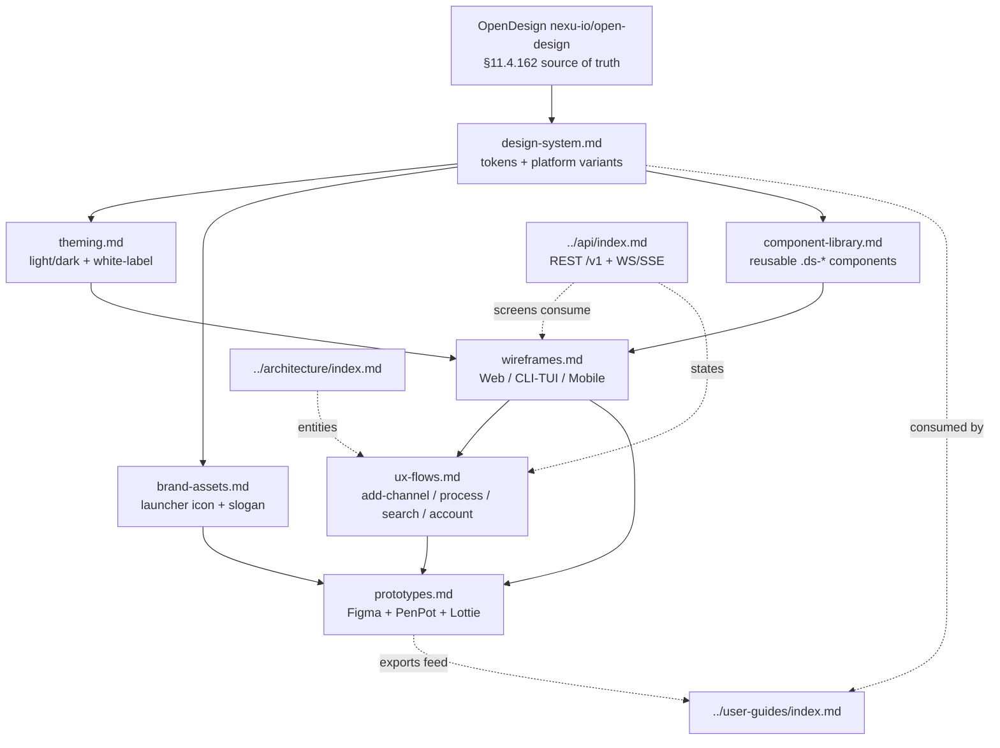

<!--
  Title           : Helix Thready — Design & UX Area (Index)
  Classification  : PUBLIC
  Location        : docs/public/research/mvp/design/index.md
  Status          : Draft — v0.1
  Revision        : 8 (2026-07-22)
  Author          : Helix Thready documentation swarm (design)
  Related         : ./design-system.md, ./brand-assets.md, ./theming.md,
                    ./wireframes.md, ./ux-flows.md, ./component-library.md,
                    ./prototypes.md, ./figma/README.md, ./library/README.md,
                    ./motion/README.md, ./opendesign/DESIGN.md, ./platforms/README.md,
                    ./screens/web/README.md,
                    ./screens/mobile/README.md, ./screens/desktop/README.md,
                    ./screens/tui/README.md, ./screens/marketing/README.md,
                    ./assets/icon-export-matrix.md, ./exports/README.md,
                    ../CONVENTIONS.md, ../index.md
-->

# Helix Thready — Design & UX Area (Index)

| Rev | Date | Author | Change |
|-----|------|--------|--------|
| 1 | 2026-07-21 | swarm (design) | Initial complete draft: design system, brand assets, theming, wireframes, UX flows, component library, prototypes |
| 2 | 2026-07-21 | swarm (design · review) | Second-pass review: fixed cross-link anchors (numbered to match target ToCs), noted `account_branding` reconciliation with canonical `accounts.branding` JSONB, tracked `challenges` scenario bank + delegated-branding open items |
| 3 | 2026-07-22 | swarm (design · Pass 3) | Depth pass to implementation-ready: re-verified all `design_system` token/component/adapter names at source (`gh vasic-digital/design_system`); deepened wireframes (per-screen validation/state tables, CLI flags/exit-codes, **verified** TUI keymap + Lipgloss bindings from `helix_track/llms_verifier/.../tui`, per-platform mobile map); expanded UX flows (+messenger sign-in, +reprocess diagrams); completed component per-platform variant matrix + 6 more contracts + state-lifecycle diagram; finalized brand-assets geometry + concrete platform manifests + slogan-placement matrix; added shipped-theme precedents. 4 new diagrams. |
| 4 | 2026-07-22 | swarm (design · critic pass) | Completeness/consistency pass: made the index the **canonical registry** — completed the [Open items](#open-items) list (was 4 of 14; now all `THREADY-DES-01…-14`) and added the [Workable-items registry](#workable-items-registry) (was scattered across files; now consolidated with owning gap + file). Brought `prototypes.md` to area depth (Pass 3): corrected the **unverified "first-party Figma plugin"** claim to an assumption + source-confirmed Figma-Variables fallback; added the interactive-prototype traceability matrix + prototype runtime-evidence gate. |
| 5 | 2026-07-22 | swarm (design · figma) | Added the **[figma/](./figma/README.md)** import kit to the catalogue: the canonical token set as Figma Variables JSON (`Thready / Color` Light+Dark incl. `ds-heart` alias + `Thready / Structure`), the 8-page `figma-file-plan.md` blueprint of the "Thready — Design Library" file, and the two materialization paths (Figma MCP `use_figma` Plugin API with OAuth vs manual `components-sheet.svg` + variables import). No Figma file exists yet — its creation is tracked as `[OPEN: THREADY-DES-FIG-01]` in the kit. |
| 6 | 2026-07-22 | swarm (design · package critic) | Wired the **rendered/executable design package** into this registry: the [`opendesign/`](./opendesign/DESIGN.md) OpenDesign brand contract + `tokens.css`, the [`screens/`](./screens/web/README.md) rendered HTML surfaces (web incl. interactive [`index.html`](./screens/web/index.html), mobile, desktop, TUI, marketing), the [`library/`](./library/README.md) living component page, the [`motion/`](./motion/README.md) Lottie set, and the [`exports/`](./exports/README.md) PNG/PDF/PenPot/Figma-IR bundle — see the new [Rendered design package](#rendered-design-package-on-disk) section. Package sign-off recorded in [DESIGN_PACKAGE_REPORT.md](./DESIGN_PACKAGE_REPORT.md). |
| 6 | 2026-07-22 | swarm (design · index) | Consolidation after the multi-agent design expansion: **subdirectory catalogue completed** — [Files in this area](#files-in-this-area) now lists every subdirectory (`library/`, `motion/`, `opendesign/`, `screens/{web,mobile,desktop,tui,marketing}/`, `assets/`, `diagrams/`, `exports/`) alongside the 7 area docs and the `figma/` kit — and the **canonical open-items registry rebuilt**: re-verified against the tree by grep (`OPEN: THREADY-…`) and expanded from `THREADY-DES-01…-14` to all **41 registered IDs** across nine families (`-15…-17`, `-LIB-01…04`, `-SCR-01…04`, `-SCR-MOB-01…03`, `-TUI-01/02`, `-MKT-01/02`, `-OD-01…03`, `-FIG-01…03`, `THREADY-MOT-01…03`). `THREADY-DES-OD-03` (link `opendesign/` from this index) is **closed by this very change**; `THREADY-MOT-03` recorded in its narrowed (2026-07-22) state per [motion.md §8](./motion/motion.md#8-gaps--open-items). |
| 7 | 2026-07-22 | swarm (design · platforms) | Added the **[platforms/](./platforms/README.md)** per-platform customization specs closing the adversarial-review finding ("adequate-but-scattered Android/iOS, THIN HarmonyOS/Aurora, MISSING typography substitution"): `typography-substitution.md` (bundling feasibility, honest fallback stacks, TUI monospace-only reality, Cyrillic discipline, dynamic-type mapping of the token ramp), dedicated `harmonyos.md` + `aurora.md` design contracts (both clients remain skeletons `[GAP: 8.5]`), and `react-token-rebind.md` (remediation contract for `THREADY-DES-LIB-01`/`[GAP: 8.6]`). Registry extended with the new **`THREADY-DES-PLAT-01…-08`** family (41 → **49** registered IDs, ten families). |
| 8 | 2026-07-22 | swarm (design · index) | **PenPot materialization evidence registered** (Constitution §11.4.220 pivot): the [`exports/`](./exports/README.md) catalogue row now carries the `exports/penpot/` verification bundles — `verification/` (7 hydrate screenshots + `rpc-verification.json` + `hydration-log.jsonl`), `verification/prototypes/` (6 screenshots + `rpc-interactions.json`; click-through navigation **PROVEN** via before/after view-mode captures — 15 interactions across files 03+04, flows `web-primary`/`mobile-primary`, reprocess honestly unwirable), `verification-independent/`, `import-manifest.json`, `flow-map.json`, the proven `tokens.penpot-import.json`, `png-derived/`. Registry deltas: `THREADY-DES-FIG-01` **re-scoped** (optional operator-triggered Figma-cloud import; blueprint proven via PenPot), `THREADY-DES-FIG-03` **closed** (`screens/mobile/channels.html` + PenPot file *04* frames), `THREADY-DES-02` **advanced** (PenPot half exercised 2026-07-22: 71/74 via the natively generated projection), `THREADY-DES-LIB-04` summary aligned to its narrowed state, `THREADY-DES-13` annotated (§11.4.220 ruling). [tokens-bridge/](./tokens-bridge/README.md) catalogue row corrected to **eight** targets (`generated/penpot/tokens.penpot-import.json`; `web/tokens.json` = pure DTCG, **not** the PenPot import file; `--check` 40/40). Totals re-verified by grep: 49 IDs — **46 open / 3 closed**. |

This is the canonical entry point for the **Design & UX** documentation of Helix Thready. It
specifies the design system (derived from **OpenDesign** and the shared in‑house
`vasic-digital/design_system`), the **Thready** brand theme derived from `assets/Logo.png`, the
launcher‑icon and slogan brand assets, per‑account theming / white‑labeling, wireframes for every
client surface, the key UX journeys, the reusable component library, and the interactive /
non‑interactive prototype plans. Beyond the specification documents, the area now also carries its
**concrete artifacts** — the living design library, the screen‑design sets for every surface
(web, mobile, desktop, TUI, marketing), the motion package, the OpenDesign brand contract, the
Figma import kit, the icon‑export masters + tooling, and the rendered export package — all
catalogued in [Files in this area](#files-in-this-area). All authors follow
**[../CONVENTIONS.md](../CONVENTIONS.md)**.

## Table of contents

- [Scope](#scope)
- [Files in this area](#files-in-this-area)
- [Rendered design package (on disk)](#rendered-design-package-on-disk)
- [Upstream / Downstream dependencies](#upstream--downstream-dependencies)
- [Area dependency map](#area-dependency-map)
- [Sources of truth](#sources-of-truth)
- [Verified vs. assumption ledger](#verified-vs-assumption-ledger)
- [Gap‑register items owned by this area](#gap-register-items-owned-by-this-area)
- [Workable-items registry](#workable-items-registry)
- [Open items](#open-items)
- [Conventions applied](#conventions-applied)

## Scope

The Design & UX area covers, per the operator request (§Design, §Frontends, §Branding) and the
decision matrix `[CONSTITUTION §11.4.162/190]`:

1. The **design system** derived from OpenDesign (`nexu-io/open-design`) and the shared
   `vasic-digital/design_system` (helix‑green base), with a Thready theme derived from
   `Logo.png`, **light + dark**, and per‑platform variants (Angular/CSS, React, KMP/Compose,
   Flutter/Qt, TUI/Lipgloss).
2. The **brand assets** spec — a launcher icon with **no letters** that incorporates the Helix
   spiral element, light/dark, vector + all OS export sizes; and the footer slogan
   **"Made with ♥ by Helix Development"**.
3. **Theming / white‑labeling** per account (Root‑configurable colors, logo, slogan).
4. **Wireframes** (Markdown + Mermaid) for the Web portal, CLI/TUI, and mobile.
5. **UX flow diagrams** for the key journeys: add channel, process post, search, manage account.
6. The **reusable component library**.
7. **Prototype plans** — interactive + non‑interactive (Figma + PenPot + Lottie exports).

The area is **Phase 3 (Client Applications)** in the four‑phase plan, and — per the operator's
**Web + CLI first** decision `[OPERATOR]` — the Angular 19 web portal and the CLI/TUI surfaces are
specified to implementation depth first; Desktop (Tauri), and the four mobile platforms are
specified to design depth with their scaffold gaps tracked.

## Files in this area

| File | Purpose |
|------|---------|
| [design-system.md](./design-system.md) | Token architecture (core + Thready theme), platform fan‑out, typography, spacing, motion, a11y contract, visual‑regression testing |
| [brand-assets.md](./brand-assets.md) | Launcher icon spec (spiral/Helix element, no letters), light/dark, vector + OS export size matrix; Helix Development org logo; the "Made with ♥" footer slogan |
| [theming.md](./theming.md) | Light/dark resolution (3 sanctioned mechanisms), per‑account white‑labeling model, DDL for `account_branding`, runtime CSS‑var injection, brand‑on‑generated‑documents |
| [wireframes.md](./wireframes.md) | Screen inventory + wireframes for Web portal, CLI/TUI, and mobile, each as Mermaid + prose |
| [ux-flows.md](./ux-flows.md) | The four key journeys as flow/sequence diagrams with states, errors, and event hooks |
| [component-library.md](./component-library.md) | The `.ds-*` component catalogue, per‑platform adapters, props/anatomy/states, and the build‑order backlog |
| [prototypes.md](./prototypes.md) | Figma authoring plan, interactive vs. non‑interactive prototypes, transition/motion spec, and the export pipeline (Figma/PenPot/PDF/PNG/SVG/Lottie) |
| [figma/](./figma/README.md) | **Figma import kit**: `figma-variables.json` (the full token set as Figma Variables — `Thready / Color` Light+Dark + `Thready / Structure`), `figma-file-plan.md` (8‑page blueprint of the "Thready — Design Library" file, executable via the Figma MCP `use_figma` Plugin API or manual import). The blueprint is **proven — executed against PenPot** per `[CONSTITUTION §11.4.220]` (kit Rev 2 disposition; evidence `exports/penpot/verification/`); the Figma file itself is now only the *optional, operator-triggered* cloud import `[OPEN: THREADY-DES-FIG-01 — re-scoped]`, with `figma-variables.json` still the valid payload for that path |
| [library/](./library/README.md) | **Design library artifacts**: `components.html` (the living component library — 14 groups, ~38 components, ≈118 state cells, each auditable in light + dark), `components-sheet.svg` (importable one‑sheet overview), `platform-map.md` (36 components × 8 platforms reusability matrix with per‑cell VERIFIED / PROPOSED / ASSUMED markers) |
| [motion/](./motion/README.md) | **Motion package (Lottie catalogue)**: six hand‑authored vector Lottie animations + five static reduced‑motion fallback SVGs, `motion.md` (motion spec + honest validation record), `motion-manifest.json` (runtime manifest v2 with per‑animation `reducedMotionFallback`), self‑contained `preview.html` (vendored lottie‑web, zero network) |
| [opendesign/](./opendesign/DESIGN.md) | **OpenDesign brand contract**: `DESIGN.md` (the Thready contract in the verified 9‑section OpenDesign schema, Lens A/B compliant), `tokens.css` (its machine‑readable twin — compiled CSS custom properties, light + dark, per the OpenDesign token schema), `TOOLING.md` (honest tooling capability check: daemon/CLI probes, headless‑vs‑operator matrix, exact Figma import flow) |
| [platforms/](./platforms/README.md) | **Per-platform customization specs** (deviation contracts, complementing `library/platform-map.md` which maps components and `screens/*/README.md` which carry per-screen chrome): `typography-substitution.md` (per-platform font strategy — bundling feasibility, honest fallback stacks, TUI monospace-only reality, Cyrillic discipline, dynamic-type mapping), `harmonyos.md` + `aurora.md` (dedicated ArkTS / Qt-Silica design contracts; clients are skeletons `[GAP: 8.5]`), `react-token-rebind.md` (remediation contract for `THREADY-DES-LIB-01`/`[GAP: 8.6]`); mints `THREADY-DES-PLAT-01…-08` |
| [tokens-bridge/](./tokens-bridge/README.md) | **Token-bridge codegen** (the generator design-system §7 / platform-map §6 referenced but which did not exist): `generate.mjs` (no-deps Node) parses `opendesign/tokens.css` — the single source — and deterministically emits the **eight** per-platform bindings, each `GENERATED — DO NOT EDIT` with the source sha256 (one deliberate exception — the PenPot target, README §9): W3C DTCG `web/tokens.json` (the **pure W3C DTCG canonical** — **NOT the PenPot import file**: its top-level `$description` flips PenPot 2.17 into single-set mode `[VERIFIED 2026-07-22]`, README §9), PenPot 2.17 import projection `generated/penpot/tokens.penpot-import.json` (multi-set + `$themes`, byte-identical to the file that actually imported; 71/74 land — `duration`/`cubicBezier` silently dropped by PenPot 2.17), Compose `ThreadyColors.kt`, SwiftUI `ThreadyTokens.swift`, ArkTS `thready_tokens.ets`, QML `ThreadyTokens.qml` singleton, Lipgloss `thready_palette.go` (locked to `screens/tui/lipgloss-theme.md §2` incl. its ASSUMED ANSI picks; `go vet`/`go build` verified), Flutter `thready_tokens.dart`; `--check` is the CI drift gate (byte-diff + hex round-trip + PenPot quirk guards — **40/40 PASS** 2026-07-22). Bindings are delivery-ready **contracts** — consumer-repo wiring stays open (`[OPEN: THREADY-DES-LIB-04]` narrowed: generator DONE, wiring OPEN) |
| [screens/web/](./screens/web/README.md) | **Web portal screen designs**: 13 self‑contained OpenDesign‑style HTML screens + the interactive prototype shell (`index.html`) walking the four ux‑flows journeys; per‑screen state contracts, light + dark, realistic Thready data |
| [screens/mobile/](./screens/mobile/README.md) | **Mobile screen designs**: 11 device‑framed 390×844 artifacts (Android/iOS chrome toggle, HarmonyOS/Aurora port notes) covering every node of the wireframes §6 IA, plus the derived notifications centre (`[OPEN: THREADY-DES-15]`) |
| [screens/desktop/](./screens/desktop/README.md) | **Desktop (Tauri 2) shell design**: `desktop-shell.html` (per‑OS title bar, menus, tray/notification/file‑drop mocks) + the desktop‑differences catalogue; scope beyond the wrapped web UI stays `[OPEN: THREADY-DES-08]` |
| [screens/tui/](./screens/tui/README.md) | **TUI screen designs**: `tui-screens.html` (ten 80‑column Bubble Tea/Lipgloss terminal mockups covering the full wireframes §5 state machine, Login through Skills) + `lipgloss-theme.md` (normative token → `lipgloss.Color` mapping, truecolor → ANSI‑256 → ANSI‑16) |
| [screens/marketing/](./screens/marketing/README.md) | **Marketing site (Angular 22) designs**: 3 pages (`landing` / `features` / `download`) built to the web‑set construction pattern, with a full claims‑traceability register; minimal‑viable scope recorded honestly (`[OPEN: THREADY-DES-MKT-01/-02]`) |
| [assets/](./assets/icon-export-matrix.md) | **Brand asset masters + export tooling**: the 7 SVG masters (`launcher-icon` + `-light`/`-dark`/`-mono`, `logo-mark`, `logo-full`, `footer-slogan`), `icon-export-matrix.md` (exact per‑platform pixel/format matrix, all OS surfaces) and `generate-raster.sh` (its 1:1 implementation — verified live run, 83 real rasters) |
| [diagrams/](./diagrams/) | Mermaid sources (`.mmd`) + rendered SVGs for the area's diagrams — 17 source/render pairs (area map, token fan‑out, journey flows, IA/navigation, export pipelines, component lifecycle) per `[CONVENTIONS §4]` |
| [exports/](./exports/README.md) | **Design export package** (capstone): screen PNG renders light + dark at 2× (49 on disk), the 54‑page `design-book.pdf`, and the PenPot + Figma hand‑off bundles (editable vectors, screen rasters, genuine `.od-figma.json` IR captures, `IMPORT.md` guides), built by `scripts/` (`render-cdp.mjs` / `build-book.mjs` / `capture-figma.mjs`). Rendered before the marketing / +4‑mobile / TUI‑expansion wave — regeneration is a downstream Docs Chain pass. **PenPot materialization evidence (2026‑07‑22, §11.4.220):** `exports/penpot/` additionally carries `verification/` (7 `hydrate-01…07.png` screenshots + `rpc-verification.json` + `hydration-log.jsonl`), `verification/prototypes/` (6 screenshots + `rpc-interactions.json` — click‑through prototype navigation **PROVEN** via before/after view‑mode captures), `verification-independent/` (independent RPC snapshots `files.json`/`snapshots.jsonl` + dashboard/file screenshots), `import-manifest.json`, `flow-map.json`, the proven `tokens.penpot-import.json` (operator‑derived; generated twin in `tokens-bridge/generated/penpot/`), and `png-derived/`. Interactions: **15 wired** across files *03 Screens — Web* (12) + *04 Screens — Mobile* (3), 2 named flows (`web-primary`, `mobile-primary`); the reprocess journey is honestly **unwirable** at board level (single‑screen self‑loop — recorded in `flow-map.json`, not wired) |

## Rendered design package (on disk)

Beyond the specification `.md` documents above, the area ships a **rendered, executable design
package** — the concrete deliverables the operator mandates require. The full audit and sign‑off is
in **[DESIGN_PACKAGE_REPORT.md](./DESIGN_PACKAGE_REPORT.md)**; this table is the at‑a‑glance manifest
(counts **VERIFIED** on disk 2026‑07‑22).

| Deliverable | Where | Count / form (VERIFIED) |
|-------------|-------|--------------------------|
| OpenDesign brand contract | [`opendesign/`](./opendesign/DESIGN.md) | `DESIGN.md` (9‑section contract) + `tokens.css` (light + dark) + `TOOLING.md` |
| Rendered screens | [`screens/`](./screens/web/README.md) | 30 self‑contained HTML — web 13 + interactive `index.html`, mobile 11, desktop 1, TUI 1, marketing 3 |
| Interactive prototype | [`screens/web/index.html`](./screens/web/index.html) | Journey‑walking shell embedding the live screens (0 broken sibling links) |
| Living component library | [`library/`](./library/README.md) | `components.html` (all states × light/dark) + `components-sheet.svg` + `platform-map.md` (×8 platforms) |
| Motion (Lottie) | [`motion/`](./motion/README.md) | 6 Lottie `.json` (all parse, bodymovin v5.7.4) + 5 static fallbacks + `preview.html` (vendored, zero‑network) |
| Brand assets + tooling | [`assets/`](./assets/icon-export-matrix.md) | 7 SVG masters (launcher icon: **0 letters**, helix element; footer slogan) + export matrix + `generate-raster.sh` |
| Diagrams | [`diagrams/`](./diagrams/) | 17 `.mmd` + rendered `.svg` pairs |
| Export bundle | [`exports/`](./exports/README.md) | 49 PNG (light+dark, 2×) · `design-book.pdf` (54 pp) · PenPot (16 SVG + 22 PNG) · Figma **28** genuine `.od-figma.json` IR (11 291 nodes) · **PenPot materialization verification** (`exports/penpot/verification*` — hydrate + prototype + independent RPC evidence; 15 wired interactions, 2 flows) |

**Non‑interactive prototype** = the PNG render set + the PDF design book + the PenPot/Figma
hand‑off bundles under `exports/`. **Cloud hand‑off is operator‑only** (no Figma/PenPot token in
this environment; the OD Figma‑import plugin pins `networkAccess:none`) — see the report's
operator‑action list.

## Upstream / Downstream dependencies

**Upstream (this area consumes / must not contradict):**

- `docs/private/research/mvp/helix_thready_research_request_final.md` — decision matrix
  (`design system source = OpenDesign`, `Frontend = Angular 19/22 on design_system`,
  `Desktop = Tauri 2`, `Mobile = native+KMP`, `TUI = Bubble Tea + Lipgloss`), operator decisions
  (Web+CLI first, aggressive SLO), Q17–Q20, Q26, §8.3 white‑labeling.
- `docs/private/research/mvp/helix_thready_subsystem_gaps_and_improvements.md` — the design‑arm
  gaps (`design_system` foundation, `helix_design`/`helix_ui` scaffolds, KMP UI scaffolds,
  VisualRegression family no‑CI). Every one is addressed below or tracked.
- In‑house **`vasic-digital/design_system`** — the real token/component/adapter source
  (read at source via `gh`; interfaces reproduced verbatim where load‑bearing).
- **`nexu-io/open-design`** — the design‑system generation daemon `[CONSTITUTION §11.4.162]`.
- [../architecture/index.md](../architecture/index.md) — entities (accounts, channels, posts,
  assets, processing state) and event model that the screens and flows visualize.
- [../api/index.md](../api/index.md) — the REST `/v1` + WebSocket/SSE contract every screen binds
  to; UX flows reference specific endpoints/events.

**Downstream (consumes this area):**

- [../user-guides/index.md](../user-guides/index.md) — screenshots, illustrations and the
  component vocabulary used in manuals and tutorials.
- [../testing/index.md](../testing/index.md) — UI/UX test types, visual‑regression banks, a11y
  gates derive from the component states and flow acceptance criteria specified here.
- The implementation repos (Angular web/desktop clients, native mobile clients, TUI) consume the
  tokens, components and flows verbatim.

## Area dependency map

> Rendered PNG/SVG exported via Docs Chain (§11.4.65). Source: `diagrams/design-area-map.mmd`.

**Explanation (for readers/models that cannot see the diagram).** OpenDesign is the upstream
source of truth for the whole area; it (and the shared `design_system` extracted from it) feeds
`design-system.md`, which defines the token architecture. From the design system three siblings
branch: `theming.md` (light/dark + per‑account white‑labeling), `brand-assets.md` (the launcher
icon and the "Made with ♥" slogan), and `component-library.md` (the reusable `.ds-*` components).
Theming and the component library together feed `wireframes.md` (the concrete screens for Web,
CLI/TUI and Mobile). Wireframes feed `ux-flows.md` (the four key journeys) and, together with the
brand assets, feed `prototypes.md` (the Figma/PenPot/Lottie deliverables). The dotted edges show
the cross‑area couplings: the API area supplies the endpoints and events that the wireframes
render and the flows drive; the architecture area supplies the entities the flows manipulate; and
downstream, the design system and the prototype exports are consumed by the user‑guides area.

## Sources of truth

| Source | Used for | Confidence |
|--------|----------|------------|
| `vasic-digital/design_system` (`tokens/`, `components/`, `docs/THEMES.md`) | Real token values, `.ds-*` components, Angular `ThemeService`/`I18nService`/`FooterComponent`, WCAG evidence | VERIFIED (read at source via `gh`) |
| `assets/Logo.png` | Thready brand mark + theme derivation, launcher‑icon element | VERIFIED (inspected) |
| `helix_track/web_client/open-design.config.json` | Product‑client OpenDesign config precedent (`primary #BCE63B`, `secondary #7AA590`) | VERIFIED (local clone) |
| `nexu-io/open-design` (`apps/daemon/src/brands/engine/export.ts`, README) | OpenDesign export surface (tokens.json / theme.json / CSS / PPTX / PDF); release 0.13.0 | VERIFIED (read at source) |
| Decision matrix §0.2, Q17–Q20, Q26; §8.3 | Framework choices, design‑tool choices, white‑labeling | AUTHORITATIVE |

## Verified vs. assumption ledger

- **VERIFIED:** The `design_system` token names, exact hex values, `.ds-*` component classes, and
  the Angular adapters (`ThemeService`, `I18nService`, `ThemeToggleComponent`,
  `LanguagePickerComponent`, `FooterComponent`, `DS_CONFIG`/`DS_LOCALES`/`DS_DICTIONARY`) are
  reproduced from source — **re‑verified at source via `gh` in Pass 3**. The helix‑green brand
  `#B6E376`, light accent `#446E12` (6.03:1 on white), and dark accent `#B6E376` (13.56:1 on
  `#020817`) are measured, not invented; the two sibling shipped themes (`vasic-red` accent 6.47/7.23,
  `helix-ota-blue`) are likewise measured. The footer heart is tinted with the verified `--accent-ink`
  token via the localized `footer.made`/`a11y.love`/`footer.by` keys. The **TUI** Bubble Tea/Lipgloss
  pattern and its keymap are verified against real source (`helix_track/llms_verifier/…/tui`).
- **ASSUMPTION / `[DEFAULT — adjustable]`:** The exact launcher‑icon geometry (now pinned to a
  numeric spec in [brand-assets §3.1](./brand-assets.md#31-numeric-geometry-spec) but pending the
  OpenDesign authoring pass), motion durations beyond the two shipped tokens, the Thready composite
  public API names, and every wireframe layout are proposed defaults pending operator/team review.
  (The **Thready secondary teal** is no longer an assumption — it is now the eyedrop‑captured
  `#ABDDC9`, see THREADY‑DES‑01 below.)
- **SCAFFOLD (do not claim it works):** `helix_design` (non‑web design arm) and `helix_ui`
  (Flutter) are scaffolds; `UI-Components-KMP` and the KMP fleet have no CI/publish; the
  VisualRegression family has no CI. These are tracked below and in the relevant files.

## Gap‑register items owned by this area

Each is addressed with a design plan and/or a tracked workable item in the linked file.

| Gap (register id) | Status | Where addressed |
|-------------------|--------|-----------------|
| `[GAP: 8.1 design_system]` foundation, web‑only, needs Thready theme + npm publish | FOUNDATION | [design-system.md](./design-system.md), [theming.md](./theming.md), [brand-assets.md](./brand-assets.md) |
| `[GAP: 8.2 helix_design]` non‑web token packages don't exist (Flutter/Qt/CSS) | SCAFFOLD | [design-system.md](./design-system.md#7-per-platform-fan-out) |
| `[GAP: 8.3 helix_ui]` Flutter UI scaffold; cannot target HarmonyOS/Aurora | SCAFFOLD | [design-system.md](./design-system.md), [component-library.md](./component-library.md) |
| `[GAP: 8.4 UI-Components-KMP]` KMP UI scaffold, no CI/publish | SCAFFOLD | [component-library.md](./component-library.md) |
| `[GAP: 8.5 helix_shims / HarmonyOS+Aurora clients]` native clients skeleton | SCAFFOLD | [wireframes.md](./wireframes.md#6-mobile-wireframes), [component-library.md](./component-library.md) |
| `[GAP: 8.6 TS libs / helix_track_cli]` re‑audit before adoption | SCAFFOLD/FLAGGED | [component-library.md](./component-library.md) |
| `[GAP: 9.3 VisualRegression family]` Panoptic/ScreenDiff/ReplayBuffer no CI + Thready `challenges` banks | FOUNDATION | [design-system.md](./design-system.md#8-visual-regression--a11y-testing), [component-library.md](./component-library.md) |
| `[GAP: 7.3 Security-KMP]` mobile secure storage stub (gates mobile release) | SCAFFOLD | [wireframes.md](./wireframes.md#6-mobile-wireframes) (release gate note) |

## Workable-items registry

The concrete build/hardening tasks this area defines, consolidated (they were previously only inline
in each file). Each closes one or more gap‑register items and is ordered by the **Web + CLI first**
priority `[OPERATOR]`. IDs are stable and referenced verbatim by the owning files.

| Workable item | What it delivers | Closes | Defined in |
|---------------|------------------|--------|------------|
| **THREADY‑DES‑DS‑01** | Add `tokens/themes/thready.css` + Thready `DS_CONFIG` upstream; publish `@vasic-digital/design-system` to npm; mature the standalone package | `[GAP: 8.1]` | [design-system §9](./design-system.md#9-gaps-addressed--tracked-workable-items), [theming §11](./theming.md#11-gaps--open-items), [brand-assets §11](./brand-assets.md#11-gaps--open-items) |
| **THREADY‑DES‑WEB‑01** | Angular composite set (§5) on the published primitives (git dep until npm) | `[GAP: 8.1]` | [component-library §10](./component-library.md#10-build-backlog--gaps) |
| **THREADY‑DES‑TUI‑01** | Lipgloss component styles from the token export (verified pattern) | — (pattern verified) | [component-library §10](./component-library.md#10-build-backlog--gaps) |
| **THREADY‑DES‑VR‑01** | CI for the visual‑regression family (`ScreenDiff`/`VisualRegression`/`ReplayBuffer`) + wire the theme×state bank | `[GAP: 9.3]` (half 1) | [design-system §9](./design-system.md#9-gaps-addressed--tracked-workable-items), [component-library §10](./component-library.md#10-build-backlog--gaps), [prototypes §11](./prototypes.md#11-gaps--open-items) |
| **THREADY‑DES‑CHAL‑01** | Thready UI/UX **Challenges** scenario banks (mandated test type) | `[GAP: 9.3]` (half 2) | [design-system §9](./design-system.md#9-gaps-addressed--tracked-workable-items), [component-library §9](./component-library.md#9-testing-the-library) |
| **THREADY‑DES‑KMP‑01** | `UI-Components-KMP` CI + Maven publish + token‑bridge codegen | `[GAP: 8.4]` | [design-system §9](./design-system.md#9-gaps-addressed--tracked-workable-items), [component-library §10](./component-library.md#10-build-backlog--gaps) |
| **THREADY‑DES‑FLUT‑01 / ‑QT‑01** | `helix_design` per‑platform token packages (Flutter, Qt/Aurora); native ArkTS/Qt via `helix_shims` | `[GAP: 8.2/8.3/8.5]` | [design-system §9](./design-system.md#9-gaps-addressed--tracked-workable-items), [component-library §10](./component-library.md#10-build-backlog--gaps) |
| **THREADY‑DES‑REACT‑01** | `UI-Components-React` re‑audit + adoption (only if a React surface is needed) | `[GAP: 8.6]` | [component-library §10](./component-library.md#10-build-backlog--gaps) |
| **THREADY‑DES‑EXPORT‑01** | Build/validate the **PenPot** + **Lottie** export bridges (not native OpenDesign targets) | `[OPEN: THREADY-DES-02]` | [prototypes §11](./prototypes.md#11-gaps--open-items) |

## Open items

The full, canonical open‑item registry for this area — **49 registered IDs** across ten families:
the core `THREADY-DES-01…-17` plus the per‑directory families minted by the artifact waves
(`-LIB`, `-SCR`, `-SCR-MOB`, `-TUI`, `-MKT`, `-OD`, `-FIG`, `-PLAT`, and `THREADY-MOT`). Each is
tracked in its owning file; this registry is the single place to see them all and their state.
Re‑verified against the tree on 2026‑07‑22 (rev 8) by grepping `OPEN: THREADY-…` / `CLOSED:
THREADY-…` over `design/`: every ID below exists at its owning file, and no ID exists in the
tree that is absent below (49 unique IDs both ways; `THREADY-MOT-03`'s marker carries a
`— narrowed` suffix). **State summary: 46 open (two narrowed — `THREADY-MOT-03`,
`THREADY-DES-LIB-04`; `THREADY-DES-FIG-01` re‑scoped, `THREADY-DES-02` advanced), 3 closed
(`THREADY-DES-01`, `THREADY-DES-OD-03`, `THREADY-DES-FIG-03`).**

### Core area items (`THREADY-DES-01…-17`)

| ID | State | Summary | Owning file(s) |
|----|-------|---------|----------------|
| **THREADY-DES-01** | `CLOSED` | `--brand-2` teal captured via formal `Logo.png` eyedrop (`#ABDDC9` light / `#B7EBD6` dark), replacing the `#7AA590` stand‑in | [design-system §3.2](./design-system.md#32-the-thready-brand-theme), [brand-assets §11](./brand-assets.md#11-gaps--open-items) |
| **THREADY-DES-02** | `OPEN` *(advanced 2026‑07‑22)* | PenPot + Lottie are **not** native OpenDesign export targets — bridges must be built (`THREADY‑DES‑EXPORT‑01`). **The PenPot half was exercised 2026‑07‑22:** tokens imported into PenPot 2.17 via the natively generated projection [`tokens-bridge/generated/penpot/tokens.penpot-import.json`](./tokens-bridge/README.md#9-verified-consumer-quirks-penpot-217) — **71/74 land** (PenPot 2.17 silently drops `duration`/`cubicBezier`). Remaining: re‑validation on future PenPot versions (+ retiring the operator‑derived `exports/penpot/tokens.penpot-import.json` in favour of the generated target) and the **Lottie / illustration half** | [tokens-bridge §8/§9](./tokens-bridge/README.md#8-open-items), [prototypes.md](./prototypes.md#11-gaps--open-items), [design-system §10](./design-system.md#10-open-items) |
| **THREADY-DES-03** | `OPEN` | Heart‑glyph "proper color": brand accent‑ink (current default) vs. classic love‑red | [brand-assets §8](./brand-assets.md#8-the-footer-slogan--heart-glyph), [design-system §3.2](./design-system.md#32-the-thready-brand-theme) |
| **THREADY-DES-04** | `OPEN` | Verify Cyrillic subsets of the three variable faces for ru / sr‑Cyrl | [design-system §4](./design-system.md#4-typography), [component-library §11](./component-library.md#11-open-items), [prototypes §11](./prototypes.md#11-gaps--open-items) |
| **THREADY-DES-05** | `OPEN` `[RESEARCH]` | Aurora density buckets (86/108/128/172/250) must be verified against current Aurora OS packaging docs | [brand-assets §5.1](./brand-assets.md#51-concrete-platform-manifests) |
| **THREADY-DES-06** | `OPEN` | Whether Account Admins (tier 2), not only Root, may edit their own Account branding | [theming §11](./theming.md#11-gaps--open-items), [ux-flows §5](./ux-flows.md#5-manage-account) |
| **THREADY-DES-07** | `OPEN` | Advanced neutral‑surface override (beyond accent) needs a full AA re‑validation matrix before exposure | [theming §11](./theming.md#11-gaps--open-items) |
| **THREADY-DES-08** | `OPEN` | Confirm whether Desktop (Tauri) needs any native screen beyond the wrapped web UI (tray/notifications) | [wireframes §7](./wireframes.md#7-gaps--open-items) |
| **THREADY-DES-09** | `OPEN` | High‑fidelity Figma frames for every wireframe screen (produced in prototypes; wireframes are the structural contract) | [wireframes §7](./wireframes.md#7-gaps--open-items), [prototypes.md](./prototypes.md) |
| **THREADY-DES-10** | `OPEN` | Finalize endpoint/event names with the API area (UX‑flow names are `[DEFAULT — adjustable]`) | [ux-flows §7](./ux-flows.md#7-gaps--open-items) |
| **THREADY-DES-11** | `OPEN` | Finalize Thready composite public API names with the web implementation team | [component-library §11](./component-library.md#11-open-items) |
| **THREADY-DES-12** | `OPEN` | Decide which composites are generic enough to contribute upstream to `design_system` vs. keep in Thready | [component-library §11](./component-library.md#11-open-items) |
| **THREADY-DES-13** | `OPEN` *(ruled — annotation registry‑only)* | Decide PenPot's role: mirror of Figma (portability only) vs. a co‑equal editing surface — **ruled by Constitution §11.4.220**: self‑hosted **PenPot is the primary design platform** (consumed via the PenPot submodule); Figma is an optional import/export target, never source of truth. The owning file [prototypes §11](./prototypes.md#11-gaps--open-items) predates the ruling and does not yet cite §11.4.220 — annotation kept here only; the prototypes.md update is a Docs‑Chain/owner pass (staleness noted) | [prototypes §11](./prototypes.md#11-gaps--open-items) |
| **THREADY-DES-14** | `OPEN` | Branding model reconciliation (storage **and** contract) with the canonical database + API areas | [theming §5/§7/§11](./theming.md#11-gaps--open-items), below |
| **THREADY-DES-15** | `OPEN` | Mobile **notifications centre**: confirm whether mobile ships a dedicated notifications surface (+ push delivery preferences) — the wireframes §6 IA has none; `notifications.html` is a derived proposal over the verified event contract | [screens/mobile/README §4](./screens/mobile/README.md#4-open-items) |
| **THREADY-DES-16** | `OPEN` | **Local media‑file ingest** (desktop file‑drop case 2): decide whether a local upload path into the Asset Service exists at all; no upload UI is designed until it does | [screens/desktop/README §3.4/§4](./screens/desktop/README.md#4-open-items) |
| **THREADY-DES-17** | `OPEN` | **ANSI degradation decisions** for the TUI palette: pinned `CompleteColor` vs automatic, border‑glyph color, optional light‑terminal adaptive palette | [screens/tui/README §4](./screens/tui/README.md#4-open-items), [lipgloss-theme §8](./screens/tui/lipgloss-theme.md#8-open-items) |

### Design library (`THREADY-DES-LIB-*`) — [library/](./library/README.md)

| ID | State | Summary | Owning file(s) |
|----|-------|---------|----------------|
| **THREADY-DES-LIB-01** | `OPEN` | Re‑audit the React column component‑by‑component (`[GAP: 8.6]`): confirm each verified file implements the library's states before any React surface consumes it | [platform-map §6](./library/platform-map.md#6-open-items) |
| **THREADY-DES-LIB-02** | `OPEN` | iOS host decision: KMP/Compose (current plan, SwiftUI column moot) vs. a `[BUILD-NEW]` SwiftUI package — none exists or is named in the decision matrix | [platform-map §6](./library/platform-map.md#6-open-items) |
| **THREADY-DES-LIB-03** | `OPEN` | `helix_shims` ArkTS/Qt interface not inspected (`[GAP: 8.5]`); the HarmonyOS/Aurora cells need re‑verification once the shim contracts exist | [platform-map §6](./library/platform-map.md#6-open-items) |
| **THREADY-DES-LIB-04** | `OPEN` *(narrowed 2026‑07‑22)* | Token‑bridge codegen: **generator DONE** — [`tokens-bridge/`](./tokens-bridge/README.md) exists in‑repo and emits all eight targets with the `--check` drift gate (40/40); **consumer wiring OPEN** — nothing consumes the bindings yet (THREADY‑DES‑KMP‑01 / ‑FLUT‑01 / ‑TUI‑01; compiler verification of the structural‑only targets lands with the wiring). platform‑map §6's "does not exist yet" wording predates the generator | [tokens-bridge §6](./tokens-bridge/README.md#6-closure-state-of-thready-des-lib-04), [platform-map §6](./library/platform-map.md#6-open-items), [component-library §10](./component-library.md#10-build-backlog--gaps) |

### Web screens (`THREADY-DES-SCR-*`) — [screens/web/](./screens/web/README.md)

| ID | State | Summary | Owning file(s) |
|----|-------|---------|----------------|
| **THREADY-DES-SCR-01** | `OPEN` | **Billing pricing**: plan tiers beyond "Pro", unit prices, included quotas and grace‑period policy are undefined; `billing.html` ships the layout contract with placeholder amounts | [screens/web/README §6](./screens/web/README.md#6-open-items) |
| **THREADY-DES-SCR-02** | `OPEN` | **Research doc versioning**: diff/history between successive research generations after a reprocess is unspecified; the viewer shows latest + a "stale" state only | [screens/web/README §6](./screens/web/README.md#6-open-items) |
| **THREADY-DES-SCR-03** | `OPEN` | **Events retention**: history depth / queryable window for the events monitor beyond the live tail is unspecified | [screens/web/README §6](./screens/web/README.md#6-open-items) |
| **THREADY-DES-SCR-04** | `OPEN` | **Forgot‑password flow**: referenced by wireframes §3.2 but never specified; `login.html` links it with an inline note, no fake flow is designed | [screens/web/README §6](./screens/web/README.md#6-open-items) |

### Mobile screens (`THREADY-DES-SCR-MOB-*`) — [screens/mobile/](./screens/mobile/README.md)

| ID | State | Summary | Owning file(s) |
|----|-------|---------|----------------|
| **THREADY-DES-SCR-MOB-01** | `OPEN` | Unread **"N new" pills** on Channels rows are a `[DEFAULT — adjustable]` proposal (derived from `post.received`); confirm whether mobile shows unread counts at all, and the reset rule | [screens/mobile/README §4](./screens/mobile/README.md#4-open-items) |
| **THREADY-DES-SCR-MOB-02** | `OPEN` | Media viewer **Share / Save‑to‑device**: no ground‑truth export path exists (§3.8 "re‑download" is server‑side); both actions specified disabled until product resolves it — coupled to `THREADY-DES-16` | [screens/mobile/README §4](./screens/mobile/README.md#4-open-items) |
| **THREADY-DES-SCR-MOB-03** | `OPEN` | **WhatsApp as a third Add‑Channel source**: requested but absent from the verified source set (Telegram/Max); rendered as a disabled tile until the decision matrix adds an adapter | [screens/mobile/README §4](./screens/mobile/README.md#4-open-items) |

### TUI screens (`THREADY-DES-TUI-*`) — [screens/tui/](./screens/tui/README.md)

| ID | State | Summary | Owning file(s) |
|----|-------|---------|----------------|
| **THREADY-DES-TUI-01** | `OPEN` | **Inline asset preview** (screen 9): terminal image rendering is protocol‑dependent (kitty / iTerm2 / sixel); decide pixels‑where‑possible vs. metadata + open/stream everywhere — mockup ships the honest metadata‑only stub | [screens/tui/README §4](./screens/tui/README.md#4-open-items) |
| **THREADY-DES-TUI-02** | `OPEN` | **TUI sign‑in method** (screen 6): ground truth pins the scoped‑token path (`THREADY_TOKEN`/keychain); confirm whether the proposed interactive device‑code frame ships or the TUI stays token‑only | [screens/tui/README §4](./screens/tui/README.md#4-open-items) |

### Marketing site (`THREADY-DES-MKT-*`) — [screens/marketing/](./screens/marketing/README.md)

| ID | State | Summary | Owning file(s) |
|----|-------|---------|----------------|
| **THREADY-DES-MKT-01** | `OPEN` | **Final marketing IA / copy sign‑off**: page set, information architecture and every headline/body string are `[DEFAULT — adjustable]`; explicitly includes whether any self‑host claim is ever made | [screens/marketing/README §7](./screens/marketing/README.md#7-open-items) |
| **THREADY-DES-MKT-02** | `OPEN` | **SEO / analytics / legal pages scope**: meta/OG/sitemap/robots for the SSG site, analytics (or its deliberate absence), privacy/terms/imprint, store‑listing legal footprint | [screens/marketing/README §7](./screens/marketing/README.md#7-open-items) |

### OpenDesign contract (`THREADY-DES-OD-*`) — [opendesign/](./opendesign/DESIGN.md)

| ID | State | Summary | Owning file(s) |
|----|-------|---------|----------------|
| **THREADY-DES-OD-01** | `OPEN` | On vendoring into `open-design/design-systems/thready/`: register the C‑extension tokens (`--brand`, `--brand-2`, `--brand-ink`, `--border-strong`, `--ds-heart`, `--theme-id`) in `BRAND_EXTENSIONS["thready"]` + author the v1 `manifest.json` | [TOOLING §7](./opendesign/TOOLING.md#7-open-items) |
| **THREADY-DES-OD-02** | `OPEN` | Dark‑mode blocks in `tokens.css` exceed the single‑mode bundled precedent; confirm the 0.14.1 guard accepts the extra selectors, or split light/dark via the derive pipeline | [TOOLING §7](./opendesign/TOOLING.md#7-open-items) |
| **THREADY-DES-OD-03** | `CLOSED` | Link `opendesign/` from this index — **closed by this revision (rev 6)**: `opendesign/` (`DESIGN.md` · `tokens.css` · `TOOLING.md`) now appears in [Files in this area](#files-in-this-area) | [TOOLING §7](./opendesign/TOOLING.md#7-open-items) |

### Figma kit (`THREADY-DES-FIG-*`) — [figma/](./figma/README.md)

| ID | State | Summary | Owning file(s) |
|----|-------|---------|----------------|
| **THREADY-DES-FIG-01** | `OPEN` *(re‑scoped 2026‑07‑22)* | **Optional, operator‑triggered Figma‑cloud import** (path A: MCP `use_figma` Plugin API, or path B: manual import) — was *"create the actual Figma file… until then no Figma artifact exists"*. The blueprint itself is **proven via the PenPot materialization** per `[CONSTITUTION §11.4.220]` (evidence `exports/penpot/verification/`); `figma-variables.json` remains the valid, unchanged payload for this optional path; a dependency of nothing | [figma/README](./figma/README.md#open-items) |
| **THREADY-DES-FIG-02** | `OPEN` | Variables import mechanism: Enterprise REST bulk endpoint vs. Plugin‑API replay vs. import plugin — only relevant if `FIG-01`'s optional import is exercised | [figma/README](./figma/README.md#open-items) |
| **THREADY-DES-FIG-03** | `CLOSED` | `mobile/channels-list` mid‑fi HTML source now exists: [`screens/mobile/channels.html`](./screens/mobile/channels.html) (mobile catalogue Rev 2, 2026‑07‑22; re‑verified on disk); the `mobile/channels` frame is materialized light + dark in PenPot file *04 Screens — Mobile* `[VERIFIED — exports/penpot/verification/rpc-verification.json]`. (`figma-file-plan.md` keeps its verbatim in‑body `[OPEN: …]` blueprint markers by design — closure is recorded in the kit's Rev 2 disposition) | [figma/README](./figma/README.md#open-items) |

### Motion package (`THREADY-MOT-*`) — [motion/](./motion/README.md)

| ID | State | Summary | Owning file(s) |
|----|-------|---------|----------------|
| **THREADY-MOT-01** | `OPEN` | Verify all six Lottie files in `lottie-compose` and `lottie-ios` before mobile ships them (only `lottie-web`/jsdom + headless Chromium are verified) | [motion.md §8](./motion/motion.md#8-gaps--open-items) |
| **THREADY-MOT-02** | `OPEN` | Light‑theme strategy: load‑time color remap vs. shipping generated `-light` variants; wire the white‑label remap into the branding‑editor preview | [motion.md §8](./motion/motion.md#8-gaps--open-items) |
| **THREADY-MOT-03** | `OPEN` *(narrowed 2026‑07‑22)* | Asset half **closed** — the five static `reducedMotionFallback` SVGs are delivered, keyframe‑derived, manifest v2‑named. Remaining, narrowed: (a) independent design review / pixel A‑B of the statics against the frozen Lottie frames on a physical display; (b) the `empty-channels.svg` fallback — blocked on the `THREADY-DES-02` illustration‑grade set, delivered with it | [motion.md §8](./motion/motion.md#8-gaps--open-items) |

### Platform customization (`THREADY-DES-PLAT-*`) — [platforms/](./platforms/README.md)

| ID | State | Summary | Owning file(s) |
|----|-------|---------|----------------|
| **THREADY-DES-PLAT-01** | `OPEN` | **Font bundling decision** per platform (Android/iOS/HarmonyOS/Aurora): bundle the three brand faces vs. ship system fallback stacks (fallback‑first is the shipping default); includes per‑face license/redistribution verification for app bundles and the variable‑vs‑static‑instances choice | [platforms/typography-substitution §7](./platforms/typography-substitution.md#7-open-items) |
| **THREADY-DES-PLAT-02** | `OPEN` | **Fallback‑stack Cyrillic** (ru / sr‑Cyrl) coverage verification per OS face (Roboto, SF Pro, HarmonyOS Sans, Aurora system default) — companion to the inherited `THREADY-DES-04` (brand‑face subsets, still open) | [platforms/typography-substitution §7](./platforms/typography-substitution.md#7-open-items) |
| **THREADY-DES-PLAT-03** | `OPEN` | **ArkUI API verification** of every derived HarmonyOS mapping (Navigation/Tabs, `bindSheet`, `WaterFlow`, `AVSession`, `promptAction`, `font.registerFont`, Barrier‑Free attributes, safe areas, back‑at‑tab‑root rule) against the SDK/HIG + the `helix_shims` contract | [platforms/harmonyos §11](./platforms/harmonyos.md#11-open-items) |
| **THREADY-DES-PLAT-04** | `OPEN` | **HarmonyOS motion runtime**: no Lottie player is named in ground truth (motion §6 lists web/compose/ios only); verify `@ohos/lottie` or commit to the ArkUI‑animation + poster‑frame floor | [platforms/harmonyos §11](./platforms/harmonyos.md#11-open-items) |
| **THREADY-DES-PLAT-05** | `OPEN` | **Silica/Qt API verification** of every derived Aurora mapping (PageStack, pulley, remorse timer, `SilicaListView`/`SilicaGridView`/`SearchField`, Qt Multimedia, ambience‑read API, `Theme` units, screen‑reader maturity, hardware back key) | [platforms/aurora §10](./platforms/aurora.md#10-open-items) |
| **THREADY-DES-PLAT-06** | `OPEN` | **Aurora motion runtime**: no Lottie player named in ground truth; evaluate rlottie‑based QML players vs. the Qt‑native animation + poster‑frame floor | [platforms/aurora §10](./platforms/aurora.md#10-open-items) |
| **THREADY-DES-PLAT-07** | `OPEN` | **Ambience‑vs‑token policy**: ratify the proposed arbitration (tokens win for load‑bearing UI + semantics; ambience tints decorative layers only; explicit theme choice wins) with AA evidence over real ambiences | [platforms/aurora §10](./platforms/aurora.md#10-open-items) |
| **THREADY-DES-PLAT-08** | `OPEN` | **Dynamic‑type clamp matrix**: per platform, the maximum OS font scale and evidence every screen survives 200 % scale against the token ramp without truncating load‑bearing text | [platforms/typography-substitution §7](./platforms/typography-substitution.md#7-open-items) |

Detail on the two highest‑impact opens:

- `[CLOSED: THREADY-DES-01]` Formal eyedrop mean of `assets/Logo.png` captured (pixel‑mean per the
  `design_system` provenance rule §11.4.6): the Thready secondary/teal `--brand-2` = **`#ABDDC9`**
  (light, mean of n=618,886 mint‑region pixels) / `#B7EBD6` (dark, median), replacing the provisional
  `#7AA590` stand‑in. The green‑region eyedrop (`#BAE448`, n≈1.06M) corroborates the documented
  helix‑green base, validating the method. Re‑confirm with the design‑system's own eyedrop tool at
  integration. Method: [design-system §3.2](./design-system.md#32-the-thready-brand-theme).
- `[OPEN: THREADY-DES-14]` Branding model reconciliation (storage **and** contract). **Storage:** the
  authoritative database area models branding as `accounts.branding` **JSONB**
  (`{colors, logo_url, slogan}`), while [theming.md §5](./theming.md#5-data-model-ddl) proposes a
  normalized, AA‑audited `account_branding` table — reconcile with
  [../database/index.md](../database/index.md). **Contract:** `api/openapi.yaml` already defines
  `setBranding` with a minimal `Branding` (`primary_color/logo_asset_id/slogan`), while
  [theming.md §7](./theming.md#7-api-surface) proposes an expanded contract (typed light/dark accents
  + `422` AA gate) — merge into [../api/index.md](../api/index.md), do not maintain in parallel. The
  design area MUST NOT diverge from the canonical schema/contract.

## Conventions applied

Every file in this area carries the mandatory metadata header, a revision‑history table, a ToC,
inline provenance tags (`[CONSTITUTION §x]`, `[IN-HOUSE: module]`, `[RESEARCH]`, `[OPERATOR]`,
`[DEFAULT — adjustable]`, `[BUILD-NEW]`, `[GAP: id]`, `[OPEN: id]`), and — for every Mermaid
diagram — a multi‑paragraph prose explanation plus a sibling `diagrams/<name>.mmd` source
`[CONVENTIONS §4]`. Code examples are given in CSS / TypeScript / Go / SQL / YAML.

---

*Made with love ♥ by Helix Development.*
