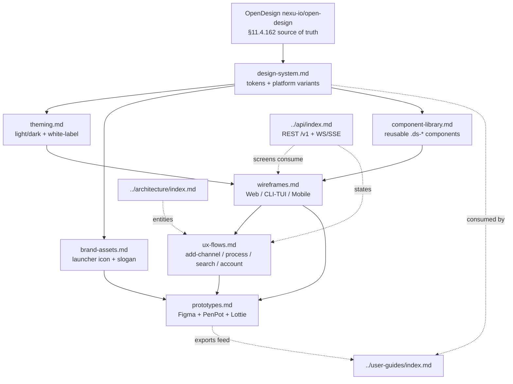

<!--
  Title           : Helix Thready — Design & UX Area (Index)
  Classification  : PUBLIC
  Location        : docs/public/research/mvp/design/index.md
  Status          : Draft — v0.1
  Revision        : 1 (2026-07-21)
  Author          : Helix Thready documentation swarm (design)
  Related         : ./design-system.md, ./brand-assets.md, ./theming.md,
                    ./wireframes.md, ./ux-flows.md, ./component-library.md,
                    ./prototypes.md, ../CONVENTIONS.md, ../index.md
-->

# Helix Thready — Design & UX Area (Index)

| Rev | Date | Author | Change |
|-----|------|--------|--------|
| 1 | 2026-07-21 | swarm (design) | Initial complete draft: design system, brand assets, theming, wireframes, UX flows, component library, prototypes |
| 2 | 2026-07-21 | swarm (design · review) | Second-pass review: fixed cross-link anchors (numbered to match target ToCs), noted `account_branding` reconciliation with canonical `accounts.branding` JSONB, tracked `challenges` scenario bank + delegated-branding open items |

This is the canonical entry point for the **Design & UX** documentation of Helix Thready. It
specifies the design system (derived from **OpenDesign** and the shared in‑house
`vasic-digital/design_system`), the **Thready** brand theme derived from `assets/Logo.png`, the
launcher‑icon and slogan brand assets, per‑account theming / white‑labeling, wireframes for every
client surface, the key UX journeys, the reusable component library, and the interactive /
non‑interactive prototype plans. All authors follow **[../CONVENTIONS.md](../CONVENTIONS.md)**.

## Table of contents

- [Scope](#scope)
- [Files in this area](#files-in-this-area)
- [Upstream / Downstream dependencies](#upstream--downstream-dependencies)
- [Area dependency map](#area-dependency-map)
- [Sources of truth](#sources-of-truth)
- [Verified vs. assumption ledger](#verified-vs-assumption-ledger)
- [Gap‑register items owned by this area](#gap-register-items-owned-by-this-area)
- [Open items](#open-items)
- [Conventions applied](#conventions-applied)

## Scope

The Design & UX area covers, per the operator request (§Design, §Frontends, §Branding) and the
decision matrix `[CONSTITUTION §11.4.162/190]`:

1. The **design system** derived from OpenDesign (`nexu-io/open-design`) and the shared
   `vasic-digital/design_system` (helix‑green base), with a Thready theme derived from
   `Logo.png`, **light + dark**, and per‑platform variants (Angular/CSS, React, KMP/Compose,
   Flutter/Qt, TUI/Lipgloss).
2. The **brand assets** spec — a launcher icon with **no letters** that incorporates the Helix
   spiral element, light/dark, vector + all OS export sizes; and the footer slogan
   **"Made with ♥ by Helix Development"**.
3. **Theming / white‑labeling** per account (Root‑configurable colors, logo, slogan).
4. **Wireframes** (Markdown + Mermaid) for the Web portal, CLI/TUI, and mobile.
5. **UX flow diagrams** for the key journeys: add channel, process post, search, manage account.
6. The **reusable component library**.
7. **Prototype plans** — interactive + non‑interactive (Figma + PenPot + Lottie exports).

The area is **Phase 3 (Client Applications)** in the four‑phase plan, and — per the operator's
**Web + CLI first** decision `[OPERATOR]` — the Angular 19 web portal and the CLI/TUI surfaces are
specified to implementation depth first; Desktop (Tauri), and the four mobile platforms are
specified to design depth with their scaffold gaps tracked.

## Files in this area

| File | Purpose |
|------|---------|
| [design-system.md](./design-system.md) | Token architecture (core + Thready theme), platform fan‑out, typography, spacing, motion, a11y contract, visual‑regression testing |
| [brand-assets.md](./brand-assets.md) | Launcher icon spec (spiral/Helix element, no letters), light/dark, vector + OS export size matrix; Helix Development org logo; the "Made with ♥" footer slogan |
| [theming.md](./theming.md) | Light/dark resolution (3 sanctioned mechanisms), per‑account white‑labeling model, DDL for `account_branding`, runtime CSS‑var injection, brand‑on‑generated‑documents |
| [wireframes.md](./wireframes.md) | Screen inventory + wireframes for Web portal, CLI/TUI, and mobile, each as Mermaid + prose |
| [ux-flows.md](./ux-flows.md) | The four key journeys as flow/sequence diagrams with states, errors, and event hooks |
| [component-library.md](./component-library.md) | The `.ds-*` component catalogue, per‑platform adapters, props/anatomy/states, and the build‑order backlog |
| [prototypes.md](./prototypes.md) | Figma authoring plan, interactive vs. non‑interactive prototypes, transition/motion spec, and the export pipeline (Figma/PenPot/PDF/PNG/SVG/Lottie) |

## Upstream / Downstream dependencies

**Upstream (this area consumes / must not contradict):**

- `docs/private/research/mvp/helix_thready_research_request_final.md` — decision matrix
  (`design system source = OpenDesign`, `Frontend = Angular 19/22 on design_system`,
  `Desktop = Tauri 2`, `Mobile = native+KMP`, `TUI = Bubble Tea + Lipgloss`), operator decisions
  (Web+CLI first, aggressive SLO), Q17–Q20, Q26, §8.3 white‑labeling.
- `docs/private/research/mvp/helix_thready_subsystem_gaps_and_improvements.md` — the design‑arm
  gaps (`design_system` foundation, `helix_design`/`helix_ui` scaffolds, KMP UI scaffolds,
  VisualRegression family no‑CI). Every one is addressed below or tracked.
- In‑house **`vasic-digital/design_system`** — the real token/component/adapter source
  (read at source via `gh`; interfaces reproduced verbatim where load‑bearing).
- **`nexu-io/open-design`** — the design‑system generation daemon `[CONSTITUTION §11.4.162]`.
- [../architecture/index.md](../architecture/index.md) — entities (accounts, channels, posts,
  assets, processing state) and event model that the screens and flows visualize.
- [../api/index.md](../api/index.md) — the REST `/v1` + WebSocket/SSE contract every screen binds
  to; UX flows reference specific endpoints/events.

**Downstream (consumes this area):**

- [../user-guides/index.md](../user-guides/index.md) — screenshots, illustrations and the
  component vocabulary used in manuals and tutorials.
- [../testing/index.md](../testing/index.md) — UI/UX test types, visual‑regression banks, a11y
  gates derive from the component states and flow acceptance criteria specified here.
- The implementation repos (Angular web/desktop clients, native mobile clients, TUI) consume the
  tokens, components and flows verbatim.

## Area dependency map

> Rendered PNG/SVG exported via Docs Chain (§11.4.65). Source: `diagrams/design-area-map.mmd`.

**Explanation (for readers/models that cannot see the diagram).** OpenDesign is the upstream
source of truth for the whole area; it (and the shared `design_system` extracted from it) feeds
`design-system.md`, which defines the token architecture. From the design system three siblings
branch: `theming.md` (light/dark + per‑account white‑labeling), `brand-assets.md` (the launcher
icon and the "Made with ♥" slogan), and `component-library.md` (the reusable `.ds-*` components).
Theming and the component library together feed `wireframes.md` (the concrete screens for Web,
CLI/TUI and Mobile). Wireframes feed `ux-flows.md` (the four key journeys) and, together with the
brand assets, feed `prototypes.md` (the Figma/PenPot/Lottie deliverables). The dotted edges show
the cross‑area couplings: the API area supplies the endpoints and events that the wireframes
render and the flows drive; the architecture area supplies the entities the flows manipulate; and
downstream, the design system and the prototype exports are consumed by the user‑guides area.

## Sources of truth

| Source | Used for | Confidence |
|--------|----------|------------|
| `vasic-digital/design_system` (`tokens/`, `components/`, `docs/THEMES.md`) | Real token values, `.ds-*` components, Angular `ThemeService`/`I18nService`/`FooterComponent`, WCAG evidence | VERIFIED (read at source via `gh`) |
| `assets/Logo.png` | Thready brand mark + theme derivation, launcher‑icon element | VERIFIED (inspected) |
| `helix_track/web_client/open-design.config.json` | Product‑client OpenDesign config precedent (`primary #BCE63B`, `secondary #7AA590`) | VERIFIED (local clone) |
| `nexu-io/open-design` (`apps/daemon/src/brands/engine/export.ts`, README) | OpenDesign export surface (tokens.json / theme.json / CSS / PPTX / PDF); release 0.13.0 | VERIFIED (read at source) |
| Decision matrix §0.2, Q17–Q20, Q26; §8.3 | Framework choices, design‑tool choices, white‑labeling | AUTHORITATIVE |

## Verified vs. assumption ledger

- **VERIFIED:** The `design_system` token names, exact hex values, `.ds-*` component classes, and
  the three Angular adapters (`ThemeService`, `I18nService`, `FooterComponent`) are reproduced
  from source. The helix‑green brand `#B6E376`, light accent `#446E12` (6.03:1 on white), and dark
  accent `#B6E376` (13.56:1 on `#020817`) are measured, not invented.
- **ASSUMPTION / `[DEFAULT — adjustable]`:** The **Thready secondary teal** hex, the exact
  launcher‑icon geometry, motion durations beyond the two shipped tokens, and every wireframe
  layout are proposed defaults pending operator review and a formal Logo.png eyedrop capture.
- **SCAFFOLD (do not claim it works):** `helix_design` (non‑web design arm) and `helix_ui`
  (Flutter) are scaffolds; `UI-Components-KMP` and the KMP fleet have no CI/publish; the
  VisualRegression family has no CI. These are tracked below and in the relevant files.

## Gap‑register items owned by this area

Each is addressed with a design plan and/or a tracked workable item in the linked file.

| Gap (register id) | Status | Where addressed |
|-------------------|--------|-----------------|
| `[GAP: 8.1 design_system]` foundation, web‑only, needs Thready theme + npm publish | FOUNDATION | [design-system.md](./design-system.md), [theming.md](./theming.md), [brand-assets.md](./brand-assets.md) |
| `[GAP: 8.2 helix_design]` non‑web token packages don't exist (Flutter/Qt/CSS) | SCAFFOLD | [design-system.md](./design-system.md#7-per-platform-fan-out) |
| `[GAP: 8.3 helix_ui]` Flutter UI scaffold; cannot target HarmonyOS/Aurora | SCAFFOLD | [design-system.md](./design-system.md), [component-library.md](./component-library.md) |
| `[GAP: 8.4 UI-Components-KMP]` KMP UI scaffold, no CI/publish | SCAFFOLD | [component-library.md](./component-library.md) |
| `[GAP: 8.5 helix_shims / HarmonyOS+Aurora clients]` native clients skeleton | SCAFFOLD | [wireframes.md](./wireframes.md#6-mobile-wireframes), [component-library.md](./component-library.md) |
| `[GAP: 8.6 TS libs / helix_track_cli]` re‑audit before adoption | SCAFFOLD/FLAGGED | [component-library.md](./component-library.md) |
| `[GAP: 9.3 VisualRegression family]` Panoptic/ScreenDiff/ReplayBuffer no CI + Thready `challenges` banks | FOUNDATION | [design-system.md](./design-system.md#8-visual-regression--a11y-testing), [component-library.md](./component-library.md) |
| `[GAP: 7.3 Security-KMP]` mobile secure storage stub (gates mobile release) | SCAFFOLD | [wireframes.md](./wireframes.md#6-mobile-wireframes) (release gate note) |

## Open items

- `[OPEN: THREADY-DES-01]` Capture the formal eyedrop mean of `assets/Logo.png` (pixel‑mean per
  the `design_system` provenance rule §11.4.6) to fix the Thready secondary/teal token; until
  then the secondary uses the in‑house `helix_track` precedent `#7AA590` as a provisional value.
- `[OPEN: THREADY-DES-02]` PenPot and Lottie are **not** native OpenDesign export targets — a
  bridge/export step must be built (see [prototypes.md](./prototypes.md)).
- `[OPEN: THREADY-DES-03]` The heart‑glyph "proper color" is set to the brand accent by the
  in‑house footer precedent; confirm whether the operator wants a classic love‑red instead.
- `[OPEN: THREADY-DES-14]` Branding model reconciliation (storage **and** contract). **Storage:** the
  authoritative database area models branding as `accounts.branding` **JSONB**
  (`{colors, logo_url, slogan}`), while [theming.md §5](./theming.md#5-data-model-ddl) proposes a
  normalized, AA‑audited `account_branding` table — reconcile with
  [../database/index.md](../database/index.md). **Contract:** `api/openapi.yaml` already defines
  `setBranding` with a minimal `Branding` (`primary_color/logo_asset_id/slogan`), while
  [theming.md §7](./theming.md#7-api-surface) proposes an expanded contract (typed light/dark accents
  + `422` AA gate) — merge into [../api/index.md](../api/index.md), do not maintain in parallel. The
  design area MUST NOT diverge from the canonical schema/contract.

## Conventions applied

Every file in this area carries the mandatory metadata header, a revision‑history table, a ToC,
inline provenance tags (`[CONSTITUTION §x]`, `[IN-HOUSE: module]`, `[RESEARCH]`, `[OPERATOR]`,
`[DEFAULT — adjustable]`, `[BUILD-NEW]`, `[GAP: id]`, `[OPEN: id]`), and — for every Mermaid
diagram — a multi‑paragraph prose explanation plus a sibling `diagrams/<name>.mmd` source
`[CONVENTIONS §4]`. Code examples are given in CSS / TypeScript / Go / SQL / YAML.

---

*Made with love ♥ by Helix Development.*
