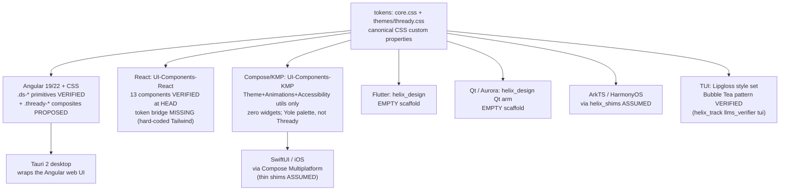

<!--
  Title           : Helix Thready — Component Reusability Platform Map
  Classification  : PUBLIC
  Location        : docs/public/research/mvp/design/library/platform-map.md
  Status          : Draft — v0.1
  Revision        : 1 (2026-07-22)
  Author          : Helix Thready documentation swarm (design)
  Related         : ./README.md, ./components.html, ./components-sheet.svg,
                    ../component-library.md, ../design-system.md, ../theming.md,
                    ../../CONVENTIONS.md
-->

# Helix Thready — Component Reusability Platform Map

| Rev | Date | Author | Change |
|-----|------|--------|--------|
| 1 | 2026-07-22 | swarm (design) | Initial matrix: every library component × 8 platform realizations; `.ds-*` names re-verified at source via `gh` (design_system, UI-Components-React, UI-Components-KMP, helix_design trees fetched 2026-07-22); per-component customization notes; VERIFIED/ASSUMED discipline |
| 2 | 2026-07-22 | swarm (design · library) | Second verification pass (`gh`, file contents): React `Button.tsx` styling confirmed **not token-bound** (hard-coded Tailwind palette); KMP `Theme.kt` confirmed branded for another product (Yole, Material-red) — both recorded in §2; platform fan-out diagram added (§2.1 + `diagrams/platform-fanout.mmd`) |
| 3 | 2026-07-22 | swarm (design · review-fixes) | Consistency fixes from the adversarial platform review: §5 Angular enumeration corrected — `brand-mark` removed from the row list (it is a VERIFIED upstream class but has **no row** in the §3 matrix; noted as a brand asset instead), so the enumeration now matches the "10 of 36" count exactly; §3 legend gains an explicit note that Desktop (Tauri 2) is folded into the NG column (with pointer to `screens/desktop/README.md`), making the "8 platforms" definition unambiguous |

## Table of contents

- [1. Scope & verification method](#1-scope--verification-method)
- [2. Per-repo verification results](#2-per-repo-verification-results)
  - [2.1 Platform fan-out (diagram)](#21-platform-fan-out-diagram)
- [3. The matrix](#3-the-matrix)
- [4. Per-component platform customization notes](#4-per-component-platform-customization-notes)
- [5. Verified vs. assumed summary](#5-verified-vs-assumed-summary)
- [6. Open items](#6-open-items)

## 1. Scope & verification method

This map records, for every component in the living library
([components.html](./components.html)), how it is realized on each target platform of the
decision matrix: **Angular** (`.ds-*` from `vasic-digital/design_system`), **React**
(`UI-Components-React`), **Compose** (`UI-Components-KMP`), **Flutter** (`helix_design`),
**SwiftUI**, **ArkTS** (HarmonyOS), **Qt** (Aurora), and **TUI** (Bubble Tea + Lipgloss).

**Markers** (per CONVENTIONS §7 — no bluff):

- **VERIFIED** — the named class/file exists; checked on **2026-07-22** by fetching the repo
  tree/content via `gh api` (`vasic-digital/design_system`, `vasic-digital/UI-Components-React`,
  `vasic-digital/UI-Components-KMP`, `vasic-digital/helix_design`) or by reading the local clone
  (`helix_track/llms_verifier/llm-verifier/tui/*.go` imports `charmbracelet/lipgloss`).
- **PROPOSED** — a `[DEFAULT — adjustable]` name/realization this design area proposes
  (upstream-contribution candidate); the CSS exists **only** in `components.html`, not upstream.
- **ASSUMED** — the platform package (or the widget inside it) does not exist or could not be
  verified; the cell records the *intended* native mapping. Nothing in an ASSUMED cell may be
  claimed to work `[GAP: 8.2/8.3/8.4/8.5/8.6]`.

## 2. Per-repo verification results

| Repo / source | What was verified (2026-07-22) | Status |
|---|---|---|
| `vasic-digital/design_system` → `components/css/components.css` | Complete `.ds-*` set at HEAD (106 lines): `.ds-container`, `.ds-section`, `.ds-btn` (+`--primary/--secondary/--ghost`, `:hover/:active/:focus-visible`, reduced-motion), `.ds-card` (+`--raised`), `.ds-input`, `.ds-link`, `.ds-nav` (+`__links/__link`, `aria-current`), `.ds-footer`, `.ds-badge` (+`--success/--warn/--danger`), `.ds-brand-mark` | **VERIFIED** — production-usable web foundation `[GAP: 8.1]` |
| `vasic-digital/design_system` → `components/angular/*` | `theme.service.ts`, `i18n.service.ts`, `theme-toggle.component.ts`, `language-picker.component.ts`, `ds.config.ts` present at HEAD | **VERIFIED** |
| `vasic-digital/UI-Components-React` → `src/components/*` | Component files at HEAD: `Avatar`, `Badge`, `Button`, `Card`, `EmptyState`, `ErrorBoundary`, `Input`, `LoadingSpinner`, `Progress`, `Select`, `Switch`, `Tabs`, `Textarea` (`.tsx`, each with a test). `Button.tsx` **content** inspected: variants `primary\|secondary\|outline\|ghost\|destructive`, sizes `sm\|md\|lg`, a `loading` spinner prop — but `variantClasses` hard-codes a Tailwind palette (`bg-blue-600`, gray neutrals, `focus-visible:ring-blue-500`); **no design-system token is referenced** | **VERIFIED files; VERIFIED not token-bound** — the package is `SCAFFOLD/FLAGGED` `[GAP: 8.6]`: the blocking work is the token bridge (re-bind variants to `tailwind-v4.css` / `var(--accent)`, map `destructive → --danger`), then re-audit |
| `vasic-digital/UI-Components-KMP` → `src/commonMain/kotlin/digital/vasic/uicomponents/*` | Only `Theme.kt`, `Animations.kt`, `Accessibility.kt` (+ tests). **No widget components exist.** `Theme.kt` **content** inspected: `object YoleColors` with `BrandPrimary = Color(0xFFD32F2F)` (Material Red 700) — the palette belongs to **another product ("Yole")**, not Thready, and references no design-system token | **VERIFIED as utilities-only scaffold, foreign-branded** `[GAP: 8.4]` — every widget cell below is ASSUMED; a `ThreadyColors` token-bridge codegen must replace the hand-kept palette before any use |
| `vasic-digital/helix_design` | Tree at HEAD contains only `README.md`, agent config (`CLAUDE.md`, `AGENTS.md`, …), `upstreams/*.sh`. **No Flutter/Qt packages at all.** | **VERIFIED as empty scaffold** `[GAP: 8.2/8.3]` — every Flutter/Qt cell is ASSUMED |
| TUI pattern (local clone) | `helix_track/llms_verifier/llm-verifier/tui/{app.go,notifications.go}` import `charmbracelet/lipgloss`; `screens/` + `cmd/tui` exist | **VERIFIED pattern** — Thready styles themselves are PROPOSED (generated from the token export, design-system.md §7) |
| SwiftUI package | No in-house SwiftUI UI package is named in the decision matrix or found under `vasic-digital` | **ASSUMED** entire column `[OPEN: THREADY-DES-LIB-02]` |
| ArkTS / Qt (Aurora) | Only reachable via native clients + `helix_shims` per ground truth; `helix_shims` interface not inspected | **ASSUMED** entire columns `[GAP: 8.5]` |

### 2.1 Platform fan-out (diagram)

> Rendered PNG/SVG exported via Docs Chain (§11.4.65). Source: `diagrams/platform-fanout.mmd`
> (rendered sibling: `diagrams/platform-fanout.svg`).

**Explanation (for readers/models that cannot see the diagram).** A single node sits at the top:
the canonical token source, `tokens/core.css` plus `tokens/themes/thready.css` — the CSS custom
properties specified in [design-system.md §3](../design-system.md#3-token-architecture). Eight
arrows fan out of it, one per platform column of the matrix in §3. The **Angular/CSS** arrow is
the production-usable path: the verified `.ds-*` primitives plus the proposed `.thready-*`
composites; the **Tauri 2 desktop** node hangs off it because the desktop client wraps the same
Angular web UI and needs no separate component work. The **React** arrow points at
`UI-Components-React`, which really ships thirteen components but styles them with a hard-coded
Tailwind palette — its missing piece is the token bridge, not the components. The **Compose/KMP**
arrow points at `UI-Components-KMP`, which ships three utility files (theme, animations,
accessibility) branded for another product and no widgets; the **SwiftUI** node hangs off KMP
because the sanctioned iOS path is Compose Multiplatform (or thin SwiftUI shims), not a
hand-built SwiftUI kit. The **Flutter** and **Qt/Aurora** arrows point at `helix_design`, an
empty scaffold — both are plans, not code. The **ArkTS** arrow is the HarmonyOS path through
`helix_shims`, also a plan. The **TUI** arrow maps the token palette onto a Lipgloss style set
following the verified in-house Bubble Tea pattern. Because every arrow starts at the same token
file, a theme or white-label swap re-tints every platform without touching structure.

## 3. The matrix

Column legend — **NG**: Angular (Web/Desktop-Tauri, primary `[OPERATOR]`); **RE**: React
(`UI-Components-React`); **CM**: Compose Multiplatform (`UI-Components-KMP`); **FL**: Flutter
(`helix_design`); **SW**: SwiftUI; **AR**: ArkTS; **QT**: Qt/QML (Aurora); **TU**: TUI
(Bubble Tea + Lipgloss). Cell = realization + marker (✅ VERIFIED · ⭘ PROPOSED · △ ASSUMED).

> **Desktop (Tauri 2) is deliberately not a ninth column.** The desktop client wraps the Angular
> web UI (§2.1 fan-out; design-system.md §7), so it is folded into the **NG** column — "8 platforms"
> means exactly the eight columns NG/RE/CM/FL/SW/AR/QT/TU. Tauri readers should use the NG column
> plus the desktop-specific chrome notes in
> [../screens/desktop/README.md](../screens/desktop/README.md).

| Component | NG Angular `.ds-*` | RE React | CM Compose | FL Flutter | SW SwiftUI | AR ArkTS | QT Qt/QML | TU TUI |
|---|---|---|---|---|---|---|---|---|
| Container / section | `.ds-container`, `.ds-section` ✅ | layout div + tokens △ | `Column` + `ThreadySpacing` △ | `Padding`/`Container` △ | `VStack` + spacing △ | `Column` △ | `ColumnLayout` △ | Lipgloss `Width`/`Margin` ⭘ |
| Button primary/secondary/ghost | `.ds-btn` + `--primary/--secondary/--ghost` ✅ | `Button.tsx` ✅(file) `[GAP: 8.6]` | `Button`/`OutlinedButton`/`TextButton` △ | `FilledButton`/`OutlinedButton`/`TextButton` △ | `Button` + `.buttonStyle` △ | `Button` △ | `Button` + QML style △ | Lipgloss bold accent-bg style ⭘ (pattern ✅) |
| Button destructive | `.ds-btn--danger` ⭘ | `Button` variant prop △ | `Button(colors=error)` △ | `FilledButton` error colors △ | `Button(role: .destructive)` △ | `Button` warn style △ | `Button` danger palette △ | danger-fg style ⭘ |
| Button loading/disabled | `[disabled]` + `.ds-btn--loading` ⭘ | `Button` + `LoadingSpinner.tsx` ✅(files) | `enabled=false` + `CircularProgressIndicator` △ | `onPressed:null` + spinner △ | `.disabled()` + `ProgressView` △ | `enabled` + `LoadingProgress` △ | `enabled` + `BusyIndicator` △ | dim style + spinner frame ⭘ |
| Input (text) | `.ds-input` ✅ | `Input.tsx` / `Textarea.tsx` ✅(files) | `OutlinedTextField` △ | `TextField` + `InputDecoration` △ | `TextField` △ | `TextInput` △ | `TextField` △ | `textinput` bubble ⭘ (pattern ✅) |
| Select | `.ds-select` ⭘ | `Select.tsx` ✅(file) | `ExposedDropdownMenuBox` △ | `DropdownButtonFormField` △ | `Picker(.menu)` △ | `Select` △ | `ComboBox` △ | list picker ⭘ |
| Checkbox | `.ds-check` ⭘ | native + tokens △ | `Checkbox` △ | `Checkbox` △ | `Toggle(.checkbox)` (macOS) / custom △ | `Checkbox` △ | `CheckBox` △ | `[x]` glyph row ⭘ |
| Radio | `.ds-radio` ⭘ | native + tokens △ | `RadioButton` △ | `Radio` △ | `Picker(.inline)` △ | `Radio` △ | `RadioButton` △ | `(•)` glyph row ⭘ |
| Switch | `.ds-switch` ⭘ | `Switch.tsx` ✅(file) | `Switch` △ | `Switch.adaptive` △ | `Toggle` △ | `Toggle(Switch)` △ | `Switch` △ | `on/off` colored token ⭘ |
| Date | `.ds-input[type=date]` ⭘ | native + tokens △ | `DatePickerDialog` △ | `showDatePicker` △ | `DatePicker` △ | `DatePickerDialog` △ | `Calendar` popup △ | `YYYY-MM-DD` masked input ⭘ |
| Field (label/hint/error) | `.ds-field` scaffold ⭘ | wrapper + aria △ | `supportingText`/`isError` △ | `InputDecoration(errorText)` △ | `.overlay` hint text △ | form hint slot △ | label + error `Text` △ | inline `!` line ⭘ |
| Card | `.ds-card` + `--raised` ✅ | `Card.tsx` ✅(file) | `Card`/`ElevatedCard` △ | `Card` △ | `GroupBox`/custom container △ | `Column` + border △ | `Frame`/QML rect △ | bordered box ⭘ (pattern ✅) |
| Stat card (`thready-stat`) | composite on `.ds-card` ⭘ | composite on `Card` △ | composite △ | composite △ | composite △ | composite △ | composite △ | big-figure box ⭘ |
| Table (sortable/paginated) | `.ds-table` + `aria-sort` ⭘ | table + tokens △ | `LazyColumn` + header row △ | `PaginatedDataTable` △ | `Table` (macOS) / `List` △ | `List` + header △ | `TableView` △ | `bubbles/table` ⭘ |
| Badge (semantic) | `.ds-badge--success/warn/danger` ✅ (+`--neutral` ⭘) | `Badge.tsx` ✅(file) | tinted `Surface` chip △ | `Chip`/`Container` tint △ | `Text` + capsule bg △ | `Badge` △ | pill `Rectangle` △ | glyph `✓⚠⨯◷` + color ⭘ (pattern ✅) |
| Hashtag chip (direct/indirect) | `thready-tag` ⭘ | chip on `Badge` △ | `AssistChip` (brand vs outline) △ | `Chip` variants △ | capsule `Text` variants △ | `Chip` △ | pill + outline △ | `#tag` tinted span ⭘ |
| Processing chip (pending/processing/done/failed/retrying) | `thready-chip` (5 states) ⭘ | composite `Badge`+`LoadingSpinner` △ | chip + `CircularProgressIndicator` △ | chip + spinner △ | capsule + `ProgressView` △ | chip + progress △ | pill + `BusyIndicator` △ | glyph + spinner frames ⭘ |
| Topbar nav | `.ds-nav` + `__links/__link` ✅ | header + tokens △ | `TopAppBar` △ | `AppBar` △ | `NavigationStack` toolbar △ | `Navigation` title bar △ | `ToolBar` △ | header line ⭘ (pattern ✅) |
| Sidebar | `.ds-sidebar` ⭘ | nav list △ | `NavigationDrawer`/`NavigationRail` △ | `NavigationRail`/`Drawer` △ | `NavigationSplitView` sidebar △ | `SideBarContainer` △ | `Drawer` △ | left pane list ⭘ |
| Tabs | `.ds-tabs`/`.ds-tab` ⭘ | `Tabs.tsx` ✅(file) | `TabRow` △ | `TabBar` △ | `TabView`/`Picker(.segmented)` △ | `Tabs` △ | `TabBar` △ | numbered tab line ⭘ |
| Breadcrumbs | `.ds-breadcrumbs` ⭘ | ol + tokens △ | `Row` of text buttons △ | `Row` of `TextButton` △ | `HStack` links △ | text row △ | `Row` of links △ | `a › b › c` line ⭘ |
| Dialog / modal | `.ds-dialog` on `<dialog>` ⭘ | portal + tokens △ | `AlertDialog` △ | `showDialog`/`AlertDialog` △ | `.sheet`/`.alert` △ | `CustomDialog` △ | `Dialog` △ | centered overlay box ⭘ |
| Toast / alert | `thready-toast` + `.ds-alert` ⭘ | region + tokens △ | `Snackbar`/`SnackbarHost` △ | `SnackBar` △ | custom overlay / `.alert` △ | `promptAction.showToast` △ | overlay `Popup` △ | `notifications.go` pane ✅ (pattern) |
| Progress bar (det./indet./failed+retry) | `.ds-progress` ⭘ | `Progress.tsx` ✅(file) | `LinearProgressIndicator` △ | `LinearProgressIndicator` △ | `ProgressView(value:)` △ | `Progress` △ | `ProgressBar` △ | `▓▓░` bar + `[r]etry` ⭘ (pattern ✅) |
| Spinner (ring) | `.ds-spinner` ⭘ | `LoadingSpinner.tsx` ✅(file) | `CircularProgressIndicator` △ | `CircularProgressIndicator` △ | `ProgressView()` △ | `LoadingProgress` △ | `BusyIndicator` △ | `bubbles/spinner` frames ⭘ |
| Helix-motif spinner | inline SVG (2 strands + rungs) ⭘ | same SVG component △ | `Canvas` bezier strands △ | `CustomPainter` △ | `Canvas`/`Path` shape △ | `Canvas` drawing △ | QML `Canvas`/`Shape` △ | braille/ASCII helix frames `⠋⠙⠸…` ⭘ |
| Avatar (sizes/status/group) | `.ds-avatar` ⭘ | `Avatar.tsx` ✅(file) | `Box` circle + initials △ | `CircleAvatar` △ | `Circle` + initials overlay △ | `Image`/circle text △ | rounded `Rectangle` △ | `(MV)` initials token ⭘ |
| Empty state | `thready-empty` ⭘ | `EmptyState.tsx` ✅(file) | centered `Column` composite △ | centered `Column` △ | `ContentUnavailableView` △ | empty composite △ | centered composite △ | centered text + action key ⭘ |
| Error state (page + retry) | `thready-error` on `thready-empty` ⭘ | `ErrorBoundary.tsx` ✅(file) | error composite △ | error composite △ | error view △ | error composite △ | error composite △ | danger text + `[r]etry` ⭘ |
| Skeleton loader | `.ds-skeleton` ⭘ | shimmer div △ | Modifier shimmer / placeholder △ | shimmer container △ | `.redacted(reason: .placeholder)` △ | opacity-pulse rows △ | animated rects △ | `…` placeholder (no shimmer) ⭘ |
| Pagination | `.ds-pagination` ⭘ | button row △ | button `Row` △ | button `Row` △ | `HStack` buttons △ | button row △ | `Row` of buttons △ | `‹ 1 [2] 3 ›` line ⭘ |
| Tooltip | `.ds-tip` (hover+focus) ⭘ | title/popover + tokens △ | `PlainTooltip` △ | `Tooltip` widget △ | `.help()` (macOS) / popover △ | `Popup` hint △ | `ToolTip` △ | status-bar hint line ⭘ |
| Link | `.ds-link` ✅ | anchor + tokens △ | `ClickableText` △ | `TextButton`-styled text △ | `Link` △ | `Span` + click △ | `Text` + `MouseArea` △ | underlined accent text ⭘ |
| Footer (attribution) | `.ds-footer` ✅ + `FooterComponent` ✅ | footer + tokens △ | bottom bar text △ | bottom text △ | bottom `Text` △ | bottom text △ | status text △ | bottom line ⭘ (pattern ✅) |
| Theme toggle | `ds-theme-toggle` (Angular cmp) ✅ | toggle + `data-theme` stamp △ | `isSystemInDarkTheme()` + pref △ | `ThemeMode` setting △ | `preferredColorScheme` △ | dark-mode config △ | palette swap △ | terminal palette (dark default) ⭘ |
| Language picker | `ds-language-picker` (Angular cmp) ✅ | select + i18n dict △ | locale dropdown △ | `Locale` selector △ | `Picker` + `Locale` △ | locale select △ | `ComboBox` △ | `lang:` selector ⭘ (i18n.go pattern ✅) |

**Reading rule.** A ✅ in RE means the **file exists at HEAD** — it does *not* override the
`SCAFFOLD/FLAGGED` status of the whole package `[GAP: 8.6]`; re-audit before use. NG ✅ cells are
shipped, production-usable CSS/Angular code. Every CM/FL/SW/AR/QT cell is ASSUMED because the
packages are verified scaffolds or unverified: they name the intended native widget so the
token-bridge codegen (design-system.md §7) has a target, nothing more.

## 4. Per-component platform customization notes

- **Buttons.** Web keeps the verified `:focus-visible` `--focus-ring`; Compose/Flutter map it to
  their own focus indication (`Modifier.focusable` ripple, `FocusNode` highlight) rather than a
  literal 3px ring. TUI: primary = accent background + `--accent-on` ink (`lipgloss.Style.Bold`),
  ghost = accent foreground only; disabled = `--muted` fg. Destructive stays `--danger` on **every**
  platform — brand color must never mask an error `[VERIFIED rule — THEMES.md]`.
- **Inputs.** Native pickers win on mobile: date uses the platform sheet (Compose
  `DatePickerDialog`, SwiftUI `DatePicker`, Flutter `showDatePicker`) — the web `input[type=date]`
  look is *not* replicated. Error semantics travel as a triple (border/danger tint, message text,
  `aria-invalid`/`isError`/`errorText`) so the AA meter and form validation read identically.
- **Select / radio / switch.** iOS convention prefers `Picker` over radio groups — the SwiftUI
  cell for "radio" is an inline picker by design (documented divergence, same semantics). ArkTS
  `Toggle(ToggleType.Switch)` and Qt `Switch` take the accent track color from the token bridge.
- **Table.** Sorting is a header-owned state (`aria-sort` on web, `sortAscending` in Flutter's
  `PaginatedDataTable`, column click in Qt `TableView`). On phones the table collapses to
  thread-row cards (wireframes pattern) — Compose/Flutter/SwiftUI ship the card list, not a
  squeezed table. TUI uses `bubbles/table` with Lipgloss header style.
- **Hashtag chip.** The direct/indirect distinction must never be color-only: web appends the
  visually-hidden "(derived)", Compose/Flutter/SwiftUI append it to the semantics/`Semantics`
  label, TUI renders indirect tags dimmed **and** suffixed `~`. Direct chips use `--brand` fill +
  `--brand-ink`; indirect use outline + `--muted`.
- **Processing chips / pipeline.** The five states (pending/processing/done/failed/retrying) and
  the precedence caption are a cross-platform parity contract (component-library.md §7): every
  platform exposes a keyboard-focusable (or key-bound, TUI `[r]`) idempotent retry on `failed`.
- **Dialogs.** Mobile prefers native alert/sheet; Esc/back-gesture dismissal maps per platform.
  The destructive action keeps `--danger` and is never the default-focused control.
- **Toasts.** Web uses `role=status/alert` live regions; Compose `SnackbarHost`, Flutter
  `ScaffoldMessenger`, ArkTS `promptAction.showToast`, TUI the verified `notifications.go` pane.
  A toast is never the only channel for a critical error (also inline) — all platforms.
- **Helix-motif spinner.** Vector strands (`--accent` + `--brand-2`) rotate on capable platforms;
  the TUI substitutes a frame-cycled braille helix; `prefers-reduced-motion` (and its platform
  equivalents: `UIAccessibility.isReduceMotionEnabled`, Android `ANIMATOR_DURATION_SCALE`) freezes
  it to a static glyph.
- **Skeletons.** Shimmer is web/Compose/Flutter; SwiftUI uses `.redacted`; TUI uses static `…`
  placeholders (a terminal shimmer is noise). All appear only after ~150 ms (no flash).
- **Tooltips.** Touch platforms have no hover: Compose/Flutter/ArkTS show tooltips on long-press,
  SwiftUI on pointer hover (iPadOS) — hints that matter must also exist as visible helper text.
- **Theme & brand axes.** Every platform consumes the same two axes (theming.md): mode
  (light/dark/system) via the platform's dark-mode API, brand via the generated token binding
  (Lipgloss palette, `ThreadyColors`, etc.) fetched from `/v1/accounts/{id}/branding`.

## 5. Verified vs. assumed summary

| Column | VERIFIED cells | PROPOSED cells | ASSUMED cells | Basis |
|---|---|---|---|---|
| Angular `.ds-*` | 10 of 36 component rows ride verbatim shipped CSS/Angular (`container/section`, `btn` ×3 variants, `card`, `input`, `link`, `nav`, `footer`, `badge` ×3, `theme-toggle`, `language-picker`). `.ds-brand-mark` is also VERIFIED at source (§2) but is a **brand asset, not a component row** in this matrix — see [../brand-assets.md](../brand-assets.md) | 26 rows are PROPOSED extensions authored in `components.html` | 0 | file content fetched |
| React | 13 component files verified at HEAD (`Avatar`, `Badge`, `Button`, `Card`, `EmptyState`, `ErrorBoundary`, `Input`, `LoadingSpinner`, `Progress`, `Select`, `Switch`, `Tabs`, `Textarea`) — file existence only, package `FLAGGED` `[GAP: 8.6]` | — | all remaining rows (table, dialog, toast, tooltip, pagination, checkbox, radio, date, breadcrumbs, sidebar, chips…) | tree fetched |
| Compose (KMP) | `Theme.kt`/`Animations.kt`/`Accessibility.kt` utilities exist (theme bridge target) | — | **all widget rows** — no components exist `[GAP: 8.4]` | tree fetched |
| Flutter (helix_design) | repo exists but is an **empty scaffold** (verified) | — | **all rows** `[GAP: 8.2/8.3]` | tree fetched |
| SwiftUI | — | — | **all rows** — no in-house package located `[OPEN: THREADY-DES-LIB-02]` | search |
| ArkTS | — | — | **all rows** (native via `helix_shims`, uninspected) `[GAP: 8.5]` | ground truth |
| Qt/QML | — | — | **all rows** (native via `helix_shims`, uninspected) `[GAP: 8.5]` | ground truth |
| TUI (Lipgloss) | Bubble Tea + Lipgloss pattern verified in local `helix_track` clone (incl. `notifications.go`, `i18n.go`) | Thready style set (generated from token export) — all rows PROPOSED on the verified pattern | — | local clone read |

**Bottom line (matches the ground-truth honesty rule):** only the **Angular web layer** and the
**TUI pattern** are grounded in verified, usable in-house code today. React has verified files but
a flagged package. Compose, Flutter, SwiftUI, ArkTS and Qt columns are intent, not capability.

## 6. Open items

- `[OPEN: THREADY-DES-11]` (inherited) — final public API/class names for all PROPOSED `.ds-*`
  extensions and `thready-*` composites must be agreed with the web team before upstreaming.
- `[OPEN: THREADY-DES-12]` (inherited) — decide which PROPOSED components (select, switch, table,
  dialog, toast, progress, spinner, avatar, skeleton, pagination, tooltip, tabs, breadcrumbs,
  sidebar) are generic enough to contribute upstream to `design_system` vs. keep in Thready.
- `[OPEN: THREADY-DES-LIB-01]` — the React column must be re-audited component-by-component
  (`[GAP: 8.6]`): confirm each verified file actually implements the states in this library
  (hover/focus/disabled/loading/error) before any React surface consumes it.
- `[OPEN: THREADY-DES-LIB-02]` — no in-house SwiftUI package exists or is named anywhere in the
  decision matrix; decide whether iOS ships via KMP/Compose (current plan) making the SwiftUI
  column moot, or a SwiftUI package becomes a `[BUILD-NEW]` item.
- `[OPEN: THREADY-DES-LIB-03]` — the `helix_shims` interface for ArkTS/Qt was not inspected
  (`[GAP: 8.5]`); the AR/QT cells need re-verification once the shim contracts exist.
- `[OPEN: THREADY-DES-LIB-04]` — the token-bridge codegen (CSS → Lipgloss / `ThreadyColors` /
  Flutter theme) referenced by every non-web cell does not exist yet; tracked as
  THREADY-DES-KMP-01 / -FLUT-01 / -TUI-01 in [component-library.md §10](../component-library.md#10-build-backlog--gaps).

---

*Made with love ♥ by Helix Development.*
