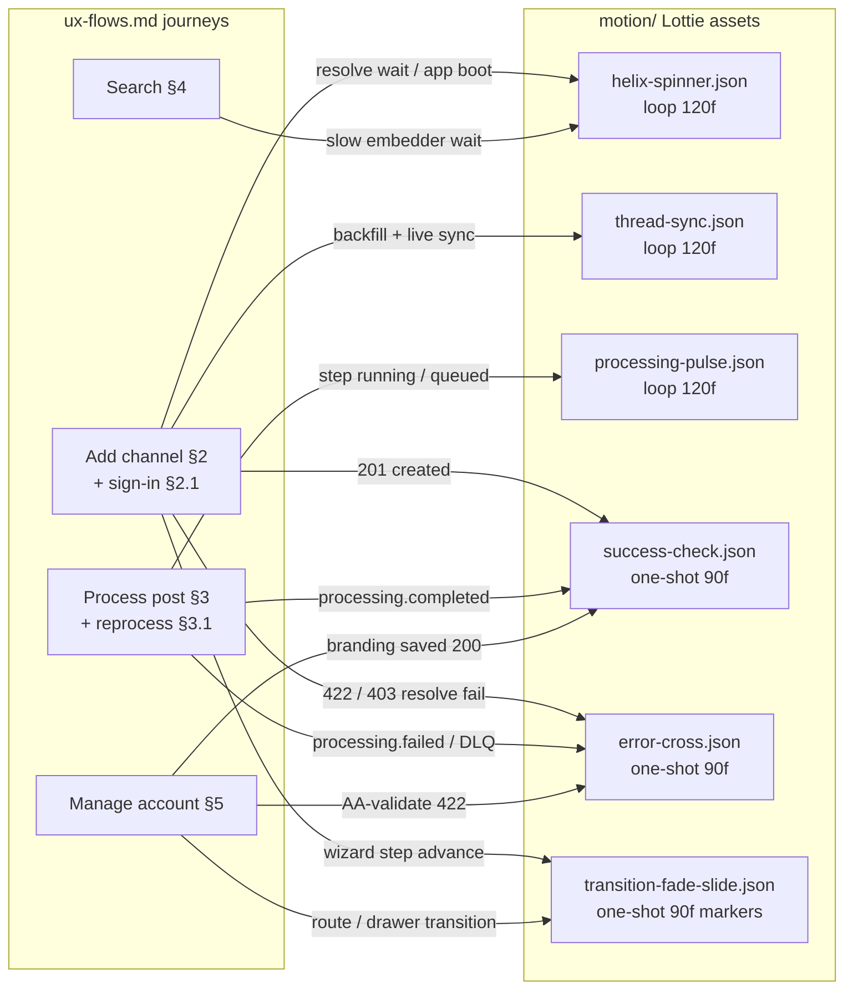

<!--
  Title           : Helix Thready — Motion Spec & Lottie Set
  Classification  : PUBLIC
  Location        : docs/public/research/mvp/design/motion/motion.md
  Status          : Active — v1.1
  Revision        : 2 (2026-07-22)
  Author          : Helix Thready documentation swarm (design/motion)
  Related         : ./README.md, ./preview.html, ../design-system.md,
                    ../prototypes.md, ../ux-flows.md, ../../CONVENTIONS.md
-->

# Helix Thready — Motion Spec & Lottie Set

| Rev | Date | Author | Change |
|-----|------|--------|--------|
| 1 | 2026-07-22 | swarm (design/motion) | Initial motion package: duration/easing tokens, six hand-authored Lottie assets, interaction→animation map, reduced-motion contract, runtime integration, honest validation record |
| 2 | 2026-07-22 | swarm (design · motion) | Delivered the five static `reducedMotionFallback` SVGs (geometry derived from the Lottie keyframes at the contract frames); manifest v2 names them; asset half of `THREADY-MOT-03` closed, remainder narrowed (§8); preview.html fallback toggle; validation record extended (§7.7) |

## Table of contents

- [1. Scope & sources of truth](#1-scope--sources-of-truth)
- [2. Duration & easing tokens](#2-duration--easing-tokens)
- [3. The Lottie asset set](#3-the-lottie-asset-set)
- [4. Interaction → animation map](#4-interaction--animation-map)
- [5. Reduced-motion contract (`prefers-reduced-motion`)](#5-reduced-motion-contract-prefers-reduced-motion)
- [6. Runtime integration](#6-runtime-integration)
- [7. Validation record (honest)](#7-validation-record-honest)
- [8. Gaps & open items](#8-gaps--open-items)

## 1. Scope & sources of truth

This package is the concrete motion layer the design area mandates. It does **not**
re-decide anything; it implements:

- **[design-system.md §5](../design-system.md#5-spacing-radius-elevation-motion)** — the two
  shipped motion tokens (`--motion-fast 150ms`, `--motion-base 200ms`) on
  `--ease-standard cubic-bezier(0.2, 0, 0, 1)`, and the rule that **all motion honors
  `prefers-reduced-motion: reduce`** `[VERIFIED — IN-HOUSE: design_system]`.
- **[prototypes.md §6](../prototypes.md#6-motion--transition-spec)** — the extended
  choreography table (route transitions 250–300 ms, skeleton→content cross-fade,
  looped processing pulse, toast timing) and the "lots of Lottie animations"
  requirement with static fallbacks `[OPERATOR]`.
- **[ux-flows.md](../ux-flows.md)** — the four journeys each animation binds to (§4).
- Brand color values are the Thready theme tokens
  ([design-system.md §3.2](../design-system.md#32-the-thready-brand-theme)); the error color is
  the shared `--danger` semantic token — **never** `--accent` — per the a11y contract
  ([design-system.md §6](../design-system.md#6-accessibility-contract)) `[VERIFIED]`.

Everything under `motion/` is hand-authored vector Lottie (v5.x schema, `ty: 4` shape
layers only, zero raster assets). The files partially realize the **Lottie half of
`[OPEN: THREADY-DES-02]`** (Lottie is not a native OpenDesign/Figma export — see §8).

## 2. Duration & easing tokens

Verified tokens come from `tokens/core.css`; extended tokens follow
[prototypes.md §6](../prototypes.md#6-motion--transition-spec) and are `[DEFAULT — adjustable]`.

| Token | Value | Provenance | Use |
|-------|-------|------------|-----|
| `--motion-fast` | 150 ms | `[VERIFIED — core.css]` | control state (hover/press), toast exit, theme crossfade |
| `--motion-base` | 200 ms | `[VERIFIED — core.css]` | enter/exit, disclosure, drawer/sheet slide, toast enter, skeleton→content |
| `--ease-standard` | `cubic-bezier(0.2, 0, 0, 1)` | `[VERIFIED — core.css]` | the only easing curve; every eased Lottie keyframe uses it |
| `--motion-route` | 300 ms | `[DEFAULT]` (250–300 ms band, prototypes §6) | route/page shared-axis transition; `transition-fade-slide.json` runs each card move at exactly 18 f @ 60 fps = 300 ms |
| `--motion-confirm` | 1 500 ms | `[DEFAULT]` | one-shot confirmation choreography (`success-check`, `error-cross`: 90 f @ 60 fps) |
| `--motion-loop-period` | 2 000 ms | `[DEFAULT]` | loop period of the ambient loops (`helix-spinner`, `processing-pulse`, `thread-sync`: 120 f @ 60 fps) |

**Easing in the Lottie files.** Every eased keyframe carries the token curve encoded as
Lottie handles — outgoing `{"x": [0.2], "y": [0]}`, incoming `{"x": [0], "y": [1]}` —
so the assets and the CSS transitions share one acceleration profile. Constant-rate
movement (ripple expansion, dot travel across the thread, the spinner's phase
advance between dense samples) is deliberately linear: a ripple or carrier dot that
eases reads as stalling.

## 3. The Lottie asset set

All files: schema `v: "5.7.4"`, `fr: 60` declared, `ip: 0`, shape layers only,
`assets: []` (no rasters). Colors are the Thready token values in Lottie's 0–1 RGBA
form: lime `#B6E376` = `[0.714, 0.890, 0.463]`, accent `#446E12` = `[0.267, 0.431, 0.071]`,
teal `#ABDDC9` = `[0.671, 0.867, 0.788]`, teal-dark `#B7EBD6` = `[0.718, 0.922, 0.839]`,
brand-ink `#0A0F04` = `[0.039, 0.059, 0.016]`, ink `#020817` = `[0.008, 0.031, 0.090]`,
snow `#F8FAFC` = `[0.973, 0.980, 0.988]`, danger `#DC2626` = `[0.863, 0.149, 0.149]`.

| File | Canvas | Frames | Loop | Structure |
|------|--------|--------|------|-----------|
| `helix-spinner.json` | 512×512 | 120 (2 s) | **loops**, seam-exact | Two sine strands (the double helix seen side-on) as animated bezier paths — 21 phase-sampled shape keyframes per strand advance the phase a full 2π per cycle, which **is** the helix's rotation; strand opacities counter-pulse (100↔70) so front/back dominance alternates as they weave. Lime strand + teal strand, 30 px round-cap strokes. |
| `success-check.json` | 512×512 | 90 (1.5 s) | one-shot | Lime disc pops in (scale 0→108→100, token ease), check draws via trim-path (f22–48), accent ring pings outward (f18–56). Check layer is parented to the disc. Check stroke is `--brand-ink #0A0F04` on the lime fill — 13.15:1, the documented brand-ink pairing `[VERIFIED — design-system §3.2]`. |
| `error-cross.json` | 512×512 | 90 (1.5 s) | one-shot | Danger disc pops in, two snow cross arms draw sequentially via trim-paths (f24–38, f36–52), disc shakes on X (f54–78), danger ring pings. Arms parented to the disc so pop and shake carry them. Error uses `--danger`, never brand `[design-system §6]`. |
| `processing-pulse.json` | 512×512 | 120 (2 s) | **loops**, seam-exact | Lime core breathes (scale 100→114, twice per cycle, token ease); two teal ripple rings expand 100→260 % and fade, staggered 60 f apart. Ring B is ring A phase-shifted with hold-jump keyframes so the loop boundary matches exactly. |
| `thread-sync.json` | 512×256 | 120 (2 s) | **loops**, seam-exact | Messenger node (teal, left) and Thready node (lime, right) joined by a 45 %-opacity teal thread; a lime dot travels → (f0–55) and a teal-dark dot travels ← (f60–115), each fading in/out at the ends; the receiving node bumps 112 % on arrival. |
| `transition-fade-slide.json` | 512×320 | 90 (1.5 s) | one-shot, **markers** | Shared-axis X: outgoing teal card slides −80 px and fades (f15–33), incoming lime card slides in from +80 px (f24–42). Each move is 18 f @ 60 fps = **300 ms — real product timing**, not a slowed demo. Lottie markers `transition-start` (f15, dur 27) and `transition-end` (f42) delimit the playable segment. |

## 4. Interaction → animation map



> Rendered PNG/SVG exported via Docs Chain (§11.4.65). Source: `diagrams/motion-asset-map.mmd`.

**Explanation (for readers/models that cannot see the diagram).** The diagram has two
groups. On the left are the four key journeys from [ux-flows.md](../ux-flows.md): Add
channel (with its messenger sign-in sub-flow), Process post (with reprocess), Search,
and Manage account. On the right are the six Lottie assets in this directory, each
annotated with its loop behavior and frame count. Twelve edges connect journeys to
assets. Add channel uses four: the helix spinner while a link resolve or app boot is
pending, the thread-sync loop while the new channel backfills and streams live posts,
the success check when the API returns `201 channel`, and the error cross when a
resolve fails with `422`/`403`; its wizard step advance uses the fade-slide
transition. Process post drives three: the processing pulse for a queued or running
pipeline step (including a reprocess in flight), the success check on
`processing.completed`, and the error cross on `processing.failed` or a dead-letter
surfaced in the UI. Search uses the spinner only for the degraded slow-embedder wait
(its normal loading state is a skeleton, not a spinner). Manage account uses the
success check on a `200` branding save, the error cross on a `422` AA-validation
failure, and the fade-slide transition for route/drawer navigation.

The full interaction table, including the non-Lottie motion the tokens already cover:

| Interaction (journey ref) | Animation | Timing | Notes |
|---------------------------|-----------|--------|-------|
| App boot / route-level load | `helix-spinner` loop | 2 s loop | the "launcher-spiral loader" of prototypes §6; centered, ≤ 128 px |
| Add channel: `channels:resolve` pending ([ux §2](../ux-flows.md#2-add-channel)) | `helix-spinner` small (48 px) | loop | inline next to the Resolve button |
| Add channel: `201` created ([ux §2](../ux-flows.md#2-add-channel)) | `success-check` | 1.5 s one-shot | in the wizard's final step, then auto-advance to the channel row |
| Add channel: `422`/`403` resolve fail | `error-cross` at 48 px | one-shot, plays once | beside the inline `--danger` field message; never replaces the text reason |
| Channel backfill / live sync ([ux §2](../ux-flows.md#2-add-channel) "sync begins (live)") | `thread-sync` loop | 2 s loop | in the channel row / sync banner while `post.received` events stream |
| Messenger session established ([ux §2.1](../ux-flows.md#21-messenger-sign-in-sub-flow)) | `success-check` | one-shot | on `SessionReady → Persisted` |
| Sign-in bad code / bad password ([ux §2.1](../ux-flows.md#21-messenger-sign-in-sub-flow)) | none — field-level `--danger` text only | `--motion-fast` color | a retry loop is not an event; reserving `error-cross` for terminal failures keeps it meaningful |
| Pipeline step queued/running ([ux §3](../ux-flows.md#3-process-post)) | `processing-pulse` loop | 2 s loop | per-step in Post detail §3.6 + Dashboard queue rows |
| Reprocess in flight ([ux §3.1](../ux-flows.md#31-reprocess-sub-flow)) | `processing-pulse` loop | loop | `409 already processing` shows a toast (slide, `--motion-base`) — **no** error-cross; it is a benign race |
| `processing.completed` ([ux §3](../ux-flows.md#3-process-post)) | `success-check` in the completion toast | one-shot | assets appear with skeleton→content cross-fade (200 ms) |
| `processing.failed` / dead-letter ([ux §3](../ux-flows.md#3-process-post)) | `error-cross` | one-shot | next to the surfaced retry-step affordance |
| Search wait ([ux §4](../ux-flows.md#4-search)) | skeleton (CSS), **not** a spinner | 200 ms cross-fade | `helix-spinner` only appears in the degraded slow-embedder timeout state |
| Branding save `200` ([ux §5](../ux-flows.md#5-manage-account)) | `success-check` | one-shot | with the audit-logged toast |
| Branding save `422` AA-fail ([ux §5](../ux-flows.md#5-manage-account)) | `error-cross` at 48 px | one-shot | beside the contrast-ratio message + suggestion |
| Route/page navigation, wizard steps | `transition-fade-slide` pattern | 300 ms | implement natively (CSS/Angular animations) per surface; the Lottie file is the canonical reference rendering of the curve/choreography and doubles as an onboarding/demo asset |
| Button/control state, disclosure, toasts, theme toggle | CSS tokens only | 150/200 ms | no Lottie — [design-system §5](../design-system.md#5-spacing-radius-elevation-motion) |

**Motion-with-meaning rules** (from [ux-flows §6](../ux-flows.md#6-cross-flow-ux-principles)):
one ambient loop per view maximum; `error-cross` is reserved for terminal failures
(retries and benign `409` races get text/toast only); confirmations play once and are
never required to understand state — the text/status always carries the meaning.

## 5. Reduced-motion contract (`prefers-reduced-motion`)

Non-negotiable ([design-system §5](../design-system.md#5-spacing-radius-elevation-motion)
`[VERIFIED]`, [prototypes §6](../prototypes.md#6-motion--transition-spec)): motion is
enhancement, never required for meaning. Under `prefers-reduced-motion: reduce`:

| Animation | Reduced-motion behavior | Poster frame |
|-----------|-------------------------|--------------|
| `helix-spinner` | do **not** play; render frozen at the poster frame (a static double-helix mark); the wait state is conveyed by text ("Loading…") | 15 |
| `success-check` | jump straight to the final frame (check fully drawn) — state is shown, nothing moves; an optional 150 ms opacity-only fade is permitted | 89 |
| `error-cross` | jump to the final frame (cross drawn, no shake) | 89 |
| `processing-pulse` | freeze at poster (core mid-breath at 114 %, ring A distinct + ring B faint — the true frame-30 render); progress conveyed by the step label / percentage text | 30 |
| `thread-sync` | freeze at poster; sync progress conveyed by the counter text ("n posts synced") | 30 |
| `transition-fade-slide` | route/step changes become an instant cut (or ≤ 100 ms opacity-only fade); no translation | 89 |

Reference implementation (web, the same gate `preview.html` uses):

```typescript
const reduced = window.matchMedia('(prefers-reduced-motion: reduce)').matches;
const anim = lottie.loadAnimation({
  container, renderer: 'svg',
  loop: meta.loop, autoplay: !reduced,
  animationData,
});
if (reduced) anim.goToAndStop(meta.posterFrame, /* isFrame */ true);
```

**Static fallback SVGs (delivered 2026-07-22).** Each playable animation now ships a
dedicated `reducedMotionFallback` SVG, named per animation in `motion-manifest.json`
(v2) — this closes the asset half of `THREADY-MOT-03` (§8 keeps the narrowed
remainder):

| Animation | Fallback file | Renders |
|-----------|---------------|---------|
| `helix-spinner` | `spiral-static.svg` | the frame-15 poster: strand paths are the exact 50/50 interpolation of the t = 12/18 shape keyframes (their easing is linear); strand opacities 73.7 %/96.3 % are the token ease evaluated at the same frame |
| `success-check` | `check.svg` | final frame 89: disc at rest, check fully drawn; the accent ring ping has opacity 0 there and is omitted |
| `error-cross` | `cross-static.svg` | final frame 89: disc back at 256,256 after the shake, both arms fully drawn; invisible ring ping omitted |
| `processing-pulse` | `pulse-static.svg` | the frame-30 poster **as actually rendered**: core at its keyframed 114 %, ring A at 140 %/45.8 % opacity **and** ring B faint at 220 %/15.5 % (the "one faint ring" wording above is prose shorthand; the file matches the renderer) |
| `thread-sync` | `sync-static.svg` | the frame-30 poster: nodes + thread at rest, carrier dot at x 365.78 — the token ease `cubic-bezier(0.2, 0, 0, 1)` evaluated at frame 30 of its 0–55 f travel |
| `transition-fade-slide` | *none* (`null`) | reduced motion is an `instant-cut` — no fallback artwork exists **by contract** |

Geometry is **not redrawn** — every path/radius/opacity is computed from the Lottie's
own keyframe data at the contract frame (derivations in each SVG's header comment).
Coloring `[DEFAULT — adjustable]`: `style="fill: var(--brand, #B6E376)"`-form —
literal fallbacks are the Lottie's baked colors so standalone loads match the
animations; token-bearing pages theme the inlined SVG via the CSS variables (the SVG
analogue of the §6 load-time remap). `currentColor` was rejected: multi-color assets.

Poster-frame freezing remains the **equivalent runtime alternative** where an image
swap is inconvenient (Compose: `LottieAnimation(progress = posterProgress)`;
iOS: `currentFrame = poster`) — both paths render the same state by construction.

## 6. Runtime integration

Runtimes per [prototypes.md §6](../prototypes.md#6-motion--transition-spec):
`lottie-web` (web + Tauri 2 desktop wrapping the Angular UI), `lottie-compose`
(KMP/Android), `lottie-ios`. The TUI does **not** consume Lottie — its equivalents are
Lipgloss spinner/progress primitives themed by the token bridge
([design-system §7](../design-system.md#7-per-platform-fan-out)).

- **Loop config:** `helix-spinner`, `processing-pulse`, `thread-sync` → `loop: true`
  (all three are seam-exact: the frame-120 state equals frame 0, verified in §7).
  `success-check`, `error-cross` → `loop: false`, play once per event.
- **Segment playback:** `transition-fade-slide` carries markers; play
  `[15, 42]` (`transition-start` → `transition-end`) when using it as a real overlay,
  or full range as a demo/onboarding asset.
- **Sizing:** vector — render at any size; intended in-product sizes: spinner 48–128 px,
  pulse 24–48 px (inline step indicator), check/cross 48–96 px, thread-sync banner
  height 48–64 px.
- **Theming (honest limitation).** The JSONs carry literal Thready colors — Lottie has
  no CSS-variable binding. The lime/teal set is tuned for **dark surfaces** (lime *is*
  the dark accent, 13.56:1 on `#020817` `[VERIFIED — design-system §3.4]`); on light
  surfaces lime is decorative (1.47:1) and load-bearing loading states should either sit
  on `--surface-warm`/a dark stage, or remap lime→`#446E12` at load time. Because every
  color is a plain `[r, g, b, 1]` array, a load-time remap is trivial and lossless:

```typescript
// Light-theme remap: lime -> AA accent, before loadAnimation. [DEFAULT — adjustable]
const LIME = [0.714, 0.890, 0.463], ACCENT_LIGHT = [0.267, 0.431, 0.071];
function retint(node: unknown): void {
  if (Array.isArray(node)) { node.forEach(retint); return; }
  if (node && typeof node === 'object') {
    const p = node as Record<string, unknown>;
    const k = (p['c'] as Record<string, unknown> | undefined)?.['k'];
    if ((p['ty'] === 'fl' || p['ty'] === 'st') && Array.isArray(k)
        && LIME.every((v, i) => Math.abs((k[i] as number) - v) < 1e-3)) {
      (k as number[]).splice(0, 3, ...ACCENT_LIGHT);
    }
    Object.values(p).forEach(retint);
  }
}
```

- **White-label:** the same remap is the per-Account brand hook
  ([theming](../theming.md)) — replace lime/teal with the Account's `--brand`/`--brand-2`
  at load; the error cross always keeps `--danger` (semantic, never white-labeled).

## 7. Validation record (honest)

Executed on 2026-07-22 on the authoring host (scripts in the session scratchpad;
deterministic generator, re-runnable):

1. **JSON parse** — `python3 json.load` over all six files: **PASS** (all parse).
2. **Structural lint** (custom validator): required top-level keys
   (`v fr ip op w h layers`) present; `v` is 5.x; `fr` = 60 declared; frame counts
   90–120 (within the 60–180 requirement); every layer is `ty: 4` with a non-empty
   `shapes` array and a full `ks` transform; keyframe times strictly monotonic;
   every color component within [0, 1]; `assets` empty (no rasters); and for the
   three loopers a **loop-seam check** — the rendered state at `ip` equals the state
   at `op` (properties may differ only where the owning layer has opacity 0 at both
   edges): **PASS, all six**. Two genuine defects were caught and fixed by this
   gate during authoring (a 1-ulp floating-point seam mismatch in the spinner's
   phase wrap; an over-strict seam rule superseded by the visibility-aware one).
3. **Real renderer** — **lottie-web 5.13.0** (SVG renderer) headless under jsdom
   (with a canvas-context stub; the SVG renderer does not draw to canvas): every file
   loads, seeks frames 0 / ¼ / ½ / end without exceptions and produces real SVG path
   geometry: **PASS, all six**.
4. **Animation-progression assertions** under the same renderer: the spinner strand
   path **morphs** between frames; the check and cross trim-paths **grow** while
   drawing; the pulse ring transform **expands** (scale 1.13 → 2.33 between f10 and
   f100); the fade-slide card **translates and fades** (x 277 → 256, opacity 0.73 → 1
   between f30 and f42); thread-sync node bump **scales** on arrival: **PASS**.
5. **`preview.html` smoke test** — the assembled page booted under jsdom
   (matchMedia polyfilled — a jsdom gap, present in all real browsers): 6 cards,
   6 live SVG stages, 27 rendered paths: **PASS**.
6. **Real-browser render (headless Chromium, Blink/Skia compositor)** — a contact
   sheet of all six files at six frame positions on light **and** dark stages, plus
   the assembled `preview.html` in light, explicit-dark (`data-theme="dark"`), and
   forced `prefers-reduced-motion` modes, was screenshot-rendered and reviewed:
   the strands weave and swap depth, the check/cross trim-paths draw, rings expand,
   sync dots shuttle both directions, cards cross-fade on axis; under reduced
   motion every asset loads frozen on its poster frame with the explanatory note
   shown; no console errors: **PASS**.

7. **Static fallback SVGs (rev 2, 2026-07-22)** — the five `reducedMotionFallback`
   files: values (interpolated strand paths, eased opacities, dot position, ring
   scales) computed from the Lottie keyframe data with the file's own easing
   (token curve / linear as encoded), **not** eyeballed; all five pass
   `xmllint --noout`; `preview.html` re-smoke-tested under jsdom after the
   fallback-toggle addition in both normal and forced-reduced-motion modes:
   6 cards, 6 live SVG stages, 27 rendered paths (unchanged from item 5),
   5 inline fallback SVGs + the instant-cut note card, fallback view auto-engaged
   under reduced motion, toggle flips both ways, no errors: **PASS**.

**Not done** (stated plainly): no review on a **physical display** (headless
Chromium screenshots only); no verification in `lottie-compose` / `lottie-ios` /
skottie (renderer-conformance differences are possible, though only
widely-supported features are used: shape layers, trim paths, hold keyframes,
parenting, markers); no visual-regression baseline captured yet (`ScreenDiff`
bank, `[GAP: 9.3]`); the five fallback SVGs have **not** had an independent
design review or a pixel-level A/B against the frozen Lottie frames (they match
by construction, not by screenshot diff) — kept open in `THREADY-MOT-03` (§8);
the rev-1 Chromium screenshot pass predates the preview's fallback toggle.

## 8. Gaps & open items

- `[OPEN: THREADY-DES-02]` (Lottie half) — **partially delivered**: this set proves
  hand-authored token-true Lottie without the AE/`bodymovin` path and covers the
  functional states. Still open for **illustration-grade** assets (empty-state
  illustrations, onboarding accents per prototypes §6), which need the design-tool
  bridge. The `spiral-loader` / `processing-pulse` / `success-check` ids of the
  prototypes §6 manifest map to `helix-spinner` / `processing-pulse` /
  `success-check` here (see `motion-manifest.json`).
- `[OPEN: THREADY-MOT-01]` — verify all six files in `lottie-compose` and
  `lottie-ios` before mobile ships them.
- `[OPEN: THREADY-MOT-02]` — decide light-theme strategy: load-time remap (§6) vs.
  shipping generated `-light` variants; wire the white-label remap into the
  branding editor preview.
- `[OPEN: THREADY-MOT-03 — narrowed 2026-07-22]` — the **asset half is closed**: the
  five static `reducedMotionFallback` SVGs are delivered, named in the manifest (v2),
  keyframe-derived and xmllint-validated (§5, §7.7). Still open, narrowed to:
  (a) independent design review / pixel A-B of the five statics against the frozen
  Lottie frames on a physical display; (b) the `empty-channels.svg` fallback from the
  prototypes §6 excerpt — blocked on the illustration-grade assets of
  `[OPEN: THREADY-DES-02]`, delivered together with them.
- `[GAP: 9.3]` — add these animations (poster frames per theme) to the `ScreenDiff`
  visual-regression bank once its CI exists.

---

*Made with love ♥ by Helix Development.*
