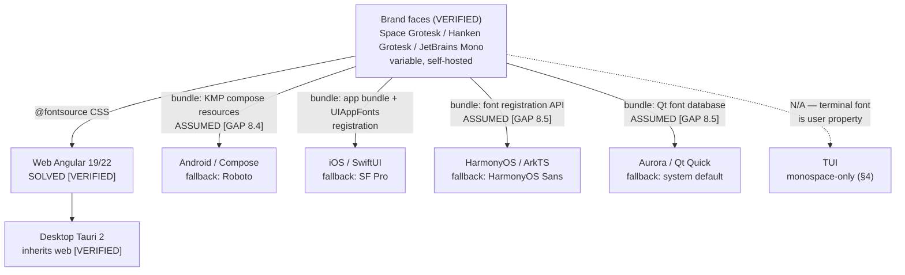

<!--
  Title           : Helix Thready — Per-Platform Typography Substitution
  Classification  : PUBLIC
  Location        : docs/public/research/mvp/design/platforms/typography-substitution.md
  Status          : Draft — v0.1
  Revision        : 2 (2026-07-22)
  Author          : Helix Thready documentation swarm (design · platforms)
  Related         : ./README.md, ../design-system.md (§4), ../opendesign/DESIGN.md (§3),
                    ../library/platform-map.md, ../screens/tui/lipgloss-theme.md,
                    ../../CONVENTIONS.md
-->

# Helix Thready — Per-Platform Typography Substitution

| Rev | Date | Author | Change |
|-----|------|--------|--------|
| 1 | 2026-07-22 | swarm (design · platforms) | Initial spec: brand-face bundling feasibility per platform, honest fallback stacks (`[DEFAULT — adjustable]`), TUI monospace-only reality, Cyrillic discipline (THREADY-DES-04 inherited), dynamic-type mapping of the token ramp; minted `THREADY-DES-PLAT-01/-02/-08` |
| 2 | 2026-07-22 | swarm (design · decisions) | Operator ruling: bundle **all three brand faces on all platforms** (Android/iOS/HarmonyOS/Aurora); `THREADY-DES-PLAT-01` **narrowed** to per-face license/redistribution (OFL) verification; §3 fallback stacks re-labelled **runtime-failure fallbacks only** (no longer the shipping default) |

## Table of contents

- [1. Position & ground truth](#1-position--ground-truth)
- [2. Bundling feasibility per platform](#2-bundling-feasibility-per-platform)
- [3. Fallback stacks per OS (when bundling is not done)](#3-fallback-stacks-per-os-when-bundling-is-not-done)
- [4. TUI: the monospace-only reality](#4-tui-the-monospace-only-reality)
- [5. Cyrillic coverage (ru / sr-Cyrl)](#5-cyrillic-coverage-ru--sr-cyrl)
- [6. Dynamic type / font-scale mapping](#6-dynamic-type--font-scale-mapping)
- [7. Open items](#7-open-items)

## 1. Position & ground truth

The design system ships **three variable brand faces**, self-hosted via `@fontsource` — no
external CDN (offline/CSP posture) `[VERIFIED — design-system.md §4 / fonts/fonts.css]`:

| Role | Token | Face | Canonical stack (verbatim from `core.css` `[VERIFIED]`) |
|------|-------|------|--------------------------------------------------------|
| Display | `--font-display` | Space Grotesk Variable | `"Space Grotesk Variable", ui-sans-serif, system-ui, sans-serif` |
| Body / UI | `--font-body` | Hanken Grotesk Variable | `"Hanken Grotesk Variable", ui-sans-serif, system-ui, sans-serif` |
| Mono | `--font-mono` | JetBrains Mono | `"JetBrains Mono", ui-monospace, "SF Mono", Menlo, monospace` |

That statement is **web truth only**. `@fontsource` packages are npm/CSS artifacts: they solve
Angular 19/22 and, by inheritance, Tauri desktop ("wraps the Angular web UI — no separate token
work", design-system §7 `[VERIFIED]`). No other platform can consume `@fontsource`, and until this
spec, no document said what non-web platforms render text with. The mobile screen artifacts
already ship "with system fallbacks only — fonts are not embedded" (mobile README §1
`[VERIFIED]`), which is the honest current state of the entire non-web fleet.

This spec defines, per platform: (a) how the brand faces **would** be bundled, (b) what renders
when they are **not** (the fallback stacks), and (c) how the token type ramp maps onto each
platform's font-scaling system. **Decided** (operator ruling 2026-07-22): Thready **bundles all
three brand faces on every platform** (Android / iOS / HarmonyOS / Aurora).
`[OPEN: THREADY-DES-PLAT-01]` is **narrowed** to the remaining sub-task — per-face
**license/redistribution verification (the OFL check)** before any bundle ships. The §3
stacks are **runtime failure fallbacks only** (a bundled face failing to load/register),
no longer the shipping default.

> Rendered PNG/SVG exported via Docs Chain (§11.4.65). Source: `diagrams/typography-fanout.mmd`.

**Explanation (for readers/models that cannot see the diagram).** A single top node holds the
three verified brand faces. One solid arrow leads to the **web** node labelled SOLVED — the
`@fontsource` self-hosting path is verified shipped truth — and the **Tauri desktop** node hangs
off web because the desktop client wraps the same Angular UI. Four more solid arrows lead to the
native platforms, each labelled with its bundling mechanism and its honesty marker: **Android**
via KMP compose resources (ASSUMED — the KMP package is a scaffold, `[GAP: 8.4]`), **iOS** via
app-bundle fonts plus `UIAppFonts` registration, **HarmonyOS** via the ArkTS font-registration
API and **Aurora** via the Qt application font database (both ASSUMED — the clients are skeletons,
`[GAP: 8.5]`). Each native node also names the fallback face that renders when bundling is not
done. A single dashed arrow leads to the **TUI** node: no font can be delivered to a terminal at
all — the terminal font is the user's property, and §4 documents which typographic semantics
survive that constraint.

## 2. Bundling feasibility per platform

| Platform | Bundling mechanism | Feasibility | Provenance |
|----------|--------------------|-------------|------------|
| **Web (Angular 19/22)** | `@fontsource` packages, self-hosted; `fonts/fonts.css` | **Already solved** | `[VERIFIED — design-system §4]` |
| **Desktop (Tauri 2)** | Inherits the web bundle (webview loads the same CSS/woff2) | Already solved by inheritance | `[VERIFIED — design-system §7]` |
| **Android (Compose / KMP)** | Ship the variable `.ttf`s as compose-multiplatform font resources (`composeResources/font/`, `Font()` → `FontFamily`); expose as `ThreadyType` alongside the generated `ThreadyColors` token bridge | Feasible; **mechanism ASSUMED** — `UI-Components-KMP` is a utilities-only scaffold with no type bridge `[GAP: 8.4]`; the codegen is part of `THREADY-DES-KMP-01` | ASSUMED |
| **iOS (SwiftUI, KMP host)** | Bundle `.ttf`s in the app bundle + register under the `UIAppFonts` ("Fonts provided by application") `Info.plist` key; reference by PostScript name via `Font.custom(_:size:)` | Feasible; standard platform mechanism `[RESEARCH]`; untested for Thready — no iOS target builds today `[GAP: 8.4]` | ASSUMED |
| **HarmonyOS (ArkTS)** | Ship `.ttf`s in `resources/rawfile/fonts/` + register at app start via the ArkTS font-registration API (`@ohos.font` → `font.registerFont({familyName, familySrc})`), then use the family name in text styles | Plausible; **API name and behavior ASSUMED** — nothing HarmonyOS-side is verified `[GAP: 8.5]` `[OPEN: THREADY-DES-PLAT-03]` | ASSUMED |
| **Aurora (Qt Quick / Silica)** | Ship `.ttf`s as app resources + register via the Qt font database (`QFontDatabase::addApplicationFont` / QML `FontLoader`), then set `font.family` | Plausible; Qt mechanism is standard `[RESEARCH]`, but Aurora packaging/licensing constraints unverified `[GAP: 8.5]` `[OPEN: THREADY-DES-PLAT-05]` | ASSUMED |
| **TUI** | **N/A** — a terminal application cannot deliver a font; the glyph repertoire and face are properties of the user's terminal emulator | Not applicable by construction — see §4 | `[VERIFIED — nature of the medium]` |

**License note (do not skip).** All three faces are distributed under open licenses on the web
path today, but **redistribution inside signed native app bundles (and store listings) must be
re-verified per face before any bundling ships** — that verification (the OFL check) is now the
**entire remaining scope** of `[OPEN: THREADY-DES-PLAT-01]` (narrowed 2026-07-22; the
bundling decision itself is made). No claim of cleared redistribution is made here.

**Variable-font caveat.** The web ships *variable* faces (one file, `wght` axis — design-system
§4). Native text stacks differ in variable-font axis support; if a platform's renderer handles
the axis poorly, the fallback is static instances at the used weights (400/500/600/700), at the
cost of extra files. Decide per platform at integration — an implementation detail of the
decided bundling, not part of the narrowed `THREADY-DES-PLAT-01`.

## 3. Fallback stacks per OS (when bundling is not done)

**Role of these stacks — runtime failure fallbacks only.** Operator ruling 2026-07-22: the
brand faces are bundled on all platforms, so fallback-first is **no longer the shipping
default**. Each row below defines what renders when a bundled face fails to load/register at
runtime — and what the mobile screen artifacts happen to render today ("system fallbacks
only", mobile README §1) until the bundles land. None is claimed to carry the brand voice,
and none is claimed verified for Cyrillic (§5).

| Platform | Display + Body fallback | Mono fallback | Notes |
|----------|------------------------|---------------|-------|
| Android | **Roboto** (system `sans-serif` family) | `monospace` (Droid Sans Mono lineage) | Compose's default `FontFamily.Default`/`Monospace`; OEM overrides possible — accept them |
| iOS | **SF Pro** (system `.body`/`.title` fonts) | **SF Mono** / Menlo (`.monospaced` design) | Matches the web stack's own `ui-sans-serif` / `"SF Mono", Menlo` tail `[VERIFIED — core.css stack]` |
| HarmonyOS | **HarmonyOS Sans** (system default) | system mono | Face name per platform branding `[RESEARCH]`; unverified on device `[GAP: 8.5]` |
| Aurora | **Sailfish/Aurora system default** | system mono | The default UI face of current Aurora OS is **not verified here** — do not hard-code a face name; use the Silica `Theme` font handles and let the OS resolve `[OPEN: THREADY-DES-PLAT-02]` `[RESEARCH]` |
| Web / Desktop | (already solved — never falls back except per-glyph, §5) | — | `[VERIFIED]` |

Rules that hold **regardless** of which face renders:

- The **role separation survives substitution**: display vs. body may collapse to one family on
  fallback (Roboto for both), but the *weight and size* differentiation (headings 600–700 at
  display sizes, body 400–500 — design-system §4) must still render, and mono content (code,
  IDs, hashtags, CLI transcripts) must always get a genuinely monospaced face.
- **Tabular figures** for numeric columns: request tabular numerals where the platform API allows
  (`FontFeature` / `fontFeatureSettings`); where the fallback face lacks them, right-align numeric
  columns so misalignment does not break scanning `[DEFAULT — adjustable]`.
- Fallback rendering is a **known brand deviation, not a bug**: visual-regression banks must
  compare fallback builds against fallback references, not against web renders `[GAP: 9.3]`.

## 4. TUI: the monospace-only reality

The TUI cannot ship, choose, or detect fonts: the terminal renders everything in the **user's one
monospaced face**. Document what survives, so the TUI never fakes what it cannot have:

| Web typographic semantic | TUI survival | Mechanism |
|--------------------------|--------------|-----------|
| Face distinction (display / body / mono) | **Lost** — all text is the terminal mono face | — (accepted) |
| Type scale (12–64px ramp) | **Lost** — one cell size | Hierarchy re-carried by layout: box borders, spacing, position (lipgloss-theme §4 role styles) |
| Weight 500/600/700 | **Degraded** — single terminal bold bit | `lipgloss.Bold(true)` on `Title`/`Header`/`Button` roles `[VERIFIED pattern — lipgloss-theme §4]` |
| Color-carried hierarchy | **Survives** | `Accent`/`Brand2`/`Muted` role styles from the generated palette `[VERIFIED values]` |
| Tabular figures | **Survives inherently** — the mono grid aligns all figures | free |
| Mono-face signalling of hashtags/IDs | **Replaced** — everything is mono, so face no longer signals | `#` prefix + accent tint; indirect tags dimmed **and** suffixed `~` (platform-map §4 `[VERIFIED rule]`) |
| Glyph coverage (♥, ⚠, ✓, box drawing) | **User-dependent** | Ordered fallbacks — e.g. heart: `♥` → the word "love" (brand-assets §8 pattern); never assume Nerd-Font glyphs |
| Cyrillic rendering | **User-dependent** | Cannot be guaranteed by the app; §5 note |

The italic bit, where a style needs emphasis, is also terminal-dependent — prefer color/bold over
italics in TUI styles `[DEFAULT — adjustable]`.

## 5. Cyrillic coverage (ru / sr-Cyrl)

Cyrillic coverage is mandatory `[OPERATOR §12]`, and the verification is **inherited, still
open**: `[OPEN: THREADY-DES-04]` — the Cyrillic subsets of the three brand faces have **not**
been claimed verified anywhere in this area (design-system §4), and this spec does not change
that. This file adds the per-platform half of the same discipline:

- **Per brand face** — verify at integration that the shipped variable file (or its
  `@fontsource` subset build) contains full ru + sr-Cyrl repertoires, *including sr-Cyrl-specific
  italic forms where italics are used*. Until verified, the web stack's per-glyph fallback
  (`system-ui` tail) is the safety net `[VERIFIED — the stack exists; its adequacy is the open
  item]`.
- **Per fallback face** — the §3 stacks are only acceptable if the OS face covers ru + sr-Cyrl.
  Roboto and SF Pro are *expected* to; HarmonyOS Sans and the Aurora default are **unverified
  expectations** — for a Russian-market OS Cyrillic coverage is highly likely, but likelihood is
  not verification. Tracked as `[OPEN: THREADY-DES-PLAT-02]`; **no subset is claimed verified
  here, for any face, on any platform.**
- **TUI** — coverage belongs to the user's terminal font; the TUI must render ru/sr-Cyrl strings
  *as data* and never substitute ASCII transliteration. If tofu appears it is the terminal's,
  not Thready's — but docs should say so (a line in the TUI README at integration).

## 6. Dynamic type / font-scale mapping

The **token type ramp is the reference**: `--text-xs 12 · --text-sm 14 · --text-base 16 ·
--text-lg 20 · --text-xl 24 · --text-2xl 32 · --text-3xl 48 · --text-4xl 64` (px), line-height
1.5 body / 1.2 display `[VERIFIED — design-system §3.1]`. Each platform maps the *same nominal
sizes* into its own user-scalable unit, so a user's system font-size preference scales Thready
text everywhere (the per-platform column of wireframes §6.1 `[VERIFIED table]`):

| Platform | Unit / API | Mapping rule | Provenance |
|----------|-----------|--------------|------------|
| Web / Desktop | CSS px + browser zoom / page zoom | Tokens ship as px `[VERIFIED]`; user scaling via zoom. If OS-level font-size preference must be honored beyond zoom, migrating the ramp to `rem` is a design-system-wide change — out of scope here | `[VERIFIED]` |
| Android (Compose) | `sp` (scale-independent pixels) | **1 token px → 1 sp** (`--text-base 16` → `16.sp`); the OS font-scale multiplier then applies automatically | `[DEFAULT — adjustable]` (wireframes §6.1: "`sp` + font scale") |
| iOS (SwiftUI) | Dynamic Type via `UIFontMetrics` | Do **not** force-fit the ramp onto the fixed text-style sizes; scale each token size relative to `.body`: `UIFontMetrics(forTextStyle: .body).scaledValue(for: tokenPx)` (SwiftUI: `@ScaledMetric(relativeTo: .body)`), so token sizes are exact at the default content size and track Dynamic Type above/below it | `[DEFAULT — adjustable]` (wireframes §6.1: "Dynamic Type") |
| HarmonyOS (ArkTS) | `fp` (font pixels) | **1 token px → 1 fp** (`fontSize: 16` fp); system font scale applies | `[DEFAULT — adjustable]`, API behavior ASSUMED `[OPEN: THREADY-DES-PLAT-03]` |
| Aurora (Qt Quick) | Qt font scaling / Silica `Theme` | Set point sizes from the token ramp at reference density and let Qt/Silica scaling multiply; where Silica exposes `Theme.fontSize*` handles, map the *nearest* token step onto each handle rather than fighting the platform | `[DEFAULT — adjustable]`, ASSUMED `[OPEN: THREADY-DES-PLAT-05]` (wireframes §6.1: "Qt font scaling") |
| TUI | none | No type scale exists (§4) | `[VERIFIED — medium]` |

**Clamp / reflow contract** `[DEFAULT — adjustable]`: every mobile screen must survive **200 %**
font scale without truncating load-bearing text (ellipsis on decorative text is acceptable);
layouts reflow (chips wrap, rows grow) rather than clip. The per-platform maximum each OS
actually applies, and the test matrix proving the 200 % bar, are
`[OPEN: THREADY-DES-PLAT-08]` — no platform's behavior at max scale is claimed verified today.

## 7. Open items

- `[OPEN: THREADY-DES-PLAT-01]` — **narrowed 2026-07-22** (was: the per-platform bundling
  decision). Operator ruling: **bundle all three brand faces on all platforms**
  (Android/iOS/HarmonyOS/Aurora); the §3 stacks are **runtime failure fallbacks only**, no
  longer the shipping default. Remaining scope: **per-face license/redistribution
  verification (the OFL check)** for app-bundle/store shipping — no bundle ships, and no
  non-web surface may claim brand typography, until that verification lands.
  (Variable-vs-static instances stays a per-platform implementation detail at integration,
  §2 caveat.)
- `[OPEN: THREADY-DES-PLAT-02]` — verify **Cyrillic (ru / sr-Cyrl) coverage of each fallback
  face** (Roboto, SF Pro, HarmonyOS Sans, Aurora system default) on real devices/images;
  companion to the inherited `[OPEN: THREADY-DES-04]` (brand-face subsets — still open, still
  unclaimed).
- `[OPEN: THREADY-DES-PLAT-08]` — **dynamic-type clamp matrix**: per platform, the maximum font
  scale the OS applies and evidence every screen survives 200 % per the §6 contract.
- Inherited: `[OPEN: THREADY-DES-04]` (brand-face Cyrillic subsets), `[GAP: 8.4]` /
  `[GAP: 8.5]` (the native packages that would carry any of this do not build today).

---

*Made with love ♥ by Helix Development.*
