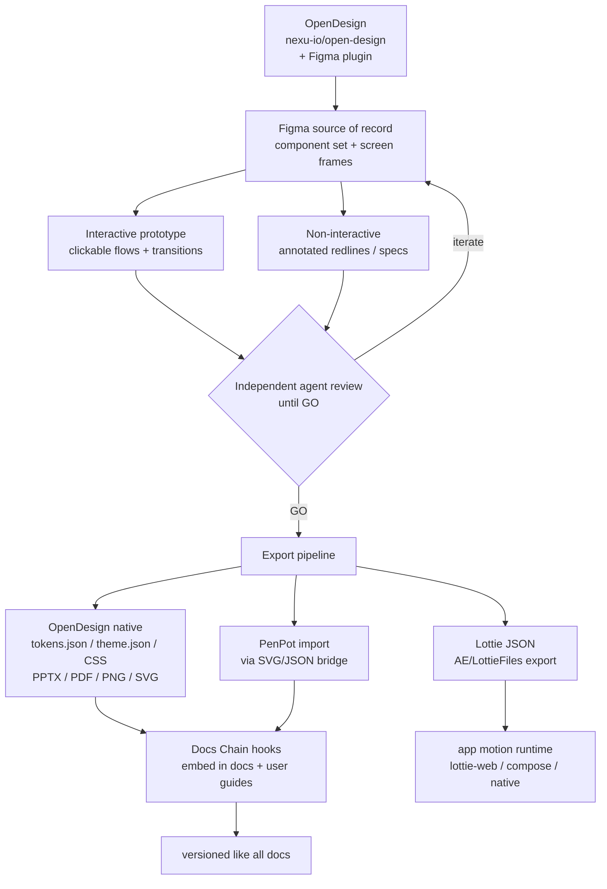

<!--
  Title           : Helix Thready — Prototypes & Motion (Figma · PenPot · Lottie)
  Classification  : PUBLIC
  Location        : docs/public/research/mvp/design/prototypes.md
  Status          : Draft — v0.1
  Revision        : 1 (2026-07-21)
  Author          : Helix Thready documentation swarm (design)
  Related         : ./index.md, ./wireframes.md, ./ux-flows.md,
                    ./design-system.md, ./brand-assets.md, ../CONVENTIONS.md
-->

# Helix Thready — Prototypes & Motion (Figma · PenPot · Lottie)

| Rev | Date | Author | Change |
|-----|------|--------|--------|
| 1 | 2026-07-21 | swarm (design) | Initial complete draft: Figma plan, interactive vs. non‑interactive prototypes, motion/transition spec, export pipeline (Figma/PenPot/PDF/PNG/SVG/Lottie), review loop, Docs Chain wiring |
| 2 | 2026-07-22 | swarm (design · Pass 3) | Depth pass to parity with the rest of the area: **corrected the unverified "first‑party Figma plugin" claim** to an explicit assumption + a source‑confirmed fallback bridge (§2, §7); added the **interactive‑prototype coverage & traceability matrix** (§4.1, every journey → screens → flow → states/motion → surfaces); added **prototype verification & runtime evidence** (§8.1, the anti‑bluff gate on the review loop); enumerated the design‑relevant subset of the 15 mandated test types the prototypes exercise |
| 3 | 2026-07-22 | swarm (design · package critic) | Wired the plan to the **materialized artifacts now on disk** (new §1.1): the interactive prototype ([`screens/web/index.html`](./screens/web/index.html) + the 30 rendered screens), the non‑interactive set (`exports/png/` 49 renders light+dark 2×, `exports/design-book.pdf` 54 pp), the Lottie catalogue + self‑contained [`motion/preview.html`](./motion/preview.html), and the PenPot/Figma‑IR hand‑off bundles. Plan sign‑off verified in [DESIGN_PACKAGE_REPORT.md](./DESIGN_PACKAGE_REPORT.md). |

## Table of contents

- [1. Requirements (verbatim intent)](#1-requirements-verbatim-intent)
  - [1.1 Materialized artifacts on disk](#11-materialized-artifacts-on-disk)
- [2. Tooling: OpenDesign + Figma (+ PenPot, Lottie)](#2-tooling-opendesign--figma--penpot-lottie)
- [3. Figma source‑of‑record structure](#3-figma-source-of-record-structure)
- [4. Interactive prototypes](#4-interactive-prototypes)
  - [4.1 Interactive‑prototype coverage & traceability matrix](#41-interactive-prototype-coverage--traceability-matrix)
- [5. Non‑interactive prototypes](#5-non-interactive-prototypes)
- [6. Motion & transition spec](#6-motion--transition-spec)
- [7. Export pipeline](#7-export-pipeline)
- [8. Review loop (design ≈ code review)](#8-review-loop-design--code-review)
  - [8.1 Prototype verification & runtime evidence (anti‑bluff)](#81-prototype-verification--runtime-evidence-anti-bluff)
- [9. Docs Chain wiring & versioning](#9-docs-chain-wiring--versioning)
- [10. Deliverables checklist](#10-deliverables-checklist)
- [11. Gaps & open items](#11-gaps--open-items)

## 1. Requirements (verbatim intent)

From the request (§Design) `[OPERATOR]`:

- **Full Figma design + interactive AND non‑interactive prototypes** for every visual client.
- **Designed with OpenDesign** `[CONSTITUTION §11.4.162]`, refined by **multiple independent‑agent
  reviews** (like code review) until UI/UX perfection.
- Materials in **all major formats** — **PenPot, PDF, PNGs, and lots of Lottie animations**.
- **Stunning transition effects** between screens/pages and during UI interactions.
- **Full forms validation, hints, tooltips**; a unique design created exclusively for Thready.
- Materials **connected to the project via all hooks and Docs Chain**, so a change that affects
  client UI/UX propagates.
- **Versioned** like all documentation.

### 1.1 Materialized artifacts on disk

This plan is no longer prospective — the deliverables it specifies are **rendered and present in
the area** (audited in [DESIGN_PACKAGE_REPORT.md](./DESIGN_PACKAGE_REPORT.md)). Map from mandate to
concrete artifact:

| Mandate | Materialized artifact (VERIFIED on disk) |
|---------|-------------------------------------------|
| **Interactive prototype** | [`screens/web/index.html`](./screens/web/index.html) — a journey‑walking shell that embeds the live rendered screens (all 14 web sibling links resolve); the 30 screens across web/mobile/desktop/TUI/marketing are self‑contained, light + dark |
| **Non‑interactive prototype** | [`exports/png/`](./exports/README.md) — 49 PNG renders (light + dark, 2× deviceScaleFactor) · [`exports/design-book.pdf`](./exports/design-book.pdf) — 54‑page portable design book |
| **Lottie motion + transitions** | [`motion/`](./motion/README.md) — 6 Lottie `.json` (incl. `transition-fade-slide.json`), + the self‑contained [`motion/preview.html`](./motion/preview.html) board (vendored lottie‑web, zero network) |
| **PenPot / Figma hand‑off** | [`exports/penpot/`](./exports/penpot/IMPORT.md) (16 SVG + 22 PNG) · [`exports/figma/`](./exports/figma/IMPORT.md) — **28** genuine `.od-figma.json` IR captures (11 291 nodes) + `IMPORT.md` |

The **cloud** side of Figma/PenPot hand‑off (a live `.fig`, a hosted PenPot project) is
**operator‑only** and honestly deferred — see §7 and the report's operator‑action list; nothing here
claims a cloud push occurred.

## 2. Tooling: OpenDesign + Figma (+ PenPot, Lottie)

`[CONSTITUTION + request]` `[Q26]`:

- **OpenDesign** (`nexu-io/open-design`, release 0.13.0 `[VERIFIED]`) is the design‑system **source
  of truth** that drives tokens and generates artifacts. A **first‑party Figma plugin** for the
  token→Figma sync is **assumed but NOT source‑confirmed** — only `export.ts` emitting
  `tokens.json`/`theme.json`/CSS/PPTX/PDF was verified `[VERIFIED — export.ts]`. Treat the plugin as
  `[ASSUMPTION — verify at integration]`; if it does not exist, the **source‑confirmed fallback** is to
  import `tokens.json` into **Figma Variables** (the tokens map 1:1 to Figma variable collections/modes,
  §3), so the design→code token sync does not depend on an unverified plugin.
- **Figma** is the **source of record** for the component set and screen frames + the interactive
  prototype layer (in‑house standard `[IN-HOUSE]`).
- **PenPot** — required by the request but **not currently used anywhere in the org**; introduced
  for Thready. **PenPot is not a native OpenDesign export target** `[VERIFIED — export.ts emits
  tokens.json/theme.json/CSS/PPTX/PDF only]` → a bridge is required `[OPEN: THREADY-DES-02]`.
- **Lottie** — required (motion), also **not a native OpenDesign/Figma‑plugin export**; produced via
  an After Effects/`bodymovin` or a Figma‑to‑Lottie plugin path → tracked in §7.

> **Honesty.** OpenDesign natively emits `tokens.json`, `theme.json` (antd), CSS vars, and
> screenshot‑backed **PPTX/PDF**. **PDF/PNG/SVG** are reachable (PDF native; PNG/SVG via Figma or
> `svgo`/`sharp`). **PenPot and Lottie need an added bridge** — this doc specifies the bridge; it
> does not pretend the export is one click today.

## 3. Figma source‑of‑record structure

`[DEFAULT — adjustable]` — one Figma project, four files:

| Figma file | Contents |
|------------|----------|
| **Thready · Foundations** | Token styles (colors from `thready` theme, type, spacing, radius, elevation, motion), light+dark variables, grid |
| **Thready · Components** | The component set (§ component-library.md §5) — every composite as a Figma component with all variants/states, bound to the token styles |
| **Thready · Screens** | Every screen frame from [wireframes.md](./wireframes.md) at phone/tablet/desktop, light+dark, per surface (Web, Desktop, Mobile per platform) |
| **Thready · Flows** | The interactive prototypes wiring screens into the four journeys ([ux-flows.md](./ux-flows.md)) |

Figma **variables/modes** carry the two theming axes (mode: light/dark; brand: Thready + a
white‑label sample) so a reviewer flips a mode instead of duplicating frames — mirroring the runtime
token model exactly.

## 4. Interactive prototypes

Clickable, transition‑rich prototypes for each **key journey** (the four in ux-flows.md), per
surface:

| Prototype | Covers | Surfaces |
|-----------|--------|----------|
| **Add channel** | wizard steps, sign‑in, resolve preview, live sync start | Web, Mobile |
| **Process post** | queue → per‑step progress → completion/retry (live states mocked) | Web, Mobile, TUI (recorded) |
| **Search** | query → semantic/keyword/hybrid → results → open | Web, Mobile |
| **Manage account** | switch, invite, branding editor + AA meter, billing | Web |

Each interactive prototype demonstrates: real state transitions (empty→skeleton→content), form
validation/hints/tooltips, error/retry, theme toggle (light↔dark), language switch (en/ru/sr‑Cyrl),
and the motion spec (§6). They are the artifact the independent‑agent review (§8) evaluates.

### 4.1 Interactive‑prototype coverage & traceability matrix

Each prototype is not free‑standing — it traces to the exact **wireframe screens** (structural
contract) and the **UX flow** (behavioral contract) it makes clickable, and it must exercise the full
interaction‑state set (the shared legend, [wireframes §1.1](./wireframes.md#11-interaction-state-legend))
and the motion tokens it invokes (§6). This matrix is the checklist the review gate (§8) scores against,
so no journey ships with a missing state or an off‑spec transition `[DEFAULT — adjustable]`:

| Journey (prototype) | Wireframe screens | Flow (source of truth) | States exercised | Motion (§6) | Surfaces |
|---------------------|-------------------|------------------------|------------------|-------------|----------|
| **Add channel** | [§3.4 wizard](./wireframes.md#34-channels-list--add-channel-wizard) + [§3.11 messenger sign‑in](./wireframes.md#311-settings--branding--messenger-accounts) | [ux §2](./ux-flows.md#2-add-channel) + [§2.1](./ux-flows.md#21-messenger-sign-in-sub-flow) | default · validating (Resolve) · resolved‑preview · error (`422`/`403`) · success (optimistic add) | disclosure/step slide, toast enter | Web, Mobile |
| **Process post** | [§3.6 post detail](./wireframes.md#36-post-detail-processing) + Dashboard queue | [ux §3](./ux-flows.md#3-process-post) + [§3.1 reprocess](./ux-flows.md#31-reprocess-sub-flow) | queued · running (per‑step %) · done · failed+retry · `409` already‑running | processing pulse (looped Lottie), progress fill | Web, Mobile, TUI (recorded) |
| **Search** | [§3.7 search](./wireframes.md#37-search) | [ux §4](./ux-flows.md#4-search) | idle (recent) · skeleton · content · empty · degraded (`--warn`, hash‑embedder `[GAP: 2.1]`) · timeout | skeleton→content cross‑fade | Web, Mobile |
| **Manage account** | [§3.10 admin](./wireframes.md#310-admin-accounts-users-billing-audit) + [§3.11 branding](./wireframes.md#311-settings--branding--messenger-accounts) | [ux §5](./ux-flows.md#5-manage-account) | default · dirty · previewing · validating · `422` AA‑fail · success (audit‑logged) | drawer slide, live‑preview re‑tint, toast | Web |

Two honesty constraints the matrix carries forward from the wireframes/flows: the **Process‑post** and
**Search** prototypes must render the *stub‑degraded* states (MeTube poll‑only `[GAP: 6.5]`, no‑OCR
`[GAP: 2.6]`, hash‑embedder `[GAP: 2.1]`) — a prototype that only shows the happy path would misrepresent
what ships today. The **TUI** track for Process‑post is a *recorded* walkthrough (asciinema/VHS), not a
Figma click‑through, because the TUI's realization is Lipgloss, not Figma
([wireframes §5](./wireframes.md#5-tui)).

## 5. Non‑interactive prototypes

Static, annotated deliverables (for spec/handoff/docs):

- **Redlines / measure specs** — spacing, sizes, token references per screen.
- **State sheets** — every component's states side‑by‑side (default/hover/focus/active/disabled/
  error) in light + dark.
- **Screen catalog** — PDF/PNG of every frame, per surface + breakpoint.
- **Annotated flows** — the ux‑flows diagrams overlaid on real frames (the request's "Figma exported
  screens with additional layers over it" for documentation).

## 6. Motion & transition spec

Grounded in the two shipped motion tokens (§ design-system.md §5) and extended for choreography
`[DEFAULT — adjustable]`:

| Interaction | Motion | Duration / easing |
|-------------|--------|-------------------|
| Button/control state | color/shadow | `--motion-fast` 150ms · `--ease-standard` |
| Disclosure / drawer / sheet | slide + fade | `--motion-base` 200ms · standard |
| Route/page transition | shared‑axis / fade‑through | 250–300ms `[DEFAULT]` |
| Skeleton → content | cross‑fade + subtle rise | 200ms |
| Processing pulse | looped Lottie (indeterminate) | seamless loop |
| Toast enter/exit | slide‑in + fade | 200ms in / 150ms out |
| Theme toggle | crossfade tokens | 150ms (instant if reduced‑motion) |

**Lottie usage** ("lots of Lottie animations"): the launcher‑spiral loader (the Thready spiral
drawing itself), the processing indeterminate pulse, empty‑state illustrations, success checkmarks,
and onboarding accents. Every animation ships a **static fallback** and is **skipped/frozen under
`prefers-reduced-motion`** — motion is enhancement, never required for meaning.

```json
// Lottie asset manifest (excerpt) [DEFAULT — adjustable]
{
  "animations": [
    { "id": "spiral-loader",     "loop": true,  "reducedMotionFallback": "spiral-static.svg" },
    { "id": "processing-pulse",  "loop": true,  "reducedMotionFallback": "pulse-static.svg" },
    { "id": "empty-channels",    "loop": false, "reducedMotionFallback": "empty-channels.svg" },
    { "id": "success-check",     "loop": false, "reducedMotionFallback": "check.svg" }
  ],
  "runtime": { "web": "lottie-web", "compose": "lottie-compose", "ios": "lottie-ios" }
}
```

## 7. Export pipeline



> Rendered PNG/SVG exported via Docs Chain (§11.4.65). Source: `diagrams/prototype-export-pipeline.mmd`.

**Explanation (for readers/models that cannot see the diagram).** OpenDesign seeds tokens into Figma
— via its Figma plugin **if that plugin exists** (assumed, not source‑confirmed, §2), otherwise via a
`tokens.json` → Figma Variables import — making Figma the source of record for the component set and
screen frames. From Figma two
prototype tracks branch: the interactive (clickable flows with transitions) and the non‑interactive
(annotated redlines/specs). Both feed the independent‑agent review gate, which iterates back into
Figma until it returns GO (§8). On GO, the export pipeline runs. Native OpenDesign/Figma exports
produce `tokens.json`, `theme.json`, CSS vars, and screenshot‑backed PPTX/PDF, plus PNG/SVG. Two
required formats are **not native** and go through added bridges: **PenPot** (imported via an
SVG/JSON bridge) and **Lottie** (JSON exported via an After Effects/`bodymovin` or Figma‑to‑Lottie
path). The native + PenPot artifacts flow into Docs Chain hooks so they embed into the docs and user
guides and are **versioned like all documentation**; the Lottie JSON flows into the app motion
runtimes (`lottie-web` on web, `lottie-compose`/`lottie-ios` on mobile). The dotted truth here is the
two bridges — they are the tracked open item `THREADY-DES-02`.

**Export target matrix** `[DEFAULT — adjustable]`:

| Format | Source | Native? | Use |
|--------|--------|:-------:|-----|
| `tokens.json` / `theme.json` | OpenDesign `export.ts` | ✅ | design→code token sync |
| CSS custom properties | OpenDesign `tokensToCssVars` | ✅ | the running theme |
| **PDF** | OpenDesign / Figma | ✅ | screen catalog, spec handoff, docs |
| **PNG** | Figma / `sharp` | ✅ | docs illustrations, store assets |
| **SVG** | Figma / `svgo` | ✅ | icon, scalable illustration |
| **PPTX** | OpenDesign (screenshot‑backed) | ✅ | stakeholder decks |
| **PenPot** | SVG/JSON **bridge** | ❌ bridge | open‑source design portability `[OPEN: THREADY-DES-02]` |
| **Lottie JSON** | AE `bodymovin` / Figma‑to‑Lottie | ❌ added | in‑app motion `[OPEN: THREADY-DES-02]` |

## 8. Review loop (design ≈ code review)

The request mandates design review "like we are doing with code review, until absolute perfection".
Mirror the code‑review process `[CONSTITUTION §11.4.209]`:

- Each prototype/screen set is reviewed by an **independent agent** against an explicit rubric:
  a11y (WCAG AA, keyboard, SR), token fidelity (no off‑token values), state completeness
  (empty/skeleton/error/validation), responsive integrity (phone/tablet/desktop), light+dark parity,
  motion‑with‑meaning + reduced‑motion, localization (en/ru/sr‑Cyrl incl. Cyrillic width), and brand
  correctness (no letters in the icon, attribution present).
- Findings iterate back into Figma; the gate returns **GO** only when the rubric passes — the same
  "iterate to GO" `[CONSTITUTION §11.4.134]` used for code.
- Visual‑regression (`ScreenDiff` + `VisualRegression`) locks the approved frames so later drift is
  caught `[GAP: 9.3]`.

```yaml
# design-review rubric gate (excerpt)
review:
  target: interactive-prototype/add-channel
  checks:
    a11y_AA: pass            # contrast, focus, keyboard, SR names
    token_fidelity: pass      # every color/space value is a token
    states: [default, empty, skeleton, error, validation]  # all present
    responsive: [phone, tablet, desktop]
    themes: [light, dark]
    reduced_motion: honored
    i18n: [en, ru, sr-Cyrl]
    brand: icon-has-no-letters, helix-attribution-present
  decision: GO | ITERATE
```

### 8.1 Prototype verification & runtime evidence (anti‑bluff)

The review gate above is a **rubric**, but per the quality bar `[CONVENTIONS §7]` and the HelixQA
anti‑bluff posture `[CONSTITUTION §11.4.27]` a `GO` is only credible with **runtime evidence** — a
green rubric row must be backed by an artifact, not an assertion. The prototype phase therefore
produces, per journey × surface × theme:

- **Screenshots** of every state in the §4.1 matrix (default/skeleton/empty/error/validating/success),
  light **and** dark, captured from the clickable prototype — the same cells the implementation's
  `ScreenDiff` bank ([design-system §8](./design-system.md#8-visual-regression--a11y-testing)) will later
  lock, so the prototype and the built UI are diffed against **one** baseline.
- **Recorded interaction walkthroughs** (the interactive prototype click‑path; asciinema/VHS for the
  TUI track) proving the transitions actually fire and honor `prefers-reduced-motion`.
- **A contrast/a11y report** per frame (the AA ratios the branding editor and the token themes claim,
  re‑asserted on the rendered pixels, not just the token file).

This makes the prototypes a **testable predecessor** of the component library, not throwaway art: the
frames feed the visual‑regression baseline (`THREADY‑DES‑VR‑01`, `[GAP: 9.3]`) and the adversarial
**Challenges** decks (`THREADY‑DES‑CHAL‑01`, a mandated test type — a 40‑step reply chain, an
all‑`failed` pipeline, RTL/Cyrillic overflow, a 4.5:1‑boundary accent), so a prototype that "looks
done" is only accepted when its evidence exists. The design‑relevant subset of the **15 mandated test
types** `[CONSTITUTION §11.4.27]` the prototype phase exercises: **visual‑regression**, **accessibility**,
**interaction/e2e** (the clickable flows), **localization** (en/ru/sr‑Cyrl width), **responsive**
(phone/tablet/desktop), and **Challenges** scenario banks; the remaining mandated types (unit,
integration, security, performance/load, etc.) attach to the *implementation* the prototype specifies,
in [component-library §9](./component-library.md#9-testing-the-library) and
[../testing/index.md](../testing/index.md).

## 9. Docs Chain wiring & versioning

Per the request ("connected … through Docs Chain … so any change … gets applied") and
`[CONSTITUTION §11.4.65/106]`:

- Exported PNG/SVG/PDF frames are committed under `design/exports/` and **referenced** by the docs
  and user guides; a Docs Chain context re‑propagates on change.
- The `.mmd` diagram sources in `design/diagrams/` render to PNG/SVG via Docs Chain (already the
  convention for every diagram in this area).
- Design artifacts are **versioned like all docs** (revision headers, all‑upstreams push §2.1);
  Figma file versions are tagged to the doc revision so a doc rev pins the design it describes.

```yaml
# .docs_chain/contexts/design.yaml (proposed)  [DEFAULT — adjustable]  [GAP: 10.1 docs_chain tooling]
context: design
watch:
  - docs/public/research/mvp/design/**/*.md
  - docs/public/research/mvp/design/diagrams/**/*.mmd
  - docs/public/research/mvp/design/exports/**
emit: [html, pdf]           # md ↔ HTML/PDF siblings (needs pandoc/weasyprint on host)
on_change: repropagate      # a token/frame change updates dependent docs
```

> **Honesty.** Docs Chain honestly **SKIPs** md→HTML/PDF when `pandoc`/`weasyprint` are absent
> (as on the current authoring host) `[GAP: 10.1 docs_chain]`; provision them on the dev host to
> emit siblings.

## 10. Deliverables checklist

A prototype phase is **done** only when all are present and GO‑reviewed:

- [ ] Figma: Foundations + Components (all states) + Screens (all surfaces × breakpoints × light/dark)
      + Flows.
- [ ] Interactive prototypes for the four journeys × surfaces.
- [ ] Non‑interactive: redlines, state sheets, screen catalog, annotated flows.
- [ ] Motion: Lottie set (§6) with static + reduced‑motion fallbacks.
- [ ] Exports: PDF, PNG, SVG (native); **PenPot** + **Lottie** via bridge.
- [ ] Independent‑agent review = GO; visual‑regression frames locked.
- [ ] Docs Chain wired; artifacts versioned; slogan + attribution present everywhere.

## 11. Gaps & open items

- `[OPEN: THREADY-DES-02]` — **PenPot + Lottie bridges** are BUILD‑NEW (not native OpenDesign
  exports). Workable item THREADY‑DES‑EXPORT‑01: build/validate both bridges.
- `[GAP: 9.3 VisualRegression family]` — CI needed to lock approved frames (THREADY‑DES‑VR‑01).
- `[GAP: 10.1 docs_chain]` — provision pandoc/weasyprint so exports+docs get HTML/PDF siblings.
- `[OPEN: THREADY-DES-04]` — Cyrillic width/subset must be validated in the review rubric.
- `[OPEN: THREADY-DES-13]` — decide PenPot's role: mirror of Figma (portability only) vs. a
  co‑equal editing surface (higher maintenance).

---

*Made with love ♥ by Helix Development.*
